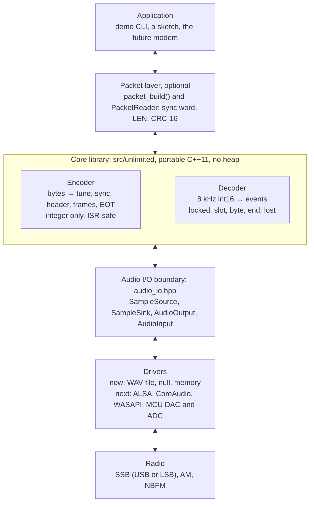
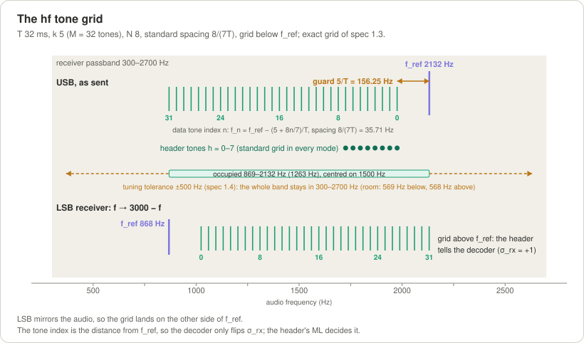
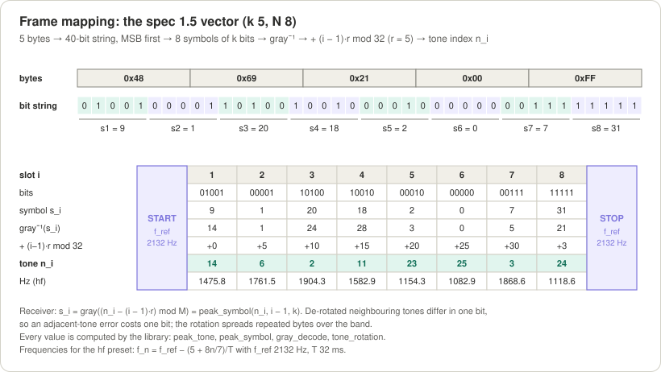
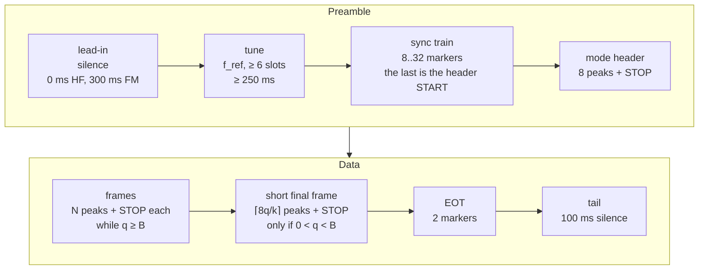
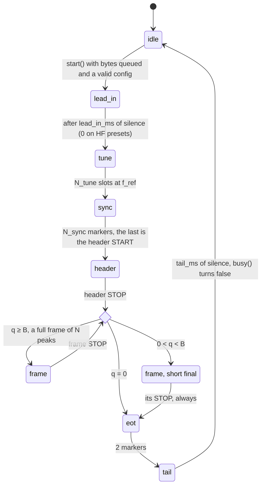
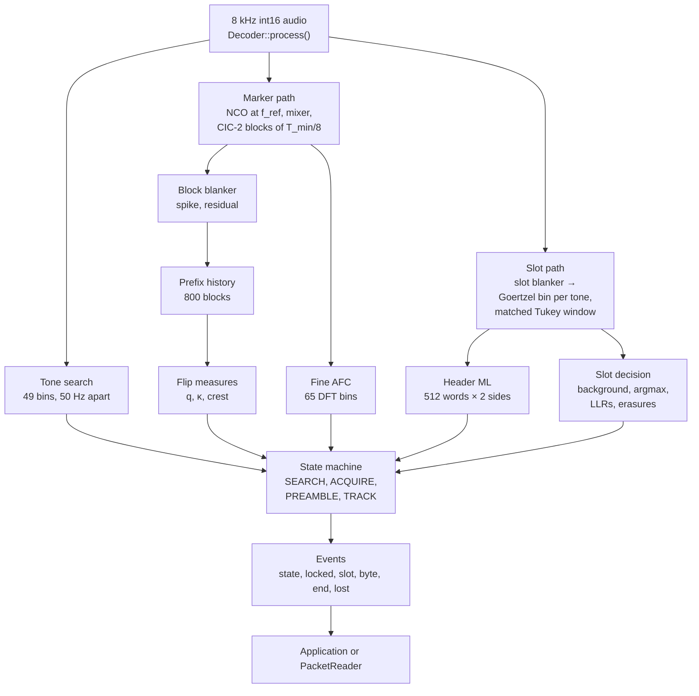
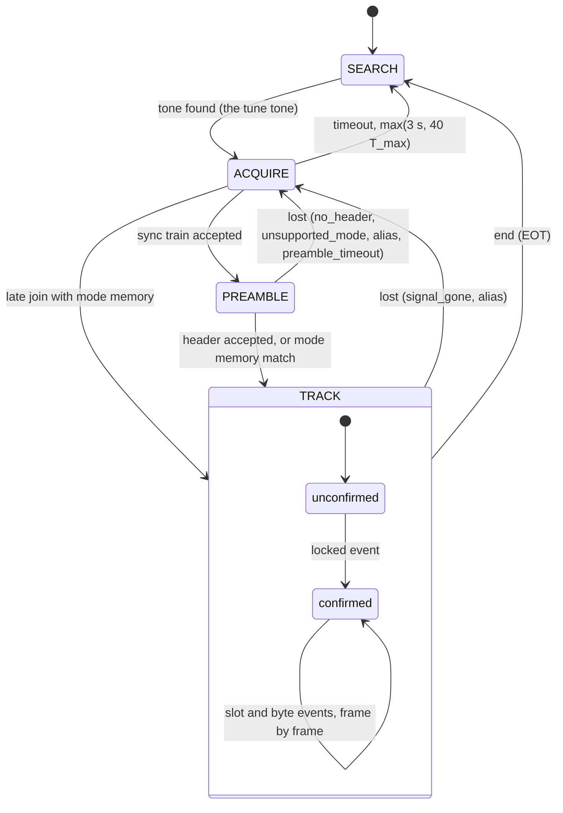
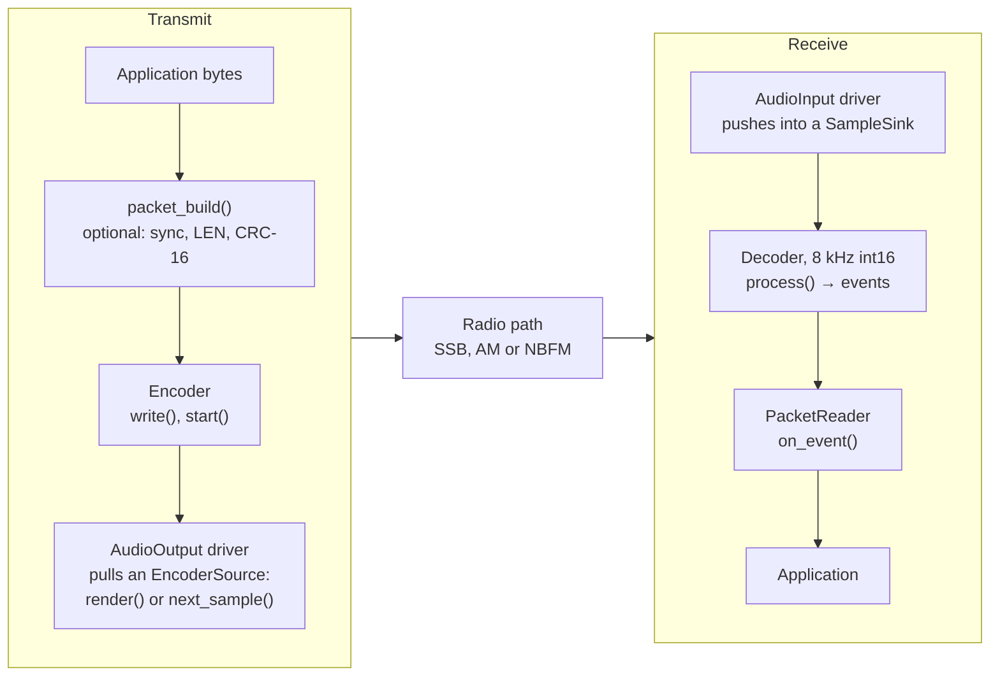
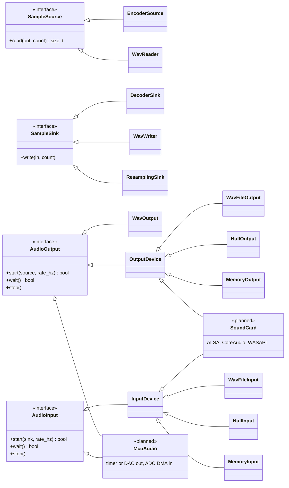

# Unlimited

**A robust tone-peak data modem for HF, VHF and UHF radio audio, in C++11.**

Unlimited sends data through the audio path of an ordinary transceiver: HF SSB (USB or LSB), AM, or VHF/UHF
narrow-band FM. Data rides on tone *peaks*. Each slot of length T carries one smooth, Tukey-shaped peak on one of
2^k tones (k = 1..8 bits per peak). The tones form a grid anchored to a START/STOP marker tone, and the markers carry a
mid-slot phase flip. The sender dictates everything: slot length, bits per peak, frame length, tone spacing and grid
side, all announced in an 8-slot header. The receiver chooses only the range of slot lengths it accepts. It needs no
frequency, speed, mode or sideband setting, and a USB/LSB inversion or a tuning offset only moves or mirrors the grid.
The encoder is integer-only and fits an 8 kHz interrupt on an Arduino Uno; the decoder object takes 12 to 14 KB of
RAM and targets ESP32 and STM32 class MCUs as well as PCs.


*Spectrogram of "CQ DE PY2" sent with the `hf` preset (real encoder audio): the tune tone on f_ref, the sync train of
markers, the 8-peak header on tones 0–7, then one full frame and a short final frame hopping over the 32-tone grid
below f_ref, the two EOT markers and the tail.*

| Preset | T | Bits per peak k (tones) | Net rate | AWGN SNR for BER 1e-3 (genie bench, *measured*) | Integrated decoder gate (*measured*) | Occupied span | Tuning tolerance | Default receiver profiles |
|---|---|---|---|---|---|---|---|---|
| `fm_fast` | 6 ms | 3 (8) | 444 bit/s | FM CNR 4.9 dB | FM CNR 7 dB | 2167 Hz | FM only | `fm` |
| `fm` | 8 ms | 3 (8) | 333 bit/s | FM CNR 2.3 dB | FM CNR 4.5 dB | 1625 Hz | FM only | `fm` |
| `hf_fast` | 16 ms | 4 (16) | 222 bit/s | −3.3 dB | −1.5 dB | 1384 Hz | ±380 Hz | `ssb`, `am`, `fm` |
| **`hf`** (default) | 32 ms | 5 (32) | **139 bit/s** | **−5.9 dB** | **−4.5 dB** | 1263 Hz | ±500 Hz | `ssb`, `am`, `fm` |
| `hf_robust` | 64 ms | 6 (64) | 83.3 bit/s | −8.4 dB | −7.0 dB | 1203 Hz | ±560 Hz | `ssb`, `am` |
| `hf_weak` | 128 ms | 7 (128) | 48.6 bit/s | −11.4 dB | −9.5 dB | 1173 Hz | ±590 Hz | `ssb` (stable paths) |

SNR is the key-down tone power over the noise in 2500 Hz, as in WSJT modes. The *genie* column is the slot detector
alone with known timing and grid. The *integrated gate* is the point where the complete streaming decoder (tone
search, sync, header, tracking) must deliver BER ≤ 1e-3 and ≥ 95% of frames; it measures BER 1e-5 to 1e-4 there. All
numbers come from [`spec.md`](spec.md) §1.4, §4 and from runs of this repository.

> **Status: v0.2** (library 0.2.0). The public API is **frozen**. Every result is from **simulation**: the channel
> simulator in `pc/`, 213/213 unit and loopback tests, and a 28-suite long regression (155 PASS, 87 REPORT and 4 FAIL
> rows, all four FAILs from one open item, see [Known limits](#known-limits)). Unlimited has **not yet been tested
> on hardware or on air.**

## Contents

- [The idea](#the-idea)
- [Quick start](#quick-start)
- [How it works](#how-it-works)
- [Design decisions](#design-decisions)
- [Protocol specification](#protocol-specification)
- [Performance](#performance)
- [Using the API](#using-the-api)
- [Demo CLI and channel simulator](#demo-cli-and-channel-simulator)
- [Embedded targets](#embedded-targets)
- [Testing and quality](#testing-and-quality)
- [Project layout](#project-layout)
- [Roadmap](#roadmap)
- [License and author](#license-and-author)

---

## The idea

### Gustavo's concept

Unlimited is Gustavo Campos's design for moving data through a radio's audio path with as little receiver setup as
possible. His original concept (v0.1):

- **Data in tone peaks.** In v0.1, a `1` was a smooth peak of one tone and a `0` was silence.
- **START and STOP markers as the reference.** Each frame is bracketed by two markers on the same tone and with the
  same crest as a data peak, each carrying a shaped 180° phase reversal in mid-slot so it can never be mistaken for
  data. The markers give the receiver three references at once:
  - *amplitude*: the crest of a `1`. v0.1 decided bits against the START/STOP crest interpolated across the frame,
    adaptively at 50–75% of it, with a fixed **70%** rule selectable;
  - *frequency*: the tone itself, found by the receiver, never configured;
  - *time*: T = (t_STOP − t_START)/9 for a frame `M b7..b0 M`.
- **Speed dictated by the sender.** The receiver measures T from the markers; it is told nothing.
- **Shift-resilient on SSB.** A USB or LSB receiver tuned a few hundred Hz off only moves the tone, so nothing depends
  on absolute frequency.
- **Simple enough for an Arduino.** An integer encoder fed by a sample interrupt, and plain C++11 everywhere.

Gustavo's decisions (spec §0.3) shaped the rest: markers with the same crest as data plus a **tune tone** at the start
of every transmission, **one universal decoder** parametrised only by a profile (`ssb`, `am`, `fm`), a public MIT
repository, a decoder fixed at 8 kHz int16 input, and an encoder small enough for AVR. The standing requirements are:
HF SSB first, the sender dictates everything, **no receiver configuration** beyond the accepted range of T, the decoder
never expects a specific tone, and the code stays readable C++11 for Arduino, STM32 and ESP32.

Both versions went through a design panel (three independent proposals and two judges, every claim measured on the
channel simulator) before Gustavo decided the open questions. The choices and their evidence are recorded in
[`spec.md`](spec.md) §0 and summarised in [Design decisions](#design-decisions).

### From v0.1 to v0.2: multi-bit peaks

v0.1 (single-tone on-off keying) worked, and its measurements showed where it was limited:

| | v0.1 (T = 32 ms, OOK) | **v0.2 `hf`** (T = 32 ms, k = 5) |
|---|---|---|
| Data symbol | 1 bit: a peak or silence on one tone | **5 bits: one peak on one of 32 tones** |
| Net rate | 27.8 bit/s | **138.9 bit/s** (5×) |
| SNR for BER 1e-3 (AWGN, genie, *measured*) | −3.2 dB | **−5.9 dB** |
| Share of the Shannon bound of 2500 Hz at that SNR (*computed*, key-down SNR) | ≈ 2% (27.8 of ≈ 1,411 bit/s) | ≈ 17% (138.9 of ≈ 825 bit/s) |
| CCIR moderate, 30 dB | 4.4e-3 (error floor) | 7.9e-5 genie; integrated 3.7e-5 (*measured*) |
| CCIR poor, 30 dB | 1.6e-2 (error floor) | 3.1e-4 genie; integrated 5.4e-4 at 20 dB (*measured*) |
| Occupied audio band | ≈ 100–300 Hz | 1.26 kHz centred on 1500 Hz |
| Tuning tolerance | any offset | ≈ ±500 Hz (the whole grid must stay in the passband) |
| Receiver configuration | range of T | **range of T only**: k, N, spacing, exact T and USB/LSB orientation come from the header |

The three reasons for the change:

1. **Speed.** One bit per slot wastes the slot. Frequency-shift keying on 2^k tones carries k bits in the same slot
   and the same peak shape.
2. **Efficiency.** At its threshold v0.1 used about 2% of the channel capacity (an order-of-magnitude comparison:
   uncoded BER 1e-3 against error-free capacity). Per unit of *average* power, `hf` needs 0.7 dB more than v0.1 OOK
   but carries 5× the bits: its Eb/N0 is 6.3 dB better (spec §1.3).
3. **Fading floors.** OOK decides amplitude against a reference; inside a Rayleigh fade a `1` falls under the
   threshold whatever the SNR, so the error rate stops falling. v0.2 decides by **argmax over the grid**, which needs no
   threshold, and the floors drop 14–56× in CCIR moderate and 50–260× in CCIR poor at the same T (v0.2 genie against
   the v0.1 decoder, spec §4.2).

What v0.2 kept: the markers (now on f_ref, the anchor of the grid), the tune tone, the sync train, acquisition, AFC,
the impulse blanker, alias protection, profiles, the packet layer, the WAV codec, the audio interfaces and the TUI.
The START/STOP reference now **decides nothing**; it gates marker detection, scales the `level_pct` telemetry (the TUI
still draws the 70% line) and feeds the SNR report. What v0.2 costs is also clear: a wider band, a finite tuning
tolerance, and 100% duty (a peak in every slot: average power 0.81 of PEP, like FT8, against 0.37 for OOK).

---

## Quick start

### Requirements

- A C++11 compiler (clang or GCC) and `make`. There are no third-party dependencies; the PC tools use only the
  standard library. Verified on macOS (Apple clang); Linux and Windows are targets of the code.
- Optional: `arduino-cli` with the `arduino:avr` and `esp32:esp32` cores (for `make arduino_check`); AVR, Xtensa or
  ARM cross compilers for `make check_embedded` (found on `PATH` or inside arduino-cli's bundled toolchains).

### Build and test

```sh
git clone https://github.com/solariun/unlimited.git
cd unlimited
make            # build/libunlimited.a, bin/unlimited_encode, bin/unlimited_decode
make test       # 213 unit and loopback tests, about 28 s
make demo_run   # five encode -> channel -> decode round trips: USB, LSB, AM, FM
```

Everything builds with `-std=c++11 -O2 -Wall -Wextra -Wpedantic -Werror`.

### A round trip through a simulated radio

The encoder can pass its audio through the channel simulator before writing it. The decoder is given nothing but the
audio:

```console
$ bin/unlimited_encode --text "CQ CQ DE PY2 UNLIMITED" --preset hf --channel usb --snr 10 --offset 80 --out rx.wav --clean-out tx.wav
data     22 bytes
signal   hf: T 32 ms  k 5  N 8  standard  grid below  138.9 bit/s, 5 bytes per frame
tones    f_ref 2132 Hz, tone 0 at 1975.8 Hz, tone 31 at 868.6 Hz, band 869..2132 Hz
audio    2.276 s, 18208 samples at 8000 Hz -> rx.wav, level -3.0 dBFS, average -0.92 dB of key-down
clean    -> tx.wav
channel  usb, snr 10.0 dB key-down, 9.1 dB average power, output gain -2.7 dB

$ bin/unlimited_decode --in rx.wav
rx      22 bytes  f_ref 2212.0 Hz  T 32 ms  k 5  N 8  standard  grid below  138.9 bit/s  snr 9.3 dB  slots 39  conf 20.0 dB  erasures 1  end  t 2.220 s
text    "CQ CQ DE PY2 UNLIMITED"
```

The receiver found f_ref 80 Hz higher (the mistuning) and read the mode from the header. The same text over LSB,
generated at 48 kHz, with a mistuning of −150 Hz after the inversion:

```console
$ printf '%s' "CQ CQ DE PY2 UNLIMITED" > expect.txt
$ bin/unlimited_encode --text "CQ CQ DE PY2 UNLIMITED" --preset hf_fast --rate 48000 --channel lsb --snr 10 --offset -150 --out lsb.wav
$ bin/unlimited_decode --in lsb.wav --expect expect.txt
rx      22 bytes  f_ref 658.0 Hz  T 16 ms  k 4  N 8  standard  grid above  222.2 bit/s  snr 9.7 dB  slots 47  conf 18.9 dB  erasures 3  end  t 1.406 s
text    "CQ CQ DE PY2 UNLIMITED"
expect  22 bytes x 1 transmission  received 22  lost 0  wrong 0  extra 0  bit errors 0/176 (BER 0.00e+00)  locks 1  snr 9.7 dB  T 16.00 ms  mode T 16 ms  k 4  N 8  standard  grid above  222.2 bit/s
result  match
```

The sender put f_ref at 2192 Hz with the grid below it. The LSB path mirrored the audio (f → 3000 − f − 150), so the
receiver heard f_ref at 658 Hz with the grid **above** it. The header told it so; nobody configured "LSB".

AM with packet framing (CRC-16), and NBFM:

```console
$ bin/unlimited_encode --text "CQ CQ DE PY2 UNLIMITED" --profile am --preset hf_robust --packet --channel am --snr 10 --out am.wav
$ bin/unlimited_decode --in am.wav --profile am --packet
packet  22 bytes  "CQ CQ DE PY2 UNLIMITED"
rx      28 bytes  f_ref 2102.0 Hz  T 64 ms  k 6  N 8  standard  grid below  83.3 bit/s  snr 5.4 dB  slots 40  conf 18.8 dB  erasures 1  end  t 5.010 s
text    "-\xD4\x00\x16CQ CQ DE PY2 UNLIMITED/\xEA"
packets 1 valid, 0 crc errors

$ bin/unlimited_encode --text "CQ CQ DE PY2 UNLIMITED" --profile fm --channel fm --snr 20 --out fm.wav
$ bin/unlimited_decode --in fm.wav --profile fm
rx      22 bytes  f_ref 2650.0 Hz  T 8 ms  k 3  N 8  standard  grid below  333.3 bit/s  snr 22.6 dB  slots 62  conf 26.2 dB  erasures 0  end  t 1.272 s
text    "CQ CQ DE PY2 UNLIMITED"
```

`--events` prints every decoder event, one line per slot decision included:

```console
$ bin/unlimited_decode --in tx.wav --events
t 0.200  state acquire
t 0.382  state preamble
t 0.803  state track
t 0.835  slot 1/8  frame 0  tone 15  symbol 8  level 103%  conf 28.5 dB  soft -112 112 -112 -112 -112
t 0.867  slot 2/8  frame 0  tone 14  symbol 13  level 103%  conf 32.5 dB  soft -112 112 112 -112 112
...
```

### Terminal view

Both demos have a terminal view (ANSI/VT100 only), and `--realtime` paces file audio to real time:

```sh
bin/unlimited_encode --text "CQ CQ DE PY2 UNLIMITED" --out null --tui --realtime
bin/unlimited_decode --in rx.wav --tui --realtime
```

A frame of the decoder view, captured from the `rx.wav` above (colours removed). It shows the scope, the peaks of the
current frame (f_ref row with the START/STOP markers, each peak at its tone with its level against the 100% START
crest and the 70% line), the spectrum with the grid marked, and the text received so far:

```text
 RX ssb │ TRACK │ 2212.0 Hz │ T 32.00 ms 31.25 Bd │ SNR 9.3 dB
 k5 N8 standard below 138.9 bit/s │ bytes 15 │ lock 1 │ lost 0 │ end 0 │ locked
── scope 64 ms  peak -1.8 dBFS ────────────────────────────────────────────────
⣤⣀⡀⣄⢀⣀⣤⣄⣀     ⢀⣠⣀⣀⣶⣤⣤⡆⢠⣆⣤⣤⣠⣀⣄⣀⣠⣄⣠⣄⣰⣤⣤⣀⣠⣀⣄⣠⣤⣦⣤⣠⣤⣤ ⡀    ⣤⡄⣰⣆⢰⢠⣀⡄⣰⣰⢠⣤⡀⣄⣴⣄⢀⣤⣆⣤⣤⢠⣀⣶⡀
⣿⣿⢿⣿⣿⣿⣿⣿⣿⣿⣷⠞⠶⣶⣿⣿⣿⣿⣿⣿⣿⣿⣿⣿⣿⣿⣿⣿⣿⣿⣿⣿⣿⣿⣿⣿⣿⣿⣿⣿⣿⣿⣿⣿⣿⣿⣿⣿⣿⢿⡷⡷⡿⡿⣿⣿⣿⣿⣿⣿⣿⣷⣿⣿⣿⣿⣿⣿⣿⡿⣾⣿⣿⣿⣿⡿⣿⣿⣿
⠋⠙⠘⠛ ⠉⠙⠿⠁     ⠈⠸⠟⠙⠟⠻⠋⠉⠛⠛⠹⠉⠙⠙⠉⠉⠛⠟⠙⠉⠛⠛⠛⠙⠛⠉⠙⠻⠛⠟⠉⠛⠹⠏⠋     ⠘⠸⠛⠉⠃⠏⠙⠈⠿⠿⠋⢹⡏⠸⠋⠃⠘⠛⠻⠙⠁⠃⠏⠹⠉
── frame 3  slot 2/8  tone 3  symbol 17  level 102%  conf 21.5 dB ─────────────
  31┤
    │
    │      █████
    │
   0┤            █████
 ref┤█████                                                 █████
100%┤┈┈┈┈┈┈┈┈┈┈┈┈┈┈┈┈┈┈┈┈┈┈┈┈┈┈┈┈┈┈┈┈┈┈┈┈┈┈┈┈┈┈┈┈┈┈┈┈┈┈┈┈┈┈┈┈┈┈┈┈
 70%┤█████╌█████╌█████╌╌╌╌╌╌╌╌╌╌╌╌╌╌╌╌╌╌╌╌╌╌╌╌╌╌╌╌╌╌╌╌╌╌╌╌╌█████╌
    │█████ █████ █████                                     █████
slot M     1     2     3     4     5     6     7     8     M
tone       14    3
conf       20    22
── spectrum 300-3000 Hz  grid 949-2056 Hz  peak 1546 Hz -15.0 dBFS ────────────
▁▂ ▃▂▂▁▁▃▂▃ ▃▃▃▃▃▂▃▃▃▃▂▃▂▂▁▂▃▃▂▃▄▂▄▄▆▅▃▃▃▃▃▄▂▄▄▅▆▄▂▄▃▃▄▄▄▃▄▃▃▂▃▃▃▃▂▄▂▂▁
      500           1k             1.5k          2k    ▲        2.5k         3k
── received  15 bytes ─────────────────────────────────────────────────────────
CQ CQ DE PY2 UN
```

### WAV files and a real radio

`--out` writes 16-bit PCM mono WAV at `--rate` (8000–192000 Hz); `--out null` discards the audio. `--in` reads any WAV
(PCM 8/16/24/32-bit, float 32, WAVE_FORMAT_EXTENSIBLE; several channels are downmixed to mono) at any rate,
resampled to the decoder's 8 kHz. To use a real transceiver today, play `tx.wav` into its data or microphone input and record the
receiver's audio into a WAV for the decoder. Set the level with the **tune tone** at the start of each transmission:
full power, ALC not moving. Live sound-card input and output belong to the next phase ([Roadmap](#roadmap)).

### Arduino

The repository root is an Arduino library (`library.properties`, `src/`, `#include <unlimited.h>`):

```sh
arduino-cli compile --fqbn arduino:avr:uno --library . examples/arduino/tx_uno
arduino-cli compile --fqbn esp32:esp32:esp32 --library . examples/arduino/rx_esp32
```

`tx_uno` sends each serial line as a packet from a Uno (PWM audio on pin 9, PTT on pin 8); `rx_esp32` decodes radio
audio from the ESP32 ADC and prints the packets. See [Embedded targets](#embedded-targets).

---

## How it works

### Architecture



- The **core** (`src/unlimited/`) is all an MCU needs: encoder, decoder, packet layer, WAV codec and the driver
  interfaces. It never touches a device, allocates memory or throws.
- **Drivers** own the audio loop: an output driver pulls samples from the encoder, an input driver pushes samples into
  the decoder. The same interfaces serve a WAV file, a sound card or an MCU timer and ADC.
- **PC helpers** (`pc/`) add WAV files on disk, a resampler, the channel simulator and the terminal UI, and the demos
  (`demo/`) are thin command-line programs on top.

### Slots and peaks

Time is divided into slots of length T, a whole number of milliseconds from 6 to 128. Every slot of a transmission
holds exactly one of four things:

| Slot kind | Envelope | Tone | Energy (T·A²/2 units) | Used for |
|---|---|---|---|---|
| silent | 0 | – | 0 | lead-in, tail |
| tune | ramps in and out, flat between | f_ref | ≈ 1 per slot | the start of each transmission: level setting, VOX, tone search |
| **peak** | Tukey α 0.25: 0.125T ramps, 0.75T flat top | one grid tone | 0.84375 | the header and the data |
| **marker** | Tukey α 0.5 × a shaped 180° reversal at mid-slot | f_ref | 0.5625 | sync train, START/STOP, end of transmission |


*A data peak, a START/STOP marker with its mid-slot phase flip, and the start of the tune tone, rendered by the
encoder (`hf` preset, 48 kHz) with the envelopes of spec §1.1 dashed. Peaks and markers have the same crest A: A is the
key-down set point. Every envelope is zero at the slot edges, so there are no key clicks.*

### Markers and the phase flip

A marker is the same tone as the tune tone (f_ref) with a cosine-shaped sign change between 0.375T and 0.625T. The
carrier sign **persists** after it, so the next marker flips it back. The decoder mixes the audio down at f_ref and
compares the complex sums of the two half-windows before and after a candidate centre. A reversal makes them point in
opposite directions, a continuous tone makes them agree:

- q = −Re(S_before·S_after*)/noise: the strength of the reversal;
- κ = −2·Re(S_before·S_after*)/(|S_before|² + |S_after|²): about +1 for a flip, about −1 for a continuous tone.

Data peaks never reverse and never sit on f_ref, so **a flip is always a marker**. That single property drives
acquisition (a train of flips at period T), frame timing (each STOP is predicted and searched), the end of
transmission (two extra flips right after a STOP), and alias protection (a flip found where none should be).

### The tone grid



*The `hf` preset's layout in the 300–2700 Hz receiver passband: f_ref at 2132 Hz, a guard of 5/T, 32 data tones
8/(7T) apart below it, the 8 header tones (the first 8 of the grid), the tuning tolerance, and the mirrored layout an
LSB receiver sees.*

Data tone n (0..M−1, M = 2^k) sits at

```
f_n = f_ref + σ·(5 + n·c)/T        c = 8/7 (standard) or 1 (dense, T ≥ 32 ms)     σ = −1 grid below, +1 above
```

- **Guard 5/T.** It keeps the peaks' spectra away from f_ref, where the markers are measured; of the guards tried,
  5/T gave the fewest alias losses.
- **Spacing 8/(7T).** This is the first spectral zero of the Tukey α 0.25 peak, so neighbouring tones barely leak into
  each other. The dense 1/T spacing is opt-in (T ≥ 32 ms only): it adds one bit per peak and spans about 2.0–2.1 kHz
  instead of 1.2–1.3 kHz.
- **Placement.** HF presets put f_ref at the top, f_ref = ⌈1500 + W/2⌉, with the grid below, so the occupied band is
  centred on 1500 Hz. For `hf` (T = 32 ms): tone 0 at 1975.75 Hz, tone 31 at 868.61 Hz, 35.71 Hz apart. FM presets use
  f_ref 2650 Hz with the grid below.
- **Orientation, not frequency.** A tone's index is its distance from f_ref, so an SSB inversion only flips the side
  σ. The header decides the side the receiver actually sees; the receiver never learns "USB" or "LSB".
- **Tuning tolerance.** The whole band, f_ref included, must stay inside the receiver's passband: ±380 to ±590 Hz for
  the HF presets (gated in fading, test C14), about ±170 Hz for the dense modes (design estimate).

### From bytes to tones



*Bytes → bit string → k-bit symbols → inverse Gray and per-slot rotation → tones, for the bit-exact vector of spec
§1.5.*

A frame carries B = N·k/8 bytes as one MSB-first bit string; data slot i = 1..N takes bits [(i−1)k, ik). The symbol
becomes a tone through an inverse Gray code and a rotation that grows with the slot index:

```
n_i = (gray⁻¹(s_i) + (i−1)·r) mod M        r = (M/8) | 1        receiver: s_i = gray((n̂_i − (i−1)·r) mod M)
```

- **Gray labels.** Cyclically neighbouring tones differ in exactly one bit for every k, so an adjacent-tone error
  (mistuning, Doppler, timing) costs one bit.
- **Rotation.** Repeated bytes spread over the whole band instead of hammering one tone, which protects them against a
  notch or an interferer, and the band edge becomes visible for blind estimation.

The example of spec §1.5 (k = 5, N = 8, bytes `48 69 21 00 FF`, r = 5):

| Slot i | 1 | 2 | 3 | 4 | 5 | 6 | 7 | 8 |
|---|---|---|---|---|---|---|---|---|
| Bits | 01001 | 00001 | 10100 | 10010 | 00010 | 00000 | 00111 | 11111 |
| Symbol s_i | 9 | 1 | 20 | 18 | 2 | 0 | 7 | 31 |
| gray⁻¹(s_i) | 14 | 1 | 24 | 28 | 3 | 0 | 5 | 21 |
| + (i−1)·5, mod 32 → **tone** | **14** | **6** | **2** | **11** | **23** | **25** | **3** | **24** |

### The mode header

After the sync train the sender transmits an 8-slot **mode header**: 9 bits (k − 1, T mod 8 ms, N code, spacing)
coded as 8 tones of an RS(8,3) code over GF(8), one peak per slot on the first 8 grid tones. The receiver scores all
512 words on both sides of f_ref (maximum likelihood) and accepts the best only when it wins by a margin of 12 noise
units and agrees with the strongest tone in at least 6 of the 8 slots. It then knows k, N, the spacing, the side
(USB/LSB orientation) and the **exact** T: its measured T is snapped to the whole millisecond with the right residue
mod 8. The slot order of the code is optimised so a window misplaced by one slot is at least 3 symbols from every
codeword. Details and test vectors: [Mode header](#mode-header-bit-exact).

### Frames, the short final frame and the end

```
[START] d1 d2 … dN [STOP = next START] d1 … dN [STOP] … [short final frame: d peaks + STOP] [EOT EOT]
```

- A frame is N peaks between two markers, N = 8, 16 or 32; each STOP is the next frame's START, so the marker
  overhead is 1/(N+1).
- At every frame boundary the encoder counts the bytes q waiting in its queue: q = 0 ends the transmission, q ≥ B sends
  a full frame, and 0 < q < B sends a **short final frame** of d = ⌈8q/k⌉ peaks (the unused bits of the last peak are
  0), always followed by the end. No padding bytes are ever sent.
- The end of transmission (EOT) is two more markers right after the final STOP. Data slots never flip, so three flips
  in a row inside a frame are unambiguous: the decoder releases exactly ⌊d·k/8⌋ = q bytes and declares the end.
- A transmission cut without EOT (PTT dropped, deep fade) gives `lost(signal_gone)` after 3 of 4 frames with neither
  STOP nor data. Held frames are discarded: nothing is emitted after the signal disappears.

### A whole transmission



The encoder walks through these segments (`EncoderStatus::segment`); a short final frame is a `frame` segment with
fewer peaks, and `abort()` returns to `idle` at once without EOT:




*"CQ DE PY2" sent with the `hf` preset without packet framing, as the encoder renders it: tune (8 slots), sync (8
markers), header, one full frame, a short final frame of 7 peaks, 2 EOT markers and the tail: 44 slots + 100 ms =
1.508 s. The HF presets have no lead-in (the FM presets have 300 ms).*

Why each part is there:

- **Tune tone.** A marker train is biphase, so its energy sits at f ± 1/(2T) and a tone search would mis-centre by
  tens of Hz. A steady tone gives the receiver its f_ref in about 0.2 s, sets the transmitter's PEP and ALC, and keys
  VOX.
- **Sync train.** Eight or more markers at period T give the receiver T and the slot grid before any data arrives.
- **Header.** It removes every receiver setting.
- **Frames.** Their markers keep time, frequency (START→STOP phase AFC) and amplitude references along the
  transmission.

The duration for n ≥ 1 bytes, with D = ⌈8n/k⌉ data slots, is exact to one sample (`Encoder::duration_samples()`):

```
lead-in + (N_tune + N_sync + 9 + D + ⌈D/N⌉ + 2)·T + tail
```

### Why per-band envelopes


*The start of an `hf` transmission (silence, tune, sync, header) at 0 dB SNR through a USB receiver, with the same
25 ms window for both traces. In the whole 2.4 kHz band the noise is as strong as the tone and the envelope hides the
structure; in a 60 Hz band at f_ref the noise is 16 dB weaker and the tune and every sync marker stand out.*

Detection never uses the wideband audio envelope (only the impulse blankers look at wideband energy). Markers, peaks
and the header are measured in bands about 1/T wide, matched to one slot shape:

- the marker path mixes f_ref down with an NCO and integrates it (CIC-2), so marker statistics see only the f_ref
  band;
- the slot path runs a Goertzel filter per grid tone, weighted by the Tukey α 0.25 window of a peak, over exactly one
  slot.

A matched window collects the whole peak energy against the noise of its own band only, so the per-slot SNR is
Es/N0 = SNR₂₅₀₀ + 10·log10(2500·T·0.84375): **+18.3 dB at T = 32 ms**, +24.3 dB at T = 128 ms (computed with the
theory formula of spec §4.1). This is why the slow presets work far below 0 dB and why a longer T buys sensitivity.

### The decoder, step by step





1. **Per sample.** The slot path feeds each raw sample, after a per-sample impulse blanker, to the Goertzel bank of
   the window that is open (16 header bins in PREAMBLE, one bin per grid tone in TRACK). The marker path mixes the
   sample at f_ref and accumulates it into blocks of B = T_min/8 samples. In SEARCH the tone search runs too.
2. **SEARCH.** The tone search looks for a tone (the tune) standing out of the noise floor. It ignores carriers that
   have been steady for more than about 2.6 s (a tune is new and short) and tones it banned. It locks the NCO on the
   tune in about 0.2 s.
3. **ACQUIRE.** Flip candidates are found at seven window scales. Each new candidate is paired with older ones to form
   hypotheses T = (c − b)/m; a hypothesis is accepted when enough markers line up on its grid (evidence ≥ 24 and at
   least 5 hits, or one of the dense-hit and weak-marker rules) and the gaps between markers are quiet. The fine AFC
   corrects the NCO meanwhile.
4. **PREAMBLE.** The sync train is fitted with a weighted least-squares line through every marker, giving T and the
   slot grid. A header window of one T is placed on every grid slot; when 8 windows after a candidate START have
   closed, the header ML scores the 512 words on both sides. An accepted header gives the exact T and the mode. A
   mode over the build's caps gives `lost(unsupported_mode)`.
5. **TRACK.** Each peak is decided at the end of its window: a per-bin background (a 25% quantile tracker) is
   subtracted, the strongest tone wins (argmax), soft bits (max-log LLRs scaled by the slot's own amplitude) are
   computed, and a slot is flagged as an erasure when its best tone is less than twice the second. Each STOP is
   searched around its prediction; a frame-phase loop (gain 0.5), a drift term and a START→STOP phase AFC keep the
   grid on time and on frequency.
6. **Confirmation.** `locked` is emitted only when frame 0 or 1 passes: data present, STOPs found, tones varying, marker
   edges quiet, SNR plausible. This is the event false-lock tests count. No byte is ever released without a mode.
7. **Release, end, loss.** A frame is released when its STOP is found or ¾ of its slots are confident; otherwise it is
   held (at most 2 frames) and dropped if the signal is gone. EOT gives `end`; 3 of 4 frames without STOP and data give
   `lost(signal_gone)`.

Two protections complete the picture:

- **Alias audit.** A lock at the wrong period (T/2, 2T, 3T) can look consistent on its markers alone. In every frame
  the decoder measures the 2N+1 positions on and between the slot centres, where a correct lock sees no flip; a 2T lock
  puts a real marker on a boundary position, a 3T lock on slot centres. Evidence summed over 4 frames reaching 12 gives
  `lost(alias)`. A purity gate ignores flips that are only a data peak's leakage into the f_ref window.
- **Mode memory.** A confirmed lock stores f_ref, T, N, k, spacing and side for 60 s. After a fade and a `lost`, the
  decoder relocks the running stream from three frame markers at the remembered period (a *late join*), and a header
  hit by a fade can be replaced by the remembered one. Such bytes carry `event_flag_mode_memory`. Joining a stream
  never heard before (cold late join) is specified but ships in v0.2b.

On a PC the decoder runs at about 4,000–4,300× real time (*measured*, clang -O2).

---

## Design decisions

The full record, with every alternative measured, is in [`spec.md`](spec.md) §0. The decisions that shape the
signal:

| Decision | Choice | Why (evidence) |
|---|---|---|
| Marker signature (D1) | Shaped 180° phase reversal, same tone and crest as data | A 0.1T amplitude notch splatters: its −40 dB width is 1762 Hz against 494 Hz for a peak at T = 20 ms; the shaped reversal is 481 Hz. A two-tone marker costs slots, intermodulation and ~3 dB. |
| Same-tone reference (D2) | Markers on f_ref, the grid anchored to it | With a separate reference tone +250 Hz away, BER on CCIR good at 30 dB was 3.0e-2 against 1.25e-4 same-tone. |
| Tune tone (D3) | ≥ 6 slots, ≥ 250 ms at f_ref before the sync | A marker train puts its energy at f ± 1/(2T) (±62.5 Hz at T = 8 ms); a steady tone is found in ≈ 0.2 s and also sets PEP, ALC and VOX. |
| Data symbol (D28) | One peak on one of 2^k tones, argmax, no silence symbol | AWGN thresholds within 0.1–0.2 dB of noncoherent MFSK theory; no amplitude threshold, so no fading floor; 2-FSK already beats OOK by 3.1 dB at equal rate. |
| Data envelope (D29) | Tukey α 0.25 for peaks, α 0.5 for markers and tune | +0.8 to 1.0 dB against α 0.5 at every T, never worse in fading. |
| Spacing (D30) | 8/(7T), the spectral zero of the α 0.25 peak; 1/T opt-in | Same AWGN threshold (−5.90 against −5.9 dB); fading floors roughly halve; costs 14% of band. |
| Guard (D31) | First data tone 5/T from f_ref | 0 alias losses and 100% of frames at 10–50 dB for T = 8..128 ms; in CCIR poor the fewest alias losses of all guards tried (9 against 22 per 50 transmissions at 3/T). |
| Placement (D32) | f_ref on top, grid below, band centred on 1500 Hz | Tuning tolerance ±380..600 Hz; a 2 kHz grid broke at +300/−150 Hz, so no 2 kHz preset. |
| Mapping (D33, H1) | Inverse Gray plus rotation | An adjacent-tone error costs exactly 1 bit for every k. The first v0.2 mapping put neighbours up to 4 bits apart; the correction changed the on-air format. |
| Mode header (D34) | 8 slots, RS(8,3) + x³ coset over GF(8), optimised slot order, ML | Noise false accept 2e-5; detection 98% at per-slot Es/N0 9 dB, 100% at 12 dB (design Monte Carlo). |
| Exact T (D35) | Whole milliseconds, 6..128; header carries T mod 8 | A 0.3–0.5% T error breaks 128- and 256-tone grids; measured T is always well within ±4 ms. |
| Frame length (D36) | N ∈ {8, 16, 32}, default 8, (N+1)·T ≤ 1152 ms | N = 16 or 32 adds only 4–9% effective rate but slows AFC capture and late join. |
| Short final frame (D38) | ⌈8q/k⌉ peaks, then STOP and EOT | No pad slots and no extra bytes, for every k. |
| Slot detector (D39) | Streaming Goertzel bank, matched window, per-bin 25% background, slot-path blanker | Integer bank equals a double-precision reference; background subtraction takes an in-grid carrier from BER 0.41 to 1.2e-2 at ≤ 0.05 dB cost. |
| Lock confirmation (D41) | Header plus data presence; the old OOK guards removed | With the OOK guard, 20–25% of transmissions were lost just above threshold. |
| Alias audit (D42) | 2N+1 positions with a purity gate | Without the gate the audit lost 4–25% of frames in CCIR moderate and poor. |
| Mode memory (D44) | Remember the mode 60 s; relock a running stream | Covers the common HF sequence fade → lost → relock. |
| Slowest T (D13) | 128 ms | The phase signature needs coherence: at T = 512 ms with a 1 Hz offset 97% of markers were missed. Beyond this, FEC instead of slowing down. |
| Decoder input (D18) | Fixed 8 kHz int16; the PC resamples | A simpler, cheaper core; MCU ADCs can sample at 8 kHz directly (the ESP32 example decimates from 24 kHz). |
| Prefix sums (D9) | Wrapping uint32 integer sums | Float prefix sums drifted 47σ after 24 h. |
| Front end (D10) | Integer NCO, `(x·cos) >> 10`, CIC-2 | Bit-exact on every platform, so any chunking gives identical events. |
| Universal decoder (D20) | One `Decoder`, profiles only fill its fields | Gustavo: one decoder for USB, LSB, AM and FM. |
| `fm` presets (G1) | FM only | f_ref 2650 Hz sits on the 2700 Hz edge of an SSB filter: 0.5% locked on SSB at +1.5 dB against 100% on FM. |
| Dense spacing (G2) | Only for T ≥ 32 ms | At T16 k5 dense the span left 150 Hz of passband: 0% locked at a +50 Hz offset. |
| Encoder threads (H4) | Lock-free SPSC queue, release/acquire fences | A compiler barrier alone is unsafe across cores (arm64, dual-core ESP32). |
| AVR arithmetic (H7) | 257-entry sine table, one 16×16 multiply, no division or float in the ISR | ISR max went from 3,638 to 1,493 of 2,000 cycles, 0 lost ticks. |
| FEC (D49) | Not in v0.2; N code 3 reserved as its escape | Coded thresholds sit ≈ 3.5 dB below where the markers lock; the byte events already carry LLRs and erasures. |

---

## Protocol specification

This section is the compact, bit-exact form of [`spec.md`](spec.md) §1–§2, which remains normative. Machine-generated
examples for every preset are in [`docs/protocol_examples.md`](docs/protocol_examples.md) (see
[Worked example](#worked-example-cq-de-py2-on-the-hf-preset)).

### Waveform

```
u ∈ [0, 1): position inside a slot of length T

markers and tune (Tukey α 0.5)            data and header peaks (Tukey α 0.25)
w(u) = sin²(2πu)       u < 0.25           p(u) = sin²(4πu)       u < 1/8
     = 1               0.25 ≤ u ≤ 0.75         = 1               1/8 ≤ u ≤ 7/8
     = sin²(2π(1−u))   u > 0.75                = sin²(4π(1−u))   u > 7/8

shaped reversal
r(u) = +1 (u ≤ 0.375),  cos(4π(u − 0.375)) (0.375 < u < 0.625),  −1 (u ≥ 0.625)

marker, tune: y[n] = A · s · e(u) · sin(φ_ref[n])      e = w·r (marker) or the tune ramp; s ← −s after each marker
peak:         y[n] = A · p(u) · sin(φ_data[n])
```

- Two phase-continuous NCOs, both zeroed by `start()`. The f_ref NCO runs from the first to the last sample, so the
  marker sign and the START→STOP phase stay meaningful. The data NCO only changes step at slot edges, where the
  envelope is 0.
- Detection is noncoherent: no phase continuity between data slots is needed.
- Energies in T·A²/2 units: peak 0.84375, marker 0.5625 (−1.76 dB against a peak), tune ≈ 1.
- Output level: A is the PEP; the default is −3 dBFS (23197). Average power is 0.8125 of key-down (−0.90 dB) at N = 8.

### Tone grid

```
T  = slot_us (whole ms)                    c = 8/7 (Spacing::standard) | 1 (Spacing::dense, T ≥ 32 ms)
σ  = −1 (GridSide::below) | +1 (above)     as sent; an SSB inversion flips it at the receiver
data tone n = 0..M−1:    f_n = f_ref + σ·(5 + n·c)/T
header tone h = 0..7:    f_h = f_ref + σ·(5 + h·8/7)/T         (standard grid, even in dense modes)
span W = max(5 + (M−1)·c, 5 + 8)/T
```

| Mode | T8 k3 | T16 k4 | T32 k5 | T64 k6 | T128 k7 | T6 k3 | T32 k6 dense | T64 k7 dense | T128 k8 dense |
|---|---|---|---|---|---|---|---|---|---|
| Span W | 1625 Hz | 1384 Hz | 1263 Hz | 1203 Hz | 1173 Hz | 2167 Hz | 2125 Hz | 2063 Hz | 2031 Hz |

**Band rule:** f_ref and every data and header tone lie in [300, 2700] Hz, checked exactly (integer arithmetic) by
`EncoderConfig::check()`.

### Mode header (bit-exact)

| Bits | Field | Values |
|---|---|---|
| 0..2 | a = k − 1 | 0..7 |
| 3..5 | b = T_ms mod 8 | 0..7 |
| 6 | spacing | 0 standard (8/7), 1 dense (1) |
| 7..8 | N code | 0 → 8, 1 → 16, 2 → 32, 3 → reserved (decoder: `lost(unsupported_mode)`) |

```
word = a | b<<3 | c<<6                    c = (N_code << 1) | spacing        (bits 6..8)
GF(8) = GF(2)[x]/(x³ + x + 1), elements as 3-bit values, α = 2
slot element x_j, j = 0..7 = {0, 1, 2, 4, 3, 6, 7, 5}          0, then α⁰..α⁶ in the optimised order
header tone of slot j:  h_j = x_j³ ⊕ c·x_j² ⊕ b·x_j ⊕ a       (GF(8) arithmetic)
```

Properties (checked over all 512 words by test U21): minimum distance 6; no tone more than 3 times in a word, so a
steady carrier matches at most 3 slots; a window misaligned by ±1 slot is ≥ 3 of 7 symbols from every codeword, by ±2
≥ 2 of 6. This slot order is the best of all 40,320; the natural order gives only 1 of 7.

Example, `hf` (k = 5, T = 32 ms, N = 8, standard): a = 4, b = 32 mod 8 = 0, c = 0, word 0x004, so h_j = x_j³ ⊕ 4:

| Slot j | 0 | 1 | 2 | 3 | 4 | 5 | 6 | 7 |
|---|---|---|---|---|---|---|---|---|
| x_j | 0 | 1 | 2 | 4 | 3 | 6 | 7 | 5 |
| x_j³ | 0 | 1 | 3 | 5 | 4 | 7 | 2 | 6 |
| **h_j** | **4** | **5** | **7** | **1** | **0** | **3** | **6** | **2** |
| Frequency (Hz) | 1832.9 | 1797.2 | 1725.8 | 1940.0 | 1975.8 | 1868.6 | 1761.5 | 1904.3 |

Test vectors (spec §2.2):

| Configuration | Word | Header tones, slots 0..7 |
|---|---|---|
| `fm_fast` T6 k3 N8 | 0x032 | 2 5 6 2 7 7 4 7 |
| `fm` T8 k3 N8 | 0x002 | 2 3 1 7 6 5 0 4 |
| `hf_fast` T16 k4 N8 | 0x003 | 3 2 0 6 7 4 1 5 |
| `hf` T32 k5 N8 | 0x004 | 4 5 7 1 0 3 6 2 |
| `hf_robust` T64 k6 N8 | 0x005 | 5 4 6 0 1 2 7 3 |
| `hf_weak` T128 k7 N8 | 0x006 | 6 7 5 3 2 1 4 0 |
| T32 k5 N16 | 0x084 | 4 7 4 6 1 7 0 7 |
| T16 k4 N32 | 0x103 | 3 6 6 3 5 7 6 4 |
| T128 k8 dense | 0x047 | 7 7 0 4 6 2 6 6 |

In code: `header_word()`, `header_fields()`, `header_symbol()`.

### Symbols and mapping

```
frame payload: B = N·k/8 bytes → one bit string, MSB of byte 0 first
data slot i = 1..N:   s_i = bits [(i−1)k, ik), MSB first
tone:                 n_i = (gray⁻¹(s_i) + (i−1)·r) mod M,   gray(v) = v ^ (v >> 1),   r = (M/8) | 1
                      r = 1 (k ≤ 3), 3 (k = 4), 5 (k = 5), 9 (k = 6), 17 (k = 7), 33 (k = 8)
receiver:             s_i = gray((n̂_i − (i−1)·r) mod M)
```

Vector: k = 5, N = 8, bytes `48 69 21 00 FF` → symbols 9 1 20 18 2 0 7 31 → tones **14 6 2 11 23 25 3 24**. In code:
`peak_tone(symbol, i − 1, k)` and `peak_symbol(tone, i − 1, k)`.

### Transmission layout

```
[lead-in][tune: N_tune slots][sync: N_sync markers][header: 8 peaks + STOP]
[frame 0: N peaks + STOP] … [frame F−1] [short final frame: d peaks + STOP]? [EOT: 2 markers][tail]
```

| Field | Rule | Default |
|---|---|---|
| lead-in | `lead_in_ms` of silence (PTT and relay settling, FM TX delay), on the slot grid | 0 on HF presets, 300 ms on FM presets |
| tune | N_tune = max(⌈tune_ms/T⌉, 6) slots at f_ref | 250 ms (`hf_robust` 500, `hf_weak` 1500) |
| sync | N_sync markers, 8..32; the last is the header START | 8 (`hf_robust`, `hf_weak` 16) |
| header | 8 peaks on the header grid, then its STOP (= frame 0's START) | – |
| frames | N peaks + STOP each; a short final frame when 0 < q < B | N = 8 |
| EOT | markers at +T and +2T after the final STOP | – |
| tail | silence | 100 ms |

- Duration for n ≥ 1 bytes (D = ⌈8n/k⌉): `lead + (N_tune + N_sync + 9 + D + ⌈D/N⌉ + 2)·T + tail`, exact to ±1
  sample at any sample rate.
- Slot j starts exactly at sample ⌈j·L⌉, L = rate·T: the encoder's slot clock is a 64-bit phase accumulator (drift
  ≤ 1 sample over 10⁴ slots, test U4′).
- A STOP counts as detected within 0.02·min(N+1, 9)·T of its prediction; otherwise the frame is flywheeled.

### Packet layer (optional)

```
[0x2D][0xD4][LEN hi][LEN lo][payload, LEN bytes][CRC hi][CRC lo]        LEN = 1..k_packet_max_payload
CRC-16/CCITT-FALSE: poly 0x1021, init 0xFFFF, no reflection, no final XOR, over the two LEN bytes and the payload
check value: CRC("123456789") = 0x29B1
k_packet_max_payload = UNLIMITED_PACKET_MAX: 1024 on PC, 256 on AVR (build-wide, 1..65529)
```

`PacketReader` hunts for `2D D4`, rejects LEN 0 or above the maximum at once, and after a CRC failure rescans the
bytes it already holds from the byte after the failed `2D`, so no packet behind a corrupted one is lost. On `end` and
`lost` it rescans an incomplete candidate (a corrupted LEN, for instance) before resetting. Several packets may follow
each other in one transmission. The packet handler receives the OR of the byte flags, so `erasure` or
`mode_memory` reach the application.

### Presets and profiles

Every preset: N = 8, standard spacing, grid below f_ref, −3 dBFS, tail 100 ms.

| Preset | T | k | f_ref | Tune / sync / lead-in | Span | Raw / net bit/s | Bytes per frame | Header word |
|---|---|---|---|---|---|---|---|---|
| `fm_fast` | 6 ms | 3 | 2650 Hz | 250 ms / 8 / 300 ms | 2167 Hz | 500 / 444 | 3 | 0x032 |
| `fm` | 8 ms | 3 | 2650 Hz | 250 ms / 8 / 300 ms | 1625 Hz | 375 / 333 | 3 | 0x002 |
| `hf_fast` | 16 ms | 4 | 2192 Hz | 250 ms / 8 / 0 | 1384 Hz | 250 / 222 | 4 | 0x003 |
| **`hf`** | 32 ms | 5 | 2132 Hz | 250 ms / 8 / 0 | 1263 Hz | 156 / 139 | 5 | 0x004 |
| `hf_robust` | 64 ms | 6 | 2102 Hz | 500 ms / 16 / 0 | 1203 Hz | 94 / 83.3 | 6 | 0x005 |
| `hf_weak` | 128 ms | 7 | 2087 Hz | 1500 ms / 16 / 0 | 1173 Hz | 55 / 48.6 | 7 | 0x006 |

Net rate = N·k/((N+1)·T). Dense modes are opt-in by configuration, with no preset: T32 k6 167 bit/s, T64 k7 97 bit/s,
T128 k8 55.6 bit/s (8 bits per peak), all in 2.0–2.1 kHz.


*Measured spectrum (Welch PSD) of the data frames of each preset, 256 random bytes; the shading marks the 99% occupied
bandwidth (`hf`: 852–2180 Hz, 1.33 kHz). The `fm` preset is FM-only.*

**Receiver profiles.** A profile only fills `DecoderConfig`; every field can be overridden.

| Profile | `min_slot_ms` → accepted T | f_ref search | Blanker | Radio path |
|---|---|---|---|---|
| **`ssb`** (default) | 16 → 16–128 ms | 300–2700 Hz | on | HF SSB, USB or LSB |
| `am` | 8 → 8–64 ms | 300–2700 Hz | on | AM (HF or VHF airband); also SSB for senders with T < 16 ms |
| `fm` | 4 → 4–32 ms (senders use ≥ 6) | 1000–2700 Hz | on (FM clicks) | VHF/UHF NBFM |

### Speed range rules

The sender (checked by `EncoderConfig::check()`, which returns the first rule broken as a `ConfigError`):

| Rule | Limit |
|---|---|
| Slot length T | whole milliseconds, 6..128 ms |
| Bits per peak k | 1..8 (M = 2..256 tones) |
| Peaks per frame N | 8, 16 or 32, with (N+1)·T ≤ 1152 ms (N = 32 up to T = 34 ms, N = 16 up to 67 ms) |
| Spacing | standard 8/(7T); dense 1/T only for T ≥ 32 ms |
| Band | f_ref and every data and header tone in 300..2700 Hz |
| Queue | bytes per frame N·k/8 ≤ half the encoder queue (32 with the default 64) |
| Sync markers | 8..32 |
| Sample rate | 8000..192000 Hz |

The receiver accepts T in [`min_slot_ms`, 8·`min_slot_ms`] (a span below 9:1, which rules out the ambiguity between
a train of period P and frames with T = P/9), and never emits bytes for a T outside that range or a mode above its
compile-time caps. Channel limits: keep T ≥ 10× the delay spread on HF (T = 8 ms fails on CCIR poor); after AFC the
residual |Δf|·T must stay below 0.1 and Doppler spread·T below 0.25 (at T = 128 ms, Doppler ≤ 2 Hz, ≤ 0.5 Hz
recommended).

### Tuning tolerance

The whole band must stay inside the receiver's passband (300–2700 Hz at −6 dB in the simulator). Gated in CCIR
moderate fading at 20 dB, USB and LSB (test C14): `hf_fast` ±380 Hz, `hf` ±500 Hz, `hf_robust` ±560 Hz, `hf_weak`
±590 Hz; every shifted row delivers 99.30–99.96% of frames. Dense modes: about ±170 Hz (design estimate).

### SNR convention

- **SNR** = key-down tone power (A²/2) over the noise in 2500 Hz, as in WSJT modes. Average power is 0.9 dB below
  key-down at N = 8, so the average-power SNR is 0.9 dB lower (the encoder demo prints both).
- **AM and FM:** the reference is the unmodulated carrier power. For NBFM the tables use the CNR in the 12.5 kHz IF,
  which is the 2500 Hz SNR − 7 dB.
- **CCIR 520 fading:** good 0.5 ms / 0.1 Hz, moderate 1 ms / 0.5 Hz, poor 2 ms / 1 Hz (Watterson two-path, Doppler as
  the 2σ spread); the SNR is the average over the fading.

### Worked example: "CQ DE PY2" on the hf preset

Computed by the real library (the encoder's status slot by slot, then decoded back bit-exact).
[`docs/protocol_examples.md`](docs/protocol_examples.md) is generated from the code by `make docs`
(`tools/doc_examples.cpp`). It lists every preset (T, k, M, f_ref, band, span, rates) and the decoder profiles, the
header word, fields, tones and tone frequencies of every preset and of the other §2.2 vectors, the §1.5 mapping vector
bit by bit, this worked example slot by slot with its duration per segment, and the same text without packet framing,
which is the transmission drawn in `docs/images/transmission_timeline.svg`.

**Packet.** Payload `CQ DE PY2` (9 bytes), LEN 0x0009, CRC over `00 09 43 51 20 44 45 20 50 59 32` = 0xF4E5:

```
2D D4 00 09 43 51 20 44 45 20 50 59 32 F4 E5        15 bytes = 3 full hf frames of 5 bytes
```

**Mode.** `hf`: f_ref 2132 Hz, T = 32 ms (256 samples at 8 kHz), k = 5, N = 8, standard spacing, grid below;
tone n at 1975.75 − 35.714·n Hz. Header word 0x004, tones 4 5 7 1 0 3 6 2 (table above).

**Slots** (slot j starts at j·32 ms; the lead-in is 0):

| Slots | Segment | Content |
|---|---|---|
| 0–7 | tune | f_ref 2132 Hz, 256 ms (N_tune = max(⌈250/32⌉, 6) = 8) |
| 8–15 | sync | 8 markers on f_ref; slot 15 is the header START |
| 16–23 | header | tones 4 5 7 1 0 3 6 2 |
| 24 | STOP | header STOP = frame 0 START |
| 25–32, 33 | frame 0 | bytes `2D D4 00 09 43`, then STOP |
| 34–41, 42 | frame 1 | bytes `51 20 44 45 20`, then STOP |
| 43–50, 51 | frame 2 | bytes `50 59 32 F4 E5`, then STOP |
| 52–53 | EOT | 2 markers |
| – | tail | 100 ms of silence |

**Peaks** (symbol = 5 bits of the frame's bit string; tone = (gray⁻¹(s) + 5·(i−1)) mod 32):

| Frame | | i = 1 | 2 | 3 | 4 | 5 | 6 | 7 | 8 |
|---|---|---|---|---|---|---|---|---|---|
| 0: `2D D4 00 09 43` | symbol | 5 | 23 | 10 | 0 | 0 | 2 | 10 | 3 |
| | tone | 6 | 31 | 22 | 15 | 20 | 28 | 10 | 5 |
| | Hz | 1761.46 | 868.61 | 1190.04 | 1440.04 | 1261.46 | 975.75 | 1618.61 | 1797.18 |
| 1: `51 20 44 45 20` | symbol | 10 | 4 | 16 | 4 | 8 | 17 | 9 | 0 |
| | tone | 12 | 12 | 9 | 22 | 3 | 23 | 12 | 3 |
| | Hz | 1547.18 | 1547.18 | 1654.32 | 1190.04 | 1868.61 | 1154.32 | 1547.18 | 1868.61 |
| 2: `50 59 32 F4 E5` | symbol | 10 | 1 | 12 | 19 | 5 | 29 | 7 | 5 |
| | tone | 12 | 6 | 18 | 12 | 26 | 15 | 3 | 9 |
| | Hz | 1547.18 | 1761.46 | 1332.89 | 1547.18 | 1047.18 | 1440.04 | 1868.61 | 1654.32 |

**Duration.** D = ⌈8·15/5⌉ = 24 peaks in ⌈24/8⌉ = 3 frames: (8 + 8 + 9 + 24 + 3 + 2) = 54 slots × 32 ms + 100 ms =
**1.828 s = 14,624 samples** at 8 kHz, exactly what `duration_samples(15)` returns. The preamble (tune, sync, header)
takes 25 slots (0.8 s), which is why the effective rate of short packets is lower than the net rate (see
[Choosing N](#choosing-n)).

**Short final frame.** Sent without packet framing, the 9 bytes `43 51 20 44 45 | 20 50 59 32` make one full frame and
a short final frame of q = 4 bytes: d = ⌈32/5⌉ = 7 peaks (symbols 4 1 8 5 18 12 16, tones 7 6 25 21 16 1 29; the last
peak's 3 low bits are 0), its STOP in slot 41, EOT in slots 42–43, 1.508 s in total. The decoder finds three flips in
a row at slot positions 8, 9 and 10 after that frame's START (its STOP and the two EOT markers) and releases
⌊7·5/8⌋ = 4 bytes.

---

## Performance

SNR is key-down in 2500 Hz unless stated. **Genie** results are the design bench: the slot detector with known timing
and grid, run on the real channel simulator (≥ 1.5e5 bits per AWGN point, ≥ 2e5 per fading point), with a **theory**
column where the noncoherent-MFSK formula applies. **Integrated** results are the complete streaming decoder on the
real encoder through the simulator (`make test_long`), *measured* and deterministic (one seed set per point).

### AWGN, genie (spec §4.1)

| Mode | BER at the listed SNRs (dB) | **SNR at 1e-3** | Theory | v0.1 OOK at the same T |
|---|---|---|---|---|
| T8 k3 | −2: 8.2e-3 · −1: 2.1e-3 · 0: 4.6e-4 · 1: 6.6e-6 | **−0.5** | −0.53 | +2.9 |
| T16 k4 (`hf_fast`) | −5: 1.2e-2 · −4: 3.7e-3 · −3: 6.0e-4 · −2: 1.3e-4 | **−3.3** | −3.19 | −0.1 |
| T32 k5 (`hf`) | −8: 1.9e-2 · −7: 5.8e-3 · −6: 1.25e-3 · −5: 1.2e-4 | **−5.9** | −5.88 | −3.2 |
| T64 k6 (`hf_robust`) | −11: 2.9e-2 · −10: 9.0e-3 · −9: 2.6e-3 · −8: 4.8e-4 | **−8.4** | −8.60 | −6.1 |
| T128 k7 (`hf_weak`) | −13: 1.4e-2 · −12: 3.8e-3 · −11: 4.0e-4 · −10: 2.6e-5 | **−11.4** | −11.34 | −9.2 |
| T32 k6 dense | −7: 9.3e-3 · −6: 2.2e-3 · −5: 2.3e-4 | −5.65 | −5.59 | – |
| T64 k7 dense | −10: 1.4e-2 · −9: 3.0e-3 · −8: 5.6e-4 | −8.35 | – | – |
| T128 k8 dense | −12: 6.0e-3 · −11: 9.6e-4 · −10: 5.2e-5 | −11.0 | −11.09 | – |

Theory: SNR₂₅₀₀ = Eb/N0 + 10·log10(k) − 10·log10(2500·T·0.84375), with Eb/N0 at 1e-3 = 6.97 / 6.07 / 5.42 / 4.52 dB
for M = 8 / 16 / 32 / 128. The measurements match within 0.2 dB. LSB equals USB; a 2/500 ms AGC costs nothing
(1.26e-3 at −6 dB for T32 k5). Sensitivities: a frequency error of 0.1/T costs 0.14–0.43 dB, 0.2/T 0.5–1.4 dB; a
timing error of 0.05T about 0.4 dB, 0.1T 0.7–1 dB.

### HF fading, genie (spec §4.2)

BER at 10 / 15 / 20 / 30 dB:

| Mode | CCIR moderate (1 ms, 0.5 Hz) | CCIR poor (2 ms, 1 Hz) |
|---|---|---|
| T8 k3 | 1.4e-2 / 6.3e-3 / 3.7e-3 / 2.6e-3 | 2.6e-2 / 1.8e-2 / 1.6e-2 / 1.5e-2 (unusable: T < 10× delay spread) |
| T16 k4 | 6.1e-3 / 2.1e-3 / 8.1e-4 / 3.3e-4 | 7.8e-3 / 3.2e-3 / 2.4e-3 / 1.7e-3 |
| **T32 k5** | **3.0e-3 / 1.05e-3 / 2.4e-4 / 7.9e-5** | **3.6e-3 / 1.06e-3 / 4.5e-4 / 3.1e-4** |
| T64 k6 | 1.7e-3 / 6.3e-4 / 1.6e-4 / 6.4e-5 | 1.4e-3 / 5.6e-4 / 2.4e-4 / 1.6e-4 |
| T128 k7 | 9.7e-4 / 2.7e-4 / 2.2e-4 / 1.8e-4 | 1.1e-3 / 8.5e-4 / 6.9e-4 / 6.5e-4 |
| v0.1 OOK T32, real decoder (10 / 20 / 30 dB) | 8.1e-3 / 4.5e-3 / 4.4e-3 | 2.0e-2 / 1.8e-2 / 1.6e-2 |
| v0.1 OOK T64, real decoder (10 / 20 / 30 dB) | 1.8e-2 / 1.6e-2 / 1.5e-2 | 4.4e-2 / 4.3e-2 / 4.2e-2 |

T32 k5 on other channels: CCIR good 9.5e-3 at 5 dB, 3.9e-3 at 10, 4.1e-4 at 20, 4.0e-5 at 30; flat Rayleigh 1 Hz 2.6e-3
at 10 dB, 3.3e-4 at 20, 5.0e-5 at 30 (v0.1: 1.05e-2 at 20, 9.9e-3 at 30).

### NBFM and AM (spec §4.3)

Pre- and de-emphasis 750 µs, 3 kHz deviation, 5 kHz limiter, f_ref 2650 Hz, grid below; genie:

| Mode | BER against CNR (dB, 12.5 kHz) | CNR at 1e-3 |
|---|---|---|
| `fm_fast` T6 k3 (444 bit/s) | 3: 1.8e-2 · 5: 8.8e-4 · 7: 0 | **4.9 dB** |
| `fm` T8 k3 (333 bit/s) | 1: 1.1e-2 · 3: 2.5e-4 · 5: 0 | **2.3 dB** |
| T16 k4 (222 bit/s) | −1: 3.4e-2 · 1: 2.3e-3 · 3: 1.3e-5 | 1.3 dB |
| v0.1 T16 OOK (55.6 bit/s) | 1.7e-3 at CNR 2 | – |

On AM (m = 0.8, 6 kHz IF) the integrated decoder measures 0 errors for `hf` and `hf_fast` at CNR 2 dB (test C11).

### Integrated decoder (*measured*, `make test_long`)


*BER against SNR on AWGN for each HF preset, end to end: real encoder → channel simulator (USB, tuned ±50 Hz) → real
decoder with the `ssb` profile, 50 transmissions of 250 random bytes per point (generated by `make docs`), against
noncoherent-MFSK theory and v0.1 OOK. Hollow points lost frames to acquisition: near threshold the limit is
acquisition, not the slot decisions.*

**AWGN at the A1′ gates** (gated: BER ≤ 1e-3 and ≥ 95% of frames; USB offsets −50..+50 Hz):

| Row | Gate SNR (genie 1e-3 point) | BER | Frames | Locks |
|---|---|---|---|---|
| `hf_fast` | −1.5 dB (−3.3) | 1.95e-5 | 100.00% | 128/128 |
| `hf` | −4.5 dB (−5.9) | 1.07e-4 | 100.00% | 128/128 |
| `hf_robust` | −7.0 dB (−8.4) | 9.79e-6 | 99.56% | 128/128 |
| `hf_weak` | −9.5 dB (−11.4) | 3.45e-5 | 99.00% | 127/128 |
| `fm`, FM channel | CNR 4.5 dB (2.3) | 1.95e-5 | 100.00% | 128/128 |
| `fm_fast`, FM channel | CNR 7.0 dB (4.9) | 0 | 100.00% | 128/128 |
| T8 k3 centred (f_ref 2313), `am` profile, SSB | +1.5 dB (−0.5) | 9.77e-6 | 100.00% | 128/128 |
| `hf` N16 / N32 | −4.5 dB | 7.81e-5 / 1.17e-4 | 100.00% / 100.00% | 128/128 |
| `hf_fast` N32 / `hf_robust` N16 | −1.5 / −7.0 dB | 2.49e-5 / 4.92e-5 | 97.30% / 99.22% | 127 / 128 |
| `hf` with the grid above (f_ref 868) | −4.5 dB | 2.93e-5 | 100.00% | 128/128 |
| dense T32 k6 / T64 k7 / T128 k8 | −4.25 / −6.95 / −9.10 dB | 3.91e-5 / 2.93e-5 / 0 | 99.47 / 99.70 / 100.00% | 128/128 |

The gates sit 1.4–2.2 dB above the genie 1e-3 points and the BER there is 1e-5 to 1e-4: slot decisions are not the
limit, **acquisition is**. Acquisition (A3′, locked out of 400 transmissions at the gate and 300 at gate − 1 dB, gated
at 99% and 90%): `hf_fast` 100 / 98.67%, `hf` 100 / 98.67%, `hf_robust` 99.25 / 98.67%, `hf_weak` 99.25 / 97.67%, `fm`
and `fm_fast` on FM 100 / 100%, and 0 wrong-mode locks in every row. The SNR the decoder reports is within ±1.5 dB of the
truth from the gate to gate + 20 dB (A4; `hf` −0.18..+0.25 dB).

**Channels** (`hf` unless stated):

| Test | Point | Measured | Gate |
|---|---|---|---|
| C1 CCIR good | 25 dB; 10–28 dB | BER 1.01e-4; loss 0% at every point | ≤ 1e-3; loss ≤ 2% |
| C2′ CCIR moderate | 20 dB | BER 4.84e-4, frames 99.89% | ≤ 1e-3, ≥ 97% |
| | `hf_robust` 20 dB | 1.92e-4, 99.63% | ≤ 5e-4 |
| C3′ CCIR poor | 20 dB | 5.43e-4, 99.96% | ≤ 2e-3, ≥ 93% |
| | 30 dB, 250 transmissions | 0 alias losses | ≤ 1 per 50 |
| C4 flat Rayleigh 1 Hz | 30 dB | 6.91e-5 (genie 5e-5) | ≤ 1.5e-2 |
| C5 QSB, 20 dB deep at 0.2 Hz | 15 dB at the crest | 99.87% of bytes correct | ≥ 95% |
| C6′ QRN 20/s at +40 dB, T8 k3 | +6 dB | 9.14e-5 (blanker off: 3.47e-4); clean on/off ratio 1.00 | ≤ 1e-3; ≤ 1.1 |
| C7 receiver AGC 1/300 ms | −4.5 dB | BER ratio to no AGC 0.85 | ≤ 2 |
| C8′ steady carrier on grid tone 3, 0 dB | 10 dB | 1.08e-2 (+6 dB carrier: 1.47e-2) | ≤ 2e-2 |
| | +10 dB carrier at a random header-band frequency | header detected 99.2% (on a header tone: 100%) | ≥ 95% |
| C10 NBFM, `hf_fast` | CNR 6 and 8–14 dB | 0 errors | ≤ 1e-3; 0 in ≥ 1e4 bits |
| C11 AM, m = 0.8 | CNR 2 dB | 0 errors (`hf_fast` too) | ≤ 1e-3 |
| C12 flutter 0.5 ms / 10 Hz, `hf_fast` | 30 dB | unmapped bytes 0.37 per 1000 (BER 1.62e-3, report) | ≤ 1 per 1000 |
| C13 AGC + CCIR moderate | 20 dB | 3.02e-4, ratio 0.90 | ≤ 1e-3 and ≤ 2× |
| C14 USB and LSB, shifted to ± the tuning tolerance, CCIR moderate | 20 dB | every shifted row passes; frames 99.30–99.96% | ≤ 2× centred BER + 2e-4 |


*"CQ DE PY2" (`hf`) through six simulated channels: clean, USB mistuned +150 Hz at 10 dB, LSB (inverted audio) at
10 dB, AM (m = 0.8) at 10 dB, NBFM at CNR 10 dB and CCIR poor fading at 20 dB. Each tile is decoded by the real decoder
with the profile shown; all six release the 9 bytes with 0 bit errors, and the LSB tile reports the grid above f_ref.*

**Timing and integrity:**

- **Clock error** ±1000 ppm at the transmitter, the receiver or both (N = 8 and 32), 10 minutes at T = 16 ms: 0 slips and
  0 errors in all 8 runs (L5).
- **False locks:** 30 minutes per profile of noise, of a drifting carrier, of keyed CW and of speech-like bursts: 0
  `locked` events and 0 bytes in every row (F1–F4).
- **Wrong packets:** 0 CRC-valid wrong packets over F1–F4 and every channel point (153 runs; 29,171 of 32,598 packets
  delivered) (F5).
- **Wrong-byte runs:** the longest run of wrong bytes is 4 at ≥ gate + 3 dB, against a limit of 8 (F6).

### Choosing N

Effective rates in bit/s (spec §4.7, computed): one packet per transmission, preamble and 100 ms tail included,
for payloads of 16 to 1024 bytes (computed with the original 5-byte framing; the 16-bit LEN adds one byte, under 1% at
≥ 100 B).

| Mode | N | (N+1)·T | Net | 16 B | 100 B | 255 B | 1024 B |
|---|---|---|---|---|---|---|---|
| `hf_fast` | 8 / 16 / 32 | 144 / 272 / 528 ms | 222 / 235 / 242 bit/s | 90 / 93 / 94 | 180 / 189 / 194 | 204 / 215 / 221 | 213 / 225 / 232 |
| `hf` | 8 / 16 / 32 | 288 / 544 / 1056 ms | 139 / 147 / 152 bit/s | 58 / 60 / 61 | 114 / 120 / 123 | 128 / 135 / 139 | 133 / 141 / 145 |
| `hf_robust` | 8 / 16 | 576 / 1088 ms | 83 / 88 bit/s | 29 / 30 | 64 / 67 | 75 / 79 | 80 / 84 |
| `hf_weak` | 8 | 1152 ms | 48.6 bit/s | 15 | 36 | 42 | 46 |

N = 8 is the default everywhere. Use N = 16 for bulk data at T ≤ 64 ms on stable paths (+4–6%), N = 32 only at
T ≤ 34 ms on stable paths. Larger N slows the AFC capture, the loss detection and the late join, and thins the marker
references in fading.

### Known limits

- **Open item: A5 implementation loss.** On the same audio at gate − 1 dB, the integrated decoder's BER is within 1.5×
  of the genie's in most rows, but four rows exceed it: `hf_weak` 1.92, dense T128 k8 2.27, grid above 1.51, `hf`
  N32 1.50. That is about 0.3–0.5 dB, mostly at T = 128 ms, likely residual timing and AFC error at long slots; every
  absolute BER there is still below 1e-3. The gate is kept and `make test_long` reports these 4 rows as FAIL.
- **Acquisition is the sensitivity limit**, not the slot detector (gates 1.4–2.2 dB above the genie thresholds).
- **In-grid interference.** A steady carrier is handled by the background subtraction (C8′), but keyed CW 3–6 dB
  above the signal on a grid tone corrupts 57–66% of released bytes; this needs FEC with erasures.
- **Frequency steps.** At T < 32 ms a VFO/RIT step larger than about 0.4 of the spacing (28 Hz at `hf_fast`) loses
  the lock: do not retune during a transmission.
- **AGC with fading at high SNR.** At 23 dB with AGC and CCIR moderate, 85% of frames are delivered (report row C13).
- **Channel fit.** T = 8 ms is unusable on CCIR poor; `hf_weak` (T = 128 ms) is for stable paths; the `fm` presets are
  FM-only.
- **100% duty.** Average power is 0.81 of PEP: reduce the drive for long transmissions on duty-limited rigs.
- **Cold late join** (joining a stream never heard before) is specified but not implemented: it ships as v0.2b.
- **Not verified on hardware or on air**; no ARM build was run; the cross-thread encoder queue has no thread-sanitizer
  stress test yet; MCU CPU loads are estimates.

---

## Using the API

Everything is in namespace `unlimited`; `#include "unlimited.h"` (Arduino: `<unlimited.h>`) brings the whole core.

| Header | What it gives |
|---|---|
| `protocol.hpp` | on-air constants, `Spacing`, `GridSide`, header code (`header_word`, `header_fields`, `header_symbol`), mapping (`gray_encode/decode`, `tone_rotation`, `peak_tone`, `peak_symbol`), `sine_q15`, `cosine_q15` |
| `encoder.hpp` | `Preset`, `EncoderConfig` (with `from_preset`, `check`, `frame_bytes`), `ConfigError`, `Encoder`, `EncoderStatus` |
| `decoder.hpp` | `Profile`, `DecoderConfig`, `Decoder`, `Event`, `EventType`, `LostReason`, event flags |
| `packet.hpp` | `packet_build`, `crc16_ccitt`, `PacketReader` |
| `audio_io.hpp` | the driver boundary: `SampleSource`, `SampleSink`, `AudioOutput`, `AudioInput`, `EncoderSource`, `DecoderSink` |
| `wav_codec.hpp` | `ByteSink`, `ByteSource`, `WavWriter`, `WavReader`, `WavOutput`, `wav_build_header` |
| `platform.hpp` | `rom_read_u16`, `compiler_barrier`, `release_fence`, `acquire_fence` |

The core uses no heap, exceptions, RTTI or STL, only `float` (never `double`), and only `<stdint.h>`, `<stddef.h>`,
`<math.h>` and `<string.h>`. Virtual functions exist only at the driver boundary. `dsp.hpp` is internal and not frozen.



### Encoding

```cpp
#include "unlimited.h"
#include <vector>

const size_t k_chunk_samples = 256;

std::vector<int16_t> encode(const uint8_t* data, size_t size, uint32_t rate_hz) {
    unlimited::EncoderConfig config = unlimited::EncoderConfig::from_preset(unlimited::Preset::hf, rate_hz);
    if (config.check() != unlimited::ConfigError::none) return {};  // names the first rule broken

    unlimited::Encoder encoder(config);
    std::vector<int16_t> audio;
    audio.reserve(encoder.duration_samples(size));  // PTT hold time, exact to one sample

    size_t sent = encoder.write(data, size);  // the queue holds Encoder::k_queue_size bytes (64)
    if (!encoder.start()) return {};
    int16_t chunk[k_chunk_samples];
    for (;;) {
        sent += encoder.write(data + sent, size - sent);  // keep the queue topped up while rendering
        const size_t n = encoder.render(chunk, k_chunk_samples);
        if (n == 0) break;  // tail rendered: the transmission is over
        audio.insert(audio.end(), chunk, chunk + n);
    }
    return audio;
}
```

The encoder streams: frames are taken from the queue at each frame boundary, and an empty queue there ends the
transmission (EOT), so keep it topped up. `EncoderConfig` can also be filled field by field (`slot_us`,
`bits_per_peak`, `data_slots`, `spacing`, `side`, `tone_hz`, `amplitude`, `lead_in_ms`, `tune_ms`, `sync_markers`,
`tail_ms`); `check()` tells why a combination is refused. `status()` gives the segment, slot, symbol and tone being
rendered, for a UI.

### Decoding

```cpp
struct Reception {
    std::vector<uint8_t> bytes;
    bool ended = false;
};

void on_event(const unlimited::Event& event, void* context) {
    Reception& rx = *static_cast<Reception*>(context);
    switch (event.type) {
        case unlimited::EventType::locked:  // mode learnt from the sender's header
            std::printf("locked: f_ref %.1f Hz, T %.0f ms, k %u, N %u, grid %s, SNR %.1f dB\n", event.tone_hz,
                        event.slot_ms, event.bits_per_peak, event.data_slots, event.side > 0 ? "above" : "below",
                        event.snr_db);
            break;
        case unlimited::EventType::byte:  // event.soft[8]: bit LLRs, event.flags: erasure, flywheel, ...
            rx.bytes.push_back(event.value);
            break;
        case unlimited::EventType::end:
            rx.ended = true;
            break;
        case unlimited::EventType::lost:  // event.reason: signal_gone, alias, no_header, ...
        case unlimited::EventType::state:
        case unlimited::EventType::slot:  // per-peak telemetry: tone, level_pct, confidence
            break;
    }
}

Reception decode(const std::vector<int16_t>& audio_8k) {
    Reception rx;
    unlimited::Decoder decoder(unlimited::DecoderConfig::for_profile(unlimited::Profile::ssb), &on_event, &rx);
    decoder.process(audio_8k.data(), audio_8k.size());  // 8000 Hz int16, any chunking
    return rx;
}
```

- Input is 8000 Hz int16; the result is bit-exact whatever the chunking. On a PC, `pc::ResamplingSink` converts any
  rate.
- The handler runs synchronously inside `process()` and must not re-enter the decoder. Run one decoder in one task,
  not in an ISR.
- Carrier detect for channel access (DCD) is `decoder.state() != unlimited::DecoderState::search`.
- `reset()` forgets the history, the bans and the mode memory.

### Packets

```cpp
void on_packet(const uint8_t* payload, uint16_t size, uint8_t flags, void* /*context*/) {
    std::printf("packet: %.*s%s\n", size, reinterpret_cast<const char*>(payload),
                (flags & unlimited::event_flag_mode_memory) != 0 ? " (mode memory)" : "");
}

void on_event_packets(const unlimited::Event& event, void* context) {
    static_cast<unlimited::PacketReader*>(context)->on_event(event);  // takes byte, end and lost events
}

void packet_round_trip() {
    const char text[] = "CQ DE PY2";
    uint8_t packet[sizeof text - 1 + unlimited::k_packet_overhead];
    const size_t size = unlimited::packet_build(reinterpret_cast<const uint8_t*>(text), sizeof text - 1, packet,
                                                sizeof packet);  // 2D D4 00 09 ... CRC: 15 bytes

    const std::vector<int16_t> audio = encode(packet, size, unlimited::k_decoder_rate_hz);

    unlimited::PacketReader reader(&on_packet, nullptr);
    unlimited::Decoder decoder(unlimited::DecoderConfig(), &on_event_packets, &reader);
    decoder.process(audio.data(), audio.size());
}
```

### WAV files through a ByteSink

The core WAV codec needs no file system: it writes through a `ByteSink` (a `FILE*` here, an SD card `File` in
`examples/arduino/wav_sd_esp32`). `WavOutput` is the "wav:" audio driver; `EncoderSource` adapts the encoder:

```cpp
class StdioSink : public unlimited::ByteSink {
public:
    explicit StdioSink(std::FILE* file) : file_(file) {}
    bool write(const uint8_t* data, size_t size) override { return std::fwrite(data, 1, size, file_) == size; }
    bool seek(uint32_t position) override { return std::fseek(file_, static_cast<long>(position), SEEK_SET) == 0; }

private:
    std::FILE* file_;
};

bool write_wav(const char* path, const uint8_t* data, size_t size) {  // size <= Encoder::k_queue_size
    const uint32_t rate_hz = 48000;
    unlimited::Encoder encoder(unlimited::EncoderConfig::from_preset(unlimited::Preset::hf_fast, rate_hz));
    if (encoder.write(data, size) != size || !encoder.start()) return false;

    std::FILE* file = std::fopen(path, "wb");
    if (file == nullptr) return false;
    StdioSink sink(file);
    unlimited::WavOutput output(sink, encoder.duration_samples(size));  // the "wav:" driver
    unlimited::EncoderSource source(encoder);                          // Encoder as a SampleSource
    const bool ok = output.start(source, rate_hz) && output.wait();
    return std::fclose(file) == 0 && ok;
}
```

`WavWriter` (16-bit PCM mono; exact, patched or streaming sizes) and `WavReader` (any PCM or float format, downmixed,
as int16 or float) are also available directly.

### Writing an audio driver



The core never touches an audio device. A driver implements `AudioOutput` (it pulls a `SampleSource` until `read()`
returns 0) or `AudioInput` (it pushes into a `SampleSink`); `wait()` blocks until the audio is drained or the input
ends. Today there are the WAV file, `null` and memory drivers (`pc/audio.hpp`, opened from the specs `wav:<path>`,
`<path>.wav` and `null`); sound cards (ALSA, CoreAudio, WASAPI) are the next phase, and MCU drivers wrap a timer, DAC
or ADC DMA the same way (the Arduino examples still drive the encoder and decoder directly). The core interfaces have protected, non-virtual destructors, so no
`operator delete` is pulled into MCU builds; PC drivers derive from `pc::OutputDevice` / `pc::InputDevice`, which add a
virtual destructor. A callback-driven sound card, event-driven (no polling):

```cpp
// A sound API that pulls audio from its own thread (stand-in for CoreAudio, ALSA, WASAPI...).
typedef void (*StreamCallback)(int16_t* out, size_t count, void* user);
bool platform_open_stream(uint32_t rate_hz, StreamCallback callback, void* user);
void platform_close_stream();

class CallbackOutput final : public unlimited::AudioOutput {
public:
    bool start(unlimited::SampleSource& source, uint32_t rate_hz) override {
        source_ = &source;
        drained_ = false;
        return platform_open_stream(rate_hz, &CallbackOutput::callback, this);
    }
    bool wait() override {  // blocks until the source ran dry: no polling
        std::unique_lock<std::mutex> lock(mutex_);
        done_.wait(lock, [this] { return drained_; });
        platform_close_stream();
        return true;
    }
    void stop() override { finish(); }

private:
    static void callback(int16_t* out, size_t count, void* user) {  // the audio thread: the encoder's consumer
        CallbackOutput& self = *static_cast<CallbackOutput*>(user);
        const size_t n = self.source_->read(out, count);
        std::memset(out + n, 0, (count - n) * sizeof(int16_t));
        if (n < count) self.finish();
    }
    void finish() {
        std::lock_guard<std::mutex> lock(mutex_);
        drained_ = true;
        done_.notify_all();
    }

    unlimited::SampleSource* source_ = nullptr;
    std::mutex mutex_;
    std::condition_variable done_;
    bool drained_ = false;
};
```

**Encoder threading contract.** One producer calls `write()`, `queue_free()`, `queued()`, `busy()` and, while idle,
`start()`. One consumer (an ISR or the audio thread) calls `next_sample()` or `render()`. The queue hands over with
release/acquire fences, so the two may run on different cores. `abort()` and `status()` touch the consumer's state:
call them from the consumer, or with it stopped. There is no reconfigure call; build a new `Encoder` while idle.

### Arduino: the encoder in an interrupt

`next_sample()` is integer-only and ISR-safe. A minimal Uno transmitter that sends a message every 10 s (the timer
setup of `examples/arduino/tx_uno`, which adds serial input, packets and a fixed PWM phase):

```cpp
#include <unlimited.h>

const uint8_t k_audio_pin = 9;  // OC1A
const uint8_t k_ptt_pin = 8;
const uint32_t k_sample_rate_hz = 8000;
const uint8_t k_pwm_periods_per_sample = 8;
const uint8_t k_tick_prescaler = 8;
const uint16_t k_pwm_top = F_CPU / (k_sample_rate_hz * k_pwm_periods_per_sample) - 1;  // 64 kHz PWM
const uint8_t k_tick_top = F_CPU / k_tick_prescaler / k_sample_rate_hz - 1;              // 8 kHz tick
const uint8_t k_pwm_middle = (k_pwm_top + 1) / 2;
const uint8_t k_sample_high_byte = 8;
const uint8_t k_level_shift = 7;
const uint16_t k_ptt_settle_ms = 100;
const uint32_t k_repeat_ms = 10000;
const char k_message[] = "CQ DE PY2";

unlimited::EncoderConfig transmitter_config() {
    unlimited::EncoderConfig config = unlimited::EncoderConfig::from_preset(unlimited::Preset::hf, k_sample_rate_hz);
    config.lead_in_ms = k_ptt_settle_ms;  // silence while the PTT relay settles
    return config;
}

unlimited::Encoder g_encoder(transmitter_config());

void start_audio() {  // Timer1 fast PWM on pin 9 and Timer2 CTC tick, as in examples/arduino/tx_uno
    pinMode(k_audio_pin, OUTPUT);
    noInterrupts();
    TCCR1A = _BV(COM1A1) | _BV(WGM11);  // mode 14, non-inverting PWM on OC1A
    TCCR1B = _BV(WGM13) | _BV(WGM12) | _BV(CS10);
    ICR1 = k_pwm_top;
    OCR1A = k_pwm_middle;
    TCCR2A = _BV(WGM21);  // CTC on OCR2A
    TCCR2B = _BV(CS21);   // clk / 8
    OCR2A = k_tick_top;
    TIMSK2 = _BV(OCIE2A);
    interrupts();
}

ISR(TIMER2_COMPA_vect) {  // 8 kHz: the encoder's only consumer, integer math only
    const int16_t high = static_cast<int8_t>(g_encoder.next_sample() >> k_sample_high_byte);
    OCR1A = k_pwm_middle + ((high * k_pwm_middle) >> k_level_shift);
}

void setup() {
    pinMode(k_ptt_pin, OUTPUT);
    start_audio();
}

void loop() {  // the producer: write(), queued(), busy() and, while idle, start()
    if (g_encoder.busy()) return;  // still transmitting
    digitalWrite(k_ptt_pin, LOW);
    delay(k_repeat_ms);
    g_encoder.write(reinterpret_cast<const uint8_t*>(k_message), sizeof k_message - 1);
    digitalWrite(k_ptt_pin, HIGH);
    g_encoder.start();  // lead-in, tune, sync, header, frames, EOT, tail: about 1.6 s
}
```

On an ESP32 or STM32 the decoder runs in task context: fill a buffer of 8 kHz samples (for instance from ADC DMA,
decimated) and call `decoder.process()` from `loop()` or a task, as `examples/arduino/rx_esp32` does.

### Channel simulator from code (PC)

```cpp
#include "channel.hpp"  // pc/, standard library only

const double k_int16_full_scale = 32768.0;

// tx: the encoder's audio as float in [-1, 1); returns what an LSB receiver 150 Hz off hears in CCIR moderate fading
std::vector<float> through_the_air(const std::vector<float>& tx, const unlimited::EncoderConfig& tx_config) {
    unlimited::sim::ChannelConfig config;  // usb, 20 dB by default
    config.mode = unlimited::sim::Mode::lsb;
    config.sample_rate = tx_config.sample_rate_hz;
    config.signal_level = tx_config.amplitude / k_int16_full_scale;  // key-down amplitude: the SNR reference
    config.snr_db = 5;                                                // key-down tone power over noise in 2500 Hz
    config.freq_offset_hz = 150;                                      // mistuning
    unlimited::sim::apply_preset(config, unlimited::sim::FadingPreset::ccir_moderate);
    unlimited::sim::Channel channel(config);
    return channel.process(tx);
}
```

### Event reference

| Event | Carries |
|---|---|
| `state` | the new `DecoderState` (every state change) |
| `locked` | flags (`late_join`, `mode_memory`, `blind_mode`), `bits_per_peak`, `data_slots`, `spacing`, `side`, `frame_index` of the first frame released, `tone_hz`, exact `slot_ms`, `snr_db` |
| `slot` | `value` (symbol), `index` (1..N), `tone`, `level_pct`, `confidence`, `soft[0..k−1]`, flags (`erasure`, `blanked`), `frame_index` |
| `byte` | `value`, `index` in the frame, `soft[8]` (bit LLRs, 16 per nat, \|soft\| ≤ 112, sign = decided bit), flags, `frame_index` |
| `end` | the mode fields (then cleared) |
| `lost` | `reason` and the mode fields of the lock it ends |

`slot` events are telemetry and are never retracted; only `locked` and `byte` carry the data contract.

| Byte flag | Meaning |
|---|---|
| `event_flag_late_join` (0x01) | released by a late join |
| `event_flag_flywheel_start` / `_stop` (0x02 / 0x04) | the frame's START / STOP was not detected, its position was predicted |
| `event_flag_blanked` (0x08) | a slot of this byte had samples blanked as impulse noise |
| `event_flag_erasure` (0x10) | a slot of this byte had its best tone < 2× the second: a candidate for FEC erasure |
| `event_flag_mode_memory` (0x20) | the mode was inherited from an earlier header |
| `event_flag_blind_mode` (0x40) | v0.2b: the mode was estimated from the data |

| `LostReason` | When |
|---|---|
| `signal_gone` | 3 of the last 4 frames had neither STOP nor data; a new tune appeared on f_ref; an unconfirmed lock failed its checks |
| `alias` | the audit found flips where a correct lock has none, or the train's T left the accepted range |
| `preamble_timeout` | no header within 72 slots of the train |
| `no_header` | no header accepted and no mode memory fits |
| `unsupported_mode` | the header asks for more than the build's caps, the reserved N code, or a T outside the profile |
| `reset` | `reset()` during PREAMBLE or TRACK |

### Build-wide options

Define these for the whole build (on Arduino, as a build property), never in one source file:

| Define | Default | Effect |
|---|---|---|
| `UNLIMITED_ENCODER_QUEUE` | 64 | encoder queue bytes, a power of two 16..128; bytes per frame must be ≤ half of it |
| `UNLIMITED_PACKET_MAX` | 1024 (PC), 256 (AVR) | largest packet payload, 1..65529 |
| `UNLIMITED_MAX_BITS_PER_PEAK` | 8 | decoder cap on k; 7 on RAM-tight MCUs |
| `UNLIMITED_MAX_FRAME_BYTES` | 32 | decoder cap on N·k/8; 16 on RAM-tight MCUs |
| `UNLIMITED_BANK_FLOAT` | off | float slot bank instead of int32/Q14 (12 B per bin instead of 10), for MCUs with an FPU |

A header announcing more than the caps gives `lost(unsupported_mode)`: no bytes.

---

## Demo CLI and channel simulator

### `unlimited_encode`

```
unlimited_encode (--text STR | --in FILE) [--out SPEC] [--packet]
    [--profile ssb|am|fm] [--preset hf|hf_fast|hf_robust|hf_weak|fm|fm_fast] [--slot-ms X | --baud B]
    [--bits-per-peak|-k K] [--data-slots|-N 8|16|32] [--spacing standard|dense] [--side above|below]
    [--tone HZ] [--rate 8000] [--level-dbfs -3] [--lead-in-ms N] [--tune-ms N] [--sync N]
    [--channel clean|usb|lsb|am|fm [channel options]] [--tui] [--realtime]
```

| Option | Meaning | Default |
|---|---|---|
| `--text STR`, `--in FILE` | data: a text, or the bytes of a file | – |
| `--out SPEC` | `wav:<path>`, `<path>.wav` or `null` | `tx.wav` |
| `--packet` | frame the data as CRC-16 packets of up to 1024 bytes | off |
| `--profile` | the receiver profile; picks the preset (`ssb` → `hf`, `am` → `hf`, `fm` → `fm`) and warns when that receiver cannot decode the mode | `ssb` |
| `--preset` | T, k, N, spacing, side and f_ref together | from `--profile` |
| `--slot-ms X`, `--baud B` | T in whole ms, 6..128 (`--baud 31.25` is T = 32 ms) | preset |
| `--bits-per-peak`, `-k`, `--bits` | k = 1..8 | preset |
| `--data-slots`, `-N`, `--slots` | N = 8, 16 or 32 | 8 |
| `--spacing`, `--side` | `standard` or `dense`; grid `above` or `below` f_ref | `standard`, `below` |
| `--tone HZ` | f_ref; without it a changed mode keeps the preset family's placement (FM: 2650 Hz; HF: centred on 1500 Hz) | preset |
| `--rate` | output sample rate, 8000..192000 Hz | 8000 |
| `--level-dbfs` | key-down level | −3 |
| `--lead-in-ms`, `--tune-ms`, `--sync` | preamble lengths | preset |
| `--tui`, `--realtime` | terminal view; pace to audio time | off |

An invalid combination is a usage error naming the broken rule, for example:

```console
$ bin/unlimited_encode --text hi --slot-ms 16 --bits 5 --spacing dense --out null
unlimited_encode: invalid signal: dense spacing needs T >= 32 ms (T 16.000 ms): use standard spacing or a longer T (see --help)
```

Exit codes: 0 written, 2 usage error, 3 input/output error.

### `unlimited_decode`

```
unlimited_decode [--in SPEC] [--profile ssb|am|fm] [--min-slot-ms N] [--tone-range LO:HI]
    [--no-blanker] [--packet] [--events] [--expect FILE] [--tui] [--realtime]
```

| Option | Meaning | Default |
|---|---|---|
| `--in SPEC` | `wav:<path>`, `<path>.wav` or `null`; any rate, resampled to 8 kHz | `rx.wav` |
| `--profile` | `ssb` T 16..128 ms, `am` 8..64 ms, `fm` 4..32 ms with f_ref 1000..2700 Hz | `ssb` |
| `--min-slot-ms`, `--tone-range LO:HI`, `--no-blanker` | override the profile | – |
| `--packet` | print the CRC-valid packets found in the bytes | off |
| `--events` | print every decoder event, slot decisions included | off |
| `--expect FILE` | compare with what was sent: BER, loss, wrong bytes, locks, SNR, exact T, mode | – |
| `--tui`, `--realtime` | terminal view; pace file input to real time | off |

There is deliberately **no mode option**: the header gives it. Output: one `rx` line per reception (f_ref, exact T, k,
N, spacing, grid side as received, bit rate, SNR, slots, mean confidence, erasures, how it ended, flags) and one
`text` line. Exit codes: 0 decoded (and matching `--expect`), 1 nothing decoded or no match, 2 usage error, 3
input/output error.

### Channel simulator

`--channel` passes the transmitted audio through `pc/channel.hpp` before writing it (`--out` gets the received audio,
`--clean-out` the transmitted one). The model:

- **usb / lsb:** analytic signal at the audio rate; fading, mistuning, LSB inversion around a pivot, complex AWGN and
  impulses, a one-sided receiver filter (300–2700 Hz), optional AGC.
- **am / fm:** complex baseband at ≥ 48 kHz. AM: envelope with over-modulation clipping and carrier AGC. FM:
  pre-emphasis, deviation limiter, splatter filter, IF filter, limiter-discriminator, de-emphasis.
- **Fading:** Watterson two-path with Gaussian Doppler (CCIR/ITU presets), or single-path Rayleigh.
- **Impairments:** Poisson QRN, a steady carrier, keyed CW, QSB, transmitter sample-clock error.
- Deterministic per seed and chunking-invariant (35 unit tests).

| Channel option | Meaning | Default |
|---|---|---|
| `--snr DB` | key-down (usb/lsb) or carrier (am/fm) power over noise in 2500 Hz | 20 |
| `--offset HZ` | mistuning (audio shift) or carrier offset | 0 |
| `--pivot HZ` | lsb: audio f → pivot − f + offset | 3000 |
| `--fading none\|flat\|good\|moderate\|poor\|flutter` | flat Rayleigh 1 Hz; CCIR good 0.5 ms/0.1 Hz, moderate 1 ms/0.5 Hz, poor 2 ms/1 Hz; flutter 0.5 ms/10 Hz | none |
| `--doppler HZ` | override the preset's Doppler spread (needs `--fading`) | preset |
| `--qsb DEPTH_DB:RATE_HZ` | slow fading of the signal | off |
| `--impulses RATE[:LEVEL_DB]` | QRN impulses per second, peak over the key-down peak | off (level 20) |
| `--carrier HZ:DB`, `--cw HZ:DB:WPM` | a steady carrier or keyed CW at a receiver audio frequency, level relative to the key-down tone | off |
| `--agc` | receiver AGC (2 ms attack, 500 ms decay) | off |
| `--fm-deviation HZ`, `--no-preemphasis`, `--no-deemphasis` | FM transmitter and receiver audio chain | 3000 Hz, 750 µs both |
| `--clock-ppm P` | transmitter sample-clock error | 0 |
| `--seed N` | noise and fading seed | 1 |

For example, `hf_robust` through CCIR poor fading at 15 dB:

```sh
bin/unlimited_encode --text "CQ CQ DE PY2 UNLIMITED" --preset hf_robust --channel usb --snr 15 --fading poor --seed 7 --out poor.wav
bin/unlimited_decode --in poor.wav --expect expect.txt
```

---

## Embedded targets

The whole of `src/` compiles warning-free with `-std=c++11 -fno-exceptions -fno-rtti -Wall -Wextra -Wpedantic
-Werror` on host clang, `avr-g++ -mmcu=atmega328p` and `xtensa-esp32-elf-g++`, and `make check_embedded` proves that no
heap, exception or RTTI symbol is referenced.

| Target | Role | Notes |
|---|---|---|
| AVR (ATmega328P, Uno/Nano) | encoder only | integer ISR at 8 kHz, PWM output; cycle-measured on a model |
| ESP32 | encoder and decoder | default caps; examples compiled; CPU estimated (float bank) |
| STM32F4 | encoder and decoder | k ≤ 8; CPU estimated; ARM build not run yet |
| STM32F1, ESP8266 | encoder and decoder | k ≤ 6 recommended for CPU; build with caps (7, 16) for RAM |
| PC (Linux, macOS, Windows) | everything | the decoder runs ≈ 4,000× real time (measured on macOS) |

### Memory (*measured*)

| Object | Size |
|---|---|
| `Decoder`, caps (7, 16), MCU | 11,960 B (int bank), 12,248 B (float bank); gate ≤ 12,288 B (`static_assert`) |
| `Decoder`, caps (8, 32), default | 13,880 B (int), 14,424 B (float) on xtensa; 13,888 B on a 64-bit host |
| `Decoder`, caps (6, 16) | 11,448 B |
| `Event` | 40 B |
| `Encoder` with the 64-byte queue | 157 B on AVR, 164 B on xtensa and 64-bit hosts |
| `PacketReader` (PC, 1024-byte packets) | 1,064 B |

Arduino builds (`make arduino_check`, *measured*):

| Example | Board | Flash | RAM |
|---|---|---|---|
| `tx_uno` | Uno | 8,884 B | 547 B |
| `rx_esp32` | ESP32 | 341,656 B | 42,116 B |
| `loopback_esp32` | ESP32 | 335,428 B | 66,884 B |
| `wav_sd_esp32` | ESP32 | 347,510 B | 23,712 B |

### CPU

The AVR encoder ISR, *measured* by `make check_embedded` on a cycle-counting ATmega328P model (16 MHz, 8 kHz: 2,000
cycles per tick), output identical to the host encoder:

| Case | T 6 k3 | T 8 k3 | T 16 k4 | T 32 k5 | T 64 k6 | T 128 k7 | T 128 k8 dense |
|---|---|---|---|---|---|---|---|
| Mean cycles | 602 | 622 | 678 | 697 | 716 | 721 | 717 |
| Max cycles | 1,429 | 1,442 | 1,435 | 1,422 | 1,493 | 1,475 | 1,449 |
| Load | 30.4% | 31.5% | 34.2% | 35.2% | 36.2% | 36.4% | 36.2% |

Gate: max ≤ 1,600 cycles, mean load ≤ 50%, no lost tick. The ISR is busy at most 0.09 ms, so serial input is not lost.
Per sample it does the f_ref, data and slot-phase additions (32-bit words), at most two sine evaluations and four
16×16 multiplies, with no division and no float; the header tones are precomputed by `start()`. The model omits the Timer0 and USART interrupts
(about 60–100 cycles each).

Decoder slot bank, **estimated** from compiled inner loops (not run on hardware): bin updates per second =
max(M, 8)·8000·N/(N+1).

| k (M) | Bin updates/s | ESP32 240 MHz | STM32F4 168 MHz | STM32F1 72 MHz | ESP8266 160 MHz |
|---|---|---|---|---|---|
| 3 (8) | 57 k | 0.3% | 0.3% | 1.1% | 0.8% |
| 4 (16) | 114 k | 0.5% | 0.7% | 2.2% | 1.6% |
| 5 (32) | 228 k | 1.0% | 1.4% | 4.4% | 3.1% |
| 6 (64) | 455 k | 2.1% | 2.7% | 8.8% | 6.3% |
| 7 (128) | 910 k | 4.2% | 5.4% | 18% | 12.5% |
| 8 (256) | 1.82 M | 8.3% | 10.8% | 35% | 25% |

Add the marker front end (< 3% on ESP32/F4) and the tone search while searching (comparable to a k = 6 bank). The `fm`
profile (4-sample blocks) needs an FPU.

### Arduino examples

| Sketch | What it does |
|---|---|
| `examples/arduino/tx_uno` | Uno/Nano transmitter: each line typed at 9600 baud is sent as one packet; Timer2 8 kHz ISR → `next_sample()` → Timer1 64 kHz PWM on pin 9; PTT on pin 8 |
| `examples/arduino/rx_esp32` | ESP32 receiver: ADC DMA at 24 kHz on GPIO36, DC blocker and 47-tap low-pass, decimation by 3, `Decoder` → `PacketReader` → Serial at 115200 baud |
| `examples/arduino/loopback_esp32` | self-test without radio: every preset encoded and decoded in RAM, CPU load printed |
| `examples/arduino/wav_sd_esp32` | `Encoder` → `WavWriter` → SD card: the core WAV codec on an MCU |

**Wiring, `tx_uno`** (from the sketch):

```
pin 9 --[1k]--+--[10k]--+--||--[47k]--+-- radio mic / data input
              |         |  1uF        |
            47nF      4.7nF         [470R]
              |         |             |
             GND       GND           GND
pin 8 --[1k]-- base of an NPN (2N2222), emitter to GND, collector to the radio PTT line (HIGH = TX)
```

Two RC poles at 3.4 kHz (−1.6 dB at 1500 Hz, about −50 dB at the 64 kHz PWM carrier); the 1 µF blocks the 2.5 V bias;
the 47k/470R divider brings the output to microphone level (35 mV p-p). A 10k trimmer instead of the divider lets you
set the level with the tune tone.

**Wiring, `rx_esp32`:** radio audio through 1 µF to GPIO36 (ADC1 channel 0), biased at mid-scale by 10k to 3V3 and
10k to GND; keep the audio under about 1.5 V peak-to-peak.

**Operating notes.** Set the drive with the tune tone so ALC stays inactive; clipping or compression flattens the
crests and the reversals. Every slot carries a peak (100% duty, average 0.81 of PEP): reduce the drive for long
transmissions on duty-limited rigs. VOX works (the tune tone keys it); use `lead_in_ms` for relay and FM transmitter
delays. Do not move the VFO or RIT during a transmission.

**Porting.** Build RAM-tight MCUs (Cortex-M3, ESP8266) with `UNLIMITED_MAX_BITS_PER_PEAK=7` and
`UNLIMITED_MAX_FRAME_BYTES=16`; use `UNLIMITED_BANK_FLOAT` where there is an FPU; feed the decoder 8 kHz int16 from task
context.

---

## Testing and quality

| Command | What it checks | Time here |
|---|---|---|
| `make test` | 213 unit and loopback tests (`FILTER=name` runs the tests whose name contains it) | ≈ 28 s |
| `make test_long` | long regression: 28 suites, 246 result lines (AWGN, acquisition, SNR report, genie ratio, 15 channel suites, false locks, integrity, 10-minute clock error) | ≈ 4 min on 10 cores |
| `make check_embedded` | MCU-style core build and forbidden-symbol scan; heap-trap link test (malloc/new trap) decoding 15 cases; decoder cap and bank variants; xtensa, AVR and ARM builds when the compilers exist; the AVR ISR cycle gate | ≈ 15 s |
| `make arduino_check` | every example with `arduino-cli --warnings all`: no warning from the library or a sketch, flash and RAM printed, no soft-float routine in `tx_uno` | ≈ 1 min |
| `make demo_run` | five encode → channel → decode round trips (USB, LSB at 48 kHz, AM with packets, FM, FM fast): the text must come back exactly | seconds |
| `make tables` | `src/unlimited/tables.cpp` equals the output of `tools/gen_tables.cpp` | seconds |
| `make docs` | regenerates `docs/images/*.svg` (`tools/doc_figures.cpp`: real encoder, channel simulator and decoder, BER figure included) and `docs/protocol_examples.md` (`tools/doc_examples.cpp`); deterministic | ≈ 40 s |

Unit and loopback tests (`tests/`): lookup tables and the sine error (≤ 1 LSB), CRC and packets (every single-bit error
detected, resync without loss), encoder timing to one sample over 10⁴ slots, waveform bounds and signs, spectrum,
energies, the header code (distance 6, misalignment distances), the Gray mapping (neighbours differ in exactly one bit
for every k), short final frames for every (N, k), the DSP blocks, the decoder loopbacks (every preset and many custom
modes, chunking invariance bit-exact, sideband and offset, clock error, sync and header fades, alias markers,
flywheel, end, late join with memory, back-to-back transmissions, fade relock, saturation, frequency steps, AGC, QRM),
the WAV codec (every format, malformed files rejected), audio drivers, the resampler, the channel simulator and the TUI.

The long suite marks every row PASS, FAIL or REPORT (statistics and design limits carry no gate). Gates are never
relaxed silently: every change is a recorded decision in `spec.md` §0.6.

**Results on the tree of this README** (v0.2, macOS, Apple clang):

- `make test`: 213/213 passed.
- `make test_long`: 155 PASS, 87 REPORT, **4 FAIL**: the four A5 genie-ratio rows of the open item above; the make
  target exits non-zero because of them. 27 of 28 suites pass.
- `make check_embedded`: pass (host, xtensa-esp32, AVR with the ISR gate; ARM skipped, no compiler installed).
- `make arduino_check`: every example compiles warning-free.
- `make demo_run`: 5/5 exact.
- Unit tests under AddressSanitizer and UndefinedBehaviorSanitizer: clean.

```sh
make test FILTER=decoder_l1          # one group of tests
make test_long FILTER=C2_ccir        # one long suite
make clean && make test CXX="c++ -fsanitize=address,undefined -fno-omit-frame-pointer"   # sanitizers, C++11 flags kept
```

---

## Project layout

```
unlimited/
  README.md  spec.md (normative specification)  LICENSE (MIT)  library.properties  Makefile
  src/unlimited.h                     umbrella include (Arduino)
  src/unlimited/                      the core: portable C++11, no heap, no STL
    protocol.hpp  tables.cpp          on-air constants, sine table, GF(8), header code, Gray mapping
    encoder.hpp   encoder.cpp         integer encoder, SPSC byte queue
    decoder.hpp   decoder.cpp         streaming decoder and its state machine
    dsp.hpp       dsp.cpp             internal: NCO, CIC-2, blankers, tone search, AFC, slot bank, header ML
    packet.hpp    packet.cpp          packet framing and PacketReader
    audio_io.hpp                      driver boundary
    wav_codec.hpp wav_codec.cpp       RIFF/WAVE writer and reader over ByteSink/ByteSource
    platform.hpp                      PROGMEM access, fences
  pc/                                 PC only (standard library): wav, resampler, audio drivers,
                                      channel simulator, terminal, TUI
  demo/                               unlimited_encode, unlimited_decode (cli.hpp shared)
  examples/arduino/                   tx_uno, rx_esp32, loopback_esp32, wav_sd_esp32
  tests/                              unit and loopback tests (test_*.cpp), support/ (loopback helpers)
  tests/long/                         long regression suites (make test_long)
  tests/embedded/  tests/avr/         heap-trap test, AVR ISR cycle model and harness
  tools/gen_tables.cpp                regenerates the sine table (make tables)
  tools/doc_figures.cpp               draws docs/images/*.svg from the real code (make docs)
  tools/doc_examples.cpp              prints docs/protocol_examples.md (make docs)
  docs/                               figures and bit-exact protocol examples, generated, never edited by hand
```

Code style: C++11, CamelCase types, snake_case functions, variables and files, `k_` named constants, trailing `_` for
private members, `#pragma once`, headers included as `"unlimited/…"`. Arduino compiles only `src/`, which is why the PC
code lives in `pc/`.

---

## Roadmap

`spec.md` is the source of truth: every change to behaviour, API, layout or tests is written there first
(Spec-Driven Development). The v0.2 API is frozen; changing it needs a new version.

**Next phase: `unlimited_modem`, a KISS TNC on local audio** (spec §12):

| Requirement | Plan |
|---|---|
| Devices | `unlimited_modem --list` shows every audio input and output (backend, id, name, default, rates); `--input` and `--output` pick them |
| Encode and decode at once | TX: serial bytes → host FIFO → `Encoder` → output callback. RX: input callback → lock-free ring → worker thread woken by a condition variable (no polling) → resampler → `Decoder` → `PacketReader` → serial |
| Serial port | a PTY on POSIX (slave path printed, `--link` symlink, default `/tmp/unlimited`), or `--serial <device>`; a COM port pair (com0com) on Windows |
| Protocol | **KISS** (FEND 0xC0, FESC 0xDB, TFEND 0xDC, TFESC 0xDD; command byte = port << 4 \| cmd, cmd 0 = data): one KISS data frame = one Unlimited packet (CRC-16); only CRC-valid packets go to the host. Works with KISS clients such as AX25Toolkit (`ax25tnc`, `bbs`), linbpq and Dire Wolf clients; optional KISS over TCP, `--monitor`, `--loopback`. KISS timing parameters are accepted and stored; the command line stays the timing authority |
| Packet size | AX.25 frames in KISS reach about 330 bytes, inside the PC's 1024-byte packets; a larger KISS frame is refused and reported |
| Rate mismatch | the serial side is much faster than the modem: a bounded host TX buffer reports overflow, RTS/CTS where a real serial port has it |
| Speeds | the modem speed (`--preset`, `--slot-ms`, `--bits`) and the serial speed (`--serial-baud`, default 115200) are separate; default modem speed `hf` (139 bit/s) for `ssb` and `am`, `fm` (333 bit/s) for `fm` |
| Channel access | CSMA with p-persistence and slot time; DCD = decoder not in SEARCH; post-receive holdoff |
| Radio control | `--ptt none\|rts\|dtr` (VOX with `none`), half duplex by default |
| Audio backends | CoreAudio (macOS), ALSA (Linux), WinMM or WASAPI (Windows), one file per backend, as `pc::OutputDevice` / `pc::InputDevice` |

**Later** (spec §13):

| Item | Notes |
|---|---|
| v0.2b cold late join | join a stream never heard: band-edge search, T/N from the marker period, side and M from the band (needs M ≥ 2N) |
| FEC and interleaving across frames | consumes the byte LLRs and erasure flags; the reserved N code 3 is its header escape; needed for keyed CW inside the grid |
| Header repetition | an optional two-copy header for weak or coded modes |
| Decoder improvements | the A5 implementation loss at T = 128 ms; acquisition near threshold; frequency steps at T < 32 ms; a header under a carrier on a header tone |
| Deferred API (v0.3) | `DecoderConfig::check()`, a producer-side abort request, an `Encoder` reconfigure call |
| Full documentation | protocol, design, decoder, API, porting and operating guides in `docs/`, with figures generated from the real encoder and decoder |
| Full application | built on the same events and audio interfaces and on `unlimited_modem` |
| AVR decoder | a fixed-point variant of the block-rate math, if ever needed |
| Verification | hardware and on-air tests, an ARM build, a thread-sanitizer stress of the encoder queue, ESP32 and STM32 CPU measurements |

---

## License and author

**Unlimited** is written by **Gustavo Campos** (amateur radio and embedded C++ developer) and released under
the [MIT License](LICENSE), Copyright (c) 2026 Gustavo Campos.

Repository: <https://github.com/solariun/unlimited>
