# Unlimited

**Data through the audio of any radio, sent as short beeps on one pitch.** A C++11 library, two command-line demos
and microcontroller examples for HF SSB (USB or LSB), AM and VHF/UHF FM.

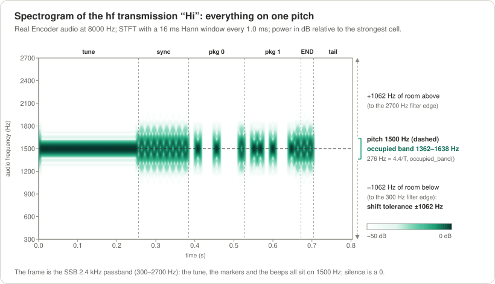

*"Hi" sent with the default `hf` preset, drawn from the real encoder's audio: a steady tune tone, the sync train of
markers, two packages of 8 bits and the END markers, everything on the one 1500 Hz pitch. The frame is a 2.4 kHz SSB
filter (300–2700 Hz): the signal needs only 276 Hz of it, so the radio may be mistuned by 1062 Hz either way. The
markers spread a little wider than the plain beeps: that is their twist.*

> **Status (2026-09-27): v0.3 released (library version 0.3.0), simulated, API frozen.** The library, the demos, the
> terminal view and the Arduino examples work: `make test` passes 219 of 219 tests, and `make demo_run`,
> `make check_embedded` and `make arduino_check` pass. The long regression suite passes 30 of its 31 tests; the one
> that fails is the late-join speed test: joining a transmission already running is slower than its 6-package target
> ([Performance](#7-performance)). In the whole suite no byte was released at a wrong position and nothing locked on
> noise, carriers, Morse or speech. **The public API is frozen for v0.3:** everything [Using the API](#8-using-the-api)
> describes stays exactly as it is in every 0.3 release. **Every result comes from simulation: Unlimited has not been
> tested on hardware or on the air yet.** v0.2, a multi-pitch design, was dropped; it is kept on the branch and tag
> `v0.2-mfsk` ([History](#13-history-and-roadmap)).

## Contents

1. [What it is](#1-what-it-is)
2. [The idea in pictures](#2-the-idea-in-pictures)
3. [Quick start](#3-quick-start)
4. [Choosing settings](#4-choosing-settings)
5. [How it works](#5-how-it-works)
6. [Protocol specification, for engineers and scholars](#6-protocol-specification-for-engineers-and-scholars)
7. [Performance](#7-performance)
8. [Using the API](#8-using-the-api)
9. [Demo CLI and channel simulator reference](#9-demo-cli-and-channel-simulator-reference)
10. [Embedded targets](#10-embedded-targets)
11. [Testing and quality](#11-testing-and-quality)
12. [Project layout](#12-project-layout)
13. [History and roadmap](#13-history-and-roadmap)
14. [Glossary](#14-glossary)
15. [License and author](#15-license-and-author)

Every section starts **in plain words** and then gives the exact details. Every term is explained where it first
appears and again in the [Glossary](#14-glossary). New here? Sections 1 to 4 are enough to use Unlimited; section 5
explains how the receiver works, section 6 is the exact specification. [`spec.md`](spec.md) is the normative
specification; this README follows it, and where they differ, `spec.md` wins.

---

## 1. What it is

### In plain words

Unlimited is a **modem**: it turns bytes into sound that a radio can carry, and that sound back into bytes. You
connect the audio output of a computer or a microcontroller to a transmitter's microphone input, and a receiver's
speaker output to the audio input of another one.

- **One pitch.** Every sound Unlimited makes is the same short beep on one **pitch** (one audio frequency, 1500 Hz by
  default: a clear whistle in the middle of a voice radio's audio).
- **Time slots.** Time is cut into equal **slots**, 16 ms each by default (62.5 per second). In each slot the sender
  either beeps, which means **1**, or stays silent, which means **0**. Think of a lamp flashing to a metronome: at
  every tick the lamp is either on or off.
- **Markers.** Every few bits a special beep, a **marker**, marks the edges: a **START** before the bits and a **STOP**
  after them. A marker sounds like any other beep, but halfway through it the sound wave turns upside down. This
  **twist** cannot be heard, yet the receiver sees it clearly, so a marker is never mistaken for a 1.
- **Packages.** START, the bits, STOP: that is one **package**. The sender chooses how many bits go into a package
  (**N**, 8 by default on HF, the shortwave bands). The STOP of one package is also the START of the next one.
- **Nothing to set on the receiving side.** The receiver finds the pitch by itself, measures the speed on the markers
  at the start of each transmission, and counts how many bits come between a START and a STOP. The sender may change
  the pitch, the speed or N from one transmission to the next without telling anyone.
- **Reading a bit.** A marker is exactly as loud as a 1. So the receiver draws a straight line from the START's height
  to the STOP's height (how tall a 1 should be right now, even while the signal fades) and calls every slot that
  reaches a good part of that line (about 70 % on weak signals) a 1.
- **Any radio, any sideband.** A beep on one pitch passes through the audio of SSB (single sideband, the usual HF voice
  mode, as USB or LSB), AM and FM radios alike. If the radio is mistuned, or set to the other sideband, the pitch only
  moves, and the receiver follows it.

The text "Hi" (the bytes 0x48 0x69) with the default settings:

```
 time →   each symbol is one slot of T = 16 ms; everything is on the same 1500 Hz pitch

 ▁▁▁▁▁▁▁▁  ◆ ◆ ◆ ◆ ◆ ◆ ◆ ◆  □ ■ □ □ ■ □ □ □  ◆  □ ■ ■ □ ■ □ □ ■  ◆  ◆ ◆   (silence)
 tune      sync train    ▲  0 1 0 0 1 0 0 0  ▲  0 1 1 0 1 0 0 1  ▲  END
 tone      (gives T)     │  package 0 = 0x48 │  package 1 = 0x69 │  then tail
 256 ms                START           STOP = START             STOP

 ▁ steady tone     ■ beep = 1     □ silence = 0     ◆ marker: the same beep with the twist
```

(The tune tone lasts 16 slots; it is drawn shorter.)

### The default at a glance

| | The `hf` preset (the default) |
|---|---|
| Pitch | 1500 Hz |
| Slot length T | 16 ms, 62.5 slots per second |
| Bits per package N | 8: one byte per package |
| Speed | 55.6 bit/s of data (about 7 bytes per second), plus 0.52 s per transmission for the tune tone, the sync train, END and the tail |
| Width on the air | 276 Hz (1362–1638 Hz) |
| Fits | a 2.4 kHz SSB filter (300–2700 Hz), with 1062 Hz of tuning room on each side |
| Weak signals | 1 bit in 1000 wrong at an SNR of about −0.3 dB: a beep slightly weaker than the noise in a 2500 Hz band (measured in plain noise; see [Performance](#7-performance)) |

Four more presets go from 27.8 bit/s (slow and robust, for poor HF paths) to 235 bit/s (for FM): see
[Choosing settings](#4-choosing-settings).

### Where it runs

- **PC** (Linux, macOS): the library, the demos `unlimited_encode` and `unlimited_decode`, a channel simulator and a
  live terminal view.
- **Microcontrollers**: the core is plain C++11 without what small chips lack (no heap, no exceptions, no RTTI, no
  STL). An Arduino Uno sends
  (the encoder runs inside an 8 kHz timer interrupt with integer arithmetic only). An ESP32 sends and receives (the
  receiver needs about 16 KB of RAM in an Arduino build); the examples compile and fit, but have not run on a board
  yet. STM32-class chips are a target too; their ARM build is not verified yet.

### What it does not do yet

- **No error correction yet.** On fading HF paths some bits arrive wrong; wrap messages in packets (with a CRC, a
  checksum that reveals damage) so a damaged one is dropped rather than delivered. Forward error correction (FEC) is the
  next step of the [roadmap](#13-history-and-roadmap).
- **No sound-card driver yet.** The demos read and write WAV files. A real-time modem with a KISS serial port (the usual
  link between packet-radio programs and a modem) is the next phase.
- **Not on the air yet.** Everything here was measured through a channel simulator.

---

## 2. The idea in pictures

### 2.1 A beep, a silence and a marker

**In plain words.** A **beep** (a data 1) fades in over a quarter of the slot, holds for half of it and fades out over
the last quarter, so neighbouring beeps never touch and nothing clicks. A **silence** (a data 0) is simply nothing. A
**marker** is the same beep with the **twist**: in the middle of the slot the wave passes through zero and comes back
upside down. The ear hears the same beep; the receiver compares the half before the middle with the half after it and
sees that one is the other upside down. After a marker the wave *stays* upside down until the next marker, so every
twist is a real change, and data beeps never twist. The **tune tone** at the start of a transmission is the same pitch
held steady.

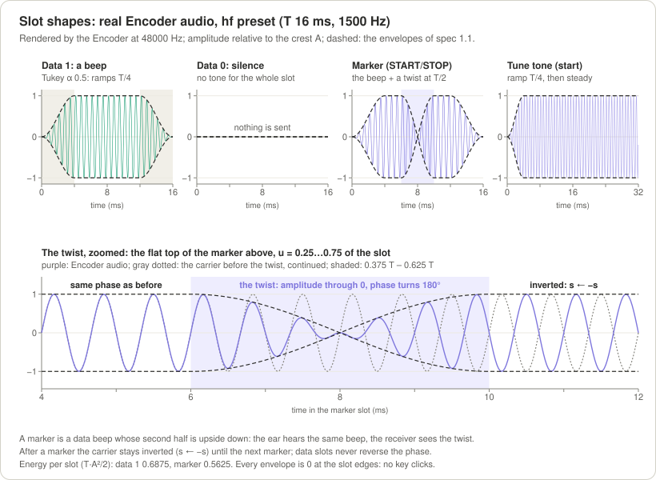

*Real encoder audio (`hf` preset, T = 16 ms, 1500 Hz). Top, left to right: a data 1 (its dashed envelope rises over
T/4, holds, falls over T/4), a data 0 (nothing is sent), a marker (the same envelope, pinched to zero at T/2 where the
wave turns over), the start of the tune tone. Bottom: the marker's middle zoomed in; the gray dotted wave is the
carrier as it was before the twist, and after the shaded twist the real wave is its exact opposite.*

### 2.2 Packages: bits between a START and a STOP

**In plain words.** The bytes to send are laid out as one long row of bits, the most significant bit of each byte
first, and the row is cut into packages of N bits. Each package sits between two markers: its START and its STOP. The
STOP of a package is the START of the next one, so a chain of packages needs only one marker per package. With N = 8
every package holds exactly one byte; with N = 4, half a byte; with N = 3 a byte may be split between two packages,
and the last package holds only the bits that are left (there is no padding). The receiver numbers the packages, so it
always knows which byte each bit belongs to.

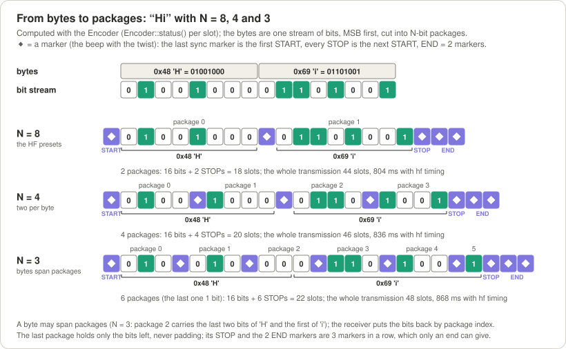

*"Hi" packed three ways, computed with the encoder. N = 8: two packages, one byte each, 18 slots of data and STOPs.
N = 4: four packages, two per byte. N = 3: six packages; package 2 carries the last two bits of 'H' and the first of
'i', and the last package carries a single bit. In every case the last STOP is followed by the two END markers: three
markers in a row, which only the end of a transmission can produce.*

### 2.3 A whole transmission

**In plain words.** A transmission always has the same parts, in this order, all on the one pitch:

1. **Lead-in:** optional silence while the push-to-talk (PTT) keys the transmitter up (none on the HF and AM presets,
   300 ms on the FM preset).
2. **Tune tone:** a steady beep, 250 ms by default. The receiver finds the pitch on it, and the transmitter's
   automatic level control (ALC) and voice-operated keying (VOX) settle.
3. **Sync train:** 8 markers in a row (8 to 32 can be set), one per slot. The receiver measures the slot length T on
   it. Its last marker is the START of the first package.
4. **Packages:** N bits and a STOP each, as many as the data needs.
5. **END:** two more markers right after the last STOP.
6. **Tail:** 100 ms of silence.

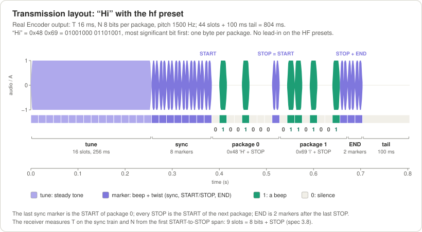

*The whole `hf` transmission of "Hi": 16 slots of tune tone (256 ms), 8 sync markers whose last one is the first START,
package 0 = 0x48 'H', its STOP (which is also the START of package 1), package 1 = 0x69 'i', its STOP, the two END
markers and the tail: 44 slots and 100 ms, 804 ms in all. The strip under the waveform shows each slot's kind and
the bit of every data slot.*

### 2.4 How the receiver reads a package

**In plain words.** A marker has the height of a data 1. So after each package the receiver knows how loud a 1 was at
its START and at its STOP, and it draws a straight **reference line** between the two: how tall a 1 should be at every
slot in between, even while the signal fades. A **decision line** sits below it; a slot that reaches it is a 1, a
slot below it is a 0. By default the line is the **smart line**: between 50 % and 75 % of the reference line, about
70 % when the signal is weak, lower when it is clean, and never down in the noise. You can also choose a **fixed line**
at 70 % (Gustavo's original rule).

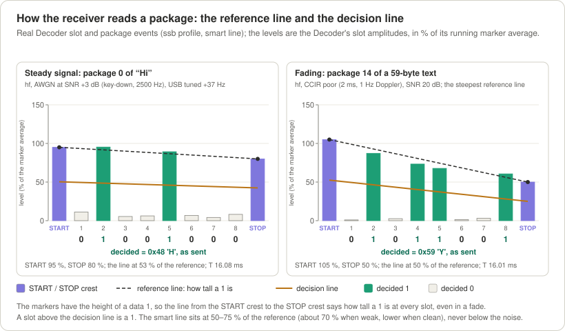

*Two packages exactly as the decoder measured them. Left: package 0 of "Hi" at +3 dB SNR, a steady signal; the
reference line (dashed) runs from the START crest (95 %) to the STOP crest (80 %) and the decision line (amber) sits at
about half of it: 0x48 'H'. Right: a package in deep, fast fading (CCIR poor, 20 dB SNR); the STOP is only half as
loud as the START, the reference line slopes down with the fade, and the bits are still read right: 0x59 'Y'.*

---

## 3. Quick start

### 3.1 Build and test

You need a C++11 compiler (clang or GCC) and `make`; the library, the demos and the tests use nothing else. The
Arduino checks also need [`arduino-cli`](https://arduino.github.io/arduino-cli/) with the AVR and ESP32 cores;
`make check_embedded` takes `avr-g++` and `xtensa-esp32-elf-g++` from the `PATH` or from those cores, and skips a
compiler it cannot find.

```sh
git clone https://github.com/solariun/unlimited.git
cd unlimited
make          # the library build/libunlimited.a and the demos bin/unlimited_encode, bin/unlimited_decode
make test     # 219 unit and loopback tests, well under a minute
```

### 3.2 A round trip through a simulated radio

`unlimited_encode` turns text into audio. With `--channel` it also sends that audio through a simulated radio path
(noise, mistuning, fading) and writes what the *receiver* would hear. `unlimited_decode` reads it back. The receiver is
never told the pitch, the speed or the bits per package.

```sh
./bin/unlimited_encode --text "Hello from Unlimited" --channel usb --snr 6 --offset 120 --out rx.wav
./bin/unlimited_decode --in rx.wav
```

```
data       20 bytes of text
signal     preset hf: pitch 1500 Hz, slot T 16 ms (62.5 baud), N 8 bits per package, 55.6 bit/s net
bandwidth  occupied bandwidth 276 Hz (1362-1638 Hz); passband 300-2700 Hz: fits; shift tolerance -1062/+1062 Hz
emission   -26 dB width 438 Hz, -40 dB width 619 Hz
receivers  heard by the receiver profiles ssb, am and fm
airtime    3.396 s: lead-in 0 ms, tune tone 16 slots, sync 8 markers, 20 packages of 8 bits, END, tail 100 ms
level      crest -3.0 dBFS; the packages' average power is 4.4 dB below the key-down tone
audio      27168 samples at 8000 Hz -> rx.wav
channel    usb, SNR 6.0 dB key-down (1.6 dB average power), offset +120 Hz, receiver filter 300-2700 Hz; output gain -4.7 dB

receiver   profile ssb: slots 8-64 ms, passband 300-2700 Hz, pitch search 335-2665 Hz, smart decision line, impulse blanker on
input      rx.wav: 8000 Hz
locked     t 0.768 s: pitch 1620.1 Hz, T 16.01 ms, N 8 bits per package, 55.5 bit/s, SNR 6.5 dB
bandwidth  occupied bandwidth 276 Hz (1482-1758 Hz); passband 300-2700 Hz: fits; shift tolerance -1182/+942 Hz
rx         20 bytes, end at t 3.341 s (pitch 1620.0 Hz, T 16.00 ms, N 8 bits per package, 55.6 bit/s, SNR 5.1 dB)
text       "Hello from Unlimited"
```

What the lines say: the sender used the `hf` preset; the signal is 276 Hz wide and fits the receiver's filter; the
simulated receiver was mistuned by +120 Hz, so the receiver found the pitch at 1620 Hz, measured T = 16 ms and N = 8 by
itself, and got every byte back. **SNR** (signal-to-noise ratio) compares the power of a steady beep with the power of
the noise in a 2500 Hz band; 6 dB means the beep is 4 times stronger than that noise ([more](#71-in-plain-words)).

The same round trip on other radios; each decodes "Hello from Unlimited" exactly:

```sh
# LSB, mistuned by -200 Hz: the receiver finds the pitch at 1300 Hz (LSB mirrors the audio, the offset moves it)
./bin/unlimited_encode --text "Hello from Unlimited" --channel lsb --snr 6 --offset -200 --out rx.wav
./bin/unlimited_decode --in rx.wav

# AM with the am preset (T 8 ms, N 16) and the am receiver profile
./bin/unlimited_encode --text "Hello from Unlimited" --preset am --channel am --snr 10 --out rx.wav
./bin/unlimited_decode --in rx.wav --profile am

# narrow-band FM with the fm preset (T 4 ms, N 16) and the fm receiver profile
./bin/unlimited_encode --text "Hello from Unlimited" --preset fm --channel fm --snr 20 --out rx.wav
./bin/unlimited_decode --in rx.wav --profile fm
```

On AM and FM, `--snr` is the carrier's SNR in 2500 Hz; the FM line of the encoder also prints the carrier-to-noise
ratio in the 12.5 kHz channel (13 dB here).

**Fading, honestly.** HF signals fade. Here a 54-byte text, wrapped in a packet with a CRC, goes through a simulated
"CCIR moderate" skywave path (the signal comes back from the ionosphere along two paths 1 ms apart, fading at 0.5 Hz)
at 20 dB SNR, and the receiver compares what it got with what was sent (`--expect`):

```sh
printf 'CQ CQ DE UNLIMITED TEST 0123456789 THE QUICK BROWN FOX' > sent.txt
./bin/unlimited_encode --in sent.txt --packet --preset hf_slow \
    --channel usb --snr 20 --fading moderate --seed 2 --out rx.wav
./bin/unlimited_decode --in rx.wav --packet --expect sent.txt
```

With `--seed 2` every byte arrives and the packet's CRC is good. With `--seed 1` one bit of the 480 arrives wrong: the
CRC catches it and the packet is dropped (`packets 0 valid, 1 CRC errors`), rather than delivered with a wrong
letter. Out of the seeds 1 to 5, two packets pass. One bit per slot has an error floor on fading paths (about 5 bits
in 1000 on this path, see [Performance](#7-performance)); forward error correction is the planned cure.

### 3.3 The bandwidth line

Every run of the encoder prints how wide the signal is, whether it fits the receiver's audio filter (its
**passband**) and how far the radio may be mistuned before the signal starts to leave that filter or the receiver
stops following it (the **shift tolerance**, down / up):

```
bandwidth  occupied bandwidth 276 Hz (1362-1638 Hz); passband 300-2700 Hz: fits; shift tolerance -1062/+1062 Hz
```

Tell the encoder which filter the receiver has with `--passband LO:HI` (default `300:2700`, a 2.4 kHz SSB filter). A
signal that does not fit is refused, with the reason and the option to change:

```sh
./bin/unlimited_encode --text "Hello" --preset hf_fast --passband 1250:1750 --out tx.wav
```

```
unlimited_encode: occupied bandwidth 550 Hz (1225-1775 Hz); passband 1250-1750 Hz: does not fit (25 Hz below and 25 Hz above the passband)
unlimited_encode: refused: the signal does not fit the receiver's passband: at T = 8 ms it is 550 Hz wide (1225-1775 Hz around the pitch 1500 Hz) and the passband is 1250-1750 Hz, only 500 Hz wide; use longer slots (--slot-ms, or a slower --preset) or a wider --passband (see --help)
```

(exit code 2). [Choosing settings](#4-choosing-settings) explains the numbers.

### 3.4 Watching it: `--tui`

`--tui` turns either demo into a live picture in the terminal (80×24 or larger): the audio, the spectrum with the
passband, the signal's band and its pitch, the status, the text and, in the middle, the packages. The decoder draws each
package as bars against its START→STOP reference line (`╌`) and its decision line (`─`), with the bit under each bar
and the byte under its bits. Add `--realtime` to play a file at the speed of the audio; without it the file runs
through at full speed and you see the last frame:

```sh
./bin/unlimited_encode --text "CQ CQ DE UNLIMITED TEST 0123456789" --channel usb --snr 10 --offset 80 --out rx.wav
./bin/unlimited_decode --in rx.wav --tui --realtime
```

The last frame of that run (without `--realtime`), colours removed:

```
 RX ssb 8-64 ms │ SEARCH, DCD off │ 1580.0 Hz │ T 16.00 ms │ N 8 │ 55.5 bit/s
 SNR 10.4 dB │ band 1442-1718 Hz fits, shift -1142/+982 Hz
 passband 300-2700 Hz │ 34 bytes │ locks 1  lost 0  ends 1 │ last: end
── scope 32 ms  peak -9.7 dBFS ────────────────────────────────────────────────
⣤⣄        ⢰⣶⣆⣀⣀⣠⣤⡄       ⢀⣀⣀⣀  ⣿⣿⡄⢀⣀⣤⡄   ⢠⣤⣤⣤⡀ ⣤⣤    ⣶⣶⡀  ⣀⣠⣤⢀⣀⡀  ⢀⣀⡀        ⣤⡄
⠿⠿⠿⢶⣶⡾⠿⠿⢿⣿⣿⣿⣿⣿⣿⣿⣿⣿⣿⣿⣿⡿⣿⣾⣿⣿⣿⠿⣿⣿⣿⣿⣿⣷⣾⣿⣿⣷⣿⣿⣿⣿⣿⠿⣿⣷⣿⣿⣿⡟⢻⣿⣤⣿⣿⣿⣿⣿⣿⣿⣿⣿⠿⢿⣿⣿⣾⠿⠿⣿⣶⣾⣿⣿⡿⢿⣿⣿⣷
   ⠈⠛⠃   ⠘⠛⠋⠈⠛⠛⠉⠉⠉⠉   ⠉⠉⠈⠉⠁ ⠉⠉⠙⠛⠋⠉⠉⠉⠈⠉⠁ ⠉⠉  ⠛⠛⠉⠁⠉⠁ ⠈⠉⠉⠁  ⠘⠛⠋⠛⠛   ⠿⠟     ⠘⠛⠃  ⠈⠉
── package 33  8 bits  T 16.00 ms  START 99%  STOP 98%  line 51% of ref ───────
    │
    │                                    ▁▁ ▁▁ ▁▁
100%┤▇▇╌╌╌╌╌╌╌██╌╌╌╌╌╌╌╌╌╌╌╌╌╌╌╌██╌╌╌╌╌╌╌██╌██╌██╌╌╌╌╌╌╌╌╌╌▇▇
    │██       ██ ██ ██          ██       ██ ██ ██       ██ ██
    │██───────██─██─██──────────██───────██─██─██───────██─██
    │██       ██ ██ ██          ██       ██ ██ ██       ██ ██
    │██ ▁▁ ▂▂ ██ ██ ██ ▃▃ ▂▂ ▁▁ ██    ▃▃ ██ ██ ██ ▁▁ ▂▂ ██ ██
     ◆  0  0  1  1  1  0  0  0  ◆  0  0  1  1  1  0  0  1  ◆
        └──────0x38 '8'───────┘    └──────0x39 '9'───────┘
── spectrum  peak 1615 Hz -18.6 dBFS  [ ] passband  ░ band  ▲ pitch ───────────
▂▃▂▁▃▃▃▃▂▃▁▁▂▃▂▃▃▃▃▂▂▃▂▂▄▃▃▃▃▃▂▂▂▂▅▄▅▂▆▄▅▂▂▂▂▃▃▃▃▂▃▂▂▄▃▃▃▃ ▄▂▃▃▃▂▁▂▃▃▂▂
[────────────────────────────────░░░░▲░░░░───────────────────────────]
      500           1k             1.5k          2k             2.5k         3k
── received  34 bytes ─────────────────────────────────────────────────────────
CQ CQ DE UNLIMITED TEST 0123456789
```

The status lines on top show the receiver back in SEARCH with DCD (data carrier detect: "I hold a signal") off after the
END, and what it measured. The two packages on screen are the last two of the text, '8' and '9'. The markers (`◆`) stand
at about 100 % of the running marker level, the 1s reach the dashed reference line, the 0s stay near the floor, and the
decision line sits at 51 % of the reference: a clean signal. The encoder's view (`--tui --realtime` on
`unlimited_encode`) shows the slots as they are sent: the tune, the sync train, each package with its bits under the
bracket of their byte, and the slot being sent.

### 3.5 WAV files and a real radio

Without `--channel`, the encoder writes the clean audio to send, and the decoder reads any recording:

```sh
./bin/unlimited_encode --text "CQ CQ DE UNLIMITED TEST" --rate 48000 --out tx.wav   # play tx.wav into the transmitter
./bin/unlimited_decode --in tx.wav                                                   # decode a recording (any rate)
```

To try it with real radios: play `tx.wav` into the transmitter's microphone or data input, record the receiver's
audio to a WAV file at any sample rate, mono or stereo, and decode it. The decoder resamples to 8000 Hz by itself. Set
the audio level with the tune tone: full output power, with the transmitter's ALC (automatic level control) not
moving, because ALC or speech compression flattens the beeps. The tune tone also keys a VOX; `--lead-in-ms` adds
silence before it if the transmitter needs time to key up. Sound-card input and output (and a KISS modem for
packet-radio programs) are the next phase, see the [roadmap](#13-history-and-roadmap).

### 3.6 Arduino and ESP32

The library is also an Arduino library (the repository root holds `library.properties`, the code is in `src/`). Four
examples are in `examples/arduino/`: `tx_uno` sends every line typed on the serial port as a packet from an Arduino
Uno; `rx_esp32` receives on an ESP32 and prints the packets; `loopback_esp32` is a self-test with no wiring;
`wav_sd_esp32` writes a WAV file to an SD card. `make arduino_check` compiles all four with every warning on:

```sh
make arduino_check
arduino-cli compile --fqbn arduino:avr:uno --library . examples/arduino/tx_uno     # one example by hand
```

Wiring, sizes and CPU use are in [Embedded targets](#10-embedded-targets).

---

## 4. Choosing settings

### 4.1 In plain words: who chooses what

- **The sender chooses** how fast to go (the slot length **T**), how many bits go between START and STOP (**N**), the
  pitch, and which receiver filter the signal must fit (the **passband**). A **preset** fills all of them at once;
  change any of them on top of it.
- **The receiver chooses** only which range of speeds it listens to and its own audio filter. A **profile** fills both.
  It learns the pitch, T and N from each transmission.

So you can change the sender's speed or package length without touching the receivers, as long as the new speed is in
their range.

### 4.2 The five presets

- **`hf_slow`** (32 ms slots, 27.8 bit/s): poor HF paths, long distances, deep fading, weak signals. The most robust in
  noise.
- **`hf`** (16 ms, 55.6 bit/s): the default, for ordinary HF skywave.
- **`hf_fast`** (8 ms, 111 bit/s): good HF paths with little echo spread (0.8 ms or less) and decent signals.
- **`am`** (8 ms, 16 bits per package, 118 bit/s): AM receivers (HF broadcast-style, VHF airband).
- **`fm`** (4 ms, 16 bits per package, 235 bit/s): VHF/UHF narrow-band FM. It needs a receiver that listens to fast
  slots (the `fm` profile).

The numbers, as the library computes them (`EncoderConfig::from_preset()`, every preset on 1500 Hz, 8 sync markers, a
250 ms tune tone and a 100 ms tail):

| Preset | T | N | Net bit/s | Overhead per transmission | Occupied band | Passband it must fit | Shift tolerance | Heard by the profiles |
|---|---|---|---|---|---|---|---|---|
| `hf_slow` | 32 ms | 8 | 27.78 | 676 ms | 138 Hz, 1431–1569 Hz | 300–2700 Hz | ±1131 Hz | `ssb`, `am`, `fm` |
| **`hf`** | 16 ms | 8 | **55.56** | 516 ms | 276 Hz, 1362–1638 Hz | 300–2700 Hz | ±1062 Hz | `ssb`, `am`, `fm` |
| `hf_fast` | 8 ms | 8 | 111.11 | 436 ms | 550 Hz, 1225–1775 Hz | 300–2700 Hz | ±925 Hz | `ssb`, `am`, `fm` |
| `am` | 8 ms | 16 | 117.65 | 436 ms | 550 Hz, 1225–1775 Hz | 100–3000 Hz | −1125 / +1200 Hz | `ssb`, `am`, `fm` |
| `fm` | 4 ms | 16 | 235.29 | 692 ms (300 ms lead-in) | 1100 Hz, 950–2050 Hz | 300–3000 Hz | −500 / +950 Hz | `fm` |

- **Net bit/s** = N / ((N + 1)·T): the data slots against the data slots and their STOPs.
- **Overhead**: the lead-in, the tune tone, the sync train, END and the tail, once per transmission.
- **Shift tolerance**: how far the pitch may move down / up (mistuning, or the other sideband) and still be heard: until
  the signal starts to leave the passband, or the pitch leaves the range the receiver searches
  ([4.6](#46-passband-width-and-shift-tolerance)). That is why `am` has +1200 Hz, not the filter's +1225, and `fm`
  −500 Hz, not −650.

How long a message takes on the air, and the rate it really gets once the overhead is counted (without the packet
framing, which adds 6 bytes per packet):

| Preset | 1 byte | 16 bytes | 100 bytes | 256 bytes | 1024 bytes |
|---|---|---|---|---|---|
| `hf_slow` | 0.96 s | 5.28 s (24.2 bit/s) | 29.48 s (27.1 bit/s) | 74.40 s (27.5 bit/s) | 295.6 s (27.7 bit/s) |
| `hf` | 0.66 s | 2.82 s (45.4 bit/s) | 14.92 s (53.6 bit/s) | 37.38 s (54.8 bit/s) | 147.97 s (55.4 bit/s) |
| `hf_fast` | 0.51 s | 1.59 s (80.6 bit/s) | 7.64 s (104.8 bit/s) | 18.87 s (108.5 bit/s) | 74.16 s (110.5 bit/s) |
| `am` | 0.51 s | 1.52 s (84.0 bit/s) | 7.24 s (110.6 bit/s) | 17.84 s (114.8 bit/s) | 70.07 s (116.9 bit/s) |
| `fm` | 0.73 s | 1.24 s (103.6 bit/s) | 4.09 s (195.5 bit/s) | 9.40 s (218.0 bit/s) | 35.51 s (230.7 bit/s) |

### 4.3 Speed: the slot length T

**In plain words.** A slot is the time of one bit. A longer slot is slower, but each bit then carries more energy, so
it survives more noise: doubling T gains 3 dB, as much as doubling the transmitter's power. On HF, though, the
ionosphere returns the signal along two or more paths, a millisecond or two apart; those echoes smear a short beep into
its neighbours. Keep T at least ten times the echo spread of the path. And a very long slot has the opposite problem:
the longer START and STOP are apart, the more a fading signal can change between them.

| T | Use | Net bit/s at N = 8 | Occupied band | SNR for 1 bit in 1000 wrong (plain noise, measured) |
|---|---|---|---|---|
| 4 ms | FM-like channels only (no echoes); pitch ≥ 1000 Hz | 222 | 1100 Hz | – (the `fm` preset, N = 16, has 3 bits in 100,000 wrong at its +8 dB release gate) |
| 8 ms | good HF paths (echo spread ≤ 0.8 ms), AM | 111 | 550 Hz | +2.8 dB |
| **16 ms** | typical HF skywave (≈ 1 ms spread) | **55.6** | 276 Hz | **−0.3 dB** |
| 32 ms | poor HF paths (≈ 2 ms spread) | 27.8 | 138 Hz | −3.2 dB |
| 64 ms | stable paths, very weak signals | 13.9 | 70 Hz | – (9 bits in 100,000 wrong at its −4.5 dB release gate) |
| 128 ms | stable paths only (Doppler ≤ 0.5 Hz recommended) | 6.9 | 36 Hz | – (5 bits in 1,000,000 wrong at its −6.5 dB release gate) |

**Exact rules.** `--slot-ms` (or `EncoderConfig::slot_us`) takes any T from 4 to 128 ms, decimals allowed; `--baud B`
sets T = 1000/B ms. T below 8 ms needs a pitch of at least 1000 Hz and a receiver that listens to such slots (the
`fm` profile, or `--min-slot-ms` below 8). A package may last at most 1152 ms from START to STOP:
(N + 1)·T ≤ 1152 ms. Coherence: the residual frequency error times T must stay below 0.1 after the receiver's frequency
tracking, and the Doppler spread times T below 0.25.

### 4.4 Bits per package: N

**In plain words.** More bits per package means fewer STOP markers, so it is a little faster. Fewer bits per package
means the receiver re-measures the level and the timing more often, which helps when the signal fades quickly. N = 8
puts exactly one byte in every package, N = 16 two bytes: a receiver that starts listening in the middle of a
transmission can join it only when N is a multiple of 8.

| N | Slots per package | Share of slots carrying data | Net bit/s at T = 16 ms | Level and timing re-measured every |
|---|---|---|---|---|
| 1 | 2 | 50.0 % | 31.2 | 32 ms |
| 4 | 5 | 80.0 % | 50.0 | 80 ms |
| **8** (HF presets) | 9 | 88.9 % | 55.6 | 144 ms |
| **16** (AM, FM presets) | 17 | 94.1 % | 58.8 | 272 ms |
| 32 | 33 | 97.0 % | 60.6 | 528 ms |

**Exact rules.** `--bits N` (also `-N`, `--bits-per-package`; `EncoderConfig::bits_per_package`) takes 1 to the build's
cap `UNLIMITED_MAX_BITS_PER_PACKAGE`: 32 on a PC, 16 in Arduino builds. (N + 1)·T ≤ 1152 ms also limits N at slow
speeds: at most 17 at 64 ms and 8 at 128 ms. A receiver built with a smaller cap than the sender's N reports
`lost(unsupported)` and gives no bytes. Stay with 8 or 16 unless you have a reason: they are the measured defaults, they
allow a late join, and N = 8 or more keeps a receiver from mistaking a chain of packages for a sync train (see
[4.7](#47-the-receivers-side-profiles-and-the-speed-window)). N = 1 works but is the most fragile.

### 4.5 Pitch

**In plain words.** Any pitch from 300 to 2700 Hz. The default, 1500 Hz, sits in the middle of an SSB filter, which
leaves the most room for mistuning on both sides. In a narrow 1.8 kHz filter (300–2100 Hz) use its centre, 1200 Hz.
The receiver finds the pitch by itself, so the sender may use any.

**Exact rules.** `--tone HZ` (`EncoderConfig::tone_hz`), 300..2700 Hz, any integer. T below 8 ms needs 1000 Hz or more,
and the `fm` profile searches only 1000–2700 Hz.

### 4.6 Passband, width and shift tolerance

**In plain words.** A beep is not one single frequency: the shorter the beep, the wider its sound spreads around the
pitch. A 16 ms beep occupies 276 Hz, an 8 ms beep 550 Hz, a 4 ms beep 1100 Hz. The receiver's audio filter must let the
whole spread through. SSB filters differ (1.8, 2.4, 2.7 or 3.0 kHz wide); AM and FM receivers pass wider audio.
Unlimited computes the width of a configuration (its **occupied band**), checks it against a passband and reports the
room left below and above: that room is the **shift tolerance**, how far the radio may be mistuned. Mistuning an SSB
radio moves every audio frequency by the same amount (USB tuned too low moves the audio up, LSB down), so the pitch
may move by the room on each side — but never further than the receiver looks for it: every receiver searches for
the pitch between 300 and 2700 Hz (from 1000 Hz when it hears slots shorter than 8 ms), so a wide filter's extra room
beyond that is not counted. The number printed is always one the receiver really follows.

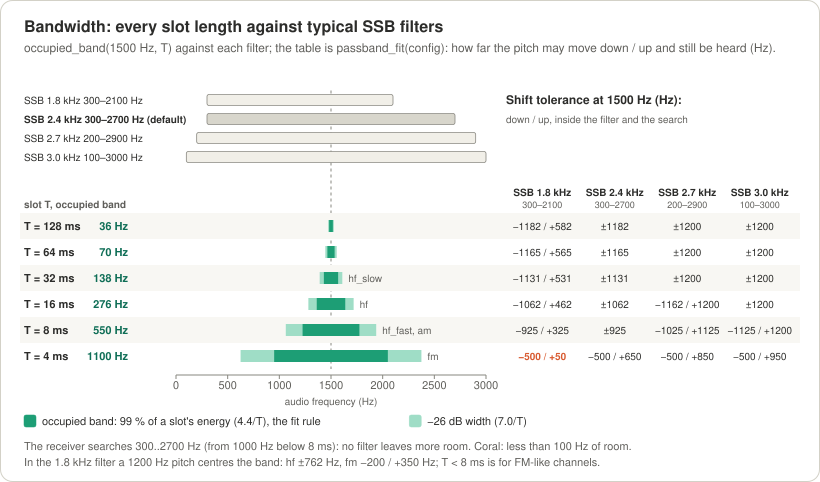

*Every slot length from 128 ms down to 4 ms at 1500 Hz (dark: the occupied band; light: the wider −26 dB width) against
the four usual SSB filters, and the table of how far the pitch may move down / up in each and still be heard. Slow
slots are narrow and leave over 1 kHz of room, up to the ±1200 Hz of the receiver's 300–2700 Hz search in the wide
filters; the 4 ms `fm` signal fits a 1.8 kHz filter with only 50 Hz of room above (in coral) and 500 Hz below (its
receiver searches from 1000 Hz): centre the pitch in narrow filters.*

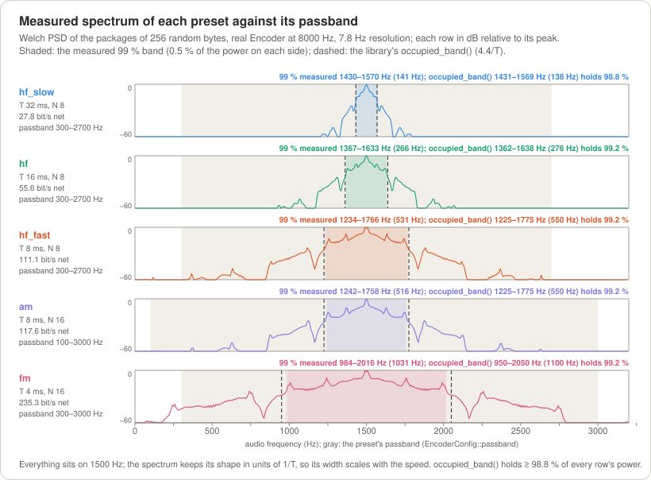

*The measured spectrum of each preset (random data, real encoder) inside its passband (gray). The shaded part holds 99 %
of the power; the dashed lines are the library's `occupied_band()`, which holds 98.8 % or more of every preset's power.
The spectrum keeps its shape in units of 1/T: halve T and it doubles in width.*

**Exact rules.**

- Occupied band: pitch ± ⌈4400·500 / T_µs⌉ Hz, that is 4.4/T wide (99 % of a data slot's energy). The −26 dB width is
  7.0/T and the −40 dB width 9.9/T.
- The fit: margin below = band low − passband low, margin above = passband high − band high; the signal fits when
  both are ≥ 0. The sender refuses a configuration that does not fit (`ConfigError::outside_passband`).
- The receiver's **search range**: its passband less half the occupied band of the slowest slot it hears, within
  300–2700 Hz, and from 1000 Hz when it hears slots under 8 ms (the `ssb` profile: 335–2665 Hz; `am`: 300–2700 Hz;
  `fm`: 1000–2700 Hz).
- The **shift tolerance** on each side is the smaller of the filter's margin and the room the search leaves the
  pitch: down to the search's low edge, up to its high edge; the tolerance is the smaller side. The encoder assumes the
  receiver that hears its T by default (the `fm` profile below 8 ms, `ssb`/`am` up to 64 ms, a `--min-slot-ms` window
  above); the decoder uses its own search range for the signal it hears. In a 2.4 kHz filter the filter is the limit
  (±1062 Hz for `hf`); in a 3.0 kHz filter the search is (`hf`: the filter leaves −1262 / +1362 Hz, the tolerance is
  ±1200 Hz); the `fm` preset gets −500 Hz below (not the filter's −650 Hz) because its receiver searches from 1000 Hz.
- Typical passbands (−6 dB points): SSB 1.8 kHz 300–2100 Hz; **SSB 2.4 kHz 300–2700 Hz (the default)**; SSB 2.7 kHz
  200–2900 Hz; SSB 3.0 kHz and AM receivers about 100–3000 Hz; narrow-band FM (NBFM) about 300–3000 Hz.
- The long regression suite shifts every preset in every one of the four filters down and up by its printed tolerance
  less 10 Hz and checks that it decodes (test L19, [7.4](#74-interference-radio-effects-and-clocks)). In the API:
  `passband_fit(config)` for a sender, `passband_fit(tone_hz, slot_us, passband, config.search_range())` for a
  receiver; `passband_fit(band, passband)` is the pure filter fit ([8.5](#85-checking-the-bandwidth)).

### 4.7 The receiver's side: profiles and the speed window

**In plain words.** A receiver listens to a range of slot lengths whose longest is 8 times its shortest (its **speed
window**), and to the pitches inside its passband. It cannot listen to every speed at once, because a slow signal with
some beeps missing can look like a fast one:

```
 a sync train at 64 ms:                                  ◆       ◆       ◆       ◆
 a train at 32 ms whose every other marker faded:        ◆   ·   ◆   ·   ◆   ·   ◆
 packages at 8 ms, N = 7, silent bits (markers 64 ms apart): ◆ □□□□□□□ ◆ □□□□□□□ ◆ □□□□□□□ ◆
```

The receiver sorts most look-alikes out with its rules, but the last kind (a chain of packages whose markers come
(N + 1)·T apart, like a slower train) can only be excluded by the window: inside an 8-to-1 window a chain with N ≥ 8
can never also pass for a train. Pick the shortest slot you want to hear; the window is that to 8 times that.

| Profile | Speed window | Passband | Pitch search | Radio |
|---|---|---|---|---|
| **`ssb`** (the default) | 8–64 ms | 300–2700 Hz | 335–2665 Hz | HF SSB, USB or LSB |
| `am` | 8–64 ms | 100–3000 Hz | 300–2700 Hz | AM receivers (HF, VHF airband) |
| `fm` | 4–32 ms | 300–3000 Hz | 1000–2700 Hz | VHF/UHF NBFM |

**Exact rules.** `--profile ssb|am|fm` (`DecoderConfig::for_profile()`), `--min-slot-ms M` (4..32 ms, in the API
`DecoderConfig::min_slot_ms` from `k_min_window_slot_ms` to `k_max_window_slot_ms`; the window is M..8M ms, measured
T accepted within ±6 % of its ends) and `--passband LO:HI`. The pitch search covers the passband less half the
occupied band of the slowest slot in the window, clipped to 300–2700 Hz, and starts at 1000 Hz when M < 8. A sender
outside the window gives no lock and no bytes. A 128 ms sender needs `--min-slot-ms 16`; the encoder prints which
profiles hear it ("heard by the receiver profiles ...") and suggests a `--min-slot-ms` when none does.

### 4.8 The decision line

**In plain words.** Between a 0 and a 1 the receiver draws its decision line at a fraction of the reference line
(§2.4). The **smart line** (the default) picks the fraction where a 1 and a 0 are equally likely at the measured signal
strength: about 70 % when the signal is weak, closer to 50 % when it is strong, and never below the noise. The **fixed
line** always uses 70 %, Gustavo's original rule. Measured with known timing: the smart line comes within 0.1 dB of the
best possible detector for beeps like these; the fixed line costs about 4 dB.

**Exact rules.** `--rule adaptive|fixed` and `--ratio R` (R alone selects the fixed line; `--rule adaptive --ratio R` is
a usage error). In the API: `DecoderConfig::decision_mode` (`DecisionMode::adaptive` or `fixed_ratio`) and
`DecoderConfig::fixed_ratio` (0.70). The formulas are in [6.9](#69-the-decision-rule).

---

## 5. How it works

### 5.1 The transmission, part by part

**In plain words.** A transmission is a moment of silence for the radio to key up, a steady tune tone, a run of
markers that gives the rhythm, the packages one after the other, two END markers and a short silence. Everything is on
the same pitch, so the whole transmission fits the narrow band of [4.6](#46-passband-width-and-shift-tolerance).

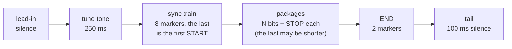

**Exact rules** (spec §2.1):

| Part | Rule | Default |
|---|---|---|
| Lead-in | `lead_in_ms` of silence, on the slot grid (PTT, relays, an FM transmitter's delay) | 0 on the HF and AM presets, 300 ms on `fm` |
| Tune tone | max(⌈`tune_ms`/T⌉, 6) slots of steady tone, ramped at both ends | 250 ms: 16 slots at 16 ms |
| Sync train | `sync_markers` markers in a row, 8..32; the last one is the START of package 0 | 8 |
| Packages | P = ⌈8n/N⌉ packages for n bytes: P − 1 of N data slots and a STOP, and a last one of d = 8n − N·(P − 1) data slots and a STOP | – |
| END | 2 markers right after the last STOP | – |
| Tail | `tail_ms` of silence | 100 ms |

Each STOP is also the START of the next package. The carrier sign (whether the wave is upright or upside down) starts
upright with the tune tone and turns over after every marker.

### 5.2 The receiver in four steps

**In plain words.** The receiver goes through four states, and says which one it is in (a `state` event):

1. **SEARCH:** it listens across its passband for a tone that stays on: the tune tone.
2. **ACQUIRE:** it holds that pitch and looks for twists. A regular run of them, the sync train, gives the slot length
   T.
3. **PREAMBLE:** it follows the rest of the train. Data slots never twist, so the first marker that is not one slot
   after the previous one is the first STOP: the gap gives N. The next package, with the same span, confirms it.
4. **TRACK:** package after package, it finds each STOP where it should be, draws the reference line from START to
   STOP, compares every slot with the decision line and hands out the bits and bytes. It stops at END, or when the
   signal is gone.

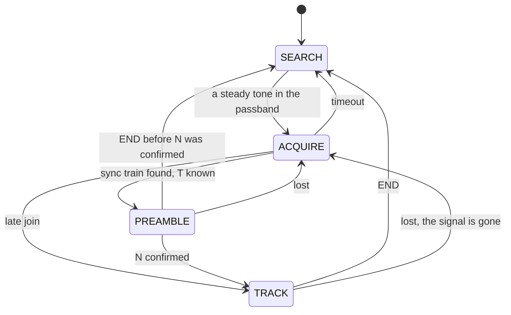

The receiver "has a signal" (carrier detect, **DCD**, for a modem that must not transmit over someone) whenever it is
not in SEARCH: `Decoder::dcd()`.

**Exact rules.** Input is 8000 Hz, 16-bit audio. The receiver works in **blocks** of `min_slot_ms` samples (8 samples,
1 ms, for the `ssb` profile: an eighth of the shortest slot it hears):

```
8 kHz int16 ─┬─► mixer (oscillator at the pitch) ─► CIC-2 blocks of min_slot_ms samples ─► impulse blanker ─► history
             │                                                                                             │
             └─► tone search (SEARCH, and the watch)             twist tests, slot windows, reference   ◄──┘
                                                                  line, decision ─► slot / package / byte events
```

The **history** keeps running sums of the mixed-down signal, long enough for one package at the slowest T plus its END
check, so any window of the recent past (half a slot before a moment, the middle 75 % of a slot) costs two lookups.

### 5.3 SEARCH: finding the pitch

**In plain words.** The receiver scans its passband in 50 Hz steps, looking for a tone that is clearly above the
noise and stays on. It ignores a steady carrier that never keys (a birdie, another station's carrier), and it bans for
a while a pitch that grabbed it before without leading to a transmission. It does not need the pitch to sit on a
50 Hz step: it estimates the tone to within a few hertz, then a fine frequency tracker (AFC) pulls it in to a fraction
of a hertz.

**Exact rules** (spec §3.6): Goertzel filters on the multiples of 50 Hz inside the search range (at most 49), plus one
guard filter on each side where no lock is taken, updated every 20 ms (160 samples). A **fast lock** needs a local
peak at 4 to 6 times the noise floor for 3 blocks (8 when weaker); a **slow lock** catches weak tones after about 2 s
of averaging. A bin that holds a steady carrier for 2.6 s is masked. A pitch that timed out while still present is
banned for 10 s, doubling with each strike. The tone estimate comes from the phase advance between blocks; the fine
AFC then measures the squared signal (which removes both the data and the marker twists) in 1 Hz steps.

### 5.4 ACQUIRE: measuring the speed on the sync train

**In plain words.** Holding the pitch, the receiver looks for twists. Any two twists give a guess of T. A guess is
accepted when most of the 8 slots before the newest twist also hold twists, when the moments between them are silent
(markers fall to zero at their edges), and when half the guess does not explain them better. A marker that faded must
not bend the guess: each twist found near its predicted place predicts the next one, and a guess is checked again
after it has been refined. Meanwhile a **watch** keeps listening to the rest of the band, in case the tone it holds is
not the station that is about to send.

**Exact rules** (spec §3.7): hypotheses T = (c − b)/m for older twists b, m = 1..7, inside the window (±6 %); each
scored over the 8 positions c − i·T; accepted with enough evidence (at least 5 clean twists, or 4 of the newest 5, or
a weak-marker rule) and quiet boundaries between markers; the smallest sub-multiple that explains the evidence wins;
a least-squares refinement is scored again. When the carrier turned over between two twists one T apart, a marker faded
between them and T is halved. The timeout is at least 3 s. When no train comes but twists keep arriving at equal,
longer intervals, the receiver may be in the middle of a transmission: see [5.9](#59-joining-late).

### 5.5 PREAMBLE: counting the bits per package

**In plain words.** After the sync, the receiver walks slot by slot along the grid the train defined and asks at each
slot: is there a twist here? While twists come one slot apart, the train goes on. Data slots never twist, so the first
twist after a longer gap must be the first STOP: the gap is N + 1 slots. That is only a guess until the next package
shows the same span. Two clues keep a faded marker from causing wrong bytes:

- **The tune tone** ends where the train begins, and a train has at least 8 markers, so the receiver knows the
  earliest slot where the first START can be.
- **The carrier** turns upside down at every marker and never in a data slot, so comparing the wave on both sides of
  a gap tells whether a faded marker hides in it.

```
grid index:   L-2   L-1    L    L+1 .......... L+N   L+N+1   L+N+2 ...... L+2N+1   L+2N+2
markers:       ◆     ◆     ◆    □ ■ □ ■ □ ■ □ ■       ◆       ■ □ □ ■ □ ■ □ □         ◆
               └─ train ───┘ START   package 0      STOP: gap N+1       package 1    STOP: gap N+1 again
                                                    = candidate N                    = N confirmed
```

| What happened | What the receiver sees after the train | What it does |
|---|---|---|
| Nothing faded | a gap of N + 1, then N + 1 | N confirmed at the second STOP; packages 0 and 1 decoded |
| A sync marker in the middle faded | a gap of 2, then gaps of 1 | the train goes on |
| The last sync marker (the first START) faded | a gap of N + 2, then N + 1 | reads the START where it must be; nothing lost (N = 1: only when the start is certain) |
| The first STOP faded | a gap of 2N + 2, then N + 1, N + 1 | learns N from the next gaps; packages 0 and 1 are decoded on the recounted grid (or left out when read on noise) |
| Only one or two packages, then END | a gap of N + 1, then END | keeps the reading whose bit count is a multiple of 8 |
| The sender's N is above this build's cap | two equal gaps longer than the cap + 1 | `lost(unsupported)`, no bytes |

**Exact rules** (spec §3.8): the candidate is N = gap − 1 with its START on the previous marker ("reading A") and, for
the first gap after the train, also N = gap − 2 with its START one slot later as a faded marker ("reading B"); the next
gap confirms one of them. A transmission always carries whole bytes: when END comes before N was confirmed (1 or 2
packages), the reading whose total bit count is a multiple of 8 wins, and none when both or neither are. After
confirmation the slots from the train to the confirmed START are recounted with the T of the two confirmed packages, so
a small error in T over a long gap cannot shift the bytes. N = 1 needs an exact first START (from the tune tone, or from
the carrier across the gap). A preamble that goes nowhere (no marker for 2·(cap + 1) + 1 slots, more than 4 rejected
candidates, or no confirmation within 40 + 4·(cap + 1) slots) gives `lost(preamble_timeout)`.

### 5.6 TRACK: one package at a time

**In plain words.** Knowing T and N, the receiver predicts where the next STOP is, looks for its twist there and
**measures its height whether or not the twist is clear** ("measure, don't detect"). With the START and the STOP it
re-measures T for this package, nudges its pitch to follow a drifting radio, decides the bits and checks that no twist
appears where data should be (the **audit**). A faded STOP does not stop it: it keeps going on the predicted grid (the
**flywheel**) and holds those packages until a STOP is seen again.

**Exact rules** (spec §3.9): the predicted STOP is START + (N + 1)·T, searched within ±0.15 T (±0.5 T after a miss); a
STOP counts as detected when it is a clear twist at least 0.3 × the running marker height, close enough to the
prediction. On a detected STOP, T moves 20 % of the way to (STOP − START)/(N + 1) (less for short packages) and the
AFC compares the phase of the START and the STOP (the receiver filter shifts both alike). At T ≥ 32 ms a second AFC
recovers a sudden frequency step (a turn of the tuning knob or of the receive offset, RIT) in about two packages.

### 5.7 Reading the bits: the reference line and the decision line

**In plain words.** The START and STOP markers are beeps of the same height as a data 1. The receiver draws a straight
**reference line** from the START's height to the STOP's height: how tall a 1 should be at each slot, even while the
signal fades. The **decision line** sits below it: a slot above the line is a 1, below it a 0. It measures the noise
where it is sure there is nothing: at the slot edges between two silent slots, where the beeps fall to zero. That keeps
the noise estimate honest in a fade, when guessing from the decisions themselves would run away.

```
 100 %  ██ - - - - - - - - - - - - reference line - - - - - - - - - - - - - ██
        ██                  ██                                              ██
  70 %  ██ ─────────────────██──────────── decision line ──────────────────── ██
        ██                  ██                                              ██
        ██        ▁▁        ██         ▁▁                ▁                  ██
       START      0         1          0                 0                 STOP
```

Each decided bit also gets a **soft value**, a confidence: its sign is the bit, and 64 means one decision line of
margin. Forward error correction will use them. The formulas are in [6.9](#69-the-decision-rule).

The measurement behind this design (spec §4.2: the same CCIR moderate fading at 30 dB decoded three ways, with known
timing): with the reference line drawn from START to STOP, 4.46 bit errors in 1000; with the START's height alone,
10.9; with a fixed level, 103. The line
following both markers is 2.4 times better than the START alone and 23 times better than a fixed threshold.

### 5.8 Fades

**In plain words.** On HF a signal often fades out for a moment (QSB) and comes back. While STOPs are missing, the
receiver flywheels and still reads the bits against the faded markers' heights. A package read while the signal was
really gone (its START and its STOP lost in the noise) is an **erasure**: its bytes are left out, never guessed. When
three quarters of the recent STOPs are missing, the receiver gives up the lock (`lost(signal_gone)`), but it remembers
the station: its pitch, T, N, the markers' height and exactly when the last marker came. When the signal returns
within 64 packages it rejoins the same transmission without a new preamble, and by counting the packages that went by
it puts the next bytes at their exact places.

| What fades | What the receiver does | What you get |
|---|---|---|
| One STOP | measures it where predicted; its faded height still draws the reference line | all bits, flagged `flywheel_stop` |
| Several STOPs | holds the packages, releases them when a STOP returns; packages read on noise are erasures | the bytes before and after the fade; erasures leave missing bytes |
| Three quarters of the recent STOPs | `lost(signal_gone)`; the held packages are dropped | missing bytes, never wrong ones |
| The signal returns | relock from the station memory, from the oldest marker the history holds | the bytes after the relock, at their exact `byte_index`, flagged `late_join` |
| An END marker | no END: silence gives LOST after the loss window | every byte, then `lost` instead of `end` |

**Exact rules** (spec §3.9, §3.12): the loss window holds the last W = max(4, ⌈36/(N + 1)⌉) STOPs (at least 36 slots
and 4 STOPs); LOST when ⌈¾·W⌉ of them are missing. A shorter fade never gives LOST: the lock flywheels through it. The
station memory lasts 60 s of input; a relock needs the pitch within 10 Hz, T within 3 % and at most 64 packages since
the last marker (after tracking, T is known to about 0.1 %, so the package count stays exact).

### 5.9 Joining late

**In plain words.** A receiver switched on in the middle of a transmission missed the tune tone and the sync train.
When every package holds whole bytes (N = 8, 16, 24 or 32: the defaults are 8 on HF and 16 on AM/FM), it can still
join: it measures how far apart the STOPs are, works out T and N from where the beeps start and stop inside a package,
and, because each package then begins on a byte boundary, hands out whole bytes from there on. It first makes sure the
grid it found is not a third, a fifth or a seventh of the true one. With any other N it cannot know where the bytes
begin, so it waits for the next transmission.

**Exact rules** (spec §3.12): three equal intervals P between strong twists, longer than any train of the window;
hypotheses T = P/(N + 1) for N ∈ {8, 16, 24, 32} within the cap and the window; each is folded over at least two
packages: every beep of the true grid returns to silence at its slot edges, so the true grid has quiet edges and loud
centres; exactly one hypothesis must pass, and none of its odd sub-grids. Then the full guard (at least 4 packages and
36 slots). `byte_index` counts from the join, and every byte is flagged `late_join`; `PacketReader` resynchronises on
the next packet's sync word. A join is also refused when another package length explains the slot edges better (so
a sender with N = 12, which cannot be joined, is never taken for N = 8). Measured in the long suite: 466 of 480 late
starts joined, none released a wrong byte, and no sender with another N was joined; but only 56 % of the starts joined
within the design's 6 packages (see [Known limits](#78-known-limits)).

### 5.10 The end of a transmission

**In plain words.** After the last STOP come two END markers. Data slots never twist, so two twists right after a STOP
can only mean the end. When the last package is short (fewer than N bits), its STOP comes early and the two END markers
follow at once: three markers in a row where data slots should be, which again only an end can give. If the END never
comes (the transmitter stopped, a deep fade), the receiver reports `lost` after its loss window; the packages it still
held are dropped: missing bytes, never garbage.

**Exact rules** (spec §2.3, §3.9): END evidence is the twist strength at STOP + T and STOP + 2T, at least 10 in the
units of spec §3.4; for N = 1 (where the chain's next STOP would sit on the second END marker) END also needs the first
END marker on its own and no twist at +4T and +6T. The short-END triple is looked for as each slot centre arrives.

### 5.11 Protection against false locks: the guard and the audit

**In plain words.** A new lock could be wrong: interference that happens to twist, speech, a chain of packages read at
the wrong speed. Before it releases any byte the receiver holds the first packages (at least 18 slots and 2 packages)
and checks them: every STOP must be a clean twist, no twist may appear where data should be, the signal must be strong
enough to decode, the silent slots must be as quiet as the noise before the signal came, and the slot edges next to the
markers must be silent. Only then does it say `locked` and hand out the bytes. After that, the **audit** keeps looking
for twists in the wrong places, at every slot centre and slot edge: under a right lock there are none; a lock at the
wrong T or N puts real markers exactly there.

**Exact rules** (spec §3.11): the quick confirmation after a clean preamble; the full guard (at least 4 packages and
36 slots) for a late join or a doubtful preamble; refusals when the markers are not above the noise, when the SNR is
more than 5 dB below what decoding needs, when the edges or the zeros are loud; the audit sums balanced twist evidence
over 2d + 1 positions per package across the last 4 packages and declares `lost(alias)` at 12, banning that T for 10 s.
The impulse blanker (on by default) cuts static crashes before any of this: an impulse is broadband, a marker is not.

### 5.12 Why the receiver listens in a narrow band

**In plain words.** Noise covers the whole audio band, but the signal sits on one pitch. Listening to the whole band
is like trying to hear one voice in a noisy room with both ears open; listening at the pitch is like cupping your ear
towards the speaker. So the receiver first finds the pitch (on the tune tone), then shifts it down to 0 Hz and
measures every slot over its middle three quarters, which lets through only a small band of noise around the pitch.

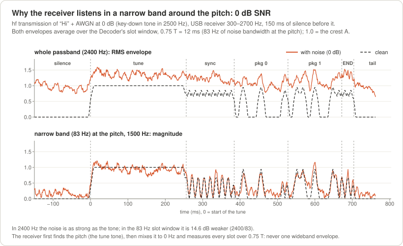

*The `hf` transmission of "Hi" with noise at 0 dB SNR (dashed: without noise). Top: the whole 2400 Hz passband, where
the noise is as strong as the tone and the beeps are lost in it. Bottom: the band of 83 Hz around the pitch that one
slot window (0.75 T = 12 ms) lets through, where the noise is 14.6 dB weaker: the tune tone, every marker (with its dip
at the twist) and every 1 stand out.*

### 5.13 Bytes back in their places

**In plain words.** Every package has a number, counted from the first START, so every bit knows its place in the
message. A byte is handed out only when all eight of its bits are there. If a package is lost, the bytes that touch it
are simply missing; the bytes after it are still right, with their exact `byte_index`.

**Exact rules** (spec §3.13): package k carries stream bits k·N .. k·N + d − 1; byte b (stream bits 8b..8b + 7) is
emitted when all its bits come from released packages, with its `byte_index` b, its 8 soft values and the OR of its
packages' flags. A byte never mixes bits across a gap. At `end`, `lost` and `reset()` a partial byte is dropped.

---

## 6. Protocol specification, for engineers and scholars

**In plain words.** This section is the exact recipe: the formulas of the sound, the timing to the sample, how bytes
become packages, the packet format and the numbers the receiver decides with. Everything here comes from
[`spec.md`](spec.md) (sections §1 to §3), and the worked examples are generated from the library itself by `make docs`
into [`docs/protocol_examples.md`](docs/protocol_examples.md), which stops with an error if the library and the spec's
examples disagree.

### 6.1 The waveform

*In plain words:* the formulas of the beep, the silence and the marker of
[2.1](#21-a-beep-a-silence-and-a-marker).

u ∈ [0, 1) is the position inside a slot of length T; A is the **crest** (the key-down peak amplitude, the same for data
beeps, markers and the tune tone); s ∈ {+1, −1} is the **carrier sign**; φ is one continuous oscillator phase at the
pitch, never reset during a transmission.

```
w(u) = sin²(2πu)            u < 0.25              Tukey window, alpha 0.5: ramps of T/4, flat top of T/2
     = 1                    0.25 <= u <= 0.75
     = sin²(2π(1 − u))      u > 0.75

r(u) = +1                   u <= 0.375            the twist: a shaped 180° phase reversal
     = cos(4π(u − 0.375))   0.375 < u < 0.625     (= 1 − 2·sin²(2π(u − 0.375)))
     = −1                   u >= 0.625

y[n] = A · s · e(u) · sin(φ[n])
```

| Slot kind (`SlotKind`) | Envelope e(u) | Carrier sign | Energy (T·A²/2 units) |
|---|---|---|---|
| `silent` (lead-in, tail) | 0 | – | 0 |
| `tone` (the tune tone, at least 6 slots) | w(u) rising in its first slot (u < 0.25), 1 in between, w(u) falling in its last slot (u > 0.75) | s | ≈ 1 per slot |
| `one` (data 1) | w(u) | s | 0.6875 |
| `zero` (data 0) | 0 | – | 0 |
| `marker` (sync, START/STOP, END) | w(u)·r(u) | s during the slot, **s ← −s after it** | 0.5625 (−0.87 dB) |

- Data slots never reverse the phase; only markers do. The envelope is 0 at every slot edge: no key clicks.
- The carrier sign starts at +1 with the tune tone.
- A marker's spectrum matches a data beep's (−40 dB width 9.76/T against 9.87/T).
- USB/LSB inversion or mistuning only moves the pitch; a mirrored reversal is still a reversal, so the twist survives.
- Window gains used by the receiver: g_s = 0.9394 (the mean of w over the central 0.75 T), g_m = 0.8355 (the mean of
  |w·r| over each 0.35 T half of a marker).
- Why α 0.5 and not a squarer beep: α 0.25 would carry +0.89 dB more energy at the same crest, but it would put 66 % of
  the crest at 0.075 T from the slot edge (α 0.5: 21 %), and the receiver's noise estimate and its guards rely on
  quiet slot edges.

### 6.2 Timing and limits

*In plain words:* where every slot starts, to the sample, and which settings the encoder accepts.

- **Slot grid.** `slot_us` is any integer from 4000 to 128000 µs. Slot j starts exactly at sample ⌈j·L⌉ with
  L = rate·`slot_us`/10⁶ (a 64-bit slot phase in two 32-bit words): the grid never drifts (at most 1 sample over 10⁴
  slots). The lead-in is a partial first slot, then whole slots follow.
- **Parts:** lead-in `lead_in_ms`; tune tone N_tune = max(⌈`tune_ms`/T⌉, 6) slots; sync N_sync = `sync_markers`
  (8..32) markers, the last one the first START; the packages; END = 2 markers; tail `tail_ms`.
- **The configuration rules**, in the order `EncoderConfig::check()` tests them (it returns the first one broken):

| `ConfigError` | Rule |
|---|---|
| `sample_rate` | 8000..192000 Hz |
| `tone` | `tone_hz` in 300..2700 Hz |
| `slot` | `slot_us` in 4000..128000 µs |
| `fast_tone` | `slot_us` < 8000 needs `tone_hz` ≥ 1000 Hz |
| `bits_per_package` | N in 1..`UNLIMITED_MAX_BITS_PER_PACKAGE` (32 on a PC, 16 in Arduino builds) |
| `package_length` | (N + 1)·`slot_us` ≤ 1,152,000 µs |
| `passband` | a valid passband: low < high ≤ 4000 Hz |
| `outside_passband` | the occupied band fits the passband |
| `sync_markers` | 8..32 |
| `amplitude` | > 0 (default 23197, −3 dBFS) |

`DecoderConfig::check()` tests `min_slot` (`k_min_window_slot_ms`..`k_max_window_slot_ms`: 4..32 ms), `passband`
(valid, and a non-empty search range), `decision_mode` and `fixed_ratio` (0 < r < 1).

### 6.3 Bits and packages

*In plain words:* how the bytes become one row of bits and the row becomes packages
([2.2](#22-packages-bits-between-a-start-and-a-stop)).

```
stream bit j (j = 0 .. 8n − 1)   = bit (7 − j mod 8) of byte ⌊j / 8⌋                    most significant bit first
package k (k = 0 .. P − 1)       carries stream bits k·N .. k·N + d_k − 1
                                 d_k = N for k < P − 1;  d_(P−1) = 8n − N·(P − 1);  P = ⌈8n/N⌉
data slot i of package k         (i = 1 .. d_k) carries stream bit k·N + i − 1: slot kind `one` for 1, `zero` for 0
```

**The last package and the end.** At every START (the last sync marker, then every STOP) the encoder counts the bits
still to send: R = 8·`queued()` − the bits already sent of the byte being sent (the oldest one in the queue).

- R ≥ N: a full package.
- 0 < R < N: a **short final package** of R data slots, its STOP, then END. A short final package always ends the
  transmission; bytes written while it is being sent wait for the next `start()`.
- R = 0: END at once.

So a transmission goes on as long as the application keeps at least N bits queued at every START; running dry at a
package boundary ends it normally. The encoder never pads.

**"Hi" = 0x48 0x69,** stream `01001000 01101001`:

| N | Packages (START … STOP each) | Data slots + STOPs | Slots in the transmission (`hf` timing) | `duration_samples(2)` at 8000 Hz |
|---|---|---|---|---|
| 8 (the HF presets) | `01001000` · `01101001` | 18 | 44 | 6432 samples = 804 ms |
| 4 | `0100` · `1000` · `0110` · `1001` | 20 | 46 | 6688 samples = 836 ms |
| 3 (a byte spans two packages; a short final package) | `010` · `010` · `000` · `110` · `100` · `1` | 22 | 48 | 6944 samples = 868 ms |

The whole transmission with the `hf` preset (N = 8, T = 16 ms, 1500 Hz) at 8000 Hz, L = 128 samples per slot:

| Slot | Part | Slots | Carrier sign during the slot |
|---|---|---|---|
| 0–15 | tune tone | steady tone, ramped up in slot 0 and down in slot 15 | + |
| 16–23 | sync train | 8 markers; slot 23 is the START of package 0 | + − + − + − + − (it turns after each) |
| 24–31 | package 0 | zero one zero zero one zero zero zero (0x48 'H') | + |
| 32 | STOP of package 0 = START of package 1 | marker | + (then −) |
| 33–40 | package 1 | zero one one zero one zero zero one (0x69 'i') | − |
| 41 | STOP of package 1 | marker | − (then +) |
| 42–43 | END | 2 markers | + − |
| – | tail | 100 ms of silence | – |

44 slots × 128 samples + 800 tail samples = **6432 samples = 804 ms**. `Encoder::status()` during slot 28: segment
`package`, kind `one`, slot 5, package_bits 8, byte 0x48, bit_index 4, package_index 0, byte_index 0, slot_index 28.
[`docs/protocol_examples.md`](docs/protocol_examples.md) lists every slot of this transmission, and of the N = 4 and
N = 3 ones, with its start time, its bit and its carrier sign.

### 6.4 Duration

*In plain words:* how long a transmission lasts, to the sample, so the transmitter can be keyed exactly that long.

For n ≥ 1 bytes, B = 8n data slots and P = ⌈B/N⌉ STOPs, a transmission lasts

```
lead + (N_tune + N_sync + B + P + 2)·T·rate + tail   samples, within ±1 sample
```

(tune tone + sync train, the first START included, + data slots + STOPs + END). `Encoder::duration_samples(n)` returns
it: how long to hold the PTT. It is 0 for 0 bytes or an invalid configuration and saturates at 2³² − 1. The overhead
per transmission (lead-in + tune + sync + END + tail) is 676 ms for `hf_slow`, 516 ms for `hf`, 436 ms for `hf_fast`
and `am`, and 692 ms for `fm`. The 15-byte packet "CQ DE PY2" of [6.7](#67-the-packet-layer):

| Preset | Lead-in | Tune | Sync | Data slots | STOPs | END | Tail | Slots | `duration_samples(15)` |
|---|---|---|---|---|---|---|---|---|---|
| `hf_slow` | 0 ms | 8 | 8 | 120 | 15 | 2 | 100 ms | 153 × 32 ms | 39968 (4.996 s) |
| `hf` | 0 ms | 16 | 8 | 120 | 15 | 2 | 100 ms | 161 × 16 ms | 21408 (2.676 s) |
| `hf_fast` | 0 ms | 32 | 8 | 120 | 15 | 2 | 100 ms | 177 × 8 ms | 12128 (1.516 s) |
| `am` | 0 ms | 32 | 8 | 120 | 8 | 2 | 100 ms | 170 × 8 ms | 11680 (1.460 s) |
| `fm` | 300 ms | 63 | 8 | 120 | 8 | 2 | 100 ms | 201 × 4 ms | 9632 (1.204 s) |

### 6.5 Bandwidth

*In plain words:* how wide the signal is and how it sits in a filter ([4.6](#46-passband-width-and-shift-tolerance)).
All integer, so the same code runs on an AVR:

```
occupied_band(tone, T):   half = ⌈4400 · 500 / T_µs⌉ Hz;   band = [tone − half, tone + half];   width = 2·half   (4.4/T)
width_26db_hz(T)        = ⌈7000 · 1000 / T_µs⌉ Hz                                                          (7.0/T)
width_40db_hz(T)        = ⌈9900 · 1000 / T_µs⌉ Hz                                                          (9.9/T)
passband_valid(p)       : p.low_hz < p.high_hz <= 4000
passband_fit(band, p)   : the pure filter fit: margin_low = band.low − p.low;  margin_high = p.high − band.high
                          (negative: outside);  fits = both >= 0;  tolerance = min(margins) when it fits, else 0
search_range(p, T_min)  : [max(300, p.low + h), min(2700, p.high − h)],  h = half of the occupied band at 8·T_min,
                          the slowest slot of the window;  from 1000 Hz when T_min < 8 ms  (DecoderConfig::search_range())
passband_fit(tone, T, p, search) : the shift tolerance: the filter fit of occupied_band(tone, T); when it fits,
                          margin_low = max(0, min(band.low − p.low, tone − search.low)),
                          margin_high = max(0, min(p.high − band.high, search.high − tone))
passband_fit(config)    : the same with search_range(config), the receiver that hears the sender by default
                          (T_min 4 ms below T = 8 ms, 8 ms up to T = 64 ms, else the smallest whole ms holding T)
```

Where 4.4/T comes from (simulation of the waveform; frequencies in units of 1/T, so every width scales exactly with T):

| Quantity | Value |
|---|---|
| 99 % of one data slot's energy | 4.34/T |
| 99 % of one marker's energy (its twist puts about 1 % in side lobes at ±3.7/T) | 6.86/T |
| 99 % of random package streams, N = 2..32 | 4.10/T .. 4.58/T |
| Power inside 4.4/T, every stream measured (random data N = 1..32, all ones, all zeros, 0101…, a sync train) | ≥ 98.64 % |
| Power inside 7.0/T, the same streams | ≥ 99.08 % |
| −26 dB and −40 dB widths of a data slot's spectrum | 7.00/T and 9.87/T |

The 99 % width of a whole stream moves with the data (the last 1 % falls wherever the markers' side lobes put it), so
the constant uses the stable figure, 99 % of one data slot; a filter edge just outside it removes at most 1.4 % of a
slot's energy, which does not measurably change the decoding. For an emission-bandwidth figure, use the −26 dB width.

| T | 4 ms | 5 ms | 8 ms | 12 ms | 16 ms | 20 ms | 32 ms | 64 ms | 128 ms |
|---|---|---|---|---|---|---|---|---|---|
| Occupied band (4.4/T) | 1100 Hz | 880 | 550 | 368 | 276 | 220 | 138 | 70 | 36 |
| −26 dB width (7.0/T) | 1750 Hz | 1400 | 875 | 584 | 438 | 350 | 219 | 110 | 55 |
| −40 dB width (9.9/T) | 2475 Hz | 1980 | 1238 | 825 | 619 | 495 | 310 | 155 | 78 |

Shift tolerance at 1500 Hz (down / up, Hz), `passband_fit(config)` of a 1500 Hz sender with slot T in each passband;
beyond 1200 Hz the receiver's 300–2700 Hz search sets the limit, and at 4 ms its 1000 Hz lower edge:

| T | SSB 1.8 kHz (300–2100) | SSB 2.4 kHz (300–2700) | SSB 2.7 kHz (200–2900) | SSB 3.0 kHz, AM (100–3000) | NBFM (300–3000) |
|---|---|---|---|---|---|
| 128 ms | −1182 / +582 | ±1182 | ±1200 | ±1200 | −1182 / +1200 |
| 64 ms | −1165 / +565 | ±1165 | ±1200 | ±1200 | −1165 / +1200 |
| 32 ms | −1131 / +531 | ±1131 | ±1200 | ±1200 | −1131 / +1200 |
| 16 ms | −1062 / +462 | ±1062 | −1162 / +1200 | ±1200 | −1062 / +1200 |
| 8 ms | −925 / +325 | ±925 | −1025 / +1125 | −1125 / +1200 | −925 / +1200 |
| 4 ms | −500 / +50 | −500 / +650 | −500 / +850 | −500 / +950 | −500 / +950 |

In a 1.8 kHz filter a 1200 Hz pitch centres the band: `hf` then has ±762 Hz, `fm` −200 / +350 Hz (its receiver
searches from 1000 Hz).

### 6.6 Levels and the SNR convention

*In plain words:* how loud each part of the signal is, and what the SNR numbers of this README mean.

- **SNR** is the power of the key-down tone (A²/2) over the noise in a 2500 Hz band, the convention of the WSJT modes.
  For AM and FM the channel simulator's SNR is the carrier's power over the noise in 2500 Hz, and FM also reports the
  carrier-to-noise ratio (CNR) in the 12.5 kHz channel.
- **Average power.** Random data averages (0.5625 + N·0.5·0.6875)/(N + 1) of the key-down power: N = 1: −3.44 dB;
  N = 8: −4.34 dB; N = 16: −4.48 dB; N = 32: −4.55 dB. The tune tone is at full key-down power, so set the transmitter
  level with it: the tune tone gives the peak envelope power (PEP) you want, with the ALC inactive.
- **The matched-filter bound** of the [BER figure](#72-noise-awgn) uses the energy of a data 1 over the noise density:
  E1/N0 = SNR · 2500 Hz · T · 0.6875.

### 6.7 The packet layer

The modem carries a stream of bytes. For messages, the optional packet layer wraps each one with a sync word, a length
and a CRC; the reader finds the packets in the byte stream and drops damaged ones.

```
[0x2D][0xD4][LEN hi][LEN lo][payload, LEN bytes][CRC hi][CRC lo]        LEN 1..k_packet_max_payload
CRC-16/CCITT-FALSE: polynomial 0x1021, initial value 0xFFFF, over the two LEN bytes and the payload
                    check: "123456789" -> 0x29B1
k_packet_max_payload = UNLIMITED_PACKET_MAX: 1024 on a PC, 256 on AVR (a build-wide define, 1..65529)
```

| Payload | Packet |
|---|---|
| "Hi" | `2D D4 00 02 48 69 93 4A` (CRC 0x934A) |
| "CQ DE PY2" | `2D D4 00 09 43 51 20 44 45 20 50 59 32 F4 E5` (CRC 0xF4E5), 15 bytes |

With N = 8 each packet byte is one package; with N = 16 "Hi" becomes the four packages `0010110111010100` ·
`0000000000000010` · `0100100001101001` · `1001001101001010`, and with `hf` (N = 8) the packet lasts 98 slots + the tail
= 13,344 samples = 1.668 s.

`PacketReader` hunts for `2D D4`, rejects LEN 0 or above the maximum at once, and after a CRC failure rescans the
buffered bytes from the byte after the failed `2D`, so no packet behind it is lost. `end` and `lost` events, and a byte
whose `byte_index` is not the previous one + 1 (the bytes of a lost package are missing), make it rescan the bytes
behind an incomplete candidate and start over. Several packets may follow each other in one transmission. The handler
gets the OR of the flags of the packet's bytes (`late_join`, `flywheel_start`, `flywheel_stop`, `blanked`, `weak`).

### 6.8 Twist detection

To test for a twist at a moment c, the receiver compares the half slot before c with the half slot after it (spec §3.4):

```
S_b = S[c − W, c)     S_a = S[c, c + W)     W = 0.35·T     n_e = the effective noise samples of W (CIC-2 corrected)
q      = −Re(S_b·S_a*) / (σ²·n_e)                        reversal strength
q_bal  = q − | |S_b|² − |S_a|² | / (2·σ²·n_e)            balanced: the onset of a beep against silence goes negative
κ      = −2·Re(S_b·S_a*) / (|S_b|² + |S_a|²)             ≈ +1 for a twist, ≈ −1 for a continuous tone
A_mk   = |S_b − S_a| / (W·B·g_m)                         the marker's crest
```

S[a, b) is the complex sum of the mixed-down signal over that span, σ² the noise variance per sample, B the block
length. A **twist** (`is_flip`) needs q ≥ 4, κ ≥ 0.3 (0.5 after a missed STOP) and κ ≥ min(1 − 1/E − 4.2/√E, 0.75)
with E = q/κ: a true reversal of energy E has κ ≈ 1 − 1/E, so a strong "twist" far below that is a smeared marker of
another speed or a mistuned tone. The audit and new candidates use the balanced q_bal, which removes the false alarms
of a 0→1 or 1→0 edge.

### 6.9 The decision rule

*In plain words:* the reference line and the decision line of [2.4](#24-how-the-receiver-reads-a-package), as
formulas.

For a package with START at position S, STOP at position E and d data slots (spec §3.10):

```
Tf        = (E − S)/(d + 1)                                           this package's own slot length
a_i       = 2·|S_i| / (n_d·g_s)                                       slot i's level over its central 0.75·Tf, i = 1..d
ref_i     = A_START + (A_STOP − A_START)·i/(d + 1)                    the reference line
N_a       = 4σ²·n_eff(M_d)/(n_d·g_s)²                                 the expected a² of an empty slot
N_m       ≈ 1.355·N_a                                                 the expected A_mk² of an empty marker
smart     : a² = 2·max(ref_i² − N_m, 0)/N_a;  ρ ← 0.6, then 3 times ρ = 0.5 + ln(2π·a²·ρ)/(2a²), clamped to 0.50..0.75
            (0.75 when a² ≤ 0): where a Rician "1" and a Rayleigh "0" are equally likely
fixed     : ρ = fixed_ratio (0.70)
thr_i     = max(ρ·ref_i, 2.6·√N_a)                                    never below the noise floor (noise alone: P ≈ 1.2e-3)
bit_i     = a_i ≥ thr_i
soft_i    = clamp(round(64·(a_i − thr_i)/thr_i), −127, 127)          sign = the bit, 64 = one line of margin
```

| a | 2 | 3 | 4 | 5 | 6 | 8 | 10 | 15 |
|---|---|---|---|---|---|---|---|---|
| smart ρ | 0.750 | 0.705 | 0.630 | 0.591 | 0.567 | 0.542 | 0.529 | 0.515 |

- A bit within 12.5 % of its line is flagged `weak`. `level_pct` = 100·a_i/ref_i and `threshold_pct` = 100·thr_i/ref_i
  are in the `slot` events.
- The noise σ² comes from the gaps at ±0.075·Tf around the slot edges between two decided zeros; a package with none
  (always so for N = 1) uses the gaps between a marker and a zero, but only while the SNR report is below 15 dB.
- The SNR report: snr_db = 10·log10((ref_avg² − N_m)·8000 / (4·2500·σ²)), with ref_avg the running average of the
  detected markers' crests.

### 6.10 The encoder's arithmetic

The encoder must run inside an 8 kHz timer interrupt of an Arduino Uno (2000 CPU cycles per sample), so it uses only
integer adds, table lookups and at most four 16×16 multiplies per sample: no division, no float (spec §1.8).

```
tone_step  = round(tone·2^32 / rate)                                  one oscillator (NCO)
slot phase = 64 bits held as two 32-bit words; step = ceil(2^64·10^6 / (rate·slot_us)): slot j starts at sample ceil(j·L)
sine       k_quarter_sine[257] = round(65534·sin(π/2·i/256)) (uint16, in PROGMEM on AVR); sine_q15 interpolates
           linearly with one 16×16 multiply: within 1 LSB of 32767·sin
u          = the high word of the slot phase
ramp       sin²(2πu) = (1 − cos 4πu)/2 = (32767 − cosine_q15(u << 1) + 1) >> 1: one lookup, no multiply
one        w(u): the ramp for u < 1/4 and u > 3/4, else 32767
marker     w·r: the ramp for u < 1/4 and u > 3/4; 32767 for 1/4 <= u <= 3/8; cosine_q15((u − 0x60000000) << 1)
           for 3/8 < u < 5/8; −32767 for 5/8 <= u <= 3/4 (the ramp negated after 3/4)
output     mul_q15(mul_q15(A, e), sine_q15(tone_phase)),  mul_q15(a, b) = (a·b + 2^14) >> 15
sign flip  after a marker: tone_phase += 2^31 at the slot edge (an exact negation, no jump of the oscillator)
bits       one per data slot, shifted out of the oldest byte in the queue, MSB first
```

`EncoderConfig::check()`, `occupied_band()` and `passband_fit()` are integer-only too: `make arduino_check` fails if the
Uno example links any soft-float routine.

---

## 7. Performance

> **Measured by the long regression suite (`make test_long`) on the released decoder (2026-09-27), and by
> `make docs`.** The suite ran 31 tests, 30 passed; of its 370 result rows 260 pass, 90 are reports and 20 fail, all 20
> in the late-join speed test (a known weakness, [7.8](#78-known-limits)). No test asks for literally zero bit errors:
> with random noise even a perfect receiver sometimes gets 1 bit in 24,000 wrong, so where a test once asked for none
> it asks for at most 1 in 10,000 (BER ≤ 1e-4), and still for no extra byte and no byte in a wrong place. Everything is
> simulated (the channel simulator of `pc/`); nothing has been measured on the air yet.

### 7.1 In plain words

- **SNR** (signal-to-noise ratio) compares the power of a steady beep with the power of the noise in a 2500 Hz band, the
  convention of the WSJT modes such as FT8 (a popular weak-signal digital mode). In decibels (dB): 0 dB means the beep
  is as strong as that noise; −3 dB, half as strong. Unlimited decodes signals weaker than the noise in 2500 Hz because
  it listens only in a narrow band around the pitch ([5.12](#512-why-the-receiver-listens-in-a-narrow-band)).
- **BER** (bit error rate) is the share of bits that arrive wrong: 1e-3 is 1 bit in 1000. **Lost** bytes never came out;
  **wrong** bytes came out different from what was sent; **extra** bytes were never sent at all. Unlimited is built to
  prefer lost bytes to wrong or extra ones.
- **In plain noise** each preset works down to about −3 dB (`hf_slow`), 0 dB (`hf`) and +3 dB (`hf_fast`), with 1 bit in
  1000 wrong; 3 dB more gives almost no errors at all. Halving the speed gains 3 dB.
- **In HF fading** one bit per slot has an **error floor**: while the signal changes between a START and its STOP, some
  level decisions go wrong however strong the signal is: 2 to 5 bits in 1000 on a typical path, 1 to 2 in 100 on a poor
  one, depending on the slot length. The START→STOP reference line keeps the floor this low; forward error correction is
  the planned cure.
- Mistuning, the other sideband, clock errors of ±1000 ppm (0.1 %), static crashes, a receiver's automatic gain control
  (AGC), keyed CW (Morse) next to the signal, FM and AM all pass their tests.
- **Integrity:** in the whole suite no byte was released at a wrong position, no packet with a valid CRC was wrong, and
  noise, carriers, keyed CW and speech never made the receiver lock. The weak spots are listed in
  [7.8](#78-known-limits).

### 7.2 Noise (AWGN)


*Bit error rate against SNR for the three HF presets, measured through the real chain (encoder → USB channel with white
noise, tuned up to ±50 Hz off → decoder that learns the pitch, T and N by itself), 200,000 bits per point. The dashed
curves are the matched-filter bound (known timing, level and best threshold); the measured curves reach 1 error in 1000
about 0.6–0.7 dB from it: hf_slow at −3.2 dB, hf at −0.3 dB, hf_fast at +2.8 dB. Hollow points: the receiver missed
some transmissions (below 90 % of the bytes delivered), because finding the tune and the sync train, not reading the
bits, is the limit at the far left. The gray diamonds are the dropped v0.2 multi-pitch design's `hf` preset (139 bit/s,
from its own spec, not rerun): more efficient in plain noise, the price v0.3 pays for its simplicity.*

The release gates (spec §4.1, test A1: BER ≤ 1e-3 and at most 1 % of the bytes lost at the gate SNR), measured by the
long suite over a USB channel with white noise and a receiver mistuned up to ±50 Hz:

| Sender (T, N) | Gate SNR | BER at the gate | Bytes lost | Locked at the gate (≥ 99 %) | Locked 2 dB lower (≥ 90 %) | Fixed 70 % line at gate + 4.5 dB | Worst SNR-report error |
|---|---|---|---|---|---|---|---|
| `fm` (4 ms, 16) | +8.0 dB | 3.4e-5 | 0.00 % | 99.5 % | 99.7 % | 4.9e-6 | 0.86 dB |
| `hf_fast` (8 ms, 8) | +4.5 dB | 9.8e-5 | 0.00 % | 100 % | 99.3 % | 0 | 0.36 dB |
| `am` (8 ms, 16) | +4.5 dB | 1.4e-4 | 0.05 % | 100 % | 96.3 % | 0 | 0.47 dB |
| **`hf`** (16 ms, 8) | **+1.5 dB** | **4.4e-5** | 0.02 % | 100 % | 100 % | 2.9e-5 | 0.32 dB |
| `hf_slow` (32 ms, 8) | −1.5 dB | 8.8e-5 | 0.02 % | 100 % | 99.7 % | 9.3e-5 | 0.33 dB |
| 64 ms, N = 8 | −4.5 dB | 8.8e-5 | 0.03 % | 100 % | 98.7 % | 5.9e-5 | 0.38 dB |
| 128 ms, N = 8 | −6.5 dB | 4.9e-6 | 0.09 % | 100 % | 97.7 % | 0 | 0.37 dB |
| `hf` with N = 1 | +1.5 dB | 3.9e-5 | 0.05 % | 100 % | 97.3 % | – | 0.81 dB |
| `hf` with N = 4 | +1.5 dB | 8.4e-5 | 0.84 % | 100 % | 98.0 % | – | 0.37 dB |
| `hf` with N = 16 | +1.5 dB | 9.3e-5 | 0.00 % | 100 % | 98.0 % | – | 0.37 dB |
| `hf` with N = 32 | +1.5 dB | 7.3e-5 | 0.05 % | 100 % | 97.0 % | – | 0.25 dB |

- Every gate passes; the BER gate with 7 to 200 times margin. The SNR the receiver reports is within 0.9 dB of the truth
  from the gate to 20 dB above it (gate: ±1.5 dB).
- N barely changes the error rate at a given T: N = 1, 4, 16 and 32 all land within 0.5 dB of N = 8. It changes the
  speed and the behaviour in fading.
- The lock columns use 16-byte messages, 8 packages or more at every N but 32; at N = 32 they use 64-byte messages
  (16 packages). A 16-byte message at N = 32 has only 4 packages, and one faded STOP loses it all: such messages locked
  in 98.75 % of the tries at the gate and 86.7 % 2 dB lower. The lock gates count messages of at least 8 packages (spec
  §0.8, decision G2).
- The `fm` row is the `fm` waveform through the same USB noise channel; real FM is in [7.5](#75-am-and-fm).
- Rules of thumb: +3 dB per doubling of T; the smart decision line is about 4 dB better than the fixed 70 % line.

### 7.3 HF fading

**In plain words.** On HF the signal comes down along two paths a millisecond or two apart, and the ionosphere moves:
the two echoes add up and cancel in turn, so the signal fades in and out (a few times per second on a poor path). The
**CCIR** channels are the standard test paths: *good* (echoes 0.5 ms apart, fading 0.1 Hz), *moderate* (1 ms, 0.5 Hz)
and *poor* (2 ms, 1 Hz). **QSB** is slow, deep fading.

| Channel (long suite) | SNR | `hf_slow` (32 ms, N 8) | `hf` (16 ms, N 8) | Gate (on `hf_slow`) |
|---|---|---|---|---|
| C1 CCIR good | 25 dB | BER 3.3e-4, 99.97 % of bytes delivered | 1.0e-3, 99.6 % | BER ≤ 1e-3: pass |
| C2 CCIR moderate | 30 dB | 4.7e-3, 99.9 % | 2.2e-3, 98.6 % | ≤ 2.5e-2: pass (both) |
| C3 CCIR poor | 30 dB | 1.7e-2, 99.9 %, locked 99.0 % of the airtime | 9.2e-3, 92.3 % | ≤ 6e-2, locked ≥ 90 %: pass |
| C4 flat Rayleigh fading, 1 Hz | 30 dB | 1.50e-2 | 4.6e-3 | ≤ 1.5e-2: pass, with no margin |
| C5 QSB, 20 dB deep at 0.2 Hz | 15 dB at the crest | 98.9 % of the bytes correct | 86.5 % | ≥ 95 %: pass |
| C13 receiver AGC + CCIR moderate | 30 dB | 2.8e-3 (0.54 × the BER without AGC) | – | pass |
| C14 USB and LSB, CCIR moderate, pitch shifted to the filter edge | 30 dB | 4.4–4.5e-3 (pitch 379 or 2621 Hz) | 1.9–2.4e-3 (448 or 2552 Hz) | ≤ 2.5e-2: pass |

- More SNR does not remove these floors: `hf_slow` on CCIR moderate makes 5.1e-3 at 20 dB, 4.7e-3 at 30 dB and still
  4.7e-3 at 33 dB.
- Shorter slots help against the floor (`hf` makes fewer bit errors than `hf_slow` on every fading path: its START and
  STOP are closer in time), but in the troughs of deep fades a 16 ms bit drops below the noise sooner, so `hf` loses
  more whole bytes on CCIR poor and in QSB.
- The reference line drawn from START to STOP is what keeps the floors this low: 2.4 times fewer errors than using the
  START's height alone, 23 times fewer than a fixed level (the C2 ablation of
  [5.7](#57-reading-the-bits-the-reference-line-and-the-decision-line)).
- For the record, the dropped v0.2 multi-pitch design measured far lower floors (3.7e-5 on CCIR moderate), because a
  pitch decision needs no level threshold. v0.3's answer is forward error correction on the soft values
  ([roadmap](#13-history-and-roadmap)).

### 7.4 Interference, radio effects and clocks

| Test | Condition | Result (long suite) |
|---|---|---|
| C6 static crashes (QRN) | 20 impulses/s at 30 × the key-down amplitude, `hf_slow`, +6 dB | 0 errors; on clean noise the impulse blanker changes nothing (BER ratio 1.00) |
| C7 receiver AGC | 1 ms attack, 300 ms decay, `hf_slow` at its gate | BER 1.70 × the BER without AGC (gate 2 ×): pass |
| C8 steady carrier | 6 dB above the tone, 250 to 1000 Hz away, at 0 dB SNR | BER ≤ 2.2e-5 (82–100 % of the bytes delivered): pass |
| | 6 dB above the tone, 250 Hz away: finding the signal | 95–98 %: pass |
| | 12 dB above the tone, 350 to 1000 Hz away: finding the signal | 96–100 %: pass |
| | 12 dB above the tone, 250 or 300 Hz away | 22–32 % at 250 Hz, 80–83 % at 300 Hz: reported, a known limit ([7.8](#78-known-limits)) |
| | 100 Hz away | no lock (reported) |
| C9 keyed CW | 20 WPM, equal peak power, 300 Hz away, +3 dB | 0 errors |
| C12 flutter (0.5 ms, 10 Hz) | `hf`, 30 dB | BER 7.2e-2 (the level changes within a package), 0 extra bytes of 13,420 |
| L5 clock error | ±1000 ppm on the sender, the receiver or both, 10 min at 16 ms, N = 8 and 32 | 0 errors, 0 slips, one lock, the measured T never more than 0.17 % off |
| L19 filters and shifts | 4 SSB filters × 5 presets, the pitch shifted down and up by its printed shift tolerance less 10 Hz | 44 of 44 rows pass: every byte, and 0 bit errors in every row but one: `hf_fast` in the 1.8 kHz filter (pitch 585 Hz) had 1 bit error in 24,000 at 3 dB above the gate, a zero read 2 % above its decision line in the middle of a message, plain noise (the same condition over 384,000 more bits: 0 errors); the test allows up to 1 in 10,000 (BER ≤ 1e-4) and no extra or misplaced byte |

### 7.5 AM and FM

| Test | Condition | Result (long suite) |
|---|---|---|
| C10 FM, pre- and de-emphasis | `fm` preset at CNR 6 / 8 / 10 / 14 dB | BER 3.6e-5 at 6 dB, 0 from 8 dB, 0 bytes lost: pass |
| | `hf` over FM, CNR 6–14 dB | 0 errors: pass |
| C15 FM, flat transmitter, de-emphasising receiver | `fm` preset, CNR 6–14 dB | 6.4e-5 at 6 dB, 0 from 8 dB: pass |
| C11 AM, modulation 0.8, 6 kHz IF | `hf_slow` at CNR 2 dB | 0 errors: pass |
| | `am` preset at CNR 6 dB | BER 1.7e-4: pass |
| | `am` preset below 6 dB | 8.1e-4 at 5 dB, 2.1e-3 at 4 dB, 4.4e-3 at 3 dB, 1.4e-2 at 2 dB (reported) |

An 8 ms slot carries a quarter of the energy of a 32 ms slot, so the `am` preset needs about 4 dB more CNR than
`hf_slow`: its test gate is CNR 6 dB, `hf_slow`'s 2 dB (spec §0.8, decision G1).

### 7.6 Six channels at a glance


*"Hi" with the `hf` preset through six simulated channels, each decoded by the real decoder told only its profile.
Clean, USB tuned +150 Hz at 10 dB, LSB (the audio mirrored) tuned −150 Hz at 10 dB and NBFM at 10 dB CNR decode in
20 of 20 runs with other noise seeds; AM at 10 dB in 19 of 20. On CCIR poor fading at 20 dB the run shown got no lock
and released nothing (a missing message, not a wrong one), and 11 of 20 runs decoded exactly: a two-byte message has
only its own preamble, and a fade there loses it.*

### 7.7 Integrity: false locks and wrong data

**In plain words.** The worst thing a modem can do is invent data. Unlimited checks every new lock before it releases
a byte, and the tests count what gets through anyway.

| Test | Condition | Result (long suite) | Gate |
|---|---|---|---|
| F1 noise alone | 30 min per profile | 0 locks, 0 bytes | pass |
| F2 drifting carrier, 20 dB | 30 min per profile | 0 locks | pass |
| F3 keyed CW, 12–30 WPM | 30 min per profile | 0 locks, 0 bytes | 0 locks: pass |
| F4 speech-like bursts | 30 min per profile | 0 locks, 0 bytes | 0 locks: pass |
| F5 packets with a valid CRC but wrong data | everything in F1–F4 and every C point | 0 (28,460 of 41,203 packets delivered) | pass |
| F6 longest run of wrong bytes | every point at 3 dB or more above its gate | 5 bytes | ≤ 8: pass |
| Bytes released at a wrong position | every lock of the 238 L5, A and C points, at any SNR | 0 | never (spec §3.13) |

Five more 30-minute seeds of F3 and F4 per profile (15 hours): no false lock either. The first run of this suite on v0.3,
before the decoder's integrity fix (spec §0.7, rows I20–I28), had found 535 bytes released at wrong positions in 11
locks, a sender with N = 12 joined as if N were 8, and 39 false locks on CW and speech; the released decoder has none.
A CRC never let a wrong packet through: use the packet layer for anything that matters.

### 7.8 Known limits

Each is an open problem of spec §11.2; none of them releases a byte at a wrong position, and none is hidden by a relaxed
test.

- **Error floors in fading** ([7.3](#73-hf-fading)): no forward error correction yet.
- **Short messages in deep fading.** Each transmission carries its own preamble; if a fade hits the tune tone or the
  sync train, the whole message is lost (a two-byte "Hi" on CCIR poor at 20 dB: 11 of 20 runs). A receiver can join
  a running transmission only when N is a multiple of 8, and then the first bytes are still missing.
- **Late joins are slow.** A receiver switched on in the middle of a transmission joins it in 97 % of the tries, but
  within 6 packages in only 56 % of them (medians of 5 to 12 packages, slowest with 8 ms slots), and a few starts need
  several seconds or never join; the test asks 95 % within 6 packages and fails. No join released a wrong byte. The
  lead: the receiver's list of recent twists (16 entries) fills up with copies of the same twist seen at several
  scales, pushing out the older twists the join needs.
- **A strong carrier close to the pitch.** With a carrier 12 dB above the tone and 250 Hz away the receiver finds the
  signal in only 22–32 % of the tries, 300 Hz away in 80–83 % (with wrong bytes in the 300 Hz tries), from 350 Hz in
  96–100 %. A carrier 6 dB above the tone is fine from 250 Hz.
- **The `am` preset on AM** needs about 6 dB of CNR, where `hf_slow` needs 2 dB ([7.5](#75-am-and-fm)).
- **Very short messages at N = 32** (4 packages) lock in 98.75 % of the tries at the gate and 86.7 % 2 dB lower.
- **One extra byte after a lost END in slow fading.** When the END markers fall into a deep QSB fade, the receiver
  can carry on across the silence to the next transmission and release one byte of noise (seen once, `hf_slow` at
  18 dB in 20 dB-deep QSB). The packet layer's sync word and CRC keep it out of your data.
- **Slow senders just below the gate:** at 64 and 128 ms slots, 2 dB below the gate, 4 and 7 transmissions of 300 are
  not found (the gate asks at least 90 %).
- **Faded sync markers:** with 3 of the 8 sync markers faded, 1 transmission in 2800 (N = 16) lost its first 8 bytes
  (T measured on 5 markers was 1.7 % off).
- **Interference from the first sample:** `hf_fast` behind an interferer present from the very first sample loses its
  preamble and is joined late.
- **Not measured or built yet:** the ESP32's CPU load; the ARM (STM32) build.
- **Not tested on hardware or on the air**, and the cross-thread encoder queue has not been stress-tested with a
  thread sanitizer.

---

## 8. Using the API

### 8.1 In plain words

The core is a small C++11 library in namespace `unlimited`; `#include "unlimited.h"` (on Arduino, `<unlimited.h>`)
brings all of it.

- An **`Encoder`** turns bytes into audio samples. You write bytes into its queue, call `start()`, and pull the samples
  with `render()` (a buffer at a time) or `next_sample()` (one at a time, from a timer interrupt).
- A **`Decoder`** eats audio samples (8000 Hz, 16-bit) and calls your function with **events**: it locked on a signal,
  here is a byte, the transmission ended, the signal was lost.
- Optional helpers: **packets** (`packet_build()` and `PacketReader`, with a CRC), **WAV files** (`WavWriter`,
  `WavReader`) and the **audio driver boundary** (`AudioOutput`, `AudioInput`) that a sound card or a DAC implements.

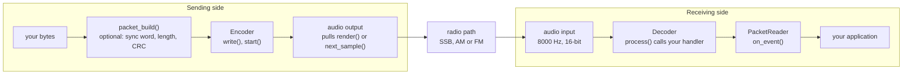

| Header | What it gives |
|---|---|
| `protocol.hpp` | the on-air constants and the receiver's speed-window limits (`k_min_window_slot_ms`, `k_max_window_slot_ms`); `occupied_band()`, `width_26db_hz()`, `width_40db_hz()`, `passband_valid()`, `search_range()`, `passband_fit()`; `Band`, `Passband`, `PassbandFit`; `ConfigError`; `sine_q15()`, `cosine_q15()` |
| `encoder.hpp` | `Preset`, `EncoderConfig` (`from_preset()`, `check()`, `valid()`), `occupied_band(config)`, `search_range(config)`, `passband_fit(config)`, `Encoder`, `EncoderStatus`, `EncoderSegment`, `SlotKind` |
| `decoder.hpp` | `Profile`, `DecisionMode`, `DecoderConfig` (`for_profile()`, `check()`, `valid()`, `max_slot_ms()`, `search_range()`), `Decoder`, `Event`, `EventType`, `DecoderState`, `LostReason`, the event flags |
| `packet.hpp` | `crc16_ccitt()`, `packet_build()`, `PacketReader`, the packet constants |
| `audio_io.hpp` | the driver boundary: `SampleSource`, `SampleSink`, `AudioOutput`, `AudioInput`, and the adapters `EncoderSource`, `DecoderSink` |
| `wav_codec.hpp` | `ByteSink`, `ByteSource`, `WavWriter`, `WavReader`, `WavOutput`, `WavFormat`, `wav_build_header()` |
| `platform.hpp` | `rom_read_u16()`, `compiler_barrier()`, `release_fence()`, `acquire_fence()` |
| `dsp.hpp` | the decoder's internal building blocks, not part of the API; only `k_decoder_rate_hz` (8000) is |

The core uses no heap, no exceptions, no RTTI and no STL, `float` but never `double`, and only `<stdint.h>`,
`<stddef.h>`, `<math.h>` and `<string.h>`. Virtual functions exist only at the driver boundary. The encoder, the band
functions and `EncoderConfig::check()` use integers only.

**The API is frozen for v0.3** (spec §5.4): every declaration listed in spec §5 stays exactly as it is in every 0.3
release, so code written against it keeps compiling and behaving the same. A change would need a new version. Only
`dsp.hpp` (internal) and the receiver's inner workings may still change, and only if every test that passes today
still passes.

Every PC snippet below is compiled with `-std=c++11 -Wall -Wextra -Wpedantic -Werror` and run against the library;
the Arduino one is compiled by `arduino-cli` with all warnings on.

### 8.2 Sending: the Encoder

```cpp
#include "unlimited.h"

#include <vector>

const size_t k_chunk_samples = 256;

// The whole transmission of `size` bytes as audio at rate_hz (8000..192000 Hz).
std::vector<int16_t> encode(const uint8_t* data, size_t size, uint32_t rate_hz) {
    unlimited::EncoderConfig config = unlimited::EncoderConfig::from_preset(unlimited::Preset::hf, rate_hz);
    // Change what you need: config.slot_us, config.bits_per_package, config.tone_hz, config.passband, ...
    std::vector<int16_t> audio;
    if (config.check() != unlimited::ConfigError::none) return audio;  // check() names the first rule broken

    unlimited::Encoder encoder(config);
    audio.reserve(encoder.duration_samples(size));  // the exact length: how long to hold the PTT

    size_t queued = encoder.write(data, size);  // the queue takes up to Encoder::k_queue_size (64) bytes
    if (!encoder.start()) return audio;
    int16_t chunk[k_chunk_samples];
    for (;;) {
        queued += encoder.write(data + queued, size - queued);  // keep the queue topped up
        const size_t count = encoder.render(chunk, k_chunk_samples);
        if (count == 0) break;  // the tail is out: the transmission is over
        audio.insert(audio.end(), chunk, chunk + count);
    }
    return audio;
}
```

- The encoder **streams**: at every START it checks the queue, sends a full package while at least N bits wait, a short
  final package when fewer do, and END when none do. Keep the queue topped up and a message of any length goes out as
  one transmission; let it run dry and the transmission ends normally.
- `duration_samples(n)` is exact to one sample: key the PTT for that long. `busy()` is true until the last tail sample.
- `status()` tells a user interface what is being sent: the segment, the slot kind, the package, the byte and the bit
  (`EncoderStatus`). `abort()` stops at once without END (the receiver then reports `lost`).
- There is no reconfigure call: build a new `Encoder` while idle.

### 8.3 Receiving: the Decoder and its events

```cpp
#include "unlimited.h"

#include <cstdio>
#include <vector>

const uint8_t k_missing_byte = '?';
const uint32_t k_drain_slots = 8;  // silence after a recording, in slots of the slowest T: the last package completes
const uint32_t k_ms_per_s = 1000;

struct Reception {
    std::vector<uint8_t> bytes;  // each byte at its byte_index: a byte that was lost stays k_missing_byte
    bool ended;
};

void on_event(const unlimited::Event& event, void* context) {
    Reception& rx = *static_cast<Reception*>(context);
    switch (event.type) {
        case unlimited::EventType::locked:  // pitch, T and N were found in the signal
            std::printf("locked: pitch %.1f Hz, T %.2f ms, N %u bits per package, SNR %.1f dB%s\n", event.tone_hz,
                        event.slot_ms, static_cast<unsigned>(event.bits_per_package), event.snr_db,
                        (event.flags & unlimited::event_flag_late_join) != 0 ? " (late join)" : "");
            break;
        case unlimited::EventType::byte:  // also soft[8] (one confidence per bit) and flags
            if (rx.bytes.size() <= event.byte_index) rx.bytes.resize(event.byte_index + 1, k_missing_byte);
            rx.bytes[event.byte_index] = event.value;
            break;
        case unlimited::EventType::end:
            rx.ended = true;
            break;
        case unlimited::EventType::lost:     // event.reason: signal_gone, alias, preamble_timeout, reset, unsupported
        case unlimited::EventType::state:    // SEARCH, ACQUIRE, PREAMBLE, TRACK
        case unlimited::EventType::slot:     // telemetry: every decided bit with its level and decision line
        case unlimited::EventType::package:  // telemetry: every package
            break;
    }
}

// Feeds a recording (8000 Hz int16) to a decoder, then a little silence, as a file ends abruptly.
void feed(unlimited::Decoder& decoder, const std::vector<int16_t>& audio_8k) {
    decoder.process(audio_8k.data(), audio_8k.size());  // any chunking gives the same events
    const size_t samples_per_slot = decoder.config().max_slot_ms() * unlimited::k_decoder_rate_hz / k_ms_per_s;
    const std::vector<int16_t> silence(k_drain_slots * samples_per_slot, 0);
    decoder.process(silence.data(), silence.size());
}

Reception decode(const std::vector<int16_t>& audio_8k) {
    Reception rx;
    rx.ended = false;
    unlimited::Decoder decoder(unlimited::DecoderConfig::for_profile(unlimited::Profile::ssb), &on_event, &rx);
    feed(decoder, audio_8k);
    return rx;
}
```

- Input is 8000 Hz int16 (`unlimited::k_decoder_rate_hz`); on a PC, `pc::ResamplingSink` converts any rate. The result
  is identical whatever the chunking: `process()` with one sample or with 4096.
- The handler runs inside `process()` and must not call back into the decoder. Use one decoder from one task, never
  from an interrupt.
- Place bytes by their `byte_index`: after a fade a byte may be missing, and the next one tells you where it belongs.
- `reset()` forgets everything, the station memory included. `dcd()` is true while the receiver holds a signal
  (carrier detect, for a modem's channel access). `tone_hz()`, `slot_ms()`, `snr_db()` and `bits_per_package()` tell
  what it measured.
- An invalid `DecoderConfig` (`check()` names the rule) leaves the decoder silent.
- `DecoderConfig::min_slot_ms` is the shortest slot the receiver hears, from `unlimited::k_min_window_slot_ms` to
  `unlimited::k_max_window_slot_ms` (4 to 32 ms); it then hears up to `max_slot_ms()`, 8 times that. Name the
  constants rather than copying the numbers.

**Events** (spec §5.1). Every event carries `state`, `tone_hz`, `slot_ms`, `snr_db` and, while a lock holds N,
`bits_per_package`.

| Event | When | Its own fields |
|---|---|---|
| `state` | on every change of state | `state` = the new state |
| `locked` | a new lock passed the guard, before its first byte | `flags` (`late_join`), `bits_per_package`, `package_index` of the first package released |
| `slot` | a bit was decided (telemetry) | `value` (the bit), `slot` (1..d), `level_pct`, `threshold_pct`, `start_pct`, `stop_pct`, `soft[0]`, `flags`, `package_index` |
| `package` | a package was decided (telemetry) | `value` (its bit count d), `start_pct`, `stop_pct`, `flags`, `package_index`, `slot_ms` (its own T) |
| `byte` | a byte is complete | `value`, `byte_index`, `soft[0..7]` (MSB first), `flags` (the OR of its packages'), `package_index` (of its last bit) |
| `end` | the END markers | `package_index` of the last package |
| `lost` | the lock was given up | `reason` |

`slot` and `package` events are telemetry: they come before the bytes they complete and are never taken back, even
for a package later dropped. Only `locked` and `byte` carry data. An `end` may also close a transmission that never
locked (it was too short or failed its checks); no `locked` and no byte come before such an `end`.

| Flag | Meaning |
|---|---|
| `event_flag_late_join` (0x01) | the lock joined a transmission already running: a relock after a fade or a cold join |
| `event_flag_flywheel_start` (0x02) | the package's START was not detected; it was measured where predicted |
| `event_flag_flywheel_stop` (0x04) | the same for its STOP |
| `event_flag_blanked` (0x08) | the impulse blanker cut part of the package |
| `event_flag_weak` (0x10) | a bit within 12.5 % of its decision line |

| `LostReason` | When |
|---|---|
| `signal_gone` | three quarters of the recent STOPs are missing, a new tune tone started before END, or a new lock failed its checks |
| `alias` | the audit found twists where a right lock has none, or T left the window: the lock was at a wrong T or N |
| `preamble_timeout` | the preamble could not confirm N in time, or refused an uncertain start |
| `reset` | `reset()` during PREAMBLE or TRACK |
| `unsupported` | the sender's N is above this build's `UNLIMITED_MAX_BITS_PER_PACKAGE` |

### 8.4 Packets

```cpp
#include "unlimited.h"

#include <cstdio>
#include <vector>

void on_packet(const uint8_t* payload, uint16_t size, uint8_t flags, void* context) {
    (void)context;
    std::printf("packet, %u bytes%s: %.*s\n", static_cast<unsigned>(size),
                (flags & unlimited::event_flag_late_join) != 0 ? " (late join)" : "", static_cast<int>(size),
                reinterpret_cast<const char*>(payload));
}

void on_event_for_packets(const unlimited::Event& event, void* context) {
    static_cast<unlimited::PacketReader*>(context)->on_event(event);  // uses the byte, end and lost events
}

void packet_round_trip() {
    const char text[] = "CQ DE PY2";
    const uint16_t text_size = sizeof text - 1;
    uint8_t packet[text_size + unlimited::k_packet_overhead];
    const size_t packet_size = unlimited::packet_build(reinterpret_cast<const uint8_t*>(text), text_size, packet,
                                                       sizeof packet);
    // packet: 2D D4 00 09 43 51 20 44 45 20 50 59 32 F4 E5 (sync, LEN 9, "CQ DE PY2", CRC 0xF4E5)

    const std::vector<int16_t> audio = encode(packet, packet_size, unlimited::k_decoder_rate_hz);

    unlimited::PacketReader reader(&on_packet, nullptr);
    unlimited::Decoder decoder(unlimited::DecoderConfig(), &on_event_for_packets, &reader);
    feed(decoder, audio);  // prints: packet, 9 bytes: CQ DE PY2
}
```

`PacketReader` takes `byte`, `end` and `lost` events and ignores the rest; its handler gets the payload of every packet
whose CRC is good, with the OR of its bytes' flags. `crc_errors()` counts the damaged ones.

### 8.5 Checking the bandwidth

```cpp
#include "unlimited.h"

#include <cstdio>

const uint32_t k_rate_hz = 8000;
const unlimited::Passband k_ssb_1800 = {300, 2100};  // a narrow 1.8 kHz SSB filter
const unlimited::Passband k_too_narrow = {1250, 1750};
const uint32_t k_slot_16_ms = 16000;                  // slot_us is in microseconds

// The demos' bandwidth line, e.g. for hf_fast in a 1.8 kHz filter:
// "occupied bandwidth 550 Hz (1225-1775 Hz); passband 300-2100 Hz: fits; shift tolerance -925/+325 Hz"
void print_bandwidth(const unlimited::EncoderConfig& config) {
    const unlimited::Band band = unlimited::occupied_band(config);  // integer only: fine on an AVR too
    const unlimited::PassbandFit fit = unlimited::passband_fit(config);
    std::printf("occupied bandwidth %u Hz (%u-%u Hz); passband %u-%u Hz: ", static_cast<unsigned>(band.width_hz),
                static_cast<unsigned>(band.low_hz), static_cast<unsigned>(band.high_hz),
                static_cast<unsigned>(config.passband.low_hz), static_cast<unsigned>(config.passband.high_hz));
    if (fit.fits)
        std::printf("fits; shift tolerance -%d/+%d Hz\n", fit.margin_low_hz, fit.margin_high_hz);
    else
        std::printf("does not fit\n");  // a negative margin says how far the band sticks out on that side
}

void bandwidth_check() {
    unlimited::EncoderConfig config = unlimited::EncoderConfig::from_preset(unlimited::Preset::hf_fast, k_rate_hz);
    config.passband = k_ssb_1800;
    print_bandwidth(config);  // fits; shift tolerance -925/+325 Hz

    config.passband = k_too_narrow;
    print_bandwidth(config);  // does not fit: 550 Hz of signal, 500 Hz of filter
    if (config.check() == unlimited::ConfigError::outside_passband) {  // the Encoder would refuse to start
        config.slot_us = k_slot_16_ms;  // longer slots are narrower: 276 Hz (1362-1638 Hz) fits
        print_bandwidth(config);        // fits; shift tolerance -112/+112 Hz
    }
}
```

`passband_fit(config)` is the shift tolerance a sender can promise: the filter's room, each side limited to the
pitches the receiver that hears it searches (`search_range(config)`). A receiver prints the band of what it hears with
plain numbers and its own search: `passband_fit(tone_hz, slot_us, config.passband, config.search_range())`
(`examples/arduino/rx_esp32` does it on every lock). `passband_fit(band, passband)` is the pure filter fit, without any
search: it may promise more than a receiver follows.

### 8.6 WAV files

The core WAV codec needs no file system: it reads and writes through a `ByteSource` / `ByteSink`, here a `FILE*` (the
`wav_sd_esp32` example uses an SD card `File`).

```cpp
#include "unlimited.h"

#include <cstdio>

const uint32_t k_wav_rate_hz = 48000;
const size_t k_wav_chunk_samples = 256;

class StdioSink : public unlimited::ByteSink {  // bytes to a FILE*; an SD card File works the same way
public:
    explicit StdioSink(std::FILE* file) : file_(file) {}
    bool write(const uint8_t* data, size_t size) override { return std::fwrite(data, 1, size, file_) == size; }
    bool seek(uint32_t position) override { return std::fseek(file_, static_cast<long>(position), SEEK_SET) == 0; }

private:
    std::FILE* file_;
};

class StdioSource : public unlimited::ByteSource {
public:
    explicit StdioSource(std::FILE* file) : file_(file) {}
    size_t read(uint8_t* data, size_t size) override { return std::fread(data, 1, size, file_); }
    bool seek(uint32_t position) override { return std::fseek(file_, static_cast<long>(position), SEEK_SET) == 0; }

private:
    std::FILE* file_;
};

// Writes one transmission (up to Encoder::k_queue_size bytes) as a 16-bit mono WAV file at 48 kHz.
bool write_wav(const char* path, const uint8_t* data, size_t size) {
    unlimited::Encoder encoder(unlimited::EncoderConfig::from_preset(unlimited::Preset::hf, k_wav_rate_hz));
    if (encoder.write(data, size) != size || !encoder.start()) return false;
    std::FILE* file = std::fopen(path, "wb");
    if (file == nullptr) return false;
    StdioSink sink(file);
    unlimited::WavOutput output(sink, encoder.duration_samples(size));  // the "wav:" driver, sizes known up front
    unlimited::EncoderSource source(encoder);                          // the Encoder as a SampleSource
    const bool ok = output.start(source, k_wav_rate_hz) && output.wait();
    return std::fclose(file) == 0 && ok;
}

// Feeds an 8000 Hz WAV file (PCM or float, mono or several channels mixed to mono) to a decoder.
bool decode_wav(const char* path, unlimited::Decoder& decoder) {
    std::FILE* file = std::fopen(path, "rb");
    if (file == nullptr) return false;
    StdioSource source(file);
    unlimited::WavReader reader;
    bool ok = reader.open(source) && reader.format().sample_rate_hz == unlimited::k_decoder_rate_hz;
    int16_t chunk[k_wav_chunk_samples];
    size_t count = 0;
    while (ok && (count = reader.read(chunk, k_wav_chunk_samples)) > 0) decoder.process(chunk, count);
    std::fclose(file);
    return ok;  // another rate: resample first (pc::ResamplingSink on a PC)
}
```

`WavWriter` writes 16-bit PCM mono (exact, patched or streaming sizes); `WavReader` reads 8/16/24/32-bit PCM and 32-bit
float, mono or several channels downmixed to mono, as int16 or as float. On a PC, `pc/wav.hpp` wraps both for files and
`pc/audio.hpp` opens `wav:<path>` and `null` devices.

### 8.7 Writing an audio driver

The core never touches an audio device. A driver implements `AudioOutput` (it pulls a `SampleSource` until `read()`
returns 0) or `AudioInput` (it pushes what it captures into a `SampleSink`). `EncoderSource` and `DecoderSink` adapt the
encoder and the decoder to them. The core interfaces have protected, non-virtual destructors, so no `operator delete`
is pulled into a microcontroller build; PC drivers derive from `pc::OutputDevice` / `pc::InputDevice`, which add a
virtual destructor.

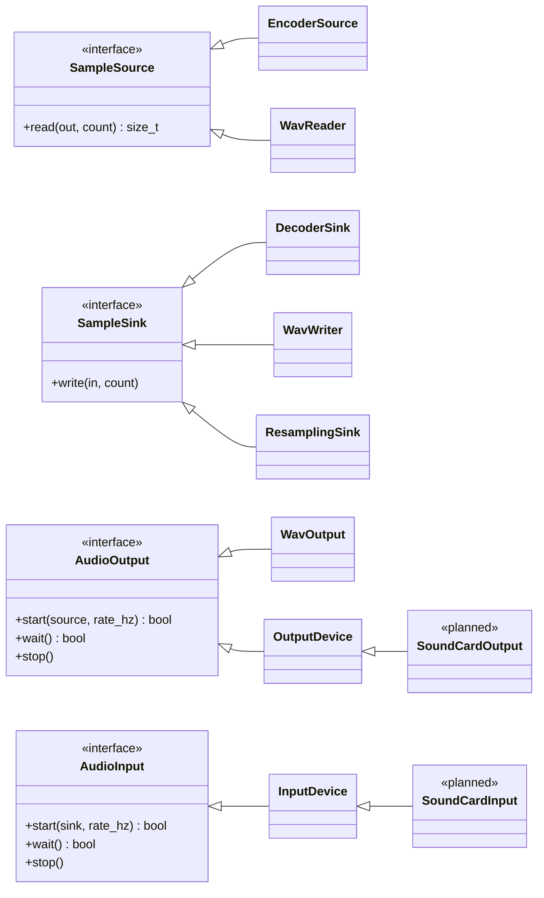

Today there are the WAV, `null` and memory drivers (`pc/audio.hpp`); sound cards (CoreAudio, ALSA, WASAPI) come with
the modem phase. A callback-driven output, event-driven (the waiting thread sleeps on a condition variable, nothing
polls):

```cpp
#include "unlimited.h"

#include <condition_variable>
#include <cstring>
#include <mutex>

// A sound API that pulls audio from its own thread: a stand-in for CoreAudio, ALSA, WASAPI or an I2S DMA callback.
typedef void (*StreamCallback)(int16_t* out, size_t count, void* user);
bool platform_open_stream(uint32_t rate_hz, StreamCallback callback, void* user);
void platform_close_stream();

class CallbackOutput final : public unlimited::AudioOutput {
public:
    bool start(unlimited::SampleSource& source, uint32_t rate_hz) override {
        source_ = &source;
        finished_ = false;
        delivered_ = false;
        return platform_open_stream(rate_hz, &CallbackOutput::callback, this);
    }
    bool wait() override {  // sleeps until the source runs dry or stop() is called: no polling
        std::unique_lock<std::mutex> lock(mutex_);
        done_.wait(lock, [this] { return finished_; });
        lock.unlock();
        platform_close_stream();
        return delivered_;
    }
    void stop() override { finish(false); }

private:
    static void callback(int16_t* out, size_t count, void* user) {  // the audio thread: the Encoder's consumer
        CallbackOutput& self = *static_cast<CallbackOutput*>(user);
        const size_t written = self.source_->read(out, count);        // EncoderSource: Encoder::render()
        std::memset(out + written, 0, (count - written) * sizeof(int16_t));
        if (written < count) self.finish(true);  // the tail is out
    }
    void finish(bool delivered) {
        std::lock_guard<std::mutex> lock(mutex_);
        if (!finished_) delivered_ = delivered;
        finished_ = true;
        done_.notify_all();
    }

    unlimited::SampleSource* source_ = nullptr;
    std::mutex mutex_;
    std::condition_variable done_;
    bool finished_ = false;
    bool delivered_ = false;
};
```

An input driver is the mirror image: its capture callback calls `sink.write()`, with a `DecoderSink` for 8000 Hz audio
or a `pc::ResamplingSink` in front of it for any other rate. Because the decoder's handler runs inside `write()`, a busy
system should hand the samples to a worker thread through a ring buffer and a condition variable, which is how the
planned modem will do it.

### 8.8 Threads and interrupts

The encoder has one **producer** and one **consumer**, which may run on different CPU cores:

- the producer (your code) calls `write()`, `queue_free()`, `queued()`, `busy()` and, while idle, `start()`;
- the consumer (a timer interrupt, or the audio thread) calls `next_sample()` or `render()`.

The queue hands bytes over with release/acquire fences, and holds exactly `Encoder::k_queue_size` bytes (64 by
default). `abort()` and `status()` touch the consumer's side: call them from the consumer, or with it stopped (for
example with interrupts masked around the call). The decoder is single-threaded: one task feeds it and receives its
events.

### 8.9 Arduino: the encoder in an interrupt

`next_sample()` is integer-only and safe in an interrupt. A minimal Arduino Uno beacon that sends a message every 10 s
(the timer setup of `examples/arduino/tx_uno`, which adds serial input, packets and a jitter-free phase). The audio
leaves pin 9 as PWM (pulse-width modulation: a fast square wave whose average follows the audio) and an RC low-pass
turns it back into sound:

```cpp
#include <unlimited.h>

const uint8_t k_audio_pin = 9;  // OC1A: PWM audio, then an RC low-pass to the radio's microphone input
const uint8_t k_ptt_pin = 8;
const uint32_t k_sample_rate_hz = 8000;
const uint8_t k_pwm_periods_per_sample = 8;
const uint8_t k_tick_prescaler = 8;
const uint16_t k_pwm_top = F_CPU / (k_sample_rate_hz * k_pwm_periods_per_sample) - 1;  // 64 kHz PWM
const uint8_t k_tick_top = F_CPU / k_tick_prescaler / k_sample_rate_hz - 1;              // 8 kHz tick
const uint8_t k_pwm_middle = (k_pwm_top + 1) / 2;
const uint8_t k_sample_high_byte = 8;
const uint8_t k_level_shift = 7;
const uint16_t k_ptt_settle_ms = 100;
const uint32_t k_repeat_ms = 10000;
const char k_message[] = "CQ DE PY2";

unlimited::EncoderConfig transmitter_config() {
    unlimited::EncoderConfig config = unlimited::EncoderConfig::from_preset(unlimited::Preset::hf, k_sample_rate_hz);
    config.lead_in_ms = k_ptt_settle_ms;  // silence while the PTT relay settles
    return config;
}

unlimited::Encoder g_encoder(transmitter_config());

void start_audio() {  // Timer1: fast PWM on pin 9; Timer2: the 8 kHz tick
    pinMode(k_audio_pin, OUTPUT);
    noInterrupts();
    TCCR1A = _BV(COM1A1) | _BV(WGM11);  // mode 14, non-inverting PWM on OC1A
    TCCR1B = _BV(WGM13) | _BV(WGM12) | _BV(CS10);
    ICR1 = k_pwm_top;
    OCR1A = k_pwm_middle;
    TCCR2A = _BV(WGM21);  // CTC on OCR2A
    TCCR2B = _BV(CS21);   // clk / 8
    OCR2A = k_tick_top;
    TIMSK2 = _BV(OCIE2A);
    interrupts();
}

ISR(TIMER2_COMPA_vect) {  // 8 kHz: the encoder's only consumer, integer math only
    const int16_t high = static_cast<int8_t>(g_encoder.next_sample() >> k_sample_high_byte);
    OCR1A = static_cast<uint8_t>(k_pwm_middle + ((high * k_pwm_middle) >> k_level_shift));
}

void setup() {
    pinMode(k_ptt_pin, OUTPUT);
    start_audio();
}

void loop() {  // the producer: write(), busy() and, while idle, start()
    if (g_encoder.busy()) return;  // still sending
    digitalWrite(k_ptt_pin, LOW);
    delay(k_repeat_ms);
    g_encoder.write(reinterpret_cast<const uint8_t*>(k_message), sizeof k_message - 1);
    digitalWrite(k_ptt_pin, HIGH);
    g_encoder.start();  // lead-in, tune tone, sync train, 9 packages, END, tail: about 1.9 s
}
```

It compiles warning-free with `arduino-cli compile --fqbn arduino:avr:uno --warnings all` (6,354 bytes of flash and
164 bytes of RAM). On an ESP32 the decoder runs in task context: fill a buffer of 8000 Hz samples (from ADC DMA,
decimated) and call `decoder.process()` from `loop()` or a task, as `examples/arduino/rx_esp32` does.

### 8.10 Build-wide options

Define these for the whole build (with `-D`, or as a build property on Arduino), never in one source file:

| Define | Default | Effect |
|---|---|---|
| `UNLIMITED_MAX_BITS_PER_PACKAGE` | 32; 16 when `ARDUINO` is defined | the largest N this build sends and decodes, 16..64; the decoder grows by about 0.57 KB per bit |
| `UNLIMITED_ENCODER_QUEUE` | 64 | the encoder's queue in bytes, a power of two 16..128, large enough for two packages at the cap |
| `UNLIMITED_PACKET_MAX` | 1024; 256 on AVR | the largest packet payload, 1..65529 |

---

## 9. Demo CLI and channel simulator reference

### 9.1 `unlimited_encode`

```
unlimited_encode (--text STR | --in FILE) [--out SPEC] [--packet]
    [--preset hf_slow|hf|hf_fast|am|fm] [--slot-ms X | --baud B] [--bits N]
    [--tone HZ] [--passband LO:HI] [--rate 8000] [--level-dbfs -3] [--lead-in-ms N] [--tune-ms N] [--sync N]
    [--channel clean|usb|lsb|am|fm [--snr DB] [--offset HZ] [--pivot HZ] [--rx-passband LO:HI]
        [--fading none|flat|good|moderate|poor|flutter] [--doppler HZ] [--qsb DEPTH_DB:RATE_HZ]
        [--impulses RATE[:LEVEL_DB]] [--carrier HZ:DB] [--cw HZ:DB:WPM] [--agc]
        [--fm-deviation HZ] [--no-preemphasis] [--no-deemphasis] [--clock-ppm P] [--seed N]
        [--clean-out SPEC]]
    [--tui] [--realtime]
```

| Option | Meaning | Default |
|---|---|---|
| `--text STR`, `--in FILE` | the data: a text, or the bytes of a file | – |
| `--packet` | wrap the data in CRC-16 packets of up to 1024 bytes | off |
| `--out SPEC` | where the audio goes: `wav:<path>`, `<path>.wav` or `null` | `tx.wav` |
| `--preset NAME` | the starting point: `hf_slow`, `hf`, `hf_fast`, `am`, `fm` | `hf` |
| `--slot-ms X`, `--baud B` | the slot length T, 4..128 ms (decimals allowed), or slots per second (T = 1000/B ms) | the preset's |
| `--bits N`, `-N N`, `--bits-per-package N` | bits per package, 1..32 | the preset's (8 or 16) |
| `--tone HZ` | the pitch, 300..2700 Hz | 1500 |
| `--passband LO:HI` | the receiver's filter the signal must fit | the preset's (300:2700; `am` 100:3000, `fm` 300:3000) |
| `--rate HZ` | the audio sample rate, 8000..192000 | 8000 |
| `--level-dbfs DB` | the crest of a beep, 0 dBFS = full scale | −3 |
| `--lead-in-ms N`, `--tune-ms N`, `--sync N` | silence before the signal, the tune tone's length, the sync markers (8..32) | the preset's (0 or 300 ms, 250 ms, 8) |
| `--tui`, `--realtime` | the live view; pace the output to audio time | off |

What it prints, one labelled line each: `data` (bytes and packets), `signal` (the preset or "custom, from preset …",
the pitch, T, the baud, N, the net bit rate), `bandwidth` (the [bandwidth line](#33-the-bandwidth-line)), `emission`
(the −26 dB and −40 dB widths), `receivers` (which receiver profiles hear the signal, or which `--min-slot-ms` and
`--passband` a receiver needs), `airtime` (the duration and its parts), `level` (the crest and the packages' average
power below key-down), `audio` (samples, rate, where they went) and, with `--channel`, `channel`. Exit codes: 0
written, 2 usage error or a refused configuration (named in words, with the option to change), 3 input/output error.

### 9.2 `unlimited_decode`

```
unlimited_decode [--in SPEC] [--profile ssb|am|fm] [--min-slot-ms N] [--passband LO:HI]
    [--rule adaptive|fixed] [--ratio 0.70] [--no-blanker] [--packet] [--events] [--expect FILE]
    [--tui] [--realtime]
```

| Option | Meaning | Default |
|---|---|---|
| `--in SPEC` | the audio, any sample rate (resampled to 8000 Hz), mono or stereo | `rx.wav` |
| `--profile NAME` | `ssb` (8–64 ms, 300–2700 Hz), `am` (8–64 ms, 100–3000 Hz), `fm` (4–32 ms, 300–3000 Hz) | `ssb` |
| `--min-slot-ms N` | the shortest slot to hear, 4..32 ms: the receiver then hears N..8N ms | the profile's |
| `--passband LO:HI` | the radio's audio filter; the pitch search stays inside it | the profile's |
| `--rule adaptive\|fixed`, `--ratio R` | the decision line: the smart line, or R of the reference line (`--ratio` alone selects fixed) | adaptive; 0.70 |
| `--no-blanker` | turn off the impulse (static crash) blanker | on |
| `--packet` | print the CRC-checked packets found in the bytes | off |
| `--events` | print every event, each decided bit included | off |
| `--expect FILE` | compare with the data that was sent | – |
| `--tui`, `--realtime` | the live view; pace file input to audio time | off |

It prints `receiver` (profile, window, passband, pitch search range, decision rule, blanker) and `input`; on each lock,
`locked` (time, pitch, T, N, bit rate, SNR, and "late join" when it joined a running transmission) and `bandwidth`
(the received signal's band, from its measured pitch and T, against the passband, with the shift its own pitch search
still follows); when a lock closes, `rx` (bytes and
how it ended: `end`, `lost (reason)`, a new lock or the end of the input) and `text` (quoted, with escapes for
unprintable bytes). `--expect` places each byte at its `byte_index` and reports the bytes received, lost, wrong and
extra, the bit errors and the BER, then `result match` or `mismatch`. Exit codes: 0 decoded (and matching
`--expect`), 1 nothing decoded or no match, 2 usage error, 3 input/output error.

With `--events` the receiver shows its work; the start of "Hi" received at 10 dB (`--channel usb --snr 10`):

```
t 0.200  state acquire (DCD on)
t 0.361  state preamble (DCD on)
t 0.768  state track (DCD on)
t 0.768  slot 1  package 0  bit 0  level 13%  line 51%  START 102%  STOP 106%  soft -48
t 0.768  slot 2  package 0  bit 1  level 101%  line 51%  START 102%  STOP 106%  soft 64
t 0.768  slot 3  package 0  bit 0  level 2%  line 51%  START 102%  STOP 106%  soft -62
...
t 0.768  package 0  8 bits  T 16.00 ms  START 102%  STOP 106%
...
t 0.768  locked  pitch 1500.1 Hz, T 16.01 ms, N 8 bits per package, 55.5 bit/s, SNR 10.9 dB, first package 0
t 0.768  byte 0x48 "H"  index 0  package 0  soft -48 64 -62 -61 57 -57 -59 -53
t 0.768  byte 0x69 "i"  index 1  package 1  soft -62 62 56 -60 54 -60 -59 62
t 0.768  end  last package 1
```

Each `slot` line is one bar of the [receiver picture](#24-how-the-receiver-reads-a-package): its level and the
decision line in % of the reference line at that slot, the START and STOP crests, and the soft value. A short
transmission is released all at once, when its END confirms the lock.

### 9.3 The channel simulator

**In plain words.** A software radio path, so everything can be tested without a radio: SSB transmitters and
receivers (USB or LSB, mistuned, with the receiver's filter), AM and FM links, noise, the fading of HF paths, slow QSB,
static crashes, a steady carrier or keyed CW next to the signal, a receiver's AGC, and a sender whose sample clock is
off. Every run is repeatable: the same seed gives the same noise.

| Option (with `--channel`) | Meaning | Default |
|---|---|---|
| `--channel MODE` | `clean` (no change), `usb`, `lsb`, `am`, `fm` | – |
| `--snr DB` | SNR in 2500 Hz: the key-down tone (usb, lsb) or the carrier (am, fm) | 20 |
| `--offset HZ` | mistuning: the pitch moves by it (am, fm: the carrier's offset) | 0 |
| `--pivot HZ` | lsb: the audio is mirrored as f → pivot − f + offset | 3000 |
| `--rx-passband LO:HI` | the receiver's filter | the sender's `--passband` |
| `--fading NAME`, `--doppler HZ` | Watterson two-path fading: `good` 0.5 ms / 0.1 Hz, `moderate` 1 ms / 0.5 Hz, `poor` 2 ms / 1 Hz, `flutter` 0.5 ms / 10 Hz, `flat` (one path, 1 Hz); `--doppler` changes the spread | none |
| `--qsb DEPTH_DB:RATE_HZ` | slow fading of the signal, e.g. `20:0.2` | none |
| `--impulses RATE[:LEVEL_DB]` | static crashes per second, their peak above the key-down peak | none (20 dB) |
| `--carrier HZ:DB`, `--cw HZ:DB:WPM` | a steady carrier, or keyed Morse, at an audio frequency and a level relative to the tone | none |
| `--agc` | a receiver AGC (2 ms attack, 500 ms decay) | off |
| `--fm-deviation HZ`, `--no-preemphasis`, `--no-deemphasis` | FM: the peak deviation of a 1 kHz tone, and the 750 µs emphasis at each end | 3000 Hz, both on |
| `--clock-ppm P` | the sender's sample-clock error | 0 |
| `--seed N` | the noise and fading seed | 1 |
| `--clean-out SPEC` | also write the transmitted audio | – |

From code (`pc/channel.hpp`, standard library only, not part of the core):

```cpp
#include "channel.hpp"  // pc/: the channel simulator (standard library only)
#include "unlimited.h"

#include <vector>

const double k_int16_full_scale = 32768.0;
const double k_snr_db = 5.0;          // key-down tone power over the noise in 2500 Hz
const double k_mistuning_hz = 150.0;  // the receiver's tuning error: the pitch moves by it

// What an LSB receiver tuned 150 Hz off hears through CCIR moderate fading; tx: the encoder's audio in [-1, 1).
std::vector<float> through_the_air(const std::vector<float>& tx, const unlimited::EncoderConfig& tx_config) {
    unlimited::sim::ChannelConfig config;  // usb, 20 dB, 300-2700 Hz receiver by default
    config.mode = unlimited::sim::Mode::lsb;
    config.sample_rate = tx_config.sample_rate_hz;
    config.signal_level = tx_config.amplitude / k_int16_full_scale;  // the key-down crest: the SNR reference
    config.snr_db = k_snr_db;
    config.freq_offset_hz = k_mistuning_hz;
    unlimited::sim::apply_preset(config, unlimited::sim::FadingPreset::ccir_moderate);
    unlimited::sim::Channel channel(config);
    return channel.process(tx);
}
```

### 9.4 `make demo_run`

The contract of the demos: six round trips whose text ("CQ CQ DE UNLIMITED TEST 0123456789") must come back exactly,
with a receiver never told T or N, and one configuration the sender must refuse.

| Run | Channel | Receiver | Sender | SNR | TX rate | Mistuning |
|---|---|---|---|---|---|---|
| usb_hf | USB | `ssb` | `hf` | 10 dB | 8000 Hz | +80 Hz |
| lsb_hf_fast | LSB | `ssb` | `hf_fast` | 10 dB | 48000 Hz | −150 Hz after the mirroring |
| usb_hf_slow_narrow | USB, 300–2100 Hz filter | `ssb --passband 300:2100` | `hf_slow --tone 1200 --passband 300:2100` | 8 dB | 8000 Hz | +50 Hz |
| usb_n32 | USB | `ssb` | `hf --bits 32` | 12 dB | 8000 Hz | +80 Hz |
| am_am | AM | `am --packet` | `am --packet` | 10 dB (carrier) | 8000 Hz | +80 Hz |
| fm_fm | FM | `fm` | `fm` | 20 dB (carrier) | 8000 Hz | +80 Hz |
| refused | – | – | `hf_fast --passband 1250:1750` (550 Hz of signal, 500 Hz of filter) | – | – | must exit 2 and say "does not fit" |

---

## 10. Embedded targets

### 10.1 Memory

| Item | Size (measured) |
|---|---|
| `Decoder` at the cap `UNLIMITED_MAX_BITS_PER_PACKAGE` = 16 (Arduino default) / 24 / 32 (PC default) / 48 / 64, on the ESP32 (a 64-bit PC: 8–12 bytes more) | 16,224 / 20,760 / 25,296 / 34,468 / 43,540 bytes, each under its compile-time limit of 7,168 + 576·cap |
| `Encoder` with its 64-byte queue | 145 bytes on AVR (81 without the queue), 148 on the ESP32 and a 64-bit PC |
| `PacketReader` | 282 bytes on AVR (payload limit 256), 1,056 on the ESP32 and 1,064 on a 64-bit PC (1024) |
| `Event`, `EncoderConfig`, `DecoderConfig` | 40 bytes (39 on AVR), 24 bytes, 16 bytes (11 on AVR) |

Most of the decoder is its history: one package at the slowest T plus its END check, (cap + 5) slots of 64 blocks.
Every preset (N ≤ 16) decodes with the Arduino default cap of 16. Nothing is allocated at run time.

### 10.2 CPU

- **The encoder on an Arduino Uno** (ATmega328P at 16 MHz, 8 kHz interrupt, 2000 cycles per sample): at most 1,011
  cycles per sample and 494–628 on average (25–32 % of the CPU) for every preset, N = 1 and N = 32, and 128 ms slots
  at 2700 Hz; no tick lost, and the output is identical to the PC encoder's. `make check_embedded` measures this on a
  cycle-counting ATmega328P model and fails above 1,600 cycles or 50 % load.
- **The decoder on a PC**: 7,400 to 16,400 times real time while tracking, 4,000 times on noise, on one core of the
  development Mac.
- **The decoder on microcontrollers** (estimates, not yet measured on a board): an ESP32 or an STM32F4 under 5 % of a
  core while tracking and under 10 % while acquiring; an ESP8266 at 160 MHz about 10–12 % while acquiring (software
  floating point). The `fm` profile (blocks of 4 samples) needs a floating-point unit. The AVR runs the encoder only.
  `loopback_esp32` prints the measured CPU time per second of audio for every preset when it runs on a board.

### 10.3 The Arduino examples

`make arduino_check` compiles each one with every warning on (`tx_uno` for the Uno, the others for the ESP32), fails
on any warning from the library or a sketch, and fails if `tx_uno` links a floating-point routine.

| Sketch | Board | Flash | RAM |
|---|---|---|---|
| `tx_uno` | Arduino Uno | 9,380 bytes (29 %) | 535 bytes (26 %) |
| `rx_esp32` | ESP32 | 349,456 bytes | 44,492 bytes |
| `loopback_esp32` | ESP32 | 339,440 bytes | 73,924 bytes (three decoders) |
| `wav_sd_esp32` | ESP32 | 347,106 bytes | 23,712 bytes |

**`tx_uno`** (Arduino Uno or Nano, preset `hf`): every line typed on the serial port (9600 baud) is sent as one packet,
and the PTT is keyed while the encoder is busy. At start-up it prints the preset and the bandwidth line, in integer
arithmetic only. Timer2 ticks at 8 kHz and its interrupt loads `next_sample()` into a 64 kHz PWM on pin 9 (Timer1), in
a fixed phase so the PWM adds no jitter. Timer1 and Timer2 are taken (no Servo, no `tone()`).

```
pin 9 --[1k]--+--[10k]--+--||--[47k]--+-- radio microphone / data input
              |         |  1uF        |
            47nF      4.7nF         [470R]
              |         |             |
             GND       GND           GND
  two RC poles at 3.4 kHz: -1.6 dB at 1500 Hz, about -50 dB at the 64 kHz PWM; the 1 uF blocks the 2.5 V bias;
  47k/470R brings the 3.5 V peak-to-peak down to microphone level (35 mV). A 10k trimmer instead of the divider
  lets you set the level with the tune tone: full power, ALC not moving.
pin 8 --[1k]-- base of an NPN (2N2222), emitter to GND, collector to the radio's PTT line (HIGH = transmit).
The on-board LED follows the PTT.
```

**`rx_esp32`** (ESP32, profile `ssb`): the ADC samples the radio's audio at 24 kHz by DMA (no CPU timing, no jitter);
the sketch blocks DC and decimates by 3 to 8 kHz with a 47-tap low-pass, runs the `Decoder` and a `PacketReader` in
`loop()` and prints the profile at start-up, then on each lock the pitch, T, N, the bit rate, the SNR and the received
band against the passband with the shift its search still follows, every good packet, `end` and `lost` (serial at 115200 baud). GPIO2 (the LED of most DevKit
boards) shows DCD.

```
radio speaker / data out --||--+-- GPIO36 (VP, ADC1 channel 0)
                         1uF   |
               3V3 --[10k]-----+-----[10k]-- GND     (bias at mid-scale)
  keep the audio under about 1.5 V peak-to-peak; optional: 1k in series and 47 nF to GND at the pin
```

**`loopback_esp32`**: no wiring. A packet goes through every preset into a decoder of the matching profile in RAM; it
checks the text, one lock, one end, and that the learnt T (within 0.5 %) and N are the sent ones, and prints the
encoder's and the decoder's CPU time per second of audio. Send any character to run it again.

**`wav_sd_esp32`**: the preset `hf` into a `WavWriter` on an SD card (`/unlimited.wav`; CS GPIO5, SCK GPIO18, MISO
GPIO19, MOSI GPIO23): the core WAV codec on a microcontroller. Decode the file on a PC with
`unlimited_decode --in unlimited.wav --packet`.

### 10.4 Porting notes

- Include `unlimited.h`; Arduino compiles `src/` recursively, so the PC-only code lives in `pc/`.
- Set the build-wide defines of [8.10](#810-build-wide-options) for the whole build only. A small microcontroller keeps
  the cap at 16 (enough for every preset).
- `make check_embedded` builds the whole core with `-fno-exceptions -fno-rtti -Werror` for the host, the ATmega328P
  and the ESP32 (and ARM Cortex-M4 when `arm-none-eabi-g++` is installed; it was not, so the ARM build is still
  unverified), scans for heap, exception and RTTI symbols, and runs a decoding test linked with a `malloc` that traps.

---

## 11. Testing and quality

| Target | What it does |
|---|---|
| `make` (`make all`) | the library and the demos |
| `make lib` | `build/libunlimited.a`, the core |
| `make demo` | `bin/unlimited_encode`, `bin/unlimited_decode` |
| `make test` | 219 unit and loopback tests (187 on the core, 32 on the terminal view and the demos), about 40 s on a recent Mac; `FILTER=name` runs the tests whose name contains it |
| `make test_long` | the long regressions (AWGN A1–A4, channels C1–C15, false locks and integrity F1–F7, clock L5, passbands L19, late joins L20) in `bin/unlimited_regression`; about 8.5 minutes on a 10-core machine; exits non-zero on any FAIL row (today: the 20 rows of L20, the late-join speed, [7.8](#78-known-limits)); `FILTER=` too |
| `make check_embedded` | the core built as for a microcontroller for the host, AVR and ESP32, with the forbidden-symbol scan, the heap trap, the decoder at caps 16 and 64, the encoder with queues of 16, 64 and 128, and the AVR interrupt cycle gate |
| `make arduino_check` | `arduino-cli` builds of every example, warning-free, and no floating point in `tx_uno` |
| `make demo_run` | the round trips of [9.4](#94-make-demo_run) |
| `make tables` | checks the sine table in `src/unlimited/tables.cpp` against `tools/gen_tables.cpp` |
| `make docs` | regenerates `docs/images/*.svg` and `docs/protocol_examples.md` from the library (about 2 minutes on 10 cores; the same bytes every time) |
| `make clean` | removes `build/` and `bin/` |

```sh
make test FILTER=packet                 # the packet tests only
make test_long FILTER=L5_clock          # one long regression: 10 minutes of audio with clock errors, in seconds
```

**How the tests count.** The seeds are fixed, so every run gives the same numbers. BER counts the bits of the bytes
released; *lost* counts bytes never released, *wrong* released bytes that differ, *extra* released bytes the sender
never sent. Every gate prints its measured value, and a failing gate is investigated, never relaxed silently: a gate
changes only by a decision recorded in `spec.md` (spec §0.8). One such decision: no long-suite gate asks for
literally zero bit errors, because random noise sometimes flips 1 bit in 24,000 even for a perfect receiver; where
one did, it asks for BER ≤ 1e-4 with no extra byte and no byte at a wrong position. The test plan (spec §8) has unit
tests (U1–U29), loopback and behaviour tests (L1–L20), robustness tests (R1–R17: saturated input, retries, frequency
steps, AGC, interference from the first sample, FM near threshold, and the integrity regressions of the released
decoder), the long regressions (A, C, F) and the build and embedded checks (B1–B6). The whole unit suite also runs
clean under the address and undefined-behaviour sanitizers.

---

## 12. Project layout

```
unlimited/
  spec.md  README.md  LICENSE  library.properties  Makefile  compile_flags.txt
  src/unlimited.h                        the umbrella include (Arduino: <unlimited.h>)
  src/unlimited/platform.hpp             ROM access and memory fences
  src/unlimited/protocol.hpp .cpp        on-air constants, bands and fits; tables.cpp: the sine table
  src/unlimited/encoder.hpp .cpp         EncoderConfig, presets, Encoder
  src/unlimited/decoder.hpp .cpp         DecoderConfig, profiles, events, Decoder
  src/unlimited/dsp.hpp .cpp             internal: mixer, blanker, history, tone search, AFC, candidates, audit, learner
  src/unlimited/packet.hpp .cpp          packet_build, CRC-16, PacketReader
  src/unlimited/audio_io.hpp             the driver boundary
  src/unlimited/wav_codec.hpp .cpp       WAV reader and writer through byte sinks and sources
  pc/                                    PC only: wav, resampler, audio devices, channel simulator, terminal, TUI
  demo/                                  cli.hpp, unlimited_encode.cpp, unlimited_decode.cpp
  tests/                                 unit and loopback suite (make test), tests/support/ helpers
  tests/long/                            the long regressions (make test_long)
  tests/embedded/, tests/avr/            the heap trap and the AVR interrupt cycle gate (make check_embedded)
  tools/                                 gen_tables.cpp; doc_figures.cpp and doc_examples.cpp (make docs)
  docs/images/*.svg                      the figures of this README, drawn from the real encoder and decoder
  docs/protocol_examples.md              the bit-exact examples, generated from the library
  examples/arduino/                      tx_uno, rx_esp32, loopback_esp32, wav_sd_esp32
```

Code style: C++11, `CamelCase` types, `snake_case` functions, variables and files, a trailing `_` for private members,
`k_` named constants, `#pragma once`. [`spec.md`](spec.md) is normative: every change of behaviour, API, layout or tests
is written there first (spec-driven development).

---

## 13. History and roadmap

### 13.1 How v0.3 came to be

**In plain words.** Unlimited started as Gustavo's idea: bits as beeps on one pitch, framed by START and STOP markers
that tell the receiver the timing and the loudness of a 1. That was v0.1. v0.2 tried to go faster by sending several
bits in each beep, chosen by *which* pitch it was played on. It worked, but it was harder to understand and to verify,
and its many close pitches were more sensitive to the Doppler shifts and spreads of long HF paths (a small frequency
error moves a beep onto its neighbour's pitch, which is a wrong symbol). v0.3 returns to the original idea and makes it
configurable.

| | v0.1 (2026-09-25) | v0.2 (2026-09-26, dropped) | v0.3 (2026-09-26, this version) |
|---|---|---|---|
| The signal | one pitch; beep = 1, silence = 0 | one of 2 to 256 pitches per beep: 1 to 8 bits per beep (MFSK, multiple frequency-shift keying), next to a marker tone | one pitch; beep = 1, silence = 0 |
| Between START and STOP | 8 bits | a frame announced in an 8-slot header | N bits, chosen by the sender and learnt by the receiver |
| Speeds | T = 4 to 128 ms | 6 to 128 ms | T = 4 to 128 ms, any value; five presets |
| Default | `hf`: 32 ms, 27.8 bit/s | `hf`: 32 ms, 5 bits per beep, 139 bit/s | `hf`: 16 ms, N = 8, 55.6 bit/s |
| Fading floor (CCIR moderate, 30 dB) | 4.6e-3 | 3.7e-5 | 4.7e-3 (`hf_slow`), 2.2e-3 (`hf`) |
| Status | implemented and measured (174 unit tests) | implemented, frozen, then dropped; kept on the branch and tag `v0.2-mfsk` | released as 0.3.0 (219 unit tests, long suite 30 of 31); API frozen |

What v0.3 kept from v0.2: the encoder queue with memory fences for two CPU cores, the configuration errors that name
the broken rule, the integer AVR encoder with its 257-entry sine table, the 16-bit packet length, the WAV codec fixes,
and the receiver's hardening for one pitch (the tone-search refinements, the watch, the station memory for relocking
after a fade). What is new in v0.3: N chosen by the sender and learnt by the receiver, the configurable slot length,
pitch and speed window, bandwidth awareness with the passband check and the shift tolerance, the cold late join, and
the choice between the smart and the fixed decision line.

### 13.2 Roadmap

- **The known limits of [7.8](#78-known-limits)**, first the slow late joins (the one failing long-suite test).
- **Forward error correction and interleaving**, fed by the soft values of the byte events: the answer to the error
  floors of fading paths. The plug point is ready: `packet_build()` → FEC and interleaver → `Encoder::write()`, and
  the byte events' `soft[8]` → de-interleaver and FEC → `PacketReader`.
- **`unlimited_modem`: a KISS TNC on local audio** (a TNC, terminal node controller, is the modem that packet-radio
  programs talk to over a serial port). It lists the computer's audio inputs and outputs, sends and
  receives at the same time, and exposes a serial port (a pseudo-terminal with a `--link` symlink, or a real serial
  device) that
  speaks KISS, so packet-radio programs (AX25Toolkit's `ax25tnc` and `bbs`, linbpq, clients of Dire Wolf) can use it:
  one KISS frame is one Unlimited packet. The **modem speed** (`--preset`, `--slot-ms`, `--bits`; default `hf`, 55.6
  bit/s) and the **serial speed** (`--serial-baud`, default 115200) are separate settings. It will print the bandwidth
  line, listen before talking (CSMA, with the decoder's DCD), and key the PTT through RTS or DTR, or by VOX.
  Sound-card drivers for CoreAudio, ALSA and WASAPI come with it.
- **A multi-station receiver**, like an FT8 waterfall: several pitches side by side in the same passband, one light
  decoder per pitch. Each station still sends one pitch, one bit per slot.
- **Joining late for any N**, which would need the bit position carried in the signal.
- **Squarer beeps** (Tukey α 0.25, +0.9 dB at the same peak power), with a new noise estimator.
- **A decoder for AVR** in fixed point, if ever needed.
- **Verification**: tests on real radios and on the air, the ARM build, CPU measurements on ESP32 and STM32, a
  thread-sanitizer stress of the cross-thread queue, and long-suite runs over more seeds.
- **An idea, not planned:** an optional fast mode with several tones side by side, for strong AM and FM links.

---

## 14. Glossary

| Term | Meaning |
|---|---|
| **−26 dB width** | The width outside which the signal's spectrum stays 26 dB below its peak: the figure for an emission bandwidth (7.0/T). |
| **ACQUIRE, PREAMBLE, SEARCH, TRACK** | The receiver's four states: SEARCH finds a pitch, ACQUIRE measures T on the sync train, PREAMBLE counts N, TRACK reads the packages. |
| **ADC** | Analog-to-digital converter: turns the radio's audio into samples. |
| **AFC** | Automatic frequency control: the receiver nudges its oscillator to stay on the received pitch. |
| **AGC** | A receiver's automatic gain control: it turns the audio up and down with the signal's strength. |
| **ALC** | The transmitter's automatic level control. Keep it inactive, or it flattens the beeps. |
| **Alias** | A wrong reading that looks consistent: the right markers read at 2T or T/2, or with a wrong N. The guard and the audit catch them. |
| **AM / FM** | Amplitude / frequency modulation: the voice modes of broadcast and airband radios (AM) and of VHF/UHF repeaters and handhelds (FM). |
| **Audit** | The receiver's running check for twists where none should be (slot centres and slot edges inside a package). |
| **AWGN** | Additive white Gaussian noise: plain hiss, the reference channel. |
| **Band (occupied)** | The frequencies a configuration occupies: the pitch ± 2.2/T (99 % of a data slot's energy). |
| **Baud** | Slots (symbols) per second: 1000/T with T in ms (62.5 baud at 16 ms). |
| **BER** | Bit error rate: the share of bits that arrive wrong (1e-3 = 1 in 1000). |
| **Block** | The receiver's time step: `min_slot_ms` samples at 8 kHz, an eighth of the shortest slot it hears. |
| **Byte index** | The position of a byte in the transmission (0 = the first); byte events carry it. |
| **Carrier sign** | Whether the wave is upright or upside down; it turns over after every marker, never in a data slot. |
| **CCIR good / moderate / poor** | Standard HF test paths: two echoes 0.5 / 1 / 2 ms apart, fading at 0.1 / 0.5 / 1 Hz. |
| **CIC-2** | A cheap two-stage integrator that turns the mixed-down samples into blocks. |
| **CNR** | Carrier-to-noise ratio, for FM: the carrier's power over the noise in the 12.5 kHz channel. |
| **Cold late join** | Joining a transmission already running, without having heard its start; possible when N is a multiple of 8. |
| **CRC** | Cyclic redundancy check: 16 check bits that reveal a damaged packet (CRC-16/CCITT-FALSE here). |
| **Crest** | The peak height of a beep (A); data 1s, markers and the tune tone share it. |
| **CSMA** | Carrier-sense multiple access: listen before talking, and send only when the channel is free. |
| **CW** | Morse code sent by keying a carrier on and off. |
| **dB** | Decibel, a ratio on a log scale: +3 dB is twice the power, +10 dB ten times. |
| **dBFS** | Decibels below the full scale of the audio samples (0 dBFS is the loudest sample possible). |
| **DCD** | Data carrier detect: the receiver is busy with a signal (not in SEARCH). A modem waits for it to clear before transmitting. |
| **Decision line** | The level a slot must reach to be a 1: the smart line (50–75 % of the reference line, about 70 % when weak) or the fixed line (70 %). |
| **DMA** | Direct memory access: hardware that moves samples (here from the ADC) without the CPU. |
| **Doppler spread** | How fast an HF path's fading changes the signal, in hertz. |
| **END** | Two markers right after the last STOP: the end of a transmission. |
| **Erasure** | A package read while the signal was gone: its bytes are left out, never guessed. |
| **FEC** | Forward error correction: redundancy that repairs errors (on the roadmap). |
| **Flywheel** | Carrying on at the predicted position when a marker is not detected. |
| **Frozen API** | The public declarations of the library (spec §5): every 0.3 release keeps them exactly as they are; changing one needs a new version. |
| **FT8, WSJT** | Popular weak-signal digital modes (WSJT is the software family); Unlimited uses their SNR convention. |
| **Goertzel filter** | A cheap way to measure the power at one frequency; the tone search uses one per 50 Hz step. |
| **GPIO** | A general-purpose input/output pin of a microcontroller. |
| **Guard** | The check of a new lock's first packages before any byte is released. |
| **HF, VHF, UHF** | Radio bands: shortwave 3–30 MHz (HF, reflected by the ionosphere), 30–300 MHz (VHF) and 300–3000 MHz (UHF). |
| **History** | The receiver's memory of recent blocks, long enough for one package at the slowest T. |
| **IF** | Intermediate frequency: the stage whose filter sets an AM or FM receiver's bandwidth. |
| **Impulse blanker** | The receiver stage that silences short, broadband static crashes before the decoding. |
| **Ionosphere** | The layers of the upper atmosphere that reflect HF signals back to Earth: the skywave path. |
| **ISR** | Interrupt service routine: the function a timer interrupt runs (8000 times a second for the encoder). |
| **Key-down** | A steady beep at full crest; the SNR convention uses its power. |
| **KISS** | A simple serial protocol between a computer and a packet-radio modem (TNC). |
| **Late join / relock** | Joining a transmission that is already running: after a fade, from the station memory, or cold (see above). Flagged `late_join`. |
| **LOST** | The receiver gave up the current lock (signal gone, alias, timeout, unsupported, reset). |
| **LSB / USB** | Lower / upper sideband, the two SSB modes; LSB mirrors the audio, which only moves the one pitch. |
| **Marker** | A beep with the twist: the sync markers, START/STOP and END. |
| **Matched-filter bound** | The best a detector could do with perfect timing and level: the dashed curves of the BER figure. |
| **MFSK** | Multiple frequency-shift keying: several bits per beep, chosen by which pitch it is sent on (the dropped v0.2). |
| **MSB** | Most significant bit: each byte is sent from its highest bit down. |
| **N (bits per package)** | The number of data slots between a START and its STOP, chosen by the sender. |
| **NBFM** | Narrow-band FM, the VHF/UHF voice mode. |
| **NCO** | Numerically controlled oscillator: the sine generator at the pitch, in the sender and in the receiver. |
| **Noise floor** | The lowest a decision line may go: 2.6 × the noise amplitude of an empty slot. |
| **OOK** | On-off keying: beep = 1, silence = 0. |
| **Package** | START, N data slots, STOP. The STOP is also the next package's START. |
| **Package index** | The number of a package in the transmission (0 = the first after the sync train). |
| **Passband** | The audio frequencies a receiver lets through (e.g. 300–2700 Hz for a 2.4 kHz SSB filter). |
| **PEP** | Peak envelope power: the power at the crest. |
| **Pitch** | The one audio frequency everything is sent on (300–2700 Hz, 1500 Hz by default). |
| **ppm** | Parts per million: 1000 ppm is a clock 0.1 % fast or slow. |
| **Pre-/de-emphasis** | FM's treble boost at the transmitter and the matching cut at the receiver (750 µs). |
| **Preset / profile** | Named starting points: presets for the sender (`hf_slow`, `hf`, `hf_fast`, `am`, `fm`), profiles for the receiver (`ssb`, `am`, `fm`). |
| **PTT / VOX** | Push-to-talk / voice-operated switch: what keys the transmitter; the lead-in and the tune tone give them time. |
| **PTY** | A pseudo-terminal: a software serial port that another program can open. |
| **PWM** | Pulse-width modulation: a fast square wave whose average follows the audio; a low-pass filter turns it into sound. |
| **Q15** | A 16-bit fixed-point number whose value is the integer divided by 32768; the encoder's arithmetic uses it. |
| **QRM / QRN / QSB** | Interference from other stations / static crashes / fading. |
| **Rayleigh / Rician** | The statistics of a slot's level with noise only (Rayleigh) and with a beep plus noise (Rician); the smart line sits where the two are equally likely. |
| **Reference line** | The straight line from the START's crest to the STOP's crest: how tall a 1 should be at each slot. |
| **Shift tolerance** | How far the radio may be mistuned and the signal still be heard: the room the passband leaves on each side, never beyond the pitches the receiver searches. |
| **Short final package** | The last package of a transmission when fewer than N bits are left; its STOP comes early and END follows. |
| **Slot, slot length T** | The time unit of the signal: each slot holds one beep, one silence or one marker. T sets the speed. |
| **Smart line** | The default decision line: where a 1 and a 0 are equally likely, between 50 % and 75 % of the reference line. |
| **SNR** | Signal-to-noise ratio: here the key-down tone's power over the noise in 2500 Hz. |
| **Soft value** | A bit's confidence: its sign is the bit, 64 means one decision line of margin. |
| **Speed window** | The 8-to-1 range of slot lengths a receiver accepts: `min_slot_ms` to 8 × `min_slot_ms`, with `min_slot_ms` from 4 to 32 ms (`k_min_window_slot_ms`, `k_max_window_slot_ms`). |
| **SSB** | Single sideband, the usual HF voice mode (USB or LSB). |
| **START / STOP** | The markers that frame a package. |
| **Station memory** | What the receiver remembers of the station it was reading, to relock after a fade. |
| **Sync train** | 8 to 32 markers one slot apart after the tune tone; it gives T. Its last marker is the first START. |
| **Tail** | The silence after END. |
| **TNC** | Terminal node controller: the modem that packet-radio programs talk to over a serial port. |
| **Tukey window** | The beep's envelope: it fades in over T/4, holds for T/2 and fades out over T/4 (α = 0.5). |
| **Tune tone** | A steady beep at the start (250 ms by default): the receiver finds the pitch, the radio settles. |
| **Twist** | The 180° phase reversal in the middle of a marker: inaudible, but unmistakable for the receiver. |
| **Watch** | The tone search kept running while the receiver holds a pitch, to switch to a new station's train. |
| **Watterson model** | The standard simulation of an HF path: two fading echoes; the CCIR channels are its presets. |

---

## 15. License and author

Unlimited is released under the [MIT License](LICENSE). Copyright (c) 2026 Gustavo Campos, an amateur radio operator
and embedded C++ developer.

- Repository: [github.com/solariun/unlimited](https://github.com/solariun/unlimited)
- Specification: [`spec.md`](spec.md) (normative; every change is written there first)
- Bit-exact examples: [`docs/protocol_examples.md`](docs/protocol_examples.md) (generated by `make docs`)
- The dropped v0.2 multi-pitch design: the branch and tag `v0.2-mfsk`
