# Unlimited

**Data through the audio of any radio, one byte at a time, like a serial port.** Every byte is a short window of 10
time slots on one pitch: a START beep, its 8 bits (a beep is a 1, silence is a 0) and a STOP beep. The two stations
agree on one number, the speed in bytes per second; the receiver finds the pitch by itself, so a mistuned SSB radio,
on USB or LSB, does not matter. Unlimited is a C++11 library that runs on a PC and on microcontrollers, three programs
(`unlimited_encode`, `unlimited_decode` and `unlimited_modem`, a KISS modem for AX.25 programs) and Arduino examples,
for HF SSB, AM and VHF/UHF FM.

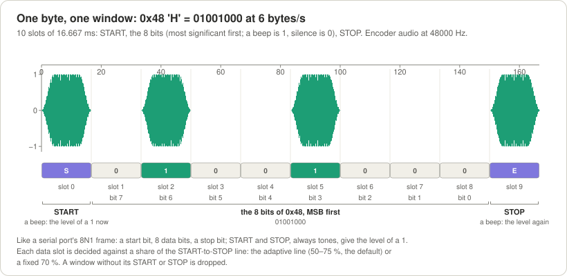

*One byte, one window: 0x48 'H' at 6 bytes per second, drawn by `make docs` from the real encoder's audio. Slot 0 is
the START, always a beep; slots 1 to 8 are the bits, most significant first (a beep is a 1, silence is a 0); slot 9 is
the STOP, always a beep. Like a serial port's "8N1" frame: a start bit, 8 data bits, a stop bit.*

> **Status (2026-09-28): v1.0 is built and measured, in simulation, through a virtual sound device and with
> pseudo-terminals standing in for radios; it has not been on the air yet.** The library, the three programs, the
> terminal view and the Arduino examples work: `make test` passes 312 of 312 tests, and `make demo_run`,
> `make check_embedded` and `make arduino_check` pass. The long regression suite measures 257 rows: 34 PASS,
> 221 REPORT and **2 known FAIL rows** (plain noise at the promised signal-to-noise ratio: at 1 and 6 bytes/s the
> receiver misses 4.0 % and 2.6 % of the transmissions, where the gate allows 1 %); Gustavo kept those gates and those
> two rows as open problems for after v1.0, so **any other FAIL is news** ([Performance](#7-performance)). Next come
> the radios on Gustavo's bench ([docs/modem.md](docs/modem.md#12-bench-checklists)). The ESP32 KISS TNC is built and
> proven on the PC (its code against a PC modem through the simulated radio); no board has run it yet. v0.3, a
> different design that is not compatible on the air, is kept at the git tag `v0.3.0` ([History](#12-history)).

## Contents

1. [What it is, and why](#1-what-it-is-and-why)
2. [How the signal works](#2-how-the-signal-works)
3. [How the receiver works](#3-how-the-receiver-works)
4. [The programs](#4-the-programs)
5. [Choosing the speed](#5-choosing-the-speed)
6. [What Unlimited does not do](#6-what-unlimited-does-not-do)
7. [Performance](#7-performance)
8. [Microcontrollers](#8-microcontrollers)
9. [Building and testing](#9-building-and-testing)
10. [The API in brief](#10-the-api-in-brief)
11. [Project layout](#11-project-layout)
12. [History](#12-history)
13. [Glossary](#13-glossary)
14. [License and author](#14-license-and-author)

Every section starts **in plain words** and then gives the details. Every term is explained where it first appears
and again in the [Glossary](#13-glossary). New here? Sections 1 to 5 are enough to use Unlimited. The operator's guide
to the KISS modem, with a checklist for each radio, is [docs/modem.md](docs/modem.md); how to run and read every test
is [docs/testing.md](docs/testing.md); [`spec.md`](spec.md) is the normative specification, and where this page and
the spec differ, the spec wins.

---

## 1. What it is, and why

### In plain words

Unlimited is a **modem**: it turns bytes into sound that a radio can carry, and that sound back into bytes. The
computer's (or microcontroller's) audio output goes into a transmitter's microphone or data input; a receiver's audio
goes into another computer's audio input.

- **One pitch.** Every sound Unlimited makes is the same short beep on one **pitch** (one audio frequency: 1500 Hz by
  default, a clear whistle in the middle of a voice radio's audio).
- **Time slots.** Time is cut into equal **slots**. In each slot the sender either beeps or stays silent: a beep is a
  **1**, silence is a **0**, like a lamp flashing to a metronome.
- **One byte, one window.** Each byte takes 10 slots: a **START** beep, the 8 bits, a **STOP** beep. Windows follow
  each other with no gap, and the first beep after silence is the START of the first byte.
- **The START and STOP set the level.** Both are always beeps, exactly as loud as a 1. The receiver draws a line from
  the START's height to the STOP's height (how loud a 1 is right now, even while the signal fades) and calls every data
  slot that reaches a good part of it (about 70 % on a weak signal) a 1.
- **One number to agree on.** Both stations set the same **speed in bytes per second** (1 to 25). Nothing else must
  match: the receiver finds the pitch, so a radio tuned a little off, or set to the other sideband, only moves the
  pitch, and the receiver follows it.
- **Nothing is added.** No preamble, no padding, no checksum: the bytes go on the air as they come and come out of the
  receiver as soon as each window is read. Checking and resending are the job of the protocol above (for example
  AX.25, [section 6](#6-what-unlimited-does-not-do)).

"Hi" (the bytes 0x48 0x69) on the air:

```
 time →  one slot = T (16.7 ms at 6 bytes/s); everything on one pitch (1500 Hz by default)

 ........  ■ □ ■ □ □ ■ □ □ □ ■  ■ □ ■ ■ □ ■ □ □ ■ ■  ........
 silence   S 0 1 0 0 1 0 0 0 E  S 0 1 1 0 1 0 0 1 E  silence (the tail)
           └── 0x48 'H' ──────┘  └── 0x69 'i' ──────┘

 ■ beep   □ silence   S START, always a beep   E STOP, always a beep
```

**Why it is built this way.** Gustavo's guiding principles for v1.0 (spec §0.2) are simplicity, computational
affordability and a clean transmission: the modem should run on the smallest hardware that can do the job, down to an
AVR such as the Arduino Nano, and nothing is added to the user's data on the air. In his words: "I am simplifying the
design for making it accessible for everyone". A serial port's frame is something every computer person knows; one
pitch keeps the signal narrow and easy to find; and a receiver that finds the pitch by itself makes HF single sideband
(SSB), where every station is tuned a little differently, work without any tuning ritual.

### At a glance

| | |
|---|---|
| Speed | any value from 1.00 to 25.00 bytes/s in steps of 0.01, the same on both sides (`--bps`); default **6 bytes/s** = 48 bit/s |
| Slot | T = 1 / (10 × speed): 16.667 ms at 6 bytes/s, so one byte takes 167 ms |
| Pitch | 300–2700 Hz, 1500 Hz by default; the receiver finds it |
| Width on the air | 99 % of the power within 264 Hz at 6 bytes/s; from 44 Hz at 1 byte/s to 1100 Hz at 25 |
| Mistuning allowed | at 6 bytes/s in a 2.4 kHz SSB filter (300–2700 Hz): ±1068 Hz |
| Weak signals | at 6 bytes/s, 2.1 wrong bits in 100,000 at +1.3 dB SNR, measured in plain noise ([section 7](#7-performance)) |
| Delay | each byte comes out 0.7–1.3 slots after its STOP, plus a fixed 0.2–0.4 s look-ahead ([section 3](#3-how-the-receiver-works)) |
| Modes | SSB (USB or LSB), AM and FM |

### Where it runs

- **PC** (macOS with CoreAudio, Linux with ALSA): the library, `unlimited_encode`, `unlimited_decode`,
  `unlimited_modem`, a channel simulator (noise, fading, interference, AM, FM) and a live terminal view.
- **Microcontrollers:** the core is plain C++11 without a heap, exceptions or run-time type information. An Arduino
  Uno or Nano sends (the encoder runs inside an 8 kHz timer interrupt, in integer arithmetic only); an ESP32 receives
  (the decoder needs 17.4 KB of RAM) and runs the whole modem core (20.2 KB): an ESP32 board is a complete KISS TNC
  for a few dollars of parts. The Arduino Nano receiver and modem come right after v1.0. The examples compile and
  fit; they have not run on a board yet ([section 8](#8-microcontrollers)).

---

## 2. How the signal works

### 2.1 A beep and a silence

**In plain words.** A **beep** fades in over the first quarter of its slot, holds, and fades out over the last quarter,
so two beeps in a row still show where each slot begins and ends, nothing clicks, and the spectrum stays narrow. A
**silence** is simply nothing. START, STOP and every 1 are the same beep.

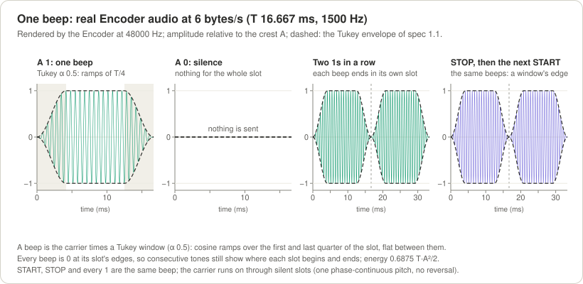

*Real encoder audio at 6 bytes/s (T = 16.667 ms, 1500 Hz). The dashed envelope is a Tukey window (α = 0.5): cosine
ramps over the first and last quarter of the slot, flat in between. Each beep is back to zero at its slot's edges.*

**In depth.** A tone slot is sin(2π f₀ t + φ) times the Tukey window, with a crest A (−3 dBFS by default); the carrier
runs on, phase-continuous, through silent slots. The encoder uses integers only (a quarter-sine table, Q15 envelope and
carrier), so an AVR can render it in a timer interrupt (spec §1.1).

### 2.2 The byte window: START and STOP are the ruler

**In plain words.** A radio signal is never equally loud: it fades, a receiver's gain moves. So each window carries its
own ruler. The START and the STOP are always beeps; the receiver measures how loud they are and draws a straight
**reference line** between them. A **decision line** sits below it; a data slot that reaches the decision line is a 1,
one below it a 0. By default the line **adapts**: about 70 % of the reference on a weak signal, down to 50 % on a
clean one, never down in the noise. A **fixed** line at 70 % (Gustavo's original rule), or any value from 50 to 90 %,
can be chosen (`--threshold 70`). A window whose START or STOP is missing is dropped: its byte is never delivered.

| Slot | 0 | 1 | 2 | 3 | 4 | 5 | 6 | 7 | 8 | 9 |
|---|---|---|---|---|---|---|---|---|---|---|
| What | START | bit 7 | bit 6 | bit 5 | bit 4 | bit 3 | bit 2 | bit 1 | bit 0 | STOP |
| 0x48 'H' | beep | 0 | 1 | 0 | 0 | 1 | 0 | 0 | 0 | beep |

### 2.3 A transmission

**In plain words.** A transmission is the byte windows back to back, between silences. Before the first byte there may
be a short silence while the radio switches to transmit (the **TX delay**, 100 ms by default when the programs key the
radio by a wire or a command) or, for a radio keyed by its **VOX** (it transmits when it hears sound), a steady **lead
tone** that wakes the VOX, followed by two silent slots so that the lead is never taken for a START. After the last
byte comes a short silence, the **tail**. A whole silent window after the last STOP is the end: there is no end marker.

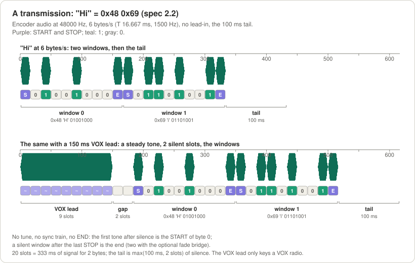

*"Hi" at 6 bytes/s from the real encoder: two windows, then the tail; below, the same after a 150 ms VOX lead (9 slots
of steady tone, ramped at both ends) and its 2-slot gap. 20 slots = 333 ms of signal for 2 bytes.*

**In depth** (spec §2): lead-in = `lead_in_ms` of silence; VOX lead = max(ceil(`vox_lead_ms` / T), 3) slots and
2 silent slots; the tail = max(`tail_ms`, 2 slots), 100 ms by default. The airtime of n bytes is lead + 10·n·T + tail;
`Encoder::duration_samples()` gives it exactly, and [section 5](#5-choosing-the-speed) tabulates it.

### 2.4 Speed and bandwidth

**In plain words.** Slower is narrower and survives more noise; faster needs a stronger signal and more room in the
receiver's filter. At 1 byte/s the signal is 44 Hz wide, at 25 bytes/s 1100 Hz. Every program prints the **bandwidth
line**: how wide the signal is, whether it fits the receiver's filter (its **passband**), and how far the radio may be
mistuned (the **shift tolerance**). A configuration that does not fit is refused, with the reason.

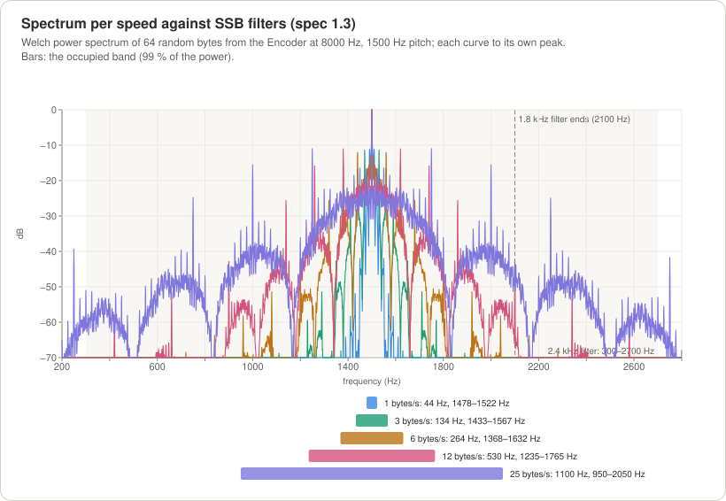

*Power spectrum of 64 random bytes from the real encoder at each speed, 1500 Hz pitch; the bars are the occupied band
(99 % of the power). The shaded area is a 2.4 kHz SSB filter (300–2700 Hz); the dashed line is where a 1.8 kHz one
ends.*

| Speed | T | Bit rate | Occupied band | −26 dB width | Shift tolerance, 2.4 kHz filter | Typical use |
|---|---|---|---|---|---|---|
| 1 byte/s | 100 ms | 8 bit/s | 44 Hz | 70 Hz | ±1178 Hz | very weak HF paths |
| 3 bytes/s | 33.3 ms | 24 bit/s | 134 Hz | 211 Hz | ±1133 Hz | weak HF |
| 6 bytes/s | 16.7 ms | 48 bit/s | 264 Hz | 420 Hz | ±1068 Hz | HF, the default |
| 12 bytes/s | 8.3 ms | 96 bit/s | 530 Hz | 841 Hz | ±935 Hz | good HF, AM |
| 25 bytes/s | 4 ms | 200 bit/s | 1100 Hz | 1750 Hz | ±650 Hz | FM |

(Computed by the library itself: [docs/protocol_examples.md](docs/protocol_examples.md), generated by `make docs`,
which also gives the tolerances in 1.8 kHz, 2.7 kHz, AM and FM filters.)

### 2.5 USB, LSB and mistuning

**In plain words.** On SSB the audio you hear is the radio signal shifted by the difference between the two radios'
dials. If the receiving radio is tuned 120 Hz off, the 1500 Hz beeps arrive at 1620 Hz; on the other sideband the
audio is mirrored, and the beeps arrive somewhere else again. Unlimited does not care: the receiver searches the whole
passband for the pitch, in 50 Hz steps, and then follows it to within a hertz. That is the reason Unlimited exists: HF
SSB without any tuning ritual.

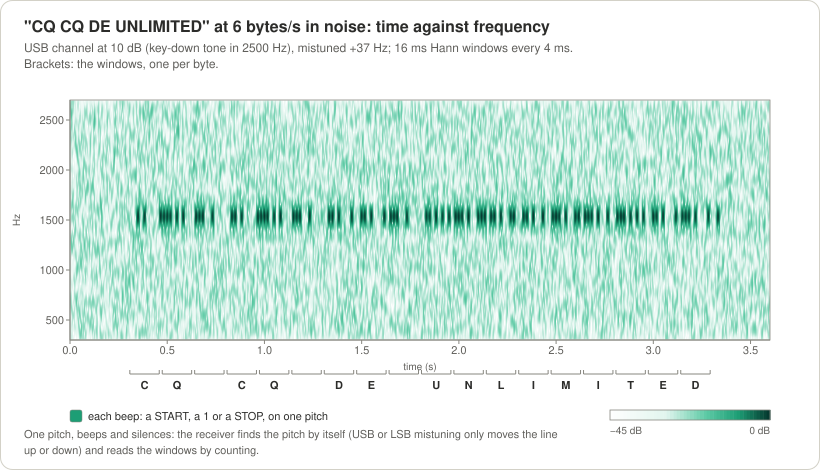

*"CQ CQ DE UNLIMITED" at 6 bytes/s through a simulated USB channel at 10 dB SNR, mistuned +37 Hz: time against
frequency. One pitch, beeps and silences; the brackets mark the windows, one per byte.*

---

## 3. How the receiver works

**In plain words.** The receiver is told only the speed. Then:

1. **It finds the pitch.** It watches the whole passband in 50 Hz steps for a tone that rises out of silence. It hears
   everything twice: the pitch search a moment ahead of the part that reads the slots (the **look-ahead**, 2 slots plus
   200 ms, at most 400 ms), so by the time the first START reaches the reading part, the receiver is already on the
   right pitch.
2. **It waits for the first tone after silence.** That tone is the START of byte 0, the **anchor**. A steady tone (a
   carrier, a Morse dash, the VOX lead) is not a beep and is let go. A receiver switched on in the middle of a
   transmission waits for the next one.
3. **It counts.** It knows the speed, so every 10 slots a new window begins. A slow timing loop keeps it on the
   sender's clock (it holds for 10 minutes with a clock 0.1 % off).
4. **One byte, one decision.** Each window is decided on its own, the first one included: START and STOP present, the
   byte comes out at once; one of them missing, the window is dropped (a **framing error**) and counting goes on.
5. **A silent window is the end.** A whole window of silence where a START should be ends the transmission.
6. **DCD** ("data carrier detect": a transmission is being decoded) is on from the first byte to the end. A modem looks
   at it before transmitting, so as not to talk over another station. A carrier, Morse or speech alone never turns it
   on.

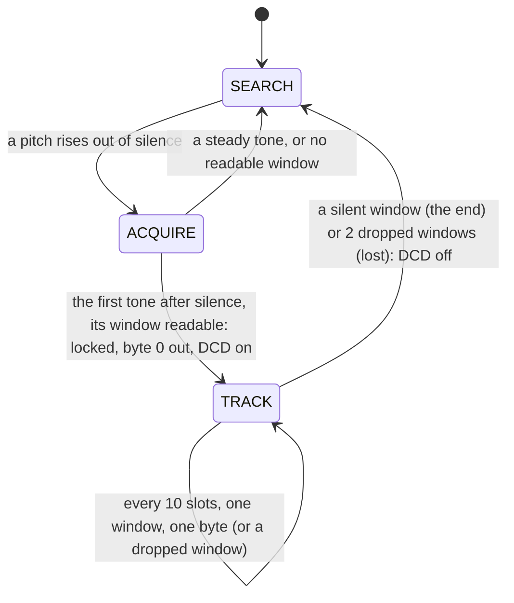

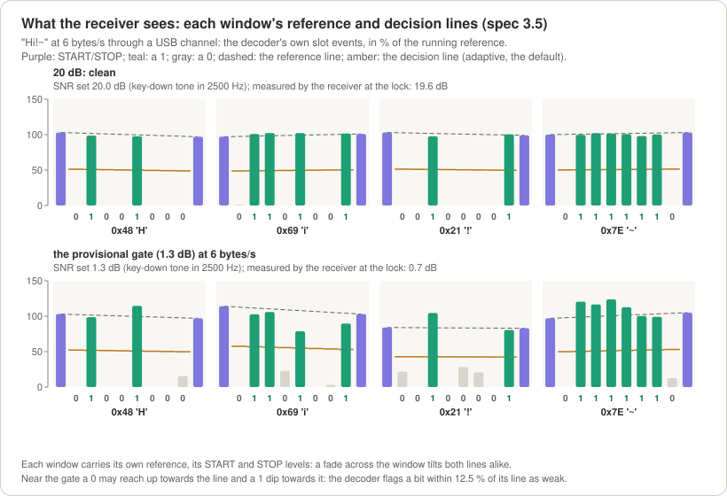

*The decoder's own measurements of "Hi!~" at 6 bytes/s: purple START and STOP bars, the dashed reference line between
them, the amber decision line (the adaptive line, the default), the data bars. Top: 20 dB, a clean signal, the line at
about half the reference. Bottom: +1.3 dB, the gate SNR of 6 bytes/s: zeros reach up, ones dip, and every byte is
still right.*

**How long it takes** (*measured* at 20 dB, from the START as heard to the lock, when byte 0 comes out, and from the
last STOP to the end; spec §9):

| Speed | Look-ahead | Lock and byte 0 after the START | End after the last STOP |
|---|---|---|---|
| 1 byte/s | 400 ms | 1.48 s | 1.47 s |
| 3 bytes/s | 267 ms | 0.64 s | 0.64 s |
| 6 bytes/s | 233 ms | 0.42 s | 0.42 s |
| 12 bytes/s | 217 ms | 0.31 s | 0.31 s |
| 25 bytes/s | 208 ms | 0.25 s | 0.25 s |

Every other byte comes out 0.7–1.3 slots plus the look-ahead after its STOP.

**The fade bridge (optional, off by default).** On HF a signal can fade out for a moment. Normally one silent window
ends the transmission, and the signal coming back is taken for a new one. With `--fade-bridge` on both sides, a
transmission ends only after two silent windows, and a new transmission needs 300 ms of silence (or a VOX lead) before
its START: a fade of about a window costs a dropped byte instead of splitting the message, at the price of a slower end.
Both stations must use the same setting, like the speed. It is kept to be revisited with Gustavo (spec V16).

**In depth:** spec §3 (every stage with its constants), §3.10 (DCD) and §9 (the measurements).

---

## 4. The programs

### 4.1 Build

You need a C++11 compiler (clang or GCC) and `make`; on Linux also the ALSA headers (`libasound2-dev` on Debian and
Ubuntu). Nothing else: the library and the programs use the standard library only.

```sh
git clone https://github.com/solariun/unlimited.git
cd unlimited
make          # build/libunlimited.a and bin/unlimited_encode, bin/unlimited_decode, bin/unlimited_modem
make test     # 312 unit tests, under a minute
```

### 4.2 A round trip through a simulated radio

`unlimited_encode` turns text into audio. With `--channel` it also sends that audio through a simulated radio path
(noise, mistuning, fading) and writes what the *receiver* would hear. `unlimited_decode` reads it back; it is told only
the speed (here the default, 6 bytes/s).

```sh
./bin/unlimited_encode --text "Hello from Unlimited" --channel usb --snr 6 --offset 120 --out rx.wav
./bin/unlimited_decode --in rx.wav
```

```
speed      6.00 bytes/s = 48 bit/s, slot T 16.667 ms  (the receiver needs --bps 6.00)
signal     pitch 1500 Hz, one byte per window of 10 slots: START, 8 bits (most significant first), STOP
bandwidth  occupied bandwidth 264 Hz (1368-1632 Hz); passband 300-2700 Hz: fits; shift tolerance -1068/+1068 Hz
emission   -26 dB width 420 Hz, -40 dB width 594 Hz
data       20 bytes of text
airtime    3.433 s: lead-in 0 ms, 20 windows of 10 slots, tail 100 ms
level      crest -3.0 dBFS; the windows' average power is 3.9 dB below the key-down tone
audio      27468 samples at 8000 Hz -> rx.wav
channel    usb, SNR 6.0 dB key-down (2.1 dB average power), offset +120 Hz, receiver filter 300-2700 Hz; output gain -5.5 dB

speed      6.00 bytes/s = 48 bit/s, slot T 16.667 ms  (the sender must use --bps 6.00)
receiver   passband 300-2700 Hz, pitch search 432-2568 Hz, adaptive decision line (auto: 50-75 % of the reference), impulse blanker on
input      rx.wav: 8000 Hz
locked     t 0.462 s: pitch 1623.4 Hz, T 16.67 ms, SNR 7.9 dB
bandwidth  occupied bandwidth 264 Hz (1491-1755 Hz); passband 300-2700 Hz: fits; shift tolerance -1191/+945 Hz
rx         20 bytes, end at t 3.795 s (pitch 1620.0 Hz, T 16.67 ms, SNR 5.3 dB)
text       "Hello from Unlimited"
```

What the lines say: the receiver was mistuned by +120 Hz, so it found the pitch at 1620 Hz by itself and got every
byte back. **SNR** (signal-to-noise ratio) compares the power of a steady beep with the power of the noise in a
2500 Hz band; 6 dB means the beep is 4 times stronger than that noise. Add `--expect FILE` to the decoder to compare
with what was sent (`result match`, or the bit errors and lost, wrong and extra bytes).

The same round trip on other radios, each decoded exactly in the run for this page:

```sh
# LSB, mistuned by -200 Hz: the audio is mirrored and moved, the receiver finds the pitch at 1300 Hz
./bin/unlimited_encode --text "Hello from Unlimited" --channel lsb --snr 6 --offset -200 --out rx.wav
./bin/unlimited_decode --in rx.wav

# AM at 12 bytes/s, carrier SNR 12 dB, in an AM receiver's 100-3000 Hz audio
./bin/unlimited_encode --text "Hello from Unlimited" --bps 12 --passband 100:3000 --channel am --snr 12 --offset 60 --out rx.wav
./bin/unlimited_decode --in rx.wav --bps 12 --passband 100:3000

# narrow-band FM at 25 bytes/s, carrier SNR 22 dB (CNR 15 dB in the 12.5 kHz channel)
./bin/unlimited_encode --text "Hello from Unlimited" --bps 25 --passband 300:3000 --channel fm --snr 22 --offset 60 --out rx.wav
./bin/unlimited_decode --in rx.wav --bps 25 --passband 300:3000
```

A signal that does not fit the receiver's filter is refused (exit code 2), with the reason and what to change:

```sh
./bin/unlimited_encode --text "Hello" --bps 25 --passband 1250:1750 --out tx.wav
```

```
unlimited_encode: occupied bandwidth 1100 Hz (950-2050 Hz); passband 1250-1750 Hz: does not fit (300 Hz below and 300 Hz above the passband)
unlimited_encode: refused: the signal does not fit the receiver's passband: at 25.00 bytes/s it is 1100 Hz wide (950-2050 Hz around the pitch 1500 Hz) and the passband is 1250-1750 Hz, only 500 Hz wide; use a slower speed (--bps) or a wider --passband (see --help)
```

Without `--channel`, the encoder writes the clean audio (`--rate 48000` for a 48 kHz file) and the decoder reads any
recording, at any sample rate, mono or stereo. `--help` lists every option; spec §7 has the full reference.

### 4.3 Watching it: `--tui`

`--tui` turns either program into a live picture in the terminal (80×24 or larger): the status, the audio, the
spectrum with the passband, the signal's band and its pitch, and, in the middle, the windows. The decoder draws each
window as bars against its START→STOP reference line (`╌`) and its decision line (`─`), with the bit under each bar and
the byte under its bits. Add `--realtime` to play a file at the speed of the audio; without it the file runs through
at full speed and the last frame stays. The last frame of the round trip above (`./bin/unlimited_decode --in rx.wav
--tui`, colours removed):

```
 RX rx.wav │ SEARCH, DCD off │ in peak -2.7 dBFS, RMS -13.6 dBFS, 0 clips
 6.00 bytes/s, 48.0 bit/s │ 1620.0 Hz │ T 16.67 ms │ SNR 5.3 dB
 band 1487-1753 Hz fits, shift -1187/+947 Hz │ passband 300-2700 Hz │ 20 bytes
── scope 33 ms  peak -10.3 dBFS ───────────────────────────────────────────────
⣀⡀ ⢀⣀⣀ ⢀⣀  ⢀⣀⣀⣀  ⢀⣀⢠⣤⡀  ⢀⣿⡇⢀⣤⡄⣶⡆⢀⣀ ⢀⡀ ⢀⣀⡀⣀⡀ ⣤⡄⣤⡄ ⢀⣀⣀⣠⣤ ⢸⣿⡄  ⢀⣀⣶⣆⣀      ⢀⣀⢰⣶⡀⢠⣤⣀
⣿⣿⢷⣿⣿⡿⣿⣾⡿⣿⣿⣿⣿⣿⢿⣷⡾⣿⣿⣾⡿⣷⣶⣿⣿⣿⣿⣿⣿⣿⣿⢷⣾⣿⡿⠟⢻⣿⣿⣿⣷⢿⣿⢿⣿⢻⣿⣿⣿⡿⠿⣿⣿⣿⣿⣿⡏⣿⣤⣶⠾⢿⣿⣿⡿⠞⠻⣶⣶⠶⠿⠛⠿⣾⣿⣿⠿⢿⣿
⠉⠉  ⠛⠃⠉⠉⠁   ⠈⠉⠈⠉  ⠈⠉ ⠉ ⠈⠉⠈⠉⠉⠈⠹⠿⠘⠛⠛⠃  ⠸⠿⠁ ⠘⠿⠈⠉⠈⠙⠛⠋  ⠉⠁⠈⠹⣿⡇ ⠛⠛ ⠘⠻⠿⠇  ⠛⠃    ⠿⠟⠛  ⠛
── window 19  byte 0x64 'd'  START 105%  STOP 99%  line 51% of ref ────────────
    │
    │                        ▂▂    ▂▂    ▁▁ ▃▃       ▂▂
100%┤▆▆╌╌╌╌▅▅╌╌╌╌╌╌╌╌╌╌▆▆╌╌╌╌██╌▅▅ ██╌╌╌╌██╌██╌╌╌╌╌╌╌██╌╌╌╌╌╌╌██
    │██    ██ ██       ██    ██ ██ ██    ██ ██       ██       ██
    │██    ██ ██       ██    ██ ██ ██────██─██───────██───────██
    │██────██─██───────██────██─██ ██    ██ ██       ██       ██
    │██ ▃▃ ██ ██ ▅▅    ██ ▁▁ ██ ██ ██ ▇▇ ██ ██ ▃▃    ██    ▃▃ ██
     ◆  0  1  1  0  0  1  0  1  ◆  ◆  0  1  1  0  0  1  0  0  ◆
        └──────0x65 'e'───────┘       └──────0x64 'd'───────┘
── spectrum  peak 1615 Hz -21.7 dBFS  [ ] passband  ░ band  ▲ pitch ───────────
▁▃▃▁▃▂▃▂▄▃▂▃▃▃▂▃▃▃▃▃▃▂▄▂▂▂▂▂▂▃▃▃▂▂▂▃▁▅▅▄▄▃▄▂▂▂▃▂▃▂▃▃▂▂▂▂▂▂▂▃▂▃▃▃▃▃▃▂▂▂▁
[─────────────────────────────────░░░░▲░░░░──────────────────────────]
      500           1k             1.5k          2k             2.5k         3k
── received  20 bytes ─────────────────────────────────────────────────────────
Hello from Unlimited
```

The two windows on screen are the last two bytes, 'e' and 'd'. START and STOP (`◆`) stand at about 100 % of the
running reference, the 1s reach the dashed reference line, the 0s stay low, and the decision line sits at 51 % of the
reference: at this SNR the adaptive line is near its clean-signal setting. The status shows the receiver back in
SEARCH with DCD off, after the end. The encoder's view (`--tui --realtime` on `unlimited_encode`) shows each window as
it is sent: the slot being sent, its bits under the bracket of their byte, and the segment (TX delay, VOX lead, gap,
window, tail).

### 4.4 On a real radio: the sound card and the PTT

**In plain words.** The programs talk to the radio through the computer's sound card. The sender plays the beeps into
the radio's data input and presses its **PTT** (push-to-talk) for exactly as long as the beeps last; the receiver
listens to the radio's audio and prints each transmission as it arrives. Most modern radios (the Icom IC-705 and
IC-7300, the Xiegu X6200) have the sound card built in: one USB cable carries the audio both ways and the PTT command
too.

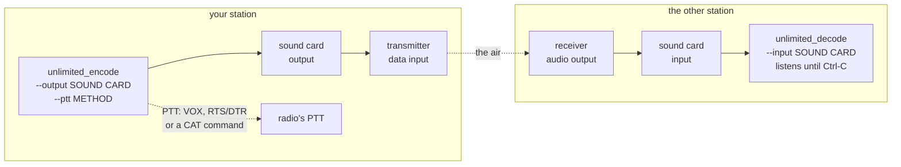

**Step 1: find the sound card.** `--list-devices` works in every program. On Gustavo's Mac mini (spec §12.5):

```
Audio devices (coreaudio):
  #  Name                       In  Out  Default  Rate Hz  Rates kHz                     UID
  0  SAMSUNG                     -    2  out        48000  32 44.1 48 128 176.4 192 768  4C2D3F72-0000-0000-2A1F-010380462778
  1  V-Z632                      2    -             48000  48                            AppleUSBAudioEngine:MACROSILICON:V-Z632:78559787:3
  2  OBSBOT Tiny 4K Microphone   2    -  in         48000  48                            AppleUSBAudioEngine:Remo Tech Co., Ltd.:OBSBOT Tiny 4K:3132000:3
  3  Mac mini Speakers           -    2             48000  44.1 48 88.2 96               BuiltInSpeakerDevice
  4  Microsoft Teams Audio       1    1             48000  48                            MSLoopbackDriverDevice_UID

Choose with --input and --output, or -d for both: coreaudio:<#>, coreaudio:<part of the name>, coreaudio:<UID>, or default.
A part of the name that matches several devices is refused: use the # or the UID.
For example: --input coreaudio:1 --output coreaudio:0
```

Pick a device by its number (`coreaudio:3`), a part of its name (`coreaudio:CODEC`) or its UID. Numbers change when
devices come and go; the UID does not. Two radios of the same make can show the same name, and a name part that
matches both is refused with both listed, so the wrong radio is never keyed. On Linux the devices are `alsa:…`, for
example `alsa:plughw:CARD=CODEC,DEV=0`. Any sample rate works: the programs convert to and from 8000 Hz themselves.

**Step 2: start the receiver first.** A receiver must hear a moment of quiet before a transmission begins (10 slots:
1 s at 1 byte/s, 167 ms at 6), or it takes the transmission for one it joined in the middle and waits for the next.

```sh
./bin/unlimited_decode --input coreaudio:CODEC --bps 6
```

**Step 3: send.**

```sh
./bin/unlimited_encode --output coreaudio:CODEC --bps 6 --text "CQ CQ DE UNLIMITED LIVE TEST 0123456789"
```

A real run of both, through the "Microsoft Teams Audio" virtual device of this Mac, which loops its output back to its
input (the Teams app was not running, so nothing else used it; no speaker or microphone was involved). The sender:

```
speed      6.00 bytes/s = 48 bit/s, slot T 16.667 ms  (the receiver needs --bps 6.00)
signal     pitch 1500 Hz, one byte per window of 10 slots: START, 8 bits (most significant first), STOP
bandwidth  occupied bandwidth 264 Hz (1368-1632 Hz); passband 300-2700 Hz: fits; shift tolerance -1068/+1068 Hz
emission   -26 dB width 420 Hz, -40 dB width 594 Hz
data       39 bytes of text
airtime    6.783 s: lead-in 0 ms, VOX lead 9 slots and a gap of 2, 39 windows of 10 slots, tail 100 ms
level      crest -3.0 dBFS; the windows' average power is 4.7 dB below the key-down tone
output     coreaudio:7 Microsoft Teams Audio (48000 Hz, 1 channel), latency 11 ms
ptt        VOX (the lead tone keys the radio)
audio      325607 samples at 48000 Hz -> coreaudio:7 Microsoft Teams Audio (48000 Hz, 1 channel), latency 11 ms
output     peak -3.0 dBFS, RMS -10.6 dBFS; 0 xruns
```

The receiver, stopped with Ctrl-C after the transmission:

```
speed      6.00 bytes/s = 48 bit/s, slot T 16.667 ms  (the sender must use --bps 6.00)
receiver   passband 300-2700 Hz, pitch search 432-2568 Hz, adaptive decision line (auto: 50-75 % of the reference), impulse blanker on
input      coreaudio:7 Microsoft Teams Audio (48000 Hz, 1 channel), resampled to 8000 Hz; listening until Ctrl-C
locked     t 2.130 s: pitch 1500.0 Hz, T 16.67 ms, SNR 31.1 dB
bandwidth  occupied bandwidth 264 Hz (1368-1632 Hz); passband 300-2700 Hz: fits; shift tolerance -1068/+1068 Hz
level      input peak -3.0 dBFS, RMS -10.4 dBFS, 0 clips
rx         39 bytes, end at t 8.628 s (pitch 1500.0 Hz, T 16.67 ms, SNR 49.6 dB)
text       "CQ CQ DE UNLIMITED LIVE TEST 0123456789"
input      listened 9.344 s, stopped by Ctrl-C (SIGINT): peak -3.0 dBFS, RMS -12.0 dBFS, 0 clips; 0 xruns
received   39 bytes, 1 lock
```

The sender keys the PTT **before** the first beep and releases it **after** the last one has left the sound card (its
own delay, `latency 11 ms` above). How the PTT is pressed:

| Your radio | Add | Before the first byte |
|---|---|---|
| keyed by its VOX (no PTT wire) | nothing: VOX is the default | a 150 ms lead tone, then 2 silent slots (`--vox-lead-ms`) |
| a PTT wire on a serial port's RTS or DTR line (a TRS cable, a Digirig) | `--ptt rts --ptt-device /dev/cu.usbserial-110` (or `dtr`; `-rts`, `-dtr` when it keys on a low line) | 100 ms of silence, the TX delay (`--lead-in-ms`) |
| Icom, and Xiegu radios speaking Icom's CI-V, over USB or a CAT cable | `--ptt icom --ptt-device <its CI-V port> --cat-addr 0xA4` (the radio's CI-V address, in its CI-V menu; the defaults: IC-7300 0x94, IC-705 0xA4, IC-7300 MKII 0xB6 by Icom's manuals, Xiegu X6200 0xA4 by Radioddity's CI-V document) | 100 ms of silence |
| Yaesu or Kenwood CAT, or any command you know | `--ptt yaesu`, `--ptt kenwood`, or `--ptt cat --cat-tx-on HEX --cat-tx-off HEX` | 100 ms of silence |

- **Levels.** The level lines show how loud the audio is at the sound card: peak and RMS in **dBFS**, where 0 dBFS is
  the loudest a sample can be. Aim for peaks well below 0 dBFS with **0 clips** (a clip is a sample stuck at full
  scale, which distorts the beeps). On the transmit side, set the radio so that its **ALC** (automatic level control)
  does not act: ALC and speech compression flatten the beeps. [docs/modem.md](docs/modem.md#4-levels-and-alc) explains
  how, radio by radio.
- **Silence warning.** If the input is exact digital silence (every sample 0) for 3 s, the programs say so: a radio's
  audio always has some noise, so nothing reaches the card, or, on macOS, the terminal lacks the microphone
  permission (System Settings > Privacy & Security > Microphone).
- **Ctrl-C** during a transmission stops the sound card and releases the PTT; closing the terminal (SIGHUP) or SIGTERM
  does the same, so a radio is never left transmitting.
- **Exit codes:** the receiver 0 when it decoded something (1 when nothing), the sender 0 when everything was sent
  (1 when Ctrl-C stopped it); both 2 for a mistake on the command line, 3 when a file, the sound card or the PTT
  failed.

### 4.5 `unlimited_modem`: the KISS modem

**In plain words.** `unlimited_modem` turns the computer and a radio into a packet-radio modem (a **TNC**, terminal
node controller) that your usual AX.25 programs can use: AX25Toolkit's `ax25tnc` and `bbs`, linbpq, anything that
speaks **KISS** (the simple serial framing between a computer and a TNC). Every frame your program sends becomes one
Unlimited transmission; every transmission the radio hears comes back to your program byte by byte, as it is decoded.
The modem listens before it talks, keys the radio by VOX, a serial line or a CAT command, and exposes a
pseudo-terminal (`/tmp/unlimited`) that your program opens like a hardware TNC's serial port.

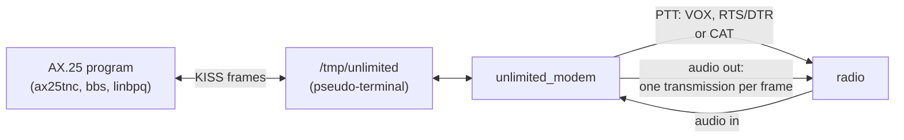

**Try it without a radio.** `--loopback` runs two complete modems joined by the channel simulator; it sends an AX.25
frame, a frame full of KISS's special bytes and a single byte, then an answer the other way, and prints `PASS` only when
every frame came back byte for byte (and the single byte, shorter than an AX.25 frame, did not: see
[section 6](#6-what-unlimited-does-not-do)):

```sh
./bin/unlimited_modem --loopback
```

```
unlimited_modem loopback: two modems in memory, 6.00 bytes/s = 48 bit/s, slot T 16.667 ms
  channel: clean (--loopback SNR adds noise)
  bandwidth: occupied bandwidth 264 Hz (1368-1632 Hz); passband 300-2700 Hz: fits; shift tolerance -1068/+1068 Hz
  A -> B frame 1, 50 bytes: byte for byte
  A -> B frame 2, 18 bytes: byte for byte
  A -> B frame 3, 1 byte: shorter than --min-frame 15, not passed on
  B -> A frame 1, 18 bytes: byte for byte
  B heard A at pitch 1500.0 Hz, SNR 52.8 dB, T 16.667 ms
  3 transmissions from A, 1 transmission from B; 20.6 s simulated in 0.01 s
Result: PASS
```

`--loopback 6` does the same through a simulated USB channel at 6 dB SNR, mistuned 40 Hz; it passes at every speed at
its gate SNR + 3 dB.

**With a radio**, for example an IC-705 over its USB cable, keyed by a CI-V command (how to find the sound card and
the serial port, and the radio's menu settings, are in [docs/modem.md](docs/modem.md#12-bench-checklists)):

```sh
./bin/unlimited_modem -d coreaudio:<the radio's sound card> --ptt icom --ptt-device <the radio's CI-V port> --cat-addr 0xA4 --monitor
```

It prints what it will do before it transmits anything. A real banner, with a pseudo-terminal standing in for the
radio's CAT port and the loopback device for its audio:

```
======================================================================
  unlimited_modem - KISS modem for radio audio (Unlimited v1.0)
======================================================================
  Speed      : 6.00 bytes/s = 48 bit/s, slot T 16.667 ms
               BOTH STATIONS MUST USE --bps 6.00
  Signal     : pitch 1500 Hz, crest -3.0 dBFS
  Bandwidth  : occupied bandwidth 264 Hz (1368-1632 Hz); passband 300-2700 Hz: fits; shift tolerance -1068/+1068 Hz
  Airtime    : 1 byte 0.37 s, 64 bytes 10.87 s, 144 bytes 24.2 s (key to release)
  Receiver   : adaptive decision line (auto: 50-75 % of the reference), impulse blanker on, fade bridge off
  Min frame  : 15 bytes (--min-frame 15): shorter receptions never reach the computer; the first byte waits 14 windows (2.33 s)
  Audio in   : coreaudio:MSLoopbackDriverDevice_UID (coreaudio:7 Microsoft Teams Audio (48000 Hz, 1 channel)), 48000 Hz (resampled to 8000 Hz)
  Audio out  : coreaudio:MSLoopbackDriverDevice_UID (coreaudio:7 Microsoft Teams Audio (48000 Hz, 1 channel), latency 11 ms), 48000 Hz, PTT released 14 ms after the audio
  PTT        : Icom CI-V, address A4h on /dev/ttys000 at 19200 baud
  Lead, tail : TX delay 100 ms (--txdelay 10); TX tail 100 ms (--txtail 10)
  Channel    : half duplex, dwait 1500 ms, persist 63, slottime 100 ms
----------------------------------------------------------------------
  PTY device : /dev/ttys002
  Symlink    : /tmp/unlimited -> /dev/ttys002
  Example    : ax25tnc -c N0CALL -r N0CALL-1 /tmp/unlimited
----------------------------------------------------------------------
  Monitor on. Ctrl-C stops.
```

Then point your AX.25 program at `/tmp/unlimited`, as at a hardware TNC's serial port:

```sh
ax25tnc -c N0CALL -r N0CALL-1 /tmp/unlimited
```

With `--monitor` every frame is shown when it goes on the air and when one is received (a real run of the modem's
smoke test, [docs/testing.md](docs/testing.md), `--debug 1` adding each sent frame's layout):

```
[21:54:28.590] TX 21 bytes, PTT VOX (the lead tone keys the radio): "Hello from A, frame 1"
                   lead tone 150 ms (--vox-lead-ms 150), then 2 silent slots (33.3 ms); 21 windows 3.5 s; TX tail 100 ms (--txtail 10); keyed 3.797 s with the 14 ms output latency
[21:54:37.017] RX 23 bytes, 6.00 bytes/s, pitch 1500.0 Hz, SNR 38.9 dB: "frame 2: \xC0 and \xDB inside"
                   hex 66 72 61 6D 65 20 32 3A 20 C0 20 61 6E 64 20 DB 20 69 6E 73 69 64 65
```

`--tui` shows what the radio hears and, on the first lines, what the modem is doing. A real frame of a modem sending
a 27-byte frame, keyed by VOX:

```
 RX coreaudio:Teams │ SEARCH, DCD off │ channel clear (DCD off) │ PTT on (vox)
 TX sending 13 of 27 bytes │ queue 0 frames waiting │ frames tx 0, rx 0
 in peak -3.0 dBFS, RMS -10.2 dBFS, 0 clips │ 6.00 bytes/s, 48.0 bit/s
```

**Sharing the frequency.** Before each frame the modem waits until no Unlimited transmission is being decoded (DCD
off), then 1.5 s more (`--dwait`), then draws a random number every 100 ms and transmits when it is small enough
(`--persist 63`, a chance of 1 in 4 per draw): the channel access of every KISS TNC. While it transmits, its receiver
hears silence, as a radio's receiver is muted. Stop it with Ctrl-C: the PTT is released at once and the link removed.
The operator's guide, [docs/modem.md](docs/modem.md), covers connecting each radio, levels and ALC, VOX, the speed
and the AX.25 timers, `--min-frame`, `--fade-bridge`, reading the monitor and the view, AX25Toolkit and linbpq, Linux,
and troubleshooting.

---

## 5. Choosing the speed

**In plain words.** Both stations must use the same speed. Choose the fastest one your path carries reliably: slower
speeds survive weaker signals (about 3 dB per halving of the speed) and fit narrower filters, but a frame takes longer
on the air, so the channel is busy longer and every exchange is slower.

**Airtime, measured with the encoder** (`unlimited_encode --out null`, which prints the airtime of what it would send;
from the key to the release, without the sound card's own delay of a few ms): 15 bytes is the shortest AX.25 frame
(an acknowledgement), 16 + n bytes an AX.25 information frame carrying n bytes (144 bytes for 128).

| Speed | 1 byte | 15 bytes | 48 bytes | 80 bytes | 144 bytes | 272 bytes |
|---|---|---|---|---|---|---|
| 1 byte/s, PTT (VOX) | 1.30 s (1.70 s) | 15.30 s (15.70 s) | 48.30 s (48.70 s) | 80.30 s (80.70 s) | 144.30 s (144.70 s) | 272.30 s (272.70 s) |
| 3 bytes/s | 0.53 s (0.67 s) | 5.20 s (5.33 s) | 16.20 s (16.33 s) | 26.87 s (27.00 s) | 48.20 s (48.33 s) | 90.87 s (91.00 s) |
| 6 bytes/s | 0.37 s (0.45 s) | 2.70 s (2.78 s) | 8.20 s (8.28 s) | 13.53 s (13.62 s) | 24.20 s (24.28 s) | 45.53 s (45.62 s) |
| 12 bytes/s | 0.28 s (0.36 s) | 1.45 s (1.53 s) | 4.20 s (4.28 s) | 6.87 s (6.94 s) | 12.20 s (12.28 s) | 22.87 s (22.94 s) |
| 25 bytes/s | 0.24 s (0.30 s) | 0.80 s (0.86 s) | 2.12 s (2.18 s) | 3.40 s (3.46 s) | 5.96 s (6.02 s) | 11.08 s (11.14 s) |

PTT: `--lead-in-ms 100` (the TX delay the programs use with RTS, DTR or CAT keying) and the 100 ms tail; in brackets
VOX: `--vox-lead-ms 150` (a lead of at least 3 slots and a gap of 2). At 1 byte/s the tail is 2 slots (200 ms) and the
VOX lead 3 slots (300 ms).

| Speed | Occupied band | Gate SNR (spec §4) | Where it fits |
|---|---|---|---|
| 1 byte/s | 44 Hz | −6.5 dB | very weak HF paths; any filter; long airtime (an AX.25 acknowledgement takes 15 s) |
| 3 bytes/s | 134 Hz | −1.7 dB | weak HF |
| **6 bytes/s** | 264 Hz | +1.3 dB | HF: the default |
| 12 bytes/s | 530 Hz | +4.3 dB | good HF paths, AM |
| 25 bytes/s | 1100 Hz | +8.0 dB | FM (VHF/UHF), strong signals |

The **gate SNR** is the signal-to-noise ratio at which each speed is required to get at most 1 wrong bit in 1000 in
plain noise ([section 7](#7-performance)). Through the KISS modem, a received frame reaches the AX.25 program only once
its 15th byte is decoded (the minimum frame, [section 6](#6-what-unlimited-does-not-do)): 14 windows of delay, 14 s at
1 byte/s, 2.3 s at 6, 1.2 s at 12, 0.56 s at 25. AX.25 programs time their retries, so their timers must fit these
airtimes: [docs/modem.md](docs/modem.md#6-the-speed-and-the-ax25-timers) derives FRACK, RESPTIME and PACLEN per speed
from this table.

---

## 6. What Unlimited does not do

**In plain words.** Unlimited moves bytes; it does not guarantee them. Gustavo's rule, as for RTTY: the modem may drop
or garble bytes, and the protocol above must reject them.

- **No check and no resend.** A byte is decided on its own window. A fade, a crash of static or a weak signal can drop
  a window (its START or STOP missing: the byte is never delivered) or, more rarely, flip a bit. AX.25 over KISS does
  not help here: the frame check sequence of AX.25 belongs to the TNC, and KISS frames carry none, so a damaged frame
  reaches the AX.25 program as it is. AX.25 resends frames that never arrive, not frames that arrive damaged. A check
  and a resend are parked until after v1.0 (spec §13).
- **Stray bytes.** Without a preamble, a window of speech, Morse or noise clicks that happens to look like a byte
  (silence, then a beep-shaped tone, its START and STOP present, clean slot edges) is released like any other.
  *Measured* over 30 minutes per scene (spec §9): receiver noise and steady carriers give none on HF; FM receiver noise
  below threshold (an open squelch) about 340 bytes per hour at 25 bytes/s; keyed Morse up to 104 per hour; speech up
  to 546 per hour at 25 bytes/s, where the slot is near a voice's pitch period. A stray reception is 1 to 8 bytes long.
- **The KISS modem drops them.** `unlimited_modem` hands a reception to the computer only once it is 15 bytes long,
  the shortest AX.25 frame (`--min-frame 15`, the default; `0` turns it off, for a protocol with shorter frames): in
  every one of those scenes, **0 stray frames and 0 bytes per hour** reached the computer. The price is the 14-window
  wait of [section 5](#5-choosing-the-speed). `unlimited_decode` and the library keep streaming every byte at once:
  a program on the library must reject stray bytes itself.
- **Integrity in fading.** A fade longer than a window ends a transmission, and the signal coming back can be taken
  for a new one (its bytes numbered from 0); a START lost in a fade can let a data beep be taken for a START. Over the
  long suite's fading channels this gave 177 extra and 65 misplaced bytes among 409,187 released (spec §4); the
  optional fade bridge ([section 3](#3-how-the-receiver-works)) removes part of it.
- **No joining in the middle.** A receiver switched on during a transmission waits for the next one.
- **One pitch at a time.** The receiver follows one station; several stations side by side is on the roadmap.
- **Not on the air yet.** Everything here was measured in simulation, through a virtual sound device and with
  pseudo-terminals standing in for radios; the bench tests of [docs/modem.md](docs/modem.md#12-bench-checklists) come
  next.

---

## 7. Performance

**In plain words.** The long regression suite (`make test_long`, 1 min 38 s on 10 cores) sends hours of simulated
radio through the real encoder and decoder and counts every wrong bit, every lost byte and every byte that should not
be there. Its limits, the **gates**, are Gustavo's decisions. **SNR** here is the power of a steady beep over the
noise in a 2500 Hz band (the convention of weak-signal modes such as FT8): at 0 dB the beep is as strong as that noise.
Unlimited decodes below 0 dB at slow speeds because its receiver listens only in a narrow band around the pitch.

**Plain noise** (*measured* 2026-09-28, 196 transmissions of 32 bytes per point, the receiver mistuned up to ±50 Hz and
told only the speed; spec §4 and §9):

| Speed | Gate SNR | Bit error rate at the gate (gate ≤ 1e-3) | Bytes lost at the gate (gate ≤ 1 %) | At gate + 3 dB |
|---|---|---|---|---|
| 1 byte/s | −6.5 dB | 4.4e-4 | **4.0 %: FAIL, kept** | no error, nothing lost |
| 3 bytes/s | −1.7 dB | 4.0e-5 | 0.5 % | no error, nothing lost |
| 6 bytes/s | +1.3 dB | 2.1e-5 | **2.6 %: FAIL, kept** | no error, nothing lost |
| 12 bytes/s | +4.3 dB | 3.0e-4 | 1.0 % | no error, nothing lost |
| 25 bytes/s | +8.0 dB | 2.0e-5 | 0 % | no error, nothing lost |

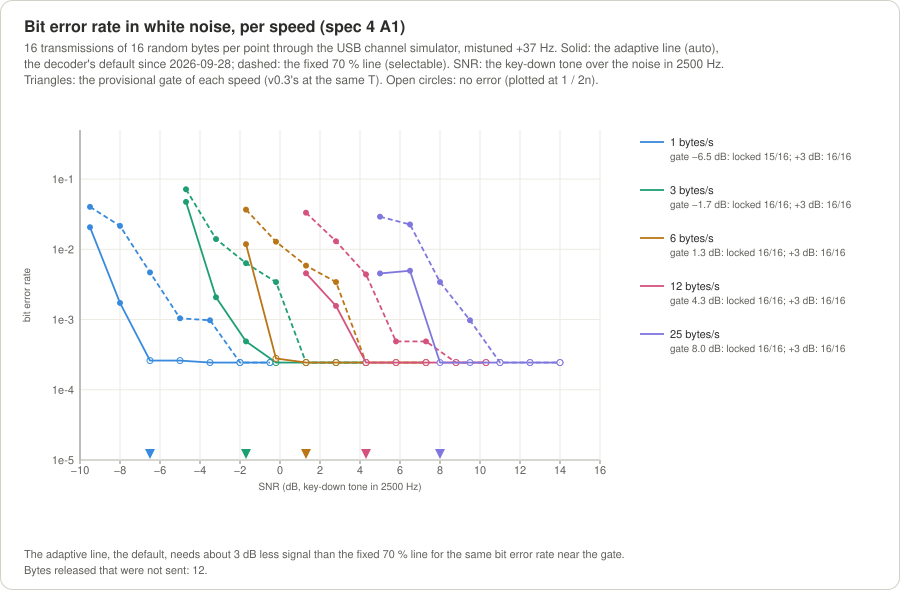

*Bit error rate in plain noise per speed, through the real encoder, channel simulator and decoder: solid, the adaptive
decision line (the default); dashed, the fixed 70 % line, which needs about 3 dB more signal. Triangles: each speed's
gate SNR.*

**The two FAIL rows, and why they stay.** At 1 and 6 bytes/s, at exactly the gate SNR, the receiver misses 4.0 % and
2.6 % of the bytes: whole transmissions whose first START it does not find (8 and 5 of 196). The gate SNRs were copied
from v0.3, whose tune tone and sync train announced each transmission; v1.0 has no preamble and must find every
transmission from its first window alone. Gustavo decided to keep the gates and to leave these two rows failing, as
open problems for after v1.0 (spec V25). 3 dB above the gate nothing is missed: 100 % of 300 transmissions per speed
are decoded from their first byte (A3). So the long suite ends with exactly these 2 FAIL rows; **any other FAIL is
news**.

**Radio channels** (*measured*, 60 transmissions of 16 bytes per point, spec §9): FM and AM, static crashes with the
blanker, a carrier 300 Hz away: 100 % of the bytes; keyed Morse 250 Hz away: 90–100 %; HF fading (the CCIR good,
moderate and poor paths, flat Rayleigh fading, flutter): 18–95 % of the bytes, since a window whose START or STOP
fades is dropped; a clock 0.1 % off for 10 minutes: every byte, no slip; 7 pitches across 4 SSB filters: every
transmission from its first byte.

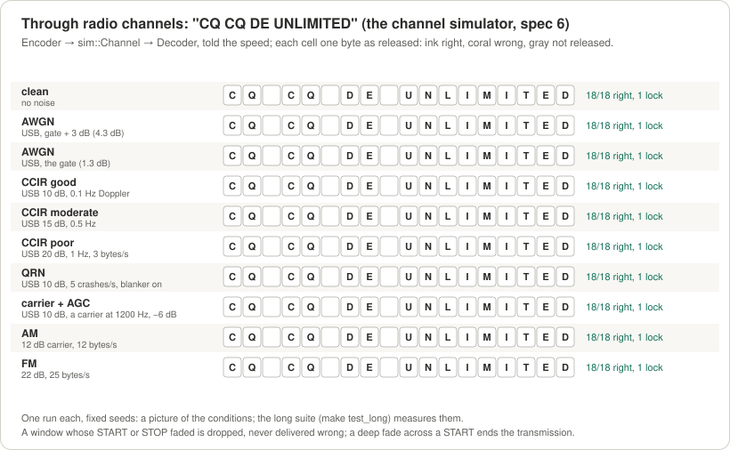

*"CQ CQ DE UNLIMITED" through ten simulated conditions, one run each with fixed seeds: a picture of the conditions,
not a measurement (the long suite measures them).*

---

## 8. Microcontrollers

**In plain words.** The core has no heap, no exceptions and no run-time type information, and the encoder uses integer
arithmetic only, so it runs on small chips. The library is also an Arduino library (`library.properties` at the root,
the code in `src/`). Five examples compile warning-free with `make arduino_check` (*measured* sizes, spec §7):

| Sketch | Board | What it does | Flash | RAM |
|---|---|---|---|---|
| `tx_uno` | Arduino Uno / Nano | the encoder in an 8 kHz timer interrupt, PWM audio out: every line typed on the serial port is sent | 8,658 B (26 %) | 524 B (25 %) |
| `rx_esp32` | ESP32 | the decoder on the ADC; bytes to the serial port | 325,488 B (24 %) | 44,636 B (13 %) |
| `loopback_esp32` | ESP32 | the encoder into the decoder, no wiring; CPU per block measured | 314,912 B (24 %) | 39,580 B (12 %) |
| `wav_sd_esp32` | ESP32 | a WAV file on an SD card through the decoder | 346,150 B (26 %) | 23,664 B (7 %) |
| `kiss_tnc_esp32` | ESP32 | a KISS TNC: the modem core on the ADC and a 1-bit output, KISS on the USB serial port, PTT and DCD on pins (below) | 350,448 B (26 %) | 48,628 B (14 %) |

On the Uno the encoder's interrupt takes at most 908 of the 2000 CPU cycles between two samples (the gate is 1600),
measured on a cycle-exact model of the ATmega328P (`make check_embedded`). None of the sketches has run on a board yet.

The **Arduino Nano modem** follows right after v1.0; its send side already builds for the ATmega328P in 9,774 B of
flash and 902 B of RAM, with no floating point.

### 8.1 The ESP32 KISS TNC

**In plain words.** An ESP32 board can be the whole modem: plug it into the computer's USB port and into the radio's
audio and PTT, and any packet-radio program that speaks KISS (an AX.25 stack, APRS software, a BBS) uses it like a
hardware TNC. It is the same modem as `unlimited_modem` on a PC (the same speeds, the same channel check, the same rule
that receptions shorter than 15 bytes never reach the computer), only without a sound card: the ESP32 listens through
its analog input and speaks through one pin. **Status: built and proven on the PC** (the sketch's own code run against
a PC modem through the simulated radio, both ways, byte for byte); **no board has run it yet**, so the levels, the PTT
circuit, the real CPU load and one detail of the output (the order of its two I2S slots) wait for the bench.

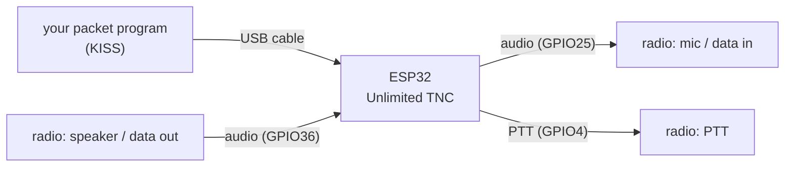

**What you need.** A classic ESP32 DevKit (ESP32-WROOM-32; not the S2, S3 or C3), and for the wiring: resistors 1k ×2,
10k ×4, 47k and 470R (or a 10k trimmer instead of the 470R), capacitors 1 µF ×2, 47 nF and 4.7 nF, and for PTT an NPN
transistor (2N2222 or BC547), or an optocoupler (PC817) and a 330R instead of the transistor and its two resistors.

**Wiring** (from the sketch's header; join the grounds, the ESP32's and the radio's audio ground):

```
From the radio (speaker or data out) to the ESP32:

  radio audio out --||--+------------ GPIO36
                   1uF  |
          3V3 --[10k]---+---[10k]-- GND

From the ESP32 to the radio (mic or data in):

  GPIO25 --[1k]--+--[10k]--+--||--[47k]--+-- radio mic / data input
                 |         |  1uF        |
               47nF      4.7nF        [470R]
                 |         |             |
                GND       GND           GND

PTT:

  GPIO4 --[1k]--+-- base of the NPN; emitter to GND, collector to the radio's PTT line
                |
              [10k]
                |
               GND
```

- **Receiving:** keep the radio's audio under about 1.5 V peak to peak, but loud enough that the ESP32 sees the band's
  hiss when nobody transmits.
- **Transmitting:** the pin sends a fast stream of on/off pulses (512,000 a second) whose average follows the sound;
  the two resistor-capacitor pairs smooth it into audio, the 1 µF removes the steady part, and the 47k/470R divider
  brings it down to microphone level (about 10 mV, computed from the parts). For a data input use 4.7k instead of the
  470R, or a 10k trimmer: full power on the beeps with the ALC not moving. Keep the 1k and the 47 nF close to the pin.
- **Why pulses and not the ESP32's DAC?** On the classic ESP32 the analog input's fast transfer (DMA) and the DAC's use
  the same internal peripheral, and the receiver needs it; the pulse stream uses the second one, costs no extra part and
  measured about 80 dB of signal to noise in the audio band on the PC. Gustavo confirmed this for v1.0 (spec V26); an
  external DAC board may come later if the bench shows the need.
- **The DCD LED** (GPIO2, on most boards) lights while a transmission is being decoded; the TNC never starts sending
  then.

**Settings** are named constants at the top of `examples/arduino/kiss_tnc_esp32/kiss_tnc_esp32.ino`, each explained in
plain words: the speed (6 bytes/s by default: **the other station must use the same**), the pitch, the radio's
passband, the decision line, the minimum frame, the channel check, the fade bridge, the PTT pin and its level, the TX
delay and tail, and VOX (`k_vox`, with a 150 ms lead tone). Change them and flash again; KISS parameter frames from the
computer are ignored.

**Flashing.** Arduino IDE: install the "esp32" boards (Espressif, 3.x) and this library, open the example, choose
"ESP32 Dev Module", upload. With arduino-cli, from the library's folder:

```sh
arduino-cli compile --fqbn esp32:esp32:esp32 --library . examples/arduino/kiss_tnc_esp32
arduino-cli upload  --fqbn esp32:esp32:esp32 -p /dev/cu.usbserial-XXXX examples/arduino/kiss_tnc_esp32
```

After a reset the board prints its settings once at 115200 baud, then speaks only KISS.

**Limits.** The classic ESP32 only. There is no flow control over the USB cable: keep your AX.25 program's window
times its frame size (MAXFRAME × PACLEN) under about 2 KB. The settings are compiled in. The first test without a
radio (a cable to a computer's sound card), and the bench steps with radios, are in
[docs/modem.md](docs/modem.md#13-the-esp32-kiss-tnc); the full design is spec §12.7.

---

## 9. Building and testing

```sh
make                 # the library and the three programs, every warning an error
make test            # 312 unit tests
make demo_run        # 7 round trips through the simulated radio, and 1 refusal
make test_long       # the long regression suite: 257 measured rows
make check_embedded  # the core built as for a microcontroller; the AVR interrupt gate
make arduino_check   # the Arduino examples (needs arduino-cli and its AVR and ESP32 cores)
make docs            # the figures and the protocol examples, from the real code
```

| Target | What it proves | Time on an Apple M4 (2026-09-28) |
|---|---|---|
| `make` | everything compiles warning-free | 7.2 s from a clean tree |
| `make test` | 312 of 312 tests pass | 27 s for the tests (39 s from a clean tree, the build included) |
| `make test_long` | 257 rows against the spec's gates: 34 PASS, the 2 known FAIL rows, 221 REPORT | 1 min 38 s on 10 cores |
| `make check_embedded` | no heap, exceptions or RTTI; ESP32 and AVR builds; the interrupt cycle gate; the modem's send side without the receiver | 10.3 s |
| `make arduino_check` | the five sketches compile warning-free; `tx_uno` has no floating point | 74.5 s |
| `make demo_run` | the command-line round trips come back exactly | 1.6 s |
| `make docs` | the figures and examples regenerate, byte-identical on every run | 4.4 s |

[docs/testing.md](docs/testing.md) explains every target, the unit tests file by file, the long suite's families and
rows, the modem's tests and its real-audio smoke test, the sanitizers, CI, and how to reproduce a row. GitHub Actions
builds and tests every push on Ubuntu (GCC, ALSA) and macOS (Clang); CI proves the builds and the tests, and only
radios prove the audio path.

---

## 10. The API in brief

**In plain words.** An `Encoder` turns bytes into audio samples; a `Decoder` turns samples into events (a lock, each
byte, the end); a `Modem` puts both behind KISS with the channel check and the PTT. They are plain C++11 objects: no
heap, no threads; you feed them samples at 8000 Hz (the encoder can render at any rate from 8 to 192 kHz) and they
call your functions.

| Header | What it gives |
|---|---|
| `unlimited.h` | the encoder, the decoder, the audio sink and source interfaces, the WAV codec |
| `unlimited/protocol.hpp` | the speed (`slot_us_for_speed()`), the byte window's constants, the bandwidth calculator (`occupied_band()`, `passband_fit()`, `search_range()`) |
| `unlimited/encoder.hpp` | `EncoderConfig`, `Encoder`: one producer writes bytes, one consumer (an interrupt, an audio thread) renders samples |
| `unlimited/decoder.hpp` | `DecoderConfig`, `Decoder`, `Event`: told the speed, it finds the pitch and calls your handler |
| `unlimited/modem.hpp` | `ModemConfig`, `Modem`: the KISS modem's portable core (`kiss.hpp` and `transmitter.hpp` inside) |

A complete program: "Hello" into memory at 6 bytes/s and back (compiled with `-std=c++11 -Wall -Wextra -Wpedantic
-Werror` against the library, `c++ -std=c++11 -Isrc hello.cpp build/libunlimited.a`):

```cpp
// Sends "Hello" at 6 bytes/s into memory and decodes it back: the Encoder and the Decoder of unlimited.h.
#include "unlimited.h"

#include <cstdint>
#include <cstdio>
#include <cstring>
#include <vector>

namespace {

const float k_speed = 6.0f;          // bytes per second: both sides must use the same
const unsigned k_quiet_slots = 15;   // silence before the transmission: the receiver must hear the channel quiet
const unsigned k_end_windows = 2;    // silence after it, besides the look-ahead: the last window and the end

void on_event(const unlimited::Event& event, void* context) {
    std::vector<uint8_t>& text = *static_cast<std::vector<uint8_t>*>(context);
    switch (event.type) {
        case unlimited::EventType::locked:
            std::printf("locked: pitch %.1f Hz, slot %.3f ms, SNR %.1f dB\n", event.tone_hz, event.slot_ms,
                        event.snr_db);
            break;
        case unlimited::EventType::byte:  // each byte as soon as its window is read
            text.push_back(event.value);
            std::printf("byte %u: 0x%02X '%c'\n", static_cast<unsigned>(event.byte_index), event.value, event.value);
            break;
        case unlimited::EventType::end:
            std::printf("end: \"%.*s\"\n", static_cast<int>(text.size()), reinterpret_cast<const char*>(text.data()));
            break;
        default:
            break;
    }
}

}  // namespace

int main() {
    unlimited::EncoderConfig tx;  // 8000 Hz, pitch 1500 Hz, -3 dBFS, for a 300..2700 Hz SSB filter
    tx.slot_us = unlimited::slot_us_for_speed(k_speed);
    unlimited::Encoder encoder(tx);
    const char* message = "Hello";
    encoder.write(reinterpret_cast<const uint8_t*>(message), std::strlen(message));
    encoder.start();

    const size_t slot_samples = tx.slot_us * tx.sample_rate_hz / 1000000u;
    std::vector<int16_t> audio(k_quiet_slots * slot_samples, 0);
    std::vector<int16_t> block(256);
    for (size_t got = encoder.render(block.data(), block.size()); got > 0;
         got = encoder.render(block.data(), block.size()))
        audio.insert(audio.end(), block.begin(), block.begin() + static_cast<long>(got));

    unlimited::DecoderConfig rx;  // the adaptive decision line, the same 300..2700 Hz passband
    rx.slot_us = tx.slot_us;
    std::vector<uint8_t> text;
    unlimited::Decoder decoder(rx, &on_event, &text);
    audio.resize(audio.size() + decoder.lookahead_samples() + k_end_windows * unlimited::k_window_slots * slot_samples,
                 0);
    decoder.process(audio.data(), audio.size());
    return text.size() == std::strlen(message) && std::memcmp(text.data(), message, text.size()) == 0 ? 0 : 1;
}
```

```
locked: pitch 1500.0 Hz, slot 16.667 ms, SNR 25.3 dB
byte 0: 0x48 'H'
byte 1: 0x65 'e'
byte 2: 0x6C 'l'
byte 3: 0x6C 'l'
byte 4: 0x6F 'o'
end: "Hello"
```

**The modem core** is driven from four places, each of which may be its own thread, core or interrupt: the computer's
bytes (`host_input()`), the radio's audio in (`audio_input()`), the audio out (`audio_output()`, which never blocks:
fine in an audio callback or an interrupt) and a clock (`tick()`). Two cores joined in memory, the air being a shared
buffer (compiled and run the same way; `A: PTT on`, `A: PTT off`, then B's computer gets the same 21 KISS bytes):

```cpp
// Two KISS modem cores in memory: a frame written to A's computer side comes out of B's, as KISS.
#include "unlimited/modem.hpp"

#include <cstdint>
#include <cstdio>
#include <vector>

namespace {

const uint32_t k_step_ms = 10;                                                  // the clock of this simulation
const size_t k_step_samples = unlimited::k_modem_rate_hz / 1000 * k_step_ms;  // 80 samples at 8 kHz
const uint32_t k_run_ms = 15000;

struct Station {
    const char* name;
    std::vector<uint8_t> to_computer;  // what the modem hands its computer (KISS)
};

void on_host(const uint8_t* data, size_t size, void* context) {  // from audio_input()
    Station& station = *static_cast<Station*>(context);
    station.to_computer.insert(station.to_computer.end(), data, data + size);
}

void on_ptt(bool on, void* context) {  // from tick()
    std::printf("%s: PTT %s\n", static_cast<Station*>(context)->name, on ? "on" : "off");
}

}  // namespace

int main() {
    unlimited::ModemConfig config;  // 6 bytes/s, TX delay 100 ms, dwait 1.5 s, persist 63, minimum frame 15
    Station a = {"A", std::vector<uint8_t>()};
    Station b = {"B", std::vector<uint8_t>()};
    unlimited::Modem modem_a(config, &on_host, &on_ptt, &a);
    unlimited::Modem modem_b(config, &on_host, &on_ptt, &b);

    const uint8_t kiss[] = {0xC0, 0x00, 'H', 'e', 'l', 'l', 'o', ' ', 'f', 'r', 'o', 'm', ' ', 'A', ',', ' ', 'o', 'v',
                            'e', 'r', 0xC0};
    modem_a.host_input(kiss, sizeof(kiss));  // A's computer sends one KISS frame: one transmission

    std::vector<int16_t> air(k_step_samples);
    for (uint32_t now = 0; now < k_run_ms; now += k_step_ms) {
        modem_a.tick(now);
        modem_b.tick(now);
        modem_a.audio_output(air.data(), air.size());  // A's radio transmits ...
        modem_b.audio_input(air.data(), air.size());   // ... and B's hears it
        modem_b.audio_output(air.data(), air.size());  // B is silent
        modem_a.audio_input(air.data(), air.size());
    }

    std::printf("B's computer got %zu KISS bytes:", b.to_computer.size());
    for (size_t i = 0; i < b.to_computer.size(); ++i) std::printf(" %02X", b.to_computer[i]);
    std::printf("\n");
    return b.to_computer == std::vector<uint8_t>(kiss, kiss + sizeof(kiss)) ? 0 : 1;
}
```

**Threads and interrupts.** The encoder has one producer (`write()`, `start()`) and one consumer (`render()` or
`next_sample()`: an interrupt or the audio thread), handed over with release/acquire fences, so the two may run on
different cores. Each of the modem's methods has one calling context; between them, lock-free single-producer rings.
The full API, with every rule, is spec §5 and §12.2; the headers are the reference.

---

## 11. Project layout

```
unlimited/
  spec.md  README.md  LICENSE  library.properties  Makefile  compile_flags.txt
  src/unlimited.h                       the umbrella include (Arduino: <unlimited.h>)
  src/unlimited/protocol.hpp .cpp       the byte window, the speed, bands and fits; tables.cpp: the sine table
  src/unlimited/encoder.hpp .cpp        EncoderConfig, Encoder (integer only)
  src/unlimited/decoder.hpp .cpp        DecoderConfig, events, Decoder
  src/unlimited/dsp.hpp .cpp            internal: mixer, look-ahead, history, tone search, noise, blanker, decision line
  src/unlimited/kiss.hpp .cpp           the KISS codec
  src/unlimited/transmitter.hpp .cpp    the modem's send side: send queue, channel check, PTT (no receiver)
  src/unlimited/modem.hpp .cpp          the KISS modem's portable core
  src/unlimited/platform.hpp            ROM access, fences, load_acquire and store_release
  src/unlimited/audio_io.hpp            the audio driver boundary (sample sinks and sources)
  src/unlimited/wav_codec.hpp .cpp      WAV reader and writer through byte sinks and sources
  pc/                                   PC only: live audio (CoreAudio, ALSA), PTT and CAT, the KISS port (PTY or
                                        serial), resamplers, WAV files, the channel simulator, the TUI, two modems
                                        linked in memory
  demo/                                 unlimited_encode.cpp, unlimited_decode.cpp, unlimited_modem.cpp and their
                                        command lines (cli.hpp, modem_cli.hpp)
  tests/                                the unit tests (make test); tests/support/: loopback helpers, interferers
  tests/long/                           the long regression suite (make test_long)
  tests/embedded/, tests/avr/           the heap traps, the modem's send side alone, the AVR interrupt cycle gate
  tools/                                doc_figures.cpp, doc_examples.cpp (make docs), gen_tables.cpp (make tables),
                                        modem_smoke_teams.sh (the modem on real audio)
  docs/modem.md                         the KISS modem for operators
  docs/testing.md                       every test and check, and how to read them
  docs/protocol_examples.md             the bit-exact examples, generated from the library
  docs/images/*.svg                     the figures, drawn from the real encoder, channel simulator and decoder
  examples/arduino/                     tx_uno, rx_esp32, loopback_esp32, wav_sd_esp32, kiss_tnc_esp32 (the ESP32 TNC)
  .github/workflows/ci.yml              GitHub Actions: Ubuntu (GCC, ALSA) and macOS (Clang)
```

Code style: C++11, `CamelCase` types, `snake_case` functions, variables and files, a trailing `_` for private members,
`k_` named constants, `#pragma once`. [`spec.md`](spec.md) is normative: every change of behaviour, API, layout or
tests is written there first (spec-driven development), with Gustavo's decisions (§0.3) and the definition of done
(§0.5).

---

## 12. History

**In plain words.** Unlimited started as Gustavo's idea: bits as beeps on one pitch, framed by START and STOP markers
that tell the receiver the timing and how loud a 1 is. Three versions tried to make it faster and cleverer; v1.0 goes
back to the plainest form of the idea, a serial port's frame, and makes it a modem that packet-radio programs can use.

| Version | Date | The signal | What became of it |
|---|---|---|---|
| v0.1 | 2026-09-25 | one pitch, beep = 1, silence = 0, START/STOP markers | implemented and measured |
| v0.2 | 2026-09-26 | several bits per beep, chosen by which of many pitches it is on (MFSK) | built and dropped the same day: harder to understand and verify, and sensitive to the frequency shifts of HF paths; kept on the branch and tag `v0.2-mfsk` |
| v0.3 | 2026-09-26/27 | one pitch; a tune tone and a sync train; START/STOP markers with a 180° twist; packages of N bits; a receiver that learned the speed and N | released as library 0.3.0, API frozen; its code, specification and measurements are at the tag `v0.3.0` (last state: commit `5f68598`) |
| **v1.0** | 2026-09-28 | one pitch; one byte per window of 10 slots, START and STOP plain beeps; the speed in bytes/s set on both sides; no tune, no sync, no twist, no end markers | this version: the core, the programs on live audio, the KISS modem, the ESP32 KISS TNC |

v1.0 is not compatible with v0.3 on the air. What it kept from v0.3: one pitch with Tukey-shaped beeps, the receiver's
pitch search, its kept audio and the adaptive decision line, the integer encoder for AVR, the WAV codec, the channel
simulator, the terminal view, the test framework and the bandwidth calculator. What it dropped: the tune tone, the sync
train, the twisted markers, the packages of N bits and the receiver's speed search, the packet layer, and the presets.
Why (spec §0.3, Gustavo's decisions V1–V25): "the idea of using 8 bits is for dropping the sync tones", simplicity and
speed for everyone, and a receiver that knows the speed has nothing to learn. What comes next: the bench, then the
Arduino Nano modem, then a check and a resend (spec §13).

---

## 13. Glossary

| Term | Meaning |
|---|---|
| **Adaptive line** | The default decision line: 50–75 % of the reference line, about 70 % on a weak signal, never in the noise (`--threshold auto`). |
| **AGC** | A receiver's automatic gain control: it turns the audio up and down with the signal's strength. |
| **Airtime** | How long a transmission keeps the channel busy, from the key to the release. |
| **ALC** | A transmitter's automatic level control. Keep it inactive: it flattens the beeps. |
| **AM / FM** | Amplitude / frequency modulation: the voice modes of broadcast and airband (AM) and of VHF/UHF radios and repeaters (FM). |
| **Anchor** | The START of byte 0: the first tone after at least 2 silent slots. |
| **AX.25** | The link protocol of amateur packet radio; its programs talk to a TNC through KISS. |
| **Beep** | A tone burst filling one slot: START, STOP and every 1. |
| **BER** | Bit error rate: the share of bits that arrive wrong (1e-3 = 1 in 1000). |
| **CAT, CI-V** | Computer control of a radio over a serial or USB port; CI-V is Icom's (Xiegu radios speak it too). The modem can key a radio with a CAT command. |
| **CCIR good / moderate / poor** | Standard simulated HF paths: two echoes that fade, 0.5 / 1 / 2 ms apart, at 0.1 / 0.5 / 1 Hz. |
| **Clip** | An audio sample stuck at full scale: the beeps are distorted. |
| **CW** | Morse code, sent by keying a carrier on and off. |
| **dB, dBFS** | Decibel, a ratio on a log scale (+3 dB is twice the power); dBFS is relative to the loudest sample possible. |
| **DCD** | Data carrier detect: a transmission is being decoded (from its first byte to its end). The modem waits for it to clear before transmitting. |
| **Decision line** | The level a data slot must reach to be a 1: the adaptive line, or a fixed line (70 %, or 50..90 %). |
| **dwait** | How long the modem waits after the channel went quiet before contending for it (1.5 s). |
| **Fade bridge** | The optional rule for HF fades: an end needs 2 silent windows, a new start 300 ms of silence. Both sides must agree. |
| **Framing error** | A window whose START or STOP is missing: its byte is dropped, never guessed. |
| **Gate** | The limit the spec sets for a measurement; the gate SNR of a speed is where it must get at most 1 wrong bit in 1000. |
| **HF, VHF, UHF** | Radio bands: shortwave 3–30 MHz (HF, reflected by the ionosphere), 30–300 MHz, 300–3000 MHz. |
| **KISS** | The simple framing between a computer and a TNC: frames between FEND bytes (C0), with FEND and FESC escaped. |
| **Look-ahead** | The receiver's fixed delay (2 slots + 200 ms, at most 400 ms) between the pitch search hearing a sample and the slot reading hearing it. |
| **Loopback device** | A virtual sound device that returns what is played into it: two programs on one computer hear each other silently. |
| **Minimum frame** | The KISS modem hands a reception to the computer only once it is 15 bytes long (`--min-frame`), the shortest AX.25 frame. |
| **OOK** | On-off keying: beep = 1, silence = 0. |
| **p-persistence** | The KISS channel access: transmit when a random number 0..255 is at most `--persist` (63), else wait a slot time and draw again. |
| **Passband** | The audio frequencies a receiver lets through (300–2700 Hz for a 2.4 kHz SSB filter). |
| **Pitch** | The one audio frequency every beep is sent on (300–2700 Hz, 1500 Hz by default). |
| **PTT / VOX** | Push-to-talk / voice-operated switch: what keys the transmitter. |
| **PTY** | A pseudo-terminal: a software serial port another program can open (`/tmp/unlimited`). |
| **QRM / QRN / QSB** | Interference from other stations / static crashes / fading. |
| **Reference line** | The straight line from a window's START level to its STOP level: how loud a 1 should be in each slot. |
| **Shift tolerance** | How far the radio may be mistuned and the signal still pass the filter and be found. |
| **Slot, T** | The time unit: one beep or one silence. T = 1 / (10 × speed). |
| **SNR** | Signal-to-noise ratio: here the power of a steady beep over the noise in 2500 Hz. |
| **Speed** | Bytes per second, 1 to 25, the same on both sides (`--bps`). |
| **SSB, USB, LSB** | Single sideband, the usual HF voice mode, as the upper or the lower sideband; LSB mirrors the audio, which only moves the one pitch. |
| **START / STOP** | The first and last slot of a window: always beeps, the ruler of the window's bits. |
| **Stray byte** | A byte released from something that was not a transmission (speech, Morse, noise). |
| **Tail** | The silence after the last byte (100 ms, at least 2 slots). |
| **TNC** | Terminal node controller: the modem that packet-radio programs talk to over a serial port. |
| **Tukey window** | The beep's envelope: it fades in over T/4, holds, and fades out over T/4. |
| **TX delay** | Silence after keying and before the first byte, for the radio to switch to transmit (100 ms by default with a wire or a CAT command). |
| **VOX lead** | A steady tone before the first byte that keys a VOX radio, then 2 silent slots (150 ms by default). |
| **Window** | The 10 slots of one byte: START, 8 bits, STOP. |

---

## 14. License and author

Unlimited is released under the [MIT License](LICENSE). Copyright (c) 2026 Gustavo Campos, an amateur radio operator
and embedded C++ developer.

- Repository: [github.com/solariun/unlimited](https://github.com/solariun/unlimited)
- Specification: [`spec.md`](spec.md) (normative; every change is written there first)
- The KISS modem for operators: [`docs/modem.md`](docs/modem.md); testing: [`docs/testing.md`](docs/testing.md)
- Bit-exact examples: [`docs/protocol_examples.md`](docs/protocol_examples.md) (generated by `make docs`)
- Earlier designs: v0.3 at the tag `v0.3.0`, the dropped v0.2 at the branch and tag `v0.2-mfsk`
