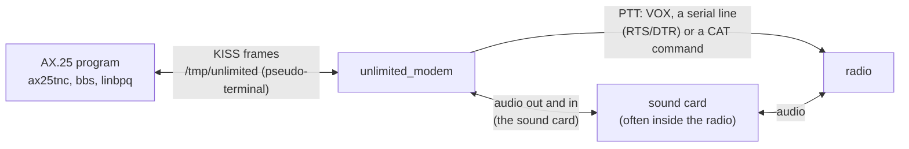
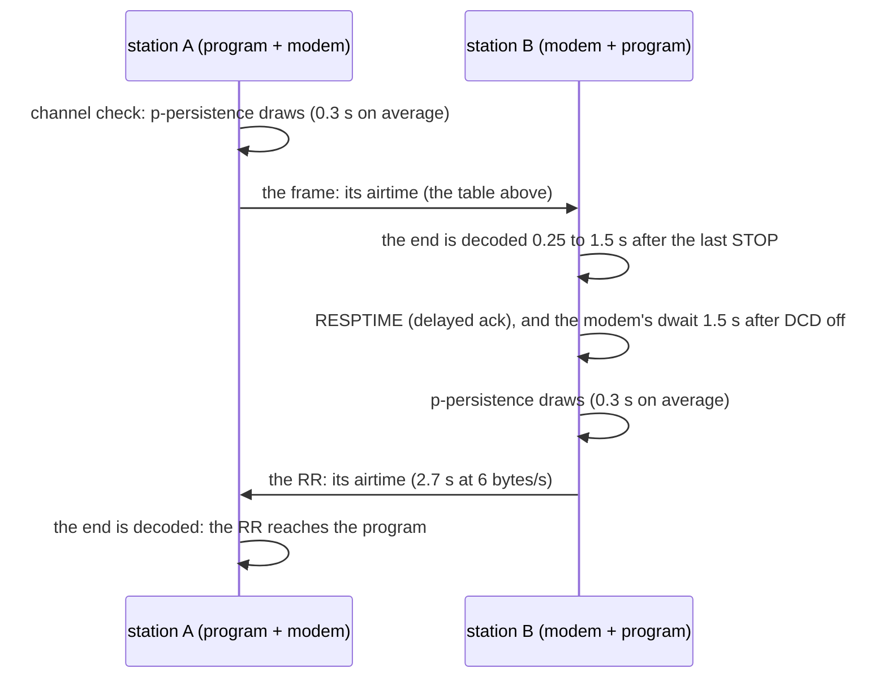
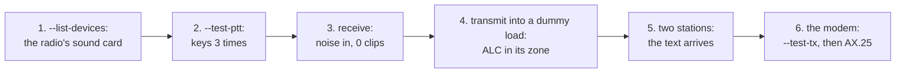
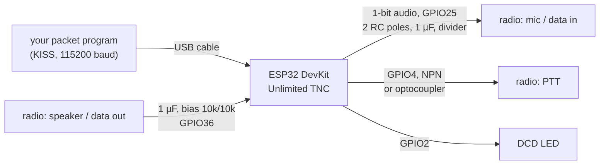

# The Unlimited KISS modem: a guide for operators

**`unlimited_modem` turns a computer and a radio into a packet-radio modem for AX.25 programs.** This guide explains
how to connect a radio, set its levels, choose the speed and the AX.25 timers, read what the modem shows, and bring up
each of the radios on Gustavo's bench, step by step.

**How to read this guide**

- Every section starts **in plain words**, then gives the details. Words are explained where they first appear and
  again in [§15](#15-words-used-here).
- Every output shown comes from a real run of the programs on 2026-09-28 (on a Mac, through the "Microsoft Teams Audio"
  virtual sound device, which loops its output back to its input, and with pseudo-terminals standing in for a radio's
  serial port), or is quoted from [`spec.md`](../spec.md) with its section.
- Radio menus and defaults come from the manufacturers' manuals, cited in [§16](#16-sources). What the manuals do not
  settle is marked **bench check**: it must be confirmed on the radio itself.
- **Unlimited has not been on the air yet.** The checklists of [§12](#12-bench-checklists) are how it gets there.

## Contents

1. [What it does](#1-what-it-does)
2. [Try it without a radio](#2-try-it-without-a-radio)
3. [Connecting a radio](#3-connecting-a-radio)
4. [Levels and ALC](#4-levels-and-alc)
5. [VOX](#5-vox)
6. [The speed and the AX.25 timers](#6-the-speed-and-the-ax25-timers)
7. [Short receptions: `--min-frame`](#7-short-receptions---min-frame)
8. [HF fades: `--fade-bridge`](#8-hf-fades---fade-bridge)
9. [Reading the banner, the monitor and the view](#9-reading-the-banner-the-monitor-and-the-view)
10. [AX.25 programs: AX25Toolkit, linbpq and others](#10-ax25-programs-ax25toolkit-linbpq-and-others)
11. [Linux notes](#11-linux-notes)
12. [Bench checklists](#12-bench-checklists)
13. [The ESP32 KISS TNC](#13-the-esp32-kiss-tnc)
14. [Troubleshooting](#14-troubleshooting)
15. [Words used here](#15-words-used-here)
16. [Sources](#16-sources)

---

## 1. What it does

**In plain words.** Packet-radio programs (a BBS, a terminal like `ax25tnc`, a node like linbpq) talk to a radio
through a **TNC** (terminal node controller), usually a small box on a serial port, using a simple framing called
**KISS**. `unlimited_modem` is that TNC, in software: it opens a pseudo-terminal, `/tmp/unlimited`, which your program
opens like a TNC's serial port; it plays and hears the radio's audio through the computer's sound card; and it keys the
transmitter.



- **Sending.** Every frame your program sends becomes **one Unlimited transmission**. The modem waits until nobody is
  transmitting, keys the radio, leaves a short silence while it switches to transmit (the **TX delay**), sends the
  frame's bytes one window of 10 slots each, adds a short silence (the **TX tail**) and releases the radio.
- **Receiving.** Every transmission the radio hears comes back to your program as a KISS frame, byte by byte as it is
  decoded, once it is as long as the shortest AX.25 frame (15 bytes; [§7](#7-short-receptions---min-frame)).
- **Both stations must use the same speed** (`--bps`, bytes per second; 6 by default). Nothing else must match: the
  receiver finds the pitch by itself, so the usual SSB mistuning, even the other sideband, does not matter.
- **What it does not do.** It does not check or resend anything: a byte lost in a fade is lost, a damaged byte arrives
  damaged. AX.25 resends frames that never arrive, not frames that arrive damaged, because the frame check of AX.25
  belongs to the TNC and KISS frames carry none ([§6.4](#64-what-ax25-does-and-does-not-recover)).

What one frame looks like on the air (spec §12.1):

```
PTT     _/‾‾‾‾‾‾‾‾‾‾‾‾‾‾‾‾‾‾‾‾‾‾‾‾‾‾‾‾‾‾‾‾‾‾‾‾‾‾‾‾‾‾‾‾‾‾‾‾‾‾‾‾‾‾‾‾\_
audio      [TX delay 100 ms][byte 0][byte 1] ... [byte n-1][TX tail 100 ms]
           silence           10 slots each                  silence       + output latency, then PTT off
VOX:       [lead tone 150 ms][2 silent slots][byte 0] ... [byte n-1][TX tail]
```


*Two bytes from the real encoder at 6 bytes/s: each byte a START beep, 8 bits (a beep is a 1, silence a 0) and a STOP
beep; below, the same after a 150 ms VOX lead and its 2-slot gap.*

**The ESP32 KISS TNC** (`examples/arduino/kiss_tnc_esp32`) is the same modem core on an ESP32 board: KISS over its USB
serial port, the audio through its analog input and one pin, PTT on another pin ([§13](#13-the-esp32-kiss-tnc)).

---

## 2. Try it without a radio

**In plain words.** Two checks need no radio at all: `--loopback` joins two complete modems through the simulated
radio inside one program, and the smoke test runs two real modem programs through a virtual sound device.

```sh
./bin/unlimited_modem --loopback
```

```
unlimited_modem loopback: two modems in memory, 6.00 bytes/s = 48 bit/s, slot T 16.667 ms
  channel: clean (--loopback SNR adds noise)
  bandwidth: occupied bandwidth 264 Hz (1368-1632 Hz); passband 300-2700 Hz: fits; shift tolerance -1068/+1068 Hz
  A -> B frame 1, 50 bytes: byte for byte
  A -> B frame 2, 18 bytes: byte for byte
  A -> B frame 3, 1 byte: shorter than --min-frame 15, not passed on
  B -> A frame 1, 18 bytes: byte for byte
  B heard A at pitch 1500.0 Hz, SNR 52.8 dB, T 16.667 ms
  3 transmissions from A, 1 transmission from B; 20.6 s simulated in 0.01 s
Result: PASS
```

A sends an AX.25 frame (50 bytes), a frame full of KISS's special bytes (18 bytes) and a single byte; B answers.
`Result: PASS` means every frame at least 15 bytes long arrived byte for byte, the single byte did not (it is shorter
than an AX.25 frame), and each frame was one transmission. `--loopback 6` does the same through a simulated USB
channel at 6 dB SNR, mistuned 40 Hz; add `--bps` for another speed (it passes at every speed's gate SNR + 3 dB: −3.5,
1.3, 4.3, 7.3 and 11 dB at 1, 3, 6, 12 and 25 bytes/s).

On a Mac with the "Microsoft Teams Audio" virtual device (the Teams app not running), `sh tools/modem_smoke_teams.sh 6`
runs two modem programs that exchange frames through that device, silently ([testing.md
§7.3](testing.md#73-the-real-audio-smoke-test)).

---

## 3. Connecting a radio

### 3.1 Four ways to connect

**In plain words.** The modem needs three things from the radio: the audio it receives (into the computer), a way to
send audio into it (out of the computer), and a way to key the transmitter (PTT). Modern radios put a sound card and a
serial port inside, behind one USB cable; older ones need an interface.

```mermaid
flowchart TB
    subgraph a["A. A radio with USB audio and CAT (IC-705, IC-7300 MKII, X6200)"]
        pa["computer"] <-- "one USB cable:<br/>sound card + serial port" --> ra["radio"]
    end
    subgraph b["B. A Digirig between the computer and the radio"]
        pb["computer"] <-- "USB" --> db["Digirig:<br/>sound card + serial port"]
        db -- "audio cable (mic in, speaker out)<br/>PTT keyed by RTS" --> rb["radio"]
        db -. "optional CAT cable<br/>(serial TRS jack)" .-> rb
    end
    subgraph c["C. A sound card, and a serial line for PTT"]
        pc["computer"] <-- "audio cables" --> rc["radio"]
        pc -- "USB-serial adapter:<br/>RTS or DTR through a TRS plug" --> rc
    end
    subgraph d["D. A sound card and the radio's VOX"]
        pd["computer"] <-- "audio cables" --> rd["radio with VOX on:<br/>the lead tone keys it"]
    end
```



| Setup | Audio | PTT | Modem options |
|---|---|---|---|
| A. USB radio | the radio's own USB sound card | a CAT command on its USB serial port (Icom CI-V; Xiegu speaks CI-V) | `-d <its sound card> --ptt icom --ptt-device <its CI-V port> --cat-addr <its address>` |
| B. Digirig | the Digirig's sound card | the Digirig's RTS line | `-d <the Digirig's sound card> --ptt rts --ptt-device <the Digirig's serial port>` |
| C. Sound card + serial PTT | any sound card | RTS or DTR of a serial port, through a PTT interface | `-d <the sound card> --ptt rts --ptt-device <the port>` (or `dtr`; `-rts`, `-dtr` when the line keys when low) |
| D. VOX | any sound card | the radio's VOX, triggered by the lead tone | `-d <the sound card>` (`--ptt vox` is the default) |

The modem writes the same sample to every output channel, so a radio listening on the left, the right or both hears
it, and it reads the first input channel (spec §12.5).

### 3.2 Finding the sound card

Every program lists the sound devices:

```sh
./bin/unlimited_modem --list-devices
```

On Gustavo's Mac mini (spec §12.5):

```
Audio devices (coreaudio):
  #  Name                       In  Out  Default  Rate Hz  Rates kHz                     UID
  0  SAMSUNG                     -    2  out        48000  32 44.1 48 128 176.4 192 768  4C2D3F72-0000-0000-2A1F-010380462778
  1  V-Z632                      2    -             48000  48                            AppleUSBAudioEngine:MACROSILICON:V-Z632:78559787:3
  2  OBSBOT Tiny 4K Microphone   2    -  in         48000  48                            AppleUSBAudioEngine:Remo Tech Co., Ltd.:OBSBOT Tiny 4K:3132000:3
  3  Mac mini Speakers           -    2             48000  44.1 48 88.2 96               BuiltInSpeakerDevice
  4  Microsoft Teams Audio       1    1             48000  48                            MSLoopbackDriverDevice_UID

Choose with --input and --output, or -d for both: coreaudio:<#>, coreaudio:<part of the name>, coreaudio:<UID>, or default.
A part of the name that matches several devices is refused: use the # or the UID.
For example: --input coreaudio:1 --output coreaudio:0
```

- Pick the radio's device by its **UID** (`coreaudio:<UID>`): numbers change when devices come and go, the UID does
  not. A part of the name works too (`coreaudio:CODEC`) as long as only one device matches.
- The Icom IC-7300 carries a Texas Instruments PCM2901 codec, which names itself "USB Audio CODEC" (its service manual,
  and the wfview manual); owners report the same name for the IC-705. **Two such radios show the same name**: a name
  part matching both is refused, with both listed, so the wrong radio is never keyed; use the UID, which holds the USB
  location.
- On Linux the devices are `alsa:…`; see [§11](#11-linux-notes).
- **Never use `default`** for the radio: that is the computer's own microphone and speakers.
- Any sample rate works: the modem converts to and from its 8000 Hz itself.

### 3.3 Finding the serial port

- **macOS:** list `/dev/cu.*` before and after plugging the radio (or the interface) in; the new names are its ports.
  Use the `cu.` name, never `tty.` (a `tty.` port waits for a carrier signal; spec §12.4).
- **Linux:** `ls -l /dev/serial/by-id/` names each USB serial port by its maker, model and serial number (systemd
  creates these links); `/dev/ttyUSB*` for Silicon Labs CP210x chips (the IC-7300, the Digirig), `/dev/ttyACM*` for
  CDC ports (the X6200's CH342, and the IC-705 as its owners report). [§11](#11-linux-notes) gives stable names.
- A radio with two serial ports (IC-705, IC-7300 MKII, X6200) has one for CAT and one for something else; the
  checklists say which is which.

### 3.4 How the PTT is keyed

| `--ptt` | Keys by | What the modem sends | Before the first byte |
|---|---|---|---|
| `vox` (the default) | the sound itself | nothing | a lead tone (`--vox-lead-ms`, 150 ms) and 2 silent slots |
| `rts`, `dtr` (`+rts`, `+dtr`) | raising the serial port's RTS or DTR line | `TIOCMBIS` / `TIOCMBIC` on that line only | the TX delay (`--txdelay`, 10 × 10 ms = 100 ms) |
| `-rts`, `-dtr` (or `--ptt-invert`) | lowering the line | the same, inverted | the TX delay |
| `icom` | Icom CI-V `1C 00` | `FE FE <addr> E0 1C 00 01 FD` to key, `… 1C 00 00 FD` to release (`--cat-addr`, default 0x94) | the TX delay |
| `yaesu` | Yaesu CAT | `TX1;` / `TX0;` | the TX delay |
| `kenwood` | Kenwood CAT | `TX;` / `RX;` | the TX delay |
| `cat` | any command you give | `--cat-tx-on HEX` / `--cat-tx-off HEX` | the TX delay |

CAT runs at `--cat-rate` (19200 baud by default; 1200 to 115200), 8 data bits, no parity, 1 stop bit. The modem never
waits for the radio's answer: it drops whatever the radio sends back (the echo, the "FB" acknowledgement) before each
command. It keys and releases the radio around each transmission, and releases it on every exit, Ctrl-C, SIGTERM and a
closed terminal (SIGHUP) included.

**Test the keying alone** before anything else: `--test-ptt` keys the radio three times for one second and exits. A
real run against a pseudo-terminal standing in for an IC-705's CI-V port (what the stand-in received is shown after
it):

```sh
./bin/unlimited_modem --test-ptt --ptt icom --ptt-device /dev/ttys000 --cat-addr 0xA4
```

```
PTT test: Icom CI-V, address A4h on /dev/ttys000 at 19200 baud
  [1/3] PTT on
  [1/3] PTT off
  [2/3] PTT on
  [2/3] PTT off
  [3/3] PTT on
  [3/3] PTT off
PTT test done.
```

```
radio received at 0.00 s: FE FE A4 E0 1C 00 00 FD FE FE A4 E0 1C 00 01 FD
radio received at 1.00 s: FE FE A4 E0 1C 00 00 FD
radio received at 2.01 s: FE FE A4 E0 1C 00 01 FD
…
```

(The first command is a release: the modem unkeys the radio as soon as it opens the port, in case an earlier run left
it keyed.)

**Opening a serial port raises RTS and DTR.** The operating system does it before any program can act (on Linux the
kernel's `tty_port_block_til_ready()`, unless the speed is 0). So a radio or interface keyed by RTS or DTR goes into
transmit for a moment when the modem opens its port, until the modem lowers the line; interfaces with a relay or a
delay ignore that moment (spec §12.4). And **CAT keying leaves RTS and DTR as the system sets them** (Gustavo's
decision): with a Digirig, whose RTS keys the radio, CAT through its serial port would keep the radio keyed for as
long as the modem runs, so **key a Digirig with `--ptt rts`**; on an Icom keyed by CI-V, keep "USB SEND" OFF (its
default), for the same reason.

---

## 4. Levels and ALC

### 4.1 Receiving

**In plain words.** The receiver does not need an exact level: every byte carries its own ruler (the START and STOP
beeps), so a weak or strong signal reads the same. What it needs is audio that is **never clipped** (a sample stuck at
full scale distorts the beeps) and never **digital silence** (exact zeros mean nothing reaches the computer).

- The banner does not measure the level; the view does. Run the modem (or `unlimited_decode --input … --tui`) with
  `--tui`: the `in` item shows the input's peak and RMS level in **dBFS** (0 dBFS is the loudest a sample can be) and
  the clips: `in peak -12.3 dBFS, RMS -28.4 dBFS, 0 clips`.
- A clipping input gets a warning: "the input … clips (samples at full scale): turn the radio's audio output or the
  sound card's input level down". An input of exact zeros for 3 s gets another: nothing plays into it, or (macOS) the
  terminal lacks the microphone permission (System Settings > Privacy & Security > Microphone). A radio's receiver
  always gives some noise.
- **The radio's receive filter** must pass the signal, and the modem must know it: `--passband LO:HI` (default
  `300:2700`, a 2.4 kHz SSB filter). The receiver searches for the pitch only inside it, so a wide filter lets it find
  a station tuned far off. Receiver noise reduction and notch filters process the audio the receiver measures; they
  have not been tried with Unlimited: start with them off.
- **The squelch** must stay open on SSB (the IC-705's and IC-7300's "AF SQL" setting for the USB audio defaults to OFF
  (Open)): the receiver must hear the quiet channel before a transmission's first beep.

### 4.2 Transmitting

**In plain words.** The beeps must reach the transmitter clean. A transmitter's **ALC** (automatic level control)
pulls the level down when the audio is too loud, and a speech compressor squeezes loud and soft together: both flatten
the beeps and blur their edges. Icom's manuals say it for their data modes: adjust the level so that the ALC reading
stays within the ALC zone (IC-705 Advanced Manual p. 2-17; IC-7300 Full Manual p. 4-31).

1. Transmit into a dummy load, at low power, with the radio's meter on ALC:
   `./bin/unlimited_encode --output <sound card> --ptt <…> --text "TEST TEST TEST"`.
2. Start from the radio's defaults (USB MOD Level 50 % on the Icoms) and the modem's `--level-dbfs -3` (the crest of a
   beep, 3 dB below full scale).
3. If the ALC reading leaves the ALC zone, lower the level: first the radio's modulation level, or `--level-dbfs`
   (for example `-10`), or `--volume N` (a percentage of full scale).
4. The power meter reads less than the radio's rated power even when the level is right: the windows are part beeps,
   part silence, and the encoder prints how much ("the windows' average power is 4.7 dB below the key-down tone", for a
   text at 6 bytes/s).

Turn the speech compressor off (or check in the radio's manual that its data mode bypasses it). The transmit filter
must pass the occupied band: at 1500 Hz, from 1478–1522 Hz at 1 byte/s to 950–2050 Hz at 25 bytes/s.

---

## 5. VOX

**In plain words.** A radio's **VOX** keys the transmitter when it hears sound and releases it after a moment of
silence (the VOX **delay** or hang time). Unlimited's beeps have silences inside them, so the VOX must be set to hold
through them, and it needs a moment of sound to wake up before the first byte: the **lead tone**.

- **The lead tone** (`--vox-lead-ms`, 150 ms by default, at least 3 slots) is a steady tone that wakes the VOX, then
  2 silent slots, so the lead is never taken for a START. Raise it if your VOX is slow to key: the first bytes must not
  be cut.
- **The longest silence inside a transmission is 8 slots**: a zero byte (0x00) is a START, 8 silent slots and a STOP.
  **The VOX delay must be longer than that**, or the transmitter drops out in the middle of a byte:

| Speed | Slot T | 8 silent slots (a 0x00 byte) | The lead with the default 150 ms | The gap after it |
|---|---|---|---|---|
| 1 byte/s | 100 ms | 800 ms | 3 slots = 300 ms | 200 ms |
| 3 bytes/s | 33.3 ms | 267 ms | 5 slots = 167 ms | 67 ms |
| 6 bytes/s | 16.7 ms | 133 ms | 9 slots = 150 ms | 33 ms |
| 12 bytes/s | 8.3 ms | 67 ms | 18 slots = 150 ms | 17 ms |
| 25 bytes/s | 4 ms | 32 ms | 38 slots = 152 ms | 8 ms |

(From the byte window of spec §1.2 and the lead rule of §2.1.)

- **After the tail the VOX keeps the transmitter on** for its delay. The modem waits `--dwait` (1.5 s) after the channel
  goes quiet before it transmits, so a VOX delay shorter than that does not collide with the other station's answer.
- **Test the VOX delay with zero bytes**, the hardest case: `head -c 20 /dev/zero > zeros.bin`, then
  `./bin/unlimited_encode --output <sound card> --in zeros.bin` (VOX is the default PTT on a sound card). The radio must
  key once and stay keyed until the tail.
- `--test-ptt` with VOX keys nothing: it says "(VOX keys nothing here: the lead tone of each transmission keys the
  radio)".
- VOX near the gate SNR has a measured cost at 25 bytes/s: 29 of 30 frames at 11 dB with VOX, 30 of 30 with a keyed PTT
  (spec §11 M6). Where you can, key by a line or CAT.

---

## 6. The speed and the AX.25 timers

### 6.1 Choosing the speed

**In plain words.** Both stations must use the same speed. Slower survives weaker signals (about 3 dB per halving of
the speed) and fits narrower filters, but every frame takes longer on the air. The speed also sets how patient your
AX.25 program must be.

| Speed | Occupied band | Gate SNR (spec §4) | Typical use |
|---|---|---|---|
| 1 byte/s | 44 Hz | −6.5 dB | very weak HF paths |
| 3 bytes/s | 134 Hz | −1.7 dB | weak HF |
| **6 bytes/s** (default) | 264 Hz | +1.3 dB | HF |
| 12 bytes/s | 530 Hz | +4.3 dB | good HF, AM |
| 25 bytes/s | 1100 Hz | +8.0 dB | FM |

The **gate SNR** is where each speed is required to get at most 1 wrong bit in 1000 in plain noise (the SNR is a
steady beep's power over the noise in 2500 Hz). At 1 and 6 bytes/s the receiver misses 4.0 % and 2.6 % of the
transmissions at exactly that SNR (kept as open problems, spec V25); 3 dB above it, none.

### 6.2 How long a frame takes

**Airtime, measured** with `unlimited_encode --out null` (it prints the airtime of what it would send), from the key to
the release, without the sound card's own latency (14 ms on the device of this guide). An AX.25 frame without
digipeaters is 16 bytes of header and PID plus its information: **16 + PACLEN** bytes; an acknowledgement (RR) is
15 bytes.

| Speed | 15 bytes (an RR) | 48 bytes (PACLEN 32) | 80 bytes (PACLEN 64) | 144 bytes (PACLEN 128) |
|---|---|---|---|---|
| 1 byte/s | 15.30 s | 48.30 s | 80.30 s | 144.30 s |
| 3 bytes/s | 5.20 s | 16.20 s | 26.87 s | 48.20 s |
| 6 bytes/s | 2.70 s | 8.20 s | 13.53 s | 24.20 s |
| 12 bytes/s | 1.45 s | 4.20 s | 6.87 s | 12.20 s |
| 25 bytes/s | 0.80 s | 2.12 s | 3.40 s | 5.96 s |

With a line or CAT PTT (`--txdelay 10`, 100 ms, and the 100 ms tail; at 1 byte/s the tail is 2 slots, 200 ms). With
VOX add 0.06–0.40 s (the lead and its gap instead of the TX delay; measured the same way: 0.40 s at 1 byte/s, 0.08 s
at 6, 0.06 s at 25). The banner prints the airtime
of 1, 64 and 144 bytes for the options in use.

### 6.3 The round trip, and the timers

**In plain words.** After your AX.25 program sends a frame, it waits for the other station to acknowledge it; if the
acknowledgement does not come within a time called **FRACK** (linbpq) or **T1** (AX25Toolkit), it sends the frame
again. With Unlimited, that time must cover all of this:



Round trip = draws + airtime(frame) + end latency + max(RESPTIME, dwait) + draws + airtime(RR) + end latency.

- **The end latency** (*measured*, spec §9): 1.47, 0.64, 0.42, 0.31 and 0.25 s after the last STOP at 1, 3, 6, 12 and
  25 bytes/s; one window later with `--fade-bridge` (2.47, 0.97, 0.59, 0.39, 0.29 s).
- **dwait** (`--dwait`, 1500 ms): the modem transmits only 1.5 s after the channel went quiet, so a RESPTIME shorter
  than that changes nothing on the air.
- **The draws** (`--persist 63`, `--slottime 10`): each 100 ms a draw wins with a chance of 64 in 256, so the wait is
  0.3 s on average and at most 1.0 s in 96 % of cases (computed from those settings).

The round trip with MAXFRAME 1 (one frame, then its RR), on average, computed from the measured airtimes and end
latencies above and the modem's defaults (a little conservative: each airtime includes its tail):

| Speed | PACLEN 32 | PACLEN 64 | PACLEN 128 |
|---|---|---|---|
| 1 byte/s | 69 s | 101 s | 165 s |
| 3 bytes/s | 25 s | 35 s | 57 s |
| 6 bytes/s | 14 s | 19 s | 30 s |
| 12 bytes/s | 8.4 s | 11 s | 16 s |
| 25 bytes/s | 5.5 s | 6.8 s | 9.4 s |

**Setting the timers** (starting points, to be confirmed on the air):

- **FRACK / T1 above the round trip, with a margin**: the draws can add up to about 1 s on each side, and another
  station may hold the channel. About one and a half times the table is a reasonable start (for example 45 s at
  6 bytes/s with PACLEN 128). Too short, and the program resends a frame that is still on the air or being answered.
  linbpq cannot hold more than 32.7 s ([§10.2](#102-linbpq)): there, keep the round trip under it.
  AX25Toolkit's defaults (3 s in `ax25tnc`, 15 s in `bbs`) and linbpq's (FRACK 7000 ms for a `TYPE=ASYNC` port) are
  far too short for Unlimited at slow speeds.
- **MAXFRAME / window** (frames sent before waiting for the RR): each frame is a transmission of its own, so with
  MAXFRAME k the round trip grows by (k − 1) × (the frame's airtime + 0.3 s). 1 or 2 keep it simple at slow speeds.
- **PACLEN / MTU** (the information bytes per frame): shorter frames lose less when one is missed, but pay 16 bytes of
  header and an RR each. At 1 byte/s a 128-byte frame is 2.4 minutes on the air.
- **RESPTIME / T2** (the delayed acknowledgement): up to 1.5 s it is hidden by dwait.
- **RETRIES / N2**: the program's default is a fine start.

### 6.4 What AX.25 does and does not recover

**In plain words.** Unlimited has no check on the air, and KISS frames carry no frame check either (in AX.25 over
KISS the TNC checks frames, and Unlimited checks nothing). So:

- A window lost in the **header** (the addresses, the control byte) usually makes the frame unreadable or addressed to
  nobody: no acknowledgement comes, and AX.25 **resends** it after FRACK.
- A window lost or damaged in the **information** field gives a frame with a byte missing or wrong, which AX.25
  **accepts**: the damage reaches the application. Gustavo's rule, as for RTTY: the modem may drop or garble bytes, the
  protocol above must reject them (spec V22).
- A check and a resend on the air are parked for after v1.0 (spec §13).

---

## 7. Short receptions: `--min-frame`

**In plain words.** Without a preamble, now and then a moment of speech, Morse or noise clicks looks exactly like a
byte, and the receiver releases it: a **stray byte**. AX.25 programs do not need those. So the modem hands a reception
to your program only once it is **15 bytes** long, the shortest AX.25 frame (two addresses of 7 bytes and a control
byte); shorter ones are dropped whole, not even the frame's start is sent.

- **Measured** (the long suite's scenes, 30 minutes each, spec §9): speech gives up to 546 stray bytes an hour at
  25 bytes/s, keyed Morse up to 104, FM receiver noise below threshold (an open squelch) 340 at 25 bytes/s; a stray
  reception is 1 to 8 bytes long. Through the modem with `--min-frame 15`: **0 frames and 0 bytes per hour** in every
  scene.
- **The price:** the first 14 bytes of a frame wait for the 15th: 14 windows, 14 s at 1 byte/s, 4.7 s at 3, 2.3 s at 6,
  1.2 s at 12, 0.56 s at 25. For AX.25 this costs nothing at the end of a frame (the program needs the whole frame
  anyway); it only delays the first bytes.
- **What you see:** the monitor prints a dropped reception with "shorter than --min-frame 15: not passed to the
  computer"; the view's frames item counts them ("3 short dropped"); the banner shows the setting:
  `Min frame  : 15 bytes (--min-frame 15): shorter receptions never reach the computer; the first byte waits 14 windows (2.33 s)`.
- **`--min-frame 0`** passes every reception from its first byte, stray bytes included: for a protocol whose frames
  are shorter than 15 bytes. Any value up to 64 works.

---

## 8. HF fades: `--fade-bridge`

**In plain words.** On HF a signal can fade out for a moment. Normally a whole silent window ends a transmission, and
the signal coming back is taken for a new one: the frame arrives as two broken pieces. With `--fade-bridge` a
transmission ends only after **two** silent windows, and a new transmission needs 300 ms of silence (or a VOX lead)
before its first beep; the modem then leaves at least 300 ms of silence before each of its own transmissions (its TX
delay becomes at least 300 ms).

- **Both stations must use the same setting**, like the speed. It is **off by default** and kept to be revisited
  (spec V16).
- **Measured** in the long suite's fading channels (spec V16, §9): 37 extra and 13 shifted bytes against 88 and 33
  without it; a transmission beside keyed Morse at 6 bytes/s decoded from its first byte 100 % against 97 %; behind a
  receiver's AGC at 1 byte/s 92 % of the bytes against 85 %, at 3 bytes/s 98 % against 100 %.
- **The cost:** the end of a transmission comes one window later (the end latencies of
  [§6.3](#63-the-round-trip-and-the-timers)), and every transmission starts at least 300 ms after the key.
- The banner shows it: `Receiver : …, fade bridge on` and `Lead, tail : TX delay 300 ms (--txdelay 10, raised to 300 ms
  by --fade-bridge)`.

---

## 9. Reading the banner, the monitor and the view

### 9.1 The banner

The modem prints what it will do before it transmits anything. A real banner, keyed by Icom CI-V (a pseudo-terminal
standing in for the radio's port; it received the release command `FE FE A4 E0 1C 00 00 FD` at the start) with the
loopback device as its sound card:

```
======================================================================
  unlimited_modem - KISS modem for radio audio (Unlimited v1.0)
======================================================================
  Speed      : 6.00 bytes/s = 48 bit/s, slot T 16.667 ms
               BOTH STATIONS MUST USE --bps 6.00
  Signal     : pitch 1500 Hz, crest -3.0 dBFS
  Bandwidth  : occupied bandwidth 264 Hz (1368-1632 Hz); passband 300-2700 Hz: fits; shift tolerance -1068/+1068 Hz
  Airtime    : 1 byte 0.37 s, 64 bytes 10.87 s, 144 bytes 24.2 s (key to release)
  Receiver   : adaptive decision line (auto: 50-75 % of the reference), impulse blanker on, fade bridge off
  Min frame  : 15 bytes (--min-frame 15): shorter receptions never reach the computer; the first byte waits 14 windows (2.33 s)
  Audio in   : coreaudio:MSLoopbackDriverDevice_UID (coreaudio:7 Microsoft Teams Audio (48000 Hz, 1 channel)), 48000 Hz (resampled to 8000 Hz)
  Audio out  : coreaudio:MSLoopbackDriverDevice_UID (coreaudio:7 Microsoft Teams Audio (48000 Hz, 1 channel), latency 11 ms), 48000 Hz, PTT released 14 ms after the audio
  PTT        : Icom CI-V, address A4h on /dev/ttys000 at 19200 baud
  Lead, tail : TX delay 100 ms (--txdelay 10); TX tail 100 ms (--txtail 10)
  Channel    : half duplex, dwait 1500 ms, persist 63, slottime 100 ms
----------------------------------------------------------------------
  PTY device : /dev/ttys002
  Symlink    : /tmp/unlimited -> /dev/ttys002
  Example    : ax25tnc -c N0CALL -r N0CALL-1 /tmp/unlimited
----------------------------------------------------------------------
  Monitor on. Ctrl-C stops.
```

| Line | What to check |
|---|---|
| Speed | the other station must show the same `--bps` |
| Bandwidth | `fits`, and the shift tolerance: how far the two radios may be tuned apart |
| Airtime | the numbers of [§6](#6-the-speed-and-the-ax25-timers) for your options |
| Audio in, Audio out | the radio's sound card, not the computer's own; the output latency the PTT release waits for |
| PTT | the right method, address and port (`VOX (the lead tone keys the radio)` with VOX) |
| Lead, tail | the TX delay (or the VOX lead) and the tail in use |
| Symlink | the path your AX.25 program opens (`--link` changes it; `--serial DEV` puts KISS on a serial port instead) |

### 9.2 The monitor

`--monitor` prints every frame when it goes on the air and when one is received. Real lines from the smoke test
(`--debug 1` adds each sent frame's layout under its line):

```
[21:54:28.590] TX 21 bytes, PTT VOX (the lead tone keys the radio): "Hello from A, frame 1"
                   lead tone 150 ms (--vox-lead-ms 150), then 2 silent slots (33.3 ms); 21 windows 3.5 s; TX tail 100 ms (--txtail 10); keyed 3.797 s with the 14 ms output latency
[21:54:37.017] RX 23 bytes, 6.00 bytes/s, pitch 1500.0 Hz, SNR 38.9 dB: "frame 2: \xC0 and \xDB inside"
                   hex 66 72 61 6D 65 20 32 3A 20 C0 20 61 6E 64 20 DB 20 69 6E 73 69 64 65
```

- **TX** lines come when the PTT is keyed: the length, the PTT, the frame.
- **RX** lines come when the transmission ends: the length, the speed the receiver measured, the pitch it found (a
  mistuned station shows another pitch), the SNR, and when it happened `, N windows dropped` (lost to a fade),
  `, lost`, or `, shorter than --min-frame 15: not passed to the computer`.
- A frame that reads as AX.25 shows its addresses, `AX.25 N0CALL>CQ [UI pid F0] "…"`; anything not plain text gets a
  hex dump.
- `--debug 1` adds the PTT, the channel's state, DCD and the receiver's lock, end and loss on stderr; `--debug 2` the
  computer's bytes, the send queue and the p-persistence draws; `--debug 3` every decoded bit.

### 9.3 The view

`--tui` shows what the radio hears (each window's bars, the scope, the spectrum, the input level) and, on its first
lines, what the modem is doing. A real frame at 80×24, a modem sending a 27-byte frame, keyed by VOX:

```
 RX coreaudio:Teams │ SEARCH, DCD off │ channel clear (DCD off) │ PTT on (vox)
 TX sending 13 of 27 bytes │ queue 0 frames waiting │ frames tx 0, rx 0
 in peak -3.0 dBFS, RMS -10.2 dBFS, 0 clips │ 6.00 bytes/s, 48.0 bit/s
── scope 33 ms  peak -3.0 dBFS ────────────────────────────────────────────────
```

| Item | Values |
|---|---|
| channel | `clear (DCD off)` or `busy (DCD on)`: an Unlimited transmission is being decoded |
| PTT | `on (METHOD)` or `off (METHOD)` |
| TX | `idle`; `waiting for the channel`; `sending n of m bytes`; `sent, PTT releasing` |
| queue | frames waiting behind the one on the air |
| frames | `tx N, rx M` sent and received, and `, K short dropped` ([§7](#7-short-receptions---min-frame)) |
| in | the input's peak and RMS in dBFS, and the clips; `in digital silence` when nothing arrives |

While the modem transmits, its receiver hears silence (half duplex, like a radio's muted receiver), so the window view
waits for a lock. The monitor and debug lines wait while the view is open and are printed when it closes (Ctrl-C).

### 9.4 The stop

Ctrl-C, SIGTERM or a closed terminal stop the modem cleanly: the PTT is released, the link removed, and a last line
says what happened, for example `Stopped: 1 frame sent, 3 transmissions received; nothing waiting`. Exit codes: 0 for
a clean stop; 1 when a sound device, the pseudo-terminal, the serial port or the PTT failed, or the configuration was
refused; 2 for a mistake on the command line.

---

## 10. AX.25 programs: AX25Toolkit, linbpq and others

**In plain words.** Any program that talks KISS to a serial TNC can open `/tmp/unlimited`. The modem ignores the KISS
parameter frames (TXDELAY, P, SLOTTIME, TXTAIL, FULLDUPLEX): its own command line sets the timing. What you must set in
the program are its AX.25 timers ([§6.3](#63-the-round-trip-and-the-timers)).

### 10.1 AX25Toolkit: `ax25tnc` and `bbs`

The banner's own example connects `ax25tnc` (options from `ax25tnc -h`, AX25Toolkit's current build):

```sh
ax25tnc -c N0CALL -r N0CALL-1 /tmp/unlimited
```

| `ax25tnc` option | Meaning | Default | With Unlimited |
|---|---|---|---|
| `-t T1` | T1 retransmit timer, ms | 3000 | above the round trip: e.g. `-t 45000` at 6 bytes/s with `--mtu 128`, `-t 30000` with `--mtu 64` |
| `-w WIN` | window size (MAXFRAME) | 3 | 1 or 2 |
| `--mtu N` | I-frame information bytes (PACLEN) | 128 | 32–128 by speed |
| `-n N2` | retries | 10 | – |
| `-b BAUD` | serial speed | 9600 | ignored by the pseudo-terminal |
| `--txdelay N` | KISS TXDELAY frame | 40 | ignored by the modem (use its `--txdelay`) |

A connected session at 6 bytes/s with PACLEN 64:

```sh
ax25tnc -c N0CALL -r N0CALL-1 -t 30000 -w 1 --mtu 64 /tmp/unlimited
```

`bbs` takes `-t` (the T1 minimum, 15000 ms by default), `-w`, `-m` (the MTU) and `-b`; in AX25Toolkit's library `-b`
also sets the link speed of its dynamic T1, max(`-t`, window × MTU × 40000 / baud) (`lib/ax25lib.hpp`): with `-b 48`
(6 bytes/s is 48 bit/s) and `-w 1 -m 128` that is 107 s. Setting `-t` explicitly is simpler to reason about:

```sh
bbs -c N0CALL-1 -t 45000 -w 1 -m 128 /tmp/unlimited
```

(These combinations follow from the programs' options and the round trips above; they have not been run on the air.)

### 10.2 linbpq

A KISS port in `bpq32.cfg` (the keywords and their meanings as linbpq and the PE1RRR distribution document them:
FRACK "Level 2 timeout in milliseconds", RESPTIME "Level 2 delayed ack timer in milliseconds", PACLEN "Default max
packet length for this port"):

```
PORT
	PORTNUM=3
	ID=Unlimited 6 bytes/s
	TYPE=ASYNC
	PROTOCOL=KISS
	COMPORT=/tmp/unlimited
	SPEED=115200
	CHANNEL=A
	FRACK=29000
	RESPTIME=1500
	RETRIES=10
	MAXFRAME=1
	PACLEN=64
ENDPORT
```

- **FRACK is at most 32767 ms in linbpq**: it keeps FRACK in a 16-bit number (`short FRACK` in `configstructs.h`,
  read by `int_value()` in `config.c`; a larger value wraps around) and turns it into thirds of a second
  (`cMain.c`). So choose a speed and a PACLEN whose round trip ([§6.3](#63-the-round-trip-and-the-timers)) stays well
  under 32 s: 6 bytes/s with PACLEN 64 (19 s, hence FRACK 29000 above), 12 bytes/s with PACLEN 128 (16 s), 25 bytes/s
  with PACLEN 128 (9.4 s). At 3 bytes/s only PACLEN 32 comes near (25 s); **at 1 byte/s no PACLEN fits** linbpq's
  FRACK. With a digipeater linbpq adds twice FRACK to the timer (`Cmd.c`).

- `COMPORT` may be the modem's link: linbpq's Linux `OpenCOMPort()` opens the path with `open()`, which follows the
  symbolic link, and sets it raw (`CommonCode.c`). `SPEED` must be a speed linbpq knows; the pseudo-terminal ignores
  it.
- `TXDELAY`, `SLOTTIME`, `PERSIST` and `TXTAIL` go to the modem as KISS parameter frames and are ignored: set them on
  the modem's command line.
- linbpq's own defaults for a `TYPE=ASYNC` port are FRACK 7000 ms, RESPTIME 1000 ms, MAXFRAME 4 and RETRIES 6
  (`config.c`, `hwtypes()`): FRACK far too short at slow speeds.
- **Bench check:** this port has not been run with linbpq yet.

### 10.3 Other KISS programs

Any program that opens a serial KISS TNC should work the same way: point it at `/tmp/unlimited`, turn off any "KISS
ON" or TNC initialisation strings (bytes before the first KISS frame are ignored and counted anyway), and set its AX.25
timers from [§6.3](#63-the-round-trip-and-the-timers). None besides AX25Toolkit's has been tried yet. For a program on
another computer, `--serial DEV --serial-baud N` puts KISS on a real serial port instead of the pseudo-terminal.

---

## 11. Linux notes

### 11.1 ALSA device names

`--list-devices` on Linux lists the configuration's PCMs first (`default`, `pulse`, `pipewire`, …), then each card's
devices by a `plughw:CARD=<id>,DEV=<n>` name (the plug layer converts the rate, the format and the channels), and adds:
"Any other ALSA PCM name works too: alsa:hw:1,0, alsa:plughw:CARD=CODEC,DEV=0." (spec §12.5). A card busy in PulseAudio
or PipeWire shows `yes`/`any` for its channels and rates; open it through `alsa:pulse` or `alsa:pipewire`, or free it.

The card ID comes from the device's name: the kernel takes its last word, so an Icom's "USB Audio CODEC" is `CODEC`,
and a second one `CODEC_1` (kernel `sound/core/init.c`). **Which radio gets `CODEC` can change between boots.**

### 11.2 Stable names with udev

udev rules in a file under `/etc/udev/rules.d/` give devices names that do not change.

- **Find a device's attributes:** `udevadm info --attribute-walk --name=/dev/ttyUSB0` (hex values are matched as
  written, case included).
- **A serial port by its serial number** (the pattern of the Arch Wiki's udev page; `ATTRS{serial}` is needed because
  the IC-7300 and the Digirig both use the chip's default ID 10c4:ea60):

  ```
  SUBSYSTEM=="tty", ATTRS{idVendor}=="10c4", ATTRS{idProduct}=="ea60", ATTRS{serial}=="<its serial>", SYMLINK+="digirig"
  ```

  systemd already makes such links: `/dev/serial/by-id/usb-<maker>_<model>_<serial>-if<NN>…`.
- **A sound card's ALSA ID** (the method of the ALSA project's wiki, "Changing card IDs with udev": set the `id`
  attribute when the card is added; at most 15 letters, digits, `_` or `-`):

  ```
  SUBSYSTEM=="sound", ACTION=="add", KERNEL=="card*", ATTRS{idVendor}=="0d8c", ATTRS{idProduct}=="0012", ATTR{id}="DIGIRIG"
  ```

  Then `alsa:plughw:CARD=DIGIRIG,DEV=0` names it for good. The Icoms' codecs share one ID (08bb:2901) and report no
  serial number, so two of them can only be told apart by the USB port they are plugged into (a `KERNELS=="<bus
  path>"` match on the port, as `udevadm info` shows it).
- **Reload:** `sudo udevadm control --reload`, then replug the device, or `sudo udevadm trigger --action=add` (a plain
  `trigger` sends "change" events, which rules limited to "add" ignore).
- These rules follow the documentation cited; they were not tried here (spec §11, radio I/O issue 3).

### 11.3 Permissions

On Debian and Ubuntu the serial ports belong to the `dialout` group: `sudo usermod -a -G dialout $USER`, then log in
again. The user logged in at the machine already has the sound devices; a service or a remote login needs the `audio`
group (Debian's SystemGroups page). With gpsd installed, set `USBAUTO="false"` in `/etc/default/gpsd`, or gpsd may take
the USB serial port (Digirig's advice).

---

## 12. Bench checklists

**In plain words.** Bring each radio up in the same order: the keying alone, then receiving, then transmitting into a
dummy load, then two stations, then the modem with an AX.25 program. Each step has something to see; stop at the first
one that does not show it ([§14](#14-troubleshooting)).



**The common steps** (with `<card>` the radio's sound card and `<ptt options>` from the radio's checklist):

1. `./bin/unlimited_modem --list-devices`: the radio's sound card is listed, with inputs and outputs.
2. `./bin/unlimited_modem --test-ptt <ptt options>`: the radio transmits three times for one second (power at minimum,
   into a dummy load); the program prints `PTT test: …` and three `PTT on`/`PTT off` pairs, then `PTT test done.`
3. Tune a quiet frequency in the data mode and run `./bin/unlimited_decode --input <card> --tui`: the `in` item shows
   noise (never `in digital silence`) and `0 clips`.
4. Into a dummy load: `./bin/unlimited_encode --output <card> <ptt options> --text "TEST DE <your call>"`: the radio
   keys before the first beep and releases after the last; the ALC reading stays in its zone ([§4.2](#42-transmitting)).
5. Two stations on the same speed: B runs `./bin/unlimited_decode --input <card>` **first**, then A sends a text; B
   prints `locked … text "…"`. Swap.
6. The modem at both ends with `--monitor`; A sends one UI frame with `--test-tx "hello" -c <your call>` (no channel
   check); B's monitor shows `RX … AX.25 <your call>>CQ [UI pid F0] "hello"`. Then connect with `ax25tnc`
   ([§10](#10-ax25-programs-ax25toolkit-linbpq-and-others)).

### 12.1 Icom IC-705 over USB

One micro-USB cable carries the audio both ways and two virtual serial ports; USB (A) is for CI-V (IC-705 Basic
Manual, revision 7, p. 8-16 and p. 13-2).

| Setting | Where (Basic Manual rev. 7) | Set to | Manual's default |
|---|---|---|---|
| Mode | the MODE screen: SSB, then `[DATA]` | USB-D (or LSB-D) | – |
| DATA MOD | `MENU » SET > Connectors > MOD Input > DATA MOD` | USB | USB |
| USB MOD Level | `… > MOD Input > USB MOD Level` | 50 %, then for the ALC zone | 50 % |
| Output Select | `MENU » SET > Connectors > USB AF/IF Output > Output Select` | AF | AF |
| AF Output Level | `… > USB AF/IF Output > AF Output Level` | 50 %, then for 0 clips | 50 % |
| AF SQL | `… > USB AF/IF Output > AF SQL` | OFF (Open) | OFF (Open) |
| CI-V Address | `MENU » SET > Connectors > CI-V > CI-V Address` | note it: `--cat-addr` | A4h |
| CI-V USB Echo Back | `… > CI-V > CI-V USB Echo Back` | OFF | OFF |
| USB SEND | `MENU » SET > Connectors > USB SEND/Keying > USB SEND` | OFF (the modem keys by CI-V) | OFF |

- **The sound card:** its name in `--list-devices` is a **bench check** (owners report "USB Audio CODEC").
- **The CI-V port:** on Linux the kernel's cdc_acm driver makes `/dev/ttyACM0` and `/dev/ttyACM1`; in
  `/dev/serial/by-id/` the link ending `-if00` is port A (CI-V) (reported by owners: **bench check**). On macOS two
  `/dev/cu.usbmodem…` ports appear, the one ending in `1` reported as CI-V: **bench check** with `ls /dev/cu.*`.
- **CI-V speed:** the IC-705 has no CI-V baud setting for USB; the modem's default 19200 is within what Hamlib uses for
  it (4800–19200). **Bench check.**

```sh
./bin/unlimited_modem -d coreaudio:<the IC-705's UID> --ptt icom --ptt-device /dev/cu.usbmodem<…> --cat-addr 0xA4 --bps 6 --monitor
```

(Linux: `-d alsa:plughw:CARD=CODEC,DEV=0 --ptt-device /dev/serial/by-id/<…IC-705…-if00>`.) A working first test: the
banner shows `PTT : Icom CI-V, address A4h on …`, `--test-ptt` keys the radio three times, and the steps above pass.

Icom's note (Advanced Manual p. 9-1): the SEND and keying functions may not work for a few seconds after the cable is
plugged in, and plugging a second transceiver into the same computer can give the first a short SEND pulse. Keying by
CI-V with USB SEND OFF avoids the latter.

### 12.2 Icom IC-7300 MKII over USB

The MKII's manuals (Basic Manual A7841D-1EX, September 2025; Advanced Manual and CI-V Reference Guide, October 2025)
differ from the IC-7300's in exactly the places the modem cares about:

| Setting | Where (Basic Manual) | Set to | Manual's default |
|---|---|---|---|
| Mode | `[DATA]` key: USB-D | USB-D | – |
| DATA MOD | `MENU » SET > Connectors > MOD Input > DATA MOD` | USB | USB |
| USB MOD Level | `… > MOD Input > USB MOD Level` | 50 %, then for the ALC zone | 50 % |
| Output Select, AF Output Level, AF SQL | `MENU » SET > Connectors > USB AF/IF Output` | AF; 50 %, then for 0 clips; OFF (Open) | AF, 50 %, OFF (Open) |
| **CI-V Address** | `MENU » SET > Connectors > CI-V > CI-V Address` | note it: **`--cat-addr 0xB6`** | **B6h** (not the IC-7300's 94h) |
| CI-V USB (A) Echo Back | `… > CI-V` | OFF | OFF |
| USB SEND | `MENU » SET > Connectors > USB SEND/Keying > USB SEND` | OFF | OFF |

- **The connection:** a USB Type-C port (Basic Manual p. 76); two virtual serial ports, "Serial Port A (CI-V)" and
  "Serial Port B" (whose `USB (B) Function` defaults to RTTY Decode). Icom's current USB driver covers it with the
  IC-705.
- **Bench checks:** the ports' names on macOS and Linux, and the sound card's name, are not in the manuals. It may
  behave like the IC-705 (`/dev/ttyACM*`), but that is an inference.

```sh
./bin/unlimited_modem -d coreaudio:<the MKII's UID> --ptt icom --ptt-device <its port A> --cat-addr 0xB6 --bps 6 --monitor
```

**The original IC-7300**, if it is the one on the bench (Full Manual A7292-4EX-6): **DATA MOD defaults to ACC and must
be set to USB**; the CI-V address defaults to 94h (the modem's default `--cat-addr`); one serial port through a
Silicon Labs CP2102 (`/dev/ttyUSB*` on Linux); for USB CI-V Icom recommends `CI-V USB Port` = "Unlink from [REMOTE]"
(then `CI-V USB Baud Rate` applies; linked, it is limited to 19200); `USB SEND` OFF; `Inhibit Timer at USB Connection`
(default ON) holds off SEND for a few seconds after the port opens.

### 12.3 Xiegu X6200 over USB

One USB-C cable to the **DEV** port gives the computer a sound card and two serial ports (X6200 user manual,
revision 05, appendix 2; the HOST port is for a mouse or a keyboard). Its CAT is a subset of Icom's CI-V (the manual),
on the second serial port at 19200 baud, address A4h, and it keys with `1C 00 01` / `1C 00 00` (Radioddity's CI-V
document for firmware 1.0.6; Hamlib's `xiegu.c`): exactly what `--ptt icom` sends.

| Setting | Where (manual rev. 05) | Set to | Manual's default |
|---|---|---|---|
| Computer → radio level | `[GEN] → [SETTING1] → LINE IN GAIN` (rev. 01: `LINE IN LV`) | for the ALC zone | not given |
| Radio → computer level | `[GEN] → [SETTING1] → LINE OUT GAIN` (rev. 01: `LINE OUT LV`) | for 0 clips | not given |
| Mode | USB-D exists in the CI-V mode table | USB-D, or USB | how to select it from the panel: **bench check** |
| Power | – | 5 W or less in data modes, as the manual recommends (rev. 05 p. 2) | – |

- **The ports:** Windows needs the CH342 driver; on Linux the CH342 is a CDC device (`/dev/ttyACM*`), CAT on the second
  port (one owner found `/dev/ttyACM1`): **bench check**.
- **The sound card's name:** not documented: **bench check** with `--list-devices`.
- **PTT by RTS or DTR:** not documented; use CAT.
- **Bench check:** the documents show the X6200's CI-V frames with 00 as the controller's address; `--ptt icom` sends
  E0 (Icom's usual). If the radio does not key, give the commands by hand with 00:
  `--ptt cat --cat-tx-on FEFEA4001C0001FD --cat-tx-off FEFEA4001C0000FD`.

```sh
./bin/unlimited_modem -d coreaudio:<the X6200's UID> --ptt icom --ptt-device <its second port> --cat-addr 0xA4 --cat-rate 19200 --bps 6 --monitor
```

### 12.4 A radio on VOX, or with a serial TRS PTT cable

Any sound card (a USB audio dongle, the computer's line in and out) cabled to the radio's microphone or data input and
its speaker or data output; the PTT by the radio's VOX, or by a serial port's RTS or DTR through a PTT interface on a
TRS plug.

**On VOX** ([§5](#5-vox)):

| Setting | Set to |
|---|---|
| The radio's VOX | on; its gain so that the lead tone keys it |
| VOX delay (hang time) | longer than 8 slots: 133 ms at 6 bytes/s, 800 ms at 1 byte/s; shorter than 1.5 s (dwait) |
| Anti-VOX | so that received audio never keys it |
| `--vox-lead-ms` | 150 (the default); more if the first bytes are cut |

```sh
./bin/unlimited_modem -d coreaudio:<the sound card's UID> --bps 6 --monitor
```

First test: `--test-ptt` says VOX keys nothing; `unlimited_encode --output <card> --in zeros.bin` (20 zero bytes) keys
the radio once and holds it to the end.

**With a serial PTT cable:** find out whether the interface keys on RTS or DTR, and on a high or a low line (its
documentation, or try: `--test-ptt --ptt rts …`, then `dtr`, then `-rts`).

```sh
./bin/unlimited_modem -d coreaudio:<the sound card's UID> --ptt rts --ptt-device /dev/cu.<the adapter> --bps 6 --monitor
```

The radio keys for a moment when the port opens, until the modem lowers the line ([§3.4](#34-how-the-ptt-is-keyed)); an
inverted line (`-rts`) keeps its level after the modem exits (the modem clears HUPCL for it, spec §12.4). Raise
`--txdelay` if the radio needs more than 100 ms to switch to transmit.

### 12.5 The Digirig

The Digirig Mobile (digirig.net) is a USB sound card (a CM108 codec, which needs no driver) and a USB serial port (a
CP2102 chip) in one box. **Its serial port's RTS line keys the radio**: an open-collector transistor pulls the PTT line
to ground while RTS is asserted. Its serial TRS jack can carry CAT to the radio.

- **The sound card:** Digirig names it "USB audio device" or "USB PnP Sound Device" in the operating system's list; pick
  it by UID.
- **The serial port:** Windows shows "Silicon Labs CP210x USB to UART Bridge"; Linux `/dev/ttyUSB*` (the kernel's cp210x
  driver) and a `/dev/serial/by-id/usb-Silicon_Labs_CP2102N_USB_to_UART_Bridge_Controller_<serial>-if00-port0` link
  (reported by owners); macOS: `ls /dev/cu.*` before and after plugging it in.
- **Key with `--ptt rts`, never with CAT through the Digirig's own port** ([§3.4](#34-how-the-ptt-is-keyed)).
- Digirig's own advice: turn off handshaking and flow control in every program using the port, use RTS only for PTT,
  and set the software up before connecting the radio cable.

```sh
./bin/unlimited_modem -d coreaudio:<the Digirig's UID> --ptt rts --ptt-device /dev/cu.<the Digirig's port> --bps 6 --monitor
./bin/unlimited_modem -d alsa:plughw:CARD=<its card id>,DEV=0 --ptt rts --ptt-device /dev/serial/by-id/<…CP2102N…> --bps 6 --monitor
```

A working first test: `--test-ptt --ptt rts --ptt-device …` keys the radio three times; the banner shows `PTT : RTS on
… (high keys)`; then the common steps. The rest of the radio's setup (its data or microphone input level, its VOX
off) follows the radio's own manual.

---

## 13. The ESP32 KISS TNC

**In plain words.** An ESP32 board can be the whole modem: plug it into the computer's USB port and into the radio's
audio and PTT, and any packet-radio program that speaks KISS uses it like a hardware TNC. It is the same modem as
`unlimited_modem` (the same speeds, the same channel check, the same minimum frame of 15 bytes), without a sound card:
the ESP32 listens through its analog input (GPIO36) and speaks through one pin (GPIO25), keys the radio on GPIO4 and
lights its DCD LED on GPIO2 while a transmission is being decoded.

**Status: built and proven on the PC, no board has run it yet.** The sketch's own code (`kiss_tnc.h`) runs in the
tests against a PC modem through the simulated radio, both ways, byte for byte (spec §8, §12.7). **Unproven until a
board runs it:** the audio levels, the PTT circuit, the real CPU load (an estimate: 1.3–6.2 % of one core for the
receiver, about 3.4 % of the other for the output), the order of the output's two I2S slots (step 5 below) and the USB
serial behaviour (a DevKit may reset when a program opens its port).



### 13.1 What you need, and the wiring

A classic ESP32 DevKit (ESP32-WROOM-32; not the S2, S3 or C3: the sketch stops at compile time on another chip); for
the wiring, resistors 1k ×2, 10k ×4, 47k and 470R (or a 10k trimmer instead of the 470R), capacitors 1 µF ×2, 47 nF and
4.7 nF; for PTT an NPN transistor (2N2222 or BC547), or an optocoupler (PC817) and a 330R. From the sketch's header
(join the grounds, the ESP32's and the radio's audio ground):

```
Receive audio (radio speaker or data out -> GPIO36):

  radio audio out --||--+------------ GPIO36 (VP, ADC1 channel 0)
                   1uF  |
          3V3 --[10k]---+---[10k]-- GND          bias at mid-scale, 1.65 V
  under about 1.5 V p-p; the band's hiss plainly there with no signal (tens of mV)

Transmit audio (GPIO25 -> radio mic or data in):

  GPIO25 --[1k]--+--[10k]--+--||--[47k]--+-- radio mic / data input
                 |         |  1uF        |
               47nF      4.7nF        [470R]      (4.7k: a data input, about 100 mV p-p;
                 |         |             |          a 10k trimmer, wiper out: 0..190 mV p-p)
                GND       GND           GND
  the 1k and the 47 nF right at the pin: the stream switches at up to 512 kHz

PTT (active HIGH):

  GPIO4 --[1k]--+-- base  NPN (2N2222, BC547): emitter GND, collector the radio's PTT line
                |
              [10k]       off while the ESP32 boots
                |
               GND
  or an optocoupler (PC817): GPIO4 --[330R]-- LED anode, cathode GND; the phototransistor across PTT and its ground

DCD: GPIO2, the on-board LED (or an LED and 330R to GND)
```

- **The transmit audio** is a stream of on/off pulses, 64 per audio sample (512,000 a second), whose share of "on"
  follows the sound (a sigma-delta modulator); the two RC pairs smooth it into audio, the 1 µF removes the steady part,
  and the divider brings it to microphone level: about 10 mV peak to peak with the 470R, 98 mV with 4.7k, up to 190 mV
  with a 10k trimmer (*computed* from the parts; spec §12.7). Set the radio's level with the network: full power on the
  beeps with the ALC not moving ([§4.2](#42-transmitting)).
- **Why not the ESP32's DAC:** on the classic ESP32 the analog input's DMA and the DAC's DMA both need the same I2S0
  peripheral, and the receiver needs the input's; the pulse stream uses the second I2S peripheral. Gustavo confirmed
  this for v1.0 (spec V26); an external I2S DAC board (for example a PCM5102A) may come later if the bench shows the
  need.

### 13.2 Settings

Named constants at the top of `examples/arduino/kiss_tnc_esp32/kiss_tnc_esp32.ino` (checked when compiling):

| Constant | Default | Meaning |
|---|---|---|
| `k_centi_bytes_per_second` | 600 (6.00 bytes/s) | the speed, 100..2500; the same at both stations |
| `k_tone_hz` | 1500 | this station's pitch, 300..2700 Hz |
| `k_passband_low_hz`, `k_passband_high_hz` | 300, 2700 | the radio's audio passband (AM 100..3000, FM 300..3000) |
| `k_threshold_percent` | `k_threshold_auto` (0) | the adaptive decision line, or a fixed line at 50..90 % |
| `k_min_frame_bytes` | 15 | receptions shorter never reach the computer; 0 = off ([§7](#7-short-receptions---min-frame)) |
| `k_dwait_ms`, `k_persist`, `k_slot_time_ms` | 1500, 63, 100 | the channel check |
| `k_fade_bridge` | false | [§8](#8-hf-fades---fade-bridge); both stations must agree |
| `k_ptt_pin`, `k_ptt_active_level` | 4, HIGH | PTT |
| `k_txdelay_ms`, `k_txtail_ms` | 100, 100 | silence after keying; before the release |
| `k_vox`, `k_vox_lead_ms` | false, 150 | VOX instead of the PTT pin ([§5](#5-vox)) |
| `k_output_crest` | `INT16_MAX` | the beeps' crests in the modulator |

KISS parameter frames from the computer are ignored: change a constant and flash again.

### 13.3 Flashing

Arduino IDE: install the "esp32" boards (Espressif, 3.x) and this library, open the example, choose "ESP32 Dev
Module", upload. With arduino-cli, from the library's folder (`make arduino_check` builds it the same way):

```sh
arduino-cli compile --fqbn esp32:esp32:esp32 --library . examples/arduino/kiss_tnc_esp32
arduino-cli upload  --fqbn esp32:esp32:esp32 -p /dev/cu.usbserial-XXXX examples/arduino/kiss_tnc_esp32
```

(Linux: `-p /dev/ttyUSB0`.) The build is 350,448 B of flash (26 %) and 48,628 B of RAM (14 %) (*measured*,
arduino-cli 1.2.2, ESP32 core 3.3.7). After a reset the board prints its settings once at 115200 baud, then speaks only
KISS. With the defaults the lines should read (*expected*, from the sketch's format strings; no board has printed them
yet):

```
Unlimited KISS TNC: KISS on this port at 115200 baud; speed 6.00 bytes/s (T 16667 us), pitch 1500 Hz
  occupied 1368-1632 Hz in the passband 300-2700 Hz: shift tolerance -1068/+1068 Hz
  PTT on GPIO4 (high to transmit), TX delay 100 ms, tail 100 ms
  channel: dwait 1500 ms, persist 63, slot time 100 ms; receiver: adaptive decision line, minimum frame 15 bytes, fade bridge off
  audio in GPIO36 (ADC, 24 kHz), audio out GPIO25 (1-bit, 512 kbit/s), DCD LED GPIO2
```

### 13.4 Bench steps

The steps of spec §12.7, with what each should show (*expected*: the first board will confirm them):

1. **Flash and read the settings.** `arduino-cli monitor -p /dev/cu.usbserial-XXXX -c baudrate=115200`, press EN: the
   lines above. Close the monitor.
2. **Check the wiring with a meter.** GPIO36 at 1.65 V with no audio; after the 47 nF and 4.7 nF at GPIO25 a steady
   1.65 V (silence is half "on"); GPIO4 low.
3. **A direct cable to a computer's sound card** (no radio): GPIO25's network to the card's input (a line input: take
   the audio after the 1 µF, about 1.1 V p-p on the crests), the card's output to GPIO36's network with the volume under
   1.5 V p-p. On the computer: `./bin/unlimited_modem --list-devices`, then
   `./bin/unlimited_modem -d coreaudio:<the card> --bps 6 --monitor` (Linux `-d alsa:…`).
4. **Both ways with a KISS program.** On the board's port `ax25tnc -m unproto -M -b 115200 -c N0CALL-1
   /dev/cu.usbserial-XXXX`; on the computer `ax25tnc -m unproto -M -c N0CALL-2 /tmp/unlimited`. A line typed on the
   board's side keys GPIO4 for the frame (about 6.3 s for 20 characters at 6 bytes/s, header, TX delay and tail
   included), and the computer's monitor prints it with its pitch (1500 Hz ± the sound card's clock) and SNR. A line
   typed on the computer's side lights the board's DCD LED while it decodes, and the board's side shows it once the 15th
   byte is in (2.3 s after the first at 6 bytes/s). Opening the board's port may reset a DevKit; it is ready again
   about a second later.
5. **The output's cleanliness** (the order of the two I2S slots, spec §11 E2): record the board's beeps through the
   direct cable with any audio program and plot the spectrum of a stretch of beeps. In the right order the tone and its
   keying sidebands fall to the sound card's own noise floor within about 500 Hz of the tone; with the slots swapped a
   flat floor about 30 dB under the tone fills the 300–2700 Hz band (then the two words of each frame must be swapped in
   `OneBitModulator::render()`).
6. **Through radios.** The board on one radio (mic or data input through the divider or the trimmer, PTT through the
   NPN), `unlimited_modem` on another with its `--ptt` method, both at the same speed. Set each transmitter for full
   power on the beeps with the ALC not moving, and each receiver so that its hiss is plainly there (tens of mV at the
   ESP32's input) and the beeps stay under 1.5 V p-p. Repeat step 4 at 6 and 25 bytes/s (FM), and with `k_vox` true on
   a VOX radio.
7. **The real CPU load.** Flash `loopback_esp32` once: it prints the decoder's microseconds per second of audio and its
   longest call per speed, which replace the estimate above.

### 13.5 Limits

- The classic ESP32 only.
- **No flow control on the USB cable:** when the send queue (2048 bytes, 64 frames) and the serial driver's buffer
  (1024 bytes) are full, further bytes are lost and that frame arrives damaged. Keep your AX.25 program's window times
  its frame size (MAXFRAME × PACLEN) under about 2 KB.
- The settings are compiled in; KISS parameter frames are ignored (spec §11 E5).

---

## 14. Troubleshooting

| Symptom | Likely cause | What to do |
|---|---|---|
| Nothing is ever received | the two stations' speeds differ | the banner's `BOTH STATIONS MUST USE --bps …` on both |
| | the receiver started during the transmission | a receiver needs 10 quiet slots before a transmission (1 s at 1 byte/s): start it first |
| | wrong input device, or digital silence | the `in` item of the view; the silence warning (macOS: the microphone permission) |
| | the squelch closes the audio, or the radio's filter misses the pitch | AF SQL OFF (Open); a 2.4 kHz filter and `--passband` to match |
| Some bytes lost, or frames arrive short | a weak or fading signal | a slower speed; `--fade-bridge` on both sides on HF |
| | clipping, ALC, speech compression, noise reduction | 0 clips on receive; ALC in its zone and the compressor off on transmit ([§4](#4-levels-and-alc)) |
| The transmitter drops out in the middle of frames (VOX) | the VOX delay is shorter than 8 slots | [§5](#5-vox) |
| The first bytes are cut | the VOX or the radio keys too slowly | a longer `--vox-lead-ms`, or `--txdelay` |
| The radio keys briefly when the modem starts | RTS/DTR rise when a port is opened | expected with `--ptt rts`/`dtr` ([§3.4](#34-how-the-ptt-is-keyed)); with CAT keying set USB SEND OFF |
| The radio stays keyed while the modem runs | CAT keying on a port whose RTS or DTR keys the radio (a Digirig; an Icom with USB SEND on RTS/DTR) | `--ptt rts` for a Digirig; USB SEND OFF on an Icom |
| `--test-ptt` does not key the radio | wrong port, CI-V address or speed | `--cat-addr` from the radio's CI-V menu (IC-705 A4h, IC-7300 MKII B6h, X6200 A4h, IC-7300 94h); `--cat-rate` |
| `refused: …` at start (exit 1) | the signal does not fit `--passband`, or a bad `--threshold` | a slower `--bps` or a wider `--passband` (the message says which) |
| `'CODEC' matches 2 input devices` | two radios with the same name | the number or, better, the UID |
| The AX.25 program resends frames that do arrive | its T1/FRACK is shorter than the round trip | [§6.3](#63-the-round-trip-and-the-timers) |
| The AX.25 program gets a frame with a wrong byte | a damaged window: Unlimited and KISS check nothing | the protocol above must reject it ([§6.4](#64-what-ax25-does-and-does-not-recover)) |
| Short stray frames with `--min-frame 0` | speech, Morse or noise read as a byte or two | keep the default 15 for AX.25 ([§7](#7-short-receptions---min-frame)) |
| `/tmp/unlimited` already exists | another program's file (refused, never removed) or an old link (replaced, and the banner says so) | `--link` elsewhere, or remove the file |
| The input clips | the radio's audio output or the sound card's input too loud | lower the radio's AF output level or the card's input gain |

---

## 15. Words used here

| Word | Meaning |
|---|---|
| **ALC** | a transmitter's automatic level control; keep its reading in the zone its manual shows |
| **AX.25** | the link protocol of amateur packet radio |
| **CAT, CI-V** | computer control of a radio over a serial or USB port; CI-V is Icom's (Xiegu radios speak it too) |
| **dBFS** | decibels relative to the loudest sample a sound card can take (0 dBFS) |
| **DCD** | data carrier detect: an Unlimited transmission is being decoded; the modem waits for it to clear |
| **dwait** | how long the modem waits after the channel went quiet before transmitting (1.5 s) |
| **FRACK, T1** | the AX.25 retransmit timer (linbpq's name, AX25Toolkit's name) |
| **Gate SNR** | the SNR at which a speed is required to get at most 1 wrong bit in 1000 |
| **KISS** | the framing between a computer and a TNC; the modem's pseudo-terminal speaks it |
| **Lead tone** | a steady tone before the first byte that keys a VOX radio (150 ms), then 2 silent slots |
| **MAXFRAME, window** | how many frames an AX.25 station sends before waiting for the acknowledgement |
| **Min frame** | the modem hands a reception to the computer only once it is 15 bytes long (`--min-frame`) |
| **PACLEN, MTU** | the information bytes per AX.25 frame |
| **p-persistence** | the KISS channel access: each 100 ms, a random draw decides whether to transmit (`--persist 63`: 1 in 4) |
| **PTT** | push-to-talk: what keys the transmitter |
| **PTY** | a pseudo-terminal: a software serial port (`/tmp/unlimited`) |
| **RESPTIME, T2** | the delayed-acknowledgement timer |
| **RR** | receive ready: the 15-byte AX.25 acknowledgement |
| **Slot, window** | the time unit (T = 1 / (10 × speed)); the 10 slots of one byte: START, 8 bits, STOP |
| **SNR** | a steady beep's power over the noise in 2500 Hz |
| **Stray byte** | a byte released from speech, Morse or noise |
| **TNC** | terminal node controller: the modem a packet-radio program talks to |
| **TX delay, TX tail** | silence after keying and before the first byte (100 ms); silence after the last byte (100 ms) |
| **VOX, VOX delay** | voice-operated keying; how long the radio stays keyed after the sound stops |

More words: the [README glossary](../README.md#13-glossary) and spec §14.

---

## 16. Sources

The facts about radios and interfaces above come from these documents (retrieved 2026-09-28); where a fact rests on
owners' reports only, the text says so.

| Device | Documents |
|---|---|
| Icom IC-705 | Basic Manual A7560D-1EX-7 (September 2023, also checked against revisions 1 and 4a); Advanced Manual A7560-7EX-1a (September 2020); CI-V Reference Guide (2020-07-21): icomeurope.com, icomuk.co.uk |
| Icom IC-7300 | Full Manual A7292-4EX-6 (icomuk.co.uk); Icom's "Tips for the USB port settings" RMX-USB_PORT_SETTING-ENG-V1.0 (March 2016); the service manual's parts list (TUSB2046B hub, CP2102 serial, PCM2901E codec) |
| Icom IC-7300 MKII | Basic Manual A7841D-1EX (September 2025); Advanced Manual A7841-7EX and CI-V Reference Guide A7841-8EX (October 2025): icomuk.co.uk; Icom USB driver 1.70 (icomjapan.com) |
| Xiegu X6200 | user manual revisions 05 and 01; Radioddity's "CI-V Implementation of Firmware V1.0.6" (2025-06-20); Hamlib `rigs/icom/xiegu.c`; the WCH CH343/CH342 Linux driver README |
| Digirig Mobile | digirig.net: the product page, "Getting started", "Rev 1.9", "Troubleshooting digital modes", "Selecting Digirig configuration" |
| Texas Instruments PCM2901 | its datasheet (playback 32/44.1/48 kHz, recording 8–48 kHz, 16-bit) |
| Linux | the kernel's `drivers/tty/tty_port.c` and `sound/core/init.c`; the kernel's tty_port and ALSA configuration documentation; udev(7), udevadm(8); the ALSA project wiki, "Changing card IDs with udev"; the Arch Wiki (udev, ALSA); Debian's SystemGroups page |
| AX.25 programs | AX25Toolkit's `ax25tnc -h`, `bbs -h` and `lib/ax25lib.hpp` (Gustavo's tree); linbpq's `config.c`, `configstructs.h`, `cMain.c`, `Cmd.c` and `CommonCode.c`, and the PE1RRR `bpq32.cfg` |
| ESP32 KISS TNC | the sketch `examples/arduino/kiss_tnc_esp32` (its header's wiring and settings) and spec §12.7, which cites the ESP32 Arduino core 3.3.7's `adc_dma.c` and `dac_dma.c` for the shared I2S0 |
