# Testing Unlimited

**How to run every test and check of Unlimited v1.0, and how to read what they print.**

Unlimited is a modem: it turns bytes into short beeps on one pitch that any radio can carry, and turns the beeps back
into bytes. Its tests prove that it works, in software and in numbers: they make the signal, spoil it the way a radio
path would, let the receiver decode it knowing only the speed, and count every bit that came back wrong, every byte
that went missing and every byte that should not be there at all. The KISS modem is tested the same way, two modems
talking to each other through the simulated radio, and once more through a real (virtual) sound device.

**How to read this guide**

- Every section starts **in plain words**: what you will see and why it matters. **In depth** follows, for
  contributors and experts: the exact commands, what each gate measures and why, the seeds, the files and functions,
  and the rules of [`spec.md`](../spec.md) behind them (spec §8 is the test plan, §9 the evidence). Where this guide and
  `spec.md` differ, `spec.md` wins.
- Commands stand in boxes of their own, to paste in the repository's root folder. What they print follows in a
  separate box; `…` marks what was left out.
- Every command was run for this guide on 2026-09-28 on the machine of [§2.4](#24-the-machine-used-for-this-guide), on
  the v1.0 tree (the core with V20–V24, the programs on live audio and the KISS modem). Every number is measured here
  or quoted with its source.
- Words are explained where they first appear and again in [§13](#13-words-used-in-this-guide); radio words are in the
  [README glossary](../README.md#13-glossary).

> **Status (2026-09-28).** `make test` passes 312 of 312 tests, also under AddressSanitizer and
> UndefinedBehaviorSanitizer; `make check_embedded`, `make arduino_check`, `make demo_run`, `make tables` and
> `make docs` pass; the modem's real-audio smoke test passes at 6, 12 and 25 bytes/s. The long suite measures
> 257 rows: 34 PASS, 221 REPORT and **2 known FAIL rows**: A1 at 1 and 6 bytes/s, where the receiver misses 4.0 % and
> 2.6 % of the bytes at the gate SNR (the gate allows 1 %). Gustavo kept those gates and those rows as open problems for
> after v1.0 (spec V25, §11 P2), so the suite ends with exactly those two failures; **any other FAIL is news**
> ([§6.9](#69-the-two-known-fail-rows)).

## Contents

1. [The idea in one picture](#1-the-idea-in-one-picture)
2. [Before you start](#2-before-you-start)
3. [The map: every target at a glance](#3-the-map-every-target-at-a-glance)
4. [Building](#4-building)
5. [Unit tests: `make test`](#5-unit-tests-make-test)
6. [The long regression suite: `make test_long`](#6-the-long-regression-suite-make-test_long)
7. [The KISS modem's tests](#7-the-kiss-modems-tests)
8. [Embedded checks: `make check_embedded`, `make arduino_check`](#8-embedded-checks-make-check_embedded-make-arduino_check)
9. [Demo, table and documentation checks](#9-demo-table-and-documentation-checks)
10. [Continuous integration](#10-continuous-integration)
11. [For experts: extending, reproducing, comparing](#11-for-experts-extending-reproducing-comparing)
12. [Troubleshooting](#12-troubleshooting)
13. [Words used in this guide](#13-words-used-in-this-guide)

---

## 1. The idea in one picture

**In plain words.** On the air you would test a modem like this: send some bytes you know, receive them on another
radio, and compare. The tests do exactly that, in software, where nothing is left to chance:

1. **Make the signal.** Known bytes (random, but drawn from a fixed **seed**, a number that fixes the random draw) go
   into the encoder, which turns them into audio: one window of 10 slots per byte, beeps on one pitch.
2. **Spoil it on purpose.** A **channel simulator** plays the radio path: noise, a mistuned receiver, the other
   sideband, HF fading, static crashes, a carrier or Morse next to the signal, a receiver's automatic gain control
   (AGC), AM and FM radios, a sound card whose clock runs fast or slow.
3. **Decode it knowing only the speed.** The decoder is told the speed in bytes per second (both sides must agree on
   it) and its audio filter; never the pitch: exactly as on the air.
4. **Compare.** Every byte the decoder releases is put next to the byte that was sent at the same position, and the
   differences are counted.

Because the "radio" is a program with fixed seeds, a test prints the same numbers every time it runs on the same
machine. A number that changes means that the code changed.

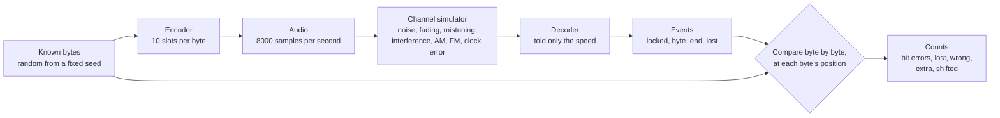


*"CQ CQ DE UNLIMITED" through ten simulated conditions, drawn by `make docs` from the real encoder, channel simulator
and decoder: one run each with fixed seeds, a picture of the conditions; the long suite measures them over many
transmissions.*

**In depth.** The chain, in the code the tests share (`tests/support/loopback.hpp` and `.cpp`, `pc/channel.hpp`):

| Step | Function | What it does |
|---|---|---|
| Known bytes | `loopback::random_bytes(count, seed)` | bytes from `std::mt19937(seed)` |
| A sender and its receiver | `speed_config(bytes_per_second)`, `receiver_for(config)` | an `EncoderConfig` at 8000 Hz (the passband widened to 100–3000 Hz when the band needs it); the `DecoderConfig` of the same speed and passband |
| Encode | `encode(data, config)`, `single(data, config)` | a whole transmission as int16 samples; `single()` puts silence around it (at least 15 slots before: the receiver must hear a silent window before a START, V6) and records where it starts |
| Channel | `sim::Channel`, `usb(samples, snr_db, seed, amplitude, offset_hz)`, `through_channel()` | the radio path; `usb()` is the common case: USB with white noise at an SNR, mistuned by an offset |
| Decode | `run_decoder(samples, config, chunk)` | feeds `Decoder::process()` and records every event with the number of samples consumed when it came |
| Score | `score(recording, capture, delay)`, `map_events()` | gives every byte event to the transmission whose first START lies 9.5 slots to 10 windows before its lock, at its `byte_index`, and counts |

The counts:

| Count | What it counts | Why it matters |
|---|---|---|
| **BER** | bit errors in the released bytes ÷ the released bits | noise damage; it falls steeply as the SNR rises |
| **lost** (loss) | sent bytes that were never released | a missing byte: a dropped window, or a transmission never found |
| **wrong** | released bytes that differ from the byte sent at that position | noise damage, at byte level |
| **extra** | released bytes the sender never sent at that position | invented data (reported since V22: the upper protocol rejects it) |
| **shifted** | bytes of a lock that sit at a wrong `byte_index` | misplaced data, a whole grid off (reported since V22) |
| **delivered** | released bytes that land on a sent byte ÷ sent bytes | how much of the message arrived |
| **framing** | windows dropped because their START or STOP was missing | the price of fading; a dropped byte is never guessed |

Two suites run this chain: the **unit suite** (`make test`, [§5](#5-unit-tests-make-test)) on short, exact cases,
and the **long regression suite** (`make test_long`, [§6](#6-the-long-regression-suite-make-test_long)) on hours of
simulated audio, where it measures error rates against the gates of the spec.

---

## 2. Before you start

### 2.1 What you need

**In plain words.** A C++ compiler and `make` are all you need for the library, the programs, the unit tests, the long
suite and the documentation figures: the project uses nothing but the C++ standard library, plus the system's sound
library (CoreAudio on macOS, ALSA on Linux). Two checks reach into microcontrollers: they use extra compilers when they
find them, and say so when they don't.

| Tool | Needed for | Without it |
|---|---|---|
| A C++11 compiler: clang or GCC | everything | nothing builds |
| GNU `make` | everything | nothing builds |
| Linux: the ALSA headers (`libasound2-dev` on Debian and Ubuntu) | the programs and the tests (`pc/audio_alsa.cpp`, linked with `-lasound -lpthread -lutil`) | the build fails; macOS needs nothing extra (CoreAudio comes with it) |
| `nm` (comes with the compiler tools) | `make check_embedded`: the symbol scan | the scan cannot run |
| `avr-g++`, `avr-objdump`, `avr-objcopy`, `avr-nm`, `avr-size` | `make check_embedded`: the ATmega328P builds, the AVR interrupt cycle gate, the Nano send side of the modem; `make arduino_check`: the floating-point scan of `tx_uno` | `check_embedded: avr-g++ not found, skipped`, and **the interrupt gate does not run** |
| `xtensa-esp32-elf-g++` | `make check_embedded`: the ESP32 builds and the modem's ESP32 sizes | `check_embedded: xtensa-esp32-elf-g++ not found, skipped` |
| `arm-none-eabi-g++` | `make check_embedded`: the Cortex-M4 build | `check_embedded: arm-none-eabi-g++ not found, skipped` (not installed for this guide) |
| `arduino-cli` with the cores `arduino:avr` and `esp32:esp32` | `make arduino_check` | `arduino-cli not found`, and the target fails |
| `shasum` (macOS) or `sha256sum` (Linux) | the determinism check of `make docs` | – |
| The "Microsoft Teams Audio" virtual device (macOS) | `tools/modem_smoke_teams.sh` only | the script stops: "the Microsoft Teams Audio device is not installed" |

Where the Makefile looks for the cross compilers: first on your `PATH`; then, for AVR and ESP32, inside the packages
that `arduino-cli` installs (`~/Library/Arduino15` on macOS, `~/.arduino15` on Linux:
`packages/arduino/tools/avr-gcc/*/bin/` and `packages/esp32/tools/esp-x32/*/bin/`). Installing `arduino-cli` and its
two cores therefore also gives `check_embedded` its AVR and ESP32 compilers. The ARM compiler is looked for on the
`PATH` only.

### 2.2 Checking your tools

```bash
c++ --version
```

```text
Apple clang version 21.0.0 (clang-2100.1.1.101)
Target: arm64-apple-darwin25.5.0
…
```

```bash
make --version
```

```text
GNU Make 3.81
…
```

```bash
arduino-cli core list
```

```text
ID          Installed Latest Name
arduino:avr 1.8.7     1.8.7  Arduino AVR Boards
esp32:esp32 3.3.7     3.3.7  esp32
```

The first lines of `make check_embedded` ([§8.1](#81-make-check_embedded)) also say which cross compilers were found
and which were skipped.

### 2.3 Installing

- **macOS:** the Command Line Tools for Xcode provide clang, GNU `make` 3.81 and `nm`; CoreAudio is part of the
  system.
- **Linux:** your distribution's C++ compiler, `make`, binutils and the ALSA headers. On Debian and Ubuntu:
  `sudo apt-get install build-essential libasound2-dev`. CI installs exactly `libasound2-dev` on `ubuntu-latest` and
  builds and tests everything there with g++ ([§10](#10-continuous-integration)); Linux with a real sound card and
  serial port is proven on a bench (spec §11 M8).
- **The Arduino check (optional):** install [`arduino-cli`](https://arduino.github.io/arduino-cli/), then the cores
  `arduino:avr` and `esp32:esp32` (the latter from Espressif's board index,
  `https://espressif.github.io/arduino-esp32/package_esp32_index.json`, added to `arduino-cli`'s board manager URLs).

### 2.4 The machine used for this guide

| | |
|---|---|
| Computer | Apple M4, 10 cores, 16 GB, macOS 26.5.2 |
| Compiler | Apple clang 21.0.0 (with libc++), GNU Make 3.81 |
| Arduino | arduino-cli 1.2.2; `arduino:avr` 1.8.7 (avr-gcc 7.3.0); `esp32:esp32` 3.3.7 (esp-x32 2511) |
| Not installed | `arm-none-eabi-g++` |
| Load | another job (a parallel build) shared the machine at times, so the times are indicative |

---

## 3. The map: every target at a glance

### 3.1 Every target

**In plain words.** Each `make` target answers one question. The build targets make the programs; the check targets
run them and answer yes or no.

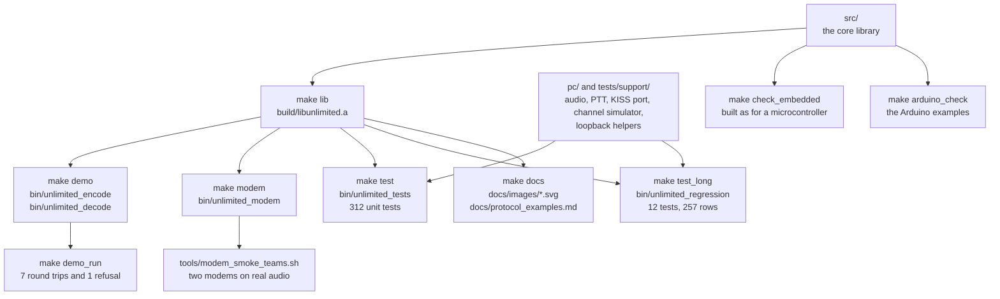

| Target | What it proves | Needs | Time here | Section |
|---|---|---|---|---|
| `make` (= `make all`: `lib`, `demo`, `modem`) | the library and the three programs compile, warning-free | compiler, `make` | 7.2 s from a clean tree | [§4](#4-building) |
| `make test` | 312 unit tests pass | compiler, `make` | 26.9 s for the tests alone; 39.0 s from a clean tree with the build (then 307 tests) | [§5](#5-unit-tests-make-test) |
| `make test FILTER=…` | the chosen unit tests pass | the same | 0.02 s for `FILTER=modem_min_frame` | [§5.3](#53-running-only-some-tests-filter) |
| sanitizer runs (a `make test` with other flags) | no memory error and no undefined behaviour (all 312 tests); no data race (the 75 tests with threads) | clang or GCC | 91.9 s from a clean build; 95.2 s | [§5.5](#55-under-the-sanitizers) |
| `make test_long` | 257 measured rows against the spec's gates | compiler, `make` | 1 min 38 s on 10 cores (98.4 s, 769 s of CPU) | [§6](#6-the-long-regression-suite-make-test_long) |
| `make check_embedded` | the core as a microcontroller builds it: no heap, exceptions or RTTI; decodes with a trapping heap; two modem cores with a trapping heap; cross builds; the AVR interrupt gate; the modem's send side without the receiver | compiler; cross compilers optional | 10.3 s | [§8.1](#81-make-check_embedded) |
| `make arduino_check` | the five Arduino examples compile warning-free; `tx_uno` has no floating point | `arduino-cli` and the cores | 74.5 s | [§8.2](#82-make-arduino_check) |
| `make demo_run` | the programs round-trip a text exactly through 7 simulated radios; a misfit is refused | compiler, `make` | 1.6 s once built | [§9.1](#91-make-demo_run) |
| `make tables` | the encoder's sine table is exactly what its generator prints | compiler, `make` | 0.3 s | [§9.2](#92-make-tables) |
| `make docs` | the figures and examples regenerate from the library, byte-identical every run | compiler, `make` | 4.4 s | [§9.3](#93-make-docs) |
| `sh tools/modem_smoke_teams.sh [BPS]` | two modems exchange frames byte for byte through a real CoreAudio device (not in `make test`) | macOS, the virtual device | 19.9 s at 6 bytes/s | [§7.3](#73-the-real-audio-smoke-test) |
| `make clean`, `make help` | removes `build/` and `bin/`; lists the targets | – | instant | [§4](#4-building) |

### 3.2 Which test should I run?

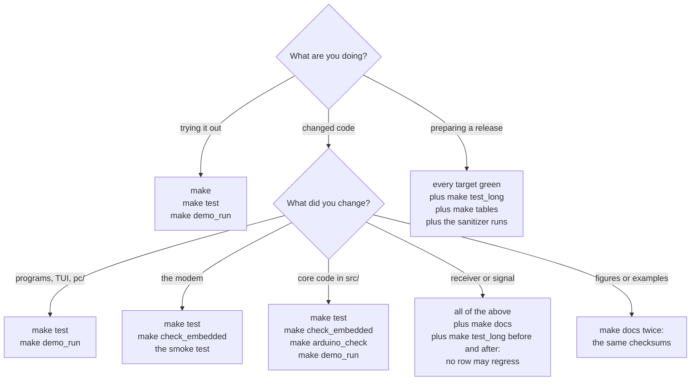

Gustavo's definition of done (spec §0.5, D3) asks for tests that fail before a change and pass after it, measured
numbers before and after, and every target green: `make test`, `make test_long`, `make check_embedded`,
`make arduino_check`, `make demo_run` and `make docs` with deterministic output.

### 3.3 Success and failure in one place

Every target returns exit status 0 when it succeeds. When a command inside a target fails, `make` prints
`make: *** [target] Error N` (N is the failing program's status) and exits with status 2. `make test_long` does that
today because of the two known FAIL rows ([§6.9](#69-the-two-known-fail-rows)).

| Program | 0 | 1 | 2 | 3 |
|---|---|---|---|---|
| `make`, any target | success | – | a command failed | – |
| `bin/unlimited_tests`, `bin/unlimited_regression` | every test that ran passed | a test failed, or no test matched the filter | – | – |
| `bin/unlimited_encode` | sent | stopped by Ctrl-C | usage error, or a configuration it refuses | a file, the sound card or the PTT failed |
| `bin/unlimited_decode` | decoded; with `--expect`, an exact match | nothing decoded; with `--expect`, a mismatch | usage error | a file or the sound card failed |
| `bin/unlimited_modem` | stopped cleanly (Ctrl-C, SIGTERM, SIGHUP); `--loopback` PASS | a device, the pseudo-terminal, the serial port or the PTT failed; a configuration refused; `--loopback` FAIL | usage error | – |
| `tools/modem_smoke_teams.sh` | `smoke: PASS` | `smoke: FAIL: <why>` | – | – |

---

## 4. Building

**In plain words.** `make` compiles the library and the three programs. It tests nothing yet, but every file is
compiled with every warning turned into an error, so a clean build is already a first check: one warning fails it.

```bash
make
```

```text
c++ -O2 -std=c++11 -Wall -Wextra -Wpedantic -Werror -MMD -MP -Isrc -Ipc -Itests -c src/unlimited/decoder.cpp -o build/src/unlimited/decoder.o
…
ar rcs build/libunlimited.a build/src/unlimited/decoder.o build/src/unlimited/dsp.o …
…
c++ -O2 -std=c++11 -Wall -Wextra -Wpedantic -Werror -MMD -MP build/demo/unlimited_modem.o build/pc/audio.o … build/libunlimited.a -o bin/unlimited_modem -framework CoreAudio -framework AudioToolbox -framework CoreFoundation
```

- **Success:** no `make: ***` line (exit status 0), and four files: `build/libunlimited.a` (the core library),
  `bin/unlimited_encode`, `bin/unlimited_decode` and `bin/unlimited_modem`. 7.2 s from a clean tree here.
- **Failure:** the compiler prints `file:line:column: error: …` (a `warning:` counts: `-Werror` makes it an error),
  and `make` stops with `make: *** [build/…/file.o] Error 1`, exit status 2.

**In depth.**

- **Flags.** `CXXFLAGS` defaults to `-O2`; the Makefile always adds `-std=c++11 -Wall -Wextra -Wpedantic -Werror -MMD
  -MP`. `-MMD -MP` write a `.d` file next to each object, so editing a header rebuilds exactly what depends on it.
- **The system's libraries** (`PC_LIBS`, by `uname -s`): macOS `-framework CoreAudio -framework AudioToolbox
  -framework CoreFoundation`; Linux `-lasound -lpthread -lutil`; others `-lpthread`. They go on the link line of every
  program built from `pc/`; `check_embedded` builds the core alone and never needs them.
- **Folders.** Everything built goes to `build/` (objects, the library, the tools, the work folders of the embedded,
  Arduino, demo and docs checks) and `bin/` (the programs). Git ignores both.
- `make lib` builds only `build/libunlimited.a`; `make demo` the encoder and the decoder; `make modem` the modem.
- **Parallel builds.** `make -j4` compiles four files at once (CI builds that way).
- **Starting over:** `make clean` removes `build/` and `bin/`. **The list of targets:** `make help`:

```text
make [all|lib|demo|modem|test|test_long|check_embedded|arduino_check|demo_run|tables|docs|clean]
```

---

## 5. Unit tests: `make test`

### 5.1 Running them

**In plain words.** 312 small tests, each checking one promise of the code: that the sine table is exact, that a byte
window has exactly the right slots, that the receiver gets every byte back through clean and noisy simulated radios,
that it drops a window whose START or STOP is missing, that the channel simulator's physics are right, that the
programs parse their options and play through a sound card, that the KISS modem sends one transmission per frame and
hands the computer exactly what it heard, and that the ESP32 TNC's code does the same against a PC modem. They need nothing but the compiler and take under half a minute to run.

```bash
make test
```

```text
c++ -O2 -std=c++11 -Wall -Wextra -Wpedantic -Werror -MMD -MP -Isrc -Ipc -Itests -c tests/test_audio_devices.cpp -o build/tests/test_audio_devices.o
…
./bin/unlimited_tests
[ RUN  ] audio_device_spec_forms
[ PASS ] audio_device_spec_forms (0 ms)
…
[ RUN  ] decoder_size_and_lookahead
    note: sizeof(Decoder) = 17440 B on this host (budget 18432 B)
[ PASS ] decoder_size_and_lookahead (0 ms)
…
[ RUN  ] modem_min_frame_holds_then_streams
    note: the first byte reached the computer 14.00 windows (2.33 s) later than without the minimum frame
[ PASS ] modem_min_frame_holds_then_streams (6 ms)
…
[ PASS ] wav_codec_reader_rejects_malformed (0 ms)

312 test(s) run, 312 passed, 0 failed
```

How to read it:

| Line | Meaning |
|---|---|
| `c++ …` | the build; only files that changed are compiled again |
| `./bin/unlimited_tests` | the test program starts (with the `FILTER` words after it, if any) |
| `[ RUN  ] name` | a test starts |
| `    note: …` | a value the test measured, printed for information; it never fails a test |
| `[ PASS ] name (N ms)` | every check of the test held; N is its run time |
| `    file:line: CHECK…(…) failed: …` | one check did not hold ([§5.2](#52-what-a-failure-looks-like)) |
| `[ FAIL ] name (N ms)` | at least one check of the test failed |
| `312 test(s) run, 312 passed, 0 failed` | the summary; under it, one `FAILED: name` line per failed test |

- **Success:** `0 failed` and exit status 0. **Failure:** exit status 1, then `make: *** [test] Error 1` and status 2.
- **Time here:** 26.9 s for the tests alone (39.0 s from a clean tree with the build, measured before the ESP32 TNC's 5
  tests came). They run one after another, on one core. The slowest: `modem_link_frames_come_out_byte_for_byte` 2.0 s
  (two modem cores through the channel simulator, 6 conditions), `decoder_awgn_per_speed` 1.9 s,
  `channel_fading_two_path` 1.7 s, `decoder_back_to_back` 1.5 s, `decoder_mid_transmission_start_waits_for_the_next`
  1.4 s, `decoder_speech_stray_bytes_are_reported` 1.3 s; the ESP32 TNC's five take 0.8 s together.
- **No sound is played or recorded.** The tests of the live devices run on stand-in devices; one test opens this
  computer's default output without starting it (`audio_open_default_output_without_playing`) and one prints this
  computer's device list (`audio_list_devices_on_this_system`); both accept a machine with no sound device (CI).
- The notes are evidence too: `decoder_size_and_lookahead` shows the decoder within its memory budget (17,440 of
  18,432 bytes); `modem_min_frame_holds_then_streams` shows the price of the minimum frame (14 windows, 2.33 s at
  6 bytes/s); `audio_live_input_counts_what_a_slow_sink_loses` shows "2304 of 20000 samples delivered (a stalled block
  of 256 and a full ring of 2048), 70 xruns", exactly, on every run.

**In depth: the harness.** `tests/test_harness.hpp` is the whole test framework, standard C++ only:

- `TEST(name) { … }` registers a function in a list when the program starts (static initialization, in link order:
  the test files in alphabetical order, the tests in file order).
- `CHECK(condition)`, `CHECK_EQ(a, b)` and `CHECK_NEAR(a, b, tolerance)` record a failure with its file, line,
  expression and values, and let the test go on. `REQUIRE(condition)` records it and ends the test.
- `NOTE(format, …)` prints a measured value under the running test.
- An unexpected C++ exception fails the test with its message.
- `tests/test_main.cpp` is the `main()`: it runs every test whose name contains one of the arguments, or every test
  when there is none.
- `tests/output_capture.hpp` points stdout or stderr at a pipe emptied by a reader thread, so a test of a program can
  wait for a printed line without polling; `DefaultSignal` gives a signal its default action inside a test.

### 5.2 What a failure looks like

A failed check names its file and line, the expression and both values; `REQUIRE` ends the test; the summary lists the
failed test and the program exits with status 1:

```text
[ RUN  ] example_round_trip_fails
    test_example.cpp:10: CHECK_EQ(received_bytes, sent_bytes) failed: 33 != 34
    test_example.cpp:12: REQUIRE(received_bytes == sent_bytes) failed
[ FAIL ] example_round_trip_fails (0 ms)

1 test(s) run, 0 passed, 1 failed
  FAILED: example_round_trip_fails
```

To investigate, run the failed test alone ([§5.3](#53-running-only-some-tests-filter)), open the file at that line,
and read the test's pass criterion in spec §8 (every test function is named there).

### 5.3 Running only some tests: FILTER

**In plain words.** `FILTER=word` runs only the tests whose name contains that word. Several words, in quotes, run the
tests that contain any of them.

```bash
make test FILTER="modem_min_frame decoder_size_and_lookahead"
```

```text
./bin/unlimited_tests modem_min_frame decoder_size_and_lookahead
[ RUN  ] decoder_size_and_lookahead
    note: sizeof(Decoder) = 17440 B on this host (budget 18432 B)
[ PASS ] decoder_size_and_lookahead (0 ms)
[ RUN  ] modem_min_frame_holds_then_streams
    note: the first byte reached the computer 14.00 windows (2.33 s) later than without the minimum frame
[ PASS ] modem_min_frame_holds_then_streams (6 ms)
[ RUN  ] modem_min_frame_drops_short_receptions
[ PASS ] modem_min_frame_drops_short_receptions (5 ms)

3 test(s) run, 3 passed, 0 failed
```

The same, calling the program directly (the words are its arguments): `./bin/unlimited_tests modem_min_frame`. A word
that matches nothing is an error, so a typing mistake cannot pass for a green run:

```text
./bin/unlimited_tests no_such_test
no test matches the filter
```

(exit status 1). The match is a plain, case-sensitive substring test. Every test name starts with its file's prefix
(`decoder_`, `dsp_`, `encoder_`, `modem_`, `transmitter_`, `kiss_`, `tui_`, …), so `FILTER=decoder_` runs the 32
decoder tests. The harness cannot list tests without running them; the sources list them:

```bash
grep -h '^TEST(' tests/*.cpp
```

### 5.4 What the 312 tests cover

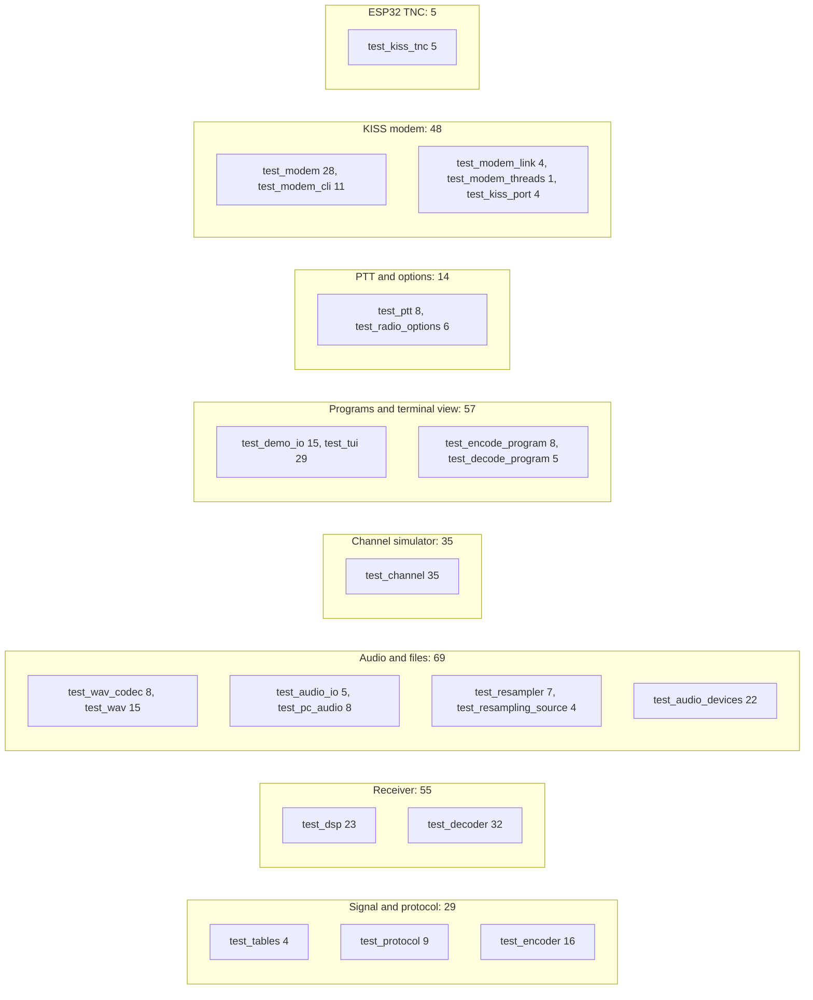

| File (`tests/`) | Tests | What they check |
|---|---|---|
| `test_tables.cpp` | 4 | the quarter-sine table: end points, within 1 LSB on and between its points, symmetry |
| `test_protocol.cpp` | 9 | the speed arithmetic, the band and width formulas exactly, passband fit and shift tolerance, the "Hi" windows bit-exact, the bandwidth constants against the real encoder's spectrum |
| `test_encoder.cpp` | 16 | the configuration and its checks, exact lengths at every speed and rate, the slot drift over 10,000 slots, segments and status, the "Hi" slot sequence, waveform bounds and phase, the VOX lead, energies, streaming, abort, chunk invariance |
| `test_dsp.cpp` | 23 | the receiver's building blocks: oscillator, CIC-2, history and its re-mix, noise trackers, the tone search (floor, bins, edges, fresh tones, steady mask, ban), the impulse blanker, the adaptive line, the look-ahead |
| `test_decoder.cpp` | 32 | clean loopbacks at every speed, each byte at its STOP, noise, mistuning, USB and LSB, clock error, VOX leads, back-to-back transmissions, the first window decided alone (V20), the settling reference and the noise start (V24), framing errors dropped, the end, the decision lines, short transmissions, no lock on noise, carriers or CW, mid-transmission starts, the fade bridge, stray bytes from speech (reported), DCD, the work per block |
| `test_channel.cpp` | 35 | the channel simulator's physics: gains and selectivity, SNR calibration, offsets, the LSB mirror, AM and FM noise, emphasis, limiter, clicks, fading statistics, static crashes, AGC, interferers, QSB, clock error, chunking, seeds |
| `test_wav_codec.cpp`, `test_wav.cpp` | 8, 15 | the core WAV codec (exact RIFF bytes, malformed files); `pc/wav`: 8, 16, 24, 32-bit and float files, stereo, EXTENSIBLE, odd chunks |
| `test_audio_io.cpp`, `test_pc_audio.cpp` | 5, 8 | the sample sinks and sources, device specs, null and memory devices, the resampling sink |
| `test_resampler.cpp`, `test_resampling_source.cpp` | 7, 4 | 8000 ↔ 48000, 44100, 11025 Hz: gain, rejection, chunking, speed; the real-time output resampler equal to the resampler at 9 rates, no allocation in `read()` |
| `test_audio_devices.cpp` | 22 | device specs and choice (number, name part, UID, ambiguous names refused), the `--list-devices` table byte for byte, this system's list, the real-time rings, wake-ups, live inputs and outputs on stand-in devices (order, stops, xruns, errors, drain) |
| `test_ptt.cpp`, `test_radio_options.cpp` | 8, 6 | the CAT command bytes, hex parsing, CAT keying on a PTY (replies dropped, never blocking), RTS and DTR through a stand-in; each program's options and the rules between them |
| `test_demo_io.cpp`, `test_tui.cpp` | 15, 29 | the programs' sinks and command lines, rate independence; the terminal view: the window picture, the encoder view, status, spectrum, scope, pacers, the level meter, the status ring, resizes, Ctrl-C handling |
| `test_encode_program.cpp`, `test_decode_program.cpp` | 8, 5 | the programs themselves (their `main` renamed): options, help, files, playing through a stand-in card with the PTT keyed around the audio, the TX delay, the view's hand-off, Ctrl-C, listening until Ctrl-C, device errors |
| `test_modem.cpp`, `test_modem_cli.cpp`, `test_modem_link.cpp`, `test_modem_threads.cpp`, `test_kiss_port.cpp` | 28, 11, 4, 1, 4 | the KISS modem: [§7](#7-the-kiss-modems-tests) |
| `test_kiss_tnc.cpp` | 5 | the ESP32 TNC's hardware-free code on the PC against a PC modem: [§7.4](#74-the-esp32-tncs-tests) |

Spec §8 names every test with its exact pass criterion, and marks those that failed before a change and pass after it
(V20, V24).

### 5.5 Under the sanitizers

**In plain words.** A **sanitizer** is a compiler option that builds extra checks into the program.
AddressSanitizer stops the program at the first read or write outside an object's memory (a buffer overrun, a use
after free); UndefinedBehaviorSanitizer stops it at undefined behaviour (a signed overflow, a shift too far);
ThreadSanitizer reports two threads touching the same memory without an order between them. A bug that happens to do
no visible harm on your machine is caught anyway.

```bash
CXXFLAGS="-O1 -g -fsanitize=address,undefined -fno-omit-frame-pointer -fno-sanitize-recover=all" ASAN_OPTIONS=detect_leaks=0:halt_on_error=1 make BUILDDIR=build/asan BINDIR=bin/asan test
```

```text
c++ -O1 -g -fsanitize=address,undefined -fno-omit-frame-pointer -fno-sanitize-recover=all -std=c++11 -Wall -Wextra -Wpedantic -Werror -MMD -MP -Isrc -Ipc -Itests -c tests/test_audio_devices.cpp -o build/asan/tests/test_audio_devices.o
…
./bin/asan/unlimited_tests
…
312 test(s) run, 312 passed, 0 failed
```

- **Success:** 312 passed, exit status 0, and no sanitizer report anywhere in the output. A report contains
  `runtime error:` or `ERROR: AddressSanitizer` and ends the program at once with a stack trace.
- **Time here:** 91.9 s from a clean sanitized build (51 files and 307 tests, a little over twice as slow under the
  checks); 64.2 s again once the ESP32 TNC's test file came (one file compiled, then all 312 tests): 0 reports.

| Part | Why |
|---|---|
| `CXXFLAGS="…"` before `make` | in the environment, it replaces the Makefile's default `-O2` (`CXXFLAGS ?= -O2`), and the Makefile still adds `-std=c++11` and every warning |
| `-O1 -g -fno-omit-frame-pointer` | light optimisation, debug information and frame pointers: readable stack traces |
| `-fsanitize=address,undefined` | both sanitizers, compiled into every file and linked into the program |
| `-fno-sanitize-recover=all` | any report is fatal, so it fails the run instead of scrolling past |
| `ASAN_OPTIONS=detect_leaks=0:halt_on_error=1` | the first memory report is fatal; leak detection off |
| `BUILDDIR=build/asan BINDIR=bin/asan` | the sanitized objects and program stay apart from the normal build |

**ThreadSanitizer** runs on the tests with threads: the live devices, the programs and the modem (a separate build;
TSan and ASan do not mix):

```bash
CXXFLAGS="-O1 -g -fsanitize=thread" make BUILDDIR=build/tsan BINDIR=bin/tsan test FILTER="modem kiss transmitter resampling_source audio_live encode_program decode_program"
```

On the day of this guide: 75 tests matched, 75 passed, **0 ThreadSanitizer reports**, 95.2 s with the build. Spec §9
records the earlier runs (0 reports in the modem's tests and in 15 repeats of the four-thread test), and what this
ThreadSanitizer cannot see: a byte buffer written and read in order without synchronization goes unreported, so the
order of the modem's queue bytes rests on review (spec §11 M5). A ThreadSanitizer build of `unlimited_modem` itself
does not stop on SIGINT while it waits in `select()` (spec §11 M15): stop it with SIGKILL.

---

## 6. The long regression suite: `make test_long`

### 6.1 In plain words

The unit tests check that each part keeps its promises. The long suite measures **how well the whole modem works**:
hours of simulated radio (plain noise at each speed's promised SNR, HF fading, static crashes, carriers and Morse next
to the signal, AGC, AM, FM, clocks off by 0.1 %, narrow filters and mistuning, and half-hours of noise, carriers, Morse
and speech with no signal at all), about 1 min 40 s on every core of a 10-core computer. Each measurement is a **row**
(a `RESULT` line). Some rows are compared with a **gate**, the limit the spec sets, and say **PASS** or **FAIL**; the
others are printed for the record (**REPORT**). Together they answer the questions a radio amateur would ask:

- At the SNR the spec promises, how many bits come back wrong, and how many bytes are lost?
- Is nearly every transmission found from its first byte, 3 dB above that?
- Does a clock that runs fast or slow ever make the receiver slip?
- How much gets through HF fading, interference, AM and FM?
- How many bytes does it invent from speech, Morse or noise, and do any reach an AX.25 program through the modem?

### 6.2 Running the whole suite

```bash
make test_long > build/test_long.log 2>&1
```

It builds `bin/unlimited_regression` and runs its 12 tests in order, most of them spreading their work over every core.
Keep the output: the rows are the evidence you will compare after a change ([§11.4](#114-before-and-after-a-change)).
What it prints (this guide's run; long rows cut with `…`):

```text
./bin/unlimited_regression
[ RUN  ] A1_A2_awgn_per_speed
RESULT | A1 | 1 bytes/s, AWGN -6.5 dB (gate +0.0), mistuned +-50 Hz, adaptive line (the default) | BER 4.36e-04 (48152 bits), delivered 95.97%, loss 4.03%, wrong 11, extra 1, … | BER <= 1e-3, loss <= 1 % (provisional); extra bytes reported (V22) | FAIL
    tests/long/regression_support.cpp:487: A1 failed: 1 bytes/s, AWGN -6.5 dB (gate +0.0), mistuned +-50 Hz, adaptive line (the default)
…
[ FAIL ] A1_A2_awgn_per_speed (18691 ms)
[ RUN  ] A3_acquisition_from_byte_0
…
[ RUN  ] Z_summary

==== long regression summary (257 result lines: 34 PASS, 2 FAIL, 221 REPORT) ====
RESULT | A1 | …
…
12 test(s) run, 11 passed, 1 failed
  FAILED: A1_A2_awgn_per_speed
make: *** [test_long] Error 1
```

- **Time:** 98.4 s here, 769 s of processor time (7.8 cores busy on average); the program was already built.
- **Every row is printed twice:** once when it is measured, once more in the summary block that `Z_summary` prints at
  the end: 257 rows, 36 gated (34 PASS, 2 FAIL) and 221 reported.
- **The expected end:** `FAILED: A1_A2_awgn_per_speed` and make's error (exit status 2), because of the two known FAIL
  rows ([§6.9](#69-the-two-known-fail-rows)). A FAIL anywhere else is a regression.

### 6.3 Running one test: FILTER

The long suite uses the same harness and the same `FILTER` as the unit tests; `Z_summary` prints the summary block, so
add it when you want one:

```bash
make test_long FILTER="L5_clock Z_summary"
```

The tests in their run order:

```bash
grep '^TEST(' tests/long/regression_suite.cpp
```

```text
TEST(A1_A2_awgn_per_speed) {
TEST(A3_acquisition_from_byte_0) {
TEST(S1_short_transmissions) {
TEST(L5_clock_error_10_min) {
TEST(L19_passband_and_shift) {
TEST(C_channels) {
TEST(F1_noise_stray_bytes) {
TEST(F2_carrier_stray_bytes) {
TEST(F3_cw_stray_bytes) {
TEST(F4_speech_stray_bytes) {
TEST(Integrity_extra_and_shifted_bytes) {
TEST(Z_summary) {
```

Two filters surprise: `F2`, `F3` or `F4` alone still costs as much as `F1` (the first F test measures every scene and
the others read its results), and `Integrity` alone has nothing to add up (it reads the ledger the A, S, L and C tests
fill): run it with them.

### 6.4 Rows, gates and verdicts

**In plain words.** A **row** is one measured condition: one speed, one channel at one SNR, one receiver, usually
hundreds of transmissions. A **gate** is the limit the spec sets for that condition. The **verdict** at the end of the
row:

- **PASS:** the measured value meets the gate.
- **FAIL:** it does not. The harness prints a `file:line: <id> failed: <condition>` line under the row, the test goes
  on printing its other rows, ends as `[ FAIL ]`, and the program exits with status 1.
- **REPORT:** there is no gate; the value is printed for the record: conditions beyond the spec's promise,
  comparisons, the channel rows whose gates are Gustavo's to set, and everything Gustavo decided to report rather than
  gate.

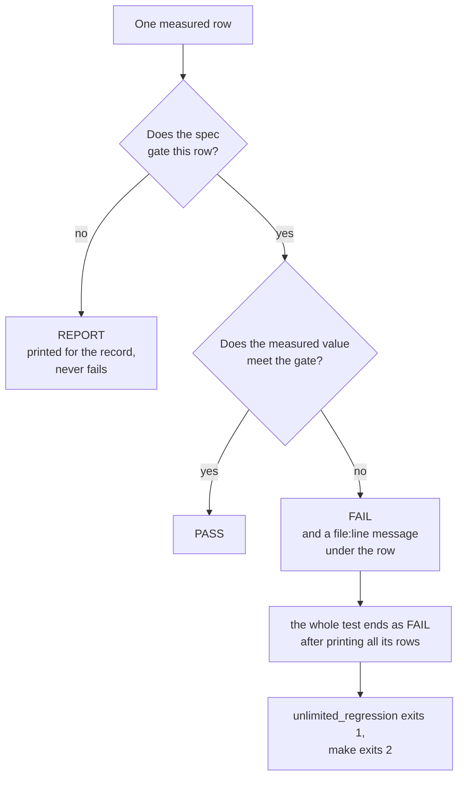

**What is gated, and what is reported (spec §4, V22).** Integrity is the upper protocol's for v1.0, by Gustavo's rule
as for RTTY: the modem may drop or garble bytes, the protocol above must reject them. So extra and shifted bytes are
**reported** in every row and added up by the Integrity rows, never a gate failure; the stray bytes that speech, Morse
or noise produce are reported too (V20). **Gated:** BER ≤ 1e-3 and loss ≤ 1 % at each speed's gate SNR (A1); at least
99 % of transmissions from byte 0 at gate + 3 dB (A3); no slip over 10 minutes at ±1000 ppm (L5); BER ≤ 1e-4 across
pitches and filters at gate + 6 dB (L19). In `make test`, every exactness test at a strong signal stays gated
(loopbacks byte for byte with nothing extra, a framing error never delivered, back-to-back transmissions each once).

**In depth.** Rows come from `result(id, condition, measured, gate, pass, kind)` in
`tests/long/regression_support.cpp`: a gated row that does not pass calls the harness's `fail()`, which fails the
running test without stopping it. A gate changes only by Gustavo's decision, recorded in spec §0.3 (V22, V25).
"(provisional)" in a gate's text marks a gate set from v0.3's measurements at the same slot length: it may only be
tightened by measurement.

### 6.5 Anatomy of a RESULT row

A row is six columns separated by ` | `. The A1 row at 6 bytes/s, 3 dB above its gate:

```text
RESULT | A1 | 6 bytes/s, AWGN 4.3 dB (gate +3.0), mistuned +-50 Hz, adaptive line (the default) | BER 0.00e+00 (50176 bits), delivered 100.00%, loss 0.00%, wrong 0, extra 0, locked 196/196 tx from byte 0, 196 locks, 0 lost (framing), 0 windows dropped | report | REPORT
```

| Column | In this row | Meaning |
|---|---|---|
| 1 | `RESULT` | marks a row: `grep '^RESULT'` finds them all |
| 2 | `A1` | the family, as in spec §4 and §8: A1 is plain noise with the default adaptive decision line |
| 3 | `6 bytes/s, AWGN 4.3 dB (gate +3.0), mistuned +-50 Hz, adaptive line (the default)` | the condition: the speed, the channel (USB with white noise at 4.3 dB, this speed's gate + 3 dB), the receiver's mistuning (random within ±50 Hz for each job) and the decision line |
| 4 | `BER 0.00e+00 (50176 bits), …` | what was measured (next table) |
| 5 | `report` | the gate as the spec sets it, or why the row is only reported |
| 6 | `REPORT` | the verdict |

| Field | Meaning |
|---|---|
| `BER 0.00e+00 (50176 bits)` | bit errors ÷ released bits: 196 transmissions of 32 bytes |
| `delivered 100.00%`, `loss 0.00%` | the released bytes that landed on a sent byte; the sent bytes never released |
| `wrong 0`, `extra 0` | released bytes with at least one bit error; released bytes the sender never sent there |
| `locked 196/196 tx from byte 0`, `196 locks` | transmissions whose lock came with their first window; all locks |
| `0 lost (framing)`, `0 windows dropped` | `lost` events after 2 framing errors in a row; windows dropped for a missing START or STOP |

Other families add their own fields: A3 the share decoded from byte 0; L5 the error of the measured slot length
(`T error mean 0.0011%, worst 0.0655%`); L19 its worst pitch; S1 each size's shares; the F rows stray bytes and locks
per hour, the longest stray reception, what reaches a computer through the modem, and DCD's time. The gated A1 row of
the same speed, at the gate itself, is one of the two known FAIL rows:

```text
RESULT | A1 | 6 bytes/s, AWGN 1.3 dB (gate +0.0), mistuned +-50 Hz, adaptive line (the default) | BER 2.05e-05 (48896 bits), delivered 97.45%, loss 2.55%, wrong 1, extra 0, locked 191/196 tx from byte 0, 191 locks, 0 lost (framing), 0 windows dropped | BER <= 1e-3, loss <= 1 % (provisional); extra bytes reported (V22) | FAIL
```

### 6.6 The families

**In plain words.** Of the 12 tests, 11 measure the modem, in five families; the last one, `Z_summary`, prints every row
again.

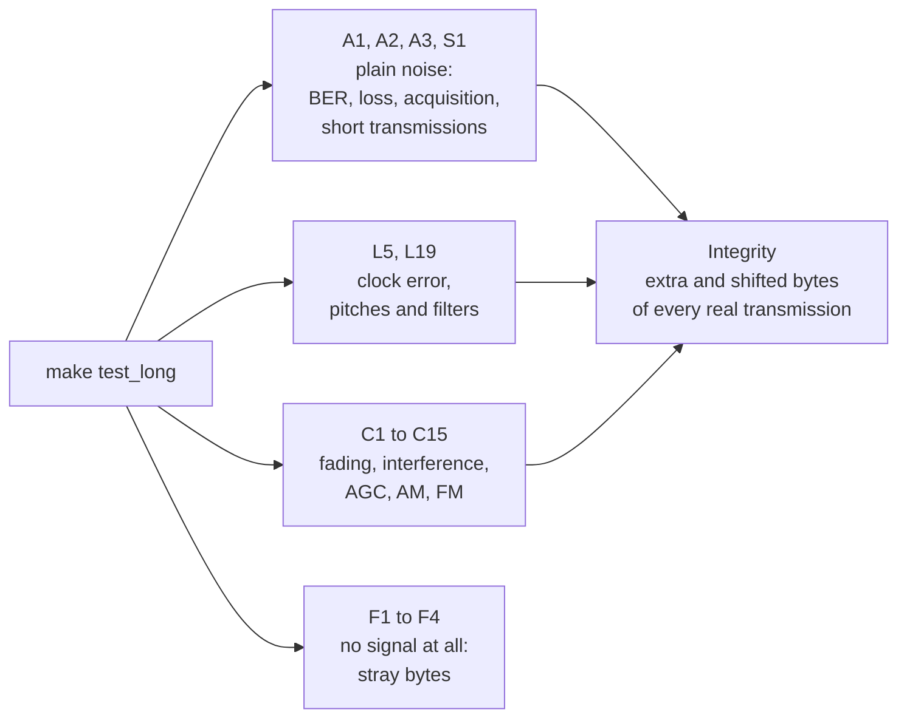

| Test | What it measures | Rows gated / reported | Time here |
|---|---|---|---|
| `A1_A2_awgn_per_speed` | BER and loss in plain noise at each speed's gate, gate + 3 and + 4.5 dB, 196 transmissions of 32 bytes per point, mistuned ±50 Hz; A1 the adaptive line (gated at the gate), A2 the fixed 70 % line against it | A1 5 / 10; A2 0 / 15 | 18.7 s |
| `A3_acquisition_from_byte_0` | 300 transmissions of 16 bytes per speed at gate + 3 dB: at least 99 % decoded from byte 0 | 5 / 0 | 5.0 s |
| `S1_short_transmissions` | 1, 2, 4 and 8 bytes, 150 each, at gate + 3 dB and 20 dB: the shortest decoded ≥ 99 % | 0 / 10 | 8.4 s |
| `L5_clock_error_10_min` | 10-minute transmissions at 1, 6 and 25 bytes/s with the sender's clock ±1000 ppm: every byte, one lock | 6 / 0 | 2.7 s |
| `L19_passband_and_shift` | 7 pitches over the search range, 4 SSB filters (1.8, 2.4, 2.7, 3.0 kHz), each speed, gate + 6 dB: BER ≤ 1e-4 | 20 / 0 | 11.7 s |
| `C_channels` | C1–C15: CCIR good, moderate, poor, flat Rayleigh, QSB, static crashes with the blanker, receiver AGC, a carrier, keyed CW, FM, AM, flutter, AGC with fading, LSB in fading, FM emphasis mismatch; each recording decoded with the adaptive line, the fixed line and the fade bridge | 0 / 168 | 17.2 s |
| `F1_noise_stray_bytes` … `F4_speech_stray_bytes` | 30 minutes each of receiver noise, a drifting carrier, keyed CW and speech-shaped bursts, per speed class (1, 6, 12, 25 bytes/s): stray bytes and locks per hour, and through the KISS modem's core with its defaults | 0 / 16 | 34.6 s (all four in F1) |
| `Integrity_extra_and_shifted_bytes` | the extra and shifted bytes of every A, S, L and C row (real transmissions), and of the C rows with the fade bridge | 0 / 2 | 0 s |
| `Z_summary` | prints every row again | – | 0 s |

This guide's run reproduced spec §4 and §9 exactly: the two A1 FAIL rows (loss 4.03 % and 2.55 %), A3 100 % at every
speed, Integrity 177 extra and 65 shifted bytes among 409,187 released (37 and 13 among 41,685 with the fade bridge),
and through the modem 0 stray frames and 0 bytes per hour in every F scene.

**In depth: how a test runs its rows.**

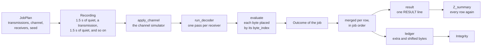

- A row's transmissions are split into **jobs** of about six minutes of audio each, at least eight jobs per row when
  there are enough transmissions (`transmissions_per_job()`). A job is one recording: 1.5 s of receiver noise
  (`k_quiet_ms`) before, between and after its transmissions (at least 15 slots before the first: the receiver needs a
  silent window before a START), passed through the channel once and decoded by each receiver of the row.
- The channel's output is scaled so that the key-down peaks and 5 σ of noise stay below full scale, as a real sound
  card's input must be set.
- Files: `tests/long/regression.hpp` (the shared declarations), `regression_support.cpp` (jobs, scoring, rows, the
  ledger, the summary), `regression_awgn.cpp` (A1, A2, A3, S1), `regression_receiver.cpp` (L5, L19),
  `regression_channels.cpp` (C1–C15), `regression_integrity.cpp` (F1–F4, Integrity), `regression_suite.cpp` (the
  registration order); the interferers of the F scenes are in `tests/support/interference.*`, shared with the unit
  tests.

### 6.7 The SNR convention and the gates

**In plain words.** **SNR** (signal-to-noise ratio) compares the power of a steady beep with the power of the hiss in
a 2500 Hz slice of the audio, the convention of weak-signal modes such as FT8. 0 dB: the beep is as strong as that
noise; −3 dB: half as strong. Unlimited decodes below 0 dB at slow speeds because its receiver listens only in a
narrow band around the pitch. Each speed has its **gate SNR**: the SNR at which the spec asks for at most 1 bit in 1000
wrong and at most 1 % of the bytes lost.

| Speed | T | Gate SNR (A1) |
|---|---|---|
| 1 byte/s | 100 ms | −6.5 dB |
| 3 bytes/s | 33.3 ms | −1.7 dB |
| 6 bytes/s | 16.7 ms | +1.3 dB |
| 12 bytes/s | 8.3 ms | +4.3 dB |
| 25 bytes/s | 4 ms | +8.0 dB |

These are v0.3's gates at the same slot length (spec §4). A slot twice as long collects twice the energy: about 3 dB
lower per halving of the speed. "(gate + 3)" in a row's condition means 3 dB above the gate.

**In depth.** The SNR is P_tone ÷ (N0 × 2500 Hz): P_tone is the power of the **key-down** tone (a steady beep at full
crest, A²/2), N0 the noise power per hertz (`pc/channel.hpp`); with fading, it is the average SNR. AM and FM rows take
the unmodulated carrier as the reference and quote the carrier-to-noise ratio (**CNR**) in the receiver's IF bandwidth
(6 kHz AM, 12.5 kHz FM). The measured BER against SNR is the figure `make docs` draws:


*Bit error rate in plain noise per speed, through the real encoder, channel simulator and decoder, 16 transmissions of
16 random bytes per point: solid, the adaptive line (the default); dashed, the fixed 70 % line. Triangles: the gates.*

### 6.8 Seeds, determinism and parallelism

**In plain words.** Every random thing in the suite (the bytes, the noise, the fading, the mistuning) comes from a
seed computed from the test, the row and the job. Nothing depends on the time of day or on how many cores ran it, so
the same code on the same machine prints the same rows.

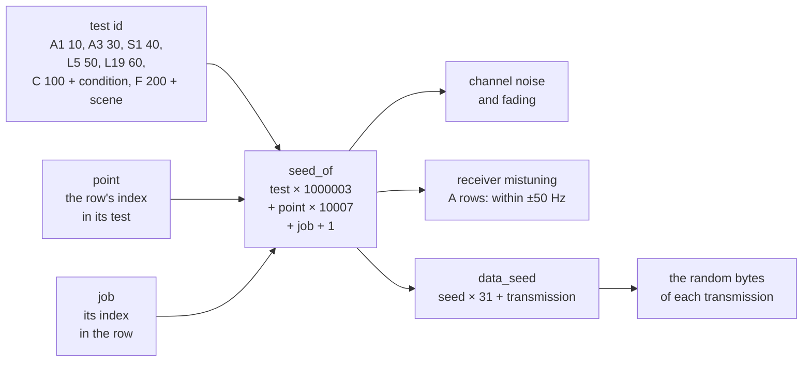

- `seed_of(test, point, job)` = test × 1,000,003 + point × 10,007 + job + 1 (`tests/long/regression_support.cpp`);
  each job's channel uses the job's seed; transmission *t* of a job carries `random_bytes` from `data_seed(seed, t)` =
  seed × 31 + *t*; the A rows draw the receiver's mistuning (uniform, ±50 Hz) from `std::mt19937(seed)`.
- **The point is the row's index in its test's list:** a new row goes at the end of its list, so the existing rows
  keep their seeds and numbers.
- **Parallelism:** `parallel_map()` (`regression.hpp`) runs the jobs on one thread per core
  (`std::thread::hardware_concurrency()`), the costliest first, stores each result at its job's index and merges them
  in index order. The rows are therefore the same with 1 core or 64. There is no switch to use fewer cores; on a shared
  machine, run the suite at a lower priority with `nice`.
- **The limit of determinism:** the simulator's noise uses `std::normal_distribution`, whose algorithm each C++
  standard library chooses: with GCC's libstdc++ on Linux the rows print other digits, and the gates must hold all the
  same. Every number here is from the Mac of [§2.4](#24-the-machine-used-for-this-guide).

### 6.9 The two known FAIL rows

**In plain words.** A1 asks, at each speed's gate SNR, for at most 1 wrong bit in 1000 and at most 1 % of the bytes
lost. At 1 and 6 bytes/s the bit errors are well within the gate (4.4e-4 and 2.1e-5), but 4.0 % and 2.6 % of the bytes
are lost: the receiver does not find the first START of a few transmissions (8 and 5 of 196) and misses them whole. The
gate SNRs were copied from v0.3, whose tune tone and sync train announced each transmission; v1.0 has no preamble, so
each transmission must be found from its first window alone. 3 dB above the gate nothing is missed (A3: 100 %).

Gustavo decided (2026-09-28, spec V25) to keep the gates and to leave these two rows failing, as open problems for
after v1.0 (spec §11 P2, §13). So the long suite ends with exactly these two FAIL rows, and **any other FAIL is
news**. To check that a run failed only there:

```bash
sed -n '/^==== long regression summary/,$p' build/test_long.log | grep ' | FAIL$' | cut -c1-80
```

```text
RESULT | A1 | 1 bytes/s, AWGN -6.5 dB (gate +0.0), mistuned +-50 Hz, adaptive
RESULT | A1 | 6 bytes/s, AWGN 1.3 dB (gate +0.0), mistuned +-50 Hz, adaptive
```

### 6.10 Reading a saved log

With the output saved as in [§6.2](#62-running-the-whole-suite):

| Question | Command |
|---|---|
| The summary line, with the counts of PASS, FAIL and REPORT | `grep '^==== long regression summary' build/test_long.log` |
| The tests that failed | `grep '^\[ FAIL \]' build/test_long.log` |
| The failing rows, each once | `sed -n '/^==== long regression summary/,$p' build/test_long.log \| grep ' \| FAIL$'` |
| Every row once, for comparisons | `sed -n '/^==== long regression summary/,$p' build/test_long.log \| grep '^RESULT' > build/test_long_rows.txt` |

On this guide's run the last one gives 257 lines, one per row.

---

## 7. The KISS modem's tests

### 7.1 In plain words

The KISS modem (`unlimited_modem`) is tested at four levels:

1. **Its parts, one by one** (`make test`): the KISS codec, the send side on a simulated clock (one frame, one
   transmission; the channel check; the PTT around the audio), the receive side (what the computer gets, the minimum
   frame), the command line, the pseudo-terminal and the output resampler.
2. **Two modems talking** through the channel simulator, in memory (`make test`, and `unlimited_modem --loopback`):
   frames byte for byte at 20 dB and at gate + 3 dB, a conversation, back-to-back frames with a VOX lead.
3. **Its four contexts on four threads**, under ThreadSanitizer: no data race between the computer's side, the
   control side, the audio callback and the receiving side.
4. **On real audio** (`tools/modem_smoke_teams.sh`): two modem programs exchange frames through a real CoreAudio
   device.

The ESP32 KISS TNC runs the same core; its own tests are in [§7.4](#74-the-esp32-tncs-tests).

ThreadSanitizer on the day of this guide (the command of [§5.5](#55-under-the-sanitizers): the tests of the modem, the
live devices and the programs, 75 of them): 75 passed, 0 reports.

### 7.2 The unit and link tests

| File (`tests/`) | Tests | What they check |
|---|---|---|
| `test_modem.cpp` | 28 | KISS: frames, escapes, shared FENDs, commands ignored and counted, bad escapes, empty frames. The send side on a simulated clock: one frame is one transmission, a frame waits for its end, back-pressure, a frame longer than the queue streams, a frame is never split, dwait and p-persistence (the key at the predicted millisecond), waiting while DCD is on, full duplex, the first START exactly the TX delay after the key and PTT off exactly the latency after the audio, the VOX lead, the spacing between its own transmissions, the frame on the air. The modem: what it hears reaches the computer as `C0 00`, escaped bytes, `C0`; the minimum frame (the first 15 bytes held and handed over together; receptions of 1 and 14 bytes send nothing); half duplex; waiting for the channel; the fade bridge's lead-in; the sizes |
| `test_modem_cli.cpp` | 11 | the defaults, each PTT's lead, the refusals, `--loopback`'s optional SNR, the help, the monitor's words, the airtime (the encoder's), the lead options measured on the rendered samples, the `--tui` items (each state; a real modem keyed at 25 bytes/s; an 80×24 terminal) |
| `test_modem_link.cpp` | 4 | two modem cores through the channel simulator: 4 × 8 frames of 1–24 bytes at 6, 12 and 25 bytes/s, 20 dB and gate + 3 dB, mistuned 40 Hz: 0 bit errors, 0 split, 0 merged, 0 strays; a conversation both ways; back-to-back VOX frames (8 of 8 at 6, 12 and 25 bytes/s); the VOX lead |
| `test_modem_threads.cpp` | 1 | two modems at 25 bytes/s on 9 threads (each modem's computer, control and receiving thread, one audio thread, a thread reading the snapshots as a view would): 3 frames and an answer byte for byte; the harness adds no ordering of its own, so a missing hand-off in the core shows as a race under ThreadSanitizer |
| `test_kiss_port.cpp` | 4 | the PTY raw both ways for all 256 byte values, its link (made last, replaced when stale, never over a file, removed only when it still points to this PTY), the serial port raw 8N1 |
| `test_resampling_source.cpp` | 4 | the real-time output resampler equal to the resampler at 9 rates, no allocation in `read()`, its lead, silence after its source |

The link tests send frames of 1 byte and up, so they run with the minimum frame off (`min_frame_bytes` 0).

```bash
make test FILTER="modem kiss transmitter resampling_source"
```

`--loopback` runs the same kind of link from the program, with the options' configuration for both stations:

```bash
./bin/unlimited_modem --loopback 4.3
```

(at 6 bytes/s, 4.3 dB is the gate + 3 dB). On the day of this guide it passed clean and at each speed's gate + 3 dB
(`--bps 1 --loopback -3.5`, `--bps 3 --loopback 1.3`, `--bps 12 --loopback 7.3`, `--bps 25 --loopback 11`); the
output is shown in the [README](../README.md#45-unlimited_modem-the-kiss-modem).

### 7.3 The real-audio smoke test

**In plain words.** `tools/modem_smoke_teams.sh` runs two real `unlimited_modem` programs, A and B, on one Mac, both
on the "Microsoft Teams Audio" virtual device, which loops its output back to its input sample for sample: each modem
hears the other, as two radios on one frequency would. Nothing reaches a speaker and nothing comes from a microphone:
both modems name the device by its UID only. It needs the device installed and the Teams app not running (the script
checks both).

```bash
sh tools/modem_smoke_teams.sh 6
```

It checks, in order:

1. A's computer writes two frames in one write (a shared FEND between them, a FEND and a FESC inside the second, as
   `DB DC` and `DB DD`); B's computer must receive exactly the same KISS bytes.
2. B answers with one frame; A's computer must receive it byte for byte.
3. A third program keys once with `--test-tx` (no channel check); B must hand that frame over too.
4. Both modems stop with exit 0 on SIGINT and remove their links.

Every frame is at least 15 bytes, the modems' default minimum frame. The run for this guide (6 bytes/s, 19.9 s; each
modem's banner and `--monitor --debug 1` lines are printed too, cut here):

```text
smoke: 6 bytes/s, both modems on coreaudio:MSLoopbackDriverDevice_UID, work in /var/folders/…/unlimited_smoke.hoJND8
smoke: A -> B: 2 frames byte for byte
smoke: B -> A: 1 frame byte for byte
smoke: --test-tx -> B: 1 frame byte for byte
smoke: A's monitor and debug:
    …
    [21:54:28.590] PTT on
    [21:54:28.590] TX 21 bytes, PTT VOX (the lead tone keys the radio): "Hello from A, frame 1"
                       lead tone 150 ms (--vox-lead-ms 150), then 2 silent slots (33.3 ms); 21 windows 3.5 s; TX tail 100 ms (--txtail 10); keyed 3.797 s with the 14 ms output latency
    …
smoke: B's monitor and debug:
    …
    [21:54:29.209] receiver locked: pitch 1500.0 Hz, T 16.667 ms, SNR 31.1 dB
    [21:54:29.209] DCD on
    [21:54:32.707] RX 21 bytes, 6.00 bytes/s, pitch 1500.0 Hz, SNR 42.6 dB: "Hello from A, frame 1"
    …
smoke: PASS: frames byte for byte both ways; both modems stopped with exit 0 and removed their links
```

B locked 0.62 s after A keyed (the VOX lead 150 ms, its 2-slot gap 33 ms, window 0 read once complete, the
look-ahead 233 ms, the output latency 14 ms); B's answer was keyed 2.0 s after its DCD went off (dwait 1.5 s, then the
p-persistence draws). The same script passed at 12 bytes/s (13.0 s) and 25 bytes/s (11.4 s). On failure it prints
`smoke: FAIL: <what>` and the work folder with both modems' logs, and exits 1.

**PTT on a stand-in radio.** A pseudo-terminal stands in for a radio's CAT port: `--test-ptt --ptt icom --ptt-device
<the PTY's other end> --cat-addr 0xA4` keys it three times, and the stand-in receives the unkey command at the start,
then `FE FE A4 E0 1C 00 01 FD` (key) and `FE FE A4 E0 1C 00 00 FD` (unkey), 1.00 s apart (spec §9). RTS and DTR cannot
be tested this way (a PTY has no modem lines): the unit tests check them through a stand-in for the line calls, and the
bench checks them for real ([docs/modem.md](modem.md#12-bench-checklists)).

### 7.4 The ESP32 TNC's tests

**In plain words.** No board has run the ESP32 KISS TNC yet, so its tests run the sketch's own hardware-free code
(`examples/arduino/kiss_tnc_esp32/kiss_tnc.h`: the decimator, the 1-bit modulator, the computer's port) on the PC, in
the same order the sketch calls it, against a PC modem through the simulated radio, with the wires modelled: the ADC's
12-bit codes with a little converter noise, and the 1-bit stream through the wiring's two RC poles.

```bash
make test FILTER=kiss_tnc
```

```text
./bin/unlimited_tests kiss_tnc
[ RUN  ] kiss_tnc_decimator_is_flat_to_3_khz_and_stops_aliases
…
[ PASS ] kiss_tnc_frames_from_the_computer_go_on_the_air (319 ms)

5 test(s) run, 5 passed, 0 failed
```

| Test | What it proves |
|---|---|
| `kiss_tnc_decimator_is_flat_to_3_khz_and_stops_aliases` | the 24 → 8 kHz decimator: 300–3000 Hz within ±0.04 dB; what would fold into the band from above 4 kHz 54.8 dB down or more (gate 50 dB) |
| `kiss_tnc_one_bit_output_carries_the_audio` | the 1-bit output: a full-scale tone at the right level and 80.7 dB of SNR in 300–2700 Hz (gate 70 dB); silence exactly half ones; stable at full scale; with the two I2S slots swapped it would be 32.6 dB (reported: spec §11 E2) |
| `kiss_tnc_computer_port_holds_what_the_modem_cannot_take` | back-pressure: 200 frames at once, none lost, the port never read while bytes wait |
| `kiss_tnc_frames_from_the_air_reach_the_computer` | at 6 and 25 bytes/s, frames of 15, 32 and 64 bytes from the PC modem reach the board's computer byte for byte; the 14-byte one does not (the minimum frame); the ADC never clips |
| `kiss_tnc_frames_from_the_computer_go_on_the_air` | frames from the board's computer reach the PC modem byte for byte; PTT once per frame; no beep while PTT is released; the first beep after the TX delay and the DMA queue, the last before the release |

When the TNC was built, three defective copies of `kiss_tnc.h` (a shorter output latency, the port read while bytes
wait, a wrong noise-shaping tap) each failed these tests (spec §8). What they do not model: the ESP32 ADC's
nonlinearity, the I2S slot order on the chip, FreeRTOS scheduling, the USB-serial bridge and the radios' audio stages:
the bench steps of [docs/modem.md](modem.md#134-bench-steps) cover those.

---

## 8. Embedded checks: `make check_embedded`, `make arduino_check`

### 8.1 `make check_embedded`

**In plain words.** Microcontrollers have little memory and no operating system underneath: no heap (`malloc`,
`new`), and usually no C++ exceptions or run-time type information (RTTI). This check builds the core the way a
microcontroller build does and proves that it never calls any of them; decodes at every speed, and runs two modem
cores, with a heap that stops the program if anyone touches it; cross-compiles for the ESP32, the ATmega328P and ARM
when those compilers are found; runs the Arduino Uno's sending code on a cycle-exact model of its processor; and links
the modem's send side without the receiver.

```bash
make check_embedded
```

```text
  embedded src/unlimited/decoder.cpp
  …
  embedded src/unlimited/wav_codec.cpp
check_embedded: core is heap/exception/RTTI free
  embedded test tests/embedded/heap_trap.cpp
heap_trap: sizeof Encoder 144, Decoder 17440 bytes
  1 B/s        12 bytes: received 12 wrong 0 extra 0 locks 1 ends 1 lost 0, slot error 0.000 %  ok
  …
  6 B/s x2     40 bytes: received 40 wrong 0 extra 0 locks 2 ends 2 lost 0, slot error 0.001 %  ok
  wav          14 bytes: received 14 wrong 0 extra 0 locks 1 ends 1 lost 0, slot error 0.000 %  ok
heap_trap: PASSED (0 failures)
  embedded test tests/embedded/modem_trap.cpp
modem_trap: sizeof Modem 34576, ModemTransmitter 16896 (send queue 16384, 64 frame slots), KissDecoder 32, Decoder 17440, Encoder 144 bytes
  6 B/s    A -> B 29 KISS bytes (exact), B -> A 16 (exact), keys 3 and 1, 16.2 s simulated  ok
  25 B/s   A -> B 29 KISS bytes (exact), B -> A 16 (exact), keys 3 and 1, 11.9 s simulated  ok
modem_trap: PASSED (0 failures)
check_embedded: arm-none-eabi-g++ not found, skipped
check_embedded: xtensa-esp32 OK (the decoder's size static_assert included)
check_embedded: avr (atmega328p) OK, encoder queues 64 16 128
isr_cycles case 0 (1.00 bytes/s, T 100.000 ms, 1500 Hz): 322400 samples, 0 mismatches, ISR mean 539 max 906 cycles (sample 320799, window), load 27.3 %, lost ticks 0, longest busy 0.06 ms: PASS
…
isr_cycles case 7 (25.00 bytes/s, T 4.000 ms, 1500 Hz, VOX lead): 15680 samples, 0 mismatches, ISR mean 510 max 908 cycles (sample 14879, window), load 25.8 %, lost ticks 0, longest busy 0.06 ms: PASS
isr_cycles: gate max 1600 cycles per sample, mean load <= 50 %, no lost tick: PASS
  embedded modem send side, linked without the decoder
send_only: no decoder linked; sizeof ModemTransmitter 16896 (queue 16384, 64 frame slots), KissDecoder 32, Encoder 144 bytes; one frame of 5 bytes keyed 8272 samples for a 8267-sample transmission  ok
check_embedded: sizes on the ESP32 (xtensa), the MCU send queue:
    decoder: 17428 bytes
    encoder: 144 bytes
    kiss_decoder: 32 bytes
    modem: 20192 bytes
    transmitter: 2544 bytes
check_embedded: the send side for an Arduino Nano (ATmega328P, send queue 512 bytes), no float:
Program:    9774 bytes (29.8% Full)
Data:        902 bytes (44.0% Full)
```

10.3 s here. Line by line:

| Lines | What they prove |
|---|---|
| `embedded src/unlimited/….cpp` | every core file compiles with `-std=c++11 -O2 -Wall -Wextra -Wpedantic -Werror -fno-exceptions -fno-rtti -Isrc`, nothing from `pc/` or `tests/` |
| `core is heap/exception/RTTI free` | `nm -u` on those objects finds none of `malloc`, `calloc`, `realloc`, `operator new` and `new[]`, `__cxa_throw`, `__cxa_allocate_exception`, `typeinfo`, `__gxx_personality` |
| `heap_trap: …` | a decoder and an encoder built with the same flags and a trapping `operator new`/`delete`: 8 loopbacks exact, at every speed, with a VOX lead, two transmissions in a row, a WAV round trip |
| `modem_trap: …` | two `Modem` cores joined in memory, the heap trapped: frames exact both ways at 6 and 25 bytes/s |
| `arm-none-eabi-g++ not found, skipped` | the Cortex-M4 build did not run (not installed here) |
| `xtensa-esp32 OK` | the whole core compiles for the ESP32, the decoder's `static_assert` on its size (18,432 bytes) included |
| `avr (atmega328p) OK, encoder queues 64 16 128` | the core compiles for the ATmega328P, and the encoder with queues of 16 and 128 bytes |
| `isr_cycles case N …: PASS` | the AVR interrupt gate (below) |
| `send_only: no decoder linked …` | the modem's send side (`kiss.cpp`, `transmitter.cpp` and the encoder) links without the receiver: the first step of the Nano modem |
| `sizes on the ESP32` | `sizeof` of the core's objects as the ESP32 compiler lays them out, with the MCU send queue of 2,048 bytes |
| `the send side for an Arduino Nano` | that send side built for the ATmega328P with a 512-byte queue: 9,774 B of flash and 902 B of RAM, no floating-point routine |

**A skipped compiler is not a failure:** the target still passes. On a machine without `avr-g++` the interrupt gate
never ran, so read the `skipped` lines before calling a release green.

**In depth: the AVR interrupt gate.** On an Arduino Uno the encoder runs inside the Timer2 interrupt, 8000 times a
second (`examples/arduino/tx_uno`). At 16 MHz that leaves **2000 CPU cycles per sample**. `tests/avr/isr_harness.cpp`
is `tx_uno`'s interrupt body, built as Arduino builds a sketch (`avr-g++ -Os -flto -mmcu=atmega328p`), once for each of
the 8 cases of `tests/avr/isr_cases.hpp` (every speed, 2700 Hz at 1 byte/s, a VOX lead at 6 and 25 bytes/s);
`tests/avr/isr_cycles.cpp` interprets its machine code with the ATmega328P's cycle counts, one interrupt per sample,
and compares every sample with the PC encoder's. The gate: the longest interrupt ≤ **1600 cycles**, the mean load
≤ **50 %**, no lost tick, 0 mismatches. Measured here: max 908 cycles, load 25.5–27.8 %, 0 mismatches, 0 lost ticks.

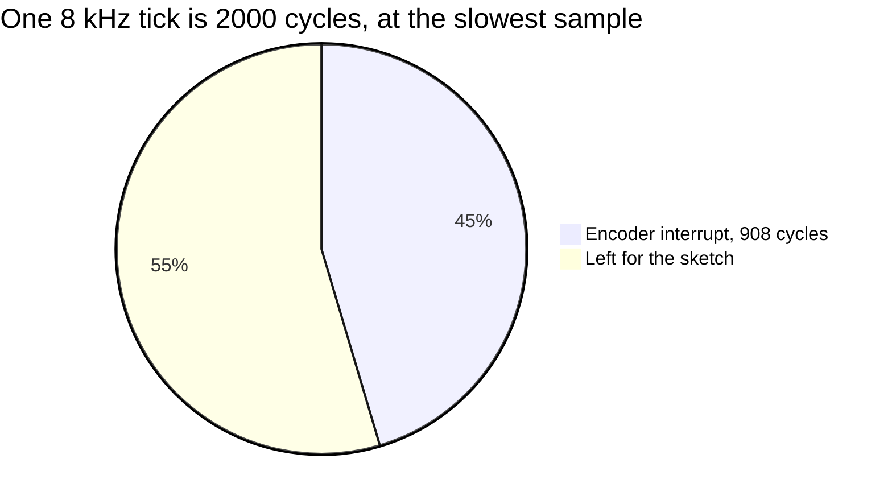

### 8.2 `make arduino_check`

**In plain words.** The Arduino examples are compiled exactly as the Arduino tools would compile them, with every
warning on: `tx_uno` for the Arduino Uno, every `*_esp32` example for the ESP32 (four of them, the KISS TNC included). Any warning from the library or a
sketch fails the check (the cores' own warnings are ignored), and `tx_uno` must not contain any floating-point routine.

```bash
make arduino_check
```

```text
  arduino arduino:avr:uno examples/arduino/tx_uno
Sketch uses 8658 bytes (26%) of program storage space. Maximum is 32256 bytes.
Global variables use 524 bytes (25%) of dynamic memory, leaving 1524 bytes for local variables. Maximum is 2048 bytes.
  arduino esp32:esp32:esp32 examples/arduino/kiss_tnc_esp32
Sketch uses 350448 bytes (26%) of program storage space. Maximum is 1310720 bytes.
Global variables use 48628 bytes (14%) of dynamic memory, leaving 279052 bytes for local variables. Maximum is 327680 bytes.
  arduino esp32:esp32:esp32 examples/arduino/loopback_esp32
Sketch uses 314912 bytes (24%) of program storage space. Maximum is 1310720 bytes.
Global variables use 39580 bytes (12%) of dynamic memory, leaving 288100 bytes for local variables. Maximum is 327680 bytes.
  arduino esp32:esp32:esp32 examples/arduino/rx_esp32
Sketch uses 325488 bytes (24%) of program storage space. Maximum is 1310720 bytes.
Global variables use 44636 bytes (13%) of dynamic memory, leaving 283044 bytes for local variables. Maximum is 327680 bytes.
  arduino esp32:esp32:esp32 examples/arduino/wav_sd_esp32
Sketch uses 346150 bytes (26%) of program storage space. Maximum is 1310720 bytes.
Global variables use 23664 bytes (7%) of dynamic memory, leaving 304016 bytes for local variables. Maximum is 327680 bytes.
arduino_check: tx_uno has no float routine
arduino_check: all examples compile warning-free
```

- **Time here:** 74.5 s for the five sketches (63.5 s for four, before the KISS TNC came).
- **Failure:** a warning in `src/` or `examples/` prints the warning and `arduino_check: FAILED (warning above, full
  log in build/arduino/<sketch>.log)`; a compile error prints the whole log; a floating-point routine in `tx_uno`
  prints its name. Without `arduino-cli` the target stops at once with `arduino-cli not found`.
- **In depth:** for each sketch the target runs `arduino-cli compile --fqbn … --warnings all --library . --build-path
  build/arduino/<sketch>`; the ESP32 core builds with C++ exceptions, and its linker keeps the unwind tables of every
  library object, so the ESP32 sketches that do not use the modem carry 824 bytes of the modem's (spec §11 M12).

---

## 9. Demo, table and documentation checks

### 9.1 `make demo_run`

**In plain words.** The programs are what a user runs first, so they have a contract of their own: seven round trips
in which a text goes through `unlimited_encode`, a simulated radio and `unlimited_decode`, and must come back exactly,
with a receiver told only the speed; and one configuration the sender must refuse, because its signal does not fit the
receiver's filter.

| Run | Radio | Speed | Sender and receiver | SNR | Sent at | Mistuning | What it proves |
|---|---|---|---|---|---|---|---|
| `usb_6` | USB | 6 bytes/s | defaults | 10 dB | 8000 Hz | +80 Hz | the default, found at the mistuned pitch |
| `lsb_12_48k` | LSB | 12 bytes/s | defaults | 13 dB | 48000 Hz | −150 Hz after the mirror | the other sideband; a 48 kHz recording resampled |
| `usb_1_narrow` | USB, 300–2100 Hz | 1 byte/s | `--tone 1200 --passband 300:2100` | 0 dB | 8000 Hz | +40 Hz | another pitch in a 1.8 kHz filter, below 0 dB |
| `usb_3_vox` | USB | 3 bytes/s | `--vox-lead-ms 150` | 6 dB | 8000 Hz | −35 Hz | the VOX lead and its gap |
| `usb_6_fixed` | USB | 6 bytes/s | receiver `--threshold 70` | 8 dB | 22050 Hz | +25 Hz | the fixed 70 % decision line |
| `am_12` | AM | 12 bytes/s | `--passband 100:3000` | 12 dB (carrier) | 8000 Hz | +60 Hz | an AM radio |
| `fm_25` | FM | 25 bytes/s | `--passband 300:3000` | 22 dB (carrier) | 8000 Hz | +60 Hz | an FM radio at the fastest speed |
| refused | – | 25 bytes/s | `--passband 1250:1750` | – | – | – | 1100 Hz of signal in a 500 Hz filter must exit 2 and say "does not fit" |

```bash
make demo_run
```

```text
== usb_6: usb channel, 6 bytes/s, SNR 10 dB, offset 80 Hz, TX rate 8000 Hz
speed      6.00 bytes/s = 48 bit/s, slot T 16.667 ms  (the receiver needs --bps 6.00)
…
channel    usb, SNR 10.0 dB key-down (5.3 dB average power), offset +80 Hz, receiver filter 300-2700 Hz; output gain -2.5 dB
speed      6.00 bytes/s = 48 bit/s, slot T 16.667 ms  (the sender must use --bps 6.00)
receiver   passband 300-2700 Hz, pitch search 432-2568 Hz, adaptive decision line (auto: 50-75 % of the reference), impulse blanker on
input      build/demo_run/usb_6.wav: 8000 Hz
locked     t 0.462 s: pitch 1579.2 Hz, T 16.67 ms, SNR 11.7 dB
bandwidth  occupied bandwidth 264 Hz (1447-1711 Hz); passband 300-2700 Hz: fits; shift tolerance -1147/+989 Hz
rx         34 bytes, end at t 6.128 s (pitch 1580.0 Hz, T 16.67 ms, SNR 10.2 dB)
text       "CQ CQ DE UNLIMITED TEST 0123456789"
expect     34 bytes x 1 transmission: received 34, lost 0, wrong 0, extra 0, bit errors 0/272 (BER 0.00e+00), locks 1, dropped 0, SNR 10.4 dB, T 16.67 ms
result     match
== lsb_12_48k: lsb channel, 12 bytes/s, SNR 13 dB, offset -150 Hz, TX rate 48000 Hz
…
== refused: --bps 25 --passband 1250:1750 (1100 Hz of signal in a 500 Hz passband) must fail with exit code 2
unlimited_encode: occupied bandwidth 1100 Hz (950-2050 Hz); passband 1250-1750 Hz: does not fit (300 Hz below and 300 Hz above the passband)
unlimited_encode: refused: the signal does not fit the receiver's passband: at 25.00 bytes/s it is 1100 Hz wide (950-2050 Hz around the pitch 1500 Hz) and the passband is 1250-1750 Hz, only 500 Hz wide; use a slower speed (--bps) or a wider --passband (see --help)
demo_run: all round trips decoded exactly; the configuration that does not fit was refused
```

1.6 s here, once the programs were built. `expect` compares with `build/demo_run/expect.txt`; `result match` is the
verdict (a mismatch prints `result mismatch`, the decoder exits 1 and the target fails). The WAV files stay in
`build/demo_run/` (`*.wav` as received, `*_clean.wav` as sent): listen to them, or watch one decode with
`./bin/unlimited_decode --in build/demo_run/usb_6.wav --tui --realtime`.

### 9.2 `make tables`

The encoder makes its beeps from a table of 257 sine values (a quarter of a wave, in 16-bit fixed point), so that an
Arduino needs no floating point. `tools/gen_tables.cpp` computes the table; this check proves that
`src/unlimited/tables.cpp` holds exactly what the generator prints:

```text
tables: src/unlimited/tables.cpp is up to date
```

0.3 s here. On a difference it prints a `diff -u` of the table and fails.

### 9.3 `make docs`

**In plain words.** The pictures of the README and of this guide are not drawn by hand: `tools/doc_figures.cpp` draws
them from the real encoder, channel simulator and decoder, and `tools/doc_examples.cpp` prints the bit-exact protocol
examples (`docs/protocol_examples.md`). `make docs` runs both. It is also a check: the tools stop with an error when
the library disagrees with an example written in `spec.md`, and the output is **deterministic**, the same bytes every
run, so a figure that changes always means behaviour that changed.

```bash
make docs
```

```text
./build/tools/doc_examples > build/docs/protocol_examples.md
./build/tools/doc_figures build/docs/images
beep.svg: 1, 0, two 1s and STOP/START at 6 bytes/s, 48000 Hz
byte_window.svg: 0x48 at 6 bytes/s, 48000 Hz
hi_transmission.svg: "Hi" at 6 bytes/s, with and without a VOX lead
receiver_windows.svg: "Hi!~" at 6 bytes/s, 20 dB and 1.3 dB
speeds_spectrum.svg: 5 speeds, 64 bytes each
channels.svg: 10 channel cases
spectrogram.svg: 18 bytes at 6 bytes/s, 10 dB
ber_awgn.svg: 560 transmissions
docs: docs/images/*.svg and docs/protocol_examples.md regenerated
```

- **Time here:** 4.4 s; the BER figure runs its transmissions on every core.
- **Where things go:** both tools write into `build/docs/` first; only when both succeed are `docs/images/*.svg`
  (stale figures removed) and `docs/protocol_examples.md` replaced. `docs/modem.md` and this guide are written by hand
  and never touched.

**Checking determinism.** Save the checksums, regenerate, compare:

```bash
shasum -a 256 docs/images/*.svg docs/protocol_examples.md > build/docs.sha256
make docs
shasum -a 256 docs/images/*.svg docs/protocol_examples.md | diff build/docs.sha256 - && echo "docs: identical bytes"
```

```text
docs: identical bytes
```

For this guide `make docs` ran twice with identical checksums. The same day a figure was fixed:
`speeds_spectrum.svg` drew its 12 and 25 bytes/s bars and labels below the bottom of its 520-pixel canvas; its canvas
now ends a margin below the last bar (566 pixels), and every text of the eight figures lies inside its canvas, without
overlaps, as measured in a headless browser (spec §9). The noise behind the figures follows the standard library
([§6.8](#68-seeds-determinism-and-parallelism)), so compare runs of the same machine.

---

## 10. Continuous integration

**In plain words.** GitHub Actions builds and tests every push and pull request on two machines: Ubuntu with GCC and
ALSA, and macOS with Clang and CoreAudio. CI proves that the code builds and that the tests pass on both; the runners
have no sound cards and the tests never play or record, so only radios prove the audio path (spec V13).

`.github/workflows/ci.yml`, a matrix with `fail-fast: false` (one machine failing does not stop the other):

| Step | Ubuntu (`ubuntu-latest`, `CXX=g++`) | macOS (`macos-latest`, `CXX=clang++`) |
|---|---|---|
| Install | `sudo apt-get install -y libasound2-dev` | – |
| Compiler | `$CXX --version` | the same |
| Build | `make -j4` | the same |
| Unit tests | `make -j4 test` | the same |
| Demo round trips | `make demo_run` | the same |
| Embedded check | `make check_embedded` (the cross compilers are absent there, so those builds are skipped) | the same |

Not in CI: `make test_long` (1 min 38 s on 10 cores; run it before and after a change to the receiver or the signal),
`make arduino_check` (needs `arduino-cli` and its cores), `make docs` (its determinism is checked by hand) and the
smoke test (needs the virtual device).

### 10.1 When only the Linux runner fails

**In plain words.** The two runners compile the same code with two different compilers, and each has warnings the
other lacks. `-Werror` makes every warning a failed build, so a change that is green on a Mac can still fail on
Ubuntu. Read the failing step first (`gh run view <run> --log-failed`): it names the file, the line and the warning.

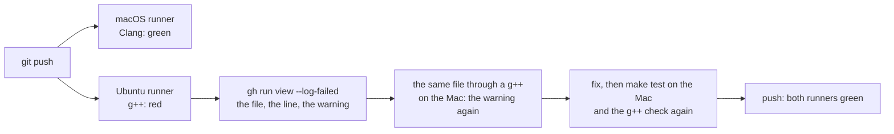

**The v1.0.0 case.** The first run with the modem and the live programs built every program on Ubuntu (g++ 13.3 and
ALSA), then stopped while compiling `tests/test_resampling_source.cpp`. That test counts allocations with its own
`operator new` (a `malloc`) and `operator delete` (a `free`). g++ copied the `operator delete` into `std::vector`'s
destructor, saw memory from `operator new` handed to `free`, and reported `-Wmismatched-new-delete`: a false alarm,
but an error under `-Werror`. Clang has no such check, so the Mac never showed it. The fix keeps both functions out of
line (`[[gnu::noinline]]`), so g++ always sees `operator new` paired with `operator delete`; and the counter's own
check now calls `::operator new` directly, because Clang, no longer seeing the counter inside, dropped the unused
`std::vector` the check had allocated (spec §12.8).

**A g++ on a Mac, without installing one.** The ESP32 core that `make arduino_check` uses brings GCC 14
(`xtensa-esp32-elf-g++`). It can compile the test files as a stand-in for Ubuntu's g++, for its warnings only (it
cannot link or run them):

```bash
G=$(ls ~/Library/Arduino15/packages/esp32/tools/esp-x32/*/bin/xtensa-esp32-elf-g++ | tail -1)
for f in tests/*.cpp; do echo "== $f"; $G -O2 -std=c++11 -Wall -Wextra -Wpedantic -Isrc -Ipc -Itests -c $f -o /dev/null 2>&1 | grep -E 'warning:|error:' | sort -u; done
```

Before the fix, for that file, it printed the line CI had failed on (without `-Werror`, as a warning):

```text
== tests/test_resampling_source.cpp
tests/test_resampling_source.cpp:35:14: warning: 'void free(void*)' called on pointer returned from a mismatched allocation function [-Wmismatched-new-delete]
```

After the fix, nothing for that file.

| It shows | Meaning |
|---|---|
| a warning Clang never gives (`-Wmismatched-new-delete`, `-Wmaybe-uninitialized`, `-Warray-bounds`, …) | very likely real: Ubuntu's g++ 13 gives it too unless it inlines differently; fix it |
| `format '%u' expects argument of type 'unsigned int', but … 'long unsigned int'` | not real: on the ESP32 `uint32_t` is `unsigned long`; on Linux and macOS it is `unsigned int` |
| `fatal error: poll.h: No such file or directory` (`test_kiss_port.cpp`, `test_ptt.cpp`) | the ESP32's C library has no pseudo-terminals; small stand-in headers passed with `-isystem` (declarations only) let those two files compile too |

Not covered by the stand-in, so checked by reading: Ubuntu's glibc marks results that must be used (`read`, `write`,
`pipe`, …; a `(void)` cast does not silence g++), and its `int64_t` is `long` where macOS's is `long long` (print
64-bit values as `long long` with `%lld`, as the tests do).

---

## 11. For experts: extending, reproducing, comparing

### 11.1 Adding a unit test

Add a `TEST` to the `tests/test_*.cpp` file of the part it checks: the Makefile picks up every `tests/*.cpp`, and the
file's prefix in the name lets `FILTER` find it. The project's rules apply to tests as well: C++11, `snake_case`,
named constants instead of magic numbers, fixed seeds. This test was compiled outside the repository against the
project's build (`-Werror`) and run:

```cpp
#include "support/loopback.hpp"
#include "test_harness.hpp"

#include <cstdint>
#include <vector>

using namespace unlimited;
using namespace unlimited::loopback;

namespace {

const std::size_t k_example_bytes = 40;
const std::uint32_t k_example_seed = 7;
const float k_example_speed = 6.0f;
const double k_example_snr_db = 10.0;
const double k_example_offset_hz = 80.0;
const std::size_t k_example_chunk = 4096;

}  // namespace

// 40 random bytes at 6 bytes/s through USB noise at 10 dB, mistuned by +80 Hz: every byte back, nothing extra.
TEST(decoder_example_usb_10_db) {
    const EncoderConfig config = speed_config(k_example_speed);
    const std::vector<std::uint8_t> data = random_bytes(k_example_bytes, k_example_seed);
    Recording recording = single(data, config);
    recording.samples = usb(recording.samples, k_example_snr_db, k_example_seed, config.amplitude, k_example_offset_hz);
    const Capture capture = run_decoder(recording.samples, receiver_for(config), k_example_chunk);
    const Score s = score(recording, capture, channel_delay_samples());
    NOTE("released %zu of %zu bytes, %zu bit errors, %zu extra, %zu lock(s)", s.bytes_released, s.bytes_sent,
         s.bit_errors, s.extra_bytes, s.locks);
    CHECK_EQ(s.matched, k_example_bytes);
    CHECK_EQ(s.wrong_bytes, 0u);
    CHECK_EQ(s.extra_bytes, 0u);
    CHECK_EQ(s.locks, 1u);
    CHECK_EQ(s.ends, 1u);
}
```

```text
[ RUN  ] decoder_example_usb_10_db
    note: released 40 of 40 bytes, 0 bit errors, 0 extra, 1 lock(s)
[ PASS ] decoder_example_usb_10_db (49 ms)
```

(Built alone with `tests/test_main.cpp`, `build/tests/support/loopback.o`, `build/pc/channel.o`,
`build/pc/resampler.o` and `build/libunlimited.a`.) Spec-driven development applies (spec §0.5 D1, D3): the new test
and its pass criterion go into spec §8 first, and a test that guards a fix must fail before it and pass after it.

### 11.2 Adding a long-suite row

A row is one or more `JobPlan`s (built by `add_jobs()` from a shape, a sender configuration, a transmission count and
a test id), run by `run_points()` on every core, scored into `Outcome`s, and printed by `result()`; `ledger()` hands
its extra and shifted bytes to the Integrity rows. To make it part of the suite:

- Put the function in the `tests/long/regression_*.cpp` file of its family, declare it in `regression.hpp`, and
  register its `TEST` in `regression_suite.cpp`; the registration order is the run order, and a test whose rows feed
  Integrity must come before it.
- Give it a test id no other test uses ([§6.8](#68-seeds-determinism-and-parallelism)) and append new rows at the end
  of an existing list: the other rows keep their seeds, so a before-and-after comparison still lines up.
- The row, its gate and its reason go into spec §4 and §8 first; a gate is Gustavo's decision (spec §0.3).

### 11.3 Reproducing a row from its seed

1. **Run the test again** with `FILTER` ([§6.3](#63-running-one-test-filter)): on the same machine the row comes back
   identical.
2. **Find the job.** The row's seeds are `seed_of(test id, point, job)` for each of its jobs; the test's source file
   builds the `JobPlan` of each job.
3. **Rebuild its audio** exactly as `run_job()` hears it, and write it to a WAV file. This probe, built against the
   suite's helpers and `pc/wav`, rebuilds job 0 of the A1 row at 6 bytes/s at the gate (one of the two known FAIL
   rows):

```cpp
// Rebuilds the audio of one long-suite job from its seed, exactly as run_job() hears it, and writes it to a WAV file
// that unlimited_decode (or --tui --realtime) can replay. Here: A1 at 6 bytes/s at the gate SNR, job 0.
#include "regression.hpp"
#include "wav.hpp"

#include <algorithm>
#include <cstdio>
#include <random>
#include <string>
#include <vector>

using namespace unlimited;
namespace rg = unlimited::regression;

namespace {

const std::uint32_t k_test_a1 = 10;    // regression_awgn.cpp: A1's test id
const float k_speed = 6.0f;
const std::size_t k_speed_index = 2;   // 1, 3, 6, 12, 25 bytes/s
const std::size_t k_offsets = 3;       // the gate, gate + 3, gate + 4.5 dB
const std::size_t k_point = k_speed_index * k_offsets + 0;  // 6 bytes/s at the gate
const std::size_t k_job = 0;
const std::size_t k_bytes = 32;
const double k_bits = 50000.0;
const double k_mistune_hz = 50.0;
const double k_leading_slots = 15.0;   // run_job(): a whole silent window before the first START, and a margin
const double k_int16_scale = 32768.0;

}  // namespace

int main(int argc, char** argv) {
    if (argc != 2) {
        std::fprintf(stderr, "usage: probe_job OUT.wav\n");
        return 2;
    }
    const EncoderConfig config = rg::speed_config(k_speed);
    rg::JobPlan shape;
    shape.channel = rg::usb_channel(rg::gate_db(k_speed));
    std::vector<rg::JobPlan> jobs;
    std::vector<std::size_t> points;
    rg::add_jobs(jobs, points, k_point, shape, config, rg::transmissions_for(k_bits, k_bytes), k_bytes, k_test_a1);
    rg::JobPlan job = jobs[k_job];
    std::mt19937 generator(job.channel.seed);  // test_a1_awgn(): one mistuning per job, from its seed
    job.channel.freq_offset_hz = std::uniform_real_distribution<double>(-k_mistune_hz, k_mistune_hz)(generator);

    loopback::Recording recording;  // the recording as run_job() builds it
    loopback::append_silence(recording, std::max(job.lead_ms, k_leading_slots * rg::slot_ms_of(config)));
    for (std::size_t t = 0; t < job.transmissions.size(); ++t) {
        loopback::append_transmission(recording, job.transmissions[t].data, job.transmissions[t].config);
        loopback::append_silence(recording, t + 1 < job.transmissions.size() ? job.gap_ms : job.tail_ms);
    }
    const std::vector<std::int16_t> received =
        rg::apply_channel(recording.samples, job.channel, config.amplitude, job.peak_factor);

    std::vector<float> audio(received.size());
    for (std::size_t i = 0; i < received.size(); ++i) audio[i] = static_cast<float>(received[i] / k_int16_scale);
    std::string error;
    if (!wav::write_wav(argv[1], audio, config.sample_rate_hz, error)) {
        std::fprintf(stderr, "probe_job: %s\n", error.c_str());
        return 1;
    }
    std::printf("probe_job: seed %u, %zu transmissions of %zu bytes, mistuned %+.1f Hz, SNR %.1f dB, %.1f s -> %s\n",
                job.channel.seed, job.transmissions.size(), k_bytes, job.channel.freq_offset_hz, job.channel.snr_db,
                static_cast<double>(received.size()) / config.sample_rate_hz, argv[1]);
    return 0;
}
```

Saved as `build/probe_job.cpp` (inside the git-ignored `build/`), it compiles against the objects `make test_long`
builds and runs from the repository's root folder:

```bash
c++ -std=c++11 -O2 -Wall -Wextra -Wpedantic -Werror -Isrc -Ipc -Itests -Itests/long build/probe_job.cpp build/tests/long/regression_support.o build/tests/support/loopback.o build/pc/channel.o build/pc/resampler.o build/pc/wav.o build/libunlimited.a -o build/probe_job
./build/probe_job build/a1_6_gate_job0.wav
```

```text
probe_job: seed 10060073, 25 transmissions of 32 bytes, mistuned +37.6 Hz, SNR 1.3 dB, 174.8 s -> build/a1_6_gate_job0.wav
```

4. **Replay it** with the decoder, which prints every lock, byte count and end (add `--tui --realtime` in a terminal
   to watch the windows against their reference and decision lines):

```bash
./bin/unlimited_decode --in build/a1_6_gate_job0.wav
```

```text
…
locked     t 1.962 s: pitch 1538.8 Hz, T 16.67 ms, SNR 0.7 dB
bandwidth  occupied bandwidth 264 Hz (1407-1671 Hz); passband 300-2700 Hz: fits; shift tolerance -1107/+1029 Hz
rx         32 bytes, end at t 7.294 s (pitch 1537.8 Hz, T 16.67 ms, SNR 2.4 dB)
…
```

The seed 10060073 is 10 × 1,000,003 + 6 × 10,007 + 0 + 1. This job locked all 25 of its transmissions; the 5
transmissions the row misses are in its other jobs (job 1, 2, … : change `k_job`).

### 11.4 Before and after a change

**In plain words.** A change to the receiver or the signal is done only when its effect is measured: the same rows
before and after, compared line by line. Because the suite is deterministic, an unchanged row means unchanged
behaviour for that condition, and a changed row is something to explain (spec §9 does it row by row for V20 and
V22–V24).

```bash
make test_long > build/before.log 2>&1
```

Then change the code, and:

```bash
make test_long > build/after.log 2>&1
sed -n '/^==== long regression summary/,$p' build/before.log | grep '^RESULT' > build/before.rows
sed -n '/^==== long regression summary/,$p' build/after.log | grep '^RESULT' > build/after.rows
diff build/before.rows build/after.rows && echo "no row changed"
```

A gated row may not regress; a REPORT row that changes is explained in `spec.md` with its reason.

---

## 12. Troubleshooting

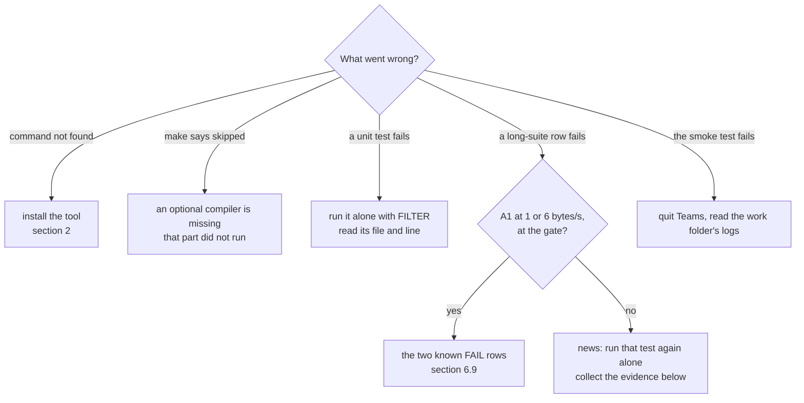

| Symptom | What it means | What to do |
|---|---|---|
| `c++: command not found`, `make: command not found` | no compiler tools | [§2.3](#23-installing) |
| `alsa/asoundlib.h: No such file or directory` (Linux) | the ALSA headers are missing | `sudo apt-get install libasound2-dev` |
| `check_embedded: … not found, skipped` | an optional cross compiler is missing: that build (for AVR, also the interrupt gate) did not run, yet the target passes | install `arduino-cli` and its cores (AVR, ESP32), or put the compiler on the `PATH` (ARM) |
| `arduino-cli not found`, then a make error | `make arduino_check` needs `arduino-cli` | install it, or leave this target out |
| `no test matches the filter` | no test name contains the word | list the names: `grep -h '^TEST(' tests/*.cpp` |
| `make test_long` ends with `FAILED: A1_A2_awgn_per_speed` | the two known FAIL rows | check that nothing else failed ([§6.9](#69-the-two-known-fail-rows)) |
| any other long-suite FAIL | a regression, or a new limit reached | run its test alone to see that it repeats; collect the evidence below |
| `Integrity` prints nothing to add up | it ran without the tests that fill its ledger | run it with them, or the whole suite |
| the long-suite numbers differ from spec §4 on Linux | another standard library draws other noise ([§6.8](#68-seeds-determinism-and-parallelism)) | expected; the gates must still hold |
| `make docs` changed a figure | the behaviour changed, or the machine's standard library differs | `git status --short docs/`; explain the change in `spec.md` |
| `smoke: FAIL: the Microsoft Teams app is running: quit it first` | the app holds the virtual device | quit Teams, run again |
| `smoke: FAIL: … did not hand over …` | a frame did not arrive byte for byte within 120 s | read `a.log` and `b.log` in the work folder the script names |
| a sanitizer report | a memory error, undefined behaviour or a data race | the report stops the program with a stack trace; fix the first one first |
| the long suite is too slow | it uses every core for about 1 min 40 s on a 10-core M4 | use `FILTER` for the family you work on; run the whole suite before and after |

**What to collect for a failing row.** The row itself (the whole line), the full log, the exact code and machine:
`git rev-parse HEAD`, `git status --short`, `c++ --version`, `uname -sm`, and the number of cores (`sysctl -n hw.ncpu`
on macOS, `nproc` on Linux). With the row's test name its seeds are known ([§6.8](#68-seeds-determinism-and-parallelism)),
and [§11.3](#113-reproducing-a-row-from-its-seed) turns any of its jobs into a WAV file to replay.

---

## 13. Words used in this guide

| Word | Meaning |
|---|---|
| **AWGN** | additive white Gaussian noise: plain hiss, the reference channel |
| **BER, BER95** | bit error rate of the released bits; its upper 95 % confidence bound |
| **Channel simulator** | `sim::Channel` in `pc/`: the radio path in software (noise, fading, mistuning, interference, AM, FM, AGC, clock error) |
| **CHECK, REQUIRE, NOTE** | the harness's checks: a failed CHECK is recorded and the test goes on; a failed REQUIRE ends it; NOTE prints a measured value |
| **CNR** | carrier-to-noise ratio in a receiver's IF bandwidth (6 kHz AM, 12.5 kHz FM) |
| **Cycle model** | `tests/avr/isr_cycles.cpp`: an ATmega328P interpreter that counts the cycles of the encoder's interrupt |
| **Delivered, lost, wrong, extra, shifted, framing** | the counts of [§1](#1-the-idea-in-one-picture) |
| **Deterministic** | the same inputs give the same bytes out: the same rows, the same figures |
| **Exit status** | the number a program returns: 0 for success ([§3.3](#33-success-and-failure-in-one-place)) |
| **FILTER** | the words that choose which tests run: a test runs when its name contains one of them |
| **Gate, gate + 3** | the limit the spec sets for a row; for SNR, the promised SNR of a speed, and 3 dB above it |
| **Harness** | `tests/test_harness.hpp`: the test framework of both suites |
| **Heap trap** | `tests/embedded/heap_trap.cpp`, `modem_trap.cpp`: runs with `new` and `delete` that abort the program |
| **ISR** | interrupt service routine: the function the timer runs 8000 times a second on the Uno |
| **Job** | one recording of a row: transmissions with quiet between them, one channel, the row's receivers |
| **Key-down** | a steady beep at full crest; the SNR convention uses its power |
| **Ledger** | what the A, S, L and C tests record for the Integrity rows |
| **Loopback** | encode, pass through a channel (or none), decode, compare: `tests/support/loopback.*`; for the modem, two cores joined in memory (`ModemLink`, `--loopback`) |
| **PASS, FAIL, REPORT** | the verdict of a row: the gate holds; it does not; there is no gate |
| **Point** | a row's condition as the code builds it; its index in its test's list is part of its seed |
| **Row** | one `RESULT` line: one measured condition |
| **Sanitizer** | a compiler option that builds memory, undefined-behaviour or data-race checks into the program |
| **Seed** | the number a random generator starts from: the same seed, the same draw |
| **Smoke test** | `tools/modem_smoke_teams.sh`: two modem programs through a real (virtual) sound device |
| **SNR** | the key-down tone's power over the noise in 2500 Hz |
| **Stray byte** | a byte released from something that was not a transmission (speech, Morse, noise) |

For the radio and modem words (slot, window, START, STOP, pitch, passband, DCD, fade bridge, QSB, CCIR, …) see the
[README glossary](../README.md#13-glossary) and spec §14.
