# Testing Unlimited

> **Being rewritten for v1.0.** The targets are the same (`make test`, `make test_long`, `make check_embedded`, `make arduino_check`, `make demo_run`, `make docs`); the tests and rows they run are listed in `spec.md` §8, and this guide still describes v0.3's.

**How to run every test and check of Unlimited, and how to read what they print.**

Unlimited is a modem: it turns bytes into short beeps on one pitch that any radio can carry, and turns the beeps back
into bytes. Its tests prove that it works, in software and in numbers: they make the signal, spoil it the way a radio
path would, let the receiver decode it without telling it anything, and count every bit that came back wrong, every
byte that went missing and every byte that should not be there at all.

**How to read this guide**

- Every section starts **in plain words**: what you will see and why it matters. Nothing is left out there, it is only
  said simply. **In depth** follows, for contributors and for experts in the field: the exact commands and flags, what
  each gate measures and why, the statistics, the seeds, the files and functions, and the rules of
  [`spec.md`](../spec.md) behind them (spec §8 is the test plan). Where this guide and `spec.md` differ, `spec.md`
  wins.
- Commands stand in boxes of their own, one per box, to paste in the repository's root folder. What they print follows
  in a separate box; `…` marks what was left out.
- Every command was run for this guide on the machine of [§2.4](#24-the-machine-used-for-this-guide), on v0.3 (commit
  `c235153`), except the full `make test_long` (about 9 minutes of every core): its output comes from the log of the
  freeze run of 2026-09-27 (spec §9.5). After the fast cold late join (spec §0.7 I29–I34) the counts and totals were
  brought up to date from new runs: `make test` 223 of 223, and the long suite's totals in [§6.2](#62-running-the-whole-suite).
  Every number is measured here or quoted with its source.
- Words are explained where they first appear and again in [§11](#11-words-used-in-this-guide); radio words are in the
  [README glossary](../README.md#14-glossary).

> **Status (2026-09-27, v0.3 with the fast cold late join).** On the machine of §2.4, `make test` (223 of 223),
> `make check_embedded`, `make arduino_check`, `make demo_run`, `make tables`, `make docs` and the sanitizer run pass.
> In the latest long-suite run every test passed except one, as expected: **L20**, how quickly a receiver joins a
> transmission that is already running. 20 of its 24 joining rows now pass; the 4 rows with 32 ms slots and 24 or 32
> bits per package still miss the 6-package gate, for a structural reason (spec §0.8 G4, §11.2 P2;
> [§6.11](#611-l20-the-known-open-item)). Any other FAIL is news.

## Contents

1. [The idea in one picture](#1-the-idea-in-one-picture)
2. [Before you start](#2-before-you-start)
3. [The map: every target at a glance](#3-the-map-every-target-at-a-glance)
4. [Building the library and the demos](#4-building-the-library-and-the-demos)
5. [Unit tests: `make test`](#5-unit-tests-make-test)
6. [The long regression suite: `make test_long`](#6-the-long-regression-suite-make-test_long)
7. [Embedded checks: `make check_embedded`, `make arduino_check`](#7-embedded-checks-make-check_embedded-make-arduino_check)
8. [Demo, table and documentation checks](#8-demo-table-and-documentation-checks)
9. [For experts: extending, reproducing, comparing](#9-for-experts-extending-reproducing-comparing)
10. [Troubleshooting](#10-troubleshooting)
11. [Words used in this guide](#11-words-used-in-this-guide)

---

## 1. The idea in one picture

**In plain words.** On the air you would test a modem like this: send some bytes you know, receive them on another
radio, and compare. The tests do exactly that, in software, where nothing is left to chance:

1. **Make the signal.** Known bytes (random, but drawn from a fixed **seed**, a number that fixes the random draw) go
   into the encoder, which turns them into audio: beeps on one pitch.
2. **Spoil it on purpose.** A **channel simulator** plays the radio path: noise, a mistuned receiver, the other
   sideband, fading on HF, static crashes, a carrier or Morse next to the signal, a receiver's automatic gain control
   (AGC), AM and FM radios, a sound card whose clock runs fast or slow.
3. **Decode it blind.** The decoder is told only its receiver **profile** (its audio filter and range of speeds), never
   the pitch, the speed or the bits per package: exactly as in real life.
4. **Compare.** Every byte the decoder releases is put next to the byte that was sent at the same position, and the
   differences are counted.

Because the "radio" is a program with fixed seeds, a test prints the same numbers every time it runs on the same
machine. A number that changes means that the code changed.

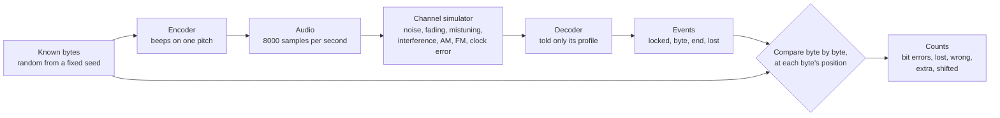


*What one test transmission looks like: "Hi" with the default `hf` preset, drawn by `make docs` from the real encoder's
audio. A tune tone, the sync train of markers, two packages of 8 bits, the END markers and the tail: 44 slots and
100 ms, 804 ms in all. The tests send the same structure with more bytes, often hundreds of transmissions in a row.*


*The same "Hi" through six simulated channels, each decoded by the real decoder told only its profile. In the
`make docs` run for this guide, clean, USB tuned +150 Hz, LSB tuned −150 Hz and NBFM decoded exactly in 20 of 20 runs
with other noise seeds, AM in 19 of 20, and CCIR poor fading in 11 of 20. The run drawn for CCIR poor released
nothing: a missing message, not a wrong one.*

**In depth.** The chain, in the code the tests share (`tests/support/loopback.hpp` and `.cpp`, `pc/channel.hpp`):

| Step | Function | What it does |
|---|---|---|
| Known bytes | `loopback::random_bytes(count, seed)` | bytes from `std::mt19937(seed)` |
| Encode | `loopback::encode(data, config)`, `loopback::single(data, config)` | renders a whole transmission with `Encoder::write()`, `start()` and `render()`, as int16 samples at the configuration's rate (8000 Hz in the tests); `single()` puts silence around it and records where it starts |
| Channel | `sim::Channel` (`pc/channel.hpp`), `loopback::usb(samples, snr_db, seed, amplitude, offset_hz)`, `loopback::through_channel()` | the radio path; `usb()` is the common case: USB with white noise at an SNR, mistuned by an offset |
| Decode | `loopback::run_decoder(samples, decoder_config, chunk)` | feeds `Decoder::process()` and records every event with the number of samples consumed when it came |
| Score | `loopback::score(recording, capture)`, `loopback::map_events()` | places every byte event by its `byte_index` (spec §3.13) next to the byte that was sent there, and counts |

The counts, as spec §8 defines them ("Conventions"):

| Count | What it counts | Why it matters |
|---|---|---|
| **BER** | bit errors in the released bytes ÷ the released bits (released bits only) | noise damage; it falls steeply as the SNR rises |
| **lost** (loss) | sent bytes that were never released | a missing byte: the application knows it is missing |
| **wrong** | released bytes that differ from the byte sent at that position | noise damage, at byte level |
| **extra** | released bytes the sender never sent (no sent byte at that `byte_index`, or a second copy) | invented data: always a defect |
| **shifted** | bytes of a lock that sit at wrong `byte_index` values: they match the sent data far better at another offset | misplaced data: always a defect |
| **delivered** | released bytes that land on a sent byte ÷ sent bytes | how much of the message arrived |

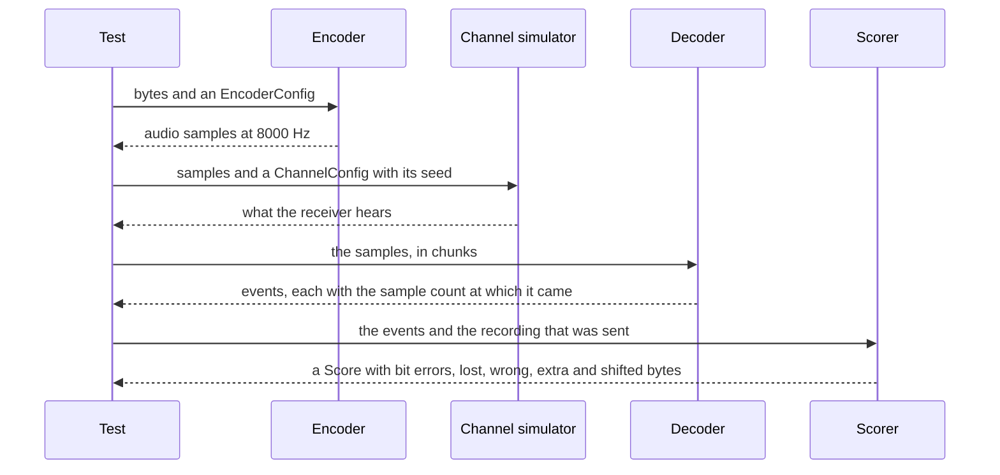

Two suites run this chain: the **unit suite** (`make test`, [§5](#5-unit-tests-make-test)) on short, exact cases,
and the **long regression suite** (`make test_long`, [§6](#6-the-long-regression-suite-make-test_long)) on hours of
simulated audio, where it measures error rates against the gates of the spec.

---

## 2. Before you start

### 2.1 What you need

**In plain words.** A C++ compiler and `make` are all you need for the library, the demos, the unit tests, the long
suite and the documentation figures: the project uses nothing but the C++ standard library. Two checks reach into
microcontrollers: they use extra compilers when they find them, and say so when they don't.

| Tool | Needed for | Without it |
|---|---|---|
| A C++11 compiler: clang or GCC | everything | nothing builds |
| GNU `make` | everything | nothing builds |
| `nm` (comes with the compiler tools) | `make check_embedded`: the symbol scan | the scan cannot run |
| `avr-g++`, `avr-objdump`, `avr-objcopy`, `avr-nm` | `make check_embedded`: the ATmega328P build and the AVR interrupt cycle gate; `make arduino_check`: the floating-point scan of `tx_uno` | `check_embedded: avr-g++ not found, skipped`, and **the interrupt gate does not run**; `arduino_check: avr-nm not found, float check of tx_uno skipped` |
| `xtensa-esp32-elf-g++` | `make check_embedded`: the ESP32 build | `check_embedded: xtensa-esp32-elf-g++ not found, skipped` |
| `arm-none-eabi-g++` | `make check_embedded`: the Cortex-M4 (STM32-class) build | `check_embedded: arm-none-eabi-g++ not found, skipped`; it was not installed for this guide nor for the release (spec §8.6 B1, §11.2 P5) |
| `arduino-cli` with the cores `arduino:avr` and `esp32:esp32` | `make arduino_check` | `arduino-cli not found`, and the target fails |
| `shasum` (macOS) or `sha256sum` (Linux) | the optional determinism check of `make docs` | – |

Where the Makefile looks for the cross compilers: first on your `PATH`; then, for AVR and ESP32 only, inside the
packages that `arduino-cli` installs (`~/Library/Arduino15` on macOS, `~/.arduino15` on Linux:
`packages/arduino/tools/avr-gcc/*/bin/` and `packages/esp32/tools/esp-x32/*/bin/`). Installing `arduino-cli` and its
two cores therefore also gives `check_embedded` its AVR and ESP32 compilers. The ARM compiler is looked for on the
`PATH` only.

### 2.2 Checking your tools

```bash
c++ --version
```

```text
Apple clang version 21.0.0 (clang-2100.1.1.101)
Target: arm64-apple-darwin25.5.0
Thread model: posix
InstalledDir: /Library/Developer/CommandLineTools/usr/bin
```

```bash
make --version
```

```text
GNU Make 3.81
…
```

The cross compilers on your `PATH` (it prints the path of each one found, nothing for the others):

```bash
command -v avr-g++ xtensa-esp32-elf-g++ arm-none-eabi-g++
```

On the machine of this guide it printed nothing: the AVR and ESP32 compilers come from the `arduino-cli` packages
(on Linux the folder is `~/.arduino15`):

```bash
ls ~/Library/Arduino15/packages/arduino/tools/avr-gcc ~/Library/Arduino15/packages/esp32/tools/esp-x32
```

```text
…/Library/Arduino15/packages/arduino/tools/avr-gcc:
7.3.0-atmel3.6.1-arduino7

…/Library/Arduino15/packages/esp32/tools/esp-x32:
2511
```

```bash
arduino-cli version
```

```text
arduino-cli  Version: 1.2.2 Commit: Homebrew Date: 2025-04-22T13:49:40Z
```

```bash
arduino-cli core list
```

```text
ID          Installed Latest Name
arduino:avr 1.8.7     1.8.7  Arduino AVR Boards
esp32:esp32 3.3.7     3.3.7  esp32
```

The first lines of `make check_embedded` ([§7.1](#71-make-check_embedded)) also say which cross compilers were found
and which were skipped.

### 2.3 Installing

- **macOS:** the Command Line Tools for Xcode provide clang, GNU `make` 3.81 and `nm`. This prints where they are:

  ```bash
  xcode-select -p
  ```

  ```text
  /Library/Developer/CommandLineTools
  ```

- **Linux:** your distribution's C++ compiler, `make` and binutils (on Debian and Ubuntu the `build-essential` package
  brings all three). Not verified for this guide.
- **The Arduino check (optional):** install [`arduino-cli`](https://arduino.github.io/arduino-cli/), then the cores
  `arduino:avr` (Arduino AVR Boards) and `esp32:esp32` with its `core install` command. The ESP32 core comes from
  Espressif's board index, which `arduino-cli` must know; on the machine of this guide its configuration lists it:

  ```bash
  arduino-cli config dump
  ```

  ```text
  board_manager:
      additional_urls:
          - https://espressif.github.io/arduino-esp32/package_esp32_index.json
  …
  ```

  The installation downloads large toolchains; it was not repeated for this guide.
- **The ARM build (optional):** an `arm-none-eabi-g++` on the `PATH`. Not verified: the ARM build has never run
  (spec §11.2 P5).

### 2.4 The machine used for this guide

| | |
|---|---|
| Computer | Apple M4, 10 cores, 16 GB, macOS 26.5.2 |
| Compiler | Apple clang 21.0.0 (with libc++), GNU Make 3.81 |
| Arduino | arduino-cli 1.2.2; `arduino:avr` 1.8.7 (avr-gcc 7.3.0); `esp32:esp32` 3.3.7 (xtensa-esp-elf-g++ 14.2.0, esp-x32 2511) |
| Not installed | `arm-none-eabi-g++` |
| Load | another job shared the CPU while the times were measured (a load average of about 2 to 5 outside the runs that use every core), so the times are indicative |

---

## 3. The map: every target at a glance

### 3.1 Every target

**In plain words.** Each `make` target answers one question. The build targets make the programs; the check targets
run them and answer yes or no.

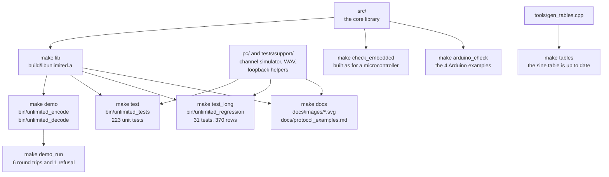

| Target | What it proves | Needs | Time here | Section |
|---|---|---|---|---|
| `make` (= `make all`) | the library and the demos compile, warning-free | compiler, `make` | 4.2 s from a clean checkout | [§4](#4-building-the-library-and-the-demos) |
| `make lib`, `make demo` | the library; the demos | compiler, `make` | part of the above; `make demo` 1.3 s once the library exists | [§4](#4-building-the-library-and-the-demos) |
| `make test` | 223 unit and loopback tests pass | compiler, `make` | 40.0 s the first time (8 s of build), 31.7 s once built | [§5](#5-unit-tests-make-test) |
| `make test FILTER=…` | the chosen unit tests pass | the same | 0.1 s for `FILTER=packet` | [§5.3](#53-running-only-some-tests-filter) |
| `make test_long` | 370 measured rows against the spec's gates | compiler, `make` | 8 min 52 s on 10 cores, 830 % CPU (freeze run, spec §9.5) | [§6](#6-the-long-regression-suite-make-test_long) |
| `make test_long FILTER=…` | the chosen long tests | the same | 9.1 s for `FILTER="L5_clock Z_summary"`, 4 s of it the build | [§6.3](#63-running-one-test-filter) |
| `make check_embedded` | the core as a microcontroller builds it: no heap, exceptions or RTTI; a decode with a trapping heap; other package caps; cross builds; the AVR interrupt gate | compiler; cross compilers optional | 12.8 s | [§7.1](#71-make-check_embedded) |
| `make arduino_check` | the 4 Arduino examples compile warning-free; `tx_uno` has no floating point | `arduino-cli` and the cores | 70.8 s | [§7.2](#72-make-arduino_check) |
| `make demo_run` | the command-line demos round-trip a text exactly; a misfit is refused | compiler, `make` | 1.1 s once the demos exist | [§8.1](#81-make-demo_run) |
| `make tables` | the encoder's sine table is exactly what its generator prints | compiler, `make` | 0.4 s | [§8.2](#82-make-tables) |
| `make docs` | the figures and examples are regenerated from the library, which agrees with the spec's examples | compiler, `make` | 67.4 s (every core) | [§8.3](#83-make-docs) |
| sanitizer run (a `make test` with other flags) | no memory error and no undefined behaviour in the unit suite | clang or GCC | 91 s | [§5.5](#55-under-the-sanitizers) |
| `make clean` | removes `build/` and `bin/` | – | 0.1 s | [§4](#4-building-the-library-and-the-demos) |
| `make help` | prints the list of targets | – | instant | [§4](#4-building-the-library-and-the-demos) |

### 3.2 Which test should I run?

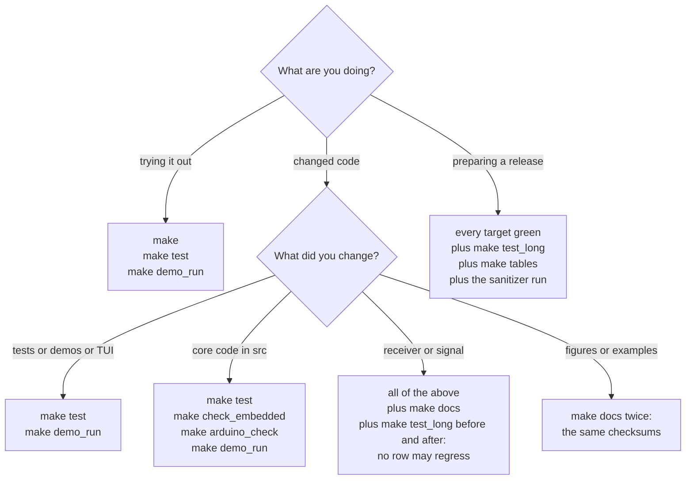

- **Trying it out:** `make`, `make test` and `make demo_run` take less than a minute together here, and show the modem
  decoding through simulated radios.
- **Changing code:** `make test` always. The core in `src/` also runs on microcontrollers, so add `make check_embedded`
  and `make arduino_check`.
- **Anything the receiver or the signal touches:** Gustavo's definition of done (spec §0.9, D3) asks for every target
  green (`make test`, `make check_embedded`, `make arduino_check`, `make demo_run`, `make docs` with deterministic
  output) and for the long suite measured **before and after** the change, with no row regressing
  ([§9.7](#97-before-and-after-a-change)).
- **A release:** all of it, plus `make tables` and the sanitizer run (spec §8.6 B6).

### 3.3 Success and failure in one place

Every target returns exit status 0 when it succeeds. When a command inside a target fails, `make` prints
`make: *** [target] Error N` (N is the failing program's status) and exits with status 2.

| Program | 0 | 1 | 2 | 3 |
|---|---|---|---|---|
| `make`, any target | success | – | a command failed | – |
| `bin/unlimited_tests`, `bin/unlimited_regression` | every test that ran passed | a test failed, or no test matched the filter | – | – |
| `bin/unlimited_encode` | done | – | usage error, or a configuration it refuses | file error |
| `bin/unlimited_decode` | decoded; with `--expect`, an exact match | nothing decoded; with `--expect`, a mismatch | usage error | file error |
| `build/embedded/heap_trap` | `heap_trap: PASSED` | `heap_trap: FAILED`; an allocation aborts the program at once | – | – |
| `build/embedded/isr_cycles` | the interrupt gate passes | it fails | usage error | – |

---

## 4. Building the library and the demos

**In plain words.** `make` compiles the library and the two demo programs. It tests nothing yet, but every file is
compiled with every warning turned into an error, so a clean build is already a first check: one warning fails it.

```bash
make
```

```text
c++ -O2 -std=c++11 -Wall -Wextra -Wpedantic -Werror -MMD -MP -Isrc -Ipc -Itests -c src/unlimited/decoder.cpp -o build/src/unlimited/decoder.o
…
rm -f build/libunlimited.a
ar rcs build/libunlimited.a build/src/unlimited/decoder.o build/src/unlimited/dsp.o …
…
c++ -O2 -std=c++11 -Wall -Wextra -Wpedantic -Werror -MMD -MP build/demo/unlimited_decode.o build/pc/audio.o … build/libunlimited.a -o bin/unlimited_decode
```

- **Success:** no `make: ***` line (exit status 0), and three files: `build/libunlimited.a` (the core library),
  `bin/unlimited_encode` and `bin/unlimited_decode` (the demos). 4.2 s from a clean checkout here.
- **Failure:** the compiler prints `file:line:column: error: …` (a `warning:` counts, `-Werror` makes it an error), and
  `make` stops with `make: *** [build/…/file.o] Error 1`, exit status 2.

**In depth.**

- **Flags.** `CXXFLAGS` defaults to `-O2`; the Makefile always adds
  `-std=c++11 -Wall -Wextra -Wpedantic -Werror -MMD -MP`. `-MMD -MP` write a `.d` file next to each object with the
  headers it used, so editing a header rebuilds exactly what depends on it.
- **Folders.** Everything built goes to `build/` (objects, the library, the tools, the work folders of the Arduino and
  docs checks) and `bin/` (the programs). Git ignores both.
- `make lib` builds only `build/libunlimited.a`; `make demo` only the two demos.
- **Parallel builds.** `-j` compiles several files at once. From a clean checkout this built the unit-test program and
  ran the 219 tests of v0.3.0 in 35.9 s here (the tests themselves run one after another, about 32 s):

```bash
make -j4 test
```

- **Starting over.** `make clean` removes `build/` and `bin/`:

```bash
make clean
```

```text
rm -rf build bin
```

- **The list of targets:**

```bash
make help
```

```text
make [all|lib|demo|test|test_long|check_embedded|arduino_check|demo_run|tables|docs|clean]
```

---

## 5. Unit tests: `make test`

### 5.1 Running them

**In plain words.** 223 small tests, each checking one promise of the code: that the sine table is exact, that the
checksum catches every single-bit error, that WAV files are written and read byte for byte, that the beeps have exactly
the right shape, that the receiver gets every byte back through clean and noisy simulated radios, that the channel
simulator's physics are right, that the terminal view draws what it should. They need nothing but the compiler and take
about half a minute.

```bash
make test
```

```text
c++ -O2 -std=c++11 -Wall -Wextra -Wpedantic -Werror -MMD -MP -Isrc -Ipc -Itests -c tests/test_audio_io.cpp -o build/tests/test_audio_io.o
…
./bin/unlimited_tests 
[ RUN  ] audio_io_encoder_source_returns_duration_then_zero
[ PASS ] audio_io_encoder_source_returns_duration_then_zero (9 ms)
…
[ RUN  ] channel_usb_snr_calibration
    note: snr 0.0 dB -> measured 0.060 dB (tone power 0.12500)
    note: snr 10.0 dB -> measured 10.060 dB (tone power 0.12500)
    note: snr 20.0 dB -> measured 20.060 dB (tone power 0.12500)
[ PASS ] channel_usb_snr_calibration (244 ms)
…
[ RUN  ] decoder_sizes
    note: cap 32: sizeof(Decoder) 25304 B (gate 25600), sizeof(Event) 40 B
[ PASS ] decoder_sizes (0 ms)
…
[ RUN  ] decoder_l6_preamble_fades
    note: 300 preamble runs, 1 bit errors
[ PASS ] decoder_l6_preamble_fades (5129 ms)
…
[ PASS ] wav_codec_reader_rejects_malformed (0 ms)

223 test(s) run, 223 passed, 0 failed
```

How to read it:

| Line | Meaning |
|---|---|
| `c++ …` | the build; only files that changed are compiled again |
| `./bin/unlimited_tests` | the test program starts (with the `FILTER` words after it, if any) |
| `[ RUN  ] name` | a test starts |
| `    note: …` | a value the test measured, printed for information; it never fails a test |
| `[ PASS ] name (N ms)` | every check of the test held; N is its run time |
| `    file:line: CHECK…(…) failed: …` | one check did not hold ([§5.2](#52-what-a-failure-looks-like)) |
| `[ FAIL ] name (N ms)` | at least one check of the test failed |
| `223 test(s) run, 223 passed, 0 failed` | the summary; under it, one `FAILED: name` line per failed test |

- **Success:** `0 failed` and exit status 0. **Failure:** exit status 1, then `make: *** [test] Error 1` and status 2.
- **Time here:** 40.0 s the first time (8 s of build, 32 s of tests), 31.7 s once built. The tests run one after
  another, on one core. The slowest five (this run): `decoder_l6_preamble_fades` 5.1 s, `decoder_l1_clean_loopback`
  3.3 s, `decoder_l20_cold_late_join` 3.2 s, `decoder_l17_chain_read_as_train` 2.8 s, `channel_fading_two_path` 1.9 s.
- The notes are evidence too: `channel_usb_snr_calibration` shows the simulator's SNR within 0.06 dB of the asked
  value; `decoder_sizes` shows the decoder within its memory gate (25,304 of 25,600 bytes at the PC's package cap of
  32); `decoder_l6_preamble_fades` shows 1 bit error in 300 runs with faded preamble markers, where the test allows 2
  per run and 8 in all (spec §8.2 L6′).

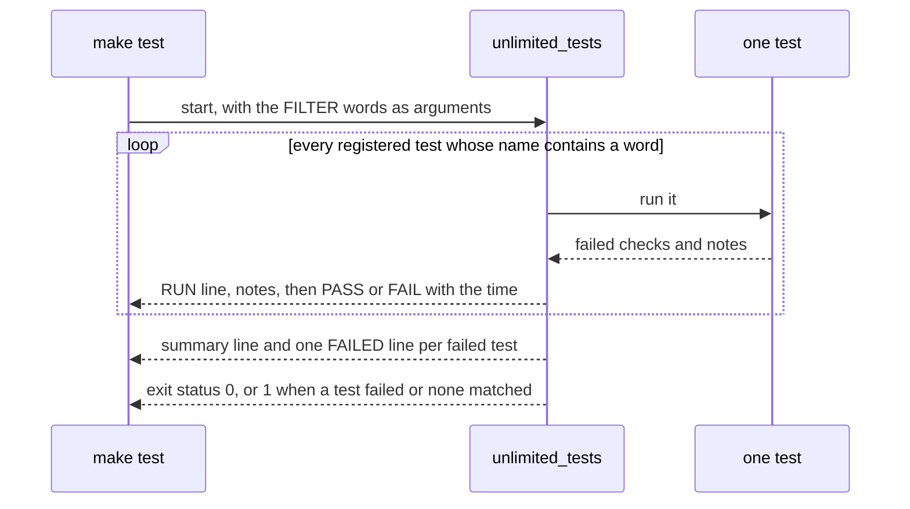

**In depth: the harness.** `tests/test_harness.hpp` is the whole test framework, about 150 lines of standard C++:

- `TEST(name) { … }` registers a function in a list when the program starts (static initialization, in link order:
  here the test files in alphabetical order, the tests in file order).
- `CHECK(condition)`, `CHECK_EQ(a, b)` and `CHECK_NEAR(a, b, tolerance)` record a failure with its file, line,
  expression and values, and let the test go on. `REQUIRE(condition)` records it and ends the test.
- `NOTE(format, …)` prints a measured value under the running test.
- An unexpected C++ exception fails the test with its message.
- `tests/test_main.cpp` is the `main()`: `test::run_all(argc, argv)`, which runs every test whose name contains one of
  the arguments, or every test when there is none.

### 5.2 What a failure looks like

A deliberately broken test, compiled outside the repository with the same harness, shows the format:

```cpp
TEST(example_round_trip_fails) {
    const int sent_bytes = 34;
    const int received_bytes = 33;
    const double measured_slot_ms = 16.4;
    const double sent_slot_ms = 16.0;
    const double slot_tolerance_ms = 0.1;
    CHECK_EQ(received_bytes, sent_bytes);
    CHECK_NEAR(measured_slot_ms, sent_slot_ms, slot_tolerance_ms);
    REQUIRE(received_bytes == sent_bytes);
    NOTE("not printed: the REQUIRE above ended the test");
}
```

```text
[ RUN  ] example_round_trip_fails
    test_example.cpp:10: CHECK_EQ(received_bytes, sent_bytes) failed: 33 != 34
    test_example.cpp:11: CHECK_NEAR(measured_slot_ms, sent_slot_ms) failed: 16.4 vs 16, |diff| 0.4 > 0.1
    test_example.cpp:12: REQUIRE(received_bytes == sent_bytes) failed
[ FAIL ] example_round_trip_fails (0 ms)
[ RUN  ] example_passes
    note: a note prints a measured value under its test: 34 bytes
[ PASS ] example_passes (0 ms)

2 test(s) run, 1 passed, 1 failed
  FAILED: example_round_trip_fails
```

Each failed check names its file and line, the expression and both values; the `REQUIRE` ended the test, so its
`NOTE` never printed; the summary lists the failed test, and the program exited with status 1. To investigate, run the
failed test alone ([§5.3](#53-running-only-some-tests-filter)), open the file at that line, and read the pass
criterion of the test in spec §8.1 or §8.2 (every test function is named there).

### 5.3 Running only some tests: FILTER

**In plain words.** `FILTER=word` runs only the tests whose name contains that word. Several words, in quotes, run the
tests that contain any of them.

```bash
make test FILTER=packet
```

```text
./bin/unlimited_tests packet
[ RUN  ] demo_cli_packetize_and_read_file
[ PASS ] demo_cli_packetize_and_read_file (0 ms)
[ RUN  ] packet_crc_check_value
[ PASS ] packet_crc_check_value (0 ms)
…
[ RUN  ] packet_modem_round_trip_ax25_and_max
    note: 1366 framed bytes, 197.6 s of audio
[ PASS ] packet_modem_round_trip_ax25_and_max (19 ms)

15 test(s) run, 15 passed, 0 failed
```

```bash
make test FILTER="packet_crc wav_codec_header"
```

```text
./bin/unlimited_tests packet_crc wav_codec_header
[ RUN  ] packet_crc_check_value
[ PASS ] packet_crc_check_value (0 ms)
[ RUN  ] packet_crc_failure_resyncs_without_loss
[ PASS ] packet_crc_failure_resyncs_without_loss (0 ms)
[ RUN  ] wav_codec_header_bytes_match_riff_layout
[ PASS ] wav_codec_header_bytes_match_riff_layout (0 ms)

3 test(s) run, 3 passed, 0 failed
```

The same, calling the program directly (the words are its arguments):

```bash
./bin/unlimited_tests packet_crc wav_codec_header
```

A word that matches nothing is an error, so a typing mistake cannot pass for a green run:

```bash
make test FILTER=no_such_test
```

```text
./bin/unlimited_tests no_such_test
no test matches the filter
make: *** [test] Error 1
```

**In depth.**

- The match is a plain, case-sensitive substring test (`std::string::find`). `FILTER=packet` ran 14 `packet_*` tests
  and also `demo_cli_packetize_and_read_file`. Every test name starts with its file's prefix (`decoder_`, `dsp_`,
  `encoder_`, `channel_`, …), so `FILTER=decoder_` runs the 39 decoder tests, and `FILTER=decoder_l9_` only L9.
- The harness has no option to list tests without running them; the sources list them:

```bash
grep -h '^TEST(' tests/*.cpp
```

### 5.4 What the 223 tests cover

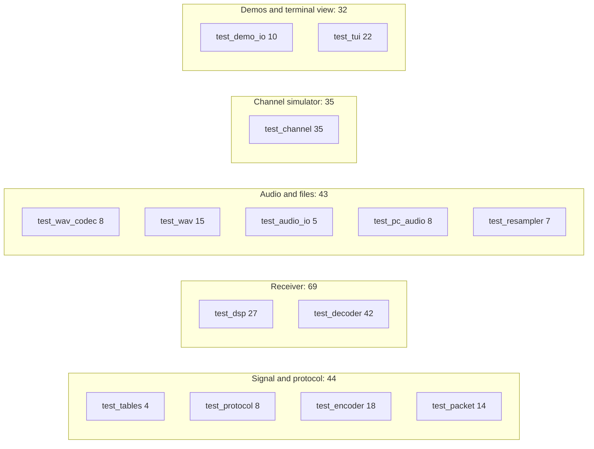

| File (`tests/`) | Tests | What they check | Spec |
|---|---|---|---|
| `test_tables.cpp` | 4 | the quarter-sine table: end points, within 1 LSB on and between its points, symmetry | §8.1 U1 |
| `test_protocol.cpp` | 8 | the band and width formulas exactly, passband fit and shift tolerance, the "Hi" packages bit-exact, the bandwidth constants against the real encoder's spectrum | U6, U21, U29 |
| `test_encoder.cpp` | 18 | presets and configuration checks, exact lengths for every preset, N, T and sample rate, waveform bounds and signs, tune ramps, the "Hi" slot sequence, energies, the queue, streaming, abort, chunk invariance | U4, U5, U7, U21–U23 |
| `test_packet.cpp` | 14 | CRC-16 ("123456789" gives 0x29B1), every single-bit flip detected, packet layout and limits, resync after a CRC error, rescans, the "Hi" packet, AX.25-size and maximum packets through the whole modem | U2, U3 |
| `test_dsp.cpp` | 27 | the receiver's building blocks: oscillator, CIC-2, history and its re-mix to a new frequency, noise trackers, twist measurement, tone search, fine AFC, candidates, audit ring, impulse blanker, smart line, package learner | U8–U14, U24–U26 |
| `test_decoder.cpp` | 42 | sizes and profiles, the SNR report; the loopbacks L1–L20 (L14 is `make demo_run`): every preset and many N and T, joins (the fast cold late join too), fades, clock errors, filters; robustness R1–R10; the integrity regressions R11–R17 | U15, U18, U27, §8.2 |
| `test_channel.cpp` | 35 | the channel simulator's physics: gains and selectivity, SNR calibration, offsets, the LSB mirror, AM and FM noise, emphasis, limiter, clicks, fading statistics, static crashes, AGC, interferers, QSB, clock error, chunking, seeds | §6.4 |
| `test_wav_codec.cpp` | 8 | the core WAV codec: exact RIFF bytes, sizes, formats, malformed files | U16 |
| `test_wav.cpp` | 15 | `pc/wav`: 8, 16, 24 and 32-bit and float files, stereo, EXTENSIBLE, odd chunks, errors | U16 |
| `test_audio_io.cpp` | 5 | `EncoderSource`, `WavOutput`, sample sinks | U17 |
| `test_pc_audio.cpp` | 8 | audio device specs, null and memory devices, the resampling sink, stopping from a callback | U17 |
| `test_resampler.cpp` | 7 | 8000 ↔ 48000, 44100 → 8000, 11025 → 8000 Hz: gain, rejection of at least 60 dB, chunking, at least 500 times real time | U19 |
| `test_demo_io.cpp` | 10 | the decoder sink equals a direct decode; rate independence through WAV files; the demos' numbers, bandwidth line and error texts | U17, L13, U22 |
| `test_tui.cpp` | 22 | the terminal view, rendered into strings: sizes, packages against the reference and decision lines, status, spectrum, scope, pacers | U20 |

Spec §8.1 counts 191 core tests and 32 TUI and demo tests (`test_tui` and `test_demo_io`); its tables §8.1 and §8.2
give every test's exact pass criterion, by function name.

### 5.5 Under the sanitizers

**In plain words.** A **sanitizer** is a compiler option that builds extra checks into the program.
AddressSanitizer stops the program at the first read or write outside an object's memory (a buffer overrun, a use
after free); UndefinedBehaviorSanitizer stops it at undefined behaviour (a signed overflow, a shift too far, a
misaligned pointer). A bug that happens to do no visible harm on your machine is caught anyway. The unit suite runs
under both before a release (spec §8.6 B6).

```bash
CXXFLAGS="-O1 -g -fsanitize=address,undefined -fno-omit-frame-pointer -fno-sanitize-recover=undefined" ASAN_OPTIONS=detect_leaks=0:halt_on_error=1 make BUILDDIR=build/asan BINDIR=bin/asan test
```

```text
c++ -O1 -g -fsanitize=address,undefined -fno-omit-frame-pointer -fno-sanitize-recover=undefined -std=c++11 -Wall -Wextra -Wpedantic -Werror -MMD -MP -Isrc -Ipc -Itests -c tests/test_audio_io.cpp -o build/asan/tests/test_audio_io.o
…
./bin/asan/unlimited_tests 
[ RUN  ] audio_io_encoder_source_returns_duration_then_zero
…
[ PASS ] wav_codec_reader_rejects_malformed (0 ms)

223 test(s) run, 223 passed, 0 failed
```

- **Success:** 223 passed, exit status 0, and no sanitizer report anywhere in the output. A report contains
  `runtime error:` (UndefinedBehaviorSanitizer) or `ERROR: AddressSanitizer`, and ends the program at once with a
  stack trace; `make` then exits 2.
- **Time here:** 91 s (about 19 s of build, 72 s of tests: the checks slow the tests down a little over two times).

**In depth, part by part.**

| Part | Why |
|---|---|
| `CXXFLAGS="…"` before `make` | in the environment, it replaces the Makefile's default `-O2` (`CXXFLAGS ?= -O2`), and the Makefile still adds `-std=c++11` and every warning. Given on the `make` command line instead, it would replace the Makefile's own flags too |
| `-O1 -g -fno-omit-frame-pointer` | light optimisation, debug information and frame pointers: readable stack traces |
| `-fsanitize=address,undefined` | both sanitizers, compiled into every file and linked into the program |
| `-fno-sanitize-recover=undefined` | any undefined behaviour is fatal, so it fails the run instead of scrolling past |
| `ASAN_OPTIONS=detect_leaks=0:halt_on_error=1` | the first memory report is fatal; leak detection off, as in the release recipe (spec §9.5) |
| `BUILDDIR=build/asan BINDIR=bin/asan` | the sanitized objects and program stay apart from the normal build (both folders are inside the git-ignored `build/` and `bin/`) |

The release ran the same flags in one compiler call over every source file (spec §9.5); the `make` form above builds
each file with them.

---

## 6. The long regression suite: `make test_long`

### 6.1 In plain words

The unit tests check that each part keeps its promises. The long suite measures **how well the whole modem works**:
hours of simulated radio (plain noise, HF fading, static crashes, carriers and Morse next to the signal, AGC, AM, FM,
clocks off by 0.1 %, narrow filters and mistuning, and hours of noise, carriers, Morse and speech with no signal at
all), about 9 minutes on every core of a 10-core computer. Each measurement is a **row** (a `RESULT` line). Most rows
are compared with a **gate**, the limit the spec sets, and say **PASS** or **FAIL**; the others are only reported
(**REPORT**). Together they answer the questions a radio amateur would ask:

- At the signal-to-noise ratio the spec promises, how many bits come back wrong, and how many bytes are lost?
- Does the receiver find the signal, at the right speed and package length, nearly every time?
- Does it ever release a byte that was never sent, or put a byte in the wrong place? (It must never.)
- Does it ever lock on noise, a carrier, Morse or speech? (It must never.)

### 6.2 Running the whole suite

```bash
make test_long
```

It builds `bin/unlimited_regression` and runs its 31 tests in order, most of them spreading their work over every
core. Keep the output: the rows are the evidence you will compare after a change
([§9.7](#97-before-and-after-a-change)).

```bash
make test_long > build/test_long.log 2>&1
```

What it prints (the log of the freeze run of 2026-09-27, spec §9.5; long rows cut with `…`):

```text
./bin/unlimited_regression 
[ RUN  ] L5_clock_error_10_min
RESULT | L5 | TX +1000 ppm, RX +0 ppm, 10 min at T=16 ms N=8, usb AWGN +4.5 dB (gate + 3) | 4166 bytes: wrong 0 (BER 0.00e+00), lost 0, extra 0, shifted 0, … | PASS
…
[ PASS ] L5_clock_error_10_min (5447 ms)
[ RUN  ] A1_awgn_smart_line
RESULT | A1 | fm (T=4 ms N=16 1500 Hz), receiver 4..32 ms, 300-3000 Hz, usb AWGN +8.0 dB (gate), offset +-50 Hz | BER 3.42e-05 (204800 bits), … | BER <= 1e-3, loss <= 1% (prov.) | PASS
…
[ RUN  ] Z_summary

==== long regression summary (370 result lines: … PASS, … FAIL, … REPORT) ====
RESULT | L5 | TX +1000 ppm, RX +0 ppm, 10 min at T=16 ms N=8, usb AWGN +4.5 dB (gate + 3) | …
…
31 test(s) run, 30 passed, 1 failed
  FAILED: L20_cold_late_join
make: *** [test_long] Error 1
```

- **Time:** 8 min 52 s on the 10-core M4 in the freeze run, at 830 % CPU (4,416 s of processor time); the program
  was already built. Building it takes about 4 s here ([§6.3](#63-running-one-test-filter)).
- **Every row is printed twice:** once when it is measured, once more in the summary block that `Z_summary` prints at
  the end. The freeze run had 370 rows: 280 gated and 90 reported.
- **The latest run** (after the fast cold late join, spec §9.5): 8 min 50 s, 370 rows: 276 PASS, 4 FAIL, 90 REPORT;
  the 4 FAILs are L20 rows ([§6.11](#611-l20-the-known-open-item)).
- **Success** would end with `0 failed` and exit status 0. **Today** 4 of L20's gated rows fail, so the run ends as
  above: `FAILED: L20_cold_late_join` and make's error (exit status 2). That is expected until those 4 rows are closed
  (spec §11.2 P2); a FAIL anywhere else is a regression.

### 6.3 Running one test: FILTER

**In plain words.** The long suite uses the same harness and the same `FILTER` as the unit tests: the tests whose name
contains one of the words. `Z_summary` prints the summary block, so add it when you want one.

```bash
make test_long FILTER="L5_clock Z_summary"
```

```text
c++ -O2 -std=c++11 -Wall -Wextra -Wpedantic -Werror -MMD -MP -Isrc -Ipc -Itests -c tests/long/regression_awgn.cpp -o build/tests/long/regression_awgn.o
…
./bin/unlimited_regression L5_clock Z_summary
[ RUN  ] L5_clock_error_10_min
RESULT | L5 | TX +1000 ppm, RX +0 ppm, 10 min at T=16 ms N=8, usb AWGN +4.5 dB (gate + 3) | 4166 bytes: wrong 0 (BER 0.00e+00), lost 0, extra 0, shifted 0, locks 1 (1 with the sent T and N), ends 1, … | PASS
…
[ PASS ] L5_clock_error_10_min (5334 ms)
[ RUN  ] Z_summary

==== long regression summary (12 result lines: 12 PASS, 0 FAIL, 0 REPORT) ====
RESULT | L5 | TX +1000 ppm, RX +0 ppm, 10 min at T=16 ms N=8, usb AWGN +4.5 dB (gate + 3) | …
…
[ PASS ] Z_summary (0 ms)

2 test(s) run, 2 passed, 0 failed
```

9.1 s here, the build included: twelve 10-minute transmissions with clock errors of ±1000 ppm, decoded in 5.3 s on
10 cores. Its 12 rows were identical, character for character, to the freeze run's
([§6.9](#69-seeds-determinism-and-parallelism)).

The long tests in their run order:

```bash
grep '^TEST(' tests/long/regression_suite.cpp
```

**In depth: filters that surprise.**

| Filter | What happens |
|---|---|
| `C1` | also runs C10 to C15: their names contain `C1`. Use `C1_` |
| `A1` | runs `A1_awgn_smart_line` and `A1_n_sweep_at_the_hf_gate`. The N sweep reuses A1's measurements, so it runs A1's jobs even when it runs alone |
| `F2`, `F3`, `F4` or `F7` | the first F test to run measures every F1–F4 scene (3 profiles × 4 scenes × 30 min, plus 5 more seeds of F3 and F4) and the others read those results: F2 alone costs as much as F1 (about 93 s on 10 cores in the freeze run) |
| `F5` or `F6` alone | fails at once, with no measurement. F5 and F6 check what the tests before them recorded: F5 the packets of F1–F4 and of every C point, F6 the runs of wrong bytes and the shifted bytes of every L5, A and C point |

That last one is not a defect of the modem:

```bash
./bin/unlimited_regression F5_crc
```

```text
[ RUN  ] F5_crc_valid_wrong_packets
    tests/long/regression_support.cpp:1065: REQUIRE(!ledger.empty()) failed
[ FAIL ] F5_crc_valid_wrong_packets (0 ms)

1 test(s) run, 0 passed, 1 failed
  FAILED: F5_crc_valid_wrong_packets
```

### 6.4 Rows, gates and verdicts

**In plain words.** A **row** is one measured condition: one sender, one channel at one SNR, one receiver, usually
hundreds of transmissions. A **gate** is the limit the spec sets for that condition. The **verdict** at the end of the
row:

- **PASS:** the measured value meets the gate.
- **FAIL:** it does not. The harness prints a `file:line: <id> failed: <condition>` line under the row, the test goes
  on printing its other rows, ends as `[ FAIL ]`, and the program exits with status 1.
- **REPORT:** there is no gate; the value is printed for the record: conditions beyond the spec's promise (below a gate,
  a provisional point), comparisons, known open problems. A REPORT row never fails.

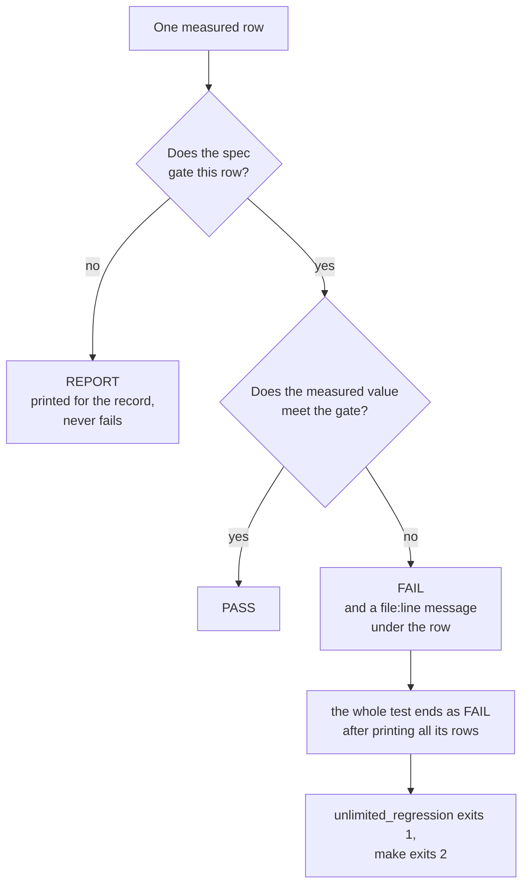

**In depth.** Rows come from `result(id, condition, measured, gate, pass, kind)` in
`tests/long/regression_support.cpp`: a gated row that does not pass calls the harness's `fail()`, which fails the
running test without stopping it. The rules behind the gates (spec §8, "Conventions"):

- A failing gate is investigated, never relaxed silently. A gate changes only by a decision recorded in spec §0.8,
  confirmed by Gustavo (G1 to G5 so far).
- `(prov.)` after a gate marks a provisional gate: set from the model plus the v0.1b margin, it may only be tightened.
- A BER-only or ratio gate also asks for at least 50 % of the bytes delivered, so a run that releases nothing cannot
  pass.

### 6.5 Anatomy of a RESULT row

A row is six columns separated by ` | `. This is the `hf` row of A1 in the freeze run:

```text
RESULT | A1 | hf (T=16 ms N=8 1500 Hz), receiver 8..64 ms, 300-2700 Hz, usb AWGN +1.5 dB (gate), offset +-50 Hz | BER 4.40e-05 (204768 bits), delivered 99.98%, loss 0.02%, wrong 9, extra 0, locks 128/128 tx, lost-ev 0 (gone 0, alias 0, preamble 0, unsupported 0), BER95 <= 8.2e-05, max wrong run 1, release latency mean 2.5 T max 57.2 T after the STOP | BER <= 1e-3, loss <= 1% | PASS
```

| Column | In this row | Meaning |
|---|---|---|
| 1 | `RESULT` | marks a row: `grep '^RESULT'` finds them all |
| 2 | `A1` | the family, as in spec §8: A1 is plain noise with the default smart decision line (§8.3) |
| 3 | `hf (T=16 ms N=8 1500 Hz), receiver 8..64 ms, 300-2700 Hz, usb AWGN +1.5 dB (gate), offset +-50 Hz` | the condition: the sender (preset, slot length T, bits per package N, pitch), the receiver (its speed window and passband), the channel (USB with white noise at +1.5 dB SNR, this preset's gate) and the receiver's mistuning (random within ±50 Hz for each job) |
| 4 | `BER 4.40e-05 (204768 bits), …` | what was measured (next table) |
| 5 | `BER <= 1e-3, loss <= 1%` | the gate, as the spec sets it (§8.3 A1) |
| 6 | `PASS` | the verdict |

The measured column, field by field:

| Field | Meaning |
|---|---|
| `BER 4.40e-05 (204768 bits)` | bit errors ÷ released bits: 9 errors in 204,768 bits. The row sent 128 transmissions of 200 bytes (25,600 bytes) |
| `delivered 99.98%`, `loss 0.02%` | 25,596 bytes landed on a sent byte; 4 were never released |
| `wrong 9`, `extra 0` | released bytes with at least one bit error; released bytes the sender never sent |
| `SHIFTED n bytes in m lock(s)` | printed only when not zero: bytes released at a wrong `byte_index` |
| `locks 128/128 tx` | transmissions locked at the sent T (within 3 %) and N, before their end + 4 T. `(+w wrong T/N, s stray)` follows when a lock had another T or N, or came before the first transmission; `late joins j (cold c)` when locks joined a running transmission |
| `lost-ev 0 (gone 0, alias 0, preamble 0, unsupported 0)` | LOST events and their reasons: the signal gone, an alias found, the preamble timed out, N above the build's cap |
| `BER95 <= 8.2e-05` | the upper 95 % confidence bound of the BER ([§9.5](#95-statistics-of-the-gates)) |
| `max wrong run 1` | the longest run of consecutive wrong bytes: a run longer than 8 is the signature of a lock at a wrong T or N (F6) |
| `release latency mean 2.5 T max 57.2 T after the STOP` | how long after the end of its package's STOP slot a byte came out, in slots |

The measured column differs between families: L5 rows add the clock error of the measured T, A3 rows the share of
transmissions locked, F rows the tone grabs, sync trains and N confirmations seen on non-signals, L20 rows the time to
join. A REPORT row reads the same way; its gate column says why it is only reported. This one is the `am` preset
1 dB below its gate (spec §0.8 G1), where the gate would have been met:

```text
RESULT | C11 | AM m=0.8, am (T=8 ms N=16 1500 Hz), am profile, CNR 5 dB in the 6 kHz IF (snr 8.8 dB) | BER 8.13e-04 (27064 bits), delivered 100.00%, loss 0.00%, wrong 22, extra 0, locks 10/10 tx, lost-ev 0 (gone 0, alias 0, preamble 0, unsupported 0), BER95 <= 1.2e-03, max wrong run 1 | report (the am preset below its CNR 6 dB gate, gate decision C11; BER <= 1e-3: met) | REPORT
```

### 6.6 The families

**In plain words.** Of the 31 tests, 30 check the modem, in six families; the last one, `Z_summary`, prints every row
again.
Each family is a chapter of spec §8: its table there names each test, its pass criterion and its measured result.

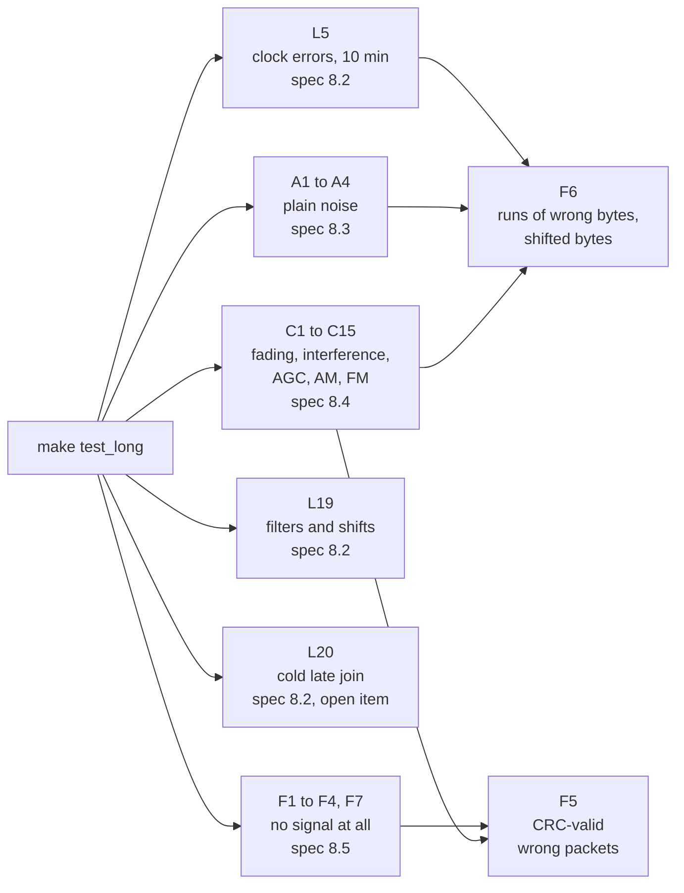

| Test | Spec | What it measures | Rows gated / reported | Time, freeze run |
|---|---|---|---|---|
| `L5_clock_error_10_min` | §8.2 L5 | ±1000 ppm on the sender's clock, the receiver's, both; 10-minute transmissions, N = 8 and 32 | 12 / 0 | 5.4 s |
| `A1_awgn_smart_line` | §8.3 A1 | BER and loss at each T's gate, the smart line; N = 1, 4, 16, 32 too | 11 / 0 | 44.0 s |
| `A1_n_sweep_at_the_hf_gate` | §4.1 | N = 1..32 within 0.5 dB of N = 8 | 0 / 5 | 12.6 s |
| `A2_awgn_fixed_line` | §8.3 A2 | the fixed 70 % line at gate + 4.5 dB | 7 / 0 | 33.6 s |
| `A3_acquisition` | §8.3 A3 | locked at the gate (400 transmissions) and 2 dB below (300) | 22 / 2 | 39.7 s |
| `A4_snr_report` | §8.3 A4 | the SNR the receiver reports, gate to gate + 20 dB | 55 / 0 | 7.1 s |
| `C1_ccir_good` … `C4_flat_rayleigh` | §8.4 C1–C4 | HF fading: CCIR good, moderate, poor, flat Rayleigh | 10 / 22 | 61.2 s |
| `C5_qsb` | §8.4 C5 | slow deep fading | 1 / 3 | 10.4 s |
| `C6_qrn_blanker`, `C7_agc` | §8.4 C6, C7 | static crashes and the blanker; a receiver's AGC | 3 / 4 | 65.7 s |
| `C8_carrier_qrm`, `C9_keyed_cw_qrm` | §8.4 C8, C9 | a steady carrier; keyed Morse next to the signal | 18 / 14 | 63.5 s |
| `C10_fm`, `C11_am`, `C15_fm_emphasis_mismatch` | §8.4 C10, C11, C15 | FM and AM radios | 18 / 6 | 38.4 s |
| `C12_flutter`, `C13_agc_fading`, `C14_sideband_shift_fading` | §8.4 C12–C14 | flutter; AGC with fading; LSB and filter-edge pitches in fading | 10 / 13 | 41.9 s |
| `L19_passband` | §8.2 L19 | 4 SSB filters × 5 presets, the pitch shifted to each side's tolerance − 10 Hz; stations outside the search | 44 / 0 | 10.3 s |
| `L20_cold_late_join` | §8.2 L20 | a receiver started inside a running transmission | 54 / 1 | 5.1 s |
| `F1_noise_false_lock` … `F4_speech_false_lock`, `F7_package_learning` | §8.5 F1–F4, F7 | 30 minutes per profile of noise, drifting carriers, Morse, speech: no lock | 13 / 18 | 92.7 s (all in F1) |
| `F5_crc_valid_wrong_packets`, `F6_wrong_byte_runs` | §8.5 F5, F6 | CRC-valid wrong packets; runs of wrong bytes; shifted bytes | 2 / 2 | 0 s (ledgers) |
| `Z_summary` | – | prints every row again | – | 0 s |

Where the 8 min 52 s go (the freeze run's per-test times, in minutes and seconds from the start):

```mermaid
gantt
    title The freeze run of 2026-09-27 on 10 cores
    dateFormat HH:mm:ss
    axisFormat %M:%S
    todayMarker off
    section Clock
    L5 clock error                    :00:00:00, 00:00:05
    section Plain noise
    A1 smart line                     :00:00:05, 00:00:49
    A1 N sweep                        :00:00:49, 00:01:02
    A2 fixed line                     :00:01:02, 00:01:36
    A3 acquisition                    :00:01:36, 00:02:15
    A4 SNR report                     :00:02:15, 00:02:22
    section Channels
    C1 CCIR good                      :00:02:22, 00:02:43
    C2 CCIR moderate                  :00:02:43, 00:02:57
    C3 CCIR poor                      :00:02:57, 00:03:11
    C4 flat Rayleigh                  :00:03:11, 00:03:24
    C5 QSB                            :00:03:24, 00:03:34
    C6 QRN and blanker                :00:03:34, 00:03:50
    C7 AGC                            :00:03:50, 00:04:40
    C8 carrier                        :00:04:40, 00:05:29
    C9 keyed CW                       :00:05:29, 00:05:43
    C10 FM                            :00:05:43, 00:05:55
    C11 AM                            :00:05:55, 00:06:09
    C12 flutter                       :00:06:09, 00:06:10
    C13 AGC and fading                :00:06:10, 00:06:23
    C14 sideband and shift in fading  :00:06:23, 00:06:51
    C15 FM emphasis mismatch          :00:06:51, 00:07:03
    section Receiver
    L19 passbands and shifts          :00:07:03, 00:07:14
    L20 cold late join                :00:07:14, 00:07:19
    section No signal
    F1 to F4 and F7 scenes            :00:07:19, 00:08:52
```

**In depth: how a test runs its rows.**

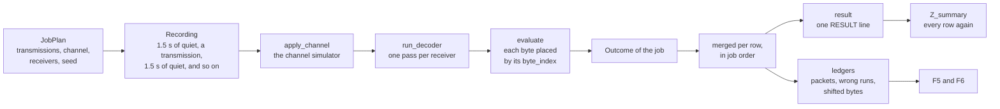

- A row's transmissions are split into **jobs** of about 6 minutes of audio each (`k_job_audio_s`), at least 8 jobs
  per row when there are enough transmissions. A job is one recording: 1.5 s of receiver noise (`k_quiet_ms`) before,
  between and after its transmissions, passed through the channel once and decoded by each receiver of the row.
- The channel's output is scaled so that the key-down peaks and 5 σ of noise stay below full scale, as a real sound
  card's input must be set.
- `evaluate()` maps the byte events to the sent bytes (a cold join is matched at the offset where most of its bytes
  agree), and counts the shifted, acausal (released before their STOP arrived) and wrong bytes, the locks and their T
  and N, the LOST reasons, the packets, the latency.
- Files: `tests/long/regression.hpp` (the shared declarations), `regression_support.cpp` (jobs, scoring, rows,
  ledgers, the summary), `regression_awgn.cpp` (L5, A1–A4), `regression_channels.cpp` (C1–C15),
  `regression_receiver.cpp` (L19, L20), `regression_integrity.cpp` (F1–F4, F7), `regression_suite.cpp` (the
  registration order).

### 6.7 The SNR convention and the gates

**In plain words.** **SNR** (signal-to-noise ratio) compares the power of a steady beep with the power of the hiss in
a 2500 Hz slice of the audio, the convention of the WSJT modes such as FT8. 0 dB: the beep is as strong as that
noise; −3 dB: half as strong. Unlimited decodes signals below 0 dB because its receiver listens only in a narrow band
around the pitch ([README 7.1](../README.md#71-in-plain-words)). Each slot length has its **gate SNR**: the SNR at
which the spec promises at most 1 bit in 1000 wrong and at most 1 % of the bytes lost.

| Slot length T | Preset | Gate SNR (A1) |
|---|---|---|
| 4 ms | `fm` | +8.0 dB (prov.) |
| 8 ms | `hf_fast`, `am` | +4.5 dB |
| 16 ms | `hf` (the default) | +1.5 dB |
| 32 ms | `hf_slow` | −1.5 dB |
| 64 ms | – | −4.5 dB |
| 128 ms | – | −6.5 dB (prov.) |

A slot twice as long collects twice the energy: 3 dB lower per doubling of T. The gates sit 1.6 to 2.7 dB above the
model of an ideal receiver with known timing, because the real one must find the signal, its timing and its exact
frequency blind (spec §4.1). "(gate + 3)" in a row's condition means 3 dB above the gate: the integrity points (L5, L19, F6).

**In depth.**

- The SNR is P_tone ÷ (N0 × 2500 Hz): P_tone is the power of the **key-down** tone (a steady beep at full crest, A²/2
  for a crest A), N0 the noise power per hertz (spec §1.3, D19; `pc/channel.hpp`). The noise is white, so the value
  does not depend on the receiver's filters. With fading, it is the average SNR.
- AM and FM rows take the unmodulated carrier as the reference, and quote the carrier-to-noise ratio (**CNR**) in the
  receiver's IF bandwidth as well: `CNR 5 dB in the 6 kHz IF (snr 8.8 dB)` is 10 × log10(6000 / 2500) = 3.8 dB apart;
  in FM's 12.5 kHz IF the difference is 7.0 dB.
- The measured BER against SNR, through the real encoder, channel and decoder, is the figure `make docs` draws. In
  the run for this guide the measured curves reached 1e-3 at −3.20 dB (`hf_slow`), −0.32 dB (`hf`) and +2.82 dB
  (`hf_fast`), 0.55 to 0.68 dB from the matched-filter bound (−3.88, −0.87 and +2.14 dB):


*Bit error rate against SNR in plain noise for the three HF presets, 200,000 bits per point, receiver mistuned up to
±50 Hz and told nothing. Dashed: the matched-filter bound (known timing and level). Hollow points: fewer than 90 % of
the bytes delivered, where finding the signal, not reading the bits, is the limit. The gray diamonds are the dropped
v0.2 design, from its own spec.*

### 6.8 Noise or defect: BER ≤ 1e-4, 0 extra, 0 shifted

**In plain words.** Random noise can flip a bit even for a perfect receiver: that is chance, not a fault. A gate that
asks for zero bit errors therefore fails now and then for no reason in the code, about once in 100 rows at the SNRs
used (spec §0.8 G5). A byte that was never sent, or a byte put at the wrong place, is different: that is the receiver
inventing or misplacing data, a defect in its logic that more signal would not cure (when its count of packages slips,
every later byte of that lock lands in the wrong place). So Gustavo's decision G5 (2026-09-27): where a long-suite
gate asked for 0 bit errors (L5, L19, C10 and C15 from CNR 8 dB), it asks for **a BER of at most 1e-4 with 0 extra
and 0 shifted bytes**, on at least 10⁴ bits per row. The rest of each gate is unchanged, and the unit suite keeps its
own criteria.

The row that prompted it, in the freeze run: one wrong bit in 24,000, a zero read at 54 % of the reference against a
52 % decision line in the middle of a message (spec §8.2 L19′). Now a PASS, with 0 extra and 0 shifted bytes:

```text
RESULT | L19 | hf_fast (T=8 ms N=8 1500 Hz) in the SSB 1.8 kHz filter 300-2100 Hz, shift tolerance -925/+325 Hz, shift -915 Hz -> pitch 585 Hz; receiver passband 300-2100 Hz, search 335-2065 Hz, usb +7.5 dB (gate + 3) | BER 4.17e-05 (24000 bits), delivered 100.00%, loss 0.00%, wrong 1, extra 0, locks 15/15 tx, lost-ev 0 (gone 0, alias 0, preamble 0, unsupported 0), max wrong run 1, shifted bytes 0 | decodes: BER <= 1e-4, 0 extra, 0 shifted, loss <= 1%, >= 1e4 bits | PASS
```

The same condition over 384,000 more bits gave 0 errors (spec §9.5). In code: `near_zero_errors()` in
`tests/long/regression_support.cpp` (`k_near_zero_ber` = 1e-4). What the gate allows: at most 1 bit error in a row of
10⁴ bits, 2 in a row of 24,000 bits (3 would be 1.25e-4).

### 6.9 Seeds, determinism and parallelism

**In plain words.** Every random thing in the suite (the bytes, the noise, the fading, the mistuning) comes from a
seed computed from the test, the row and the job. Nothing depends on the time of day or on how many cores ran it, so
the same code on the same machine prints the same rows. On this machine the 12 rows of L5 came out identical to the
freeze run's, three times; the spec records the same for A3, C8, C11 and L19 run alone, and for every measured number
between the release run and the freeze run (spec §9.5).

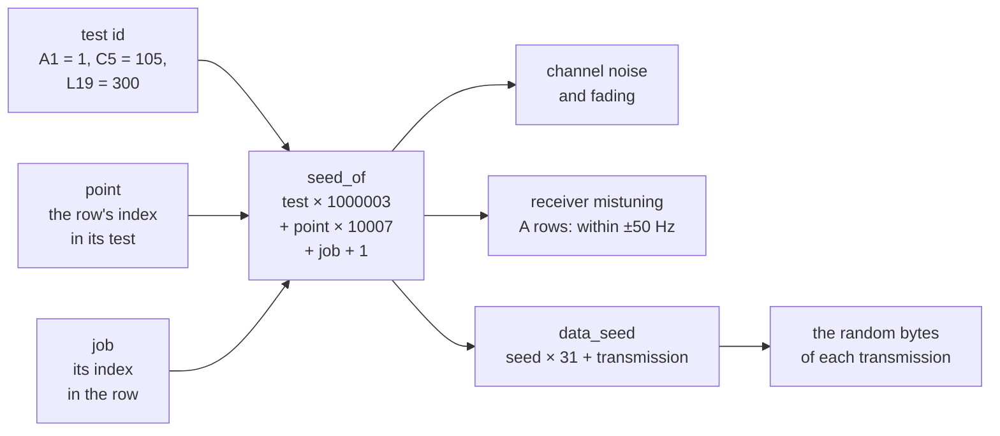

**In depth.**

- `seed_of(test, point, job)` = test × 1,000,003 + point × 10,007 + job + 1 (`tests/long/regression_support.cpp`).
  The test ids: A1 1, A2 2, A3 3, A4 4, L5 5, the N sweep 6, C*n* 100 + *n* (C1 101 … C15 115), F 200 + scene (F1
  200 … F4 203), L19 300, L20 301.
- The **point** is the row's index in its test's list: "The index of a row is its seed: never reorder"
  (`regression_awgn.cpp`). A new row goes at the end of its list, so the existing rows keep their seeds and numbers.
- Each job's channel uses the job's seed; the A rows draw the receiver's mistuning (uniform, ±50 Hz) from
  `std::mt19937(seed)`; transmission *t* of a job carries `random_bytes` from `data_seed(seed, t)` = seed × 31 + *t*.
- **Paired rows** share seeds on purpose: C7 and C13 run the same audio with and without the AGC, so their ratio
  compares the receiver, not two noise draws.
- **Parallelism:** `parallel_map()` (`regression.hpp`) runs the jobs on one thread per core
  (`std::thread::hardware_concurrency()`), the costliest first (`JobPlan::cost()`), stores each result at its job's
  index and merges them in index order. The rows are therefore the same with 1 core or 64. There is no switch to use
  fewer cores; on a shared machine, run the suite at a lower priority with the standard `nice` command.
- **The limit of determinism:** the simulator's noise uses `std::normal_distribution`, whose algorithm each C++
  standard library chooses. `pc/channel.hpp` says it plainly: "Output repeats per seed and standard library". With
  another library (GCC's libstdc++ on Linux instead of Apple's libc++) the rows print other digits, and the gates must
  hold all the same. Not verified for this guide: every number here is from the Mac of §2.4.

### 6.10 Reading a saved log

With the output saved as in §6.2 (`build/test_long.log`); these commands were checked on the freeze run's log:

The summary line, with the number of PASS, FAIL and REPORT rows:

```bash
grep '^==== long regression summary' build/test_long.log
```

The tests that failed:

```bash
grep '^\[ FAIL \]' build/test_long.log
```

The failing rows, each once (every row is in the log twice):

```bash
grep ' | FAIL$' build/test_long.log | sort -u
```

The rows of the summary block only, one line each, for comparisons ([§9.7](#97-before-and-after-a-change)):

```bash
sed -n '/^==== long regression summary/,$p' build/test_long.log | grep '^RESULT' > build/test_long_rows.txt
```

On the freeze run's log the last one gives 370 lines, one per row.

### 6.11 L20, the known open item

**In plain words.** L20 switches a receiver on at a random moment inside a transmission that is already running, 20
times per row, and asks two things (spec §8.2 L20′, §3.12 V7):

- With N a multiple of 8 (8, 16, 24, 32 bits per package), the receiver must join (a **cold late join**, flagged
  `late_join`) within 6 packages in at least 95 % of the starts, with 0 wrong and 0 shifted bytes.
- With any other N (3, 4, 5, 7, 12), it must not lock at all: without the preamble it cannot know where each bit
  belongs, and it must wait for the next transmission.

The joins are correct (the bytes land in their places). Since the fast cold late join (spec §0.7 I29–I34) they are
also quick: 466 of the 480 starts lock within 6 packages, against 267 before, and 20 of the 24 joining rows pass.
The 4 rows that still fail all use 32 ms slots with 24 or 32 bits per package. Their packages are so long (0.8 and
1.06 s) that the receiver's memory of recent audio, the history (2.4 s at the default build), no longer holds the
first of the four twists the join needs when the fourth arrives, so the join waits one more package (spec §11.2 P2).
Gustavo kept the gate (spec §0.8 G4), so these rows stay FAIL until he decides how to close them. A full run shows
under each such row a line of this kind, then the end shown in §6.2:

```text
    tests/long/regression_support.cpp:997: L20 failed: T=32 ms N=24 1500 Hz, 200 bytes, receiver started at 20 random points after the preamble, usb +1.5 dB (gate + 3)
```

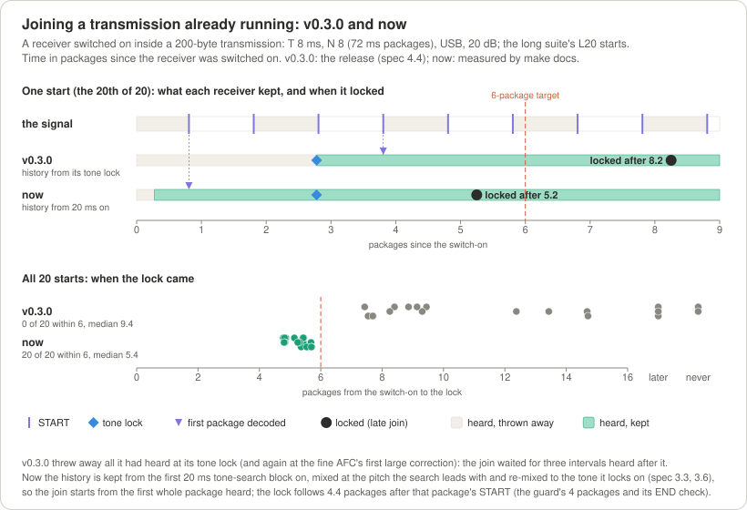

*What changed, drawn by `make docs` from the real decoder: the release threw away everything it heard before its
tone lock; the receiver now keeps it and locks about 3 packages sooner.*

The current numbers are in the L20 rows of your own run, and in spec §4.4 and §11.2 with their analysis. The
non-joining rows (N not a multiple of 8) are gated too, and must PASS.

---

## 7. Embedded checks: `make check_embedded`, `make arduino_check`

### 7.1 `make check_embedded`

**In plain words.** Microcontrollers have little memory and no operating system underneath: no heap (`malloc`,
`new`), and usually no C++ exceptions or run-time type information (RTTI). This check builds the core the way a
microcontroller build does and proves that it never calls any of them; decodes every preset with a heap that stops the
program if anyone touches it; builds the decoder with other package limits; cross-compiles for the ESP32, the
ATmega328P and ARM when those compilers are found; and runs the Arduino Uno's sending code on a cycle-exact model of
its processor, to prove that it keeps up with 8000 samples per second.

```bash
make check_embedded
```

```text
  embedded src/unlimited/decoder.cpp
  embedded src/unlimited/dsp.cpp
  embedded src/unlimited/encoder.cpp
  embedded src/unlimited/packet.cpp
  embedded src/unlimited/protocol.cpp
  embedded src/unlimited/tables.cpp
  embedded src/unlimited/wav_codec.cpp
check_embedded: core is heap/exception/RTTI free
  embedded test tests/embedded/heap_trap.cpp
heap_trap: sizeof Encoder 148, Decoder 25304, PacketReader 1064 bytes (UNLIMITED_PACKET_MAX 1024)
  hf_slow      60 bytes: received 60 wrong 0 extra 0 locks 1 ends 1 lost 0, slot error 0.039 %  ok
  hf          120 bytes: received 120 wrong 0 extra 0 locks 1 ends 1 lost 0, slot error 0.047 %  ok
  hf_fast     240 bytes: received 240 wrong 0 extra 0 locks 1 ends 1 lost 0, slot error 0.000 %  ok
  am          240 bytes: received 240 wrong 0 extra 0 locks 1 ends 1 lost 0, slot error 0.000 %  ok
  fm          480 bytes: received 480 wrong 0 extra 0 locks 1 ends 1 lost 0, slot error 0.000 %  ok
  T16 N1       60 bytes: received 60 wrong 0 extra 0 locks 1 ends 1 lost 0, slot error 0.127 %  ok
  T16 N32     160 bytes: received 160 wrong 0 extra 0 locks 1 ends 1 lost 0, slot error 0.011 %  ok
  packet     1411 bytes: received 1411 wrong 0 extra 0 locks 1 ends 1 lost 0, slot error 0.000 %  ok
  wav          14 bytes: received 14 wrong 0 extra 0 locks 1 ends 1 lost 0, slot error 0.000 %  ok
heap_trap: PASSED (0 failures)
  embedded decoder -DUNLIMITED_MAX_BITS_PER_PACKAGE=16
  embedded decoder -DUNLIMITED_MAX_BITS_PER_PACKAGE=64
check_embedded: arm-none-eabi-g++ not found, skipped
check_embedded: xtensa-esp32 OK (decoder variants included)
check_embedded: avr (atmega328p) OK, encoder queues 64 16 128
isr_cycles case 0 (T 32 ms, N 8, 1500 Hz): 98368 samples, 0 mismatches, ISR mean 543 max 1011 cycles (sample 16415, package), load 27.5 %, lost ticks 0, longest busy 0.06 ms: PASS
isr_cycles case 1 (T 16 ms, N 8, 1500 Hz): 51008 samples, 0 mismatches, ISR mean 539 max 1011 cycles (sample 9631, package), load 27.3 %, lost ticks 0, longest busy 0.06 ms: PASS
…
isr_cycles case 4 (T 4 ms, N 16, 1500 Hz): 16416 samples, 0 mismatches, ISR mean 494 max 1011 cycles (sample 6303, package), load 25.0 %, lost ticks 0, longest busy 0.06 ms: PASS
isr_cycles case 5 (T 128 ms, N 8, 2700 Hz): 386624 samples, 0 mismatches, ISR mean 556 max 1011 cycles (sample 70431, package), load 28.1 %, lost ticks 0, longest busy 0.06 ms: PASS
isr_cycles case 6 (T 16 ms, N 1, 1500 Hz): 86848 samples, 0 mismatches, ISR mean 628 max 1008 cycles (sample 12063, package), load 31.7 %, lost ticks 0, longest busy 0.06 ms: PASS
isr_cycles case 7 (T 16 ms, N 32, 1500 Hz): 47168 samples, 0 mismatches, ISR mean 522 max 1011 cycles (sample 8095, package), load 26.4 %, lost ticks 0, longest busy 0.06 ms: PASS
isr_cycles: gate max 1600 cycles per sample, mean load <= 50 %, no lost tick: PASS
```

12.8 s here. Line by line:

| Lines | What they prove |
|---|---|
| `embedded src/unlimited/….cpp` | every core file compiles with `-std=c++11 -O2 -Wall -Wextra -Wpedantic -Werror -fno-exceptions -fno-rtti -Isrc` (and nothing from `pc/` or `tests/`) |
| `core is heap/exception/RTTI free` | `nm -u` on those objects finds none of `malloc`, `calloc`, `realloc`, `operator new` and `new[]` (`_Znwm`, `_Znam`, `_Znwj`, `_Znaj`), `__cxa_throw`, `__cxa_allocate_exception`, `typeinfo`, `__gxx_personality` (spec §8.6 B1) |
| `heap_trap: …` | `tests/embedded/heap_trap.cpp`, linked with the core alone and built with the same flags, replaces every `operator new` and `delete` by a function that aborts the program; it decodes every preset, N = 1 and N = 32 at 16 ms, a packet and a WAV round trip: every byte, 0 wrong, 0 extra, 1 lock and 1 end each; "slot error" is the measured T against the sent T (spec §8.6 B2) |
| `embedded decoder -DUNLIMITED_MAX_BITS_PER_PACKAGE=16` and `=64` | the decoder at package caps 16 (the Arduino default) and 64, besides the default 32: its `static_assert` keeps `sizeof(Decoder)` ≤ 7,168 + 576 × cap bytes (spec §3.15, U15, B1) |
| `arm-none-eabi-g++ not found, skipped` | the Cortex-M4 build (`-mcpu=cortex-m4 -mthumb`) did not run |
| `xtensa-esp32 OK (decoder variants included)` | the whole core and the decoder caps compile for the ESP32 (`-mlongcalls`) |
| `avr (atmega328p) OK, encoder queues 64 16 128` | the whole core compiles for the ATmega328P, and the encoder with queues of 16 and 128 bytes besides 64: its `static_assert` keeps `sizeof(Encoder)` less its queue ≤ 96 bytes (spec §8.6 B5) |
| `isr_cycles case N …: PASS` | the AVR interrupt gate, case by case (below) |

**A skipped compiler is not a failure:** the target still passes. On a machine without `avr-g++` the interrupt gate
never ran, so read the `skipped` lines before calling a release green.

**In depth: the flow.**

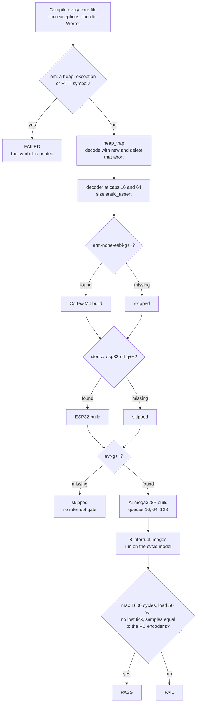

**In depth: the AVR interrupt gate (spec §8.6 B5).** On an Arduino Uno the encoder runs inside the Timer2 interrupt,
8000 times a second (`examples/arduino/tx_uno`). At 16 MHz that leaves **2000 CPU cycles per sample**, and the interrupt
must compute its sample in time and leave room for the sketch's `loop()` (serial input, the queue, the PTT).

- **What runs:** `tests/avr/isr_harness.cpp` is `tx_uno`'s interrupt body, built the way Arduino builds a sketch
  (`avr-g++ -Os -flto -mmcu=atmega328p`), once for each of the 8 cases of `tests/avr/isr_cases.hpp`: the five presets,
  T = 128 ms at 2700 Hz, and N = 1 and N = 32 at 16 ms, each with `tx_uno`'s 100 ms lead-in and 40 bytes.
- **How it is measured:** `tests/avr/isr_cycles.cpp` reads the listing (`avr-objdump`), the flash image
  (`avr-objcopy`) and the symbols (`avr-nm`), and interprets the machine code with the ATmega328P's cycle counts, one
  interrupt per sample, like the timer would call it. Every sample is compared with the PC encoder's. An instruction it
  does not know stops it by name. The images are also scanned for software floating-point routines (`__addsf3`,
  `__mulsf3`, `__divsf3`, `__fixsfsi`, …): the encoder uses integers only.
- **The gate:** the longest interrupt ≤ **1600 cycles** (80 % of a tick, so the next tick is never late by a whole
  tick); the mean load ≤ **50 %**, counted as (mean cycles + 7 to enter the interrupt) ÷ 2000; **no lost tick** (a tick
  that finds the previous one still pending is lost); **0 mismatches** with the PC encoder.
- **Measured here:** max 1,011 cycles (1,008 for N = 1), mean 494 to 628 cycles, load 25.0 to 31.7 %, 0 mismatches,
  0 lost ticks; the same as the release (spec §8.6 B5).

"Max 1,011 of the 1,600-cycle budget" means: the slowest single sample of all eight transmissions took 1,011 cycles,
63 % of what the gate allows; with the 7 cycles to enter the interrupt, 1,018 of the tick's 2,000. On average 68 to
75 % of the CPU is left to the sketch.

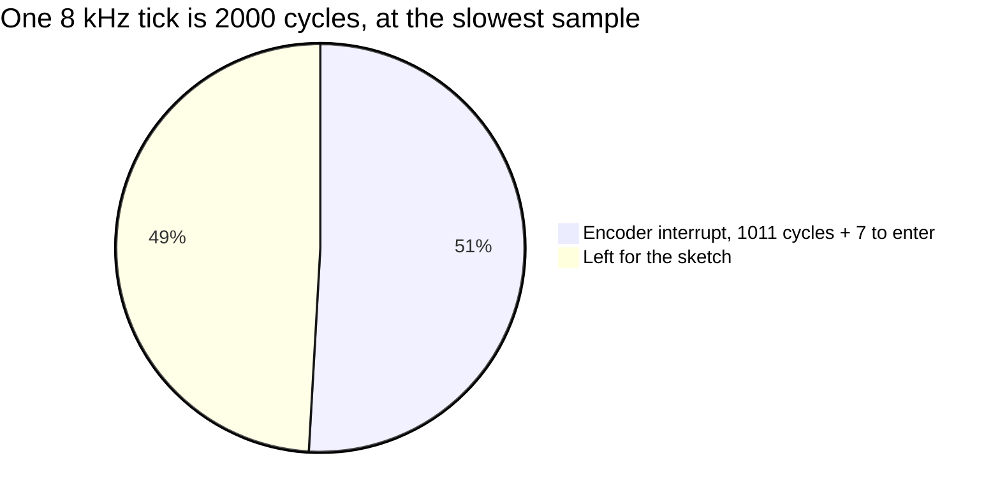

### 7.2 `make arduino_check`

**In plain words.** The four Arduino examples are compiled exactly as the Arduino tools would compile them, with every
warning on: `tx_uno` for the Arduino Uno, the three `*_esp32` examples for the ESP32. Any warning from the library or a
sketch fails the check (the cores' own warnings are ignored), and `tx_uno` must not contain any floating-point
routine: the Uno has no floating-point hardware, and software floating point is too slow for its interrupt.

```bash
make arduino_check
```

```text
  arduino arduino:avr:uno examples/arduino/tx_uno
Sketch uses 9380 bytes (29%) of program storage space. Maximum is 32256 bytes.
Global variables use 535 bytes (26%) of dynamic memory, leaving 1513 bytes for local variables. Maximum is 2048 bytes.
  arduino esp32:esp32:esp32 examples/arduino/loopback_esp32
Sketch uses 339440 bytes (25%) of program storage space. Maximum is 1310720 bytes.
Global variables use 73924 bytes (22%) of dynamic memory, leaving 253756 bytes for local variables. Maximum is 327680 bytes.
  arduino esp32:esp32:esp32 examples/arduino/rx_esp32
Sketch uses 349456 bytes (26%) of program storage space. Maximum is 1310720 bytes.
Global variables use 44492 bytes (13%) of dynamic memory, leaving 283188 bytes for local variables. Maximum is 327680 bytes.
  arduino esp32:esp32:esp32 examples/arduino/wav_sd_esp32
Sketch uses 347106 bytes (26%) of program storage space. Maximum is 1310720 bytes.
Global variables use 23712 bytes (7%) of dynamic memory, leaving 303968 bytes for local variables. Maximum is 327680 bytes.
arduino_check: tx_uno has no float routine
arduino_check: all examples compile warning-free
```

- **Time here:** 70.8 s.
- **Success:** the last line, exit status 0. The flash and RAM use of each sketch is printed (spec §3.15 and
  [README 10.3](../README.md#103-the-arduino-examples) record them).
- **Failure:** a warning in `src/` or `examples/` prints the warning and
  `arduino_check: FAILED (warning above, full log in build/arduino/<sketch>.log)`; a compile error prints the whole
  log; a floating-point routine in `tx_uno` prints its name and
  `arduino_check: FAILED (tx_uno links a float routine, above)`. Without `arduino-cli` the target stops at once with
  `arduino-cli not found`.

**In depth.** For each sketch the target runs `arduino-cli compile` with `--fqbn` (the board), `--warnings all`,
`--library` (this repository) and `--build-path build/arduino/<sketch>`, and keeps its output in
`build/arduino/<sketch>.log`. The warnings are searched for paths inside the repository's `src/` and `examples/`;
`avr-nm` then scans `build/arduino/tx_uno/tx_uno.ino.elf` for the soft-float routines. This covers spec §8.6 B3 and
the linked half of B5.

---

## 8. Demo, table and documentation checks

### 8.1 `make demo_run`

**In plain words.** The two command-line programs are what a user runs first, so they have a contract of their own:
six round trips in which a text goes through `unlimited_encode`, a simulated radio and `unlimited_decode`, and must
come back exactly, with a receiver that is never told the speed or the bits per package; and one configuration the
sender must refuse, because its signal does not fit the receiver's filter (spec §8.2 L14, §7).

| Run | Radio | Sender | Receiver | SNR | Sent at | Mistuning | What it proves |
|---|---|---|---|---|---|---|---|
| `usb_hf` | USB | `hf` | `ssb` | 10 dB | 8000 Hz | +80 Hz | the default preset, found at the mistuned pitch |
| `lsb_hf_fast` | LSB | `hf_fast` | `ssb` | 10 dB | 48000 Hz | −150 Hz after the mirror | the other sideband; a 48 kHz recording resampled to 8 kHz |
| `usb_hf_slow_narrow` | USB, 300–2100 Hz filter | `hf_slow --tone 1200 --passband 300:2100` | `ssb --passband 300:2100` | 8 dB | 8000 Hz | +50 Hz | another pitch in a narrow filter |
| `usb_n32` | USB | `hf --bits 32` | `ssb` | 12 dB | 8000 Hz | +80 Hz | 32 bits per package, and a short last package, learnt by the receiver |
| `am_am` | AM | `am --packet` | `am --packet` | 10 dB (carrier) | 8000 Hz | +80 Hz | an AM radio, and the packet layer's CRC |
| `fm_fm` | FM | `fm` | `fm` | 20 dB (carrier) | 8000 Hz | +80 Hz | an FM radio at the fastest preset |
| refused | – | `hf_fast --passband 1250:1750` | – | – | – | – | 550 Hz of signal in a 500 Hz filter must exit 2 and say "does not fit" |

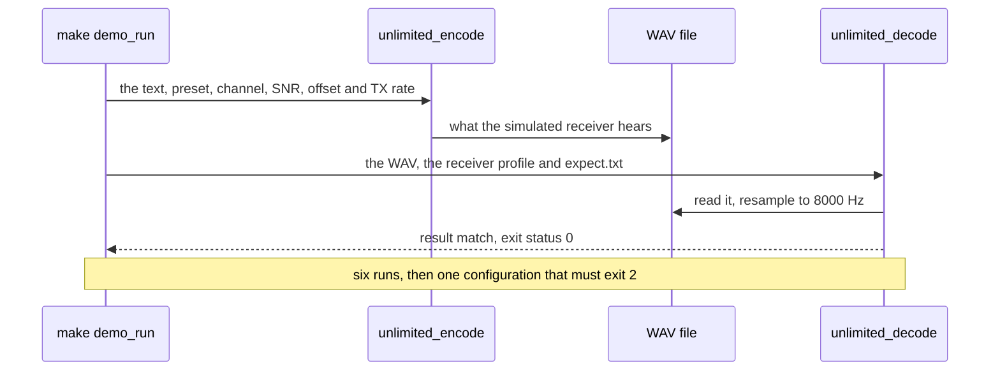

```bash
make demo_run
```

```text
== usb_hf: usb channel, preset hf, receiver profile ssb, SNR 10 dB, offset 80 Hz, TX rate 8000 Hz
data       34 bytes of text
signal     preset hf: pitch 1500 Hz, slot T 16 ms (62.5 baud), N 8 bits per package, 55.6 bit/s net
bandwidth  occupied bandwidth 276 Hz (1362-1638 Hz); passband 300-2700 Hz: fits; shift tolerance -1062/+1062 Hz
emission   -26 dB width 438 Hz, -40 dB width 619 Hz
receivers  heard by the receiver profiles ssb, am and fm
airtime    5.412 s: lead-in 0 ms, tune tone 16 slots, sync 8 markers, 34 packages of 8 bits, END, tail 100 ms
level      crest -3.0 dBFS; the packages' average power is 5.5 dB below the key-down tone
audio      43296 samples at 8000 Hz -> build/demo_run/usb_hf.wav (transmitted audio -> build/demo_run/usb_hf_clean.wav)
channel    usb, SNR 10.0 dB key-down (4.5 dB average power), offset +80 Hz, receiver filter 300-2700 Hz; output gain -2.7 dB
receiver   profile ssb: slots 8-64 ms, passband 300-2700 Hz, pitch search 335-2665 Hz, smart decision line, impulse blanker on
input      build/demo_run/usb_hf.wav: 8000 Hz
locked     t 0.768 s: pitch 1580.0 Hz, T 15.99 ms, N 8 bits per package, 55.6 bit/s, SNR 9.3 dB
bandwidth  occupied bandwidth 276 Hz (1442-1718 Hz); passband 300-2700 Hz: fits; shift tolerance -1142/+982 Hz
rx         34 bytes, end at t 5.357 s (pitch 1580.0 Hz, T 16.00 ms, N 8 bits per package, 55.5 bit/s, SNR 10.4 dB)
text       "CQ CQ DE UNLIMITED TEST 0123456789"
expect     34 bytes x 1 transmission: received 34, lost 0, wrong 0, extra 0, bit errors 0/272 (BER 0.00e+00), locks 1, SNR 10.2 dB, T 16.00 ms, N 8
result     match
== lsb_hf_fast: lsb channel, preset hf_fast, receiver profile ssb, SNR 10 dB, offset -150 Hz, TX rate 48000 Hz
…
== refused: --preset hf_fast --passband 1250:1750 (550 Hz of signal in a 500 Hz passband) must fail with exit code 2
unlimited_encode: occupied bandwidth 550 Hz (1225-1775 Hz); passband 1250-1750 Hz: does not fit (25 Hz below and 25 Hz above the passband)
unlimited_encode: refused: the signal does not fit the receiver's passband: at T = 8 ms it is 550 Hz wide (1225-1775 Hz around the pitch 1500 Hz) and the passband is 1250-1750 Hz, only 500 Hz wide; use longer slots (--slot-ms, or a slower --preset) or a wider --passband (see --help)
demo_run: all round trips decoded exactly; the configuration that does not fit was refused
```

1.1 s here, once the demos were built (`make demo_run` builds them first when needed). How to read one run:

- The first block is the **sender**: the data, the signal (preset, pitch, T, N, net rate), the bandwidth line (does it
  fit the filter, how far can the radio be mistuned), the airtime, and the channel it went through.
- The second block is the **receiver**: its profile, then `locked` with what it measured by itself (here the pitch
  1580.0 Hz, 1500 Hz moved by the +80 Hz mistuning, T 15.99 ms and N = 8), `rx` with the bytes and the END, and the
  `text`.
- `expect` compares with `build/demo_run/expect.txt` (lost, wrong, extra, bit errors); `result match` is the verdict.
  A mismatch prints `result mismatch`, `unlimited_decode` exits 1 and the target fails. The last line appears only
  when all seven parts passed.
- The WAV files stay in `build/demo_run/` (`*.wav` as received, `*_clean.wav` as sent): you can listen to them, or
  watch one decode with `--tui --realtime` ([README 3.4](../README.md#34-watching-it---tui)).

### 8.2 `make tables`

**In plain words.** The encoder makes its beeps from a table of 257 sine values (a quarter of a wave, in 16-bit
fixed point), so that an Arduino needs no floating point. `tools/gen_tables.cpp` computes that table; this check
proves that the table in `src/unlimited/tables.cpp` is exactly what the generator prints, so nobody changed it by hand.

```bash
make tables
```

```text
c++ -O2 -std=c++11 -Wall -Wextra -Wpedantic -Werror -MMD -MP tools/gen_tables.cpp -o build/tools/gen_tables
tables: src/unlimited/tables.cpp is up to date
```

0.4 s here. On a difference it prints a `diff -u` of the table and
`tables: src/unlimited/tables.cpp differs from the tools/gen_tables.cpp output (diff above)`, and fails. The unit
tests `tables_*` (spec §8.1 U1) check the values themselves.

### 8.3 `make docs`

**In plain words.** The pictures of the README and of this guide are not drawn by hand: programs draw them from the
real encoder, channel simulator and decoder (`tools/doc_figures.cpp`), and print the bit-exact protocol examples
(`tools/doc_examples.cpp`, into `docs/protocol_examples.md`). `make docs` runs both. It is also a check: the tools stop
with an error when the library disagrees with an example written in `spec.md`, and the output is **deterministic**,
the same bytes every run, so a figure that changes always means behaviour that changed.

```bash
make docs
```

```text
…
./build/tools/doc_examples > build/docs/protocol_examples.md
./build/tools/doc_figures build/docs/images
slot_shapes.svg: 1, 0, marker and tune slots of hf at 48000 Hz
transmission_timeline.svg: 44 slots, 804 ms
spectrogram_hf.svg: 804 x 153 cells, pitch 1500 Hz, band 1362-1638 Hz, tolerance +-1062 Hz
packing.svg: Hi with N = 8, 4, 3 matches spec 2.2
…
channels.svg: CCIR poor fading             run 0 "__" 0/2 bytes, 0 bit errors, locked 0.0 Hz T 0.00 ms N 0, SNR 0.0 dB; 11/20 runs exact
…
ber_awgn.svg: 2700 jobs in 64.1 s
  hf_slow  1e-3 at: measured -3.20 dB, bound -3.88 dB
     -7.0 dB:   28720 bits,  2003 errors, BER 6.97e-02 (bound 2.07e-02), bytes  14.4%, locks 50/100
…
doc_figures: 10 figures in 64.7 s
docs: docs/images/*.svg and docs/protocol_examples.md regenerated
```

- **Time here:** 67.4 s. The BER figure runs its 2700 jobs on every core.
- **Where things go:** both tools write into `build/docs/` first; only when both succeed are `docs/images/*.svg`
  (stale figures removed) and `docs/protocol_examples.md` replaced. On an error, `docs/` stays as it was.
- **Each line** says what the figure measured on the way, e.g. `packing.svg: Hi with N = 8, 4, 3 matches spec 2.2`.

**Checking determinism.** Save the checksums, regenerate, compare:

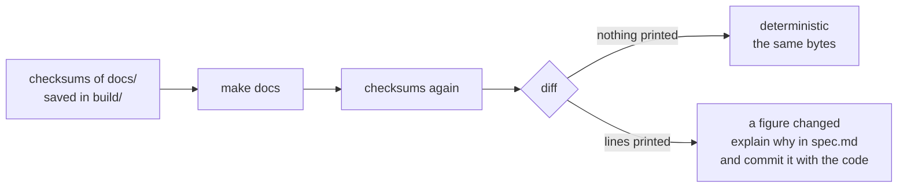

```bash
shasum -a 256 docs/images/*.svg docs/protocol_examples.md > build/docs.sha256
```

```bash
make docs
```

```bash
shasum -a 256 docs/images/*.svg docs/protocol_examples.md | diff build/docs.sha256 - && echo "docs: identical bytes"
```

```text
docs: identical bytes
```

On the machine of this guide `make docs` reproduced the committed files byte for byte, and `git status` stayed clean.
The noise behind the figures follows the standard library (§6.9), so compare runs of the same machine.

**One figure only**, without touching `docs/` (the second argument is a prefix of the figure's name):

```bash
make build/tools/doc_figures
```

```bash
mkdir -p build/figure_check
```

```bash
./build/tools/doc_figures build/figure_check packing
```

```text
packing.svg: Hi with N = 8, 4, 3 matches spec 2.2
doc_figures: 1 figures in 0.0 s
```

```bash
cmp build/figure_check/packing.svg docs/images/packing.svg && echo "packing.svg: same bytes as docs/images"
```

```text
packing.svg: same bytes as docs/images
```

---

## 9. For experts: extending, reproducing, comparing

### 9.1 Adding a unit test

Add a `TEST` to the `tests/test_*.cpp` file of the part it checks: the Makefile picks up every `tests/*.cpp`, and the
file's prefix in the name lets `FILTER` find it. The project's rules apply to tests as well: C++11, `snake_case`,
named constants instead of magic numbers, fixed seeds. This test, compiled outside the repository against the
project's build (`-Werror`), sends 40 random bytes with the `hf` preset through USB noise at 10 dB, mistuned by
+80 Hz:

```cpp
#include "support/loopback.hpp"
#include "test_harness.hpp"

#include <cstdint>
#include <vector>

using namespace unlimited;
using namespace unlimited::loopback;

namespace {

const std::size_t k_example_bytes = 40;
const std::uint32_t k_example_seed = 7;
const double k_example_snr_db = 10.0;
const double k_example_offset_hz = 80.0;
const std::size_t k_example_chunk = 4096;

}  // namespace

// 40 random bytes with the hf preset through USB noise at 10 dB, mistuned by +80 Hz: every byte back, nothing extra.
TEST(decoder_example_hf_usb_10_db) {
    const EncoderConfig config = preset_config(Preset::hf);
    const std::vector<std::uint8_t> data = random_bytes(k_example_bytes, k_example_seed);
    const Recording recording = single(data, config);
    const std::vector<std::int16_t> received =
        usb(recording.samples, k_example_snr_db, k_example_seed, config.amplitude, k_example_offset_hz);
    const Capture capture = run_decoder(received, DecoderConfig::for_profile(Profile::ssb), k_example_chunk);
    const Score s = score(recording, capture);
    NOTE("released %zu of %zu bytes, %zu bit errors, %zu extra, %zu lock(s)", s.bytes_released, s.bytes_sent,
         s.bit_errors, s.extra_bytes, s.locks);
    CHECK_EQ(s.matched, k_example_bytes);
    CHECK_EQ(s.wrong_bytes, 0u);
    CHECK_EQ(s.extra_bytes, 0u);
    CHECK_EQ(s.locks, 1u);
    CHECK_EQ(s.ends, 1u);
}
```

```text
[ RUN  ] decoder_example_hf_usb_10_db
    note: released 40 of 40 bytes, 0 bit errors, 0 extra, 1 lock(s)
[ PASS ] decoder_example_hf_usb_10_db (29 ms)
```

Spec-driven development applies (spec §0.9 D1, D3): the new test and its pass criterion go into spec §8 first, and it
must fail before the change it guards and pass after it.

### 9.2 Adding a long-suite row

A row is a `JobPlan`, run by `run_job()` (or many, by `run_points()`), scored into an `Outcome`, and printed by
`result()`. This sketch, compiled outside the repository against the suite's helpers, is one gated row in the G5
style, with at least 10⁴ bits:

```cpp
#include "regression.hpp"

#include "test_harness.hpp"

using namespace unlimited;
using namespace unlimited::regression;

namespace {

const std::uint32_t k_test_example = 900;  // a test id no other long test uses
const std::size_t k_example_bytes = 200;   // per transmission
const double k_min_bits = 1e4;             // spec 0.8 G5: at least 10^4 bits per row
const double k_margin_db = 3.0;

}  // namespace

// One row: the hf preset at its gate + 3 dB over usb AWGN, one job of 7 transmissions (11,200 bits).
TEST(X1_example_row) {
    const EncoderConfig config = preset(Preset::hf);
    const std::size_t count = transmissions_for(k_min_bits, k_example_bytes);
    const std::uint32_t seed = seed_of(k_test_example, 0, 0);
    JobPlan job;
    for (std::size_t t = 0; t < count; ++t) {
        job.transmissions.push_back(random_tx(config, k_example_bytes, data_seed(seed, t)));
    }
    job.channel.mode = sim::Mode::usb;
    job.channel.snr_db = gate_db(slot_ms_of(config)) + k_margin_db;
    job.channel.seed = seed;
    job.decoders.push_back(receiver_for(config));
    const Outcome o = run_job(job)[0];
    const bool enough_bits = static_cast<double>(o.score.matched * k_bits_per_byte) >= k_min_bits;
    result("X1", format("%s, usb AWGN %+.1f dB (gate + 3)", config_text(config).c_str(), job.channel.snr_db),
           ber_text(o), "BER <= 1e-4, 0 extra, 0 shifted, >= 1e4 bits", near_zero_errors(o) && enough_bits);
}
```

```text
[ RUN  ] X1_example_row
RESULT | X1 | T=16 ms N=8 1500 Hz, usb AWGN +4.5 dB (gate + 3) | BER 0.00e+00 (11200 bits), delivered 100.00%, loss 0.00%, wrong 0, extra 0, locks 7/7 tx, lost-ev 0 (gone 0, alias 0, preamble 0, unsupported 0) | BER <= 1e-4, 0 extra, 0 shifted, >= 1e4 bits | PASS
[ PASS ] X1_example_row (742 ms)
```

To make it part of the suite:

- Put the function in the `tests/long/regression_*.cpp` file of its family, declare it in `regression.hpp`, and
  register its `TEST` in `regression_suite.cpp`. The registration order is the run order; a test whose rows feed F5 or
  F6 (`ledger_packets()`, `ledger_runs()`) must come before them.
- Give it a test id no other test uses (§6.9) and append new rows at the end of an existing list: the other rows keep
  their seeds, so a before-and-after comparison still lines up.
- Real rows send far more than one job: build the jobs with `transmissions_per_job()` and run them with
  `run_points()`, which spreads them over every core.
- The row, its gate and its reason go into spec §8.3 to §8.5 first; the gate is Gustavo's decision (spec §0.8).

### 9.3 The loopback helpers

`tests/support/loopback.hpp`, shared by the unit tests, the long suite and `tools/doc_figures.cpp`:

| Function | What it gives |
|---|---|
| `random_bytes(count, seed)` | reproducible random bytes |
| `preset_config(preset)`, `slot_config(slot_ms, bits, tone_hz)` | an `EncoderConfig` at 8000 Hz; `slot_config` widens the passband to 100–3000 Hz when the band needs it |
| `encode(data, config)` | one whole transmission as int16 samples |
| `single(data, config, silence_ms)`, `append_silence()`, `append_transmission()` | a `Recording`: samples plus where each transmission starts |
| `slot_start_sample()`, `first_start_slot()`, `package_count()`, `stop_slot()`, `end_slot()`, … | the slot layout of a transmission, for tests that edit single slots |
| `scale_slot(recording, transmission, slot, gain)` | fades one slot (0 erases a marker): how L6, L7, L8 and L10 fade markers and packages |
| `usb(samples, snr_db, seed, amplitude, offset_hz)`, `through_channel(samples, config, amplitude)` | the channel simulator on int16 audio |
| `channel_delay_samples(mode)` | the channel filter's delay, to compare event times |
| `run_decoder(samples, config, chunk)` | the decoder's events, each with its sample position (chunk 0: one sample at a time, exact positions) |
| `score(recording, capture)`, `map_events()`, `count_events()` | the counts of §1, per transmission and per byte |

### 9.4 The channel simulator's knobs

`sim::ChannelConfig` (`pc/channel.hpp`; its physics are tested by the 35 `channel_*` unit tests). From the command
line, the demos expose the same knobs ([README 9.3](../README.md#93-the-channel-simulator)).

| Field | Default | What it does |
|---|---|---|
| `mode` | `usb` | `clean`, `usb`, `lsb`, `am`, `fm` |
| `sample_rate` | 8000 | the audio rate in and out |
| `signal_level` | 0.5 | the key-down tone's amplitude at the input: the SNR reference |
| `noise`, `snr_db` | on, 20 | white noise; SNR in 2500 Hz (the key-down tone for usb and lsb, the carrier for am and fm) |
| `freq_offset_hz` | 0 | usb, lsb: the receiver's mistuning; am, fm: the carrier's offset |
| `lsb_pivot_hz` | 3000 | lsb mirrors the audio: f → pivot − f + offset |
| `rx_low_hz`, `rx_high_hz` | 300, 2700 | the receiver's audio filter (−6 dB points) |
| `fading`, `doppler_spread_hz`, `path_delay_ms`, `path2_gain_db` | off, 0.5, 1.0, 0 | the Watterson two-path model; `apply_preset()` sets CCIR good, moderate, poor, flutter or flat |
| `impulse_rate_hz`, `impulse_level_db` | 0, 20 | static crashes (QRN), Poisson arrivals |
| `agc`, `agc_attack_ms`, `agc_decay_ms`, `agc_target` | off, 2, 500, 0.5 | a receiver's AGC |
| `am_modulation_index`, `am_if_bandwidth_hz` | 0.8, 6000 | AM |
| `fm_deviation_hz`, `fm_max_deviation_hz`, `fm_if_bandwidth_hz`, `fm_emphasis_us`, `fm_tx_preemphasis`, `fm_rx_deemphasis`, `fm_audio_high_hz` | 3000, 5000, 12500, 750, on, on, 3000 | FM: deviation, limiter, IF, the 750 µs emphasis at each end |
| `carrier_hz`, `carrier_db` | 0 (off), −200 | a steady carrier at an audio frequency and a level relative to the tone |
| `cw_hz`, `cw_db`, `cw_wpm` | 0 (off), −200, 20 | keyed Morse |
| `qsb_depth_db`, `qsb_rate_hz` | 0, 0.2 | slow fading of the signal |
| `clock_ppm` | 0 | the sender's sample-clock error (resampled; use the vector `process()`) |
| `output_gain` | 1.0 | output scaling |
| `seed` | 1 | the noise and fading seed |

`fm_cnr_db(config)` gives the CNR of an FM configuration; the long suite converts with `snr_for_fm_cnr()` and
`snr_for_am_cnr()`.

### 9.5 Statistics of the gates

- **BER is a count.** k bit errors in n bits: the suite prints the upper 95 % confidence bound as `BER95`, (k + 1.96√k
  + 1.96²/2) ÷ n, or 3 ÷ n when k = 0 (`upper_95()`). The A1 `hf` row: 9 errors in 204,768 bits, BER 4.40e-5, BER95
  ≤ 8.2e-5.
- **Why at least 2·10⁵ bits per AWGN point** (spec §8.3): at the promised 1e-3 that is about 200 errors, enough to
  tell 1e-3 from 1.2e-3. With **0 errors** in n bits the most one can claim is BER ≤ 3/n (the "rule of three"):
  1.5e-5 after 204,800 bits, 1.25e-4 after 24,000, 3e-4 after 10⁴.
- **Why zero-error gates fail by chance:** with a true error rate p, the chance of at least one error in n bits is
  1 − (1 − p)ⁿ ≈ 1 − e^(−np). At a few 1e-6 per bit and 10⁴ to 3.6·10⁴ bits per row, spec §11.1 (question 14)
  estimates such a gate fails about once per hundred rows: hence G5 (§6.8).
- **Acquisition gates** are proportions: A3 asks at least 99 % of 400 transmissions at the gate (4 misses allowed)
  and 90 % of 300 at gate − 2 dB (30 allowed), for messages of at least 8 packages (spec §0.8 G2).
- **Paired ratios:** C7 (BER with AGC ≤ 2 × without) and C13 compare the same audio, the same seeds, with and without
  the AGC; C2's ablation runs a "genie" receiver with known timing on the same audio (spec §4.2).
- **Runs of wrong bytes (F6):** noise damages bytes independently; more than 8 wrong bytes in a row is the signature
  of a lock at a wrong T or N, so F6 gates it at ≥ gate + 3 dB and reports it below.
- **The SNR report (A4)** must be within ±1.5 dB of the truth, on average, from the gate to gate + 20 dB.

### 9.6 Reproducing a row from its seed

1. **Run the test again** with `FILTER` (§6.3): on the same machine the row comes back identical (§6.9).
2. **Find the job.** The row's seeds are `seed_of(test id, point, job)` for each of its jobs (§6.9); the test's
   source file builds the `JobPlan` of each job.
3. **Rebuild its audio** exactly as `run_job()` hears it, and write it to a WAV file. This probe, built against the
   suite's helpers and `pc/wav`, does it for job 0 of the X1 row of §9.2:

```cpp
// Rebuilds the audio of one long-suite job from its seed, exactly as run_job() hears it, and writes it to a WAV file
// that unlimited_decode (or --tui --realtime) can replay.
#include "regression.hpp"
#include "wav.hpp"

#include <cstdio>
#include <string>
#include <vector>

using namespace unlimited;
using namespace unlimited::regression;

namespace {

const std::uint32_t k_test_example = 900;  // the X1 example row: test id, point 0, job 0
const std::uint32_t k_point = 0;
const std::uint32_t k_job = 0;
const std::size_t k_example_bytes = 200;
const double k_min_bits = 1e4;
const double k_margin_db = 3.0;
const double k_int16_scale = 32768.0;

}  // namespace

int main(int argc, char** argv) {
    if (argc != 2) {
        std::fprintf(stderr, "usage: probe_job OUT.wav\n");
        return 2;
    }
    const EncoderConfig config = preset(Preset::hf);
    const std::size_t count = transmissions_for(k_min_bits, k_example_bytes);
    const std::uint32_t seed = seed_of(k_test_example, k_point, k_job);
    JobPlan job;
    for (std::size_t t = 0; t < count; ++t) {
        job.transmissions.push_back(random_tx(config, k_example_bytes, data_seed(seed, t)));
    }
    job.channel.mode = sim::Mode::usb;
    job.channel.snr_db = gate_db(slot_ms_of(config)) + k_margin_db;
    job.channel.seed = seed;

    // The recording as run_job() builds it: quiet lead, transmissions separated by gaps, quiet tail.
    loopback::Recording recording;
    loopback::append_silence(recording, job.lead_ms);
    for (std::size_t t = 0; t < job.transmissions.size(); ++t) {
        loopback::append_transmission(recording, job.transmissions[t].data, job.transmissions[t].config);
        loopback::append_silence(recording, t + 1 < job.transmissions.size() ? job.gap_ms : job.tail_ms);
    }
    const std::vector<std::int16_t> received =
        apply_channel(recording.samples, job.channel, config.amplitude, job.peak_factor);

    std::vector<float> audio(received.size());
    for (std::size_t i = 0; i < received.size(); ++i) audio[i] = static_cast<float>(received[i] / k_int16_scale);
    std::string error;
    if (!wav::write_wav(argv[1], audio, config.sample_rate_hz, error)) {
        std::fprintf(stderr, "probe_job: %s\n", error.c_str());
        return 1;
    }
    std::printf("probe_job: seed %u, %zu transmissions, %.1f s of audio -> %s\n", seed, count,
                static_cast<double>(received.size()) / config.sample_rate_hz, argv[1]);
    return 0;
}
```

Saved as `build/probe_job.cpp` (inside the git-ignored `build/` folder), it compiles against the objects that
`make test_long` builds (a `FILTER` run is enough) and runs from the repository's root folder:

```bash
c++ -O2 -std=c++11 -Wall -Wextra -Wpedantic -Werror -Isrc -Ipc -Itests -Itests/long build/probe_job.cpp build/tests/long/regression_support.o build/tests/support/loopback.o build/pc/channel.o build/pc/resampler.o build/pc/wav.o build/libunlimited.a -o build/probe_job
```

```bash
./build/probe_job build/x1_job0.wav
```

```text
probe_job: seed 900002701, 7 transmissions, 217.2 s of audio -> build/x1_job0.wav
```

4. **Replay it** with the demo decoder, which prints every lock, byte count and END (add `--tui --realtime` in a
   terminal to watch the packages against their reference and decision lines):

```bash
./bin/unlimited_decode --in build/x1_job0.wav
```

```text
receiver   profile ssb: slots 8-64 ms, passband 300-2700 Hz, pitch search 335-2665 Hz, smart decision line, impulse blanker on
input      build/x1_job0.wav: 8000 Hz
locked     t 2.268 s: pitch 1500.0 Hz, T 16.01 ms, N 8 bits per package, 55.5 bit/s, SNR 3.6 dB
bandwidth  occupied bandwidth 276 Hz (1362-1638 Hz); passband 300-2700 Hz: fits; shift tolerance -1062/+1062 Hz
rx         200 bytes, end at t 30.761 s (pitch 1500.0 Hz, T 15.99 ms, N 8 bits per package, 55.6 bit/s, SNR 5.1 dB)  blanked
text       "\x8BLRS\x1B\x17\xC5\xD5…
…
```

It locks 7 times and releases 200 bytes each time: the job's 7 transmissions. The seed 900002701 is
900 × 1,000,003 + 0 × 10,007 + 0 + 1. The recording starts with 1.5 s of quiet, so the first lock comes after the tune
tone and sync train of the first transmission. The probe leaves out what `run_job()` adds
for some rows: a receiver clock error (`rx_ppm`, resampled after the channel) and the genie receiver of C2.

### 9.7 Before and after a change

**In plain words.** A change to the receiver or the signal is done only when its effect is measured: the same rows
before and after, compared line by line (spec §0.9 D3: "no row may regress"). Because the suite is deterministic, an
unchanged row means an unchanged behaviour for that condition, and a changed row is something to explain.

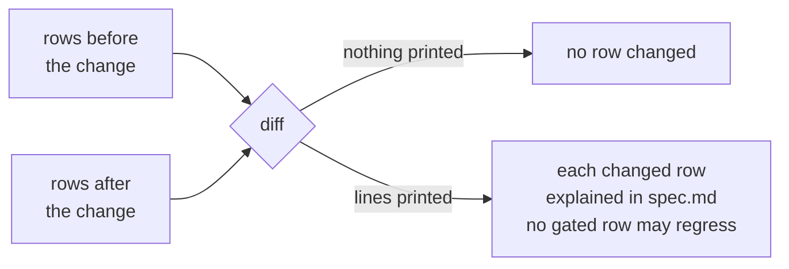

With one test (here L5; drop `FILTER=…` for the whole suite, about 9 minutes each run):

```bash
make test_long FILTER=L5_clock > build/l5_before.log 2>&1
```

Then change the code, and:

```bash
make test_long FILTER=L5_clock > build/l5_after.log 2>&1
```

```bash
grep '^RESULT' build/l5_before.log > build/l5_before.rows
```

```bash
grep '^RESULT' build/l5_after.log > build/l5_after.rows
```

```bash
diff build/l5_before.rows build/l5_after.rows && echo "no row changed"
```

```text
no row changed
```

(Run here twice on the same code: every row identical.) For the whole suite, compare the summary blocks
(`sed -n '/^==== long regression summary/,$p'`, §6.10) so that each row appears once. A real example of such a
comparison is in spec §9.5: between the release run and the freeze run, 64 rows changed only their gate text and one
row its verdict (the L19 row of §6.8, FAIL to PASS under G5); every measured number stayed identical.

---

## 10. Troubleshooting

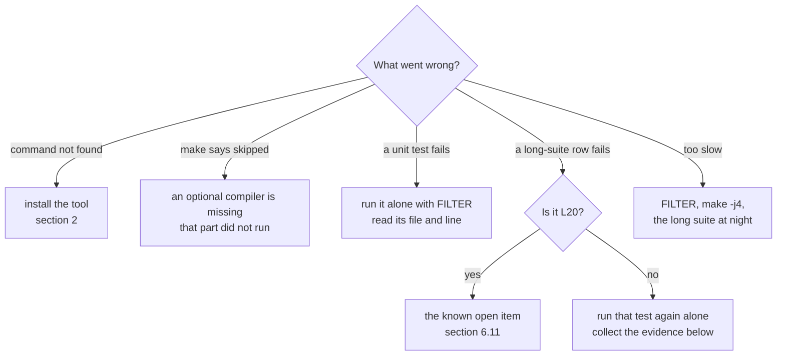

| Symptom | What it means | What to do |
|---|---|---|
| `c++: command not found`, `make: command not found` | no compiler tools | [§2.3](#23-installing) |
| `check_embedded: … not found, skipped` | an optional cross compiler is missing: that build (for AVR, also the interrupt gate) did not run, yet the target passes | install `arduino-cli` and its cores (AVR, ESP32), or put the compiler on the `PATH` (ARM) |
| `arduino-cli not found`, then a make error | `make arduino_check` needs `arduino-cli` | install it ([§2.3](#23-installing)), or leave this target out |
| `no test matches the filter` | no test name contains the word | list the names: `grep -h '^TEST(' tests/*.cpp`, or `tests/long/regression_suite.cpp` |
| more tests ran than you wanted | `FILTER` matches substrings: `C1` also matches C10–C15 | use a longer piece: `C1_` |
| `REQUIRE(!ledger.empty()) failed` in F5 or F6 | they were run without the tests that feed them | run the whole suite ([§6.3](#63-running-one-test-filter)) |
| a unit test FAILs | a promise of the code is broken | run it alone; the `file:line` message names the check; its pass criterion is in spec §8.1 or §8.2 |
| a long-suite row FAILs, not L20 | a regression, or a new limit reached | run its test alone to see that it repeats; collect the evidence below |
| the long-suite numbers differ from spec §4 on Linux | another standard library draws other noise ([§6.9](#69-seeds-determinism-and-parallelism)) | expected; the gates must still hold |
| `make docs` changed a figure | the behaviour changed, or the machine's standard library differs | `git status --short docs/`; explain the change in `spec.md` and commit the figures with the code |
| a sanitizer report | a memory error or undefined behaviour | the first report stops the program, with a stack trace; fix the first one first |
| the long suite is too slow | it uses every core for about 9 minutes on a 10-core M4 | run it at night or in the background (at a lower priority with `nice`); use `FILTER` for the family you work on |

**What to collect for a failing row.** The row itself (copy the whole line), the full log, the exact code and machine:

```bash
git rev-parse HEAD
```

```bash
git status --short
```

```bash
c++ --version
```

```bash
uname -sm
```

```bash
sysctl -n hw.ncpu
```

(On Linux, `nproc` gives the number of cores.) With the row's test name, its seeds are known (§6.9), and §9.6 turns
any of its jobs into a WAV file to replay.

---

## 11. Words used in this guide

| Word | Meaning |
|---|---|
| **Acausal byte** | a byte released before the STOP of its package was received: only possible when it was placed at a wrong offset |
| **AWGN** | additive white Gaussian noise: plain hiss, the reference channel |
| **BER, BER95** | bit error rate of the released bits; BER95 is its upper 95 % confidence bound |
| **Channel simulator** | `sim::Channel` in `pc/`: the radio path in software (noise, fading, mistuning, interference, AM, FM, AGC, clock error) |
| **CHECK, REQUIRE, NOTE** | the harness's checks: a failed CHECK is recorded and the test goes on; a failed REQUIRE ends it; NOTE prints a measured value |
| **CNR** | carrier-to-noise ratio in a receiver's IF bandwidth (6 kHz AM, 12.5 kHz FM) |
| **Cold late join** | joining a transmission already running, without having heard its start; allowed when N is a multiple of 8 (L20) |
| **Cycle model** | `tests/avr/isr_cycles.cpp`: an ATmega328P interpreter that counts the cycles of the encoder's interrupt |
| **Delivered, lost, wrong, extra, shifted** | the byte counts of [§1](#1-the-idea-in-one-picture) |
| **Deterministic** | the same inputs give the same bytes out: the same rows, the same figures |
| **Exit status** | the number a program returns: 0 for success ([§3.3](#33-success-and-failure-in-one-place)) |
| **FILTER** | the words that choose which tests run: a test runs when its name contains one of them |
| **Gate, gate + 3** | the limit the spec sets for a row; for SNR, the promised SNR of a slot length, and 3 dB above it |
| **Harness** | `tests/test_harness.hpp`: the test framework of both suites |
| **Heap trap** | `tests/embedded/heap_trap.cpp`: a decode with `new` and `delete` that abort the program |
| **ISR** | interrupt service routine: the function the timer runs 8000 times a second on the Uno |
| **Job** | one recording of a row: transmissions with quiet between them, one channel, the row's receivers |
| **Key-down** | a steady beep at full crest; the SNR convention uses its power |
| **Ledger** | what the A, C, F and L5 tests record for F5 and F6 to check at the end |
| **Loopback** | encode, pass through a channel (or none), decode, compare: `tests/support/loopback.*` |
| **PASS, FAIL, REPORT** | the verdict of a row: the gate holds; it does not; there is no gate |
| **Point** | a row's condition as the code builds it; its index in its test's list is part of its seed |
| **(prov.)** | a provisional gate: it may only be tightened |
| **Row** | one `RESULT` line: one measured condition |
| **Sanitizer** | a compiler option that builds memory and undefined-behaviour checks into the program |
| **Seed** | the number a random generator starts from: the same seed, the same draw |
| **SNR** | the key-down tone's power over the noise in 2500 Hz |

For the radio and modem words (marker, package, preset, profile, passband, QSB, CCIR, …) see the
[README glossary](../README.md#14-glossary) and spec §14.
