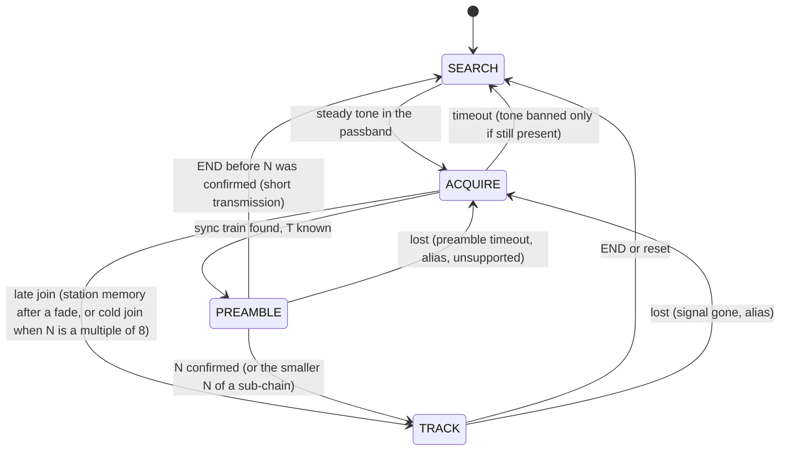

# Unlimited — Specification (SDD)

**What Unlimited is.** Unlimited sends data through the audio of an ordinary radio — HF SSB (USB or LSB), AM, or
VHF/UHF FM — as a string of short beeps on **one pitch**. In each time slot the sender either plays a beep (a **1**)
or stays silent (a **0**). Special beeps carrying an inaudible **twist** (START and STOP markers) frame every
**package** of bits and tell the receiver both the timing and how loud a "1" is right now. The sender chooses the
pitch, the speed (slot length) and how many bits go between START and STOP; the receiver needs none of this: it
finds the pitch, measures the speed and counts the bits per package by itself. The C++11 core runs on a PC and on
microcontrollers (Arduino/AVR sends; ESP32/STM32 receive and send).

**Status (2026-09-27): v0.3 released as library version 0.3.0: implemented, measured and documented. The public
API is frozen for v0.3 (§5.4): the same day Gustavo confirmed the gate decisions of §0.8, turned the zero-error gates
into BER ≤ 1e-4 gates (G5) and froze the API (§11.1 questions 13–15).**
- v0.3 is Gustavo's original design (v0.1: one bit per tone), made configurable (bits per package, slot length,
  pitch, receiver speed window, passband) and faster by default.
- **Implemented:** the core (`src/`), the demos, the TUI and the Arduino examples. `make test` passes 219 of 219
  (187 core tests, 32 TUI and demo tests), and `make check_embedded`, `make arduino_check` and `make demo_run` pass.
  No public API signature changed against the design; three functions were added for the truthful shift tolerance
  (§0.7 A9) and two constants for the receiver's speed window (§0.7 A8, §5.2).
- **Measured:** the long regression suite (`make test_long`, §8.3–§8.5, 8.5 minutes on 10 cores) on the final
  decoder: 31 tests, 30 pass; 370 result rows: 260 PASS, 20 FAIL, 90 REPORT. The 20 FAILs are L20 (cold late joins
  slower than 6 packages, an open defect, §11.2). No gate asks for literally 0 bit errors any more (§0.8 G5): the L19
  row with one AWGN bit error in 24,000 bits at gate + 3 dB now passes. No byte was released at a wrong position in
  any lock, no CRC-valid wrong packet was delivered, and noise, carriers, keyed CW and speech made no false lock
  (§4.3). BER at the gates and the fading floors are v0.1b's.
- The implementation found places where the design's rules contradicted each other or could not work as written,
  and the first long-suite run found integrity defects (bytes at wrong positions, false locks) that the integrity
  fix of 2026-09-27 removed. The rules in this file are the implemented ones; each change and its reason is in §0.7,
  the gate decisions in §0.8, the open problems in §11.2.
- `README.md` and `docs/` describe v0.3.
- v0.2 (several bits per beep, on many pitches) is **dropped**; its code, spec and results stay on branch/tag
  `v0.2-mfsk`.
- Evidence: the v0.1 implementation (v0.1b: 174 unit tests, long suite 23 of 27 suites passing) measured this very
  waveform with 8 bits per package at slot lengths 4..128 ms, the baseline for v0.3's HF presets, which also use 8
  bits per package. The v0.3 long suite measured every preset again (§4, §9). Everything new in v0.3 is marked
  **new** and has a test in §8.

This file is normative: every change to behaviour, API, layout or tests is recorded here first (Spec-Driven
Development). Where this file and the code disagree, the disagreement is a defect to be resolved here first.

**Repository:** github.com/solariun/unlimited (public), MIT license, Copyright (c) 2026 Gustavo Campos.

### Changelog

| Date | Change |
|---|---|
| 2026-09-25 | v0.1: initial spec (design panel of 3 proposals and 2 judges, synthesis) and Gustavo's decisions; §12 (`unlimited_modem` with KISS serial, full documentation) scheduled after the core API is stable. |
| 2026-09-25 | v0.1 implemented (snapshot v0.1b: 174 unit tests; long suite: A1–A4, C1–C6, C9–C15, F1, F2, F5, F6 pass; C7, C8, F3, F4 open). Packet LEN became 16-bit. |
| 2026-09-26 | v0.2: several bits per beep on a grid of pitches (MFSK) with a mode header; implemented, hardened and frozen. **Dropped the same day by Gustavo**; kept on branch/tag `v0.2-mfsk`. |
| 2026-09-26 | **v0.3 specified** (Gustavo's decisions, §0.2): back to one bit per slot on one pitch; bits per package N chosen by the sender (1..cap; default 8 on HF, 16 on AM/FM); slot length T 4..128 ms (default 16 ms); pitch 300..2700 Hz (default 1500 Hz); the receiver learns T and N; configurable receiver window (`min_slot_ms`, default 8 ms: 8..64 ms); smart decision line by default, fixed 70 % selectable; bandwidth awareness (occupied band, passband fit, mistuning tolerance). v0.2's general improvements kept (§0.4). New public headers (§5). |
| 2026-09-26 | Gustavo: a receiver that missed the preamble joins a running transmission when N is a multiple of 8 (cold late join, §3.12, V7, test L20); other N wait for the next transmission. |
| 2026-09-26 | **v0.3 implemented** (core: 179 unit tests, ASan + UBSan clean, `check_embedded`; apps: `make test` 210/210, `demo_run`, `arduino_check`). This file brought in line with the code: the implementation's decisions and their reasons (§0.7: sync, preamble, TRACK, search and joins, demos); the rules as implemented (§3.4, §3.6–§3.13; V2, V4, V11, V14, V16); every named constant with its value from the code (§3.14); measured sizes and CPU (§1.6, §1.8, §3.15); measured gate results (§4; long suite pending); the `dsp.hpp` listing regenerated (§5.3); the TUI (§6.5) and demos (§7) as built; the tests with their function names and the adapted criteria of L6, L7, L8, L9, L10, L17, L19, L20, R8, U8, U26, U27 (§8); open problems (§11.2). |
| 2026-09-26 | `README.md` and `docs/` rewritten for v0.3 (the figures and bit-exact examples generated from the library by `make docs`). First long-suite run on v0.3: 234 PASS / 42 FAIL / 102 REPORT of 378 rows; it found bytes released at wrong positions (535 in 11 locks), a wrong-N cold join and false locks on keyed CW and speech. |
| 2026-09-27 | **v0.3 release** (library version 0.3.0). The integrity fix of the decoder (§0.7 I20–I28: a sync must follow a tune; the train closes at its gap; a short END needs package 0; no rival package length for a cold join; the beep-shape guard; twisted packages are erasures; confirmation releases up to the newest STOP; the guard's inner-flip limit follows N) with 7 regression tests. The truthful shift tolerance (§0.7 A9, §1.5): `search_range(passband, min_slot_us)`, `passband_fit(tone_hz, slot_us, passband, search)` and `search_range(const EncoderConfig&)` added; `passband_fit(const EncoderConfig&)`, the bandwidth line of the demos, the TUI, `tx_uno` and `rx_esp32` limited to the receiver's pitch search; L19 shifts each side by its printed tolerance − 10 Hz. Gate decisions G1–G4 (§0.8: C11, A3, C8, L20). Stale comments fixed (`event_flag_late_join`, `dsp.hpp`). The long suite measured on the final decoder (§4, §8): 259 PASS / 21 FAIL / 90 REPORT of 370 rows; §5 listings regenerated from the headers; README refreshed. |
| 2026-09-27 | **Gustavo's decisions** (§0.8, §11.1): G1–G3 kept and G4 confirmed (L20 stays gated, an open defect); **G5**: every long-suite gate that asked for 0 bit errors (L5, L19, C10 and C15 from CNR 8 dB) asks for BER ≤ 1e-4 with 0 extra and 0 shifted bytes, on the same bits; the receiver's speed-window limits exported (§0.7 A8: `k_min_window_slot_ms` = 4, `k_max_window_slot_ms` = 32 in `protocol.hpp`), used by `DecoderConfig::check()`, the demos' messages and `--help`, and the tests (the open problem "`min_slot_ms` range not public" removed from §11.2, the two after it renumbered P6 and P7). The long suite run again: 260 PASS / 20 FAIL (L20) / 90 REPORT of 370 rows (§4, §8). |
| 2026-09-27 | **API freeze v0.3** (§5.4, Gustavo). The v0.3 public headers are frozen as listed in §5 (library version 0.3.0). Public API added since the first v0.3 headers (2026-09-26): `search_range(const Passband&, uint32_t min_slot_us)` and `passband_fit(uint16_t tone_hz, uint32_t slot_us, const Passband& passband, const Passband& search)` (`protocol.hpp`), `search_range(const EncoderConfig&)` (`encoder.hpp`), `k_min_window_slot_ms` and `k_max_window_slot_ms` (`protocol.hpp`); `passband_fit(const EncoderConfig&)` limits its margins to that search (§0.7 A9); `passband_fit(const Band&, const Passband&)` is the pure filter fit. §5 listings regenerated from the headers and checked line by line. |

### How to read this document

- Every section starts with **In plain words**: what the thing is and why, with a small picture. **Exact rules**
  follow: formulas, constants and bit-exact behaviour for engineers and implementers.
- Every term is defined where it first appears and again in the glossary (§14).
- Values marked *measured* come from runs (§9); *expected* values are predictions that the tests of §8 must confirm.
- "Must", "never" and "always" are normative. Named constants (`k_...`) are the ones in the code.

---

## 0. Decisions

### 0.1 The idea in one picture

The text "Hi" (bytes 0x48 0x69) sent with the default HF preset (8 bits per package, slot T = 16 ms, pitch 1500 Hz):

```
 time →   each symbol is one slot of T = 16 ms; everything is on the same 1500 Hz pitch

 ▁▁▁▁▁▁▁▁  ◆ ◆ ◆ ◆ ◆ ◆ ◆ ◆  □ ■ □ □ ■ □ □ □  ◆  □ ■ ■ □ ■ □ □ ■  ◆  ◆ ◆   (silence)
 tune      sync train    ▲  0 1 0 0 1 0 0 0  ▲  0 1 1 0 1 0 0 1  ▲  END
 tone      (gives T)     │  package 0 = 0x48 │  package 1 = 0x69 │  then tail
 256 ms                START           STOP = START             STOP

 ▁ steady tone     ■ beep = 1     □ silence = 0     ◆ marker: the same beep with the twist
```
(The tune tone is 16 slots long; it is drawn shorter.)

- The **tune tone** lets the receiver find the pitch and lets the radio settle (ALC, VOX).
- The **sync train** is a run of markers one slot apart: the receiver measures the slot length T from it. Its last
  marker is the first START.
- Each **package** is START, N bits, STOP. The STOP of one package is the START of the next.
- **END** is two more markers after the last STOP. Then silence.

### 0.2 Gustavo's decisions for v0.3 (2026-09-26)

All confirmed with Gustavo in plain language with pictures. The bandwidth and bits-per-package updates (rows 10 and
3) arrived later the same day and supersede the earlier default of 4 bits per package.

| # | Decision | In plain words: why |
|---|---|---|
| 1 | **One pitch for everything**, `tone_hz` 300..2700 Hz, default 1500 Hz. A beep in a slot = 1, silence = 0. Bits are sent **one after another in time** ("Option A"), never several pitches at once. | The simplest signal there is: every beep looks the same, it fits any radio's audio, and it is easy to see, hear and debug. |
| 2 | **START and STOP are beeps on the same pitch with the same height**, carrying the inaudible mid-slot phase flip (the **twist**), so they can never be confused with a data 1. The STOP of a package is the START of the next one. | The markers sit right next to the bits they frame, so they tell the receiver exactly how loud a "1" is and where the slots are, even while the signal fades. Sharing START/STOP saves one slot per package. |
| 3 | **A package = START + N bits + STOP.** N (bits per package) is chosen by the sender, 1..cap (`UNLIMITED_MAX_BITS_PER_PACKAGE`, at least 16). **Defaults: N = 8 on the HF presets, N = 16 on the AM/FM presets.** Bits form one continuous stream, most significant bit first, so a byte may span two packages; the last package carries only the bits that remain (no padding). | More bits per package = fewer START/STOP tones, a little faster. Fewer bits per package = the receiver re-checks timing and level more often, more robust in fading. |
| 4 | **Slot length T** (the time from one beep to the next; it sets the speed) is chosen by the sender: 4..128 ms, default 16 ms. 4 ms only on FM-like channels; HF multipath limits HF to about 8 ms and slower. | A longer slot collects more energy per bit (+3 dB per doubling) but gives fading more time to change the signal between markers. On HF the echoes of the ionosphere smear short slots. |
| 5 | **The receiver needs no setting of speed or N.** It learns T from the sync train, then learns N by counting the slots between the first START and STOP (N = round(span / T) − 1), confirms it on the next package, and refines T on every package as T = (t_STOP − t_START)/(N + 1). | Plug and play: one receiver hears any sender in its speed window; the sender can change speed or package length without telling anyone. |
| 6 | **The receiver listens to an 8-to-1 range of slot lengths**, configurable: `DecoderConfig::min_slot_ms`, range `min_slot_ms` .. 8 × `min_slot_ms`, default 8 ms (8..64 ms). | A slow signal with missing tones can look like a fast one, so one receiver cannot cover every speed. Inside an 8:1 window the look-alikes cannot both fit (§1.4). |
| 7 | **Decision line: the smart line is the default.** It sits between 50 % and 75 % of the START→STOP **reference line** (about 70 % on weak signals) and never below the noise floor. Gustavo's fixed 70 % rule is a setting (`DecisionMode::fixed_ratio`, `fixed_ratio` = 0.70). The reference line is drawn from the START crest to the STOP crest across the package. | Measured: the smart line is within 0.1 dB of the best possible detector; the fixed 70 % line costs about 4 dB. The line follows the markers, so a fading signal is still read right. |
| 8 | **Preamble and end:** lead-in silence (0 on SSB, 300 ms typical on FM), **tune tone** ≥ 250 ms on the same pitch, **sync train** of 8 markers (configurable 8..32), **END** = 2 markers after the last STOP, tail silence. | Everything stays on the one pitch, so the whole transmission fits inside the 3000 Hz audio window. |
| 9 | **Sender presets** (all at 1500 Hz): `hf_slow` 32 ms, `hf` 16 ms (the default), `hf_fast` 8 ms — N = 8; `am` 8 ms and `fm` 4 ms — N = 16. | Named starting points for the common radios; every field stays configurable. Rates in §1.7. |
| 10 | **Bandwidth awareness.** The API computes how much bandwidth a configuration occupies, whether it fits a given receiver passband (SSB filters differ: 1.8, 2.4, 2.7, 3.0 kHz; AM/FM receivers pass wider audio), and how far the radio may be mistuned before the signal leaves the passband or the receiver's pitch search (§1.5). The sender refuses a configuration that does not fit (`ConfigError::outside_passband`); the receiver searches only its passband. Demos and the modem print it and accept `--passband LO:HI`. | Users pick a speed and see at once whether it fits their radio's filter and how much tuning error it tolerates. |
| 11 | **Future, not v0.3:** a multi-station receiver that listens to several pitches side by side (like the FT8 waterfall); FEC; the `unlimited_modem` KISS TNC phase (§12). | Kept on the roadmap (§13). |

**Standing requirements** (from v0.1 and Gustavo's standing rules): HF SSB first, USB or LSB, any tuning shift inside
the passband; the receiver never expects a specific pitch; code simple and readable for Arduino, STM32 and ESP32;
C++11; no heap, exceptions, RTTI or STL in the core; documentation accessible first, complete after.

### 0.3 Design decisions carried from v0.1

The v0.1 design panel's decisions (D1–D27) stand unless noted. v0.3 changes are in the last column.

| # | Topic | v0.1 decision and evidence | v0.3 |
|---|---|---|---|
| D1 | Marker signature | Shaped mid-slot 180° phase reversal (the twist), envelope `w(u)·r(u)`; the carrier sign persists after the marker. Its spectrum equals a data beep's (−40 dB width 481 against 494 Hz at T = 20 ms); a notch marker splatters (1762 Hz). | Kept. |
| D2 | START/STOP on the data pitch | Same pitch and crest: the markers are the "1" set point, interpolated across the frame. A separate reference pitch 250 Hz away gave BER 3.0e-2 against 1.25e-4 on CCIR good at 30 dB. | Kept: the reference line (§3.10). |
| D3 | Preamble | Lead-in, tune tone (≥ 6 slots, ≥ 250 ms), sync train of 8 markers. A marker train alone mis-centres the pitch search by ~60 Hz at T = 8 ms. | Kept; train 8..32. |
| D4 | Decision rule | Adaptive ρ (equal likelihood, clamped 0.50..0.75) plus a 2.6σ floor; noise from the slot-edge gaps. Within 0.1 dB of ideal non-coherent on-off keying; fixed 0.70 costs 3.8–4.0 dB. | Kept as the default smart line; fixed 0.70 selectable (Gustavo, decision 7). v0.2 had removed it. |
| D5 | Speed range per receiver | T in [T_min, 8·T_min]: a train of period P and a frame chain of T = P/9 cannot both be in range. | Kept, now configurable (`min_slot_ms`). Alias-free by construction for N ≥ 8; for N ≤ 7 the learning, guard and audit protect (§1.4, §3.11). |
| D6 | Alias protection | Smallest-T preference, 4-frame guard, flip audit of the half-slot positions with a balanced statistic. 0 false audits in 7200 groups. | Kept, audit over 2N + 1 positions; cold late join only when N is a multiple of 8 (§3.12, V7). |
| D7 | Release | A frame is released when its STOP is detected; flywheel frames are held; the reference is measured at the predicted marker ("measure, don't detect"). Missing bytes, never garbage. | Kept, per package; bytes are placed by package index (§3.13). |
| D8 | Lock loss | LOST when 3 of the last 4 STOPs lack presence; LOST(alias) on audit evidence. | Kept; the window is counted in slots (§3.9). |
| D9 | History | Wrapping int32 prefix sums, rebased float positions. | Kept; its depth follows the build cap (§3.15). |
| D10 | Front end | Integer NCO, `(x·cos) >> 10` mixer, CIC-2 block integrator; float only at block rate. | Kept; 257-entry sine table (v0.2 H7). |
| D11 | Tone search | 49 Goertzel bins, 50 Hz grid; fast/slow locks, steady-carrier mask, bans. | Kept with v0.2's single-tone refinements (§3.6), limited to the passband. |
| D12 | Impulse blanking | Two block stages (spike, out-of-bin residual) with a run limit; 170× better in QRN. | Kept. v0.2's per-sample slot blanker is dropped with the slot bank. |
| D13 | Slowest T | 128 ms (coherence). | Kept. |
| D14 | Packet | `[2D D4][LEN][payload][CRC-16]`, rescans. | Kept, 16-bit LEN (§2.6). |
| D15 | Encoder API | Streaming lock-free SPSC queue; underrun at a boundary = end of transmission. | Kept with v0.2 H4; underrun inside a package gives a short final package (§2.3). |
| D16 | Callbacks | Function pointer + `void*`; `enum class`. | Kept. |
| D17 | Dropped options | Plain markers; 4-bit frames. | Superseded: N is configurable. |
| D18 | Decoder input | 8000 Hz int16; the PC resamples. | Kept. |
| D19 | SNR convention | Key-down tone power (A²/2) over noise in 2500 Hz. | Kept (§1.3). |
| D20 | Universal decoder | One `Decoder` for every radio; profiles fill fields. | Kept; profiles differ by passband and window (§1.7). |
| D21 | Block size | B = `min_slot_ms` samples (T_min/8), 4..32. | Kept. |
| D22 | Audio boundary | `SampleSource`/`SampleSink`/`AudioOutput`/`AudioInput`; `EncoderSource`/`DecoderSink`. | Kept unchanged. |
| D23 | WAV codec | Portable RIFF/WAVE in the core. | Kept unchanged. |
| D24 | TUI | Scope, peaks view, spectrum strip, status. | Kept; the peaks view shows packages against the reference and decision lines (§6.5). |
| D25 | Telemetry | `Encoder::status()`, events. | Kept; `slot`, `package` and `byte` events (§5.1). |
| D26 | Channel simulator | `unlimited::sim` with fading presets, carriers, CW, QSB, clock error. | Kept. |
| D27 | License | MIT. | Kept. |

### 0.4 Carried from v0.2 (general improvements that do not depend on the multi-bit design)

| Item | What is kept |
|---|---|
| H4 Encoder queue and threads | Capacity exactly `k_queue_size` (free-running indices), `queued()`, release/acquire fences in `platform.hpp`, a documented producer/consumer contract (§2.5). |
| H5 Configuration errors | `ConfigError` and `check()` name the first rule broken; applications map the enum, never copy the rules. v0.3 shares the enum with the new `DecoderConfig::check()` (§5.1). |
| H7 AVR encoder arithmetic | 257-entry quarter-sine table with one 16×16 multiply, ramps from one lookup, the 64-bit slot phase in two 32-bit words, no division and no float in the ISR, the ATmega328P cycle-model gate in `check_embedded` (§1.8). |
| Packet layer | 16-bit LEN, `UNLIMITED_PACKET_MAX` (PC 1024, AVR 256), rescans on CRC failure and on `end`/`lost` (§2.6). |
| WAV codec | The fixes to `WavReader`/`WavWriter` (wrapping `bits_per_sample` rejected, seek for a data chunk before fmt). |
| Decoder robustness that applies to one pitch | Tone search with half-bin powers, recent floor, weak-tone and quiet-bin locks; the **watch** that follows a new station's train but ignores the train's own spectral lines and the harmonic images of clipped audio; bans only when the tone is still present at the timeout; the ACQUIRE timeout counted from the tone lock; noise seeded from the floor before the tone and frozen; the sync hit and weak-marker rules, midpoint and boundary checks; the weighted least-squares train fit and the faded-marker rule; the STOP acceptance window; the rotation AFC for missed STOPs (T ≥ 32 ms); detection of the next transmission's tune; the short-END triple and truncation; the station memory for relock after a fade (§3). |
| DCD contract | Carrier detect = decoder state ≠ SEARCH; now also `Decoder::dcd()`. |
| The other v0.2 decisions | H2 (the rotation AFC only at T ≥ 32 ms) is kept (§3.9). H6's deferred API: `DecoderConfig::check()` is now in; a producer-side abort request and an `Encoder` reconfigure call stay deferred (§12 builds a new `Encoder` while idle). H1 (Gray mapping), H3 (keyed CW on a grid tone) and G1–G4 belonged to the tone grid and are dropped with it. |
| Audio I/O and PC side | `SampleSource`/`SampleSink`/`AudioOutput`/`AudioInput`; PC `OutputDevice`/`InputDevice`, resampler, channel simulator, terminal and TUI, demos, Arduino examples, test harness, `check_embedded` build variants. |

### 0.5 New in v0.3 (choices made in this specification)

These are the design choices this spec makes to turn Gustavo's decisions into exact rules. §11.1 lists the ones he
should confirm; §0.7 lists how the implementation changed some of them.

| # | Choice | In plain words | Where / test |
|---|---|---|---|
| V1 | **Package learning.** After the sync train, the first gap of 2 or more slots between markers gives a candidate N = gap − 1; the next gap confirms it when it equals N + 1 with no flip in between. A gap of 1 means the train goes on. | "Data slots never flip": the first marker after the train that is not one slot away must be a STOP. Two equal spans in a row confirm it. | §3.8; U26, L6 |
| V2 | **Faded START reading.** When the first gap is g, package 0 is read two ways — START on the last train marker (N = g − 1) and START one slot later as a faded marker (N = g − 2) — and the next gap picks one. When the tune tone places the train and the train stops short of its length, the START is read where the length puts it (the only reading, §0.7 I3). | If the last sync marker (the first START) fades, package 0 is still decoded. | §3.8; L6 |
| V3 | **Whole-bytes rule for short transmissions.** A transmission always carries a whole number of bytes (8n bits). When END arrives before N is confirmed (1 or 2 packages), the receiver takes the reading whose bit count is a multiple of 8, and none if both or neither are. | A one-byte message still decodes, and a wrong reading is never guessed. | §3.8; L9 |
| V4 | **N = 1 needs an exact start.** With one bit per package, one more faded marker shifts every bit; the lock is refused unless the first START is placed without doubt: the tune tone places the train, or the first marker after the train comes within 4 slots of it and the carrier's turns across the gap agree (§0.7 I4; the design said 3 slots). | Never shifted bytes. | §3.8 step 6; L6 |
| V5 | **Bits are placed by package index.** Package k carries stream bits k·N .. k·N + d − 1; a byte is emitted only when all its 8 bits come from released packages. | A lost package leaves missing bytes, never a shift. | §3.13; U28 |
| V6 | **Station memory counts packages.** After a fade (LOST), the receiver may rejoin the same transmission within 64 packages; the elapsed time gives the package index, so bytes keep their place. | Relock after QSB without garbage. | §3.12; L10 |
| V7 | **Late join for byte-aligned packages** (Gustavo, 2026-09-26). A receiver that missed the preamble joins a running transmission when N is a multiple of 8 (8, 16, 24, 32); for any other N it waits for the next transmission. | With 8 or 16 bits per package (the defaults) every package holds whole bytes, so the bytes can be placed; T and N are measured from the marker spacing and the slot-edge pattern. With other N the position of a package's bits inside the bytes cannot be known without the preamble. | §3.12 |
| V8 | **Package length limit** (N + 1)·T ≤ 1152 ms (`k_max_package_us`). | START and STOP must be close enough in time that the radio path barely changes between them; 1.152 s is v0.1's longest validated frame (9 × 128 ms). Allows N ≤ 8 at 128 ms, ≤ 17 at 64 ms, ≤ 35 at 32 ms. | §1.4, §1.6; U22 |
| V9 | **Build cap** `UNLIMITED_MAX_BITS_PER_PACKAGE` 16..64: default 32 on a PC, 16 in Arduino builds. The same cap limits the sender's N. The decoder's history holds cap + 5 slots at its slowest T: about 0.57 KB per bit of cap (*measured*). | Memory is the price of long packages; small MCUs keep 16 (enough for every preset). | §1.6, §3.15; U15 |
| V10 | **Guard and loss windows in slots.** A new lock is confirmed after at least 18 slots of packages (at least 2 packages); LOST looks at the STOPs of the last 36 slots (at least 4 STOPs). | The same protection whatever N is (v0.1's values at N = 8). | §3.9, §3.11 |
| V11 | **Noise from quiet gaps.** The noise is measured in the slot edges between two decided zeros (v0.1b); a package with none (always true for N = 1) uses the edges between a marker and a zero, but only while the SNR report is below 15 dB (§0.7 I15). | Every N keeps a noise estimate that cannot run away in fading. | §3.10; U27 |
| V12 | **Tukey α 0.5 kept for the data beep.** | v0.2's α 0.25 gained 0.9 dB for the multi-bit design, but it would put 66 % of the crest into the slot edges that the noise estimator and the guards need quiet. | §1.1 |
| V13 | **Occupied band 4.4/T** (99 % of a data slot's energy, rounded up), −26 dB width 7.0/T, −40 dB width 9.9/T. | 276 Hz at 16 ms; tolerance to mistuning is what is left on each side, within the pitches the receiver searches (§1.5). | §1.5; U6 |
| V14 | **Receiver search range** = its passband less half the occupied band at its slowest T, within 300..2700 Hz; from 1000 Hz when `min_slot_ms` < 8 (`search_range(passband, min_slot_us)`, the same rule for the senders' shift tolerance, §0.7 A9). The search's bins sit on the multiples of 50 Hz inside it with a guard bin on each side, and a tone estimated up to 5 Hz beyond the range still counts (§0.7 I17). | Slow senders near the filter edges are still found. | §3.6; U13, U29, L3, L19 |
| V15 | **T < 8 ms needs a pitch ≥ 1000 Hz** (`ConfigError::fast_tone`). | Only receivers with `min_slot_ms` < 8 hear T < 8 ms, and they search from 1000 Hz. | §1.3; U22 |
| V16 | **END for N = 1.** With N = 1 the chain's next STOP sits where the second END marker is; END also needs the first END marker to flip on its own and no flip 4 or 6 slots after the STOP (§0.7 I10). | One bit per package still ends cleanly. | §3.9 step 10; L9 |
| V17 | **Events:** `slot` (each decided bit with its level, line and the START/STOP crests), `package`, `byte` (with its position in the transmission). Soft values: 64 = one decision line of margin. | The TUI draws the picture of §1.1 from the events; applications get bytes with their place. | §5.1; L18 |
| V18 | **Profiles by passband and window:** `ssb` 8..64 ms, 300..2700 Hz; `am` 8..64 ms, 100..3000 Hz; `fm` 4..32 ms, 300..3000 Hz. | The three radios differ by filter and speed, not by algorithm. | §1.7; U18 |

### 0.6 Dropped with v0.2

The tone grid and multi-bit beeps, the mode header and its GF(8) code, the Gray mapping and rotation, dense
spacing, the slot bank, the per-bin background, the LLR tables, the erasure flag, header-based mode memory, the
v0.2b cold late join, the per-sample slot blanker, the build defines `UNLIMITED_MAX_BITS_PER_PEAK`,
`UNLIMITED_MAX_FRAME_BYTES` and `UNLIMITED_BANK_FLOAT`. v0.3 carries one bit per slot on one pitch, so none of them
apply. For the record: v0.2 had much lower error floors in HF fading (a pitch decision needs no level threshold),
at the cost of a signal that was hard to understand and verify, and whose many close pitches are more sensitive to the
Doppler shifts and spreads of long HF paths (a small frequency error moves a beep onto its neighbour's pitch); v0.3's
answer to fading floors is FEC (§13).

### 0.7 Decisions made during the implementation (2026-09-26 and 2026-09-27)

**In plain words.** The implementation followed this file. Where a rule could not work as written — mostly because
a faded marker could still shift the bytes, or because two rules contradicted each other — the implementers changed
the rule, and the change is now the rule of §1–§8. None of them changes the signal on the air or a public API
signature (the truthful shift tolerance, A9, added three functions; A8 two constants). Each row says what changed
and why, in plain words; the exact rule is in the section named. Rows I20–I28 are the integrity fix of 2026-09-27:
the first long-suite run found bytes released at wrong positions (535 in 11 locks at 5 points), a wrong-N cold join
and false locks on CW and speech; after it, none.

**Receiver (core).**

| # | Change | In plain words: why | Where |
|---|---|---|---|
| I1 | **Sync reads T hit by hit.** Each hit found near its predicted place predicts the next one; a flip that peaks outside ±0.1 T of its place is no marker; hits and midpoint flips need balanced halves; each 3 % group of T guesses is fitted by least squares with its outliers dropped, and the refined reading is scored again. | With faded sync markers, flips caught off-centre gave wrong T readings that were accepted (5/3·T, 1.25·T, 2·T). | §3.7 |
| I2 | **Half T from the carrier.** When the carrier turned over between hits one T apart, T is halved and the hidden markers are counted. | A train with every other marker faded reads as a train of 2T; the carrier still reversed at the markers that faded. | §3.4, §3.7 |
| I3 | **The tune tone places the train.** The tune's end sets the earliest slot of the first START (the train's first marker + 7); markers before it are train markers; a START that faded is read there; the walk restarts there if the sync fired late. | Preamble fades (L6 case a): with N ≤ 3, faded train markers otherwise gave shifted bytes. | §3.8 steps 1, 3, 5 |
| I4 | **Carrier parity.** Every marker turns the carrier over and data slots never do, so the carrier on both sides of a gap tells whether a faded marker hides in it — trusted only after the fine AFC has measured a tune. It extends the train over one faded marker and decides whether an N = 1 start (or an all-zero N = 3 package 0) is exact. V4 now allows the first marker up to 4 slots after the base. | The design's V4 rule ("g1 − L ≤ 3 is exact") was false when the marker just before the START fades. | §3.4, §3.8 step 6, V4 |
| I5 | **Placing package 0.** Package 0's START is counted back from the confirmed START to the base (the train's end, or the tune's bound); the remainder may be at most 3 slots; the slots from the train's last marker to the confirmed START are recounted with the T of the two confirmed packages. | A noise flip taken for the train's last marker, or a one-slot error of the walk's T over a long gap, would shift every package index. | §3.8 step 6 |
| I6 | **STOPs in the preamble.** Where the held candidate expects its STOP a less balanced flip is accepted; a weak flip among a candidate's data slots is ignored when the expected STOP is twice as strong; a lone marker one slot after a candidate of more than 3 bits is noise in the data, not the train going on. | STOPs were missed at the gate, and flips in the data were taken for STOPs. | §3.8 steps 2, 5 |
| I7 | **Every other STOP missed.** Two confirmed packages that are really 2m packages of a smaller N go on with the smaller N (only after a train the tune placed); an all-zero N = 2 package 0 after a train the tune did not place is refused, and so are packages whose would-be STOP slots of a byte-sized N all read 0. | At the gate every other STOP can fade: the preamble then learns 2N + 1. | §3.8 step 6 |
| I8 | **Recovered packages.** Up to 4 packages before the first confirmed one (their STOPs missed) are decoded on the recounted slot grid and released with the guard's packages; the hold buffer grows from 18 to 22 packages. The design dropped them. | Needed for L6: every byte when only sync markers faded. | §3.8 step 6, §3.9 step 9 |
| I9 | **Short END slot by slot.** The short-END triple is looked for as each slot centre enters the history, not after the whole package. | At N = 31 and T = 32 ms a short final package never got its END (L1): the design looked for it only once the full package's END positions, 1.1 s after its START, were in the history — after the recording had ended. It also shortens the END latency (L9). | §3.9 step 5 |
| I10 | **N = 1 END.** Also no flip at +6 T, and little flip evidence at +4 T and +6 T together. | False ENDs in the middle of a transmission at gate − 2 dB. | §3.9 step 10, V16 |
| I11 | **Timing for short packages.** The timing gain is 0.2 × min((N + 1)/9, 1); the STOP acceptance window grows by 0.05 T per STOP missed in a row, up to 0.25 T. | N = 1 and N = 4 lost lock at the gate: one STOP read off by noise pulled a short package's T too far, and after a miss the flywheel drifted out of the window. | §3.9 steps 2, 3 |
| I12 | **Erasures.** A flywheeled package that was read on noise (its START gone, and its STOP gone or every bit 0) is an erasure: its bytes are missing, never released. | A short fade released zeros as data (L10). | §3.9 step 8, §3.13 |
| I13 | **Frequency steps.** A missed STOP turned by a frequency step is never an "anti" STOP, and the packages it frames stay out of the alias audit. | Frequency steps caused false alias losses (R5). | §3.9 steps 2, 7; §3.11 |
| I14 | **Audit next to the markers.** The audit windows next to START and STOP are 0.3 T (0.35 T elsewhere); the full guard refuses on inner flips in max(2, ¼ of its packages) packages. | Noise flips next to the markers' one-sided edges failed N = 1's 18-package guard. | §3.11 |
| I15 | **Noise next to markers.** The gaps next to a marker feed the noise estimate only while the SNR report is below 15 dB. | Above that, one marker tail outweighs the noise in the gap: the SNR report read about 12 dB low at 30 dB (U27). | §3.10, V11 |
| I16 | **Truncation.** A slot centre truncates a package whose STOP was missed only with a full marker there (q ≥ 8, crest ≥ 0.5 × the reference). | Garbage bytes after a truncated package. | §3.9 step 8 |
| I17 | **Search edges.** The tone search has a guard bin on each side of its range and accepts a tone estimated up to 5 Hz beyond the edge. | Tones at the range edges were lost (L3): a tone just outside peaked in the edge bin at a wrong 50 Hz alias. | §1.5, §3.6 |
| I18 | **Joins.** ACQUIRE lasts at least four of the longest packages a cold join can take and never times out while it folds; the cold join counts only strong stray candidates and checks the odd sub-grids; a late join starts from the oldest chain marker the history still holds. | Cold joins at N = 32 were cut short (L20). | §3.7, §3.12 |
| I19 | **Tests adapted:** L6, L7, L8, L9, L10, L17, L19, L20, R8, U8, U26, U27. | The design's own rules make some criteria impossible (L9 timing, L10 without LOST, L19 beyond the search range, U27 at 30 dB, L20 timing); each row of §8 gives the reason. | §8 |
| I20 | **A sync must follow a tune (2026-09-27).** A transmission starts with its tune, so a sync train is accepted only when the tune places it (§3.8 step 1, now stricter: a steady slot edge between the two steady slots, and only train markers — at most 3 missing — from the tune to the anchor), or, when the history no longer reaches back to the tune, when the tone was locked on a steady tune at most 34 slots of the sync's T before it. Otherwise the sync is refused, and on a stream relock the station memory is dropped. This replaces "on a stream relock T must be within 10 % of the remembered T". | Faded or filter-twisted data beeps formed a train in the middle of a transmission and the sync restarted the numbering at package 0 (C14 `hf_fast` shifted to 585 Hz: 292 bytes shifted; C2 `hf_fast`: 179); keyed CW and speech trains locked (39 false locks in the 36 F3/F4 runs of 30 min). After it: 0 shifted bytes, 0 false locks. | §3.7 step 8, §3.8 step 1 |
| I21 | **A train on the station's pitch ends its stream.** A new candidate with five candidates one remembered T apart behind it marks the station memory's transmission as ended. | The next transmission (its END missed) or twisted data beeps must not carry the memory's package count on. | §3.7, §3.12 |
| I22 | **The train closes at its gap.** Once the walk has a marker more than 4 slots past the train's newest marker L (3 faded train markers + 1), the train is over: a marker one slot after another is noise in the data, the carrier bridge no longer extends the train, and a lone marker after a held candidate leaves the candidate in place. Replaces "no train-like flip two slots after the STOP". | Carrier flips in package 0's data slots 5–7 were taken for the train going on, which moved the train's end into the data: every package index one off (C8 +12 dB carrier at −300 Hz: 40 bytes shifted). | §3.8 steps 3, 5 |
| I23 | **A short transmission's END needs package 0.** An END before N is confirmed releases the held packages as the whole transmission only when the train followed a tune, the first held reading is package 0 (its STOP is the first marker after the train) and no data slot of the held readings flipped. | After missed STOPs the held packages may be the last packages of a longer message: 16-byte messages at N = 32 released their last package as bytes 0–3 (A3). | §3.8 step 7 |
| I24 | **No preamble lock without a tune; no refined T on a banned alias.** A train restarted by the sub-rate check must follow a tune as well; otherwise the confirmation ends in `lost(preamble_timeout)` (a cold join takes a whole-byte transmission further on). The sync's least-squares T must not land on a banned alias. | As I20: without a tune, package 0 and so every byte's place are unknown. | §3.7 step 6, §3.8 step 6 |
| I25 | **Beep shape.** A new lock (the guard, and the clean-lock tests of a short transmission) is refused when the mean energy at the slot edges exceeds 0.35 × the mean energy at the centres of the decided ones (windows ±0.1 T, noise subtracted), the cold join's fold test. | Every data beep falls silent at its slot edges; a steady carrier, keyed CW or two beating tones do not. A lock at T 62.9 ms, N 2 on an N = 3 sender (L20) and CW/speech locks passed the guard. | §3.11 |
| I26 | **Twisted packages are erasures.** A package with more than N/2 data-slot centres flipping at full strength (audit evidence ≥ 8) is an erasure. | Data slots never flip: such a package is a train or a carrier's beat, not data; its bytes are missing rather than wrong. | §3.9 step 8 |
| I27 | **Confirmation releases up to the newest STOP; the inner-flip limit follows N.** At confirmation only the held packages up to the newest detected STOP are released; later ones stay held like TRACK's flywheel packages and LOST discards them. The full guard's inner-flip limit becomes min(max(2, ⌈¼·packages·max(1, (2N + 1)/17)⌉), packages). | A lock confirmed after a faded END released a phantom package measured past the end. A package of 2N + 1 = 65 audit positions (N = 32) meets noise flips in proportion to its positions: 5 of 400 correct short messages were refused as aliases (A3). | §3.9 step 9, §3.11 |
| I28 | **Cold join: no rival package length.** The chosen N is refused when another N′ whose slot lies in the window (and whose grid is not one of N's, N′ + 1 not dividing N + 1) reads the chain's slot edges less than half as loud relative to its centres. | A sender with N = 12 (no cold join allowed, V7) was joined as N = 8 at T′ = 13T/9 (L20: 14 wrong and 18 extra bytes, and 70 wrong). | §3.12 |

**Demos, TUI and examples.**

| # | Change | In plain words: why | Where |
|---|---|---|---|
| A1 | The bandwidth line shows the shift tolerance as `-1062/+1062 Hz`, not `±1062 Hz`. | It also shows lopsided room, e.g. `-1062/+462 Hz` in a 1.8 kHz filter. | §7 |
| A2 | `--ratio R` alone switches the decoder to the fixed line; with `--rule adaptive` it is a usage error. | A ratio only means something for the fixed line. | §7 |
| A3 | The encoder has no `--profile`; it prints which receiver profiles hear the signal ("heard by") and suggests a `--min-slot-ms` when none does. | The sender does not choose the receiver; the option was not in the design's list. | §7 |
| A4 | `--bits-per-package` and `-N` are aliases of `--bits`. | The spec's own name for N. | §7 |
| A5 | The TUI header also exposes `Tui::PackageView`, `ByteView` and `SentSlot` besides `SlotBar`. | They are the renderer's data, testable without a terminal. | §6.5 |
| A6 | `--tui` without `--realtime` runs through a file at full speed: only the final frame is seen. | File input is processed as fast as possible unless it is paced. | §6.5, §7 |
| A7 | `demo_run` also checks a refusal: `hf_fast` in `--passband 1250:1750` must exit 2 with "does not fit". | The bandwidth check is part of the demo contract (L14). | §7 |
| A8 | The decoder's `min_slot_ms` range (4..32) was private to `decoder.cpp`, and the demos' messages copied "4..32". **Resolved by Gustavo (2026-09-27):** exported as `k_min_window_slot_ms` = 4 and `k_max_window_slot_ms` = 32 in `protocol.hpp`, next to `k_speed_span`; `DecoderConfig::check()`, the demos' refusal and `--help`, the encoder's `--min-slot-ms` suggestion and the tests use them. | Applications name the limits instead of copying the numbers, and the limits are part of the frozen API (§5.4). | §1.4, §5 |
| A9 | **The shift tolerance is truthful (2026-09-27).** It never promises a mistuning the receiver would not follow: the filter's room on each side is limited to the pitches the receiver searches (`search_range()`, V14). A sender's tolerance (`passband_fit(config)`) uses the receiver that hears it by default; a receiver's line uses its own search. The pure filter fit stays available (`passband_fit(band, passband)`). Printed by both demos, the TUI, `tx_uno` and `rx_esp32`. | The `fm` preset printed −650 Hz, but the `fm` profile searches only from 1000 Hz (−500 Hz); a 3.0 kHz filter printed ±1262 Hz for `hf` beyond the 300..2700 Hz search. L19 failed on exactly those 9 shifts; they now decode. | §1.5, §5.2, §7 |

### 0.8 Gate decisions (2026-09-27, confirmed by Gustavo)

**In plain words.** The long regression suite measured every gate on the final decoder. Where a gate set before any
measurement turned out to ask the wrong question, it was changed by a decision recorded here, with its reason; where a
miss is a real defect, the gate stays and fails, and the defect is an open problem (§11.2). Claude proposed G1–G4 for
the release; **Gustavo confirmed all four on 2026-09-27** and added G5 the same day. Any later change to them goes
through this file first.

| # | Gate | Decision | In plain words: why | Gustavo (2026-09-27) |
|---|---|---|---|---|
| G1 | C11: AM, the `am` preset | Gated at CNR 6 dB (was 2 dB); `hf_slow` keeps its 2 dB gate. The `am` preset below 6 dB is reported. | An 8 ms beep carries a quarter of the energy of `hf_slow`'s 32 ms beep (−6 dB), so it needs about 4–6 dB more CNR. *Measured*: BER 1.43e-2 at 2 dB, 4.4e-3 at 3 dB, 2.1e-3 at 4 dB, 8.1e-4 at 5 dB, 1.65e-4 at 6 dB. | Confirmed: kept |
| G2 | A3: locks at N = 32 | The 99 % / 90 % gates apply to messages of at least 8 packages. The 16-byte rows at N = 32 (4 packages) are reported, and N = 32 is gated on 64-byte messages (16 packages). | A 4-package message gives the preamble and the guard almost no second chance: one faded STOP loses the whole message. Every other A3 row already has 8 packages or more. *Measured* at N = 32 with 64-byte messages: 400/400 at the gate, 291/300 at gate − 2 dB. | Confirmed: kept |
| G3 | C8: a strong carrier close to the pitch | Acquisition gated with a +6 dB carrier from 250 Hz away and with a +12 dB carrier from 350 Hz away; a +12 dB carrier 250–300 Hz away (and +9 dB at 250 Hz) is reported. | *Measured*: +6 dB at ±250 Hz 95–98 %, +12 dB at ±350 Hz 96–99 %, but +12 dB at ±250 Hz 22–32 % and at ±300 Hz 80–83 %. No cheap and safe fix was found; it stays an open problem (§11.2). | Confirmed: kept |
| G4 | L20: a cold late join within 6 packages | Unchanged: gated, and it fails. | The slow joins are a real defect, not a wrong gate. Its lead: duplicate detections of one marker fill the 16-entry candidate ring and push out the older chain markers (§11.2). | Confirmed: the gate stays, an open defect |
| G5 | Every long-suite gate that asked for 0 bit errors: L5 (10 min with clock errors), L19 (filters and shifts), C10 and C15 (FM, from CNR 8 dB) | **BER ≤ 1e-4 with 0 extra and 0 shifted bytes**, on the same bits (at least 10⁴ per row). The rest of each gate is unchanged: L5 still asks for no slip, every byte and T within 0.2 %, L19 for loss ≤ 1 %, C10/C15 at CNR 14 dB for 0 bytes lost. | With random noise even a perfect receiver sometimes makes 1 error in 24,000 bits, so zero-error gates fail by chance about once per 100 rows: one L19 row did (1 bit error in 24,000; the same condition over 384,000 more bits: 0). A bit error is noise; an extra byte or a byte at a wrong place is a defect, so those stay at 0. | His decision |

---

## 1. The signal (normative)

### 1.1 Slots, beeps and the twist

**In plain words.** Time is cut into equal **slots** of length **T**. In each slot the transmitter either stays
silent (a 0) or plays one **beep** (a **peak**) on the pitch (a 1). A beep rises smoothly for a quarter of the slot,
stays flat for half of it and falls smoothly back to zero before the slot ends, so neighbouring beeps never touch and
there are no key clicks. A **marker** is the same beep with a **twist** in the middle: the wave turns upside down (a
180° phase reversal, during which the level dips for an instant). The ear hears practically the same beep; the
receiver sees the reversal clearly. After a marker the wave stays upside down until the next marker (the **carrier
sign** persists), so the twist is always a real change.

```
 data "1" (a peak)                      marker (START, STOP, sync, END): the same beep with the twist
      __________                              _____      _____
     /          \                            /     \    /     \        envelope (the pitch runs inside it)
    /            \                          /  +    \  /   -   \
 __/              \__                    __/         \/         \__
  |<----- T ----->|                        |<----- T ----->|
   ramp  flat  ramp                          the wave is +sin before the middle and -sin after it;
   T/4   T/2   T/4                           the reversal is smoothed over 0.375 T .. 0.625 T
```

**Exact rules.** u ∈ [0, 1) is the position inside a slot of length T.

```
w(u) = sin²(2πu)            u < 0.25              Tukey alpha 0.5: ramps of T/4, flat top of T/2
     = 1                    0.25 <= u <= 0.75
     = sin²(2π(1 − u))      u > 0.75

r(u) = +1                   u <= 0.375            the twist: a shaped 180° reversal
     = cos(4π(u − 0.375))   0.375 < u < 0.625     (= 1 − 2·sin²(2π(u − 0.375)))
     = −1                   u >= 0.625

y[n] = A · s · e(u) · sin(φ[n])
```
- φ is one continuous NCO phase at the pitch, never reset during a transmission.
- s ∈ {+1, −1} is the persistent carrier sign; e(u) depends on the slot kind (§1.2).
- A is the **crest**: the key-down peak amplitude, the same for data beeps, markers and the tune tone.
- Energies in T·A²/2 units: data "1" `k_one_energy` = 0.6875, marker `k_marker_energy` = 0.5625 (−0.87 dB), tune
  ≈ 1 per slot. Window gains used by the receiver: g_s = 0.9394 (mean of w over the central 0.75 T), g_m = 0.8355
  (mean |w·r| over each 0.35 T half of a marker).
- Data slots never reverse the phase; only markers do. The envelope is 0 at every slot edge. A marker's spectrum
  equals a data beep's (−40 dB width 9.76/T against 9.87/T, §1.5).

**Why Tukey α 0.5 and not v0.2's α 0.25 (V12).** α 0.25 (ramps of T/8) carries 0.84375 instead of 0.6875 of energy
at the same crest, +0.89 dB, and v0.2 measured +0.8..1.0 dB for its multi-bit beeps. For one bit per slot it would
cost more than it gives: at 0.075 T from a slot edge the α 0.25 envelope is already 0.66 of the crest (α 0.5: 0.21),
and the receiver's noise estimator (§3.10) and its marker-edge and boundary guards (§3.7, §3.11) all rely on quiet
slot edges. The slot-edge noise estimate is what keeps the decision line from running away in fading (v0.1 D4: BER
0.45 with a decision-directed estimate against 2.0e-2 with the slot-edge estimate, T = 8 ms, Rayleigh 1 Hz, 10 dB).
α 0.25 would also make the data beep wider than the marker. It stays on the roadmap with a re-derived noise
estimator (§13).

### 1.2 Slot kinds

| Kind (`SlotKind`) | e(u) | Sign rule | Energy (T·A²/2) |
|---|---|---|---|
| `silent` (lead-in, tail) | 0 | – | 0 |
| `tone` (the tune tone, N_tune ≥ 6 slots) | w(u) ramp-up in its first slot for u < 0.25; 1 in between; ramp-down in its last slot for u > 0.75 | s | ≈ 1 per slot |
| `one` (data 1) | w(u) | s | 0.6875 |
| `zero` (data 0) | 0 | – | 0 |
| `marker` (sync, START/STOP, END) | w(u)·r(u) | s during the slot; **s ← −s after it** | 0.5625 |

### 1.3 The pitch and the levels

**In plain words.** The sender picks one pitch between 300 and 2700 Hz (default 1500 Hz, the middle of an SSB
passband). The receiver finds it by itself, so tuning errors and USB/LSB do not matter as long as the signal stays
inside the receiver's filter (§1.5). The loudness is set once with the tune tone.

**Exact rules.**
- `tone_hz` ∈ [`k_min_tone_hz`, `k_max_tone_hz`] = [300, 2700] Hz, any integer; default `k_default_tone_hz` = 1500.
- **Fast slots need a high pitch (V15):** T < `k_fast_slot_us` = 8 ms requires `tone_hz` ≥ `k_min_fast_tone_hz` =
  1000 Hz (`ConfigError::fast_tone`). Only receivers with `min_slot_ms` < 8 hear T < 8 ms, and their CIC-2 blocks of
  fewer than 8 samples reject the image of the pitch well enough only from 1000 Hz (v0.1 §1.3, D21).
- The occupied band must fit the receiver's passband (§1.5, `ConfigError::outside_passband`).
- The receiver needs no knowledge of the pitch. USB/LSB inversion or mistuning only moves the single pitch, and the
  twist survives the inversion (a conjugated reversal is still a reversal).
- **Amplitude:** `amplitude` is the crest A (PEP) in output units; default −3 dBFS (23197). ALC must stay inactive:
  set the audio level so that the tune tone gives the wanted PEP.
- **SNR convention** (D19): key-down tone power A²/2 over the noise in 2500 Hz. The average power of random data is
  (0.5625 + N·0.5·0.6875)/(N + 1) of key-down: N = 1: 0.453 (−3.44 dB); N = 8: 0.368 (−4.34 dB); N = 16: 0.357
  (−4.48 dB); N = 32: 0.350 (−4.55 dB). The tune tone is at full key-down.

### 1.4 Speed: the slot length T and the receiver's window

**In plain words.** T is the time from the start of one slot to the start of the next; it sets the speed. A longer
slot is slower, but each bit then carries more energy and survives more noise (+3 dB per doubling of T). The
receiver does not need to be told T: it measures it on the sync train. But it listens only to an **8-to-1 window**
of slot lengths, because signals of different speeds can look alike when tones are missing:

```
 a sync train at 64 ms:                                  ◆       ◆       ◆       ◆
 a train at 32 ms whose every other marker faded:        ◆   ·   ◆   ·   ◆   ·   ◆
 packages at 8 ms, N = 7, silent bits (markers 64 ms apart): ◆ □□□□□□□ ◆ □□□□□□□ ◆ □□□□□□□ ◆
```

The receiver sorts most look-alikes out with rules (§3.7, §3.8), but the last one — a chain of packages whose
markers come (N + 1)·T apart, like a slower train — can only be excluded by the window: inside an 8:1 window a chain
with N ≥ 8 (every preset) can never also pass for a train. Pick `min_slot_ms` = the fastest slot you want to hear,
from 4 to 32 ms; the window is `min_slot_ms` .. 8 × `min_slot_ms` (default 8..64 ms).

**Exact rules.**
- `slot_us` ∈ [`k_min_slot_us`, `k_max_slot_us`] = [4000, 128000] µs, any integer; presets use 32, 16, 8 and 4 ms.
- **Package length (V8):** (N + 1)·T ≤ `k_max_package_us` = 1152 ms, v0.1's longest validated START-to-STOP span
  (9 × 128 ms). It keeps the START→STOP phase comparison of the AFC unambiguous after the fine AFC (§3.9) and the
  reference line meaningful on a changing path.
- **Receiver window:** T ∈ [`min_slot_ms`, `k_speed_span` · `min_slot_ms`], `k_speed_span` = 8, `min_slot_ms` ∈
  [`k_min_window_slot_ms`, `k_max_window_slot_ms`] = [4, 32] (public constants of `protocol.hpp`, §0.7 A8; measured
  T accepted within ±6 % of the ends). A sender outside the window produces no `locked` event and no bytes (L12).
- **Why 8:1 (D5).** A train of period P and a package chain whose markers are P apart (P = (N + 1)·T) have their
  flips at the same times. With N ≥ 8, P ≥ 9·T ≥ 9·T_min lies outside [T_min, 8·T_min], so a chain can never be
  read as a train: **alias-free by construction for every preset**. With N ≤ 7 the chain looks like an in-window
  train when T ≤ 8·T_min/(N + 1); then the package learning (§3.8), the guard and the audit (§3.11) refuse it (L17).
- **Channel limits.** HF: keep T ≥ 10× the delay spread of the path: 8 ms (`hf_fast`) for good paths
  (≤ 0.8 ms of spread), 16 ms (`hf`) for typical skywave (CCIR moderate, 1 ms), 32 ms (`hf_slow`) for poor paths
  (2 ms). 4 ms (`fm`) only on FM-like channels without millisecond echoes. Coherence: residual |Δf|·T < 0.1 after
  the AFC, and Doppler spread·T < 0.25; at 128 ms that is Doppler ≤ 2 Hz (≤ 0.5 Hz recommended).

### 1.5 Bandwidth and the receiver's passband

**In plain words.** A beep is not a single frequency: the shorter the beep, the wider it spreads around its pitch.
The receiver's audio filter (its **passband**) must let the whole spread through. SSB filters differ (1.8, 2.4,
2.7, 3.0 kHz); AM and FM receivers pass wider audio. Unlimited computes how wide a configuration is (its **occupied
band**), whether it fits a passband, and how far the radio may be mistuned before the signal starts leaving the
filter or the receiver stops following it (the **shift tolerance**). Mistuning an SSB radio moves every audio
frequency by the same amount, so the tolerance is the room left on each side — but never more than the receiver
follows: it looks for the pitch only between 300 and 2700 Hz (from 1000 Hz for slots under 8 ms), so a wide filter
does not promise more room than that.

```
                      0 Hz      500       1000      1500      2000      2500      3000
                      |         |         |         |         |         |         |
filter SSB 1.8 kHz          [===================================]
filter SSB 2.4 kHz          [===============================================]
filter SSB 2.7 kHz        [=====================================================]
filter 3.0 kHz / AM     [=========================================================]

T = 32 ms    138 Hz                               [===]
T = 16 ms    276 Hz                              [=====]
T =  8 ms    550 Hz                           [===========]
T =  4 ms   1100 Hz                      [=====================]
```

The default `hf` preset (16 ms at 1500 Hz) occupies 1362–1638 Hz; in a 2.4 kHz filter (300–2700 Hz) it fits with
1062 Hz of room on each side: the radio may be mistuned by ±1062 Hz. In a 3.0 kHz filter (100–3000 Hz) the filter
leaves 1262 Hz below and 1362 Hz above, but the receiver searches only 300–2700 Hz: ±1200 Hz.

**Exact rules.**
- **Occupied band** (`occupied_band(tone_hz, slot_us)`, integer only):
  `half = ⌈k_band_99_milli · 500 / slot_us⌉` Hz, band = [tone − half, tone + half], width = 2·half, with
  `k_band_99_milli` = 4400 (4.4 cycles per slot: 99 % of a data slot's energy, 4.34/T measured, rounded up).
- **Emission widths** (`width_26db_hz`, `width_40db_hz`): ⌈k · 1000 / slot_us⌉ Hz with `k_band_26db_milli` = 7000
  and `k_band_40db_milli` = 9900: the widths outside which a data slot's spectrum stays 26 dB and 40 dB below its
  centre.
- **Derivation** (simulation of the v0.3 waveform, §9.2; frequencies in units of 1/T; the waveform scales exactly
  with T, so every width is a constant over T):

| Quantity | Value |
|---|---|
| 99 % of one data slot's energy | 4.34/T |
| 99 % of one marker's energy (its twist puts ~1 % in side lobes at ±3.7/T) | 6.86/T |
| 99 % of random package streams, N = 2..32 (40 runs of 480 bits each) | 4.10/T .. 4.58/T, one N = 5 run 6.38/T |
| 99 % of N = 1 streams and of the sync train (half or more of the slots are markers) | 6.50/T .. 7.02/T |
| Power inside ±2.2/T (the 4.4/T band) for every stream measured: random data N = 1..32, all ones, all zeros, 0101…, sync train | ≥ 98.64 % |
| Power inside ±3.5/T (the 7.0/T band), same streams | ≥ 99.08 % |
| −26 dB width of a data slot's spectrum (first side lobes −15.2 dB at ±1.9/T, −23.7 dB at ±3.2/T) | 7.00/T (a marker: 8.9/T) |
| −40 dB width of a data slot's spectrum | 9.87/T (a marker: 9.76/T) |

  The 99 % figure of a whole stream is not a stable number: the spectrum is very low between ±2.2/T and ±3.5/T, so
  the last 1 % falls wherever the markers' side lobes put it (4.1/T to 7.0/T depending on the data). The constant
  therefore uses the stable figure, 99 % of a data slot, which still holds at least 98.6 % of any transmission's
  power; a filter edge just outside it removes at most 1.4 % of a slot's energy, which does not measurably change
  the decoding. For an emission-bandwidth figure use the −26 dB width (7.0/T), which also holds ≥ 99 % of any stream.
- **Widths per slot length:**

| T | Occupied band (4.4/T) | −26 dB (7.0/T) | −40 dB (9.9/T) |
|---|---|---|---|
| 4 ms | 1100 Hz | 1750 Hz | 2475 Hz |
| 5 ms | 880 | 1400 | 1980 |
| 8 ms | 550 | 875 | 1238 |
| 12 ms | 368 | 584 | 825 |
| 16 ms | 276 | 438 | 619 |
| 20 ms | 220 | 350 | 495 |
| 32 ms | 138 | 219 | 310 |
| 64 ms | 70 | 110 | 155 |
| 128 ms | 36 | 55 | 78 |

- **Passband:** `Passband` {`low_hz`, `high_hz`}; valid (`passband_valid()`) when `low_hz` < `high_hz` ≤
  `k_max_passband_hz` = 4000 (half the decoder's 8 kHz rate).
- **Filter fit** (`passband_fit(band, passband)`, the pure filter fit): `margin_low_hz` = band.low − passband.low,
  `margin_high_hz` = passband.high − band.high (negative when outside); `fits` when both are ≥ 0; `tolerance_hz` =
  the smaller margin when it fits, else 0. It is the room the filter leaves and knows nothing of the pitches a
  receiver searches.
- **Search range (V14)** (`search_range(passband, min_slot_us)`): the pitches a receiver whose shortest slot is
  `min_slot_us` searches: [max(300, low + h), min(2700, high − h)] with h = ⌈4400·500/(8·`min_slot_us`)⌉ Hz, half
  the occupied band at its slowest slot, and from 1000 Hz when `min_slot_us` < 8000; empty when low > high.
  `DecoderConfig::search_range()` is this rule for its own passband and `min_slot_ms` (details below).
- **Shift tolerance (new, §0.7 A9)** (`passband_fit(tone_hz, slot_us, passband, search)`): the filter fit of
  `occupied_band(tone_hz, slot_us)`; when it fits, each margin also ends where the pitch would leave `search`:
  `margin_low_hz` = max(0, min(band.low − passband.low, tone − search.low)), `margin_high_hz` = max(0,
  min(passband.high − band.high, search.high − tone)), `tolerance_hz` = the smaller. `fits`, and the negative margins
  of a band that does not fit, are the filter's. The radio may be mistuned so that the pitch moves down by
  `margin_low_hz` or up by `margin_high_hz` and the receiver still hears it. (USB tuned too low moves the audio up;
  LSB the opposite.)
- **A sender's shift tolerance** (`passband_fit(config)`): the shift tolerance with `search_range(config)`, the search
  of the receiver that hears the sender by default: the window of the `fm` profile (`min_slot` 4 ms) when T < 8 ms,
  of `ssb` and `am` (8 ms) up to 64 ms, else the smallest whole ms whose window holds T (16 ms at 128 ms, as the
  encoder's "heard by" line suggests). Inside its window a receiver's margin h is never wider than the band's own
  half at T, so beyond the filter only the pitch range limits the tolerance: 300..2700 Hz, and 1000 Hz below 8 ms
  (V15). A receiver prints the tolerance of the signal it hears with its own `search_range()` (§7).
- **Typical passbands** (−6 dB points):

| Receiver | Passband | Constants |
|---|---|---|
| SSB 1.8 kHz (narrow, data) | 300–2100 Hz | – |
| **SSB 2.4 kHz (standard, the default)** | **300–2700 Hz** | `k_ssb_passband_low_hz`, `k_ssb_passband_high_hz` |
| SSB 2.7 kHz (wide) | 200–2900 Hz | – |
| SSB 3.0 kHz | 100–3000 Hz | – |
| AM receiver (6 kHz IF) | ≈ 100–3000 Hz | `k_am_passband_low_hz`, `k_am_passband_high_hz` |
| NBFM (12.5 kHz channel; CTCSS below 300 Hz filtered) | ≈ 300–3000 Hz | `k_fm_passband_low_hz`, `k_fm_passband_high_hz` |

- **Presets in typical filters** (pitch 1500 Hz; the shift tolerance down / up in Hz, `passband_fit(config)`; where
  the receiver's search, not the filter, sets a side, the filter's room follows in brackets):

| Preset | Band | 1.8 kHz | 2.4 kHz | 2.7 kHz | 3.0 kHz, AM | FM 300–3000 |
|---|---|---|---|---|---|---|
| `hf_slow` 32 ms | 1431–1569 | fits, 1131 / 531 | fits, ±1131 | fits, ±1200 (1231 / 1331) | fits, ±1200 (1331 / 1431) | fits, 1131 / 1200 (1431) |
| `hf` 16 ms | 1362–1638 | fits, 1062 / 462 | fits, **±1062** | fits, 1162 / 1200 (1262) | fits, ±1200 (1262 / 1362) | fits, 1062 / 1200 (1362) |
| `hf_fast`, `am` 8 ms | 1225–1775 | fits, 925 / 325 | fits, ±925 | fits, 1025 / 1125 | fits, 1125 / 1200 (1225) | fits, 925 / 1200 (1225) |
| `fm` 4 ms | 950–2050 | fits, 500 (650) / **50** | fits, 500 (650) / 650 | fits, 500 (750) / 850 | fits, 500 (850) / 950 | fits, 500 (650) / 950 |

  In a 1.8 kHz filter put the pitch at the filter's centre (1200 Hz): `hf` then has ±762 Hz, `fm` −200 / +350 Hz
  (its receiver searches from 1000 Hz; the filter alone would leave ±350 Hz).
- **Sender:** `EncoderConfig::passband` (default 300–2700 Hz) is the narrowest filter the sender expects at the
  receiver; `check()` returns `ConfigError::outside_passband` when `passband_fit(occupied_band(config),
  config.passband)` does not fit, and `ConfigError::passband` when the passband itself is invalid.
- **Receiver (V14):** `DecoderConfig::passband` limits the tone search: `search_range()` = [max(300, low + h),
  min(2700, high − h)] with h = half the occupied band at the slowest accepted T (⌈4400·500/(1000·max_slot_ms)⌉ Hz:
  35 Hz at 64 ms, 69 Hz at 32 ms), and from 1000 Hz when `min_slot_ms` < 8 (`search_range(passband,
  1000·min_slot_ms)`). Using the slowest T keeps slow senders
  near the filter edges findable; a fast sender there is refused by its own `check()`. `ssb`: 335–2665 Hz; `am`:
  300–2700 Hz; `fm`: 1000–2700 Hz. `check()` returns `ConfigError::passband` when the range is empty. The tone
  search puts its bins on the multiples of 50 Hz inside the range (`ssb`: 350..2650 Hz) with one guard bin on each
  side (`ssb`: 300 and 2700 Hz) where it never locks, and takes a tone whose estimate lies up to 5 Hz beyond the
  range (a tone on the edge may read a few Hz outside; §3.6, §0.7 I17).

### 1.6 Bits per package N

**In plain words.** More bits per package = fewer START/STOP tones, a little faster. Fewer bits per package = the
receiver re-checks timing and level more often, more robust in fading. The receiver learns N by itself; only its
memory limits how long a package it can hold.

| N | Slots per package | Share of slots carrying data, N/(N + 1) | The receiver re-checks level and timing every (at T = 16 ms) |
|---|---|---|---|
| 1 | 2 | 50.0 % | 32 ms |
| 4 | 5 | 80.0 % | 80 ms |
| **8** (HF presets) | 9 | 88.9 % | 144 ms |
| **16** (AM, FM presets) | 17 | 94.1 % | 272 ms |
| 32 | 33 | 97.0 % | 528 ms |

**Exact rules.**
- `bits_per_package` N ∈ [`k_min_bits_per_package`, `k_max_bits_per_package`] = [1, `UNLIMITED_MAX_BITS_PER_PACKAGE`]
  (`ConfigError::bits_per_package`), and (N + 1)·T ≤ 1152 ms (`ConfigError::package_length`), which allows at most:

| T | 4 ms | 5 | 8 | 12 | 16 | 20 | 32 | 64 | 128 ms |
|---|---|---|---|---|---|---|---|---|---|
| N ≤ | 287 | 229 | 143 | 95 | 71 | 56 | 35 | 17 | 8 |

- **Build cap (V9):** `UNLIMITED_MAX_BITS_PER_PACKAGE`, a build-wide define in 16..64: default 32, or 16 when
  `ARDUINO` is defined. It limits the sender's N and sizes the receiver's history (§3.15): the receiver decodes every
  N ≤ its cap at every T of its window. `sizeof(Decoder)` *measured* on the implementation (xtensa-esp32; the 64-bit
  host is 8–12 B larger):

| Cap | 16 (Arduino default) | 24 | 32 (PC default) | 48 | 64 |
|---|---|---|---|---|---|
| `sizeof(Decoder)` | 16,224 B | 20,760 B | 25,296 B | 34,468 B | 43,540 B |
| of which the history | 11,196 B | 15,356 B | 19,516 B | 27,836 B | 36,156 B |
| gate 7,168 + 576·cap (§3.15) | 16,384 B | 20,992 B | 25,600 B | 34,816 B | 44,032 B |

  About 570 B per bit of cap (*measured* 2026-09-27, after the integrity fix of §0.7 I20–I28: +36..40 B). Every preset
  (N ≤ 16) decodes with the Arduino default. A receiver whose cap is below
  the sender's N reports `lost(unsupported)` and emits no byte (§3.8).

### 1.7 Presets and receiver profiles

**In plain words.** Presets are named starting points for the sender, profiles for the receiver. Every field stays
configurable. The HF presets carry 8 bits per package (one byte per package, exactly v0.1's measured frames); the AM
and FM presets carry 16.

**Sender presets** (`EncoderConfig::from_preset`; all at 1500 Hz, 8 sync markers, tune 250 ms, tail 100 ms, −3 dBFS).
Net rate = N/((N + 1)·T); overhead = lead-in + tune + sync + END + tail (the packages' own STOPs are in the rate); the
tolerance is the shift tolerance down / up in the preset's own passband (`passband_fit(config)`, §1.5).

| Preset | T | N | Slots/s | Net bit/s | Passband | Lead-in | Tune | Overhead | Occupied band | Fit, tolerance | Heard by |
|---|---|---|---|---|---|---|---|---|---|---|---|
| `hf_slow` | 32 ms | 8 | 31.25 | 27.78 | 300–2700 | 0 | 8 slots, 256 ms | 676 ms | 138 Hz, 1431–1569 | ±1131 Hz | `ssb`, `am`, `fm` |
| **`hf`** (default) | 16 ms | 8 | 62.5 | **55.56** | 300–2700 | 0 | 16 slots, 256 ms | 516 ms | 276 Hz, 1362–1638 | ±1062 Hz | `ssb`, `am`, `fm` |
| `hf_fast` | 8 ms | 8 | 125 | 111.11 | 300–2700 | 0 | 32 slots, 256 ms | 436 ms | 550 Hz, 1225–1775 | ±925 Hz | `ssb`, `am`, `fm` |
| `am` | 8 ms | 16 | 125 | 117.65 | 100–3000 | 0 | 32 slots, 256 ms | 436 ms | 550 Hz, 1225–1775 | 1125 / 1200 Hz | `ssb`, `am`, `fm` |
| `fm` | 4 ms | 16 | 250 | 235.29 | 300–3000 | 300 ms | 63 slots, 252 ms | 692 ms | 1100 Hz, 950–2050 | 500 / 950 Hz | `fm` |

`hf_slow`, `hf` and `hf_fast` are v0.1's measured `hf`, `hf_fast` and `fm` frames (T = 32, 16, 8 ms with 8 bits
between markers), so the v0.1b measurements apply to them directly (§4). A 128 ms sender needs a receiver with
`min_slot_ms` = 16.

**Receiver profiles** (`DecoderConfig::for_profile`; a profile only fills the fields, V18):

| Profile | `min_slot_ms` → window | Passband | Tone search | Blanker | Decision | Radio |
|---|---|---|---|---|---|---|
| **`ssb`** (default) | 8 → 8–64 ms | 300–2700 Hz | 335–2665 Hz | on | smart line | HF SSB, USB or LSB |
| `am` | 8 → 8–64 ms | 100–3000 Hz | 300–2700 Hz | on | smart line | AM receivers (HF, VHF airband) |
| `fm` | 4 → 4–32 ms | 300–3000 Hz | 1000–2700 Hz | on (FM clicks) | smart line | VHF/UHF NBFM |

### 1.8 Encoder arithmetic (AVR-friendly, integer only)

**In plain words.** The sender must run inside an 8 kHz timer interrupt of an Arduino Uno (2000 CPU cycles per
sample). It uses only integer adds, table lookups and at most four 16×16 multiplies per sample; no division, no
float.

**Exact rules** (v0.2 H7 with one NCO):
```
tone_step  = round(tone·2^32 / rate)                                  the one NCO
slot phase = 64 bits held as two 32-bit words (32-bit adds only; 2^64 = one slot, a slot ends on overflow);
             step = ceil(2^64·10^6 / (rate·slot_us)), so slot j starts exactly at sample ceil(j·L),
             L = rate·slot_us / 10^6; the lead-in is a partial first slot, then whole slots (on the slot grid)
sine       k_quarter_sine[257] = round(65534·sin(π/2·i/256)) (uint16, PROGMEM on AVR); sine_q15 interpolates
             linearly with one 16×16 multiply: within 1 LSB of 32767·sin (U1)
u          = the high word of the slot phase
ramp       sin²(2πu) = (1 − cos 4πu)/2 = (32767 − cosine_q15(u << 1) + 1) >> 1       one lookup, no multiply
one        w(u): the ramp for u < 1/4 and u > 3/4, else 32767
marker     w·r: the ramp for u < 1/4 and u > 3/4; 32767 for 1/4 ≤ u ≤ 3/8; cosine_q15((u − 0x60000000) << 1)
             for 3/8 < u < 5/8; −32767 for 5/8 ≤ u ≤ 3/4 (the ramp negated after 3/4)
output     mul_q15(mul_q15(A, e), sine_q15(tone_phase)),  mul_q15(a, b) = (a·b + 2^14) >> 15
sign flip  after a marker: tone_phase += 2^31 at the slot edge (an exact negation of sine_q15); no NCO jump
bits       one bit per data slot, shifted out of the byte at the queue tail, MSB first; the package length is
             decided at each START by comparing the queued bit count with N (no division)
```
- Per sample: three 32-bit adds, at most two `sine_q15` evaluations and two `mul_q15` (at most four 16×16
  multiplies), no division. No float anywhere in the encoder, including `EncoderConfig::check()`,
  `occupied_band()` and `passband_fit()` (a float check pulled soft-float into v0.2's AVR sketch: 6,820 B against
  4,332 B); `arduino_check` scans the linked `tx_uno` for soft-float routines.
- **AVR gate (B5):** on the ATmega328P cycle model at 16 MHz, 8 kHz (2,000 cycles per tick): ISR max ≤ 1,600
  cycles, mean load ≤ 50 %, no lost tick, output identical to the host encoder. *Measured* over the 8 gate cases
  (the five presets, T = 128 ms at 2700 Hz, N = 1 and N = 32 at 16 ms): max 1,011 cycles, mean 494–628 cycles
  (load 25–32 %), no lost tick, 0 mismatches — below v0.2's 1,422–1,493 cycles, which ran two NCOs.
  `sizeof(Encoder)` is 145 B on AVR with the 64-byte queue (81 B without it; gate 96).

---

## 2. Transmission format (normative)

### 2.1 Layout

**In plain words.** A transmission is: a moment of silence (for the radio to key up), a steady tune tone, the sync
train, the packages one after another, two END markers and a short silence. Everything is on the same pitch.

```
[lead-in][tune: N_tune slots][sync: N_sync markers, the last = START of package 0]
[package 0: N data slots + STOP][package 1: N data slots + STOP] ... [last package: d data slots + STOP][END: 2 markers][tail]
```

**Exact rules.**

| Field | Rule | Default |
|---|---|---|
| lead-in | `lead_in_ms` of silence, on the slot grid (PTT and relay settling; FM TX delay with the carrier up and the audio silent) | 0 on the HF and AM presets, 300 ms on `fm` (`k_default_fm_lead_in_ms`) |
| tune | N_tune = max(⌈`tune_ms`/T⌉, `k_min_tune_slots` = 6) slots of steady tone, ramped at both ends | `tune_ms` 250 (`k_default_tune_ms`): 16 slots at 16 ms |
| sync | N_sync = `sync_markers` markers in a row, `k_min_sync_markers`..`k_max_sync_markers` = 8..32; the last one is the START of package 0 | 8 (`k_default_sync_markers`) |
| packages | P = ⌈8n/N⌉ packages for n bytes: P − 1 full ones (N data slots + STOP) and a last one with d = 8n − N·(P − 1) data slots (d = N when N divides 8n) + STOP | – |
| END | `k_end_markers` = 2 markers right after the last STOP | – |
| tail | `tail_ms` of silence | 100 ms (`k_default_tail_ms`) |

- Each STOP is also the START of the next package: packages share their markers.
- The carrier sign starts at +1 with the tune tone and flips after every marker (§1.2).

### 2.2 Packages and the bit stream

**In plain words.** The bytes are laid out as one long string of bits, most significant bit first, and the string
is cut into packages of N bits. A byte may be split between two packages; the last package carries whatever is left.
The receiver puts the bits back together by counting packages, so it always knows which byte each bit belongs to.

**Exact rules.**
```
stream bit j (j = 0 .. 8n − 1)  = bit (7 − j mod 8) of byte ⌊j / 8⌋
package k (k = 0 .. P − 1)      carries stream bits k·N .. k·N + d_k − 1;  d_k = N for k < P − 1,  d_{P−1} = 8n − N·(P − 1)
data slot i of package k        (i = 1 .. d_k) carries stream bit k·N + i − 1:  kind `one` for 1, `zero` for 0
```

**Worked example (bit-exact): "Hi" = 0x48 0x69.** Stream: `0100 1000 0110 1001`.

| N | Packages (each framed by START … STOP) | Data slots + STOPs |
|---|---|---|
| 8 (the HF presets) | `01001000` · `01101001` | 2 × (8 + 1) = 18 |
| 4 (Gustavo's first picture) | `0100` · `1000` · `0110` · `1001` | 4 × (4 + 1) = 20 |
| 3 (a byte spans packages; short final package) | `010` · `010` · `000` · `110` · `100` · `1` | 5 × (3 + 1) + (1 + 1) = 22 |

The whole transmission with the `hf` preset (N = 8, T = 16 ms, 1500 Hz) at 8000 Hz (L = 128 samples per slot):

| Slot index | Segment | Slots | Carrier sign during the slot |
|---|---|---|---|
| 0–15 | tune | tone, ramped up in slot 0 and down in slot 15 | + |
| 16–23 | sync | 8 markers; slot 23 is the START of package 0 | + − + − + − + − (a flip after each) |
| 24–31 | package 0 | zero one zero zero one zero zero zero (0x48) | + |
| 32 | STOP of package 0 = START of package 1 | marker | + (then −) |
| 33–40 | package 1 | zero one one zero one zero zero one (0x69) | − |
| 41 | STOP of package 1 | marker | − (then +) |
| 42–43 | END | 2 markers | + − |
| – | tail | 100 ms of silence | – |

44 slots × 128 samples + 800 tail samples = **6432 samples = 804 ms** (the §2.4 formula: 16 + 8 + 16 + 2 + 2 = 44
slots). `Encoder::status()` during slot 28: segment `package`, kind `one`, slot 5, package_bits 8, byte 0x48,
bit_index 4, package_index 0, byte_index 0, slot_index 28.

With the packet framing of §2.6, "Hi" becomes the 8 bytes `2D D4 00 02 48 69 93 4A` (CRC 0x934A): 8 packages at
N = 8 (one byte each), or 4 packages at N = 16: `0010110111010100` · `0000000000000010` · `0100100001101001` ·
`1001001101001010`. With `hf` it lasts 16 + 8 + 64 + 8 + 2 = 98 slots + tail = 13,344 samples = 1.668 s.

### 2.3 The last package and the end of a transmission

**In plain words.** The sender never pads. The last package holds only what is left, its STOP comes early, and the
two END markers follow at once, so the receiver sees three markers in a row where data slots should be. Data slots
never flip, so this can only be the end.

**Exact rules.**
- At every START (the last sync marker, then each STOP) the encoder counts the bits still to send:
  R = 8·`queued()` − (bits already sent of the byte at the queue tail).
  - R ≥ N: a full package.
  - 0 < R < N: a **short final package** of d = R data slots, its STOP, then END. **A short final package always ends
    the transmission**: bytes written while it is being sent stay queued for the next `start()` (the receiver's end
    detection relies on it).
  - R = 0: END at once.
- **Streaming:** the transmission goes on as long as the producer keeps at least N bits queued at every START; an
  underrun ends the transmission normally (D15).
- **Receiver:** a regular END is two flips one and two slots after a STOP (§3.9). A short final package shows its
  STOP and the two END markers at three consecutive slot centres inside a package: the receiver releases the d bits
  before them (the short-END triple, §3.9).
- **No END** (PTT dropped, deep fade): the receiver reports `lost(signal_gone)` after its loss window (§3.9); packages
  it still held are discarded. Missing bytes, never garbage.

### 2.4 Duration and throughput

**Exact rules.** For n ≥ 1 bytes, B = 8n bits and P = ⌈B/N⌉ packages, the transmission lasts

`lead + (N_tune + N_sync + B + P + 2)·T·rate + tail` samples, within ±1 sample,

where the slot count is tune + sync (the first START included) + data slots + STOPs + END. `Encoder::duration_samples(n)`
returns it (the PTT hold time); 0 when n = 0 or the configuration is invalid; it saturates at 2³² − 1.

**Overhead per transmission** (lead-in + tune + sync + END + tail): `hf_slow` 676 ms, `hf` 516 ms, `hf_fast` and `am`
436 ms, `fm` 692 ms (§1.7).

**Airtime and effective rate** (no packet framing; add 6 bytes per packet with §2.6):

| Preset | 1 byte | 16 bytes | 100 bytes | 256 bytes | 1024 bytes |
|---|---|---|---|---|---|
| `hf_slow` (27.8 bit/s) | 0.96 s, 8.3 bit/s | 5.28 s, 24.2 | 29.48 s, 27.1 | 74.40 s, 27.5 | 295.6 s, 27.7 |
| `hf` (55.6) | 0.66 s, 12.1 | 2.82 s, 45.4 | 14.92 s, 53.6 | 37.38 s, 54.8 | 147.97 s, 55.4 |
| `hf_fast` (111.1) | 0.51 s, 15.7 | 1.59 s, 80.6 | 7.64 s, 104.8 | 18.87 s, 108.5 | 74.16 s, 110.5 |
| `am` (117.6) | 0.51 s, 15.7 | 1.52 s, 84.0 | 7.24 s, 110.6 | 17.84 s, 114.8 | 70.07 s, 116.9 |
| `fm` (235.3) | 0.73 s, 11.0 | 1.24 s, 103.6 | 4.09 s, 195.5 | 9.40 s, 218.0 | 35.51 s, 230.7 |

### 2.5 Encoder queue and threads

**In plain words.** The application writes bytes into a small queue; the audio side (an interrupt on an MCU, the
audio callback on a PC) takes the bits out one slot at a time. The two sides may run on different CPU cores.

**Exact rules** (v0.2 H4):
- **Capacity** is exactly `Encoder::k_queue_size` = `UNLIMITED_ENCODER_QUEUE` (a power of two, 16..128, default 64;
  build-wide define): free-running `uint8_t` head and tail indices, `queued()` = head − tail (the byte being sent
  included), `queue_free()` = `k_queue_size − queued()`; `write()` returns false when full.
- Two consecutive packages span at most ⌈2N/8⌉ + 1 queued bytes; `encoder.hpp` asserts ⌈2·`k_max_bits_per_package`/8⌉
  + 1 ≤ `k_queue_size`, so the producer can always keep the next package queued behind the one being sent (a cap of
  64 needs a queue of at least 32; every other combination builds).
- `start()` fails when the encoder is busy, the queue is empty or the configuration is invalid.
- A byte stays in the queue until the slot of its last bit ends (it feeds `status().byte`); then its room is handed
  back.
- **Threads and ISRs.** One producer calls `write()`, `queue_free()`, `queued()`, `busy()` and, while idle,
  `start()`. One consumer (an ISR, or the audio thread) calls `next_sample()` or `render()`. The hand-over uses
  release/acquire fences (`platform.hpp`: `__atomic_thread_fence`; on a single core they act as a compiler
  barrier): a byte is stored before the head that publishes it; the consumer reads a byte before it moves the tail;
  `start()` publishes every field before `segment_`; the consumer's reads complete before it publishes idle.
  `abort()` and `status()` touch the consumer's state: call them from the consumer, or with it stopped (interrupts
  masked around the call). `abort()` empties the queue, then publishes idle.

### 2.6 Packet layer (optional helper)

**In plain words.** The modem itself carries a stream of bytes. For messages, wrap them in packets: a two-byte sync
word, a length, the payload and a CRC. The reader finds packets in the byte stream and throws away damaged ones.

**Exact rules.**
```
[0x2D][0xD4][LEN hi][LEN lo][payload, LEN bytes][CRC hi][CRC lo]     LEN 1..k_packet_max_payload
CRC-16/CCITT-FALSE: poly 0x1021, init 0xFFFF, over the two LEN bytes + payload; check "123456789" -> 0x29B1
k_packet_max_payload = UNLIMITED_PACKET_MAX: PC 1024, AVR 256 (build-wide define, 1..65529)
example: payload "Hi" -> 2D D4 00 02 48 69 93 4A
```
- `packet_build()` returns the packet size, or 0 when the payload is empty, too large or `out` too small; the payload
  may already sit at `out + k_packet_header`.
- `PacketReader` consumes `byte` events and ignores `slot` and `package` events; hunts for `2D D4`; rejects LEN 0 or
  above the maximum at once; after a CRC failure counts `crc_errors()` and rescans the buffered bytes from the one
  after the failed 0x2D, so no packet behind it is lost.
- **New:** a `byte` event whose `byte_index` is not the previous one + 1 (bytes of a lost package are missing, §3.13)
  is handled like `end`: the bytes behind an incomplete candidate are rescanned, the reader resets, then the new byte
  is pushed.
- On `end` and `lost` it rescans the bytes buffered behind an incomplete candidate (e.g. one whose LEN was corrupted,
  so an intact packet behind it is still delivered), then resets.
- Several packets may follow each other in one transmission; the handler gets the OR of the byte flags of the packet
  (after a rescan, also of the discarded bytes before it).
- **FEC plug point (roadmap):** TX: `packet_build → FEC + interleaver → Encoder::write`. RX: the byte events'
  `soft[8]` (sign = decision, 64 = one decision line of margin, §3.10) → deinterleaver/FEC → `PacketReader`.

---

## 3. The receiver (decoder algorithm)

The rules below are normative at the level of their logic and named constants (§3.14). Tuning values may change
during implementation only through this file and only while every §8 gate passes.

### 3.0 Overview

**In plain words.** The receiver goes through four states:

1. **SEARCH** — it listens across its passband for a tone that stays on (the tune tone).
2. **ACQUIRE** — it holds that pitch and looks for twists. A regular run of twists (the sync train) gives the slot
   length T.
3. **PREAMBLE** — it follows the rest of the train. Data slots never flip, so the first marker that is not one slot
   after the previous one is the first STOP: the gap gives N. The next package, with the same span, confirms it.
4. **TRACK** — package after package, it finds each STOP where it should be, draws the reference line from START to
   STOP, compares every slot with the decision line and hands out the bits and bytes. Before trusting a new lock it
   holds the first packages and checks them (the **guard**). It stops at END, or when the signal is gone.



```
8 kHz int16 ─┬─► mixer (NCO at the pitch) ─► CIC-2 blocks of min_slot_ms samples ─► block blanker ─► history
             │                                                                                        │
             └─► tone search (SEARCH, and the watch)            flip tests, slot windows, reference ◄──┘
                                                                  line, decision ─► slot / package / byte events
```

**Carrier detect.** DCD (for a modem's channel access) is `state() != DecoderState::search`, also given by
`Decoder::dcd()`.

### 3.1 Units and notation

- fs = 8000 Hz (`k_decoder_rate_hz`). Block B = `min_slot_ms` samples = T_min/8: 8 blocks per T_min
  (`k_blocks_per_min_slot`), 64 per T_max.
- `S[a, b)`: the complex sum of the mixed signal over fractional block positions a..b, converted to float and
  divided by `k_mixer_gain` = 2¹⁵/2¹⁰ = 32. For a tone of crest A over n samples with mean envelope g:
  |S| = A·n·g/2. For white noise of variance σ² per sample: var(S) = σ²·n_eff, n_eff = max(M − 1/3, M/2)·B for M
  blocks (the CIC-2 overlap correction, `k_cic_overlap`).
- Positions are float block offsets from `origin_block_` (uint32), rebased when the span exceeds
  `k_rebase_blocks` = 8192 (larger than the history, so a rebase never touches a stored position still in use).
- W = `k_marker_half`·T = 0.35·T: the marker half-window for every T-dependent flip measurement.
- The **crest** of a marker is measured with the flip-compensated matched filter A_mk (§3.4).

### 3.2 Per sample (integer)

1. x is int16 at 8 kHz. Block energy for the blanker: p += (x >> 4)².
2. NCO at the pitch: c = cos_q15(φ), s = sin_q15(φ), φ += step.
3. Mixer: m_re = (x·c) >> 10, m_im = −(x·s) >> 10; CIC-2 integrators in uint32 wrapping arithmetic.
4. **Tone search** (`ToneSearch::push(x)`) in SEARCH and while the watch runs (§3.7); a block the search missed
   samples of is dropped (`interrupt()`).
5. Every B samples: the block step (§3.3).

### 3.3 Per block

1. **CIC-2 comb:** d1 = i2 − c1, c1 = i2, d2 = d1 − c2, c2 = d1, h = (int32)d2 / B (one integer division per
   block). h is a triangular-weighted sum over 2B − 1 samples with gain B; |h| ≤ 2²⁴, any window of ≤ 64 blocks
   ≤ 2³⁰.
2. **Impulse blanker** (D12, 2-block latency; the history receives h_{k−2}, zeroed when blanked):
   - in-bin energy e_k = 2|h_k|²/(B·32²·256), scaled so that e_k = p_k for a steady in-bin tone;
   - **spike:** blank blocks k and k + 1 when p_k > 10·max(p_{k−2}, p_{k+2}), p_k > 10·max(floor_p, 16) (floor_p:
     the 25 % quantile tracker of p, once primed; 16 = digital silence) and p_k > 2·max(e_{k−2} .. e_{k+2}) (an
     impulse is broadband, a marker in the bin);
   - **residual:** with r_k = max(p_k − e_k, 0), blank k when r_k > 8·max(r_avg, 16) and r_k > 2·max(e_{k−2} ..
     e_{k+2}); at most 2 consecutive residual blanks; a 3rd trigger is a level change: r_avg += 0.2·(r_k − r_avg), no
     blank; r_avg is otherwise an EMA with α = 1/64 over unblanked blocks (a running mean over the first 64 blocks,
     which blank on spikes only).
   - A beep cannot trigger the spike stage: its full width at half maximum is 0.75 T ≥ 6 blocks, so p_{k±2} lie
     inside it.
3. **History:** `PrefixHistory::push(h, blanked)`: P_{k+1} = P_k + h_k (uint32 wrap), plus a blank bitmap; a window
   [a, b) = (int32)(P[⌊b⌋] − P[⌊a⌋]) + frac(b)·h[⌊b⌋] − frac(a)·h[⌊a⌋]. After the NCO is set (`lock_tone()`) or
   after a large AFC correction, the history is forgotten and 3 settle blocks are skipped.
4. **Noise σ²:**
   - SEARCH, ACQUIRE, PREAMBLE: the 25 % `QuantileTracker` (mean = q·3.476) of |S_8|²/n_eff(8) every 8 blocks,
     skipping windows that hold a blank or exceed 4× the estimate. On a lock from the search the estimate is seeded
     from the tone search's floor from before the tone appeared and **frozen** (a weak tune passes the outlier test
     and would drag the 25 % point up by ≈ 3 dB); a frozen estimate is replaced by the search's recent floor when
     that is under half of it (a receiver AGC lowers the noise under a tune by up to the SNR). It is measured only on
     a stream relock (§3.12).
   - TRACK: a `NoiseTracker` (running mean, then an exponential average over ≈ 64 inputs; inputs clipped at 10× the
     estimate; a seed counts as 8 inputs) fed by the quiet gaps of each package (§3.10; the gaps next to a marker
     only while the SNR report is below 15 dB), seeded at TRACK entry with the estimate above. At LOST, ACQUIRE
     continues from the TRACK estimate.
5. **Fine AFC** (ACQUIRE unless the tone is already confirmed, and PREAMBLE): decimate to 125 Hz; 65 leaky DFT bins
   on w² (squaring removes the marker sign and the data): 1 Hz apart within ±20 Hz of the squared signal (±10 Hz on
   the tone), 3.33 Hz apart out to ±60 Hz (±30 Hz on the tone), λ 0.984 (outer bins 0.95). The peak must reach 8×
   the mean of the bins outside ±3 bins of it; the search is ±16.7 Hz on the tone for a steady (tune) lock and
   ±30 Hz otherwise. First look after 16 inputs, then every 0.25 s; a correction ≥ 0.2 Hz is applied with
   `nco.adjust(offset)`. In PREAMBLE a correction above 0.25 cycles per slot is ignored (the train already holds the
   tone within a fraction of 1/T). A first large correction on a lock without a tune (rotation over the slowest
   marker half-window > 0.5 rad) forgets the history. The fine AFC is frozen on a stream relock and reset on every
   ACQUIRE entry.
6. Run the state machine.

### 3.4 Flip measurement at centre c with half-window W

**In plain words.** To test for a twist at some moment, the receiver compares the half-slot before it with the
half-slot after it. The same wave on both sides means no twist; the same wave upside down means a twist.

```
S_b = S[c − W, c)       S_a = S[c, c + W)       n_e = n_eff(W)
q      = −Re(S_b·S_a*) / (σ²·n_e)                        reversal strength
q_bal  = q − | |S_b|² − |S_a|² | / (2·σ²·n_e)            balanced: pulse onsets and one-sided energy go negative
κ      = −2·Re(S_b·S_a*) / (|S_b|² + |S_a|²)             ≈ +1 for a flip, ≈ −1 for a continuous tone
A_mk   = |S_b − S_a| / (W·B·g_m),  g_m = 0.8355           marker crest (flip-compensated matched filter)
steady = |S_b + S_a| / (W·B·g_m)                          a tone continuous across c, same scale
energy = (|S_b|² + |S_a|²) / (2·σ²·n_e)                   mean half-window energy over the noise
Δφ     = arg(−S_a·S_b*)                                   phase advance over W (for the AFC)
```
- **A flip** (`is_flip`): q ≥ 4, κ ≥ κ_min (0.3; 0.5 after a missed STOP) and κ ≥ min(1 − 1/E − 4.2/√E, 0.75)
  with E = q/κ (a true reversal of energy E has κ ≈ 1 − 1/E with a spread of about √(2/E); a strong "flip" far
  below that is a smeared marker of another speed or a mistuned tone).
- **Which statistic where:** plain q with the κ gate for predicted markers and train evidence; q_bal for candidates
  and the audit (it removes the 1→0 and 0→1 onset false alarms: 2–9 % false audits per frame with plain q,
  ≤ 1.3e-3 with q_bal, v0.1 §9.3).
- `search_flip(c, span, W, κ_min)`: evaluate at c + δ, δ ∈ [−span, +span] in steps of 0.05 T (at most ±10 steps),
  keep the largest q among positions with κ ≥ κ_min, refine the position parabolically (kept when the refined
  position still has κ ≥ κ_min); with no position at κ ≥ κ_min, the measure at c.
- **On the edge, peaking beyond:** a search's best lies *on the edge* of its span when it is within ¼ step of the
  span's end; it *peaks beyond* the span when it is on the edge and the flip one step further out has a larger q:
  it belongs to a marker off the predicted grid.
- **Balanced flip:** `is_flip` with κ_min 0.3 and q_bal ≥ 3 — both halves alike: a marker, not the onset of a beep
  against silence.
- **Carrier parity across a gap (new, §0.7 I4).** *In plain words:* every marker turns the carrier upside down and
  data slots never do (§1.1), so comparing the carrier just after one marker with the carrier just before a later
  one tells whether an odd number of hidden (faded) markers lies between them. *Rule:* the flip statistics of
  S_b = S[a, a + W) (the older marker's second half) against S_a = S[b − W, b) (the newer marker's first half):
  **reversed** when q ≥ 4 and κ ≥ 0.5 (`k_kappa_bridge`), **kept** when q ≤ −4 and κ ≤ −0.5, else undecided.
  Trusted only on a lock taken from a steady tune after the fine AFC has looked (§3.3 step 5): elsewhere a
  frequency error of a fraction of 1/T turns a steady carrier over across two slots.

### 3.5 State machine rules

- `locked` is emitted only when a lock is **confirmed** by the guard (§3.11), never on TRACK entry alone; it is the
  event false-lock tests count. No byte is released without it.
- `reset()` emits `lost(reset)` when in PREAMBLE or TRACK, then a `state` event if the state was not SEARCH; it
  forgets the history, the bans and the station memory.
- The ACQUIRE timeout bans the tone only when it is still present (§3.7).
- Every state change emits a `state` event.

### 3.6 SEARCH (tone search)

**In plain words.** The receiver scans its passband in 50 Hz steps, looking for a tone that is clearly above the
noise and stays on (the tune tone). It ignores steady carriers that never key (a birdie, a carrier), and it bans
pitches that grabbed it before without leading anywhere.

**Exact rules** (v0.2 §3.6, one pitch):
- Per 20 ms search block (160 samples): Goertzel bins on the multiples of 50 Hz inside
  `DecoderConfig::search_range()` (at most 49 lock bins, `ToneSearch::k_max_lock_bins`; §1.5) and **one guard bin
  on each side** (`k_max_bins` = 51), where no lock is ever taken: a tone just outside the range peaks in a guard
  bin instead of in the edge bin at a wrong 50 Hz alias (§0.7 I17). int16 Q14 coefficients, int32 state, int64
  products. Bins on whole multiples of 50 Hz are exact DFT bins of the 160-sample block, which the phase
  estimates rely on.
- **Range check (new):** a lock candidate and a train onset count only when the tone estimate lies inside the range
  ± 5 Hz (`k_estimate_accuracy_hz`, the estimate's accuracy between bins).
- fast_b = EMA(1/8) of the bin power P_b; slow_b = EMA(1/128); slow_sq_b = EMA(1/128) of P_b² (1/n warm-up).
- **Half-bin powers** |X_b − X_{b+1}|²/2 (the DFT halfway between two bins, same noise), fast-averaged; in a **quiet
  bin** (slow_b ≤ 2·floor) the bin's level is the largest of its own average and its two half-bins (cuts the
  scalloping loss of a tone between bins from 3.9 dB to 1.2 dB).
- **Floor:** the mean of the lower half of slow_b divided by its bias (1 − 0.8/√N_avg), at least 1 LSB rms.
  **Recent floor:** the mean of the lower half of one block's powers / 0.309, averaged with α 1/4 (follows a
  receiver AGC within ≈ 100 ms). Locks compare against **max(floor, recent floor)**.
- **Excess variance** ev_b = (slow_sq_b − slow_b²) − (2·slow_b·floor − floor²): ≈ 0 for noise and steady carriers,
  ≈ d(1 − d)·C² for keyed signals.
- **Steady mask:** after 128 blocks a bin is masked while slow_b ≥ 4·floor and ev_b < 0.05·(slow_b − floor)².
- **Fast lock:** level ≥ 4× the lock floor in a quiet bin (6× otherwise), not masked, not banned, not excluded, a
  local peak, after 8 warm-up blocks, the current block's level ≥ 2× the lock floor; the same bin (±1) for 3 blocks,
  or for 8 blocks (`k_long_run_blocks`) when below 6×.
- **Slow lock** (weak signals): after 96 blocks, slow_b ≥ 2·floor and ev_b ≥ 1.0·floor², local peak, for 3 blocks.
- **Tone estimate:** for a steady tune, the block-to-block phase product gives the offset modulo one bin; the
  whole-bin alias comes from the half-block phase when the run's half-block products are coherent (≥ 0.3), otherwise
  from the sinc² pattern fit. For a signal with flips and gaps: the doubled phase modulo half a bin, the alias
  nearest the power interpolation (a wrong one is 25 Hz off, inside the fine AFC's pull-in).
- **Train onset** (`train_onset(tone, min_products)`): a tone steady over at least `min_products` block products
  (coherence ≥ 0.9) whose product then breaks off its steady phase by > 37° and > 3.6σ (both blocks ≥ 10× the floor).
- **Exclusion:** no lock within ½ bin + 1/(2·T_min) of the tone ACQUIRE holds (its own train's first spectral lines).
- **Ban:** `ban(tone, 10 s << min(strikes, 3))` on the bin and its neighbours; strikes decay one per 5 min.
- **`present(tone)`:** level ≥ 4× the lock floor now.
- **On lock:** a tone within 50 Hz of the remembered station's pitch (§3.12) that is not steady locks the remembered
  pitch instead (stream relock). Otherwise: tone estimate, `nco.set_frequency`, history, candidates and AFC reset,
  noise seeded from the onset floor and frozen, exclusion set, watch on, ACQUIRE.

### 3.7 ACQUIRE

**In plain words.** Holding the pitch, the receiver looks for twists. Any two twists give a guess of T; a guess is
accepted when most of the 8 slots before the newest twist also hold twists (a sync train), when the moments between
them are silent, and when half the guess does not explain them better. Faded markers must not bend the guess: each
twist found near its predicted place predicts the next one, and a guess is checked again after it has been refined.
A transmission always starts with its tune tone, so a train is taken only when a tune comes right before it: a
train-like run in the middle of a transmission (data beeps twisted by fading or a filter edge) never restarts the
byte count.
A **watch** keeps listening to the rest of the band in case the tone it holds was not the right one. When no train
comes but twists keep arriving at equal, longer intervals, the receiver may be in the middle of a transmission: it
rejoins it after a fade (station memory) or joins it cold when N is a multiple of 8 (§3.12).

**Timeout:** counted from `lock_tone()` or from the end of a confirmed lock (a PREAMBLE that found nothing does not
restart it). It is the longest of: 3 s; 40·T_max; on a stream relock, 8 remembered packages; and **four of the
longest packages a cold join can take** (**new**, §0.7 I18): (⌊cap/8⌋·8 + 1)·T_max, at most 1152 ms each — 4.6 s for
`ssb` and `am` and 4.2 s for `fm` at cap 32, 4.4 s for `ssb` at cap 16. ACQUIRE never times out while a cold-join
fold is pending. At the timeout the tone is banned only when it is still **present**, not confirmed and not the
remembered station's pitch (±50 Hz): a tune heard alone whose train was missed does not ban the station's retry.
Then SEARCH.

**Watch** (while a lock taken from the search has not reached its first package): the tone search keeps running
(§3.2) and moves to another tone as soon as that one turns from steady into a marker train:
- in ACQUIRE: a train onset of ≥ 3 steady products (≥ 4 while ACQUIRE holds a tune);
- in PREAMBLE, while no package candidate exists: ≥ 10 steady products, not the tone it left (±50 Hz), and not one of
  the preamble's own train lines (2m + 1)/(2T) from the tone, m ≤ 7, ±5 Hz;
- never an odd harmonic image (3rd, 5th, 7th of the held tone folded at 8 kHz, ±50 Hz) of a saturated input;
- in ACQUIRE, a held tone that the search masks as a steady carrier returns to SEARCH (statistics kept), so a tone
  next to the carrier can be taken.
The watch is off after a loss from TRACK and on a stream relock.

**Candidates:** per block and per scale W_s ∈ {3, 4, 6, 8, 11, 16, 22} blocks (0.35 T for T = 8..64 blocks), local
maxima in time with q_bal ≥ 3 and κ ≥ 0.5, parabolic position, merged within 0.35·8 blocks into a 16-entry ring (a
detection merges only into the newest entry: detections of one marker at several scales that arrive after another
marker's take entries of their own, the lead of the slow cold joins, §11.2). On a stream relock only candidates with
A_mk ≥ 0.35 × the remembered crest enter. **New** (§0.7 I21): while the station memory is usable, a new candidate
with candidates (q_bal ≥ 3) within ±0.1 T_mem of c − k·T_mem for k = 1..4 (a train, `k_sync_min_hits` in a row)
marks the memory's transmission as ended. Each new candidate triggers `try_sync`, then `try_late_join`, then
`try_cold_join` (§3.12), once the lock is *tuned* (a steady tune, a confirmed tone, an AFC look, or 1 s elapsed). A
pending cold-join fold advances first, every block.

**try_sync(c)**:
1. **Hypotheses.** T = (c − b)/m for older candidates b and m = 1..7, within the window (±6 % at its ends) and not
   banned, grouped within 3 % of the first T of each group. **New:** each group's T is the least-squares fit of all
   its pairs (c − b = m·T), fitted again without the pairs that miss the first fit by more than 10 % of T, so one
   imprecise or noise candidate does not set the grid.
2. **Score** (`sync_score`): the 8 positions c − i·T, i = 0..7, walked back from c, each by `search_flip(±0.1 T, W,
   κ 0.3)`. **New:** a flip that peaks beyond its span (§3.4) is no marker (it belongs to a marker off this grid);
   each balanced flip (§3.4) with A_mk ≥ 0.5 × the strongest so far, found inside its span and not on its edge,
   predicts the next position from its own (the hypothesis's T error does not add up over the train). A **hit** is
   a balanced flip with A_mk ≥ 0.5 × the strongest balanced flip; a **weak marker** has q ≥ 2, κ ≥ 0.3 and A_mk ≥
   0.3 × the strongest. Evidence E = Σ clamp(q, ±8) (κ-gated: min(q, 0) when κ < 0.3; a flip that is not a hit
   counts 0) over the best prefix of ≥ 5 positions. Two or more balanced flips at the 4 midpoints between the newest
   5 positions reject T (a far-off tone rotates everywhere).
3. **Accept** on E ≥ 24 and either the **hit rule** (≥ 5 hits, or ≥ 4 hits among the newest 5 positions with ≥ 2 odd
   and ≥ 2 even) or the **weak-marker rule** (≥ 3 hits with ≥ 1 per parity, ≥ 5 markers with ≥ 2 per parity, at most
   1 scored position without a marker).
4. **Boundary check:** the mean excess energy in ±0.1 T around the boundaries between neighbouring markers, over a
   tone of the train's crest, must be ≤ 0.25 + 3σ of its noise (between train markers the envelope is null; a real
   boundary reads 0.015).
5. **Choice:** a reading on weak markers yields to a hit-rule reading within 10 % of its T; the best E; then the
   smallest integer sub-multiple with E ≥ 0.8·E_max (within 3 % of a whole ratio); then, while ≤ 1 hit lies at odd
   positions (a 2T train read at T/2), T doubles while the doubled evidence is higher (a double outside the window
   rejects: a slower sender; a banned double stops the doubling).
6. **Refine and score again.** Least-squares refine (2 passes; each balanced flip found predicts the next position,
   flips peaking beyond their span are left out; ≥ 3 flips; change ≤ 10 %); T must stay in the window and must not be
   banned (**new**, §0.7 I24: the fit may move onto a banned alias). **New:** the refined reading must pass steps 2–4
   again: markers of a package chain a little longer than the window's slowest
   T line up with a train only at its first positions, and the fit moves off them.
7. **Half T (new, §0.7 I2).** When the carrier parity is trusted (§3.4) and, among the pairs of hits one T apart, at
   least 2 reversed the carrier between them and none kept it, a marker faded at each such midpoint: T is halved
   (when T/2 is in the window and not banned) and the hidden markers join the train's markers.
8. **The train must follow a tune (new, §0.7 I20).** A transmission starts with its tune (§2.1): the tune's bound of
   §3.8 step 1 must place the train, or — when the history no longer reaches back to the tune, and the slots it does
   hold do not show that none leads to this train — the tone must have been locked at most (`k_max_sync_markers` +
   `k_tune_bound_slots`)·T = 34 slots of the sync's T before the sync, and on a tune (the search saw it steady, the
   watch saw a steady tone turn into this train, or, on a stream relock, a tune was seen on the held pitch). Otherwise the sync is refused, and on a stream
   relock the station memory is dropped (a cold join may take the transmission further on). This replaces the
   design's "on a stream relock T must be within 10 % of the remembered T". Go to PREAMBLE with the train's crest
   (the mean of the hits), the anchor c (grid index 0), the train's markers (they seed the train fit and the count of
   gaps of 1) and the tune's bound (min_start).

The tune tone gives q ≈ −8 at positions that land on it (it is continuous, strongly anti-flip), so the sync
triggers on the last train markers. This is intended: it rejects a tone that leaks into the hypothesis.

**try_late_join(c)** and **try_cold_join(c)**: §3.12.

### 3.8 PREAMBLE: the rest of the train, then the package length N

**In plain words.** After the sync, the receiver walks slot by slot along the grid the train defined and asks at
each slot: is there a twist here? While twists come one slot apart, the train goes on. Data slots never flip, so the
first twist that comes after a longer gap must be the first STOP: the gap is N + 1 slots. That is only a guess until
the next package shows the same span. A few special cases keep faded markers from causing wrong bytes, and two
clues help with them:
- **The tune tone** ends where the train begins, and a train has at least 8 markers, so the receiver knows the
  earliest slot where the first START can be.
- **The carrier** turns upside down at every marker and never in a data slot, so comparing the wave on both sides
  of a gap tells whether a faded marker hides in it (only once the pitch has been measured on the tune, §3.4).
- **The train's gap:** at most 3 train markers fade at the train's end, so once the walk is more than 4 slots past
  the train's newest marker the train is over, and a lone twist among the data is noise, never the train going on.

```
grid index:   L-2   L-1    L    L+1 .......... L+N   L+N+1   L+N+2 ...... L+2N+1   L+2N+2
markers:       ◆     ◆     ◆    □ ■ □ ■ □ ■ □ ■       ◆       ■ □ □ ■ □ ■ □ □         ◆
               └─ train ───┘ START   package 0      STOP: gap N+1       package 1    STOP: gap N+1 again
                                                    = candidate N                    = N confirmed
```

| What happened | What the receiver sees after the train | What it does |
|---|---|---|
| Normal | gap N + 1, then N + 1 | N confirmed at the second STOP; packages 0 and 1 decoded |
| A sync marker in the middle faded | gap 2, then gaps of 1 (or a gap of 2 across which the carrier turned) | the train goes on: the candidate is dropped |
| The last sync marker (the first START) faded | gap N + 2, then N + 1 | reading B (START faded) is confirmed — or, when the tune places the train, the START is read where the train's length puts it; nothing lost |
| The first STOP faded | gap 2N + 2, then N + 1, N + 1 | N learnt from the next gaps; packages 0 and 1 are decoded on the recounted slot grid (their bytes may be missing when read on noise) |
| The sync fired late, on package markers after the first START | markers before the tune's bound | the walk restarts where the tune places the first START |
| Every other STOP missed (two packages read as one of 2N + 1 bits) | markers in the middle of each "package" | after a train the tune placed: TRACK goes on with N; otherwise refused |
| Only one or two packages, then END | gap N + 1, END (or a shorter package and END) | the reading whose bit count is a multiple of 8 wins |
| The sender's N is above this build's cap | two equal gaps longer than cap + 1 | `lost(unsupported)`, no bytes |

**Exact rules.**
1. **Grid.** Grid index g counts slots from the sync anchor (g = 0). Slot g is expected at pos(g) = grid_position +
   (g − g_last)·T, where g_last is the newest marker. Each g is evaluated once, when the history holds
   pos(g) + span + W + 1 block: m = `search_flip(pos(g), span, W, 0.3)` with span = 0.10 T one slot after the newest
   marker, else 0.25 T growing by 0.005 T per slot beyond 9 slots, at most 0.35 T (`k_position_search`,
   `k_first_stop_search`, `k_stop_search_growth`, `k_stop_search_max`: the prediction error grows with the distance.
   With a full train T is known to about 0.5 % near threshold; from 5 markers, when 3 of 8 faded, it can be 1.7 %
   off, and a first STOP may then fall outside the ±0.29 T search: §11.2).
   **The tune places the train (new, §0.7 I3).** At the sync (§3.7 step 8) the receiver looks back from the anchor,
   over up to 12 slots, for two steady slots in a row (q ≤ −4, κ ≤ −0.5, steady ≥ 0.5 × the train's crest: the tune
   tone) with a steady slot edge between them (**new**, §0.7 I20: the boundary excess of §3.7 step 4 ≥ 0.25,
   `k_tune_edge_energy`; two data ones read steady at their centres too, but fall silent at the edge between them).
   The newer one is the tune's last slot, the slot after it holds the train's first marker, and package 0's START
   (the train's last marker) lies `k_min_sync_markers` − 1 = 7 or more slots after that: its grid index is
   **min_start** (unknown without a tune). **New:** every slot between the tune and the anchor must be a train marker
   (A_mk ≥ 0.3 × the crest, q ≥ 2, κ ≥ 0.3) but for at most 3 (`k_faded_train_bits`); otherwise, or when more than 3
   empty slots come in a row before a tune is found, no tune leads to this train (the train is *untuned*, §3.7 step
   8). When min_start < 0 the sync fired on markers after the first START (package markers of a short N): the walk
   restarts at min_start, which becomes the newest marker.
2. **Marker test.** A flip counts as a marker when `is_flip` holds (κ ≥ 0.3) and:
   - one slot after the newest marker (a train marker): A_mk ≥ 0.5·ref (`k_train_amplitude_ratio`), or it is a
     **faded marker**: q ≥ 16, κ ≥ 0.8, A_mk ≥ 0.2·ref and within ±0.05 T of pos(g) (fading swings a train's crests
     by 10 dB);
   - further out (a STOP): A_mk ≥ 0.3·ref (`k_flip_amplitude_ratio`, TRACK's rule) and balanced halves, q_bal ≥ 4
     (searched over a wide span among data slots, the onset of a data one — one-sided energy — must not pass for a
     STOP). **New:** where the held candidate expects its STOP (gap N + 1) q_bal ≥ 0 is enough;
   - **look-ahead (new):** a flip among the held candidate's data slots (gap < N + 1) with q_bal < 16 is judged once
     the history holds the candidate's expected STOP: when a marker there (A_mk ≥ 0.3·ref, q_bal ≥ 4) has more than
     twice its q_bal, the flip is noise. A real STOP there (the candidate spanned a missed one) compares with it.
   ref is the train's crest, following each train marker with α 0.25.
3. **Train.** While no package candidate is held, a marker continues the train (L moves to it) when it is (a) one
   slot after the newest marker; (b) **new:** at or before min_start (the train is at least that long); a marker one
   slot after min_start, where the START faded, is ignored (noise in package 0, or a longer train that shows itself
   next); or (c) **new:** two slots after the newest marker with the carrier reversed across the gap (a faded train
   marker between; parity trusted only, §3.4). **New (§0.7 I22): the train closes at its gap.** Once the newest
   marker lies more than `k_faded_train_bits` + 1 = 4 slots past L (at most 3 train markers fade at the train's
   end), (a) and (c) no longer apply: a marker one slot after another is noise in the data (it marks the reading it
   falls in as *flipped*), never the train going on. Train markers join the weighted least-squares fit (weights clamp(q, 1,
   8), seeded with the sync's positions; a sync marker found at the edge of ±0.1 T is searched again over ±0.25 T),
   which gives T and the grid once ≥ 3 markers' weight agree within 10 % of the current T; otherwise T += 0.2·((pos −
   grid)/gap − T). A T that leaves the window bans T and gives `lost(alias)`. `train_ones` counts the train's gaps
   of 1: seeded with the sync's adjacent markers, plus 2 for each pair of sync markers two slots apart whose carrier
   reversed between them (parity trusted only); later on, only a marker exactly one slot after the newest one counts.
4. **Sub-rate check** (a train read at T/k), only while `train_ones` < `k_min_train_ones` = 3: equal gaps k ≥ 2 seen
   twice in a row and at least twice as often as gaps of 1 reveal a T/k reading when k·T lies in the window and the
   sync's markers lie on the grid of the markers k apart (all but at most one): T × k, refit, restart the grid at
   this marker (min_start recomputed). **Changed:** a multiple outside the window is no train of this receiver:
   those gaps go to the package learning (the design gave `lost(alias)`). With `train_ones` ≥ 3 the train has shown
   that it flips every slot, and a longer gap goes to the package learning.
5. **Package learning (V1, `dsp::PackageLearner`).** L is the newest train marker; the **base** B = max(L, min_start)
   is the earliest possible START of package 0. Every later marker is fed in order with its gap d to the previous
   one:
   - **d ≤ 1:** the train goes on (L moves; a held candidate is dropped).
   - **The first gap after L** measures from its START: L, or min_start when the train stopped short of it (min_start
     > L: the train's last markers and the first START faded; the START is then measured at min_start as a faded
     marker, and it is the only reading). N = g − START − 1; N < 1 is a train marker after faded ones (the train
     goes on; not a gap of 1).
   - **no candidate, d ≥ 2:** candidate N_A = d − 1 with its START on the previous marker (**reading A**); for the
     first gap after L, when its START is L and d ≥ 3, also N_B = d − 2 with its START one slot after L, a faded
     marker measured where predicted (**reading B**, V2) — not when a data one sits there (q ≤ −4, κ ≤ −0.5). Each
     reading is measured and decided now (§3.10: slot levels, reference line, decision line, quiet-gap noise, audit
     positions, marker edges; START/STOP crests measured at their positions) and held with its telemetry. d − 1 >
     `k_max_bits_per_package` forms no candidate.
   - **candidate held, d = N + 1 for reading A or B:** that reading is **confirmed** (step 6).
   - **candidate held, any other d ≥ 2:** the candidate is rejected (counted) and d forms a new candidate (reading A
     only: its START is a detected marker). The rejected candidate's readings are kept until this marker's END check
     (step 7: it may be the first of two packages whose second, short one ends here) and dropped when no marker
     follows one slot later.
   - **d = 1 with a candidate held:** decided by the END check (step 7). When it is no END: once the train is closed
     (step 3) the marker is noise in the data and the candidate stays (**changed**, §0.7 I22: the design's test "no
     train-like flip two slots after the STOP and a candidate longer than 3 bits" let flips in package 0's data
     extend the train); otherwise the train goes on (the candidate came from faded train markers) and the candidate
     is dropped.
   - **two consecutive equal gaps d with d − 1 > `k_max_bits_per_package`:** `lost(unsupported)`, T banned for 10 s
     (the sender's N is above this build's cap).
6. **Confirmation and the first START (V2, V4).** Once the history holds the confirming marker's END positions
   (+3.65 T; N = 1: +6.5 T), in order:
   0. **A tune (new, §0.7 I24).** A train that does not follow a tune (a train restarted by the sub-rate check of
      step 4 is judged again with step 1's rule) is refused with `lost(preamble_timeout)`: without a tune, package 0
      is unknown (a cold join, §3.12, takes a whole-byte transmission further on).
   1. **Recount (new, §0.7 I5).** The two confirmed packages measure
      T' = (their STOP − the first one's START)/(2·(N + 1)). The slots from L to the confirmed START are counted
      again with T'; the count must lie within 0.25 of a whole number (else `lost(preamble_timeout)`) and replaces
      the walk's.
   2. **Package 0's START:** first_start = S_c − (N + 1)·⌊(S_c − B)/(N + 1)⌋, S_c being the confirmed START: the
      reading that assumes the fewest faded markers (any other needs N more). The lock is refused with
      `lost(preamble_timeout)` (one slot of shift would corrupt every byte) unless all of:
      - the remainder (S_c − B) mod (N + 1) is at most 3 (**new**: at most 3 train markers fade at the train's end; a
        larger remainder means L, the train's newest marker, was a noise flip in the data);
      - N ≥ 2, or N = 1 with the first marker after L within 4 slots of B (**changed** from 3: the design's rule was
        wrong when the marker just before the START fades; §0.7 I4);
      - **the start is certain (new).** Always when the tune placed the train (min_start known and L ≤ min_start) or
        N ≥ 4. Otherwise package 0 might be the train itself with its last markers faded: for N = 1 the carrier
        across L → g1 must have turned over exactly when an odd number of markers hide there (the START's offset
        from L plus the STOPs missed before g1); for N = 2 or 3 with the confirmed START at most one slot after L
        and package 0 decided all zeros, N = 2 is refused (N faded markers or none keep the carrier alike) and N = 3
        needs the carrier across L → package 0's STOP reversed exactly when the START is one slot after L. Without a
        trusted parity these cases are refused.
   3. **Sub-chain (new, §0.7 I7).** When both confirmed packages hold markers at START + j·(STOP − START)/m,
      j = 1..m − 1 (m ≥ 2 dividing N + 1; END evidence, §3.9 step 10, of at least 3 on average over those
      positions), they are 2m packages of N' = (N + 1)/m − 1 whose other STOPs the preamble missed. After a train
      the tune placed, TRACK goes on from the confirming STOP with N' (package index counted from package 0's START
      on the N' grid; the packages read so far are lost); otherwise the lock is refused.
   4. **Byte-sized sub-packages (new).** When N + 1 = m·(N' + 1) with N' a multiple of 8 and every slot where a STOP
      of N' would sit decided 0 in both packages, they may be 2m packages of N' whose every other STOP faded below
      the noise (a faded STOP decides 0): refused; the cold join (§3.12) takes the transmission further on. (A sender
      of N = 17 or 26 loses its preamble this way with probability 1/4 or 1/16.)
   5. **TRACK** starts at the confirming marker with N and T = T'; each confirmed package gets its package index
      (START − first_start)/(N + 1); the two decided packages are held by the guard (§3.11) and their `slot` and
      `package` events emitted now, in order. **Recovered packages (new, §0.7 I8):** when 1 to 4 packages precede the
      first confirmed one (their STOPs missed), they are decided on the recounted slot grid from L — package 0's
      START at first_start (detected only when first_start = L), each STOP measured where the grid puts it, the last
      one the confirmed START — emitted, and held ahead of the guard's packages (released with them; an erasure,
      §3.9 step 8, when read on noise). With more than 4, the packages before the first confirmed one are lost
      (their bytes are missing, §3.13).
   6. The END rule of §3.9 is applied to the confirming marker; an END there confirms only a clean lock (§3.11).
7. **END before confirmation (V3).** Markers at g + 1 and g + 2 after the newest marker g, with the END evidence of
   §3.9 (checked once the history holds g + 3.5 T), no flip at g + 3, quiet END edges and the slot after the END
   below the decision line: the transmission ended before N could be confirmed (one or two packages). The held
   packages — the candidate's readings and, when g is not the candidate's own STOP, the package ending at g (a short
   final package, which must be shorter than the first) — form the whole transmission, but only (**new**, §0.7 I23)
   when the train followed a tune, the first held reading is package 0 (its STOP is the first marker after the
   train) and no data slot of the held readings flipped (the walk took no marker among them for noise); otherwise
   the END is not taken as one and step 5 goes on. The receiver keeps the
   reading whose **total bit count is a multiple of 8** (a transmission always carries whole bytes; readings A and B
   differ by one bit, so at most one qualifies), applies the guard's clean-lock tests (§3.11: decodable, quiet zeros
   and marker edges, the beep shape, no inner flip, the line not above the reference, at least one 1), then emits
   `locked`, the bytes and `end`, and goes to SEARCH; when that one reading fails the clean-lock tests, the transmission ends
   without `locked` and without bytes (`end` only). When no reading (or more than one) qualifies it is not an END:
   step 5 decides (a single package holds all 8n bits, so N ≥ 8; two packages hold N + d = 8n with d < N, so
   N ≥ 5; a one-bit candidate can never end a transmission).
   Examples: 1 byte at N = 8: readings A = 8 bits, B = 7 bits → A. 2 bytes at N = 12: A (12) + a short package of 4
   = 16 ✓, B (11) + 4 = 15 ✗ → A.
8. **Timeouts** → `lost(preamble_timeout)` → ACQUIRE on the same tone with its candidates: no marker for
   2·(`k_max_bits_per_package` + 1) + 1 slots; more than `k_max_rejections` = 4 rejected candidates; g beyond
   `k_preamble_max_slots` = 40 + 4·(`k_max_bits_per_package` + 1) (the longest train and four packages at the cap).
   The refusals of step 6 also end in `lost(preamble_timeout)`.

### 3.9 TRACK: one package at a time

**In plain words.** Knowing T and N, the receiver predicts where the next STOP is, looks for its twist there, and
measures its height whether or not the twist is clear ("measure, don't detect"). With START and STOP it re-measures
T for this package, corrects the pitch a little (AFC), decides the bits, and checks that no twist appears where data
should be (the audit). A faded STOP does not stop it: it keeps going on the predicted grid (the **flywheel**) and
holds those packages until a STOP is seen again. A package read while the signal was gone is an **erasure**: its
bytes are missing rather than wrong. When too many STOPs are missing, the signal is gone.

**Exact rules.** Package k has START S (position, crest, detected) and N; T is the current estimate. The predicted
STOP is p = S + (N + 1)·T. Step 5 runs as each slot centre of the package enters the history; the other steps run
once p + reach·T + span + 1 block is in the history, with reach = 2.35 (`k_end_reach`: the END positions), + 1 while
the lock is unconfirmed (the clean-END test looks at +3 T), + 4 when N = 1 (the END test looks at +6 T). In order:
1. **STOP search:** m = `search_flip(p, span, W, κ_min)`, span 0.15 T (0.5 T after a missed STOP), κ_min 0.3 (0.5
   after a miss).
2. **Detected** = `is_flip`, A_mk ≥ 0.3·ref, and |m − p| ≤ r_STOP·T with r_STOP = max(r, min(r + 0.05·misses,
   0.25)), r = max(0.10, 0.02·min(N + 1, 9)) (`k_stop_reach_min`, `k_stop_reach_per_slot`, `k_stop_reach_slots`: a
   noise flip half a slot away cannot pass for the STOP of a long package after a miss). **New:** misses is the
   number of STOPs missed in a row just before this one (at most 4, `k_stop_reach_misses`): after missed STOPs the
   flywheel's grid drifts by its T error, so the window grows by 0.05 T per miss (`k_stop_reach_per_miss`) up to
   0.25 T (`k_stop_reach_miss_max`). The STOP is at m if detected, else at p (flywheel); **its crest A_STOP is always
   measured there**. present = q ≥ 1 (`k_q_present`). The present and detected bits are pushed into their rings (the
   guard counts the balanced STOPs, q_bal ≥ 4).
3. **Timing:** if detected, T += g·((STOP − S)/(N + 1) − T) with g = 0.2·min((N + 1)/9, 1) (`k_timing_gain`,
   `k_stop_reach_slots`; **new**: a short package measures T over few slots, so one STOP read off by noise must not
   pull the grid of the packages after it), and the running crest ref follows A_STOP (α 0.25). A T that leaves the
   window: T banned, `lost(alias)`.
4. **AFC:** on a detected STOP with q ≥ 8 whose START was detected, when (N + 1)·T ≤ 1152 ms: compare the same half
   of START and STOP (the receiver filter shifts both alike): offset = arg(−(S_b,STOP·S_b,START* +
   S_a,STOP·S_a,START*)) / (2π·(STOP − START)), `nco.adjust(clamp(0.1·offset, ±0.1/T))`. **Rotation AFC** (T ≥ 32 ms
   only, v0.2 H2): a missed STOP is a **rotated marker** when its halves are balanced (q − q_bal ≤ 0.25·energy), its
   energy ≥ 16, its level √(A_mk² + steady²) in 0.5..1.5 × ref and |Δφ| in 0.6..π − 0.6 rad (**new** upper bound: a
   turn near π is a steady carrier, no reversal at all); it reads the offset Δφ/(2π·0.383·T); two in a row that agree
   (same sign, within 50 % of the larger) move the NCO by 0.75 × their mean. It recovers a frequency step (VFO, RIT,
   drift) in about 2 packages; at T < 32 ms a two-path fade mimics the rotation, so it is off there.
5. **Short final package** (the short-END triple), only when N does not divide 8 (N ∉ {1, 2, 4, 8}: with those no
   short package exists). **New:** evaluated as each slot centre S + j·T, j = 2..N + 2, enters the history, before
   the whole package is there (a short final package and its END come long before the full package's END
   positions: at N = 31 and T = 32 ms those lie 1.1 s after its START, when the input may have ended). The flip
   evidence e_j = clamp(q, ±8) when κ ≥ 0.3 and A_mk ≥ 0.3·ref, else min(q, 0) (at least −8). Three consecutive
   centres j, j + 1, j + 2 with 2 ≤ j ≤ N, each e ≥ 3 and a sum ≥ 15, are a STOP and two END markers: the package
   is short, with d = j − 1 bits and its STOP at centre j (refined by `search_flip` over ±0.15 T). Data slots never
   flip, so no other pattern gives three flips in a row. Once the history holds its clean-END positions
   (unconfirmed lock), the package is decided with d bits (step 6), released with the held ones (an unconfirmed
   lock must first pass the guard's clean-lock tests and the clean END, §3.11), then `end`.
6. **Decide** the package with d = N bits (§3.10) → `slot` events (1..d), then a `package` event; audit positions
   (§3.11); quiet-gap noise (§3.10).
7. **Alias checks** (§3.11): the audit ring reaching 12, or a strong inner flip (evidence ≥ 8) in ≥ 3 of the last 4
   packages → `lost(alias)`, T banned; an "anti" STOP → `lost(alias)` without a ban (1 while guarded, 2 of the last 8
   once confirmed). **New:** a missed STOP that is a rotated marker (step 4; a STOP turned by a frequency step) is
   never "anti", and each package it frames, as STOP or as START, enters the audit with neutral evidence and counts
   no strong flip.
8. **The next transmission's tune:** ≥ 3 consecutive slot edges whose ±0.1 T windows hold ≥ 0.25 of a steady tone
   of the running crest (a real slot edge reads ≈ 0.015: data beeps fall to zero there, a tune does not), with
   κ ≤ −0.5 across them, and the STOP missed: this transmission's END was missed and a new tune started →
   `lost(signal_gone)` (keep the tone). The run of such edges is carried from package to package and reset by a
   detected STOP. **Truncation:** a package whose STOP was missed keeps only its first j − 1 bits when slot j
   (1 ≤ j ≤ N) is the first that holds such a tone at its following edge or a full marker at its centre (`is_flip`,
   q ≥ 8, A_mk ≥ 0.5·ref; **new**: a noise flip there would cut a package whose STOP merely faded) — a short final
   package whose END the next tune masked.
   **Erasures (new, §0.7 I12).** A package whose STOP was missed is an **erasure** — never assembled into bytes
   (§3.13), its bytes are missing — when its START is *gone* (not detected and its crest below the noise floor
   2.6·√N_m, §3.10) and either its STOP is gone too or every bit decided 0. A held package whose STOP was gone
   becomes an erasure when the next STOP is gone too: the fade began inside it. **New (§0.7 I26):** a package with
   more than N/2 data-slot centres flipping at full strength (audit evidence ≥ 8 at the centre positions) is an
   erasure whatever its markers: data slots never flip, so it is a train or a carrier's beat, not data.
9. **Release** (§3.11 for the guard): confirmed lock — if the STOP was detected, release the held packages, then
   this one (flag `flywheel_start` if its START was not detected); otherwise hold it (flag `flywheel_stop`), and when
   the hold buffer is full release the oldest (`k_held_packages` = 22: the full guard of N = 1, 18 packages, and the
   4 recovered packages of §3.8 step 6).
10. **END** after the STOP: evidence E = e(STOP + T) + e(STOP + 2T) with e = clamp(q, −8, 8) when κ ≥ 0.3 and
    A_mk ≥ 0.3·ref, else 0; END when E ≥ `k_end_evidence` = 10. For **N = 1** (V16) the chain's next STOPs sit at
    +2 T (where the second END marker is), +4 T and +6 T, so END also needs e(STOP + T) ≥ 4 on its own, no flip at
    STOP + 4T and STOP + 6T, and less than one clear flip's evidence there together (the q of the positive-κ
    measures at +4 T and +6 T sums below 4; **new**: a weak STOP there and a noise flip at +T would end the
    transmission mid-chain). An unconfirmed lock is confirmed at END only when the guard does not refuse it, it is
    clean and its END is clean (§3.11); otherwise it ends without `locked` and without bytes. On END: release the
    held packages (confirmed lock), remember the station (ended), emit `end`, SEARCH.
11. **LOST:** the presence window holds the last W_p = max(4, ⌈36/(N + 1)⌉) STOPs (`k_presence_slots` = 36,
    `k_min_presence_stops` = 4: the window spans 36–42 slots for N ≤ 8, like v0.1's 4 frames of 9 slots, and at
    least 4 STOPs for longer packages: 68 slots at N = 16, 132 at N = 32); when ≥ ⌈¾·W_p⌉ of them are not
    present: discard the held packages, remember the station (lost), `lost(signal_gone)`, ACQUIRE keeping the
    tone and the candidates (a relock can follow, §3.12). A fade shorter than ¾ of the window (e.g. 5 packages at
    N ≤ 4: at most 25 of 27 slots) never gives LOST: the lock flywheels through it, and the packages read on noise
    are erasures.
12. S ← STOP, k ← k + 1.

**What happens when a START or a STOP fades** (plain summary; details above and in §3.8):

| What fades | Where | What the receiver does | What you get |
|---|---|---|---|
| A sync marker (not the last) | PREAMBLE | the train goes on (a gap of 2 followed by a gap of 1, or a gap of 2 across which the carrier turned) | nothing lost |
| The last sync marker (the first START) | PREAMBLE | reading B: START measured where predicted (or where the tune's length puts it) | nothing lost (N ≥ 2); N = 1 only when the start is certain |
| The first STOP | PREAMBLE | N learnt from the next two gaps; packages 0 and 1 decided on the recounted slot grid | their bytes, read against the faded STOP, or missing when read on noise |
| One STOP | TRACK | measured where predicted; its (faded) height still draws the reference line, so the bits around it are read against the faded level; the package is held until a STOP is seen again | all bits, flagged `flywheel_stop` |
| Several STOPs (a fade) | TRACK | held packages released when a STOP comes back; packages read on noise are erasures; when ¾ of the presence window is missing: LOST | bits before the fade; erasures leave missing bytes; the held ones are discarded at LOST |
| The signal comes back after LOST | ACQUIRE | relock from the station memory, from the oldest chain marker the history holds; the package count restores the byte position | the bytes after the relock, at their exact `byte_index` |
| An END marker | TRACK | no END: silence gives LOST after the presence window | every byte (the last package's STOP was seen), then `lost` instead of `end` |
| The STOP of a short final package | TRACK | no short-END triple: the package is flywheeled and discarded at LOST | the bytes of the last package are missing |

### 3.10 Reading the bits: the reference line and the decision line

**In plain words.** The START and STOP markers are beeps of the same height as a data "1". The receiver draws a
straight **reference line** from the START's height to the STOP's height: that is how tall a "1" should be at each
slot, even while the signal fades. The **decision line** sits below it: a slot above the line is a 1, below is a 0.
The **smart line** (default) sits between 50 % and 75 % of the reference — about 70 % when the signal is weak, lower
when it is clean — and never below the noise floor; the **fixed line** is always 70 % (Gustavo's rule).

```
 100 %  ██ - - - - - - - - - - - - reference line - - - - - - - - - - - - - ██
        ██                  ██                                              ██
  70 %  ██ ─────────────────██──────────── decision line ──────────────────── ██
        ██                  ██                                              ██
        ██        ▁▁        ██         ▁▁                ▁                  ██
       START      0         1          0                 0                 STOP
```

**Exact rules** (v0.1 §3.10, for any d):
- Tf = (STOP − START)/(d + 1), d = N or the bits of a short package.
- **Slot level:** centre START + i·Tf, i = 1..d; S_i over the central 0.75·Tf; a_i = 2|S_i|/(n_d·g_s), g_s = 0.9394
  (window loss 0.16 dB).
- **Reference:** ref_i = A_START + (A_STOP − A_START)·i/(d + 1).
- **Noise terms:** N_a = 4σ²·n_eff(M_d)/(n_d·g_s)², the expected a² of an empty slot; N_m = 4σ²·2·n_eff(W)/(2·n_W·g_m)²,
  the expected A_mk² of an empty marker (≈ 1.355·N_a).
- **Smart line** (`DecisionMode::adaptive`): a² = 2·max(ref_i² − N_m, 0)/N_a; ρ ← 0.6, then 3 iterations of
  ρ = 0.5 + ln(2π·a²·ρ)/(2a²), clamped to [0.50, 0.75]; ρ = 0.75 when a² ≤ 0 (`dsp::equal_likelihood_ratio`: the
  point where a Rician "1" and a Rayleigh "0" are equally likely).

| a | 2 | 3 | 4 | 5 | 6 | 8 | 10 | 15 |
|---|---|---|---|---|---|---|---|---|
| ρ | 0.750 | 0.705 | 0.630 | 0.591 | 0.567 | 0.542 | 0.529 | 0.515 |

- **Fixed line** (`DecisionMode::fixed_ratio`): ρ = `fixed_ratio` (0.70).
- **Decision:** thr_i = max(ρ·ref_i, `k_floor_sigma`·√N_a), `k_floor_sigma` = 2.6 (noise alone crosses it with
  P = e^−6.76 ≈ 1.2e-3); bit_i = (a_i ≥ thr_i).
- **Outputs:** soft_i = clamp(round(64·(a_i − thr_i)/thr_i), −127, 127) (sign = the bit, 64 = one line of margin);
  level_pct = 100·a_i/ref_i and threshold_pct = 100·thr_i/ref_i (each ≤ 255); `event_flag_weak` when
  |a_i − thr_i| < 0.125·thr_i; `event_flag_blanked` when a blanked block lies in the package; `flywheel_start` /
  `flywheel_stop` from the markers.
- **Noise (V11):** gap windows of ±0.075·Tf around START + (i + 0.5)·Tf, i = 0..d (between slot i and slot i + 1;
  slot 0 is the START, slot d + 1 the STOP). A gap is **quiet** when both neighbours are decided zeros, **half-quiet**
  when one neighbour is a marker and the other a decided zero. Each package pushes |S|²/n_eff of its quiet gaps into
  the TRACK `NoiseTracker`; when it has no quiet gap (always so for N = 1), of its half-quiet gaps, but **only while
  the SNR report is below 15 dB** (`k_half_quiet_snr_db`, **new**, §0.7 I15); blanked windows are skipped; a package
  that pushes nothing leaves the estimate as it is. Why: next to a 1 or a marker the window holds the Tukey tail
  widened by the CIC-2; between two silent slots it holds noise only, and it does not depend on the decisions enough
  to run away (v0.1 D4). One marker tail equals the noise in its gap window at ≈ 15 dB key-down SNR at T = T_min
  (higher at longer T); above that the half-quiet gaps would overestimate the noise (the SNR report read about 12 dB
  low at 30 dB, U27), so there the estimate holds. The decisions would not suffer either way: at those levels ρ
  stays ≤ 0.53 and the floor below 0.4·ref.
- **Shape (new, §0.7 I25, I26):** each decided package also sums the energy at its N + 1 slot edges (START + (i +
  0.5)·Tf, i = 0..N) and at the centres of its decided ones, in windows of ±0.1·Tf less the noise of a window (the
  guard's beep-shape test, §3.11), and counts its data-slot centres that flip at full strength (audit evidence ≥ 8):
  more than N/2 of them make it an erasure (§3.9 step 8).
- **SNR report:** ref_avg = EMA(0.25) of the detected marker crests; snr_db = 10·log10((ref_avg² − N_m)·8000 /
  (4·2500·σ²)) (key-down tone in 2500 Hz; subtracting N_m removes a 0.3 dB bias at the gates).

### 3.11 The guard and the alias audit

**In plain words.** A new lock could be wrong: interference that happens to twist, speech, a chain of packages read
at the wrong speed. Before it releases any byte, the receiver holds the first packages and checks them: every STOP
must be a clean twist, no twist may appear where data should be, the signal must be strong enough to decode, the
silent slots must be as quiet as the noise before the signal came, and the slot edges next to the markers must be
silent. Only then does it say `locked` and hand out the bytes. After that, a running check (the **audit**) keeps
looking for twists in the wrong places.

**Exact rules.**
- **Guard span (V10):** a fresh lock (from the preamble) is judged after ≥ `k_guard_slots` = 18 slots and ≥ 2 packages
  (N = 1: 9 packages; N = 4: 4; N ≥ 8: 2). The **full guard** (a late join, or a fresh lock that is not clean) needs
  ≥ 36 slots and ≥ 4 packages. The guard holds the packages (they already emitted their `slot` and `package`
  events).
- **Refusals at any point of the guard:** the decision lines of the guard's bits average ≥ 100 % of the reference
  (the markers are not above the noise), or not **decodable** (snr_db < model(T) − 5 dB, model(T) = −3.2 dB −
  10·log10(T/32 ms), the v0.1 key-down SNR for BER 1e-3), or the **marker edges** are not quiet (the mean boundary
  excess at the ±0.5 T edges of the detected markers > 0.3 + 3σ of its noise), or the **zeros** are not quiet (more
  than half of the decided zeros exceed 10× the pre-lock N_a), or (**new**, §0.7 I25) the packages are not **beep
  shaped** (the mean energy at the slot edges of the guard's packages > `k_fold_edge_ratio` = 0.35 × the mean energy
  at the centres of their decided ones, §3.10; data beeps fall silent at every slot edge, a carrier, keyed CW or two
  beating tones do not): `lost(signal_gone)`, search again.
- **Quick confirmation** (fresh lock) when all of: every guard marker detected and balanced, the weakest q_bal ≥ 16;
  no inner flip and audit maximum < 4; the first package's START detected (the train's last marker, not a faded
  reading); the train had ≥ 6 markers and followed a steady tune; at least one decided 1; and none of the refusals.
- **Full guard decision:** the mean level of the decided ones ≥ 200 % of the reference (a train read as a chain), or
  inner flips (a package whose largest audit evidence is ≥ 4) in ≥ min(max(2, ⌈¼·P·max(1, (2N + 1)/17)⌉), P) of the
  guard's P packages (**changed**, §0.7 I14, I27: a long guard — 18 packages at N = 1 — also meets a few noise flips
  next to its markers' one-sided edges, and a package meets noise flips in proportion to its 2N + 1 audit positions;
  17 = `k_guard_share_positions`, N = 8's) → `lost(alias)`, T banned; else ≥ 80 % of the guard's markers detected and ≥ 2 balanced
  → confirm; else `lost(signal_gone)` keeping the tone and the candidates.
- **Clean END** (an unconfirmed lock that meets END, §3.8 step 7 and §3.9 step 10): the guard's tests on what it
  holds, quiet edges at the END markers, no flip at +3 T and the slot after the END below the decision line.
- **Confirm:** emit `locked` (flag `late_join` for a late join; `package_index` of the first package released), then
  release the held packages in order up to the newest one whose STOP was detected (**new**, §0.7 I27); the packages
  after it stay held like TRACK's flywheel packages (§3.9 step 9): past a missed END they are no packages, and LOST
  discards them.
- **Audit** (every package): positions k = 1..2d + 1 at START + 0.5·k·Tf (slot centres and slot edges) with W =
  0.35·Tf, except the two slot edges next to START and STOP (k = 1 and k = 2d + 1), whose windows are 0.3·Tf
  (**changed**, §0.7 I14: 0.35 T would end 0.025 T before the twist, inside the jitter of the markers' measured
  positions); evidence_k = clamp(q_bal, −4, 8) when κ > 0 and A_mk ≥ 0.3·ref_k (ref interpolated at the position),
  else clamp(q_bal, −4, 0); stored as int8 in 1/15 units in an `AuditRing` of 4 packages. **Alias** when max_k Σ₄
  evidence ≥ 12 (`k_audit_threshold`), or a strong inner flip (evidence ≥ 8) in ≥ 3 of the last 4 packages →
  `lost(alias)`, T banned ±5 % for 10 s. A package framed by a STOP turned by a frequency step (§3.9 step 7) enters
  with neutral evidence. Under a correct lock every audit position lies at least 0.5 T from a marker; a lock at 2T
  puts a real marker on a slot edge, at 3T on slot centres, a wrong N on data positions.
- **Anti STOP** (v0.1b): a missed STOP whose ±0.7 T window reads as a steady tone (q ≤ −4, κ ≤ −0.5, not blanked) —
  two ones meeting where a marker should be — means the grid is off: `lost(alias)` without a ban (1 such STOP while
  guarded, 2 of the last 8 once confirmed). **New:** a STOP turned by a frequency step (a rotated marker, §3.9 step
  4) is never anti.

### 3.12 Station memory and relock after a fade

**In plain words.** On HF a signal often fades out for a moment (QSB) and comes back. The receiver remembers the
station it was reading — pitch, T, N, how loud its markers were and exactly when the last marker came — so when the
signal returns it can rejoin the same transmission without a new preamble. Counting the packages that went by, it
knows exactly which bits it missed, so the bytes after the fade stay in their places.

**Exact rules.**
- **Stored** at `lost(signal_gone)` and at `end` of a confirmed lock: the tone (NCO after AFC), T, N, the marker crest,
  the absolute block position of the last detected marker and its package index, and whether the transmission ended.
  Lifetime `k_memory_ms` = 60 s of input; cleared by `reset()`.
- **Usable for a late join:** not ended, the NCO within 10 Hz of the remembered tone, and at most
  `k_relock_packages` = 64 packages since the remembered marker (the count must stay exact: after TRACK, T is known
  to ≈ 0.1 %, 0.06 package over 64 packages).
- **try_late_join(c):** hypothesis T = T_mem·(1 ± 3 %), P = (N_mem + 1)·T; hits are candidates with q_bal ≥ 4 within
  ±0.1 T of c − j·P, j = 1..3; accept on 3 of 3 and refine c by `search_flip(c, 0.1 T, W)`. With c_mem the
  remembered marker's position and idx_mem the index of the package it starts, the package index of the START at c
  is idx_mem + round((c − c_mem)/P_mem), P_mem = (N_mem + 1)·T_mem, accepted only when the fraction is within ±0.2 of
  a whole number and at most 64 packages have passed. Then TRACK with `late_join`, the full guard, and bytes placed by
  package index. **New** (§0.7 I18): TRACK starts at the oldest of the chain's markers c − j·P, j = 3..1 (each taken
  at a candidate within ±0.1 T when one is near), whose half window the history still holds, with package index
  idx − j: the guard's packages are in the history already.
- **Stream relock** (ACQUIRE on the remembered pitch with no tune heard, after a LOST from TRACK or when the search
  found an unsteady tone within 50 Hz of the remembered pitch): only marker-like candidates (A_mk ≥ 0.35 × the remembered
  crest); a sync must follow a tune (§3.7 step 8, **changed**, §0.7 I20: the design asked T within 10 % of the
  remembered T), and a sync refused for want of one drops the station memory; a train on the remembered pitch marks
  the memory's transmission as ended (§3.7, §0.7 I21); no watch; the fine AFC frozen; the noise measured on the
  pitch; the ACQUIRE timeout lasts at least 8 remembered packages; a tune on the held pitch (steady over half-windows
  of max(22 blocks, 0.75·T_mem): κ ≤ −0.5, energy ≥ 4, steady ≥ 0.5 × the remembered crest) ends the stream reading
  and is taken as the next transmission's tune.
- **Cold late join (V7, Gustavo 2026-09-26).**
  *In plain words:* a receiver that starts listening in the middle of a transmission can still join it when every
  package holds whole bytes (N = 8, 16, 24 or 32 — the defaults are 8 on HF and 16 on AM/FM). It measures how far
  apart the START/STOP twists are, works out the slot length and the bits per package from where the beeps start and
  stop, and, because each package then begins on a byte boundary, hands out whole bytes from there on. It also makes
  sure the grid it found is not a third, a fifth or a seventh of the true one (such grids have quiet slot edges
  too). With any other N it cannot know where the bytes begin, so it waits for the next transmission.
  *Rules:*
  1. **Trigger:** ACQUIRE with no usable station memory; a new candidate c with q_bal ≥ 4 (`k_late_join_q`) and an
     older one at a distance P that is longer than any train of the window (P outside the T window ±6 %), with
     candidates of q_bal ≥ 4 within ±3 % of P at c − 2P and c − 3P: `k_cold_join_intervals` (3) equal intervals.
     **New** (§0.7 I18): among the candidates between c − 3P and c, at most one that is not on the chain may be at
     least half as strong (q_bal) as the chain's weakest marker (data slots never flip, so only noise, far weaker,
     may add a candidate between the chain's markers).
  2. **Hypotheses:** for each N ∈ {8, 16, 24, 32} with N ≤ the cap: T = P/(N + 1), kept only if T lies in the
     receiver window (±6 %) and P ≤ 1.06·`k_max_package_us`. At least one must be kept.
  3. **Slot-edge fold:** from the oldest chain marker whose package the history still holds (up to 3 packages back),
     each package is folded when the history holds it, bounded by the chain's markers (taken at a candidate within
     ±5 % of P when one is near): on each hypothesis grid, and on its 3rd, 5th and 7th sub-grids (slots of T/3, T/5,
     T/7, used while they are at least 0.94·T_min long), the energy in windows of ±0.1 of that grid's slot at its
     slot edges and at its slot centres, each less the noise of its window. A grid **passes** when its mean centre energy is ≥ 2× the noise
     of a window (a chain of zeros gives nothing to judge) and its mean edge energy ≤ `k_fold_edge_ratio` (0.35) ×
     the mean centre energy: every beep of the true grid returns to silence at its slot edges (Tukey α 0.5). After
     `k_cold_join_fold_packages` (2) packages and after each further one: exactly one hypothesis must pass with none
     of its odd sub-grids passing (**new**: a grid of 3T has its edges on edges of T too, so N + 1 = 3(N' + 1) would
     also pass for N'), and none of the other package lengths may rival it (**new**, §0.7 I28): for every N′ in
     1..cap other than N whose grid is not one of N's (N′ + 1 does not divide N + 1) and whose slot P/(N′ + 1) lies
     in the window, the ratio of mean edge to mean centre energy over the folded packages on N′'s grid must not be
     below `k_fold_rival_ratio` (0.5) × N's; then TRACK with that N and T = P/(N + 1) from the oldest folded package the history still
     holds whole, package index 0, flagged `late_join`. After `k_cold_join_max_packages` (4) packages without one:
     give up (no lock, no bytes; later candidates may start a new fold).
  4. **Guard:** the full guard of §3.11 (at least 4 packages and 36 slots, ≥ 80 % of its markers detected, ≥ 2
     balanced, the audit clean); the guard packages' bytes are held and released after confirmation, flagged
     `late_join`.
  5. **Bytes:** the first package of TRACK starts a byte; `package_index` and `byte_index` count from it (the
     `late_join` flag tells the application that the beginning was missed); `PacketReader` resynchronises on 0x2D
     0xD4.
  6. **Otherwise** (N not a multiple of 8, or no hypothesis confirmed): no `locked`, no bytes; the receiver waits for
     the next tune.
  7. **Timing** (*measured*, L20, §4.4): a join needs the tone lock, the fine AFC's first look (up to 1 s on data),
     three intervals, two folded packages and the full guard. With short packages that is more than the 6 packages
     the design aimed for (§11.2).

### 3.13 Bytes: putting the bits back in place

**In plain words.** Every package knows its number, so every bit knows its place in the message. A byte is handed
out only when all eight of its bits are there. If a package is lost, the bytes that touch it are simply missing;
the bytes after it are still right.

**Exact rules (V5).**
- Released package k carries stream bits k·N .. k·N + d − 1 (§2.2).
- Byte b (stream bits 8b..8b + 7) is emitted as a `byte` event when all its bits come from released packages: value,
  `byte_index` = b, `soft[0..7]` (its bits, MSB first), flags = OR of its packages' flags, `package_index` of the
  package holding its last bit.
- Packages are released in increasing k. A package that is not the one after the previous released one (packages
  were lost or discarded) discards the byte being assembled; assembly restarts at the new package's first bit, and the
  byte it starts in is emitted only if that bit is its first (a byte never mixes bits across a gap).
- An erasure (§3.9 step 8) is never assembled: it leaves a gap like a lost package.
- At `end`, `lost` and `reset()` a partial byte is discarded.

### 3.14 Constants (named, in `decoder.cpp`, `decoder.hpp`, `dsp.hpp` or `dsp.cpp`)

Values in the code are normative; this table lists every named constant of the decoder with its value, by stage
(× T: in slots; cap = `UNLIMITED_MAX_BITS_PER_PACKAGE`). The public constants of `protocol.hpp` are in §5.

**`decoder.cpp`** (and the `Decoder` class constants of `decoder.hpp`):

| Stage | Constants |
|---|---|
| Size gate | `k_decoder_base_bytes` 7168, `k_decoder_bytes_per_bit` 576 (`sizeof(Decoder)` ≤ 7168 + 576·cap, `static_assert`) |
| Profiles | `k_ssb_min_slot_ms` 8, `k_fm_min_slot_ms` 4, `k_min_block_samples` = `k_min_window_slot_ms` 4 (the block size an invalid configuration keeps while it stays idle), `k_default_fixed_ratio` 0.70; `check()` bounds `min_slot_ms` with the public `k_min_window_slot_ms` 4 and `k_max_window_slot_ms` 32 of `protocol.hpp` (§0.7 A8; they replaced the private `k_min_block_samples`/`k_max_block_samples` limits). The search range, from `k_min_fast_tone_hz` 1000 for slots under `k_fast_slot_us`, is the shared `search_range()` of `protocol.cpp` (§1.5) |
| Units and limits | `k_ms_per_s` 1000, `k_us_per_ms` 1000, `k_samples_per_ms` 8, `k_pi` 3.14159265, `k_two_pi` 2π, `k_count_limit` 0xFFFFFFFF, `k_count_limit_u8` 0xFF, `k_reference_bandwidth_hz` 2500, `k_snr_floor_db` −99, `k_db_per_decade` 10, `k_no_value` −1e30, `k_no_guard_q` 1e30, `k_percent` 100, `k_percent_limit` 255, `k_top_bit` 0x80 |
| Front end | `k_energy_shift` 4, `k_energy_scale` 256, `k_in_bin_scale` 2/(32²·256) (e_k = p_k for a steady in-bin tone), `k_settle_blocks` 3 (blanker latency + 1), `k_noise_blocks` 8, `k_noise_outlier` 4, `k_noise_drop` 0.5 |
| Fine AFC (control) | `k_afc_decimation_samples` 64 (8 ms: 125 Hz input), `k_afc_eval_ms` 250, `k_afc_min_inputs` 16, `k_afc_wait_ms` 1000, `k_afc_min_offset_hz` 0.2, `k_afc_reset_rotation` 0.5 rad, `k_preamble_afc_limit` 0.25 cycles/slot |
| Watch | `k_onset_products` 3, `k_onset_products_tune` 4, `k_onset_products_preamble` 10, `k_train_line_orders` 7, `k_train_line_hz` 5, `k_first_image_order` 3, `k_last_image_order` 7, `k_image_reach_hz` 50, `k_memory_search_margin_hz` 50 |
| Geometry (× T) | `k_marker_half` 0.35, `k_slot_window` 0.75, `k_gap_window` 0.15, `k_search_step` 0.05, `k_position_search` 0.10, `k_first_stop_search` 0.25, `k_stop_search_growth` 0.005 per slot beyond `k_stop_search_after` 9 slots, `k_stop_search_max` 0.35, `k_track_search` 0.15, `k_track_search_miss` 0.5, `k_max_search_steps` 10, `k_boundary_half` 0.1, `k_slot_centre` 0.5, `k_audit_step` 0.5, `k_audit_edge_half` 0.3, `k_search_edge` 0.25 (of a search step), `k_anti_half` 0.7 |
| Flips | `k_q_candidate` 3 (on q_bal), `k_kappa_candidate` 0.5, `k_q_track` 4, `k_q_expected_stop` 0 (q_bal), `k_kappa_track` 0.3, `k_kappa_after_miss` 0.5, `k_q_present` 1, `k_evidence_clip` 8, `k_kappa_spread` 4.2, `k_kappa_floor_max` 0.75 |
| Sync | `k_sync_positions` 8, `k_sync_midpoints` 4, `k_sync_max_midpoint_flips` 2, `k_boundary_max` 0.25, `k_sync_min_positions` 5, `k_sync_min_hits` 5, `k_sync_dense_hits` 4, `k_sync_dense_mask` 0x1F (positions 0..4), `k_sync_odd_mask` 0xAA, `k_sync_min_parity_hits` 2, `k_sync_weak_q` 2, `k_sync_min_strong` 3, `k_sync_min_parity_strong` 1, `k_sync_missing_markers` 1, `k_sync_evidence` 24, `k_prefer_smaller_t` 0.8, `k_hypothesis_merge` 0.03, `k_max_hypotheses` 64, `k_hypothesis_passes` 2, `k_max_accepted` 16, `k_refine_passes` 2, `k_refine_min_points` 3, `k_refine_max_change` 0.1, `k_range_tolerance` 0.06, `k_half_rate_odd_hits` 1, `k_marker_edge_sigmas` 3 |
| Preamble | `k_train_nudge` 0.2, `k_fit_min_weight` 1, `k_fit_min_points` 3, `k_train_amplitude_ratio` 0.5, `k_flip_amplitude_ratio` 0.3, `k_reference_alpha` 0.25, `k_kappa_bridge` 0.5, `k_hidden_midpoints` 2, `k_tune_search_slots` 12, `k_tune_bound_slots` 2, `k_tune_bound_crest` 0.5, `k_lookahead_ratio` 2, `k_lookahead_q` 16, `k_faded_marker_q` 16, `k_faded_marker_kappa` 0.8, `k_faded_marker_ratio` 0.2, `k_faded_marker_offset` 0.05, `k_faded_train_bits` 3, `k_sub_chain_evidence` 3, `k_recovered_packages` 4, `k_slot_count_tolerance` 0.25, `k_min_train_ones` 3, `k_sub_rate_gaps` 2, `k_sub_rate_ratio` 2, `k_max_rejections` 4, `k_preamble_base_slots` 40, `k_preamble_packages` 4, `k_package_slots_max` cap + 1, `k_preamble_max_slots` 40 + 4·(cap + 1), `k_marker_gap_limit` 2·(cap + 1) + 1, `k_train_min_markers` 6 |
| Track | `k_timing_gain` 0.2, `k_stop_reach_min` 0.10, `k_stop_reach_per_slot` 0.02, `k_stop_reach_slots` 9, `k_stop_reach_per_miss` 0.05, `k_stop_reach_miss_max` 0.25, `k_stop_reach_misses` 4, `k_afc_gain` 0.1, `k_afc_min_q` 8, `k_afc_clamp` 0.1 cycles/slot (AFC only while (N + 1)·T ≤ `k_max_package_us`); rotation: `k_rotation_energy` 16, `k_rotation_min_rad` 0.6, `k_rotation_span` 0.383, `k_rotation_agreement` 0.5, `k_rotation_gain` 0.75, `k_rotation_min_slot_ms` 32, `k_rotation_balance` 0.25, `k_rotation_max_level` 1.5; `Decoder::k_held_packages` 22 |
| End, loss | `k_end_reach` 2.35 (`k_end_markers` + `k_marker_half`), `k_end_evidence` 10, `k_end_single_evidence` 4 (N = 1), `k_end_single_quiet_slot` 4, `k_end_single_last_slot` 6, `k_end_clean_slot` 3, `k_short_eot_evidence` 15, `k_short_eot_min` 3, `k_short_eot_first` 2, `k_short_eot_flips` 3, `k_presence_slots` 36, `k_min_presence_stops` 4, `k_loss_numerator` 3, `k_loss_denominator` 4, `k_tune_edge_energy` 0.25, `k_tune_kappa` −0.5, `k_tune_edges` 3 |
| Guard, audit | `k_guard_slots` 18, `k_full_guard_slots` 36, `k_min_guard_packages` 2, `k_full_guard_packages` 4, `k_quick_stop_q` 16, `k_quick_audit` 4, `k_guard_min_detected` 0.8, `k_guard_min_balanced` 2, `k_guard_max_inner` 2, `k_guard_inner_share` 0.25, `k_guard_share_positions` 17 (2·`k_hf_bits_per_package` + 1: the audit positions the share was set for), `k_guard_max_level` 2.0, `k_marker_edge_max` 0.3, `k_model_slot_ms` 32, `k_model_snr_db` −3.2, `k_confirm_margin_db` 5; `k_audit_low` −4, `k_audit_high` 8, `k_audit_threshold` 12, `k_strong_packages` 3, `k_strong_window_mask` 0x0F (the last 4 packages), `k_anti_packages` 2, `k_kappa_anti` 0.5, `k_loud_zero` 10 |
| Decision | `k_floor_sigma` 2.6, `k_soft_scale` 64, `k_soft_limit` 127, `k_weak_margin` 0.125, `k_half_quiet_snr_db` 15, `k_noise_amplitude` 4 |
| Memory, late joins, bans | `k_memory_ms` 60000, `k_memory_hz` 10, `k_relock_packages` 64, `k_relock_fraction` 0.2, `k_late_join_intervals` 3, `k_late_join_q` 4, `k_late_join_t` 0.03, `k_stream_marker_ratio` 0.35, `k_stream_timeout_packages` 8, `k_stream_tune_half` 0.75, `k_tune_crest` 0.5, `k_tune_energy` 4; `k_acquire_timeout_ms` 3000, `k_acquire_timeout_slots` 40 (× T_max); `k_alias_ban_ms` 10000, `k_alias_ban_band` 0.05, `k_search_ban_ms` 10000 |
| Cold join | `k_cold_join_intervals` 3, `k_cold_join_step_bits` 8, `k_fold_sub_grids` {1, 3, 5, 7}, `k_cold_join_fold_packages` 2, `k_cold_join_max_packages` 4, `k_cold_join_tolerance` 0.03, `k_fold_edge_ratio` 0.35, `k_fold_half` 0.1, `k_fold_min_centre` 2, `k_cold_stray_candidates` 1, `k_cold_stray_ratio` 0.5, `k_marker_search` 0.05 (of P), `k_fold_rival_ratio` 0.5 (§0.7 I28; `k_fold_edge_ratio` and `k_fold_half` also serve the guard's beep-shape test, I25); `Decoder::k_cold_hypotheses` 4, `Decoder::k_fold_grids` 4 |
| PREAMBLE readings | `Decoder::k_readings` 3 (a candidate's two readings, or the rejected one's and the new one) |

**`dsp.hpp`** (the building blocks' public constants):

| Block | Constants |
|---|---|
| Front end, history | `k_decoder_rate_hz` 8000, `k_blocks_per_min_slot` 8, `k_history_margin_slots` 5, `k_history_slots` cap + 5, `k_history_guard_cells` 32, `k_history_cells` (cap + 5)·64 + 32, `k_mix_shift` 10, `k_rebase_blocks` 8192, `k_mixer_gain` 32, `k_cic_overlap` 1/3, `k_g_slot` 0.9394, `k_g_marker` 0.8355, `k_min_noise_variance` 1/12 |
| Candidates, audit | `k_candidate_scales` 7, `k_candidate_scale_blocks` {3, 4, 6, 8, 11, 16, 22}, `k_candidate_merge_blocks` 2.8, `CandidateList::k_size` 16; `k_audit_scale` 15, `AuditRing::k_max_positions` 2·cap + 1, `AuditRing::k_packages` 4 |
| Blocks | `ImpulseBlanker::k_latency` 2 (`k_delay` 5); `ToneSearch::k_max_lock_bins` 49, `ToneSearch::k_max_bins` 51, `ToneSearch::k_block_samples` 160, `ToneSearch::k_long_run_blocks` 8 (`k_phase_bins` 3, `k_half_bins` 50); `FineAfc::k_bins` 65 |
| Package learner | `dsp::k_no_start` −0x7FFFFFFF (no bound on package 0's START) |

**`dsp.cpp`**:

| Block | Constants |
|---|---|
| Units | `k_pi` 3.14159265, `k_two_pi` 2π, `k_phase_per_hz` 2³²/8000, `k_tiny` 1e-20, `k_int16_max` 32767, `k_count_limit` 0xFFFF, `k_count_limit_u8` 0xFF, `k_no_score` −1e30 |
| QuantileTracker | `k_quantile_scale` 3.476, `k_quantile_step` 1/64, `k_quantile_warmup_step` 1/8, `k_quantile_warmup` 32, `k_quantile_down_ratio` 3, `k_quantile_primed` 16 |
| NoiseTracker | `k_noise_clip` 10, `k_noise_seed_weight` 8, `k_noise_average` 64 |
| ImpulseBlanker | `k_spike_ratio` 10, `k_spike_floor` 10, `k_residual_ratio` 8, `k_residual_tone` 2, `k_residual_run` 2, `k_residual_adapt` 0.2, `k_residual_alpha` 1/64, `k_residual_prime_blocks` 64, `k_min_block_energy` 16, `k_fill_limit` 0xFF |
| ToneSearch | `k_search_step_hz` 50, `k_estimate_accuracy_hz` 5, `k_goertzel_shift` 14, `k_goertzel_one` 16384, `k_fast_alpha` 1/8, `k_slow_alpha` 1/128, `k_lower_half_bias` 0.8, `k_slow_blocks` 255, `k_min_floor` 160 (1 LSB rms), `k_block_floor_bias` 0.309, `k_recent_alpha` 1/4, `k_fast_lock` 6, `k_fast_lock_quiet` 4, `k_quiet_bin` 2, `k_half_block_samples` 80, `k_half_coherence` 0.3, `k_present_lock` 2, `k_slow_lock` 2, `k_keyed_min` 1, `k_steady_max` 0.05, `k_steady_level` 4, `k_steady_after_blocks` 128, `k_slow_after_blocks` 96, `k_lock_blocks` 3, `k_warmup_blocks` 8, `k_strike_decay_blocks` 15000 (5 min), `k_max_strike_shift` 3, `k_strike_limit` 0xFF, `k_ban_limit` 0xFFFF, `k_blocks_limit` 0xFFFFFFFF, `k_max_alias` 0.75, `k_phase_aliases` 2, `k_half_bin` 0.5, `k_min_phase_coherence` 0.9, `k_steady_cosine` 0.8, `k_break_sigmas` 3.6, `k_break_snr` 10, `k_train_breaks` 1, `k_train_steady_products` 3, `k_resume_blocks` 2 |
| FineAfc | `k_afc_default_rate_hz` 125, `k_afc_bin_step_hz` 1, `k_afc_centre_bin` 32, `k_afc_fine_bins` 20, `k_afc_span_hz` 60, `k_afc_outer_step_hz` 3.33 (40/12), `k_afc_narrow_bins` 24, `k_afc_lobe_bins` 3, `k_afc_lambda` 0.984, `k_afc_outer_lambda` 0.95, `k_afc_peak_ratio` 8, `k_afc_min_inputs` 16, `k_squared_to_tone` 0.5 |
| Helpers, smart line | `k_parabola_limit` 0.5; `k_rho_min` 0.50, `k_rho_max` 0.75, `k_rho_seed` 0.6, `k_rho_iterations` 3, `k_rho_offset` 0.5 |
| PackageLearner | `k_no_marker` 0, `k_exact_start_slots` 4, `k_gap_limit` 0xFF |

### 3.15 Memory and CPU

**Memory.** The history holds cap + 5 slots at the slowest T of the window — the longest package, its END check and
the search margins: (cap + 5)·64 + 32 cells of two uint32 prefix sums and one blank bit (§1.6). The rest: tone
search 1.64 KB (51 bins with the two guard bins), fine AFC 1.04 KB, and the candidates, audit ring, PREAMBLE
readings, held packages (22), cold-join folds and state (≈ 2.3 KB at cap 16, 3.1 KB at cap 32).

| Item | Size (*measured* on the implementation) | Gate |
|---|---|---|
| `sizeof(Decoder)`, cap 16 / 24 / 32 / 48 / 64 (xtensa-esp32; the 64-bit host is 8–12 B larger: 16,232 / 20,768 / 25,304 / 34,480 / 43,552 B) | 16,224 / 20,760 / 25,296 / 34,468 / 43,540 B | ≤ 7,168 + 576·cap B (`static_assert` in `decoder.cpp`): 16,384 / 20,992 / 25,600 / 34,816 / 44,032 B (160–492 B to spare on xtensa, 152 B on the host at cap 16) |
| `sizeof(Event)` | 40 B (39 on AVR) | ≤ 40 |
| `sizeof(Encoder)` with the 64-byte queue | 145 B on AVR (81 B without the queue), 148 B on xtensa and the 64-bit host | AVR: `sizeof(Encoder) − k_queue_size` ≤ 96 |
| `sizeof(PacketReader)` | 1,056 B on xtensa, 1,064 B on the 64-bit host (`UNLIMITED_PACKET_MAX` 1024), 282 B on AVR (256) | – |
| `sizeof(EncoderConfig)`, `sizeof(DecoderConfig)` | 24 B, 16 B (11 on AVR) | – |

The private members in the headers are the implementation's layout; they may change within the gate.

**Arduino sketches** (`make arduino_check`, *measured* 2026-09-27): `tx_uno` 9,380 B of flash (29 %; +504 B since
its bandwidth line limits the tolerance by the receiver's search, §0.7 A9), 535 B of RAM (26 %); `rx_esp32` 349,456 B
/ 44,492 B; `wav_sd_esp32` 347,106 B / 23,712 B; `loopback_esp32` 339,440 B / 73,924 B (one decoder per profile).

**CPU** (at 8 kHz; v0.1's budget with v0.2's search):
- per sample: ≈ 20 integer operations (NCO, mixer, CIC-2), plus the tone search in SEARCH and during the watch
  (up to 51 int32 Goertzel bins: ≤ 408 k bin-updates/s);
- per block (500..2000 blocks/s): the blanker and the history; in ACQUIRE the candidates (≈ 140 kflop/s) and the
  fine AFC (≈ 65 kflop/s); in TRACK < 20 kflop/s (a package costs O(N) window sums and 2N + 1 flip measures).
- *Measured* on the development PC (macOS, one core; the final decoder, 2026-09-27): 7,400–16,400× real time while
  tracking, 4,000× on noise (gate B4: ≥ 500×).
- *Measured* AVR encoder ISR (B5, ATmega328P cycle model at 16 MHz): max 1,011 of the 2,000 cycles per 8 kHz tick,
  mean 494–628 cycles (load 25–32 %), no lost tick, output identical to the host encoder.
- Targets: ESP32 and STM32F4 < 5 % in TRACK and < 10 % in ACQUIRE with the watch; ESP8266 at 160 MHz ≈ 10–12 % in
  ACQUIRE (soft float); the `fm` profile (4-sample blocks) needs an FPU; AVR runs the encoder only. **Not measured
  on hardware yet** (B4, §11.2): `loopback_esp32` prints the encoder's and the decoder's CPU time per second of audio
  for each preset when it runs on a board.

---

## 4. Performance: measured and expected

**In plain words.** Every SNR here is the key-down tone power over the noise in a 2500 Hz band (§1.3). The v0.1
implementation measured this very waveform with 8 bits between markers at every slot length; the HF presets of v0.3
use exactly that. The long regression suite (`make test_long`) measured v0.3 on the final decoder on 2026-09-27: BER
at the gates is at v0.1b's level, the fading floors are v0.1b's, and no byte was released at a wrong position. Values
are marked *measured* (with the run that measured them) or *expected*.

### 4.1 AWGN

**Gates and model:**

| T | v0.3 preset | Model: smart line, known timing (SNR at BER 1e-3) | Model: fixed 70 % | Ideal non-coherent on-off keying | Release gate (A1) |
|---|---|---|---|---|---|
| 4 ms | `fm` (N 16) | ≈ +6.0 (theory) | ≈ +10 | +5.8 | +8.0 dB (prov.) |
| 8 ms | `hf_fast`, `am` (N 16) | +2.9 | +6.9 | +2.8 | +4.5 dB |
| 16 ms | **`hf`** | −0.1 | +3.8 | −0.2 | +1.5 dB |
| 32 ms | `hf_slow` | −3.2 | +0.9 | −3.2 | −1.5 dB |
| 64 ms | – | −6.1 | −2.1 | −6.2 | −4.5 dB |
| 128 ms | – | −9.2 | −5.2 | −9.2 | −6.5 dB (prov.) |

- The model columns are v0.1's slot-level Monte Carlo (§9.3); the gates sit 1.6–2.7 dB above the model because
  acquisition, timing and AFC are blind.

**v0.3 *measured*** (long suite, 2026-09-27, final decoder: usb channel with AWGN, the receiver mistuned at random by
up to ±50 Hz; A1 and A2 204,800 bits per row; A3 400 transmissions of 16 bytes at the gate and 300 at gate − 2 dB;
A4 from the gate to gate + 20 dB in 5 dB steps):

| Sender (T, N) | Gate | A1: BER / loss at the gate (≤ 1e-3 / ≤ 1 %) | A2: fixed 70 % line at gate + 4.5 dB (≤ 1e-3) | A3: locked at the gate (≥ 99 %) / at gate − 2 dB (≥ 90 %) | A4: worst mean SNR-report error (≤ 1.5 dB) | v0.1b *measured* at the gate |
|---|---|---|---|---|---|---|
| `fm` (4 ms, 16) | +8.0 dB (prov.) | 3.4e-5 / 0.00 % | 4.9e-6 | 99.50 % / 99.67 % | 0.86 dB | 4.39e-5 |
| `hf_fast` (8 ms, 8) | +4.5 dB | 9.8e-5 / 0.00 % | 0 | 100 % / 99.33 % | 0.36 dB | 7.32e-5 |
| `am` (8 ms, 16) | +4.5 dB | 1.4e-4 / 0.05 % | 0 | 100 % / 96.33 % | 0.47 dB | – |
| **`hf`** (16 ms, 8) | **+1.5 dB** | **4.4e-5** / 0.02 % | 2.9e-5 | 100 % / 100 % | 0.32 dB | 9.77e-5 |
| `hf_slow` (32 ms, 8) | −1.5 dB | 8.8e-5 / 0.02 % | 9.3e-5 | 100 % / 99.67 % | 0.33 dB | 7.82e-5 |
| 64 ms, 8 | −4.5 dB | 8.8e-5 / 0.03 % | 5.9e-5 | 100 % / 98.67 % | 0.38 dB | 4.89e-5 |
| 128 ms, 8 | −6.5 dB (prov.) | 4.9e-6 / 0.09 % | 0 | 100 % / 97.67 % | 0.37 dB | 9.77e-6 |
| `hf` with N = 1 | +1.5 dB | 3.9e-5 / 0.05 % | – | 100 % / 97.33 % | 0.81 dB | – |
| `hf` with N = 4 | +1.5 dB | 8.4e-5 / 0.84 % | – | 100 % / 98.00 % | 0.37 dB | – |
| `hf` with N = 16 | +1.5 dB | 9.3e-5 / 0.00 % | – | 100 % / 98.00 % | 0.37 dB | – |
| `hf` with N = 32 | +1.5 dB | 7.3e-5 / 0.05 % | – | 64-byte messages: 100 % / 97.00 %; 16-byte (4 packages, reported, §0.8 G2): 98.75 % / 86.67 % | 0.25 dB | – |

- Every A gate passes (A1: 7 to 200 times below the BER gate); every A3 row locked at the sender's T and N, with no
  lock at a wrong T or N and no stray lock.
- **N sweep** (`A1_n_sweep_at_the_hf_gate`, *measured*): N = 1, 4, 16 and 32 at the `hf` gate reach a BER no worse
  than N = 8 at 0.5 dB less (N = 8 at +1.0 dB: 1.76e-4; N = 1: 3.9e-5, N = 4: 8.4e-5, N = 16: 9.3e-5, N = 32: 7.3e-5
  at +1.5 dB): the *expected* "within 0.5 dB of N = 8" holds for every N. (The implementation step's single run had
  shown N = 32 at twice N = 8's BER; with the long suite's 204,800 bits it is 1.7×, within 0.5 dB.) N = 4 loses more
  bytes near the gate (0.84 %; 7.9 % at +1.0 dB): acquisition, not the slot decisions.
- Implementation step (2026-09-26, the decoder before the integrity fix, `scratchpad/v03_core/ber`): at gate − 2 dB
  BER 1.2–1.7e-3 for the three HF presets; at gate + 3 dB 0 errors in 320,000 bits each.
- **Rules of thumb:** +3 dB per doubling of T; the smart line is ≈ 4 dB better than the fixed 70 % line; N barely
  changes the per-slot numbers (the level and timing come from the two markers of each package), it changes the
  rate (N/(N + 1)) and the fading behaviour (§4.2).

### 4.2 HF fading

v0.1b *measured* (N = 8, T = 32 ms unless stated); v0.3 *measured* by the long suite (2026-09-27): `hf_slow` is gated
(C2 gates `hf` too), the other presets are reported beside it.

| Test | Condition | v0.1b *measured* | v0.3 *measured* |
|---|---|---|---|
| C1 CCIR good (0.5 ms, 0.1 Hz) | 25 dB | BER 2.95e-4, 0.10 % of bytes lost | `hf_slow` 3.32e-4, 0.03 % lost (pass; at 10–28 dB at most 1.30 % lost, pass); `hf` 1.02e-3, 0.43 % lost |
| C2 CCIR moderate (1 ms, 0.5 Hz) | 30 dB | 4.55e-3; T = 16 ms: 2.59e-3. Ablation (known timing): reference line from START to STOP 4.46e-3, START only 1.09e-2, a fixed level 1.03e-1 | `hf_slow` 4.74e-3, `hf` 2.22e-3 (pass both); the ablation 4.46e-3 / 1.09e-2 / 1.03e-1, v0.1b's exactly (same waveform and seeds); `hf_fast` 3.19e-3 and `am` 3.65e-3 with 13–15 % of the bytes lost; 20 and 33 dB: 5.1e-3 / 4.7e-3 (`hf_slow`) |
| C3 CCIR poor (2 ms, 1 Hz) | 30 dB | 1.64e-2, locked 99.0 % of the airtime; T = 16 ms: 1.01e-2 | `hf_slow` 1.71e-2, locked 99.0 % of the airtime (pass); `hf` 9.22e-3, 7.7 % of the bytes lost |
| C4 flat Rayleigh, 1 Hz | 30 dB | 1.44e-2 | `hf_slow` 1.50e-2 (pass, exactly on the gate); `hf` 4.55e-3 |
| C5 QSB 20 dB deep at 0.2 Hz | 15 dB at the crest | 96.18 % of bytes correct | `hf_slow` 98.86 % correct (pass); `hf` 86.51 %; at 18 dB `hf_slow` released 1 extra byte (§11.2) |
| C13 AGC 1/300 ms + CCIR moderate | 30 dB | 2.69e-3 (0.54 × the result without AGC) | 2.82e-3, 0.54 × the result without AGC (pass) |
| C14 USB and LSB shifted to the tolerance − 10 Hz, CCIR moderate | 30 dB | 4.73e-3 / 4.64e-3 (±700 Hz) | `hf_slow` ±1121 Hz (pitch 379 / 2621 Hz) 4.38–4.51e-3, `hf` ±1052 Hz 1.91–2.36e-3 (pass); `hf_fast` ±915 Hz 1.7–2.7e-3 with 12–19 % lost; 0 shifted bytes |

**In plain words.** These are the error floors of one bit per slot on a fading path: the signal changes between START
and STOP and a level decision cannot follow it perfectly; more SNR does not remove them. The reference line drawn
from START to STOP is what keeps them this low (C2 ablation: 2.4× better than using the START alone, 23× better
than a fixed level). Shorter packages and shorter slots help (T = 16 ms beats 32 ms in C2 and C3). The real cure is
FEC (§13). v0.2's multi-bit design measured far lower floors (3.7e-5 in CCIR moderate), and that is the price of
v0.3's simplicity, accepted by Gustavo. *Expected:* the `am` and `fm` presets (N = 16) have somewhat higher floors
on fading paths than N = 8; they are meant for FM, AM ground wave and stable paths.

### 4.3 Other channels and integrity

v0.3 *measured* by the long suite (2026-09-27; v0.1b's values in brackets):
- **C6** QRN 20 impulses/s at 30× the key-down amplitude, `hf_slow`, +6 dB: 0 errors in 217,088 bits, with the
  blanker and without; on clean AWGN at the A1 point the blanker changes nothing (36 against 36 bit errors, ratio
  1.00) (v0.1b: the same).
- **C7** receiver AGC 1/300 ms at the A1 point: 1.70× the no-AGC BER, pass (v0.1b: 2.12, open); `hf`: 2.00 (reported).
- **C8** steady carrier (§0.8 G3): +6 dB at 250–1000 Hz away, 0 dB SNR: BER ≤ 2.2e-5 with 82–100 % of the bytes
  delivered (pass); acquisition with +6 dB at ±250 Hz 95 % / 98 %, with +12 dB at ±350 Hz 96 % / 99 %, ±400 Hz
  97 % / 98 %, ±500 Hz 97 % / 100 %, ±1000 Hz 100 % (pass). Reported: +12 dB at ±250 Hz 22 % / 32 %, at ±300 Hz
  80 % / 83 % (with 155–159 wrong bytes), +9 dB at ±250 Hz 79 % / 86 %; 100 Hz away no lock (v0.1b: the same).
- **C9** keyed CW (20 WPM, equal PEP, ±300 Hz) at +3 dB: 0 errors. **C10** FM with pre- and de-emphasis: the `fm`
  preset 3.6e-5 at CNR 6 dB, 0 errors from 8 dB, 0 bytes lost at 14 dB; `hf` over FM 0 errors (pass). **C15** flat
  transmitter, de-emphasising receiver: `fm` 6.4e-5 at 6 dB, 0 from 8 dB; `hf` 0 (pass). (From 8 dB the gate is BER
  ≤ 1e-4 with 0 extra and 0 shifted bytes, §0.8 G5.)
- **C11** AM (m = 0.8, 6 kHz IF): `hf_slow` at CNR 2 dB 0 errors (pass); the `am` preset at CNR 6 dB 1.65e-4 (pass,
  §0.8 G1), below it 8.1e-4 at 5 dB, 2.1e-3 at 4 dB, 4.4e-3 at 3 dB, 1.4e-2 at 2 dB (reported).
- **C12** flutter (0.5 ms, 10 Hz), `hf`, 30 dB: BER 7.2e-2 (reported: the level changes inside a package); 0 extra
  bytes of 13,420 released (pass).
- **L5** clock error ±1000 ppm (TX, RX, both ways), 10 min at T = 16 ms, N = 8 and 32, gate + 3 dB: 0 slips, 0
  errors, one lock and one END each, the measured T 0.007–0.026 % off on average, 0.162 % at worst (pass; the gate
  asks for BER ≤ 1e-4 with 0 extra and 0 shifted bytes, §0.8 G5).
- **F1, F2** (noise, drifting carriers; 30 min per profile): 0 locks. **F3** keyed CW and **F4** speech-like bursts:
  0 locks and 0 bytes in the 6 gated runs of 30 min and in the 30 more (15 hours) (pass; v0.1b: 1 lock each; the
  first v0.3 run: 39 false locks in these 36 runs, before §0.7 I20 and I25). **F5**: 0 CRC-valid wrong packets over F1–F4 and
  every C point (166 runs, 28,460 of 41,203 packets delivered). **F6**: longest run of wrong bytes 5 at ≥ gate + 3 dB
  (92 points); below it 15 (A3 `hf` N = 1 at gate − 2 dB, reported); **0 bytes released at a wrong `byte_index` in
  every lock of the 238 L5, A and C points** (the first v0.3 run: 535 in 11 locks). **F7**: 109 N confirmations in the
  gated F runs, none passed the guard (pass).
- What keeps false locks out: the package learning needs a train followed by two equal spans; a train must follow a
  tune (§0.7 I20); the guard counts in slots and checks the beep shape (I25); v0.2's single-tone hardening (§0.4).

### 4.4 Preamble fades, joins and relocks (v0.3 *measured*, implementation step)

- **Faded preambles** (L6 at gate + 3 dB, hf, N = 1, 2, 4, 8, 16): every combination of 3 faded sync markers (all 56),
  the last sync marker, the first STOP, both, and the last two sync markers pass L6. Of 2800 transmissions of 24 bytes
  with 3 faded sync markers at gate + 3 dB (every triple and N, 10 seeds each, `scratchpad/v03_core/l6`), one lost its
  first 8 bytes and was joined cold (N = 16: the T measured from 5 markers was about 1.7 % off and the first STOP fell
  outside the ±0.29 T search, §11.2); none gave a wrong byte.
- **Relock after a fade** (L10, 5 packages faded at 20 dB): every preset and N = 1, 3, 4, 8, 16 either holds the lock
  through the fade (when the fade is shorter than ¾ of the loss window, as for N ≤ 4) or relocks with `late_join`
  within 10 packages; bytes at their exact `byte_index`, 0 wrong, 0 extra.
- **Cold late join** (L20 unit version, 72 starts at cap 32: N = 8, 16, 24, 32 × T = 8, 16, 32 ms × gate + 3 dB and
  20 dB, implementation step): 72 of 72 joined, 0 wrong and 0 extra bytes; 42 of 72 within 6 packages of the
  receiver's start, the slowest after 26 packages. **L20 long** (*measured* 2026-09-27, 20 random starts per point,
  480 starts): 466 joined (97.1 %), 267 within 6 packages (55.6 %); medians 5.1–11.8 packages (the slowest at
  T = 8 ms, N = 8); 4 of the 24 joining rows meet the 6-package gate, which stays (§0.8 G4, §11.2); 0 wrong, 0 extra,
  0 shifted bytes; N = 3, 4, 5, 7, 12 (30 rows): no lock, no byte.
- **Interference from the first sample** (R8): `hf_slow` and `hf` lock at once with every byte; `hf_fast` behind an
  interferer 600 Hz away loses its preamble and joins cold, with its first bytes missing and nothing wrong (§11.2).

---

## 5. Core public API (C++11, namespace `unlimited`) — FROZEN for v0.3

**In plain words.** These are the declarations an application uses. They are **frozen for v0.3** (Gustavo,
2026-09-27): every 0.3 release keeps them exactly as listed here, so code written against them keeps compiling and
behaving the same. Changing one needs a changelog row first, a new version and the `library.properties` version
(§5.4). The receiver's internals (`dsp.hpp`, §5.3) and its tuning are not frozen.

**Rules for the core:**
- no heap, exceptions, RTTI or STL; `float`, never `double` (AVR);
- no virtuals in `Encoder`, `Decoder`, `PacketReader` or the DSP blocks (ISR paths stay direct calls). Virtuals only at
  the driver boundary of `audio_io.hpp` and `wav_codec.hpp`, with protected non-virtual destructors;
- only `<stdint.h>`, `<stddef.h>`, `<math.h>`, `<string.h>` (and `<avr/pgmspace.h>` on AVR);
- the encoder, `occupied_band()`, `passband_fit()` and `EncoderConfig::check()` are integer-only (AVR); the whole of
  `src/` still compiles for AVR.

**Verified 2026-09-26:** a header-only translation unit including `src/unlimited.h` compiles warning-free with
`-std=c++11 -O2 -Wall -Wextra -Wpedantic -Werror -fno-exceptions -fno-rtti` on host clang (Apple clang 21),
`avr-g++` 7.3.0 `-mmcu=atmega328p` and `xtensa-esp32-elf-g++` (esp-x32 2511) `-mlongcalls`, with the default cap,
with `ARDUINO` defined, and with caps 16, 24, 32, 48, 64; caps 8 and 65 are refused by the `static_assert`, and so is
cap 64 with a 16-byte queue. **Implementation:** `make check_embedded` builds the whole core with those flags on the
host, for the ATmega328P and for the ESP32 (the decoder also with caps 16 and 64); `arm-none-eabi-g++` was not
installed, so the ARM build is still unverified (§11.2).

**The listings below are the public headers**, generated from `src/unlimited.h` and `src/unlimited/*.hpp` with only
the `private:` sections removed, and checked against the files line by line (they match exactly, 2026-09-27, at the
freeze). Private members are implementation detail. No public declaration changed in the implementation (the private
sections did, and so did the internal `dsp.hpp`, §5.3); three functions were added for the truthful shift tolerance
(§0.7 A9) and two constants for the speed window (§0.7 A8), §5.2. Where a header comment disagrees with §1–§4, the
numbered sections are normative.

**The speed-window limits** are public since the freeze (§0.7 A8): `k_min_window_slot_ms` = 4 and
`k_max_window_slot_ms` = 32 in `protocol.hpp` bound `DecoderConfig::min_slot_ms` (`ConfigError::min_slot`).
Applications name them instead of copying "4..32"; the demos do.

```cpp
// src/unlimited.h
#pragma once

#include "unlimited/encoder.hpp"
#include "unlimited/decoder.hpp"
#include "unlimited/packet.hpp"
#include "unlimited/audio_io.hpp"
#include "unlimited/wav_codec.hpp"
```

```cpp
// src/unlimited/platform.hpp
#pragma once

#include <stddef.h>
#include <stdint.h>

#if defined(__AVR__)
#include <avr/pgmspace.h>
#define UNLIMITED_ROM PROGMEM
#else
#define UNLIMITED_ROM
#endif

namespace unlimited {

inline uint16_t rom_read_u16(const uint16_t* address) {
#if defined(__AVR__)
    return static_cast<uint16_t>(pgm_read_word(address));
#else
    return *address;
#endif
}

// Keeps the compiler from moving memory accesses across a hand-off to an ISR (single core).
inline void compiler_barrier() {
#if defined(__GNUC__)
    __asm__ __volatile__("" ::: "memory");
#endif
}

// Hand-off between a producer and a consumer that may run on different cores (a PC audio thread, a dual-core
// ESP32): stores before a release fence are seen by the other side before the store after it, and loads after an
// acquire fence see what was published before the load in front of it. On a single core (AVR) they emit nothing and
// act as compiler_barrier().
inline void release_fence() {
#if defined(__GNUC__)
    __atomic_thread_fence(__ATOMIC_RELEASE);
#endif
}

inline void acquire_fence() {
#if defined(__GNUC__)
    __atomic_thread_fence(__ATOMIC_ACQUIRE);
#endif
}

}  // namespace unlimited
```

```cpp
// src/unlimited/protocol.hpp
#pragma once

#include "unlimited/platform.hpp"

// Largest N (bits per package) this build sends and decodes (spec 1.6, 3.14). The decoder grows with it (about
// 0.57 KB per bit). Define it for the whole build only (-DUNLIMITED_MAX_BITS_PER_PACKAGE=N, on Arduino a
// build property), never in one source file.
#ifndef UNLIMITED_MAX_BITS_PER_PACKAGE
#if defined(ARDUINO)
#define UNLIMITED_MAX_BITS_PER_PACKAGE 16
#else
#define UNLIMITED_MAX_BITS_PER_PACKAGE 32
#endif
#endif

namespace unlimited {

static_assert(UNLIMITED_MAX_BITS_PER_PACKAGE >= 16 && UNLIMITED_MAX_BITS_PER_PACKAGE <= 64,
              "UNLIMITED_MAX_BITS_PER_PACKAGE must be 16..64");

// Transmission (spec 2.1): lead-in, tune tone, sync train (its last marker is the first START), packages of
// N bits each closed by a STOP that is also the next START, END markers, tail. Everything on one pitch.
static const uint8_t k_min_sync_markers = 8;
static const uint8_t k_max_sync_markers = 32;
static const uint8_t k_default_sync_markers = 8;
static const uint8_t k_end_markers = 2;
static const uint8_t k_min_tune_slots = 6;
static const uint8_t k_min_bits_per_package = 1;
static const uint8_t k_max_bits_per_package = UNLIMITED_MAX_BITS_PER_PACKAGE;
static const uint8_t k_hf_bits_per_package = 8;     // HF presets and EncoderConfig()
static const uint8_t k_wide_bits_per_package = 16;  // AM and FM presets
static const uint8_t k_bits_per_byte = 8;

// Waveform (spec 1.1), as fractions of the slot T; energies in T * A^2 / 2 units. Data "1" and markers share the
// Tukey alpha 0.5 envelope; a marker adds the twist, a shaped 180 degree phase reversal in the middle of its slot.
static const float k_tukey_ramp = 0.25f;
static const float k_reversal_start = 0.375f;
static const float k_reversal_width = 0.25f;
static const float k_one_energy = 0.6875f;
static const float k_marker_energy = 0.5625f;

// Speed (spec 1.4): the sender picks T and N; a receiver accepts T in [T_min, k_speed_span * T_min] and learns
// both from the signal.
static const uint32_t k_min_slot_us = 4000;
static const uint32_t k_max_slot_us = 128000;
static const uint32_t k_max_package_us = 1152000;  // (N + 1) T: START to STOP
static const uint32_t k_fast_slot_us = 8000;       // below it: FM-like channels only, tone >= k_min_fast_tone_hz
static const uint8_t k_speed_span = 8;
// A receiver's T_min (DecoderConfig::min_slot_ms) lies in k_min_window_slot_ms..k_max_window_slot_ms: its window is
// min_slot_ms .. k_speed_span * min_slot_ms.
static const uint8_t k_min_window_slot_ms = 4;
static const uint8_t k_max_window_slot_ms = 32;

// Pitch (spec 1.3).
static const uint16_t k_min_tone_hz = 300;
static const uint16_t k_max_tone_hz = 2700;
static const uint16_t k_default_tone_hz = 1500;
static const uint16_t k_min_fast_tone_hz = 1000;

// Occupied band (spec 1.5), in thousandths of a cycle per slot: width_hz = k * 1000 / slot_us. 99 %: 99 % of a
// data slot's energy (4.34 / T measured, rounded up); -26 dB and -40 dB: the widths outside which a data slot's
// spectrum stays that far below its centre.
static const uint32_t k_band_99_milli = 4400;
static const uint32_t k_band_26db_milli = 7000;
static const uint32_t k_band_40db_milli = 9900;

// Receiver audio passbands (spec 1.5).
static const uint16_t k_ssb_passband_low_hz = 300;  // 2.4 kHz SSB filter: the default
static const uint16_t k_ssb_passband_high_hz = 2700;
static const uint16_t k_am_passband_low_hz = 100;
static const uint16_t k_am_passband_high_hz = 3000;
static const uint16_t k_fm_passband_low_hz = 300;
static const uint16_t k_fm_passband_high_hz = 3000;
static const uint16_t k_max_passband_hz = 4000;  // half the decoder's 8 kHz input rate

static const uint16_t k_default_tune_ms = 250;
static const uint16_t k_default_fm_lead_in_ms = 300;
static const uint16_t k_default_tail_ms = 100;

// Quarter-wave sine, 256 steps plus the end point, scaled to 65534 (twice the Q15 full scale): linear
// interpolation with one 16 x 16 multiply stays within 1 LSB of 32767 sin; phase is a full turn over 2^32.
static const uint8_t k_quarter_table_bits = 8;
static const uint16_t k_quarter_table_size = (1u << k_quarter_table_bits) + 1;
extern const uint16_t k_quarter_sine[k_quarter_table_size] UNLIMITED_ROM;

int16_t sine_q15(uint32_t phase);
int16_t cosine_q15(uint32_t phase);

struct Band {
    uint16_t low_hz;
    uint16_t high_hz;
    uint16_t width_hz;  // high_hz - low_hz
};

struct Passband {
    uint16_t low_hz;
    uint16_t high_hz;
};

// How a signal sits in a receiver (spec 1.5): the radio may be mistuned so the tone moves down by margin_low_hz or
// up by margin_high_hz; a negative margin is how far the band sticks out of the passband on that side.
struct PassbandFit {
    bool fits;              // the occupied band lies inside the passband
    int16_t margin_low_hz;
    int16_t margin_high_hz;
    uint16_t tolerance_hz;  // min(margin_low_hz, margin_high_hz) when it fits, else 0
};

// Integer only (AVR). A tone of tone_hz sent with slot slot_us occupies tone +- half, half = ceil(k_band_99_milli *
// 500 / slot_us), clipped to 0..65535 Hz.
Band occupied_band(uint16_t tone_hz, uint32_t slot_us);
uint16_t width_26db_hz(uint32_t slot_us);  // ceil(k_band_26db_milli * 1000 / slot_us)
uint16_t width_40db_hz(uint32_t slot_us);
bool passband_valid(const Passband& passband);  // low_hz < high_hz <= k_max_passband_hz
// The pure filter fit: margin_low_hz = band low - passband low, margin_high_hz = passband high - band high. It knows
// nothing of the pitches a receiver searches, so its margins may promise more mistuning than a receiver follows: the
// shift tolerance is the four-argument passband_fit() below.
PassbandFit passband_fit(const Band& band, const Passband& passband);
// The pitches a receiver whose shortest slot is min_slot_us searches (spec 1.5, V14): its passband less half the
// occupied band at its slowest slot (k_speed_span * min_slot_us), within [k_min_tone_hz, k_max_tone_hz], and from
// k_min_fast_tone_hz when min_slot_us < k_fast_slot_us; empty (low_hz > high_hz) when nothing is left.
Passband search_range(const Passband& passband, uint32_t min_slot_us);
// The shift tolerance (spec 1.5): the filter fit of occupied_band(tone_hz, slot_us) in passband; when it fits, each
// margin also ends where the pitch would leave `search`, the pitches the receiver searches (never below 0).
PassbandFit passband_fit(uint16_t tone_hz, uint32_t slot_us, const Passband& passband, const Passband& search);

// Why EncoderConfig::check() or DecoderConfig::check() refuses a configuration: the first rule broken, each check
// testing its own rules in the order of spec 5.1.
enum class ConfigError : uint8_t {
    none,
    sample_rate,       // encoder: outside k_min_sample_rate_hz..k_max_sample_rate_hz
    tone,              // encoder: tone outside [k_min_tone_hz, k_max_tone_hz]
    slot,              // encoder: T outside k_min_slot_us..k_max_slot_us
    fast_tone,         // encoder: T < k_fast_slot_us needs a tone >= k_min_fast_tone_hz
    bits_per_package,  // encoder: N outside k_min_bits_per_package..k_max_bits_per_package
    package_length,    // encoder: (N + 1) T > k_max_package_us
    passband,          // both: not passband_valid(); decoder: no tone left to search in it
    outside_passband,  // encoder: the occupied band does not fit the passband
    sync_markers,      // encoder: outside k_min_sync_markers..k_max_sync_markers
    amplitude,         // encoder: not > 0
    min_slot,          // decoder: min_slot_ms outside k_min_window_slot_ms..k_max_window_slot_ms
    decision_mode,     // decoder: not a DecisionMode value
    fixed_ratio        // decoder: fixed_ratio outside (0, 1)
};

}  // namespace unlimited
```

```cpp
// src/unlimited/encoder.hpp
#pragma once

#include "unlimited/protocol.hpp"

// Queue size; like UNLIMITED_PACKET_MAX, only ever defined for the whole build (encoder.cpp must agree).
#ifndef UNLIMITED_ENCODER_QUEUE
#define UNLIMITED_ENCODER_QUEUE 64
#endif

namespace unlimited {

static const uint32_t k_min_sample_rate_hz = 8000;  // EncoderConfig::sample_rate_hz
static const uint32_t k_max_sample_rate_hz = 192000;

// Presets of spec 1.4, all on 1500 Hz. Net rate = N / ((N + 1) T).
enum class Preset : uint8_t {
    hf_slow,  // T 32 ms, N 8,  27.8 bit/s, SSB 300..2700 Hz
    hf,       // T 16 ms, N 8,  55.6 bit/s, SSB 300..2700 Hz (the default)
    hf_fast,  // T 8 ms,  N 8,  111.1 bit/s, SSB 300..2700 Hz (good HF paths only)
    am,       // T 8 ms,  N 16, 117.6 bit/s, AM 100..3000 Hz
    fm        // T 4 ms,  N 16, 235.3 bit/s, FM 300..3000 Hz, 300 ms lead-in (receiver min_slot_ms 4)
};

struct EncoderConfig {
    uint32_t sample_rate_hz;
    uint32_t slot_us;           // T, k_min_slot_us..k_max_slot_us, any value
    uint16_t tone_hz;           // the one pitch: tune tone, markers and data
    int16_t amplitude;          // crest A (key-down peak), output units
    Passband passband;          // the receiving radio's audio passband the occupied band must fit
    uint16_t lead_in_ms;
    uint16_t tune_ms;
    uint16_t tail_ms;
    uint8_t bits_per_package;   // N, k_min_bits_per_package..k_max_bits_per_package
    uint8_t sync_markers;

    EncoderConfig();  // Preset::hf at 8000 Hz
    static EncoderConfig from_preset(Preset preset, uint32_t sample_rate_hz);
    // Integer only; the first rule broken, in ConfigError order (the rate and T ranges also keep the tone 500 Hz
    // below rate / 2 and T >= 32 samples).
    ConfigError check() const;
    bool valid() const;  // check() == ConfigError::none
};

Band occupied_band(const EncoderConfig& config);  // occupied_band(tone_hz, slot_us)
// The pitches the receiver that hears this sender by default searches (spec 1.5): search_range(passband, T_min) with
// the window of the fm profile (T_min 4 ms) below k_fast_slot_us, of ssb and am (8 ms) up to 64 ms, else the
// smallest whole ms whose window holds T.
Passband search_range(const EncoderConfig& config);
// The shift tolerance (spec 1.5): passband_fit(tone_hz, slot_us, passband, search_range(config)): the filter fit of
// occupied_band(config), each margin limited to the pitches that receiver searches; fits: the band fits the passband.
PassbandFit passband_fit(const EncoderConfig& config);

enum class EncoderSegment : uint8_t { idle, lead_in, tune, sync, package, end, tail };

enum class SlotKind : uint8_t { silent, tone, one, zero, marker };

// Read-only telemetry (TUI, full application). The START of the first package is the last sync marker; each STOP
// is the last slot of its package segment.
struct EncoderStatus {
    EncoderSegment segment;
    SlotKind kind;               // kind of the slot being rendered
    uint8_t slot;                // package segment: 1..d data slot, d + 1 the STOP; 0 elsewhere
    uint8_t package_bits;        // package segment: d, the bits of this package (N, fewer in a short final one)
    uint8_t byte;                // package segment, data slot: the byte holding the bit being sent; else 0
    uint8_t bit_index;           // same: 0..7, MSB first
    uint32_t package_index;      // package segment: 0 = the package after the sync train
    uint32_t byte_index;         // package segment, data slot: position of `byte` in the transmission
    uint32_t slot_index;         // slot being rendered, counted from 0 at start(), lead-in included; +1 per slot
    uint32_t samples_rendered;   // samples rendered since start()
};

// Threads and ISRs: one producer calls write(), queue_free(), queued(), busy() and, while idle, start(); one
// consumer (an ISR, or the audio thread) calls next_sample() or render(). The queue and start() hand over with
// release/acquire fences (platform.hpp), so the two may run on different cores. abort() and status() touch the
// consumer's state: call them from the consumer, or with it stopped (interrupts masked around the call).
class Encoder {
public:
    static const uint16_t k_queue_size = UNLIMITED_ENCODER_QUEUE;
    static_assert(k_queue_size >= 16 && k_queue_size <= 128 && (k_queue_size & (k_queue_size - 1)) == 0,
                  "queue size must be a power of two in 16..128");
    // Two consecutive packages span at most ceil(2 N / 8) + 1 bytes: the producer can keep the next one queued.
    static_assert((2u * k_max_bits_per_package + k_bits_per_byte - 1) / k_bits_per_byte + 1 <= k_queue_size,
                  "the queue must hold two packages of k_max_bits_per_package bits");

    explicit Encoder(const EncoderConfig& config);

    bool start();
    bool write(uint8_t byte);
    size_t write(const uint8_t* data, size_t size);
    void abort();

    int16_t next_sample();                          // ISR-safe; 0 when idle
    size_t render(int16_t* out, size_t count);      // stops at the end of the transmission; returns samples written

    bool busy() const;                              // true from start() until the last tail sample is rendered
    size_t queue_free() const;                      // k_queue_size - queued()
    size_t queued() const;                          // bytes waiting, the byte being sent included
    uint32_t duration_samples(size_t data_bytes) const;  // PTT hold time, spec 2.4; 0 when 0 bytes or invalid
    EncoderStatus status() const;
    const EncoderConfig& config() const;
};

}  // namespace unlimited
```

```cpp
// src/unlimited/decoder.hpp
#pragma once

#include "unlimited/dsp.hpp"

namespace unlimited {

// Receiver presets (spec 1.7): a profile only fills DecoderConfig's fields.
enum class Profile : uint8_t {
    ssb,  // HF SSB, USB or LSB: T 8..64 ms, passband 300..2700 Hz (the default)
    am,   // AM receivers: T 8..64 ms, passband 100..3000 Hz
    fm    // VHF/UHF FM: T 4..32 ms, passband 300..3000 Hz, tones from 1000 Hz
};

enum class DecisionMode : uint8_t {
    adaptive,     // the smart line: 50..75 % of the START-STOP reference line (about 70 % when weak), noise floor
    fixed_ratio   // DecoderConfig::fixed_ratio of the reference line (0.70: the original rule)
};

enum class DecoderState : uint8_t { search, acquire, preamble, track };

enum class EventType : uint8_t { state, locked, slot, package, byte, end, lost };

enum class LostReason : uint8_t { none, signal_gone, alias, preamble_timeout, reset, unsupported };

enum EventFlag : uint8_t {
    event_flag_late_join = 0x01,        // joined a running transmission: relock after a fade or cold join (spec 3.12)
    event_flag_flywheel_start = 0x02,   // the package's START was not detected: measured where predicted
    event_flag_flywheel_stop = 0x04,    // the same for its STOP
    event_flag_blanked = 0x08,          // the impulse blanker cut part of the package
    event_flag_weak = 0x10              // a bit within 12.5 % of its decision line
};

struct Event {
    EventType type;
    LostReason reason;             // lost
    DecoderState state;            // new state for EventType::state, current state otherwise
    uint8_t flags;                 // EventFlag bits
    uint8_t value;                 // byte: the byte; slot: the bit (0 or 1); package: d, its bit count
    uint8_t slot;                  // slot: 1..d, the data slot in its package
    uint8_t bits_per_package;      // N, from locked to end or lost; 0 before
    uint8_t level_pct;             // slot: amplitude, % of the reference line at this slot (<= 255)
    uint8_t threshold_pct;         // slot: the decision line, same units
    uint8_t start_pct;             // slot, package: START crest, % of the running marker reference (<= 255)
    uint8_t stop_pct;              // slot, package: STOP crest, same units
    int8_t soft[k_bits_per_byte];  // byte: bits MSB first; slot: soft[0]; > 0 means 1, 64 = one line of margin
    uint32_t package_index;        // slot, package, byte, locked: package number, 0 = the first after the train
    uint32_t byte_index;           // byte: position in the transmission, 0 = the first byte
    float tone_hz;
    float slot_ms;                 // measured T (package: its own (STOP - START) / (d + 1))
    float snr_db;
};

typedef void (*EventHandler)(const Event& event, void* context);

// The receiver chooses its T range and its audio passband; it learns the tone, T and N from the signal.
struct DecoderConfig {
    uint8_t min_slot_ms;           // k_min_window_slot_ms..k_max_window_slot_ms: accepted T = min_slot_ms ..
                                   // 8 * min_slot_ms; block = min_slot_ms samples
    Passband passband;             // the radio's audio passband; the tone search stays inside it (spec 3.6)
    DecisionMode decision_mode;
    float fixed_ratio;             // DecisionMode::fixed_ratio: fraction of the reference line
    bool impulse_blanker;

    DecoderConfig();  // for_profile(Profile::ssb)
    static DecoderConfig for_profile(Profile profile);  // fills the fields; the profile itself is not kept
    ConfigError check() const;
    bool valid() const;  // check() == ConfigError::none
    uint16_t max_slot_ms() const;
    // Tones the search looks at: the passband less half the occupied band at max_slot_ms(), within
    // [k_min_tone_hz, k_max_tone_hz], from k_min_fast_tone_hz when min_slot_ms < 8.
    Passband search_range() const;
};

class Decoder {
public:
    Decoder(const DecoderConfig& config, EventHandler handler, void* context);

    void reset();
    void process(const int16_t* samples, size_t count);
    void process_sample(int16_t sample);

    DecoderState state() const;
    bool dcd() const;                   // carrier detect: state() != DecoderState::search
    float tone_hz() const;
    float slot_ms() const;
    float snr_db() const;
    uint8_t bits_per_package() const;   // N once learnt (TRACK), else 0
    const DecoderConfig& config() const;
};

}  // namespace unlimited
```

```cpp
// src/unlimited/packet.hpp
#pragma once

#include "unlimited/decoder.hpp"

// Largest payload a packet may carry and PacketReader accepts. To change it, define it for the whole build
// (-DUNLIMITED_PACKET_MAX=N, on Arduino a build property), never in one source file: packet.cpp and every
// user of PacketReader must see the same value.
#ifndef UNLIMITED_PACKET_MAX
#if defined(__AVR__)
#define UNLIMITED_PACKET_MAX 256
#else
#define UNLIMITED_PACKET_MAX 1024
#endif
#endif

namespace unlimited {

// [0x2D 0xD4][LEN hi][LEN lo][payload, LEN bytes][CRC hi][CRC lo], LEN 1..k_packet_max_payload,
// CRC-16/CCITT-FALSE over the two LEN bytes and the payload.
static const uint8_t k_packet_sync_0 = 0x2D;
static const uint8_t k_packet_sync_1 = 0xD4;
static const uint8_t k_packet_header = 4;
static const uint8_t k_packet_crc = 2;
static const uint8_t k_packet_overhead = k_packet_header + k_packet_crc;
static_assert(UNLIMITED_PACKET_MAX >= 1 && UNLIMITED_PACKET_MAX <= 0xFFFF - k_packet_overhead,
              "UNLIMITED_PACKET_MAX must be 1..65529");
static const uint16_t k_packet_max_payload = UNLIMITED_PACKET_MAX;
static const uint16_t k_crc16_init = 0xFFFF;
static const uint16_t k_crc16_poly = 0x1021;
static const uint16_t k_crc16_check = 0x29B1;

uint16_t crc16_ccitt(const uint8_t* data, size_t size, uint16_t crc = k_crc16_init);

// Returns the packet size (size + k_packet_overhead), or 0 when size is 0, above k_packet_max_payload or
// out_size is too small. payload may overlap out (e.g. already sit at out + k_packet_header).
size_t packet_build(const uint8_t* payload, uint16_t size, uint8_t* out, size_t out_size);

// flags: OR of the event flags of the packet's bytes (after a rescan, also of the discarded bytes before it).
typedef void (*PacketHandler)(const uint8_t* payload, uint16_t size, uint8_t flags, void* context);

// Hunts for 0x2D 0xD4; LEN 0 or above k_packet_max_payload is rejected at once. After a CRC failure the
// buffered bytes are rescanned from the byte after the failed 0x2D, so no packet behind it is lost. end and lost
// events, and a byte event whose byte_index is not the one after the previous byte's (bytes of a lost package are
// missing), rescan the bytes behind a candidate still incomplete (e.g. a corrupted LEN), then reset it. slot and
// package events are ignored.
class PacketReader {
public:
    PacketReader(PacketHandler handler, void* context);

    void push(uint8_t byte, uint8_t flags);
    void on_event(const Event& event);
    void reset();
    uint32_t crc_errors() const;
};

}  // namespace unlimited
```

```cpp
// src/unlimited/audio_io.hpp
#pragma once

#include "unlimited/decoder.hpp"
#include "unlimited/encoder.hpp"

namespace unlimited {

// Driver boundary (D22). Protected non-virtual destructors: the core never deletes through
// these interfaces, so no operator delete is pulled in on MCUs.

class SampleSource {  // produces audio; read() returns 0 at the end
public:
    virtual size_t read(int16_t* out, size_t count) = 0;

protected:
    ~SampleSource() {}
};

class SampleSink {  // consumes audio
public:
    virtual void write(const int16_t* in, size_t count) = 0;

protected:
    ~SampleSink() {}
};

class AudioOutput {  // a device or file that plays a source
public:
    virtual bool start(SampleSource& source, uint32_t sample_rate_hz) = 0;  // driver pulls until read() == 0
    virtual bool wait() = 0;  // blocks until drained; true when all audio was delivered
    virtual void stop() = 0;

protected:
    ~AudioOutput() {}
};

class AudioInput {  // a device or file that captures into a sink
public:
    virtual bool start(SampleSink& sink, uint32_t sample_rate_hz) = 0;  // driver pushes as audio arrives
    virtual bool wait() = 0;  // blocks until the input ends (file) or stop() is called
    virtual void stop() = 0;

protected:
    ~AudioInput() {}
};

// The adapters are inline so that a program using only one of them links only that side of the core.

class EncoderSource : public SampleSource {  // adapts an Encoder; returns 0 once it is idle
public:
    explicit EncoderSource(Encoder& encoder) : encoder_(encoder) {}

    size_t read(int16_t* out, size_t count) override {
        return encoder_.render(out, count);
    }
};

class DecoderSink : public SampleSink {  // adapts a Decoder (input must already be 8 kHz)
public:
    explicit DecoderSink(Decoder& decoder) : decoder_(decoder) {}

    void write(const int16_t* in, size_t count) override {
        decoder_.process(in, count);
    }
};

}  // namespace unlimited
```

```cpp
// src/unlimited/wav_codec.hpp
#pragma once

#include "unlimited/audio_io.hpp"

namespace unlimited {

class ByteSink {
public:
    virtual bool write(const uint8_t* data, size_t size) = 0;
    virtual bool seek(uint32_t position) {  // optional; false when the sink cannot seek
        (void)position;
        return false;
    }

protected:
    ~ByteSink() {}
};

class ByteSource {
public:
    virtual size_t read(uint8_t* data, size_t size) = 0;  // 0 at the end
    virtual bool seek(uint32_t position) {                 // optional; needed only for a data chunk before fmt
        (void)position;
        return false;
    }

protected:
    ~ByteSource() {}
};

enum class WavEncoding : uint8_t { pcm, ieee_float };

struct WavFormat {
    uint32_t sample_rate_hz;
    uint16_t channels;
    uint16_t bits_per_sample;  // pcm 8/16/24/32, float 32
    WavEncoding encoding;
    uint32_t data_bytes;       // k_wav_unknown_size when streaming
};

static const uint16_t k_wav_header_bytes = 44;
static const uint32_t k_wav_unknown_size = 0xFFFFFFFFu;

bool wav_build_header(uint32_t sample_rate_hz, uint32_t total_samples, uint8_t (&header)[k_wav_header_bytes]);

class WavWriter : public SampleSink {  // 16-bit PCM mono
public:
    WavWriter();
    bool begin(ByteSink& sink, uint32_t sample_rate_hz, uint32_t total_samples = k_wav_unknown_size);
    void write(const int16_t* in, size_t count) override;
    bool finish();  // patches the sizes when the sink can seek
    bool ok() const;
    uint32_t samples_written() const;
};

class WavReader : public SampleSource {  // any supported format, downmixed to mono
public:
    static const uint8_t k_max_frame_bytes = 128;  // channels * container bytes

    WavReader();
    bool open(ByteSource& source);  // parses RIFF and fmt (incl. EXTENSIBLE), skips other chunks
    const WavFormat& format() const;
    size_t read(int16_t* out, size_t count) override;
    size_t read(float* out, size_t count);  // full precision, [-1, 1]
};

class WavOutput : public AudioOutput {  // "wav:" driver; runs synchronously inside start()
public:
    explicit WavOutput(ByteSink& sink, uint32_t total_samples = k_wav_unknown_size);
    bool start(SampleSource& source, uint32_t sample_rate_hz) override;
    bool wait() override;
    void stop() override;
};

}  // namespace unlimited
```

`WavReader`/`WavWriter` details (unchanged since v0.2): little-endian byte assembly only; malformed or truncated
headers are rejected (including a `bits_per_sample` whose container size would wrap, checked before narrowing); a
data chunk longer than the file is read up to what exists; odd chunk sizes are padded; 8-bit PCM is unsigned;
conversion to int16 rounds and clamps.

### 5.1 Behavioural contract

**Encoder** (queue and threads: §2.5):
- `next_sample()` is ISR-safe and returns 0 when idle; `render(out, count)` stops at the end of the transmission and
  returns the samples written.
- `start()` returns false if the encoder is busy, the queue is empty, or `!config.valid()`; it sets the NCO phase to
  0 and the carrier sign to +1.
- `write(byte)` returns false when `k_queue_size` bytes are queued; `write(data, size)` returns the bytes taken.
- `busy()` is true from `start()` until the last tail sample is rendered.
- `queued()` counts the bytes waiting, the byte being sent included; `queue_free()` = `k_queue_size − queued()`.
- `duration_samples(n)`: the §2.4 formula (short final package included); 0 when n = 0 or the configuration is
  invalid; saturates at 2³² − 1.
- `abort()` (consumer side) empties the queue and stops at once. It sends no END; the receiver reports LOST.
- `status()` (consumer side) is one consistent snapshot. In the package segment, `slot` is 1..d on data slots and
  d + 1 on the STOP, `package_bits` is d, `byte`, `bit_index` and `byte_index` describe the bit being sent (0 on the
  STOP), `package_index` counts packages from 0. All six are 0 in the other segments (the last sync marker, the first
  START, belongs to the sync segment). `slot_index` counts slots from `start()` (lead-in included);
  `samples_rendered` the samples since `start()`.
- `config()` returns the configuration the encoder was built with. There is no reconfigure call: build a new
  `Encoder` while idle.

**EncoderConfig:**
- `EncoderConfig()` is `Preset::hf` at 8000 Hz; `from_preset()` fills every field from §1.7.
- `check()` is integer only and returns the first rule broken, in this order:

| `ConfigError` | Rule |
|---|---|
| `sample_rate` | `k_min_sample_rate_hz`..`k_max_sample_rate_hz` = 8000..192000 Hz |
| `tone` | `tone_hz` in [300, 2700] Hz |
| `slot` | `slot_us` in [4000, 128000] µs |
| `fast_tone` | `slot_us` < 8000 needs `tone_hz` ≥ 1000 Hz |
| `bits_per_package` | N in [1, `k_max_bits_per_package`] |
| `package_length` | (N + 1)·`slot_us` ≤ 1,152,000 µs |
| `passband` | `passband_valid(passband)` |
| `outside_passband` | `passband_fit(occupied_band(config), passband).fits` |
| `sync_markers` | 8..32 |
| `amplitude` | > 0 |

- The ranges alone keep the tone at least 500 Hz below rate/2 and every slot ≥ 32 samples (compile-time asserts).
- `valid()` is `check() == ConfigError::none`. Applications report the rule by mapping the enum (the demos do),
  never by copying the rules.
- `occupied_band(config)` = `occupied_band(tone_hz, slot_us)`; `search_range(config)` = `search_range(passband,
  T_min)` of the receiver that hears the sender by default; `passband_fit(config)` = `passband_fit(tone_hz, slot_us,
  passband, search_range(config))`, the shift tolerance (§1.5, §0.7 A9). `check()`'s `outside_passband` rule uses the
  pure filter fit `passband_fit(occupied_band(config), passband)`, whose `fits` is the same.

**Decoder:**
- Input is 8000 Hz int16. `process()` calls `process_sample()` for each sample; deterministic and bit-exact
  regardless of chunking (L2). The handler runs synchronously and must not re-enter the decoder. Use one decoder from
  one task, not an ISR.
- An invalid `DecoderConfig` leaves the decoder idle: it emits no event.
- `reset()` emits `lost(reset)` when in PREAMBLE or TRACK, then a `state` event if not in SEARCH; it forgets the
  history, the bans and the station memory.
- `state()`; `dcd()` = `state() != DecoderState::search` (carrier detect for channel access).
- `tone_hz()` is 0 in SEARCH, else the NCO pitch. `slot_ms()` is the measured T in PREAMBLE and TRACK, else 0.
  `snr_db()` is 0 outside PREAMBLE and TRACK. `bits_per_package()` is N from TRACK entry until `end`, `lost` or
  `reset()`, else 0. `config()` returns the configuration.

**DecoderConfig:**
- `DecoderConfig()` = `for_profile(ssb)` = `{8, {300, 2700}, adaptive, 0.70f, true}`; `for_profile(am)` =
  `{8, {100, 3000}, adaptive, 0.70f, true}`; `for_profile(fm)` = `{4, {300, 3000}, adaptive, 0.70f, true}` (fields
  `{min_slot_ms, passband, decision_mode, fixed_ratio, impulse_blanker}`). The profile itself is not stored.
- `check()` returns the first rule broken, in this order: `min_slot` (`k_min_window_slot_ms`..`k_max_window_slot_ms`
  = 4..32), `passband` (`passband_valid()` and a non-empty `search_range()`), `decision_mode` (a `DecisionMode`
  value), `fixed_ratio` (0 < r < 1).
- `max_slot_ms()` = 8·`min_slot_ms`; `search_range()` as §1.5.

**Events.** Every event carries `state` (the current one), `bits_per_package` while a lock holds N, `tone_hz`,
`slot_ms` and `snr_db`.

| Event | Fields filled |
|---|---|
| `state` | `state` = the new state (emitted on every change) |
| `locked` | `flags` (`late_join`), `bits_per_package`, `package_index` of the first package released, `tone_hz`, `slot_ms`, `snr_db` |
| `slot` | `value` (the bit), `slot` (1..d), `level_pct`, `threshold_pct`, `start_pct`, `stop_pct`, `soft[0]`, `flags` (`weak`, `blanked`, `flywheel_start`, `flywheel_stop` of its package), `package_index` |
| `package` | `value` (d, its bit count), `start_pct`, `stop_pct`, `flags`, `package_index`, `slot_ms` (its own T) |
| `byte` | `value`, `byte_index`, `soft[0..7]`, `flags` (OR of its packages', `late_join` included), `package_index` (the package of its last bit) |
| `end` | `package_index` of the last package |
| `lost` | `reason` (`signal_gone`, `alias`, `preamble_timeout`, `reset`, `unsupported`) |

- `slot` and `package` events are telemetry: emitted when a package is decided (PREAMBLE at confirmation, TRACK at its
  step), before the `byte` events it completes, and never retracted (a package later discarded, or an erasure, keeps
  its telemetry). Only `locked` and `byte` carry the data contract; false-lock tests count those.
- `end` closes every transmission the receiver followed to its END markers, also one whose lock was never confirmed
  (§3.8 step 7, §3.9 step 10): that `end` has no `locked` and no byte before it.
- `level_pct` and `threshold_pct` are % of the reference line at that slot; `start_pct` and `stop_pct` the START and
  STOP crests as % of the running marker reference. `soft`: 64 = one decision line of margin, |soft| ≤ 127.

**PacketReader:** `on_event()` forwards `byte` events, handles a `byte_index` gap like `end`, ignores `slot` and
`package` events, and on `end` and `lost` rescans its incomplete candidate and resets (§2.6).

**Build-wide defines** (never per file): `UNLIMITED_ENCODER_QUEUE` (64), `UNLIMITED_PACKET_MAX` (1024; 256 on AVR),
`UNLIMITED_MAX_BITS_PER_PACKAGE` (32; 16 when `ARDUINO` is defined).

### 5.2 API changes

**v0.2 (frozen, branch `v0.2-mfsk`) → v0.3:**

| Header | Removed | Added or changed |
|---|---|---|
| protocol.hpp | `k_header_slots`, `k_min_data_slots`, `k_max_data_slots`, `k_default_data_slots`, `k_max_bits_per_peak`, `k_eot_markers`, `k_grid_guard`, `k_standard_spacing_num/den`, `k_data_ramp`, `k_peak_energy`, `k_slot_quantum_us`, `k_max_frame_us`, `k_min_dense_slot_us`, `k_band_centre_hz`, `k_fm_tone_hz`, `k_header_words`, `k_header_slot_ms_modulo`; `Spacing`, `GridSide`, `HeaderFields`; `header_word`, `header_fields`, `header_symbol`, `gray_encode`, `gray_decode`, `tone_rotation`, `peak_tone`, `peak_symbol` | `UNLIMITED_MAX_BITS_PER_PACKAGE` (16..64); `k_end_markers`, `k_min_tune_slots`, `k_min_bits_per_package`, `k_max_bits_per_package`, `k_hf_bits_per_package`, `k_wide_bits_per_package`, `k_one_energy` (back from v0.1), `k_max_package_us`, `k_fast_slot_us`, `k_default_tone_hz` (back), `k_min_fast_tone_hz`, `k_band_99_milli`, `k_band_26db_milli`, `k_band_40db_milli`, `k_ssb_/am_/fm_passband_low_hz/high_hz`, `k_max_passband_hz`; `Band`, `Passband`, `PassbandFit`; `occupied_band()`, `width_26db_hz()`, `width_40db_hz()`, `passband_valid()`, `passband_fit()`; `ConfigError` moved here with new values. `k_min_slot_us` 6000 → 4000 |
| platform.hpp | – | – |
| encoder.hpp | `ConfigError` (moved); `EncoderConfig::bits_per_peak`, `data_slots`, `spacing`, `side`, `frame_bytes()`; `EncoderSegment::header`, `frame`, `eot`; `SlotKind::peak`; the v0.2 `EncoderStatus` fields `slot`/`symbol`/`tone` semantics | `Preset` {`hf_slow`, `hf`, `hf_fast`, `am`, `fm`}; `EncoderConfig::bits_per_package`, `passband` (fields reordered); `occupied_band(const EncoderConfig&)`, `passband_fit(const EncoderConfig&)`; `EncoderSegment::package`, `end`; `SlotKind::one`, `zero`; `EncoderStatus` {`segment`, `kind`, `slot`, `package_bits`, `byte`, `bit_index`, `package_index`, `byte_index`, `slot_index`, `samples_rendered`}; the queue/cap `static_assert` |
| decoder.hpp | `LostReason::no_header`, `unsupported_mode`; `event_flag_erasure`, `event_flag_mode_memory`, `event_flag_blind_mode`; `Event::index`, `tone`, `confidence`, `bits_per_peak`, `data_slots`, `spacing`, `side`, `frame_index`; `DecoderConfig::min_tone_hz`, `max_tone_hz`; `Decoder::bits_per_peak()`, `data_slots()`; the `Event::soft` `static_assert` | `DecisionMode` (back from v0.1); `EventType::package`; `LostReason::unsupported`; `event_flag_weak` (0x10, back); `Event::slot`, `bits_per_package`, `threshold_pct`, `start_pct`, `stop_pct`, `package_index`, `byte_index` (`level_pct` now % of the reference line, `soft` 64 per line of margin); `DecoderConfig::passband`, `decision_mode`, `fixed_ratio`, `check()`, `search_range()`; `Decoder::dcd()`, `bits_per_package()`, `config()`; `Profile` values kept with new windows and passbands |
| packet.hpp | – | a `byte_index` gap is handled like `end` |
| audio_io.hpp, wav_codec.hpp, unlimited.h | – | – |
| dsp.hpp (internal) | the caps `UNLIMITED_MAX_BITS_PER_PEAK`, `UNLIMITED_MAX_FRAME_BYTES`, `UNLIMITED_BANK_FLOAT`; `SlotBank`, `HeaderBank`, `GridBank`, `BinBackground`, `SlotBlanker`, `HeaderDecision`, `decide_header`, `HeaderMatch`, `match_header`, `SlotDecision`, `decide_slot`, `window_noise`, `ln_i0`, `log2_q8`, `exp2_q8` and their constants | history sized by the cap (`k_history_margin_slots`, `k_history_slots`); `k_rebase_blocks` 4096 → 8192; `k_g_slot`; `equal_likelihood_ratio()`; `LearnStep`, `PackageLearner`; `AuditRing::k_frames`/`next_frame()`/`frames()` → `k_packages`/`next_package()`/`packages()`, `k_max_positions` = 2·cap + 1. **Implementation (§0.7):** `ToneSearch::k_max_lock_bins` 49 with `k_max_bins` 51 (a guard bin on each side), `configure()` puts the bins on the multiples of 50 Hz; `dsp::k_no_start`; `PackageLearner::reset(train_index, train_ones, min_start = k_no_start)`, `extend_train()`, `start_faded()`, `start_base()`, `train_index()`, `min_start()`, `first_marker()`, `shift_candidate()`; `start_exact()` within 4 slots of `start_base()` |

**v0.3 as implemented → v0.3 release (2026-09-27, §0.7 A9):**

| Header | Added or changed |
|---|---|
| protocol.hpp | **Added** `search_range(const Passband&, uint32_t min_slot_us)` (the V14 rule, shared by receivers and senders) and `passband_fit(uint16_t tone_hz, uint32_t slot_us, const Passband& passband, const Passband& search)` (the shift tolerance). `passband_fit(band, passband)` unchanged, documented as the pure filter fit; comments of `PassbandFit` and `UNLIMITED_MAX_BITS_PER_PACKAGE` updated |
| encoder.hpp | **Added** `search_range(const EncoderConfig&)` (the search of the receiver that hears the sender by default). **Changed:** `passband_fit(const EncoderConfig&)` limits each margin to that search (its `fits`, and `EncoderConfig::check()`, are unchanged) |
| decoder.hpp | `DecoderConfig::search_range()` calls the shared rule (identical values); the `event_flag_late_join` comment names the cold join too |
| dsp.hpp (internal) | comments only |

**v0.3 release → API freeze v0.3 (2026-09-27, Gustavo; §0.7 A8, §5.4):**

| Header | Added or changed |
|---|---|
| protocol.hpp | **Added** `k_min_window_slot_ms` (4) and `k_max_window_slot_ms` (32): the range of `DecoderConfig::min_slot_ms`, until then private to `decoder.cpp`. The `ConfigError::min_slot` comment names them |
| decoder.hpp | the `DecoderConfig::min_slot_ms` comment names them; no declaration changed |
| the other headers | – |

At the freeze the public API of v0.3 is the first v0.3 headers (2026-09-26) plus `search_range(const Passband&,
uint32_t)`, `passband_fit(uint16_t, uint32_t, const Passband&, const Passband&)`, `search_range(const
EncoderConfig&)` and the two window constants, with `passband_fit(const EncoderConfig&)` limited to the receiver's
search (changelog row "API freeze v0.3").

**v0.1 → v0.3** in short: the on-air signal is v0.1's (same beeps, twist, tune tone, sync train, END), with N and the
passband added; the API keeps v0.1's shape (`DecisionMode`, byte events) plus v0.2's hardening (fences, `queued()`,
`ConfigError`, 16-bit packet LEN, `rom_read_u16`, the 257-entry sine table).

### 5.3 Internal: `dsp.hpp` (not frozen)

`dsp.hpp` holds the decoder's building blocks. It is public only so that `decoder.hpp` can hold them by value and the
tests can reach them; it may change in any release as long as §8 holds. Only `k_decoder_rate_hz` (8000) is part of
the contract. Current listing (private sections removed).

```cpp
// src/unlimited/dsp.hpp
#pragma once

#include "unlimited/protocol.hpp"

// Internal: the decoder's building blocks (spec 3, 5.3). Public only so that decoder.hpp can hold them by value and
// the tests can reach them; not part of the frozen API.

namespace unlimited {

static const uint32_t k_decoder_rate_hz = 8000;
static const uint8_t k_blocks_per_min_slot = 8;
// The history holds the longest package, its END check and the search margins at the slowest accepted T
// (spec 3.3, 3.15): (N_max + 5) slots of k_speed_span * k_blocks_per_min_slot blocks, plus guard cells.
static const uint8_t k_history_margin_slots = 5;
static const uint16_t k_history_slots = k_max_bits_per_package + k_history_margin_slots;
static const uint16_t k_history_guard_cells = 32;
static const uint16_t k_history_cells =
    k_history_slots * k_speed_span * k_blocks_per_min_slot + k_history_guard_cells;
static const uint8_t k_mix_shift = 10;
static const uint16_t k_rebase_blocks = 8192;
static_assert(k_rebase_blocks > k_history_cells, "rebase only what the history no longer holds");
static const uint8_t k_candidate_scales = 7;
static const uint8_t k_candidate_scale_blocks[k_candidate_scales] = {3, 4, 6, 8, 11, 16, 22};
// Detections of one marker at several scales agree within a block; distinct markers are at least T_min
// (8 blocks) apart. Merging within the T_min half-window keeps every marker of a T_min train. A detection merges only
// into the newest entry, so one that arrives after another marker's takes an entry of its own: duplicates of one
// marker can fill the ring (the lead of the slow cold joins, spec 11.2).
static const float k_candidate_merge_blocks = 0.35f * k_blocks_per_min_slot;

static const float k_mixer_gain = 32.0f;          // Q15 table >> k_mix_shift
static const float k_cic_overlap = 1.0f / 3.0f;   // n_eff = (M - 1/3) * B for a window of M blocks
static const float k_g_slot = 0.9394f;            // mean Tukey envelope over the central 0.75 T
static const float k_g_marker = 0.8355f;          // mean |w r| over each 0.35 T marker half
static const float k_min_noise_variance = 1.0f / 12.0f;  // int16 quantization, per sample
static const uint8_t k_audit_scale = 15;          // audit evidence stored as int8 in 1/15 units

namespace dsp {

struct Complex {
    float re;
    float im;
};

class Nco {
public:
    Nco();
    void set_frequency(float hz);
    void adjust_frequency(float delta_hz);
    float frequency() const;
    void next(int16_t& cos_q15, int16_t& sin_q15);
};

class Cic2 {
public:
    Cic2();
    void reset();
    void push(int32_t re, int32_t im);
    void dump(uint8_t block_samples, int32_t& re, int32_t& im);
};

class QuantileTracker {
public:
    QuantileTracker();
    void reset(float initial);  // initial mean estimate; 0 = take the first input
    void push(float value);
    float mean_estimate() const;
    bool primed() const;
};

// Mean power of noise windows: a running mean for the first inputs, then an exponential average over about
// 64. A value above ten times the estimate counts as ten times, so an impulse the blanker missed moves it
// only a little. Unlike a quantile it stays unbiased when the noise is impulsive (FM clicks).
class NoiseTracker {
public:
    NoiseTracker();
    void reset(float initial);  // initial mean, weighted as a few inputs; 0 = take the first inputs
    void push(float value);
    float mean_estimate() const;
};

// Two-stage block blanker (spec 3.3): a spike stage and an out-of-bin residual stage with a run limit.
class ImpulseBlanker {
public:
    static const uint8_t k_latency = 2;  // push_block() for block k returns the decision for block k - k_latency

    ImpulseBlanker();
    void reset();
    bool push_block(float energy, float in_bin_energy);
};

// Wrapping int32 prefix sums of the CIC-2 block outputs (stored uint32), k_history_cells deep, plus a blank bitmap.
class PrefixHistory {
public:
    PrefixHistory();
    void reset();  // forgets the contents; the block count continues
    void push(int32_t re, int32_t im, bool blanked);
    uint32_t end_block() const;  // one past the newest block
    bool window(uint32_t origin_block, float from, float to, Complex& sum) const;  // divided by k_mixer_gain
    bool any_blanked(uint32_t origin_block, float from, float to) const;
};

// Tone search (spec 3.6): up to 49 Goertzel bins 50 Hz apart over 160-sample blocks, plus a guard bin on each side,
// with half-bin powers between them for the lock, a slow floor and a recent floor (the larger one gates locks), and
// the block-to-block and half-block phases for the tone estimate.
class ToneSearch {
public:
    static const uint8_t k_max_lock_bins = 49;               // the search range, 50 Hz apart
    static const uint8_t k_max_bins = k_max_lock_bins + 2;  // and a guard bin on each side, never locked on
    static const uint16_t k_block_samples = 160;
    static const uint8_t k_long_run_blocks = 8;  // 160 ms

    ToneSearch();
    void configure(uint16_t min_hz, uint16_t max_hz);  // bins on the multiples of 50 Hz inside; also clears bans
    void reset();                                       // statistics only; bans and strikes stay
    void interrupt();                                   // samples were skipped: drop the block, end the lock's run
    bool push(int16_t sample);                          // true when a search block ended
    bool candidate(float& tone_hz) const;
    bool steady() const;                                // the lock sees a steady tone (a tune tone)
    float floor() const;                                // noise power per bin, same units as the bin powers
    float recent_floor() const;                         // the same over the last few blocks (follows level steps)
    float onset_floor() const;                          // floor before the tone of the current lock appeared
    bool masked(float tone_hz) const;                   // steady carrier
    bool present(float tone_hz) const;                  // in the fast average now, as strong as a fast lock needs
    void ban(float tone_hz, uint16_t base_blocks);      // base_blocks << min(strikes, 3)
    void exclude(float tone_hz, float sideband_hz);     // no lock near this tone or its train's lines
    void clear_exclusion();
    // A tone steady over at least min_products (>= 3) block products turned into a marker train.
    bool train_onset(float& tone_hz, uint8_t min_products) const;
    bool long_run() const;  // the lock has held k_long_run_blocks blocks (160 ms)
};

class FineAfc {
public:
    static const uint8_t k_bins = 65;

    FineAfc();
    void configure(float input_rate_hz);  // 125 Hz by default
    void reset();
    void push(const Complex& decimated);
    uint16_t inputs() const;
    bool offset(float& tone_offset_hz, bool wide) const;  // wide: +-30 Hz, otherwise +-16.7 Hz
    static float bin_hz(uint8_t bin);  // frequency of a bin on the squared signal
    static float bin_lambda(uint8_t bin);
};

struct Candidate {
    uint32_t block;
    float fraction;
    float q;
    uint8_t scale;
};

class CandidateList {
public:
    static const uint8_t k_size = 16;

    CandidateList();
    void reset();
    bool add(const Candidate& candidate);  // false when merged into a stronger newest entry
    uint8_t count() const;
    const Candidate& newest(uint8_t age) const;
};

// Alias audit (spec 3.11): 2N + 1 positions per package, evidence clamped by the caller to [-4, 8] and stored as
// int8 in 1/k_audit_scale units. Positions are filled as they are measured; next_package() commits them.
class AuditRing {
public:
    static const uint8_t k_max_positions = 2 * k_max_bits_per_package + 1;
    static const uint8_t k_packages = 4;

    AuditRing();
    void reset(uint8_t positions);                 // clears; packages then have `positions` positions (2N + 1)
    void set(uint8_t position, float evidence);   // position 0..positions-1 of the package being measured
    void next_package();                           // commits the package being measured and starts a clear one
    float max_evidence() const;                    // max over positions of the sum over committed packages
    uint8_t packages() const;                      // committed packages, at most k_packages
    uint8_t positions() const;
};

struct FlipMeasure {
    float q;
    float q_balanced;
    float kappa;
    float amplitude;      // |before - after| on the marker crest scale
    float steady;         // |before + after| on the same scale: a carrier continuous across the centre
    float energy;         // (|before|^2 + |after|^2) / (2 noise_energy): mean half-window energy over the noise
    float phase_step;
    float position;
    bool valid;
};

// Package learning in PREAMBLE (spec 3.8). It is fed the grid index of every marker found after the sync train. A
// gap of one slot continues the train; the first longer gap d gives a candidate N = d - 1 (and, for the first
// package, the reading N = d - 2 with a faded last train marker); the next gap confirms a candidate when it is
// N + 1 again. Grid indices count slots from the train's anchor.
enum class LearnStep : uint8_t {
    train,        // a gap of 1: the train goes on, any candidate is dropped
    candidate,    // a new candidate from this gap
    confirmed,    // this gap repeats a candidate: N is learnt
    rejected,     // the gap contradicts the candidate and is too long to be a new one
    unsupported   // two equal gaps longer than k_max_bits_per_package + 1: N is above this build's cap
};

// No bound on package 0's START (the train's length unknown).
const int32_t k_no_start = -0x7FFFFFFF;

class PackageLearner {
public:
    PackageLearner();
    // Newest train marker L; gaps of 1 seen in the train; the earliest START the train's length allows.
    void reset(int32_t train_index, uint8_t train_ones, int32_t min_start = k_no_start);
    LearnStep push(int32_t index);  // a marker at this grid index (after the previous one)
    // A train marker after faded ones (known from the train's length or from its carrier); adjacent: a gap of 1.
    void extend_train(int32_t index, bool adjacent);
    uint8_t bits() const;             // confirmed N, else the candidate from the newest gap, 0 = none
    uint8_t faded_bits() const;       // the first package's faded-START reading (bits() - 1), 0 = none
    bool faded_start() const;         // the confirmed candidate was the faded-START reading
    bool start_faded() const;         // the candidate's own START is a faded marker at min_start (the only reading)
    int32_t candidate_start() const;  // grid index of the confirmed (or newest) candidate's START
    int32_t start_base() const;       // package 0 starts here or later: max(L, min_start)
    int32_t first_start() const;      // grid index of package 0's START (fewest-fades rule), once confirmed
    bool start_exact() const;         // first_start() can be exact: always for N >= 2, and for N = 1 when the first
                                      // marker after L came within 4 slots of start_base() (spec 3.8 step 6, V4)
    uint8_t rejections() const;       // candidates dropped so far
    uint8_t train_ones() const;
    int32_t train_index() const;      // L
    int32_t min_start() const;
    int32_t first_marker() const;     // g1: the first marker after L (0: none yet)
    void shift_candidate(int32_t slots);  // the confirmed candidate's START recounted by `slots`
};

// Effective sample count of a window of `blocks` CIC-2 blocks (noise variance of its sum / sigma^2).
float noise_samples(float blocks, uint8_t block_samples);

// Flip statistics of the half-window sums before/after a centre (spec 3.4); noise_energy = sigma^2 * n_eff(W).
FlipMeasure flip_measure(const Complex& before, const Complex& after, float noise_energy, float half_samples);

// Vertex offset of the parabola through (-1, left), (0, centre), (1, right), clamped to +-0.5.
float parabolic_offset(float left, float centre, float right);

// The smart line (spec 3.10): equal-likelihood fraction of the reference for amplitude SNR a^2 (Rician against
// Rayleigh), 3 fixed-point iterations from 0.6, clamped to 0.50..0.75; 0.75 when a^2 <= 0.
float equal_likelihood_ratio(float a_squared);

}  // namespace dsp
}  // namespace unlimited
```

### 5.4 The v0.3 freeze

**In plain words.** The v0.3 API is frozen: what §5 lists stays exactly as it is in every 0.3 release. The receiver
may still get better inside (its internals and tuning), as long as every test of §8 that passes today still passes.

- **Frozen on 2026-09-27 by Gustavo** (changelog row "API freeze v0.3"), library version 0.3.0
  (`library.properties`: `version=0.3.0`). First the speed-window limits were exported (§0.7 A8). *State at the
  freeze:* the unit suite, `check_embedded`, `arduino_check` and `demo_run` pass; the long suite passes everything
  but L20, the slow cold joins, an open defect of the receiver's internals (§11.2 P2, whose lead is inside `dsp`),
  which the freeze does not wait for.
- **Frozen items:** every declaration listed in §5 outside §5.3 (names, signatures, types, enumerator order and values,
  struct field order, public constant values, `k_min_window_slot_ms` and `k_max_window_slot_ms` included), the
  build-wide defines and their defaults, the behavioural contract §5.1 and the on-air format §1–§2.
- **Free:** comments, private members, `dsp.hpp` and the decoder's internals and tuning (§3.14), provided no §8 gate
  that passes starts failing and the events keep §5.1. Any change still goes through this file first.
- **Changing a frozen item** needs, in this order: a changelog row here first (what changes and why), a new version,
  and the `version=` of `library.properties` raised to it.
- **Listings:** after any change to a public header (a comment included) the §5 listings are regenerated from the
  headers with the `private:` sections removed and compared line by line; they must match exactly.

---

## 6. PC-only helpers, drivers, channel simulator and TUI

Location: `pc/`. Standard library only, no third-party code. Namespaces `unlimited::wav`, `unlimited::pc`,
`unlimited::sim`. PC code may use exceptions for unusable configurations (never the core). Not part of the frozen
core API.

### 6.1 WAV file adapter (`pc/wav.hpp`) — unchanged

`FileByteSink`/`FileByteSource` over `std::FILE*` (seekable), `read_wav()`/`write_wav()`: thin adapters over the core
`WavReader`/`WavWriter`. There is exactly one WAV parser in the project: the core one.

### 6.2 Resampler (`pc/resampler.hpp`) — unchanged

Streaming, arbitrary ratio, windowed-sinc (Kaiser), anti-aliased when decimating; feeds the 8 kHz decoder from any
rate and implements the channel's TX clock error. Pass-band ripple ≤ 0.1 dB to 0.45·min(rate), stop-band ≥ 60 dB,
chunking-invariant, ≥ 500× real time (U19).

### 6.3 Audio drivers (`pc/audio.hpp`) — unchanged

`OutputDevice`/`InputDevice` (virtual destructors; the core interfaces keep protected non-virtual ones),
`open_output()`/`open_input()` for the specs `wav:<path>` (a bare path ending in `.wav` means the same) and `null`;
`MemoryOutput`, `MemoryInput`, `MemorySource` for tests; `ResamplingSink(SampleSink&, from_hz, to_hz = 8000)`.
Real-time backends (`coreaudio:`, `alsa:`, `wasapi:`) are the §12 modem's work.

### 6.4 Channel simulator (`pc/channel.hpp`) — unchanged API

`unlimited::sim::Mode {clean, usb, lsb, am, fm}`, `ChannelConfig`, `Channel`, `fm_cnr_db()`, `FadingPreset {none,
flat, ccir_good, ccir_moderate, ccir_poor, flutter}`, `apply_preset()`: SNR as key-down tone RF power (usb/lsb) or
carrier power (am/fm) over noise in 2500 Hz; Watterson 2-path fading; QRN; steady carrier, keyed CW, QSB, TX clock
error; chunking-invariant and deterministic per seed. `rx_low_hz`/`rx_high_hz` are the receiver's passband: the demos
set them from `--rx-passband` (default: the sender's `--passband`).

### 6.5 Terminal and TUI (`pc/terminal.*`, `pc/tui.*`) — v0.3, as built

**In plain words.** `--tui` turns the demos into a live picture of the signal: the decoder shows each package as
bars against its START→STOP reference line and its decision line, exactly the picture of §3.10, with the bit under
each bar and the byte under its bits; the encoder shows the slots as they are sent. Around it: the audio (scope), the
spectrum with the passband, the occupied band and the pitch, the status and the text.

```
── package 18  8 bits  T 16.00 ms  START 96%  STOP 103%  line 51% of ref ───────
    │      ▃▃          ▂▂                ▁▁                ▁▁
100%┤██╌╌╌╌██╌╌╌╌╌╌╌╌╌╌██╌╌╌╌╌╌╌▆▆╌╌╌╌╌╌╌██╌╌╌╌╌╌╌╌╌╌╌╌╌╌╌╌██
    │██    ██          ██       ██       ██                ██
    │██────██──────────██────   ██───────██────────────────██
    │██    ██          ██    ───██       ██                ██
    │██ ▁▁ ██ ▂▂    ▄▄ ██ ▃▃ ▂▂ ██ ▁▁ ▂▂ ██ ▄▄ ▄▄ ▁▁    ▂▂ ██
     ◆  0  1  0  0  0  1  0  0  ◆  0  0  1  0  0  0  0  0  ◆
        └──────0x44 'D'───────┘    └──────0x20 ' '───────┘
```
(The decoder's packages panel at 80×24, `hf` through USB at 10 dB: `╌` the reference line, `─` the decision line.)

**Exact rules.**
- `terminal.hpp` unchanged: `is_tty`, `terminal_size` (80×24 when not a TTY), `enable_vt`, `restore_terminal_on_exit`.
- `tui.hpp`: `class Tui(TuiMode::encoder | decoder)` renders into a `std::string` (testable without a terminal:
  `render(columns, rows)` gives exactly `rows` lines of at most `columns` cells) and writes a frame with one `fwrite`
  per refresh (`frame()`: cursor home, the lines, clear to end of line); ANSI only; braille scope; refresh ≤ 20 Hz
  (`RefreshPacer`); `RealtimePacer` paces `--realtime`. Calls: `set_color`, `set_profile`, `set_tone_hz`,
  `set_slot_ms`, `set_package(bits_per_package)` (encoder: N as sent), `set_passband(Passband)` (encoder: the
  sender's; decoder: its own), `set_search_range(Passband)` (**new**, §0.7 A9: encoder: `search_range(config)`;
  decoder: `config.search_range()`; default 300–2700 Hz), `set_field`, `push_audio`, `on_encoder_status`, `on_event`, `render`, `frame`, `open`,
  `draw`, `close`. Data types: `struct SlotBar` {`level_pct`, `threshold_pct`, `bit`, `flags`} and, for the
  renderer (§0.7 A5), `Tui::PackageView` (a decided or sent package: its lock or transmission, index, N, d,
  START/STOP crests in %, flags, T, slot bars), `Tui::ByteView` and `Tui::SentSlot`. The TUI only observes audio,
  `EncoderStatus` and decoder `Event`s; single-threaded.
- **Panels** (top to bottom: status, scope, packages, spectrum, text):
  - **Status:** RX or TX and the profile; decoder: the state and DCD; encoder: the segment; pitch, T, N, net bit/s;
    decoder: SNR; encoder: the package being sent; the occupied band with its fit and shift tolerance (limited by
    the receiver's pitch search, §1.5); the passband;
    bytes sent or received; decoder: lock, lost and end counts and the last event; seconds of audio; extra fields
    (rule, rate, channel). The items flow over up to 3 rows, the first in reverse video.
  - **Scope:** the last 2 slots of audio (64 ms before T is known), braille.
  - **Packages, decoder** — the picture of §3.10: the newest packages holding at most 40 data slots (at least one
    package). Bars are drawn in % of the running marker reference: the START and STOP bars at their crests
    (`start_pct`, `stop_pct`), the dashed reference line from crest to crest (it slopes when the signal fades), and
    for each data slot a bar of `level_pct` of the START→STOP line at that slot, with the amber decision line at
    `threshold_pct` of the same line. The scale puts the reference crest (100 %) on a row boundary about two-thirds
    up (bars reach about 150 %), marked `100%` on the axis. Under the bars: each slot's bit (`0`/`1`; a weak bit in
    yellow), the markers as `◆` (`◇` when flywheeled), and a bracket `└──┘` under the bits of each byte with its
    value (hex and character) in the middle; consecutive packages share their marker. Title: the newest package's
    index, bits, T, START and STOP crests, the mean decision line (`line 51% of ref`) and its flags.
  - **Packages, encoder** — a scrolling slot timeline of the transmission: the lead-in and tail as dots, the tune
    (`~`), the sync train and the END markers (`◆`, each segment under its own bracket), the data slots with their
    bits under the brackets of their bytes (a byte that spans two packages keeps one bracket across the STOP), and,
    ahead of the caret `▲` on the slot being sent, the rest of the current package: the unsent bits of the current
    byte dim, later slots as dots, the pending STOP as `◇`. Title: the segment, e.g. `package 3  slot 5/9  bit 4 of
    byte 3 = 0x48 'H'`.
  - **Spectrum strip:** 300–3000 Hz, one Goertzel bin per column over the last 128 ms (Hann window, dBFS, −60..0 dB);
    under it the passband as a line between `[` and `]`, the occupied band `░` (red where it spills outside the
    passband) and the pitch `▲`; frequency labels.
  - **Text:** the newest bytes (sent or received); unprintable bytes as `·`, a newline as `↵`.
- **Layout:** readable at 80×24 and larger. When rows run out, panels shrink and then drop in this order of priority:
  status, text, packages, spectrum, scope (the scope goes first).
- **Encoder contract:** `set_package()` first, then `on_encoder_status()` at least once per slot: the sent text is
  rebuilt from the bits of every package, so short final packages are exact.
- `--realtime` paces file I/O to audio time with a sleep-until-deadline loop (no busy polling). Without it `--tui`
  runs through a file at full speed and shows only the final frame (§0.7 A6). Without `--tui` the demos print plain
  text lines (scriptable).

---

## 7. Layout, build, demos, examples

```
unlimited/
  spec.md  README.md  LICENSE (MIT)  library.properties  Makefile  compile_flags.txt  .gitignore
  src/unlimited.h                                   Arduino umbrella include
  src/unlimited/platform.hpp protocol.hpp protocol.cpp tables.cpp   (protocol.cpp: bands and fits; tables.cpp: sine)
  src/unlimited/encoder.hpp encoder.cpp
  src/unlimited/dsp.hpp dsp.cpp                       internal: front end, blanker, history, tone search, fine AFC,
                                                      candidates, audit ring, package learner, decision helpers
  src/unlimited/decoder.hpp decoder.cpp
  src/unlimited/packet.hpp packet.cpp
  src/unlimited/audio_io.hpp
  src/unlimited/wav_codec.hpp wav_codec.cpp
  pc/wav.hpp/.cpp  pc/resampler.hpp/.cpp  pc/audio.hpp/.cpp  pc/channel.hpp/.cpp  pc/terminal.hpp/.cpp  pc/tui.hpp/.cpp
  demo/cli.hpp  demo/unlimited_encode.cpp  demo/unlimited_decode.cpp
  tests/test_harness.hpp  tests/test_main.cpp  tests/test_*.cpp        unit + loopback suite (TEST / CHECK / CHECK_EQ /
                                                                       CHECK_NEAR / REQUIRE / NOTE)
  tests/support/loopback.hpp/.cpp                                      shared encode/channel/decode helpers, scoring
  tests/long/regression.hpp  tests/long/regression_*.cpp               long A/C/F/L5/L19/L20 suites (make test_long)
  tests/embedded/heap_trap.cpp                                         heap-trap link test (check_embedded)
  tests/avr/isr_cases.hpp  isr_harness.cpp  isr_cycles.cpp             AVR ISR cycle gate (check_embedded)
  tools/gen_tables.cpp                                                 regenerates k_quarter_sine
  tools/doc_figures.cpp  tools/doc_examples.cpp                        make docs: docs/images/*.svg, docs/protocol_examples.md
  examples/arduino/tx_uno/tx_uno.ino                Timer2 8 kHz ISR → next_sample → Timer1 64 kHz PWM on pin 9 +
                                                    RC filter; PTT on pin 8; Serial lines sent as packets (preset hf);
                                                    prints the bandwidth line at start-up (integer only)
  examples/arduino/rx_esp32/rx_esp32.ino            ADC DMA 24 kHz → decimate by 3 → Decoder → PacketReader → Serial;
                                                    DCD on GPIO2; prints the band against its passband on each lock
  examples/arduino/loopback_esp32/loopback_esp32.ino encoder → decoder in RAM for every preset; checks the learnt T
                                                    and N; CPU load printed
  examples/arduino/wav_sd_esp32/wav_sd_esp32.ino    Encoder → WavWriter → SD card (the core WAV codec on an MCU)
```

- Arduino compiles only `src/` recursively, so PC code lives in `pc/`. Headers are `.hpp`, included as
  `"unlimited/…"`. Code style: CamelCase types, snake_case functions, variables and files, trailing `_` for private
  members, `k_` named constants, `#pragma once`, 4-space indent, attached braces. No doxygen/docstring comments;
  short comments only where the math is not obvious.
- `README.md` and `docs/` describe v0.3 (rewritten 2026-09-26, refreshed with the final measurements, Gustavo's gate
  decisions and the API freeze 2026-09-27; `docs/` is generated by `make docs`).
- **library.properties** (v0.3 release): `version=0.3.0`; `paragraph=` "Sends data as beeps on one pitch through an
  ordinary SSB, AM or FM transceiver; the receiver learns the pitch, the speed and the bits per package from the
  signal, and only picks the range of speeds it accepts and its audio passband."

**Makefile targets** (`make help` lists them):

| Target | What it does |
|---|---|
| `all` | lib + demos |
| `lib` | `build/libunlimited.a` (core) |
| `demo` | `bin/unlimited_encode`, `bin/unlimited_decode` |
| `test` | unit + loopback suite `bin/unlimited_tests`; `FILTER=` selects tests |
| `test_long` | A/C/F/L5/L19/L20 regressions `bin/unlimited_regression`; exit ≠ 0 on any FAIL row |
| `check_embedded` | (1) the core with `-std=c++11 -O2 -fno-exceptions -fno-rtti -Wall -Wextra -Wpedantic -Werror`, then a forbidden-symbol scan (heap, exceptions, RTTI); (2) `tests/embedded/heap_trap.cpp` linked with the core and run; (3) the decoder (`decoder.cpp`, `dsp.cpp`) with caps 16 and 64 besides the default 32, each with its `sizeof(Decoder)` `static_assert`; (4) `xtensa-esp32-elf-g++` (`-mlongcalls`) and, when found, `arm-none-eabi-g++` (Cortex-M4) builds of the core and the cap variants; (5) AVR: the core for atmega328p, the encoder with queues 16, 64 and 128, and the **ISR gate**: the five presets, T = 128 ms N = 8 at 2700 Hz, N = 1 and N = 32 at T = 16 ms, 100 ms lead-in, 40 bytes, built as `tx_uno` builds its ISR (`-Os -flto`), scanned for soft-float symbols and run on the cycle-counting ATmega328P model: samples identical to the host encoder, max ≤ 1,600 cycles, mean load ≤ 50 %, no lost tick |
| `arduino_check` | `arduino-cli compile --warnings all` of `tx_uno` for `arduino:avr:uno` and every `*_esp32` example for `esp32:esp32:esp32`; fails on any warning from the library or a sketch; prints flash/RAM; fails if the linked `tx_uno` holds a soft-float routine |
| `demo_run` | encode → channel → decode round trips (below); the text must come back exactly; then a configuration the sender must refuse |
| `tables` | checks `tables.cpp` against `tools/gen_tables.cpp` |
| `docs` | regenerates `docs/images/*.svg` and `docs/protocol_examples.md` from the library |
| `clean` | removes `build/` and `bin/` |

Common flags: `-std=c++11 -O2 -Wall -Wextra -Wpedantic -Werror`.

**`demo_run`** (text "CQ CQ DE UNLIMITED TEST 0123456789"; the receiver is never told T or N):

| Run | Channel | Receiver profile | Sender | SNR | TX rate | Offset | Extra |
|---|---|---|---|---|---|---|---|
| usb_hf | usb | ssb | `hf` | 10 dB | 8000 | +80 Hz | – |
| lsb_hf_fast | lsb | ssb | `hf_fast` | 10 dB | 48000 | −150 Hz (after the inversion) | – |
| usb_hf_slow_narrow | usb, 300–2100 Hz filter | ssb, `--passband 300:2100` | `hf_slow`, 1200 Hz, `--passband 300:2100` | 8 dB | 8000 | +50 Hz | – |
| usb_n32 | usb | ssb | `hf`, `--bits 32` | 12 dB | 8000 | +80 Hz | – |
| am_am | am | am | `am` | 10 dB (carrier) | 8000 | +80 Hz | `--packet` (both) |
| fm_fm | fm | fm | `fm` | 20 dB | 8000 | +80 Hz | – |
| refused | – | – | `hf_fast`, `--passband 1250:1750` (550 Hz of signal in a 500 Hz passband) | – | – | – | must exit 2 and say "does not fit" (§0.7 A7) |

Each run prints what it does, encodes with `--channel` (writing the received and the clean audio) and decodes with
`--expect`; any exit code other than 0, or any refusal that is not exit 2 with "does not fit", fails `demo_run`.
*Measured* (2026-09-26, again 2026-09-27 at the API freeze): all six runs "result match", the refused run exits 2
with its reason.

**Demos:**
```
unlimited_encode (--text STR | --in FILE) [--out SPEC] [--packet]
    [--preset hf_slow|hf|hf_fast|am|fm] [--slot-ms X | --baud B] [--bits N]
    [--tone HZ] [--passband LO:HI] [--rate 8000] [--level-dbfs -3] [--lead-in-ms N] [--tune-ms N] [--sync N]
    [--channel clean|usb|lsb|am|fm [--snr DB] [--offset HZ] [--pivot HZ] [--rx-passband LO:HI]
        [--fading none|flat|good|moderate|poor|flutter] [--doppler HZ] [--qsb DEPTH_DB:RATE_HZ]
        [--impulses RATE[:LEVEL_DB]] [--carrier HZ:DB] [--cw HZ:DB:WPM] [--agc]
        [--fm-deviation HZ] [--no-preemphasis] [--no-deemphasis] [--clock-ppm P] [--seed N]
        [--clean-out SPEC]]
    [--tui] [--realtime]

unlimited_decode [--in SPEC] [--profile ssb|am|fm] [--min-slot-ms N] [--passband LO:HI]
    [--rule adaptive|fixed] [--ratio 0.70] [--no-blanker] [--packet] [--events] [--expect FILE]
    [--tui] [--realtime]
```
- **Encoder options:** `--preset` picks the sender's starting point (default `hf`); `--slot-ms` (any value 4..128,
  decimals allowed), `--baud` (1000/T), `--bits` (N; aliases `--bits-per-package` and `-N`, §0.7 A4), `--tone` and
  `--passband` override. There is no `--profile`: the sender does not choose the receiver (§0.7 A3). An invalid
  combination is refused (exit 2) in plain words that name the broken rule of `EncoderConfig::check()` and the
  option to change; when the pitch and T are in range the bandwidth line is printed first. Every `ConfigError` has
  its text (U22).
- **Decoder options:** `--profile` (default `ssb`), `--min-slot-ms` (4..32: `--help` and the refusal print
  `k_min_window_slot_ms`..`k_max_window_slot_ms`, §0.7 A8), `--passband`, `--rule adaptive|fixed`,
  `--ratio R` (the fixed line's fraction: alone it switches to the fixed line; with `--rule adaptive` it is a usage
  error, §0.7 A2), `--no-blanker`. A refused `DecoderConfig` is explained the same way (exit 2).
- **The bandwidth line** (both demos, `tx_uno`, `rx_esp32` and the §12 modem), e.g. for `hf`:
  `occupied bandwidth 276 Hz (1362-1638 Hz); passband 300-2700 Hz: fits; shift tolerance -1062/+1062 Hz`. The
  tolerance shows how far the pitch may move down / up, each side on its own (`-1062/+462 Hz` in a 300–2100 Hz
  filter; §0.7 A1), and never beyond the receiver's pitch search (§1.5, §0.7 A9): the encoder prints
  `passband_fit(config)` (the `fm` preset: `-500/+950 Hz`), the decoder the received signal's with its own
  `search_range()`. When it does not fit: `...: does not fit (38 Hz below the passband)` (400 Hz at 16 ms in
  300–2700 Hz), or `(25 Hz below and 25 Hz above the passband)`, and the encoder exits 2; an invalid passband:
  `...: not a valid passband (it needs LO < HI <= 4000 Hz)`.
- **What the encoder prints** (one labelled line each): `data` (bytes, packets), `signal` (preset or "custom, from
  preset …", pitch, T, baud, N, net bit/s), `bandwidth` (the line above), `emission` (the −26 dB and −40 dB widths),
  `receivers` (the "heard by" line: the receiver profiles whose window holds T and whose search holds the pitch, e.g.
  `heard by the receiver profiles ssb, am and fm`; when none: `no receiver profile as it stands: give the receiver
  --min-slot-ms 16 and a --passband that holds the band`, §0.7 A3, the suggestion ⌈T/8⌉ ms kept within
  `k_min_window_slot_ms`..`k_max_window_slot_ms`), `airtime` (duration and its parts), `level`
  (the crest in dBFS and the packages' average power below key-down), `audio` (samples, rate, outputs) and, with
  `--channel`, `channel` (SNR key-down and average power; FM: the CNR; offset, receiver filter, fading, output gain).
- **What the decoder prints:** `receiver` (profile, window, passband, pitch search range, decision rule, blanker),
  `input`; on each lock `locked` (time, pitch, T, N, net bit/s, SNR; `late join: the transmission was already
  running` when flagged) and `bandwidth` (the received signal's band — its measured pitch and T — against its own
  passband, the shift tolerance limited by its own pitch search); when a lock closes `rx` (bytes, how it ended: `end`, `lost (reason)`, a new lock or the end of the
  input) and `text` (quoted, escapes for unprintable bytes); with `--packet` each CRC-valid `packet` and a count at the
  end; with `--events` every event with its time, `slot` and `package` included.
- `unlimited_decode` resamples any rate to 8 kHz. `--expect` places each byte at its `byte_index` (a late join, whose
  `byte_index` counts from the join, where its first 64 bytes fit best) and reports bytes, transmissions, received,
  lost, wrong, extra, bit errors and BER, locks, SNR, the measured T and N, then `result match|mismatch`.
- `--out` / `--in` take a device spec (§6.3); default `tx.wav` / `rx.wav`. With `--channel` the encoder writes the
  received audio to `--out` and optionally the clean TX audio to `--clean-out`. `--tui` needs a terminal on stdout
  (else plain output); without `--realtime` it runs through a file at full speed (§6.5). Exit codes: encoder 0
  written, 2 usage error or refused configuration, 3 I/O; decoder 0 decoded (and matches `--expect`), 1 nothing
  decoded or no match, 2 usage, 3 I/O.

**Arduino examples** (`make arduino_check` compiles them warning-free; sizes in §3.15):
- `tx_uno` (Uno/Nano, preset `hf`): every serial line (9600 baud) is sent as one packet; PTT on pin 8 while the
  encoder is busy; it prints the preset and the bandwidth line at start-up with integer arithmetic only (no soft
  float is linked). ISR: §1.8.
- `rx_esp32`: ADC DMA at 24 kHz, DC blocker and 47-tap decimation to 8 kHz, `Decoder` (profile `ssb`) and
  `PacketReader`; prints the profile's window, passband and search range at start-up, and on each lock the pitch, T,
  N, bit rate, SNR and the received band against the passband (the shift tolerance limited by its search range); every CRC-valid packet, `end` and `lost`. DCD on
  GPIO2 (high while `Decoder::dcd()`).
- `loopback_esp32`: a packet through every preset into a decoder of the matching profile in RAM; checks the text,
  one lock, one end, and that the learnt N and T (within 0.5 %) are the sent ones; prints the encoder's and the
  decoder's CPU time per second of audio.
- `wav_sd_esp32`: preset `hf` into a `WavWriter` on an SD card (the core WAV codec on an MCU).

---

## 8. Test plan

**Conventions:**
- Deterministic seeds (one seed set per long-suite point). SNR is key-down in 2500 Hz unless stated.
- "BER" counts released bits only; "loss" counts bytes not released; "wrong" counts released bytes that differ;
  "extra" counts released bytes the sender never sent (a byte at a `byte_index` it did not send); a "shifted
  segment" is a late join whose bytes needed an offset to be placed (a cold join counts `byte_index` from the join).
- Every gate reports the measured value. A failing gate is investigated, never relaxed silently; gate changes are
  decisions recorded in this file.
- Gates marked *prov.* were set from the model plus the v0.1b margin and may only be tightened; REPORT rows print their
  value without a gate.
- BER-only and ratio gates also require ≥ 50 % of the bytes delivered (a run that releases nothing cannot pass).
- Tests marked ′ were adapted during the implementation (§0.7 I19); the row gives the reason.
- **Status (2026-09-27, the v0.3 release and the API freeze):** `make test` 219/219 (187 core tests, 32 TUI and demo
  tests); the whole unit suite under ASan + UBSan: 219/219, no report (again at the freeze); `make check_embedded`,
  `make arduino_check` and `make demo_run` pass. `make test_long`: 31 tests, 30 pass; 370 rows: 260 PASS, 20 FAIL
  (all L20), 90 REPORT (§8.3–§8.5 give each result; the gate decisions are in §0.8).
- **No gate asks for literally 0 bit errors** (§0.8 G5, Gustavo, 2026-09-27). With random noise even a perfect
  receiver sometimes makes 1 error in 24,000 bits, so a zero-error gate fails by chance about once per 100 rows (one
  L19 row did, §8.2 L19′). Where a long-suite gate asked for 0 bit errors (L5, L19, C10 and C15 from CNR 8 dB) it
  asks for **BER ≤ 1e-4 with 0 extra and 0 shifted bytes**, on the same bits (≥ 10⁴ per row); the rest of each gate is
  unchanged. Integrity stays strict: an extra byte or a byte at a wrong `byte_index` fails the row. The unit suite
  (`make test`) keeps its criteria.

### 8.1 Unit tests (`make test`)

| # | Test functions | Pass criterion |
|---|---|---|
| U1 | `tables_quarter_sine_endpoints`, `tables_sine_within_one_lsb_on_grid`, `tables_sine_within_one_lsb_between_grid_points`, `tables_symmetry_and_cosine` | `k_quarter_sine` end points; `sine_q15`/`cosine_q15` within 1 LSB of 32767·sin on and between the table points; symmetry |
| U2 | `packet_crc_check_value`, `packet_every_single_bit_flip_is_detected` | "123456789" → 0x29B1; every single-bit flip of a 64-byte packet is detected |
| U3 | `packet_build_layout_and_limits`, `packet_reader_size`, `packet_round_trip_and_back_to_back`, `packet_sync_word_inside_payload`, `packet_crc_failure_resyncs_without_loss`, `packet_end_rescans_behind_a_corrupted_length`, `packet_rejects_bad_length_and_false_sync`, `packet_events_forward_flags_and_reset`, `packet_byte_index_gap_rescans_like_end`, `packet_hi_example`, `packet_reader_without_handler`, `packet_modem_round_trip_ax25_and_max` | round trip; back-to-back; sync word inside the payload; CRC failure resync without loss; an intact packet behind a corrupted LEN delivered at `end`/`lost`; LEN = 0 and LEN > max rejected; flags OR'ed; `slot`/`package` events ignored; **a `byte_index` gap rescans like `end`**; an AX.25-sized and a maximum packet through Encoder → Decoder → PacketReader; "Hi" → `2D D4 00 02 48 69 93 4A` |
| U4 | `encoder_total_length_all_modes_and_rates`, `encoder_slot_drift_over_ten_thousand_slots`, `encoder_duration_saturates` | total length = the §2.4 formula ±1 sample for every preset, N ∈ {1, 2, 3, 5, 7, 8, 9, 16, 31, 32} and T ∈ {4, 5, 8, 12.5, 16, 20, 32, 37, 64, 100, 128} ms within (N + 1)·T ≤ 1152 ms, short final packages included, at 8000, 11025, 44100 and 48000 Hz, `duration_samples()` giving the same; slot drift ≤ 1 sample over 10⁴ slots; `duration_samples` saturates and is 0 for 0 bytes |
| U5 | `encoder_waveform_bounds_edges_and_signs`, `encoder_tune_ramps_and_flat_top`, `encoder_hi_slot_sequence` | \|y\| ≤ A; \|y\| ≤ A/256 at slot edges; every marker's half-correlation < 0, every data "1" > 0 (no reversal); the sign persists across packages; tune ramps and flat top; the "Hi" slot sequence of §2.2 exactly (kinds and signs) |
| U6 | `protocol_bandwidth_constants_against_encoder_spectrum`, `protocol_transmission_power_inside_band` | (a) one isolated data slot rendered by the encoder (a lone 1 between zeros) at T = 4, 16 and 32 ms: 99 % energy width 4.34/T ± 2 %, −26 dB width 7.0/T ± 2 %, −40 dB width 9.87/T ± 2 %, so `k_band_99_milli` ≥ the measured 99 % width and the −26/−40 dB constants within 2 %; a marker's −40 dB width ≤ 1.1× the data slot's; (b) whole transmissions of 64 random bytes, N ∈ {1, 4, 8, 16, 32}, T = 16 ms: power inside `occupied_band()` ≥ 98.5 %, inside the −26 dB width ≥ 99.0 %; (c) the widths scale as 1/T within 1 % (8 kHz sampling) |
| U7 | `encoder_energies_and_window_gains` | from encoder output: E1 0.6875, Em 0.5625, g_s 0.9394, g_m 0.8355, each ±0.5 % |
| U8′ | `dsp_nco_frequency`, `dsp_cic2_response` | NCO within 0.01 Hz; CIC-2 response = analytic sinc² ±0.1 dB; image rejection ≥ 24.9 dB at 800 Hz for B = 8 and 16. *Adapted:* the analytic CIC-2 value at B = 8 is 24.95 dB; the design's "≥ 25 dB" was that value rounded |
| U9 | `dsp_prefix_history_windows`, `dsp_prefix_history_wrap_and_soak`, `dsp_prefix_history_blank_bits`, `dsp_history_cells_follow_the_cap` | fractional windows = brute force; correct after the 2³² wrap; 24 h-equivalent soak bounded (< 1e-4 relative); blank bits; the cell count (cap + 5)·64 + 32 of this build's cap (caps 16 and 64 compile in `check_embedded`) |
| U10 | `dsp_quantile_tracker`, `dsp_noise_tracker` | QuantileTracker mean ±5 % on exponential noise after 10⁴ inputs; NoiseTracker unbiased on impulsive noise, bounded moves on one impulse, fast start from a far seed |
| U11 | `dsp_smart_line` | `equal_likelihood_ratio`: the §3.10 table ±0.005; clamps at 0.50 and 0.75; 0.75 for a² ≤ 0 |
| U12 | `dsp_flip_measure` | balanced flip κ > 0.9; continuous tone κ < −0.9; a one-sided onset q_bal < 0 |
| U13 | `dsp_tone_search_floor`, `dsp_tone_search_between_bins`, `dsp_tone_search_weak_half_bin`, `dsp_tone_search_recent_floor`, `dsp_tone_search_steady_mask`, `dsp_tone_search_ban`, `dsp_tone_search_train_onset`, `dsp_tone_search_onset_floor`, `dsp_tone_search_exclude`, `dsp_tone_search_stays_inside_range` | floor within ±10 %; a tone between bins within ±5 Hz; a weak half-bin tune found; the recent floor follows a 20 dB AGC step; a steady carrier masked after 2.6 s; bans; train onset; onset floor; exclusion; **the search stays inside `search_range()`**: in a 335–2665 Hz search a strong tone at 310 or 2690 Hz is no candidate, one at 340 or 2660 Hz is found within ±5 Hz and inside the range (the guard bins, §0.7 I17) |
| U14 | `dsp_fine_afc`, `dsp_fine_afc_pull_in` | a pure tone at 0 dB: offset within ±0.2 Hz (one look, ±10 Hz); pull-in from up to ±30 Hz within ±0.2 Hz after two looks |
| U15 | `decoder_sizes`; `static_assert`s in `decoder.cpp` and `encoder.cpp`, built by `check_embedded` | `sizeof(Event)` ≤ 40; `sizeof(Decoder)` ≤ 7,168 + 576·cap B for caps 16, 32, 64; AVR `sizeof(Encoder) − k_queue_size` ≤ 96 |
| U16 | `wav_codec_*` (8), `wav_*` (15, through `pc/wav`) | exact RIFF bytes, known/patched/streaming sizes, PCM 8/16/24/32, float 32, EXTENSIBLE, downmix, unknown/odd chunks, malformed/truncated rejected, wrapping `bits_per_sample` rejected |
| U17 | `audio_io_*` (5), `pc_audio_*` (8), `demo_io_decoder_sink_equals_direct_process` | `EncoderSource` returns exactly `duration_samples(n)` samples then 0; `DecoderSink` equals direct `process()` (slot and package events included); `WavOutput` + memory sink readable; `pc::open_output/open_input` parse and reject specs; resampling sink; stop from a callback |
| U18 | `decoder_config_profiles_and_check` | the §5.1 profile values; `check()` names each rule in order (min_slot 3 and 33, an inverted or > 4000 Hz passband, a passband narrower than the margins, a bad `DecisionMode`, `fixed_ratio` 0 and 1); `k_min_window_slot_ms` = 4 and `k_max_window_slot_ms` = 32, both accepted; `search_range()` = 335–2665 (ssb), 300–2700 (am), 1000–2700 (fm), 318 Hz low edge at `min_slot_ms` 16; an invalid config emits nothing |
| U19 | `resampler_*` (7) | 8000↔48000, 44100→8000, 11025→8000: gain within 0.1 dB, rejection ≥ 60 dB, chunking-invariant, ≥ 500× real time |
| U20 | `tui_*` (22) | frames render into a string: width/height respected, no line too wide, escapes not counted; the decoder's package picture (START/STOP bars, the reference line following the crests, the decision line, the bits, the byte under its bits, consecutive packages sharing their marker); status counts and text; the encoder rebuilds the sent bytes (short final packages included), shows the package being sent (caret, unsent bits, pending STOP) and gives the END markers their own bracket; the spectrum marks the passband, the occupied band and the pitch; **the status shift follows the receiver's search** (`tui_status_shift_follows_the_search`: the `fm` preset −500/+950 Hz, an `fm` receiver hearing 1100 Hz at 4 ms −100/+1350 Hz); small terminals drop panels; the scope; frames are cursor-home + lines + clear-to-EOL; the pacers; 80×24 when not a TTY; `open()` refuses a non-TTY |
| U21 | `protocol_hi_packages_bit_exact`, `encoder_packing_all_n`, `encoder_segments_and_status` | the "Hi" packages for N = 8, 4 and 3 (§2.2); for every N in 1..cap and n = 1..64 bytes: P = ⌈8n/N⌉ packages and a last one of 8n − N(P − 1) bits, the stream bits MSB first; `EncoderStatus` fields along a transmission (slot, package_bits, byte, bit_index, package_index, byte_index) |
| U22 | `encoder_config_defaults_and_presets`, `encoder_config_check_names_the_rule`, `encoder_occupied_band_of_config`, `demo_cli_every_config_error_is_explained` | every preset valid with the §1.7 values; `check()` names each rule in order (8 kHz − 1, tone 299 and 2701, T 3999 and 128001 µs, T = 4 ms with 999 Hz, N = 0 and cap + 1, (N + 1)·T = 1152001 µs, an invalid passband, tone 400 Hz at 16 ms in 300–2700 (outside), sync 7 and 33, amplitude 0); `passband_fit(config)` of `hf` ±1062 Hz and of `fm` −500/+950 Hz (the filter's room −650 Hz, the `fm` profile's search from 1000 Hz), `search_range(fm)` 1000–2700 Hz; the demos explain every `ConfigError` of both checks in words naming the option |
| U23 | `encoder_queue_capacity`, `encoder_start_rules`, `encoder_segments_and_status`, `encoder_streaming_and_underrun_end`, `encoder_short_final_package_ends_transmission`, `encoder_abort_and_restart`, `encoder_render_chunk_invariance` | the queue holds exactly `k_queue_size` bytes; start rules; the segment and status sequence; an underrun at a START gives END; a short final package ends the transmission and later bytes wait for `start()`; `abort()` empties the queue and restarts cleanly; chunking-invariant `render()` |
| U24 | `dsp_impulse_blanker` | a 20× impulse blanked; a beep never triggers the spike stage; the residual run limit (no deadlock on a level step) |
| U25 | `dsp_audit_ring` | 2N + 1 positions for N = 1..cap; int8 storage in 1/15; the maximum of the 4-package sums |
| U26′ | `dsp_package_learner` | synthetic marker index sequences: clean train + packages for every N in 1..cap (confirmed at the second STOP, first_start exact); a faded train marker in the middle, the last one (reading B), the last two (a rejection, then N), the first STOP, the START and the first STOP; a gap of 1 after a candidate drops it; **N = 1 whose first marker comes 5 slots after L is refused** (`start_exact()` false; 4 slots are left to the decoder's carrier check); a sub-rate reading (gaps of 2, no gap of 1) reports no train ones; gaps above the cap → `rejected`, then `unsupported` on the second; contradicting spans are counted. *Adapted:* V4's 3 slots became 4 (§0.7 I4) |
| U27′ | `decoder_u27_noise_estimate` | checked through the SNR report (its crest is exact at these levels): `hf` with N = 1, 2 and 8 from the gate to gate + 10 dB (5 dB steps, 3 runs each): within ±1 dB; N = 1 at 30 dB, where only half-quiet gaps exist: the report ≥ 27 dB (the noise bias ≤ +3 dB) and every byte with 0 bit errors. *Adapted:* the noise estimate is not exposed by the API; and the +3 dB bound at 30 dB contradicted §3.10's own marker-tail analysis until the half-quiet gaps were limited to reports below 15 dB (§0.7 I15) |
| U28 | through `decoder_l10_relock_after_fade`, `decoder_l6_preamble_fades`, `decoder_l8_flywheel_and_loss` (the byte assembler is private) | packages released with gaps (N ∈ {1, 3, 4, 8, 16}): exactly the complete bytes, each at its `byte_index`, with the OR of its packages' flags; nothing mixes bits across a gap (0 wrong, 0 extra, 0 shifted); a partial byte is discarded at `end`/`lost` |
| U29 | `protocol_band_functions_exact`, `protocol_width_table`, `protocol_passband_valid_and_fit`, `protocol_presets_in_typical_filters`, `protocol_shift_tolerance_follows_the_search`; the soft-float scans of `check_embedded` and `arduino_check` | `occupied_band`, `width_26db_hz`, `width_40db_hz` equal the integer formulas for every T from 4000 to 128000 µs in 1 ms steps and every tone in 300..2700; the §1.5 tables exactly, the filter's room and the shift tolerance (the 16 ms example: 1362–1638 Hz, margins 1062/1062, tolerance 1062; `fm` at 1200 Hz in 1.8 kHz −200/+350); `passband_fit` negative margins outside; **one search rule** (new, §0.7 A9): `search_range(passband, min_slot_us)` equals `DecoderConfig::search_range()` for every `min_slot_ms` from `k_min_window_slot_ms` to `k_max_window_slot_ms` (4..32) and passbands on a 50 Hz grid (93,960 cases); for 269,122 valid senders (T 4..128 ms, pitches 300..2700 Hz, six filters) the shift tolerance keeps the moved pitch inside the search of the receiver whose window holds T, never exceeds the filter's room and keeps its `fits`; a receiver's fit stops at its own search (`fm` at 1100 Hz: −100/+1350 Hz) and never goes below 0; no float routine in the AVR encoder objects nor in the linked `tx_uno` |
| – | `dsp_candidate_list_merge`, `demo_cli_numbers_and_names`, `demo_cli_rates_and_numbers_in_words`, `demo_cli_bandwidth_line`, `demo_cli_packetize_and_read_file`, `channel_*` (35) | building blocks; the demo helpers (the §7 bandwidth line exactly, incl. `-1062/+462 Hz` in 300–2100 Hz, "38 Hz below", "25 Hz below and 25 Hz above", the invalid passband, and the received band 1442–1718 Hz for a measured 1580.2 Hz and 15.9996 ms with its shift −1142/+982 Hz; the `fm` preset's line −500/+950 Hz, `hf` in a 3.0 kHz filter ±1200 Hz, an `fm` receiver's −100/+1350 Hz); the channel simulator's physics (§6.4) |

### 8.2 Loopback and behaviour (`make test`, `tests/test_decoder.cpp` unless stated)

| # | Test function | Pass criterion |
|---|---|---|
| L1 | `decoder_l1_clean_loopback` | every preset, and T ∈ {4, 5, 8, 12.5, 16, 20, 32, 37, 64, 100, 128} ms × N ∈ {1, 2, 3, 4, 7, 8, 9, 16, 31, 32} (within (N + 1)·T ≤ 1152 ms, the cap and a window holding T), 1000 random bytes, clean: 0 errors, the exact byte count, `end`, measured T within 0.5 %, N learnt exactly (presets: one lock) |
| L2 | `decoder_l2_chunk_invariance` | `hf_fast` at 8 dB, chunks of 1, 7, 160, 4096: identical event streams, `slot` and `package` events included |
| L3 | `decoder_l3_no_configuration` | one decoder per profile, back-to-back transmissions (0.5 s apart, 20 bytes) with T = T_min, 2T_min, 4T_min, 8T_min of its window, N ∈ {1, 4, 8, 16, 32} and pitches low/centre/high inside its search range: all decoded, one `end` each, no reconfiguration |
| L4 | `decoder_l4_pitch_sideband_shift` | pitch sweep 300–2700 Hz in 37 Hz steps where the band fits and the pitch is in the search range (clean); `hf_slow`, `hf`, `hf_fast` in USB and LSB mistuned by −(tolerance − 10), 0 and +(tolerance − 10) Hz at gate + 3 dB: every byte, 0 wrong, 0 extra |
| L5 | `decoder_l5_clock_error` (30 s); long suite `L5_clock_error_10_min` | ±1000 ppm on TX, on RX, and on both (+/+, −/+) at T = 16 ms, N = 8 and 32, gate + 3 dB: every byte, 0 wrong or extra, one lock, no `lost`, measured T within 0.2 % of the clock-scaled T. The long L5 (10 min per case, 3.3–3.6·10⁴ bits) asks for BER ≤ 1e-4 with 0 extra and 0 shifted bytes instead of 0 wrong bytes (§0.8 G5); no slip, every byte and the T error are unchanged |
| L6′ | `decoder_l6_preamble_fades` | N ∈ {1, 2, 4, 8, 16} at gate + 3 dB (`hf`, 24 bytes): (a) each of the 56 triples of the 8 sync markers zeroed; (b) the last sync marker (the first START) zeroed; (c) the first STOP zeroed; (d) the START and the first STOP zeroed; (e) the last two sync markers zeroed. (a), (b): every byte, except N = 1 in (b): every byte or none; (c), (d), (e): every byte except those touching packages 0 and 1, which may be missing. Always 0 extra bytes, 0 shifted segments, ≤ 2 bit errors per run and ≤ 8 over all 300 runs. *Adapted:* all 56 triples instead of a sample; a package whose START faded reads its first bits against a low reference line, so a few channel bit errors are allowed (a byte read off the grid is wrong in half its bits and still fails); for N = 1 in (c)–(e) the carrier across the gap places package 0 (§3.8 step 6, where the design refused g1 − L = 4), so its bytes may be missing instead of every-or-none |
| L7′ | `decoder_l7_alias` | `hf`, 40 bytes at 10 dB, the STOPs of packages 0, 2, 4, 6 at −30 dB (a chain that reads as one of twice the length), 4 seeds: 0 wrong, 0 extra, every byte from byte 20 on. *Adapted:* v0.1b's criterion — the bytes of the attenuated stretch may be missing (the design asked 0 lost) |
| L8′ | `decoder_l8_flywheel_and_loss` | `hf`, 60 bytes at 15 dB, every 5th STOP zeroed (packages 4, 9, …, 34), the STOP just before the cut kept, the signal cut after package 40's START: every byte before the cut, exactly the flywheeled ones flagged `flywheel_stop`; `lost(signal_gone)` within 5 packages of the cut; no `end`, no byte after. *Adapted:* the STOP right before the cut is kept — a STOP missing right before the signal goes is a loss whose held packages are dropped (§3.9 step 11) |
| L9′ | `decoder_l9_end` | 12 dB, `hf` with N ∈ {3, 5, 7, 16, 32} (20–21 bytes: full and short final packages), N = 1 (12 bytes), N = 8 (20 bytes), one-package transmissions (1 byte at N = 8, 2 bytes at N = 16, 1 byte at N = 32 as a short package) and two packages with a short second (2 bytes at N = 12, 3 bytes at N = 16): exact bytes, one `end`, at most 3 T after the final STOP's centre (4 T for a transmission confirmed by its END alone, 7 T for N = 1), the channel filter's delay subtracted; a PTT cut after package 10 with no END: `lost`, 0 wrong or extra bytes, at most 10 bytes, no `end`. *Adapted:* the design's 3 T contradicted its own rules: a package is processed only once its END positions — for N = 1 the +4 T and +6 T checks (V16) — are in the history, and a lock confirmed by its END alone also checks the silent slot at +3 T |
| L10′ | `decoder_l10_relock_after_fade` | 50 packages at 20 dB, packages 12–16 zeroed: `hf_slow`, `hf`, `hf_fast` (N = 8), `am`, `fm` (N = 16) and `hf` with N = 1, 3, 4, 16: 0 wrong, 0 extra, 0 shifted segments; either the lock holds through the fade (no `lost`) or it relocks with `late_join` within 10 packages of the fade's end; every byte from 10 packages after the fade on. More than 64 packages faded (`hf_fast`, packages 10–80 of 100): no byte of the faded stretch; the next transmission decodes every byte. *Adapted:* a fade shorter than ¾ of the presence window (5 packages at N ≤ 4 are at most 25 of 27 slots) never gives LOST, so no relock can happen: the lock flywheels through and the packages read on noise are erasures |
| L11 | `decoder_l11_back_to_back` | six transmissions 0.5 s apart at 15 dB: T/N/pitch 16 ms/8/1500, 8/16/1200, 32/3/1800, 16/1/900, 64/8/2100, 12.5 ms/5/1400 Hz: all decoded, six `end` |
| L12 | `decoder_l12_window_coverage` | each profile × every preset, clean and at gate + 3 dB (16 bytes): decoded when T is in the profile's window, else no `locked`, no byte; a sender at 2·T_max (N = 8): nothing |
| L13 | `decoder_l13_sample_rates`; `demo_io_l13_rate_independence_hf`, `demo_io_l13_rate_independence_hf_slow`, `demo_io_l13_rate_independence_am`, `demo_io_l13_rate_independence_fm` (`test_demo_io.cpp`, through WAV files) | encoder at 8000, 11025, 22050, 44100, 48000 Hz → resample → decoder: 0 errors clean; the learnt T and N are the sent ones (`hf_fast` with N = 16: T within 0.04 ms) |
| L14 | `make demo_run` | the six runs of §7 recover the text exactly (exit 0); the refused configuration exits 2 with "does not fit" |
| L15 | `decoder_l15_short_final_packages` | `hf_fast` with N ∈ {3, 5, 7, 9, 16, 32}, n = 1..3N bytes: exactly n bytes, then `end` |
| L16 | `decoder_l16_above_the_cap` | senders synthesized in double precision at 8 ms with N = cap + 1, 1.5·cap and 2·cap: `lost(unsupported)`; N = 2·cap + 5: `lost(preamble_timeout)`; 0 `locked`, 0 bytes each; a synthesized N = 8 sender decodes |
| L17′ | `decoder_l17_chain_read_as_train` | senders with N ∈ {1, 2, 4, 7} at T = 8 ms (the `ssb` T_min, (N + 1)·T inside its window), heard from package 3 on, clean and at 15 dB: 0 `locked`, 0 bytes. *Adapted:* 60 s per case in the unit suite (the design's 5 minutes are not run) |
| L18 | `decoder_event_fields` | `hf` at 15 dB, 12 bytes: every event type filled as §5.1; slot/package events precede the bytes they complete; DCD = state ≠ SEARCH; `bits_per_package()` N from TRACK on; `reset()` in TRACK gives `lost(reset)`, then `state` |
| L19′ | `decoder_l19_passband`; long suite `L19_passband` | the channel's receiver filter and the decoder's passband set to 300–2100 Hz (`hf` and `hf_fast` at 1200 Hz), 300–2700 (`hf_fast`), 200–2900 (`hf_slow`), 100–3000 Hz (`hf`); 20 bytes at gate + 3 dB with the pitch shifted down by its printed tolerance below − 10 Hz and up by the tolerance above − 10 Hz (`passband_fit(config)`, which stays inside the receiver's search range, §0.7 A9): every byte, 0 wrong, 0 extra; a station at 2200 Hz and a receiver whose passband ends at 1800 Hz: no lock, no byte. The long L19: the five presets in the four SSB filters, both sides (40 rows, 2.4·10⁴ bits each), gate "BER ≤ 1e-4, 0 extra, 0 shifted, loss ≤ 1 %, ≥ 10⁴ bits" (§0.8 G5; it was "0 bit errors, 0 extra"); a shifted pitch outside the receiver's search range (none since A9) would be reported, with an integrity gate (BER ≤ 1e-4, 0 extra, 0 shifted; it was 0 wrong); four stations outside the search: no lock, no byte. *Adapted:* the design's tolerance was the filter's room alone, which the search range (300..2700 Hz, from 1000 Hz below 8 ms) clipped (9 long-suite FAILs); since A9 the printed tolerance is the one the receiver follows, and both sides are tested (the design shifted both by the smaller one). *Measured* (long, 2026-09-27): 44 of 44 rows pass, the 9 formerly out-of-range shifts included (0 errors, 100 % delivered); `hf_fast` in the 1.8 kHz filter shifted −915 Hz (pitch 585 Hz) has 1 bit error in 24,000, BER 4.2e-5, 0 extra, 0 shifted (a zero slot read at 54 % of the reference against a 52 % line, package 139 of 200: noise; the same condition over 384,000 more bits: 0 errors): it failed the former 0-bit-error gate by chance and passes G5's |
| L20′ | `decoder_l20_cold_late_join`; long suite `L20_cold_late_join` (20 starts per point) | N ∈ {8, 16, 24, 32} × T ∈ {8, 16, 32} ms (within the cap and 1152 ms), 200 bytes, the receiver started at 3 random points between package 2 and 12 packages before the end, at gate + 3 dB and at 20 dB (72 starts at cap 32): ≥ 95 % joined with `late_join`, 0 wrong and 0 extra bytes (bytes aligned); the time to the lock is reported, not gated. N ∈ {3, 4, 5, 7, 12}, started inside package 5, clean and at 20 dB: 0 `locked`, 0 bytes. *Adapted:* the design's "within 6 packages" is not reachable with short packages given the tone lock, the fine AFC's first look (up to 1 s on data), the 3 intervals, 2 folded packages and the full guard (*measured*: 72/72 joined, 42 within 6 packages, the slowest after 26; §11.2). The long L20 still gates "within 6 packages in ≥ 95 % of starts, 0 wrong, 0 shifted" (§0.8 G4). *Measured* (long, 2026-09-27, 480 starts): 466 joined, 267 within 6 packages (55.6 %), 0 wrong, 0 extra, 0 shifted; 4 of 24 joining rows pass, 20 FAIL (the open defect of §11.2); the 30 non-joining rows (N = 3, 4, 5, 7, 12): 0 locks, 0 bytes, pass |
| R1 | `decoder_r1_watch_ignores_train_lines` | T = 20 ms with 12 markers at 2000 Hz (`ssb`) and T = 8 ms with 32 markers at 2313 Hz (`am`), the shortest tune (6 slots), 160 sample alignments of a tone-search block: no alignment loses a byte |
| R2 | `decoder_r2_saturated_input` | input clipped ×1.5, ×2, ×4 (`hf_slow`), ×1.8, ×3 (`hf`), ×4 (`hf_fast`): 0 lost, wrong or extra bytes |
| R3 | `decoder_r3_retry_after_a_lone_tune` | a tune heard alone (its train and packages faded), the station's retry 5.3, 8 and 12 s later on the same pitch, 15 dB: every retry byte, 0 wrong or extra |
| R4 | `decoder_r4_next_tune` | a same-pitch transmission, or a carrier, keying up 125, 150, 175 and 200 ms before the end of the previous one (3 seeds, 20 dB): 0 wrong, 0 extra bytes; at most one byte (one package at N = 8) dropped per run on average |
| R5 | `decoder_r5_frequency_step` | steps of +10 Hz at T = 64 ms, ±5 Hz at 128 ms, −20 Hz at 32 ms; drifts 0.8 Hz/s (64 ms) and 0.5 Hz/s (128 ms), 3 s into the packages, 20 dB: wrong bytes ≤ 3 packages' worth, 0 extra, 1 `end`, 0 `lost` |
| R6 | `decoder_r6_weak_markers` | `hf_fast` at gate − 1 dB, mistuned at random within ±50 Hz, 40 trials: ≥ 38 locked at the sender's T (±0.5 %) and N |
| R7 | `decoder_r7_agc_back_to_back` | 4 transmissions behind a 1/300 ms AGC at 30 dB: 4 locks, 0 lost, wrong or extra bytes |
| R8′ | `decoder_r8_qrm_from_start` | a +6 dB steady carrier below the pitch or a 0 dB keyed CW above it, present from the first sample, 10 dB: `hf_slow` and `hf` with the interferer 300 Hz away, `hf_fast` 600 Hz away: 1 lock, 0 wrong, 0 extra, no loss (`hf_fast` may join cold with its first bytes missing; reported); the interferer alone (20 s): no lock, no byte. *Adapted:* 300 Hz is inside `hf_fast`'s band (±275 Hz) and inside the passband of its 2.8 ms marker halves; behind the interferer the search holds it when the tune starts and the watch leaves it only at the train, too late to read the preamble (§11.2) |
| R9 | `decoder_r9_fm_threshold_integrity` | `fm` through the FM channel at 7, 8 and 9 dB (carrier), 3 trials each: no byte outside a confirmed lock, every lock at the sender's T (±0.5 %) and N, 0 extra bytes |
| R10 | `decoder_r10_snr_report` | A4 at `hf`: the mean report within ±1.5 dB at the gate, gate + 10 and gate + 20 dB (3 runs each) |
| R11 | `decoder_integrity_short_end_is_package_0` (§0.7 I23) | N = 32, 16 bytes, the STOP of package 1 faded, 20 dB, 3 seeds: 0 wrong, 0 extra bytes (the last two packages alone before END were released as bytes 0–3) |
| R12 | `decoder_integrity_train_ends_at_its_gap` (§0.7 I22) | N = 8, 24 bytes, markers in package 0's data slots 5–7, 20 dB, 3 seeds: 0 wrong, 0 extra (every index was one off) |
| R13 | `decoder_integrity_no_sync_inside_a_transmission` (§0.7 I20, I21) | packages 20–25 faded and package 27's ones twisted into a train (and a 76-package fade with package 100 twisted), 20 dB: 0 wrong, 0 extra, bytes in place (a sync restarted the count) |
| R14 | `decoder_cold_join_rival_package_length` (§0.7 I28) | the long L20 start of N = 12 at T = 16 ms, gate + 3 dB, that was joined as N = 8: 0 `locked`, 0 bytes |
| R15 | `decoder_guard_long_packages` (§0.7 I27) | the five N = 32 short messages at the `hf` gate that the full guard refused as aliases: 0 `lost(alias)`, 0 extra bytes |
| R16 | `decoder_late_tune_lock` (§0.7 I20) | T = 128 ms, the tune cut to its last 2 slots, 16 bytes, 20 dB, 3 seeds: one lock from the preamble (no late join), every byte, 0 wrong, 0 extra |
| R17 | `decoder_no_phantom_package_past_a_faded_end` (§0.7 I27) | N = 16, 6 bytes, 3 train markers and both END markers faded, 20 dB, 3 seeds: 0 wrong, 0 extra (a package measured past the end was released) |

### 8.3 AWGN regression (`make test_long`, ≥ 2·10⁵ bits per point)

| # | Suite | Pass criterion | Result |
|---|---|---|---|
| A1 | `A1_awgn_smart_line`, `A1_n_sweep_at_the_hf_gate` | BER ≤ 1e-3 and loss ≤ 1 % at the §4.1 gates: T = 4 ms (`fm`, fm profile) +8.0 dB *(prov.)*, 8 ms (`hf_fast`, `am`) +4.5, 16 ms (`hf`) +1.5, 32 ms (`hf_slow`) −1.5, 64 ms −4.5, 128 ms −6.5 *(prov.)*; plus N = 1, 4, 16 and 32 at T = 16 ms, +1.5 dB | *measured* PASS, 11 of 11: BER 4.9e-6 to 1.4e-4, loss ≤ 0.84 % (§4.1); the N sweep (report): every N within 0.5 dB of N = 8 |
| A2 | `A2_awgn_fixed_line` | BER ≤ 1e-3 at gate + 4.5 dB, every A1 T | *measured* PASS, 7 of 7: ≤ 9.3e-5 |
| A3 | `A3_acquisition` | locked in ≥ 99 % of 400 transmissions at the gate and ≥ 90 % of 300 at gate − 2 dB, every A1 row, for messages of at least 8 packages (16 bytes; N = 32 on 64 bytes, §0.8 G2: its 16-byte rows are reported); 0 locks at a wrong T or N | *measured* PASS, 22 of 22: 99.5–100 % at the gate, 96.33–100 % at gate − 2 dB, 0 wrong T/N, 0 stray; reported: N = 32 with 16 bytes (4 packages) 98.75 % / 86.67 % |
| A4 | `A4_snr_report` | mean within ±1.5 dB from the gate to gate + 20 dB | *measured* PASS, 55 of 55: worst 0.86 dB (`fm`) |

### 8.4 Channels (`make test_long`; `hf_slow` (T = 32 ms) unless stated)

| # | Suite | Pass criterion | Result |
|---|---|---|---|
| C1 | `C1_ccir_good` | BER ≤ 1e-3 at 25 dB; loss ≤ 2 % at 10, 15, 20, 28 dB | *measured* PASS, 5 of 5: 3.32e-4 at 25 dB; loss ≤ 1.30 % at 10–28 dB |
| C2 | `C2_ccir_moderate` | BER ≤ 2.5e-2 at 30 dB for `hf_slow` and `hf`; ablation (known timing): the START→STOP reference line ≤ 0.67× START-only and ≤ 0.2× a fixed level | *measured* PASS, 3 of 3: `hf_slow` 4.74e-3, `hf` 2.22e-3; ablation 0.41× and 0.043× |
| C3 | `C3_ccir_poor` | BER ≤ 6e-2 at 30 dB; locked ≥ 90 % of the airtime | *measured* PASS: 1.71e-2, locked 99.0 % of the airtime |
| C4 | `C4_flat_rayleigh` | BER ≤ 1.5e-2 at 30 dB | *measured* PASS: 1.50e-2 (on the gate) |
| C5 | `C5_qsb` | QSB 20 dB at 0.2 Hz, 15 dB at the crest: ≥ 95 % of bytes correct | *measured* PASS: 98.86 % |
| C6 | `C6_qrn_blanker` | QRN 20/s at 30× key-down, +6 dB: BER ≤ 2e-3; on clean AWGN at the A1 point, BER blanker on/off ≤ 1.2 | *measured* PASS, 2 of 2: 0 errors; on/off ratio 1.00 |
| C7 | `C7_agc` | AGC 1/300 ms: BER at the A1 point ≤ 2× the no-AGC result (v0.1b: 2.12, open) | *measured* PASS: 1.70× |
| C8 | `C8_carrier_qrm` | a carrier +6 dB above key-down, 250–1000 Hz away: BER ≤ 1e-3 at 0 dB; acquisition ≥ 90 % with a +6 dB carrier 250 Hz away and with a +12 dB carrier 350–1000 Hz away (§0.8 G3); a +12 dB carrier 250–300 Hz away, +9 dB at 250 Hz and 100 Hz away: REPORT (v0.1b: no lock at 100 Hz; §11) | *measured* PASS, 16 of 16: BER ≤ 2.2e-5; acquisition 95–100 %; reported: +12 dB at ±250 Hz 22–32 %, at ±300 Hz 80–83 %, +9 dB at ±250 Hz 79–86 %, no lock 100 Hz away |
| C9 | `C9_keyed_cw_qrm` | keyed CW (20 WPM, equal PEP, 300 Hz away): BER ≤ 2e-3 at +3 dB | *measured* PASS, 2 of 2: 0 errors |
| C10 | `C10_fm` | FM (`fm` preset and `hf` over FM): BER ≤ 1e-3 at CNR 6 dB; BER ≤ 1e-4 with 0 extra and 0 shifted bytes in ≥ 10⁴ bits at CNR 8, 10 and 14 dB (§0.8 G5; it was 0 bit errors), with flat TX + de-emphasis RX and with pre- + de-emphasis; 0 bytes lost at CNR 14 dB (blanker deadlock regression) | *measured* PASS, 8 of 8: `fm` 3.6e-5 at 6 dB, 0 errors from 8 dB |
| C11 | `C11_am` | AM, m = 0.8, 6 kHz IF: BER ≤ 1e-3 at CNR 2 dB for `hf_slow` and at CNR 6 dB for the `am` preset (§0.8 G1); the `am` preset at CNR 2–5 dB: REPORT | *measured* PASS, 2 of 2: `hf_slow` 0 errors at 2 dB, `am` 1.65e-4 at 6 dB; reported: `am` 1.4e-2 / 4.4e-3 / 2.1e-3 / 8.1e-4 at 2 / 3 / 4 / 5 dB |
| C12 | `C12_flutter` | flutter 0.5 ms / 10 Hz, `hf`, 30 dB: BER and wrong bytes REPORT; extra bytes ≤ 1 per 1000 released | *measured* PASS: 0 extra of 13,420 released (BER 7.2e-2, reported) |
| C13 | `C13_agc_fading` | AGC + CCIR moderate, 30 dB: BER ≤ 2.5e-2 and ≤ 2× the no-AGC result | *measured* PASS: 2.82e-3, 0.54× |
| C14 | `C14_sideband_shift_fading` | LSB and shift in CCIR moderate, 30 dB: the preset pitch shifted to ±(tolerance − 10 Hz) in USB and LSB: BER ≤ the C2 gate | *measured* PASS, 8 of 8: 1.91–4.51e-3; `hf_fast` reported (1.7–2.7e-3, 12–19 % lost) |
| C15 | `C15_fm_emphasis_mismatch` | flat TX / de-emphasis RX: the C10 gates at CNR 6–14 dB (from 8 dB: BER ≤ 1e-4, 0 extra, 0 shifted, §0.8 G5) | *measured* PASS, 8 of 8: `fm` 6.4e-5 at 6 dB, 0 from 8 dB |

### 8.5 Integrity and false locks (`make test_long`)

| # | Suite | Pass criterion | Result |
|---|---|---|---|
| F1 | `F1_noise_false_lock` | 30 min of receiver noise per profile (ssb: USB noise; am/fm: unmodulated carrier, 6 levels): 0 `locked`, 0 bytes | *measured* PASS, 3 of 3: 0 locks, 0 bytes |
| F2 | `F2_carrier_false_lock` | 30 min of noise + a steady carrier at +20 dB with slow drift, per profile: 0 `locked` | *measured* PASS, 3 of 3: 0 locks |
| F3 | `F3_cw_false_lock` | 30 min of noise + keyed CW, 12–30 WPM, random pitches and levels, per profile: 0 `locked` (v0.1b: 1 lock in ssb, open); 5 more seeds × 30 min REPORT | *measured* PASS, 3 of 3: 0 locks; the 5 more seeds: 0 locks, 0 bytes |
| F4 | `F4_speech_false_lock` | 30 min of noise + speech-like bursts (4 Hz syllabic), per profile: 0 `locked` (v0.1b: 1 lock in fm, open); 5 more seeds × 30 min REPORT | *measured* PASS, 3 of 3: 0 locks; the 5 more seeds: 0 locks, 0 bytes |
| F5 | `F5_crc_valid_wrong_packets` | everything in F1–F4 and every C point: 0 CRC-valid wrong packets | *measured* PASS: 0 in 166 runs (28,460 of 41,203 packets delivered) |
| F6 | `F6_wrong_byte_runs` | all L5, A and C points at ≥ gate + 3 dB: no run of more than 8 consecutive wrong bytes (the alias signature); below gate + 3: REPORT | *measured* PASS: longest run 5 (92 points); below gate + 3 dB: 15 (report); bytes at a wrong `byte_index` in any lock of the 238 L5/A/C points (report): 0 |
| F7 | `F7_package_learning` | candidates formed and confirmed per hour in F1–F4, REPORT; any confirmation must still fail the guard (0 `locked`) | *measured* PASS: 109 N confirmations in the gated runs, 0 locks; up to 44 confirmations per hour (`fm`, speech) |

The long suite also runs `L5_clock_error_10_min`, `L19_passband` and `L20_cold_late_join` (§8.2): L5 PASS (12 of 12;
0 bit errors; T 0.162 % off at worst); L19 PASS (44 of 44; one row with 1 bit error in 24,000, below the §0.8 G5
gate, §8.2 L19′); L20 FAIL (20 of the 24 joining rows, §0.8 G4; the 30 non-joining rows pass).

### 8.6 Build and embedded (`make check_embedded`, `make arduino_check`)

| # | Test | Pass criterion | Result (*measured* 2026-09-27) |
|---|---|---|---|
| B1 | Warning-clean builds | host clang; `avr-g++` (the whole of `src/`); `xtensa-esp32-elf-g++`; `arm-none-eabi-g++` when installed; the decoder at caps 16 and 64 besides the default 32; queues 16, 64, 128 on AVR; no heap, exception or RTTI symbol in the core | pass; `arm-none-eabi-g++` not installed (skipped) |
| B2 | Heap trap | a link with trapping `malloc`/`new` decodes every preset, N = 1 and N = 32 at 16 ms, a packet and a WAV round trip: 0 wrong, 0 extra, 1 lock and 1 end each | pass |
| B3 | Arduino | `tx_uno` for uno and every `*_esp32` example compile with no library or sketch warning | pass (flash and RAM in §3.15) |
| B4 | Speed | PC decode ≥ 500× real time; ESP32 ≤ 5 % in TRACK; ESP8266 and STM32 cycle counts go to the porting guide | PC 7,400–16,400× real time tracking, 4,000× on noise (the final decoder); ESP32 not measured (no hardware, §11.2) |
| B5 | AVR encoder | `sizeof(Encoder) − k_queue_size` ≤ 96 B; no soft-float symbol in the ISR images nor in the linked `tx_uno`; ISR on the ATmega328P model: output identical to the host encoder, max ≤ 1,600 cycles, mean load ≤ 50 %, no lost 8 kHz tick | 81 B; no soft float; max 1,011 cycles, mean 494–628 (load 25.0–31.7 %), 0 mismatches, 0 lost ticks |
| B6 | Sanitizers (manual) | the unit suite under ASan + UBSan: all pass, no report | the whole unit suite, 219/219 (the TUI and demo tests included), no report |

---

## 9. Validation evidence

> The `scratchpad/...` paths point to the development session's working area and are not part of the repository.
> The reproducible evidence in the repository is the test suite (§8).

### 9.1 v0.1b, the implementation of this waveform (2026-09-25)

- Source and tests: `scratchpad/snapshot_v01b/` (spec, `src/`, `pc/`, `tests/`, `demo/`, `tools/`, `Makefile`): 174 unit
  tests passing.
- Long suite, final run: `scratchpad/stab_gatefix1/run_final_full.txt`: 27 suites, 23 passing; C7 (AGC ratio 2.12),
  C8 (carrier 100 Hz away), F3 (1 lock) and F4 (1 lock) failing. All numbers of §4 marked v0.1b come from it.
- The v0.1 frames had N = 8 at T = 4, 8, 16, 32, 64 and 128 ms: v0.3's `hf_slow`, `hf` and `hf_fast` are these
  frames exactly; `am` and `fm` differ only by N = 16.

### 9.2 Measurements made for this specification (2026-09-26, `scratchpad/v03/`)

- `spectrum.cpp`, `sidelobes.cpp`: energy spectra of one data slot and one marker (continuous model, 400–2000 points
  per slot): 99 % widths 4.33/T and 6.85/T; −26 dB widths 7.0/T and 8.9/T; −40 dB 9.87/T and 9.76/T; side lobes of
  the data slot −15.2 dB at 1.9/T and −23.7 dB at 3.2/T.
- `band99.cpp`, `band_check.cpp`, `band_frac.cpp`: the waveform at 32 samples per slot, random packages N = 1..32
  (40 runs × 480 bits each), all-ones, all-zeros, 0101…, the sync train: the 99 % widths and the power inside 4.4/T
  (≥ 98.64 %) and 7.0/T (≥ 99.08 %) quoted in §1.5.
- `numbers.cpp`: every rate, overhead, airtime, band, margin and history size quoted in §1, §2 and §3.15.
- `tu.cpp`, `build_check.sh`, `dump_sizes.py`, `queue_check.sh`: the §5 compile checks (host clang, avr-g++ 7.3.0,
  xtensa-esp32-elf-g++ esp-x32 2511, caps 16..64, `ARDUINO` defined, queue/cap combinations) and the design-phase
  `sizeof` values (read from `.rodata` of the cross-compiled objects), now replaced by the implementation's (§9.5).

### 9.3 v0.1 design evidence still applying (`scratchpad/synthesis/`)

- Constants: E1 = 0.6875, Em = 0.5625, g_s = 0.9394, g_m = 0.8355, N_m/N_a = 1.355, quantile scale 3.476, uint32
  wrap difference exact.
- Decision rule (slot-level Monte Carlo, known timing, noisy interpolated START/STOP reference, 60k frames per point):
  the §4.1 model columns; the slot-edge noise estimate does not run away in fading (2.0e-2 against 0.45 for a
  decision-directed estimate, T = 8 ms, Rayleigh 1 Hz, 10 dB).
- Flip audit (balanced q_bal, 4-frame evidence, threshold 12): 0 false alarms in 7200 four-frame groups in AWGN and in
  Rayleigh at T ≤ 32 ms; a 2T alias caught with probability ≥ 0.99 per group at usable SNR.

### 9.4 v0.2 (branch/tag `v0.2-mfsk`)

The v0.2 spec, code and results (`make test` 213/213, `make test_long` 155 PASS / 4 FAIL / 87 REPORT) remain on the
branch. The general improvements of §0.4 were validated there (AVR ISR max 1,422–1,493 cycles, queue capacity and
fences, F1–F4 at 0 locks with its confirmation rules, C13 AGC + fading fixed by the recent floor).

### 9.5 v0.3, the implementation (2026-09-26), the release and the API freeze (2026-09-27)

- **Core** (`scratchpad/v03_core/`): the unit suite built from an explicit file list (`build_tests.sh`, before the
  demos and the TUI were adapted) 179/179 in about 31 s, and under ASan + UBSan (`build_asan.sh`) 179/179 with no
  report; `make check_embedded` passes (§8.6). Tools: `ber` (the §4.1 gate table: 400 × 100 bytes at the gates, 300
  × 60 at gate − 2 dB), `l6` (the 2800 preamble-fade runs of §4.4, `triples_seeds_out.txt`), `l20all` (cold joins),
  `speed` (decode speed), `dsz.cpp`/`sz.cpp` (sizes). The implementers' report lists the deviations recorded in §0.7.
- **Demos, TUI, examples** (`scratchpad/apps/`): `make all && make test && make demo_run && make arduino_check &&
  make check_embedded` exit 0 (1 min 26 s): `make test` 210/210; the six `demo_run` round trips "result match" and
  the refused run exits 2; `arduino_check` warning-free, no soft float in `tx_uno`; ISR max 1,011 cycles. A cold
  late join checked by hand (the first 1.5 s cut off a recording): reported as a late join, `--expect` places the
  bytes: 45 received, 9 lost, 0 wrong.
- **Sizes** (this file's check, 2026-09-26): `sizeof(Decoder)` at caps 16/24/32/48/64 on xtensa-esp32 (16,188 /
  20,724 / 25,260 / 34,432 / 43,504 B) and on the host (16,200 / 20,736 / 25,272 / 34,440 / 43,512 B), the AVR
  sizes of `Event` (39 B), `DecoderConfig` (11 B), `EncoderConfig` (24 B), `Encoder` (145 B) and `PacketReader`
  (282 B), and the host components of §3.15 (history, tone search 1,636 B, fine AFC 1,044 B).
- **Listings:** the §5 listings were regenerated from the headers and compared line by line (all nine match;
  again on 2026-09-27).
- **First long-suite run** (`scratchpad/v03_long/`, 2026-09-26, the decoder before the integrity fix): 234 PASS / 42
  FAIL / 102 REPORT of 378 rows; it found the integrity defects of §0.7 I20–I28.
- **Integrity fix** (`scratchpad/fix/`, 2026-09-27): `decoder.cpp`/`decoder.hpp` only, 7 regression tests (R11–R17);
  each rule was checked by disabling it (the defect it removes came back). Its report lists the costs: acquisition
  next to a +6 dB carrier 250 Hz away dropped about 8 % (97.2 % → 89.0 % and 88.1 % → 82.4 % of the bytes delivered,
  still above the C8 BER gate's 50 %); A3 at T = 64 and 128 ms at gate − 2 dB lost 3 and 7 of 300 locks (still
  ≥ 97.67 %).
- **Release run** (`scratchpad/final03/`, 2026-09-27, the final tree): `make clean && make all && make test &&
  make check_embedded && make arduino_check && make demo_run` exit 0; `make test` 219/219 (40 s); `make test_long`
  8 min 31 s on 10 cores (its build included): 31 tests, 29 pass, 370 rows: 259 PASS / 21 FAIL / 90 REPORT
  (`run/test_long.log`, `run/results.txt`); A3, C8, C11 and L19 run again on their own gave identical rows (the
  suite is deterministic). The unit suite under ASan + UBSan 219/219, no report. `sizeof` at every cap re-measured
  (xtensa and host, §3.15). Decode speed re-measured (§8.6 B4). The one L19 FAIL re-run with 16 × 15 more
  transmissions (384,000 bits) at the same condition: 0 errors (`probe/edge.cpp`). `make docs` twice: identical
  checksums (deterministic); against the figures of 2026-09-26 only `bandwidth_filters.svg` (the truthful tolerance),
  `ber_awgn.svg` (the fixed decoder; its 1e-3 points −3.2 / −0.3 / +2.8 dB unchanged) and `protocol_examples.md`
  changed.
- **Freeze step** (`scratchpad/rel03/`, 2026-09-27: Gustavo's decisions G1–G5, the window constants, the API freeze):
  `make all`, `make test` (219/219, 33 s), `make check_embedded` (the same ISR figures: max 1,011 cycles, mean
  494–628), `make arduino_check` (the flash and RAM of §3.15, unchanged) and `make demo_run` pass; the unit suite
  under ASan + UBSan 219/219, no report. `make test_long` 8 min 52 s on 10 cores (other checks ran beside it): 31
  tests, 30 pass (L20 fails); 370 rows: 260 PASS / 20 FAIL / 90 REPORT (`test_long.log`). Against the release run
  every measured number is identical (the suite is deterministic): 64 rows changed only their gate text (L5 12, L19
  40, C10 6, C15 6) and one row its verdict (the L19 row with 1 bit error in 24,000, FAIL → PASS under G5). The
  demos' `--help` and refusal texts, now printed from the constants, are byte-identical to the release's. `make docs`
  twice: identical checksums, and identical to the committed `docs/` (no figure or example depends on the changed
  code). The §5 listings regenerated from the headers and compared line by line (`listings.py`): all nine match.

---

## 10. Risks

| Risk | Mitigation / test |
|---|---|
| **Uncoded fading floors** of one bit per slot (v0.1b: CCIR moderate 4.6e-3, poor 1.6e-2 at 30 dB) | shorter T and N on fast fading; the interpolated reference line (C2 ablation); FEC and interleaving (§13); C1–C5 |
| The package learning, the whole-bytes rule, byte placement by package index and the relock count were new and unprototyped | implemented; U26, U28, L6, L9, L10, L15, L16, L17 pass with the adaptations of §8.2; the preamble needed the rules of §0.7 I3–I8 |
| Faded preamble markers at the gate: 1 of 2800 transmissions with 3 faded sync markers lost its first bytes (N = 16) | no wrong byte; the cold join takes the transmission further on; §11.2 |
| Bytes released at a wrong position under a valid-looking lock (the first long-suite run: 535 in 11 locks) | the integrity fix (§0.7 I20–I28) and its regression tests R11–R17; the long suite reports every lock's shifted bytes (F6): 0 in 238 points |
| N ≤ 7 loses the 8:1 alias protection by construction at the fast end of a window | learning, guard and audit; L17; the presets use N ≥ 8 |
| N = 1 is fragile (a faded marker can shift every bit; half the slots are markers, the 99 % band is 6.5/T) | exact-start rule with the carrier parity (V4, §0.7 I4), the 9-package guard, the N = 1 END rule (V16); L6, L9 |
| Short messages at N = 32 (4 packages) lock less often near the gate (98.75 % / 86.67 %) | reported (§0.8 G2); 64-byte messages 100 % / 97 %; the presets use N ≤ 16 |
| Cold late joins are slow (L20 long: 267 of 480 starts within 6 packages; 466 of 480 joined) | the gate stays and fails (§0.8 G4); the lead is in §11.2 |
| A sender whose preamble is hidden behind an interferer present from its first sample (`hf_fast`) | joined cold with its first bytes missing (R8); §11.2 |
| F3/F4 false locks and C7/C8 were open in v0.1b | v0.2's single-tone hardening (§0.4), the package learning, the tune rule and the beep-shape guard (§0.7 I20, I25): F3, F4 0 locks in 36 runs of 30 min, C7 1.70× (pass); C8 passes with the gates of §0.8 G3, a strong carrier 250–300 Hz away stays open (§11.2) |
| A near-zero BER gate (§0.8 G5: BER ≤ 1e-4 where a few 1e-6 is expected) lets a rare systematic bit error pass unnoticed | every row still prints its bit errors and their 95 % bound; extra and shifted bytes stay gated at 0; F6 gates runs of wrong bytes and reports every byte at a wrong position; a row with bit errors is still investigated (the L19 one: noise, §8.2 L19′) |
| The v0.2 robustness fixes were validated on the multi-bit signal | re-validated on one pitch by R1–R10 (pass) |
| Memory: 16.2 KB at the Arduino cap 16, 25.3 KB at cap 32 (*measured*) | the cap is a build define; §1.6 table; the gate of §3.15 (at least 152 B to spare) |
| The bandwidth constant is a simulation result | U6 measures the real encoder output |
| Long packages at slow T (AFC, reference line) | (N + 1)·T ≤ 1152 ms (V8); R5 |
| ALC or compression flattens the beeps and the twist | the tune tone sets the level; operating guide (§12.2) |
| DC/2f image for low pitches with small blocks | CIC-2; pitch ≥ 1000 Hz when T < 8 ms (V15) and in the fm search range |
| Not verified on hardware or on air; no ARM build (`arm-none-eabi-g++` not installed); ESP32 CPU load not measured; no thread-sanitizer stress of the cross-thread queue | §13 verification items; §11.2 |
| A printed shift tolerance the receiver does not follow | the tolerance is limited by the receiver's search (§0.7 A9); U29 checks it for 269,122 senders; L19 shifts both sides to it |

---

## 11. Questions for Gustavo and open problems

### 11.1 Questions (choices made in this spec)

Each is a proposal in force until Gustavo decides otherwise; the change then goes through this file first. The
implementation's own decisions are listed in §0.7.

1. **Occupied band = 4.4/T** (276 Hz at 16 ms, so the example tolerance is ±1062 Hz, not ±1070 Hz). Measured: one
   data slot keeps 99 % of its energy within 4.34/T; whole transmissions keep 98.6–99.3 % within 4.4/T. The
   "4.2/T" quoted earlier is the value of one N = 4 stream; streams with N = 8 reach 4.58/T. The −26 dB width is set
   on one slot's spectrum, 7.0/T (the 6.1/T figure depended on the analyser's resolution).
2. **Package length limit** (N + 1)·T ≤ 1.152 s: at most N = 8 at 128 ms, 17 at 64 ms, 35 at 32 ms.
3. **Build cap** 16..64: 32 on a PC, 16 in Arduino builds; the sender's N obeys the same cap. Memory ≈ 0.57 KB per
   bit of cap (16.2 KB at 16, *measured*).
4. **The data beep stays Tukey α 0.5** (v0.1): α 0.25 would add 0.9 dB but break the quiet slot edges the noise
   estimate and the guards need.
5. **Relock after a fade** within 64 packages, using the station memory. **Decided by Gustavo (2026-09-26):** a
   receiver that missed the preamble joins a running transmission when N is a multiple of 8 (§3.12 cold late join);
   for any other N it waits for the next transmission.
6. **N = 1 needs an exact first START**; otherwise the transmission is skipped rather than risk shifted bytes. The
   implementation places it with the tune's bound or the carrier parity, up to 4 slots after the train (§0.7 I4).
7. **Short transmissions** (1–2 packages) are resolved with "a transmission always carries whole bytes".
8. **The `am` profile stays** (passband 100–3000 Hz); the three profiles now differ by passband and speed window.
9. **The receiver's tone search margin** uses the band of the slowest accepted T, so slow senders near the filter
   edges are still found.
10. **C8 carrier gate:** replaced by the gate decision §0.8 G3 (a +6 dB carrier from 250 Hz, a +12 dB carrier from
    350 Hz; 100 Hz and a +12 dB carrier at 250–300 Hz reported).
11. **The `am` preset:** 8 ms, N = 16, no lead-in, passband 100–3000 Hz.
12. **Honest trade-off:** v0.3's fading floors are v0.1's (about 100× v0.2's in CCIR moderate); FEC is the planned
    cure.
13. **The gate decisions of §0.8** (C11 `am` at CNR 6 dB, A3 on messages of ≥ 8 packages, C8 by carrier level and
    distance, L20 kept) were made by Claude for the release. **Confirmed by Gustavo (2026-09-27):** G1–G3 kept, L20
    stays gated as an open defect (G4).
14. **Zero-error gates at gate + 3 dB** (L5, L19, C10, C15: 0 bit errors in 10⁴–3.6·10⁴ bits) fail by chance about
    once per hundred rows at an AWGN BER of a few 1e-6; one L19 row did (§8.2 L19′). **Decided by Gustavo
    (2026-09-27):** they gate BER ≤ 1e-4 with 0 extra and 0 shifted bytes (§0.8 G5).
15. **The API freeze** (§5.4). **Decided by Gustavo (2026-09-27):** frozen now, with L20 open, after exporting the
    `min_slot_ms` limits (§0.7 A8).

### 11.2 Open problems (v0.3 release, 2026-09-27)

None of them releases a byte at a wrong position; C5's costs one extra byte, the others cost bytes, time or a missing
measurement.

| # | Problem | In plain words | Evidence, next step |
|---|---|---|---|
| P1 | **N = 16 with 3 faded sync markers:** 1 of 2800 preamble-fade transmissions at gate + 3 dB lost its first 8 bytes (the transmission was then joined cold). | With 3 of 8 sync markers gone, T measured from 5 markers can be about 1.7 % off (the design assumed 0.5 %); over the 17 slots to the first STOP that exceeds the ±0.29 T search, so the STOP is missed. No wrong byte. | §4.4; to be studied (e.g. a wider search for the first STOP after a short train) |
| P2 | **Slow cold late joins (L20):** in the long suite 267 of 480 starts lock within 6 packages (55.6 %), 466 of 480 join at all; medians 5.1–11.8 packages, some starts need 7–19 s or never join. The gate stays and fails (§0.8 G4). | Joining needs the tone lock, the fine AFC's first look (up to 1 s on data), three intervals, two folded packages and the full guard. Beyond that: the receiver notes every candidate twist in a ring of 16; one marker seen at several scales can take up to 5 entries (a detection merges only into the newest entry), and they push the older markers of the chain out of the ring before the join can use them. | §4.4, L20′. Lead: de-duplicate the candidate ring in `dsp` (merge a detection into any entry within the merge distance). Tried during the integrity fix on the two C8 points with a +6 dB carrier 250 Hz below / above (168 transmissions each): merging into any entry locked 152 / 150–153 (144 / 147 without), a 24-entry ring 149 / 152; an earlier merge attempt broke R8, so it needs its own full validation. |
| P3 | **`hf_fast` behind an interferer present from the first sample** (R8): the preamble is lost; a cold join recovers the transmission with its first bytes missing. | The tone search holds the interferer when the tune starts, and the watch leaves it only at the train — too late to read the train. | R8′; to be studied |
| P4 | **A strong carrier close to the pitch (C8):** with a carrier 12 dB above the tone 250 Hz away the receiver finds the signal in 22–32 % of the tries, 300 Hz away in 80–83 % (with 155–159 wrong bytes in the 300 Hz trials, none at a wrong position); gated only from 350 Hz (§0.8 G3). A +6 dB carrier 250 Hz away costs about 8 % of the bytes since the tune rule (§0.7 I20). | A loud carrier this close to the pitch keeps the receiver from finding the tune and the sync train in most tries (the first run was no better: 24–32 %). The cause is not analysed in detail; the tune rule removed accidental recoveries the old decoder had next to a +6 dB carrier. | §4.3; no cheap and safe fix found during the integrity fix; P2's candidate-ring lead recovered part of the +6 dB loss in a trial (152 / 150–153 of 168 locks, against 164 / 158 before the tune rule and 144 / 147 after it) |
| P5 | **ESP32 CPU load not measured** (B4); **no ARM build** (`arm-none-eabi-g++` not installed). | The targets of §3.15 are estimates until a board runs `loopback_esp32`; the core has not been compiled for a Cortex-M. | §3.15, §8.6 |
| P6 | **One extra byte after a lost END in QSB (C5):** `hf_slow` at 18 dB in 20 dB-deep QSB released 1 extra byte (the first run too). | When an END falls into a fade, TRACK flywheels on, crosses the 1.7 s gap and reads the next transmission's sync train as the END markers, so one package of noise before it is taken as data. | C5 (report row); to be studied |
| P7 | **Slow senders miss some locks just below the gate (A3):** at T = 64 and 128 ms and gate − 2 dB, 4 and 7 of 300 transmissions are not locked (98.67 % and 97.67 %; gate 90 %); 3 of the 4 and all 7 since the tune rule. | On a weak signal the search may lock the tone without seeing it steady; the fine AFC's first large correction then forgets the history (§3.3 step 5). When that happens just before the train, the tune is gone from the history and the tune rule (§0.7 I20) refuses the sync. | A3; to be studied |

---

## 12. Next phase: `unlimited_modem` and full documentation (requested 2026-09-25)

Gustavo's request, scheduled **after the core API is stable** (every §8 gate green and the v0.3 API frozen), to be
done in one go. Updated for the v0.3 API. *State (2026-09-27):* the v0.3 API is frozen (§5.4); the one §8 gate
still failing is L20, the slow cold late joins (§11.2 P2).

### 12.1 `unlimited_modem` — a real modem on local audio

| Requirement | Decision (to be refined when the phase starts) |
|---|---|
| List every local audio input and output | `unlimited_modem --list`: backend, id, name, direction, default flag, supported rates. |
| Pick devices and everything else from the command line | `--input <id\|name>`, `--output <id\|name>`, `--rate`, `--preset hf_slow\|hf\|hf_fast\|am\|fm`, `--slot-ms`/`--baud`, `--bits` (aliases `-N`, `--bits-per-package`), `--tone`, `--passband LO:HI`, `--level-dbfs`; receiver options as in `unlimited_decode` (`--profile`, `--min-slot-ms`, `--passband`, `--rule`, `--ratio`, which alone selects the fixed line, §7); the receiver needs no speed or N option. |
| Show the bandwidth | at start-up and on every configuration change the §7 bandwidth line: `occupied bandwidth 276 Hz (1362-1638 Hz); passband 300-2700 Hz: fits; shift tolerance -1062/+1062 Hz`; a sender configuration that does not fit is refused with its `ConfigError`. |
| Encode and decode at the same time | TX: serial bytes → host FIFO → `Encoder` (SPSC queue) → output callback. RX: input callback → lock-free ring → worker thread woken by a condition variable (no polling) → `ResamplingSink` → `Decoder` → `PacketReader` → serial. The host thread is the encoder's only producer, the output callback its only consumer (§2.5); `abort()` and `status()` run in the callback, or with it stopped. |
| Expose a serial port another app can use | POSIX: a PTY (`posix_openpt`), slave path printed, optional `--link <path>` symlink. Also `--serial <device>`. Windows: an existing COM port (virtual pair via com0com), documented. |
| Modem speed and serial speed are separate | `--preset` / `--slot-ms` / `--bits` set the **modem** speed; `--serial-baud` the **serial** speed, **default 115200**. A speed change builds a new `Encoder` while the current one is idle (no reconfigure call), checked with `EncoderConfig::check()`. |
| Default modem speed | Preset **`hf`: T = 16 ms, N = 8, 55.6 bit/s net** for the `ssb` and `am` profiles; preset `fm`: T = 4 ms, N = 16, 235.3 bit/s, for the `fm` profile. |
| **Serial protocol: KISS** | FEND 0xC0 / FESC 0xDB / TFEND 0xDC / TFESC 0xDD; command byte = port << 4 \| cmd; cmd 0 = data frame. One KISS data frame = one Unlimited packet (CRC-16, §2.6); only CRC-valid packets are returned to the host. Compatible with KISS clients such as AX25Toolkit (`ax25tnc`, `bbs`), linbpq and Dire Wolf clients. Conventions follow AX25Toolkit `kiss_modem`: PTY with `--link` symlink (default `/tmp/unlimited`), optional KISS-over-TCP port, `--monitor`, `--loopback` self-test. KISS `TxDelay`/`P`/`SlotTime`/`TxTail`/`FullDuplex` are accepted and stored, but the CLI flags are the timing authority. |
| Packet size | LEN is 16-bit, `UNLIMITED_PACKET_MAX` PC 1024 (AX.25 frames in KISS reach ~330 bytes). A KISS frame above `k_packet_max_payload` is refused (`packet_build()` returns 0) and reported. |
| Channel access | CSMA with p-persistence and slot time; post-RX holdoff (DWAIT). DCD is `Decoder::dcd()` (state ≠ SEARCH), mirrored from the `state` events into an atomic that the TX side reads (the `Decoder` stays on its worker thread). |
| Rate mismatch (serial ≫ modem) | Bounded host TX buffer, overflow reported; RTS/CTS when a real serial port supports it. |
| Radio control | `--ptt none\|rts\|dtr` on a serial device (VOX works with `none`; the tune tone keys VOX). Half-duplex by default; `--full-duplex` for loopback tests. |
| Audio backends | New `AudioOutput`/`AudioInput` implementations plus device enumeration: CoreAudio (macOS), ALSA (Linux), WinMM or WASAPI (Windows); one file per backend, platform-guarded; they derive from `pc::OutputDevice` / `pc::InputDevice` and are returned by `pc::open_output()` / `open_input()`. |

### 12.2 Full documentation

Everything about the project, in `docs/` (English), rendered on GitHub, accessible first (plain words, pictures,
examples) and complete after:
- protocol: the signal, slot kinds, the twist, packages and the bit stream, timing, levels, bandwidth and passbands,
  presets, profiles;
- design: why each decision (§0), alternatives rejected and their measurements (v0.1, v0.2, v0.3);
- receiver: every stage, the state machine, formulas, thresholds, corner cases (fades, missed and false markers,
  aliases, package learning, short transmissions, relock after a fade, AGC, QRN, carriers, FM clicks, clock error,
  LSB/USB, mistuning, end of transmission, lost signal);
- diagrams: Mermaid (state machine, pipelines, layering) and SVG;
- **signal images generated from the real encoder and decoder** (`tools/doc_figures.cpp` → `docs/images/*.svg`,
  `make docs`): each slot kind, the twist, a package against its reference and decision lines, a full transmission,
  spectra against the typical filters, channel impairments, BER curves;
- API reference, audio I/O and drivers, channel simulator, TUI, testing and results, porting to MCUs (caps, memory,
  cycle counts), operating guide (levels, ALC, VOX, PTT, choosing T, N and the passband), modem usage.
- `README.md` rewritten for v0.3 (**done** 2026-09-26, refreshed with the final measurements 2026-09-27 and again
  for Gustavo's gate decisions and the API freeze the same day); the generated figures and bit-exact examples of
  `docs/` are in place; the rest of this list is the next phase.

---

## 13. Roadmap (out of scope for v0.3)

| Item | Notes |
|---|---|
| **Multi-station receiver** | Several pitches side by side, like the FT8 waterfall: the tone search already sees the whole passband; one light decoder per detected pitch, each with its own window. Each station still sends one pitch, one bit per slot (Option A). |
| **FEC + interleaving** | Consumes the byte events' soft values (64 per line of margin); the answer to the uncoded fading floors (§4.2). |
| `unlimited_modem` and full documentation | §12. |
| Cold late join for any N | v0.3 joins mid-transmission only when N is a multiple of 8 (§3.12); other N would need the bit position carried in the signal. |
| Tukey α 0.25 data beeps | +0.9 dB at the same PEP; needs a re-derived noise estimator and guard constants (V12). |
| AVR decoder | A fixed-point variant of the block-rate math, if ever needed. |
| Verification | Hardware and on-air tests; an ARM build; a thread-sanitizer stress of the cross-thread queue; ESP32/STM32 CPU measurements; multi-seed long-suite runs. |
| v0.2 multi-bit design | Archived on branch/tag `v0.2-mfsk`, not planned. |
| Several tones side by side | An optional fast mode for strong AM and FM links: an idea, not planned (on HF, close pitches suffer from Doppler, §0.6). |

---

## 14. Glossary

| Term | Meaning |
|---|---|
| **AFC** | Automatic frequency control: the receiver nudges its NCO so it stays on the received pitch. |
| **Alias** | A wrong reading that looks consistent: the right markers read at 2T, T/2, or with the wrong N. The guard and the audit catch them. |
| **ALC** | The transmitter's automatic level control; it must stay inactive or it flattens the beeps. |
| **Audit** | The running check for twists where none should be (slot centres and slot edges inside a package). |
| **Band (occupied)** | The frequencies a configuration occupies: pitch ± 2.2/T (99 % of a data slot's energy). |
| **Block** | `min_slot_ms` samples at 8 kHz, the receiver's time step (T_min/8). |
| **Byte index** | The position of a byte in the transmission (0 = the first); byte events carry it. |
| **Carrier parity** | Whether the carrier turned upside down across a gap between two markers: if so, an odd number of faded markers hides in it (data slots never turn it). Trusted only after the pitch was measured on a tune (§3.4). |
| **Carrier sign** | Whether the wave is currently upright or upside down; it flips after every marker. |
| **CIC-2** | A cheap two-stage integrator that turns the mixed samples into blocks. |
| **Crest** | The peak height of a beep (A); data "1"s and markers share it. |
| **DCD** | Data carrier detect: the receiver is busy with a signal (state ≠ SEARCH). A modem waits for it to clear before transmitting. |
| **Decision line** | The level a slot must reach to be a 1: the smart line (50–75 % of the reference, ≈ 70 % when weak) or the fixed line (70 %). |
| **END** | Two markers right after the last STOP: the end of a transmission. |
| **Erasure** | A package read while the signal was gone (its START faded to the noise, and its STOP too or every bit 0): never turned into bytes, so its bytes are missing rather than wrong. |
| **FEC** | Forward error correction: redundancy that repairs errors (roadmap). |
| **Flip** | A detected twist. |
| **Flywheel** | Carrying on at the predicted position when a marker is not detected. |
| **Frozen API** | The public declarations of §5 (outside the internal `dsp.hpp`): every 0.3 release keeps them exactly; changing one needs a changelog row, a new version and the `library.properties` version (§5.4). |
| **Guard** | The check of a new lock's first packages before any byte is released. |
| **Guard bin** | A tone-search bin just outside the search range where no lock is taken: a tone outside the range peaks there instead of in the edge bin. |
| **History** | The receiver's memory of recent blocks (prefix sums), long enough for one package at the slowest T. |
| **Key-down** | A steady beep at full crest; the SNR convention uses its power. |
| **Late join / relock** | Joining a transmission that is already running: a relock after a fade, from the station memory, or a cold late join without it (N a multiple of 8). Flagged `late_join`. |
| **LOST** | The receiver gave up the current lock (signal gone, alias, timeout, unsupported, reset). |
| **LSB / USB** | Lower / upper sideband: SSB modes; LSB mirrors the audio, which only moves the one pitch. |
| **Marker** | A beep with the twist: sync markers, START/STOP, END. |
| **N (bits per package)** | The number of data slots between START and STOP, chosen by the sender. |
| **NCO** | Numerically controlled oscillator: the sine generator at the pitch (sender and receiver). |
| **Noise floor** | The lowest decision line: 2.6 × the noise amplitude of an empty slot. |
| **OOK** | On-off keying: beep = 1, silence = 0. |
| **Package** | START, N data slots, STOP. The STOP is the next package's START. |
| **Package index** | The number of a package in the transmission (0 = the first after the sync train). |
| **Passband** | The audio frequencies a receiver lets through (e.g. 300–2700 Hz for a 2.4 kHz SSB filter). |
| **Peak / beep** | A data "1": the smooth Tukey-shaped burst of the pitch in one slot. |
| **PEP** | Peak envelope power: the power at the crest. |
| **Pitch / tone** | The one audio frequency everything is sent on (300–2700 Hz). |
| **PTT / VOX** | Push-to-talk / voice-operated switch: what keys the transmitter; the lead-in and the tune tone give them time. |
| **QRM / QRN / QSB** | Interference from other stations / atmospheric noise (impulses) / fading. |
| **Reference line** | The straight line from the START crest to the STOP crest: how tall a "1" should be at each slot. |
| **Shift tolerance** | How far the radio may be mistuned before the signal leaves the passband or the receiver's pitch search (the room on each side, §1.5). |
| **Slot, slot length T** | The time unit of the signal; each slot holds one beep, one silence or one marker. T sets the speed. |
| **Smart line** | The default decision line: the point where a "1" and a "0" are equally likely, between 50 % and 75 % of the reference. |
| **SNR convention** | Key-down tone power over the noise in 2500 Hz. |
| **Soft value** | A bit's confidence: sign = the bit, 64 = one decision line of margin. |
| **START / STOP** | The markers framing a package. |
| **Station memory** | What the receiver remembers of the station it was reading, to relock after a fade. |
| **Sync train** | 8–32 markers one slot apart after the tune tone; it gives T. Its last marker is the first START. |
| **Tail** | Silence after END. |
| **Tone search** | The receiver's scan of its passband for a tone that stays on; its range (the search range) is the passband less half the occupied band at the slowest slot, within 300–2700 Hz (from 1000 Hz for slots under 8 ms). |
| **Tune tone** | A steady beep ≥ 250 ms at the start: the receiver finds the pitch, the radio settles (ALC, VOX). Its end also places the sync train: the first START is at least 7 slots after the train's first marker (§3.8). |
| **Twist** | The 180° phase reversal in the middle of a marker: inaudible, but unmistakable for the receiver. |
| **Watch** | The tone search kept running while the receiver holds a pitch, to switch to a new station's train. |
| **Window (speed)** | The 8:1 range of slot lengths a receiver accepts: `min_slot_ms` .. 8 × `min_slot_ms`, with `min_slot_ms` from 4 to 32 ms (`k_min_window_slot_ms`, `k_max_window_slot_ms`). |
