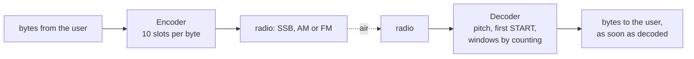
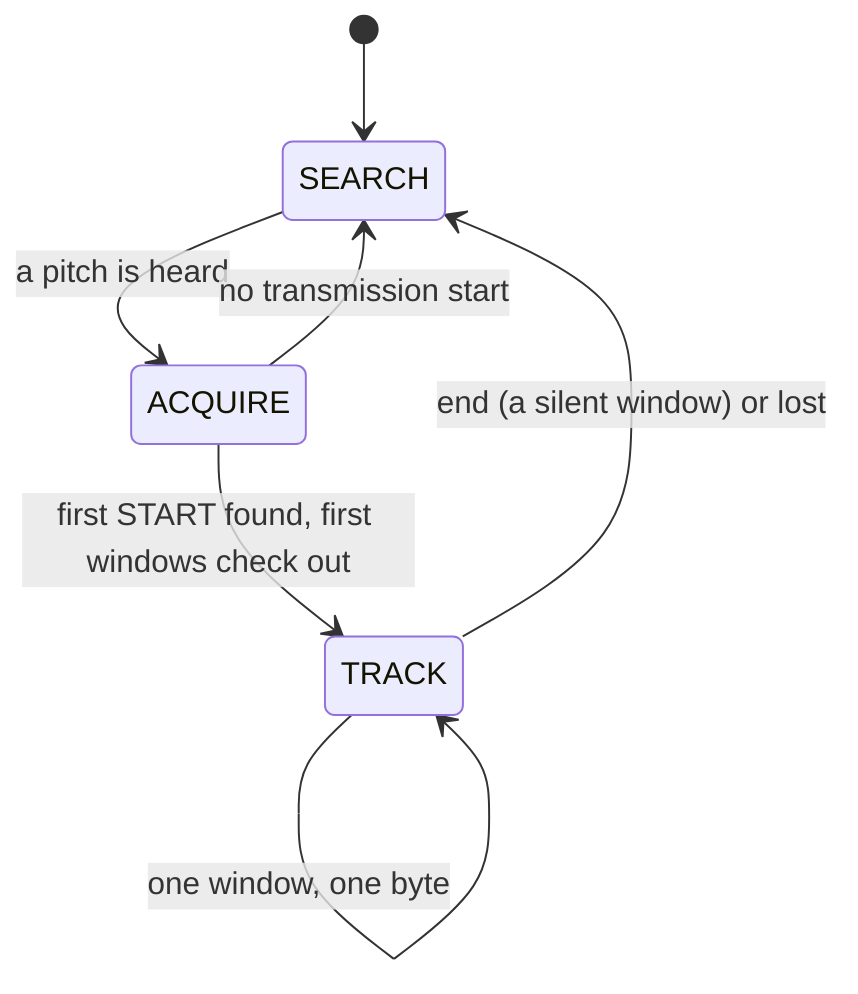
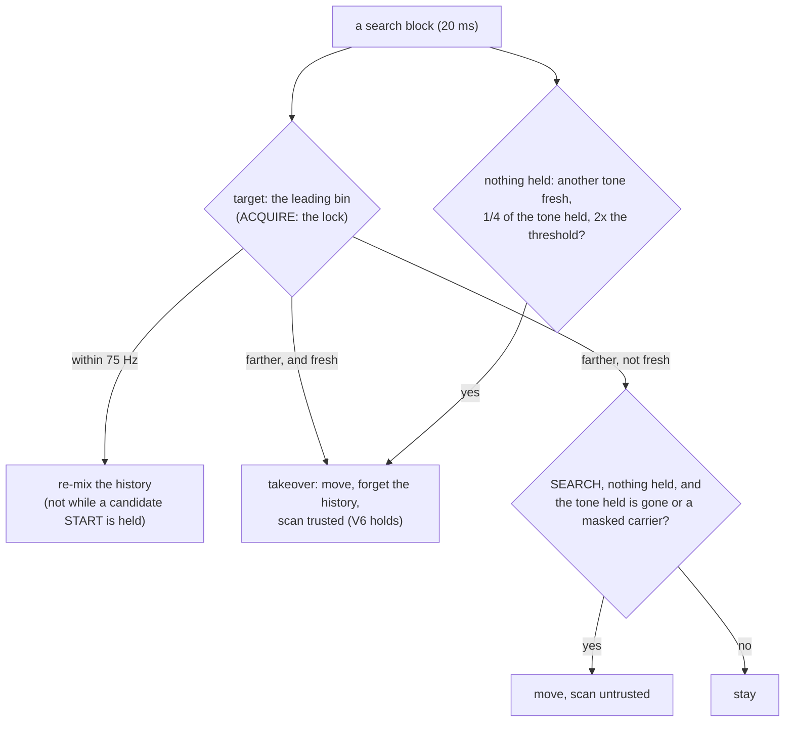
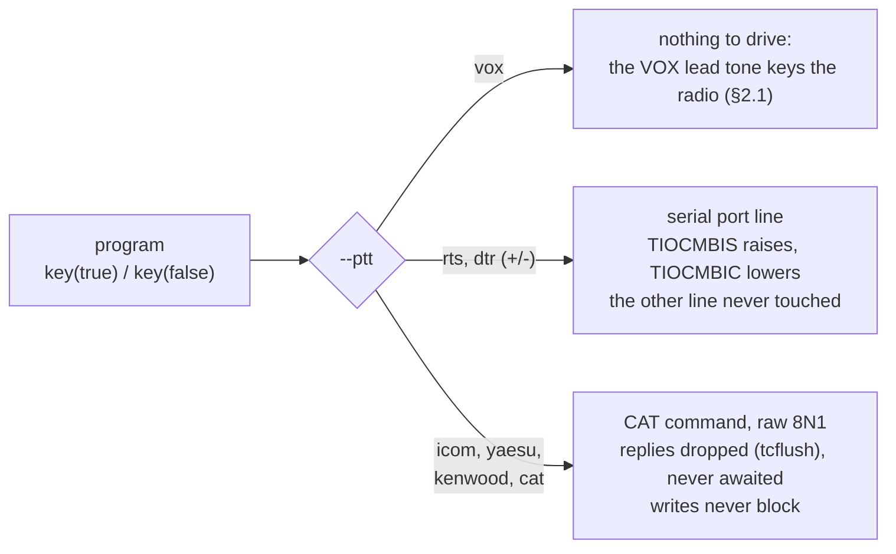
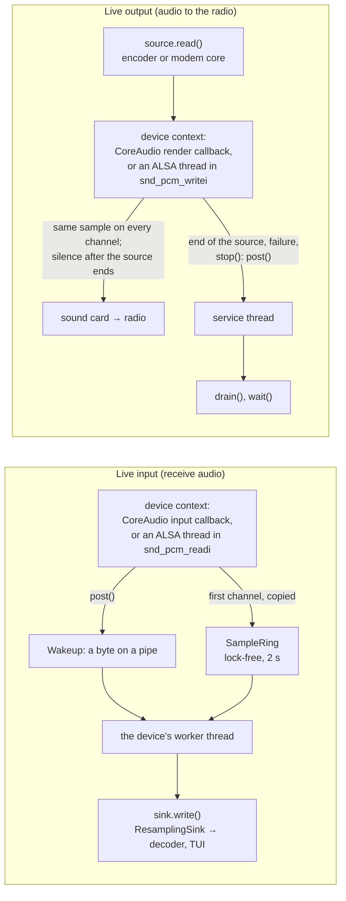

# Unlimited — Specification (SDD), v1.0

**What Unlimited is.** Unlimited sends bytes through the audio of an ordinary radio — HF SSB (USB or LSB), AM, or
VHF/UHF FM — the way a serial port sends characters: every byte is a short **window of 10 time slots** on one pitch,
a START tone, the 8 data bits (a beep is a 1, silence is a 0) and a STOP tone. The two stations agree on one number,
the **speed in bytes per second**; the receiver finds the pitch by itself, so mistuning on USB or LSB does not matter.
Nothing is added to the data and nothing is held: bytes go on the air as they are given and come out of the receiver
as soon as they are decoded. The C++11 core runs on a PC and on microcontrollers; `unlimited_modem` makes a computer a
KISS modem for AX.25 programs, and an ESP32 can do the same on its own.

**Status (2026-09-28): the v1.0 core is built and measured (§3 as built, §9); the KISS modem, the live sound
devices and the ESP32 TNC (§12) are not built yet.** The core — the byte-window format, the encoder, the receiver, the
programs on WAV files, the TUI, the Arduino examples and the long suite — replaces v0.3's; the gates it does not meet
are listed with their numbers in §4 and §11 for Gustavo's decision. The v0.3 design (tune tone, sync train, twisted
START/STOP markers, packages of N bits, a receiver that learned the speed and N) is released as library 0.3.0 (git
tag `v0.3.0`; its last state is commit `5f68598`, where its specification, measurements and code remain); v1.0
replaces it and is not compatible with it on the air.

This file is normative: every change to behaviour, API, layout or tests is recorded here first (Spec-Driven
Development, §0.5). Where this file and the code disagree, the disagreement is a defect to be resolved here first.

**Repository:** github.com/solariun/unlimited (public), MIT license, Copyright (c) 2026 Gustavo Campos.

### Changelog

| Date | Change |
|---|---|
| 2026-09-25 | v0.1: a tone-peak modem with START/STOP markers (Gustavo's first design), implemented and measured. |
| 2026-09-26 | v0.2 (several bits per beep, MFSK) specified, built and dropped the same day (branch/tag `v0.2-mfsk`); v0.3 specified and implemented: one bit per slot, configurable N, T and pitch, twisted markers, receiver learning T and N, bandwidth awareness. |
| 2026-09-27 | v0.3 released (library 0.3.0), gate decisions G1–G5, API frozen; development standards D1–D7; testing guide; fast cold late joins (commit `5f68598`). |
| 2026-09-28 | v1.0 first planned as a KISS modem on v0.3 (pure byte streaming, PC + ESP32), then **redesigned from the start** by Gustavo's decisions (§0.3): one byte per 10-slot window with plain START and STOP tones, speed in bytes per second set on both sides, no tune, no sync train, no twist, no END markers; decode only from the start of a transmission; a fixed 70 % decision threshold by default; `--list-devices` in every program; KISS modem, live encode and decode, ESP32 TNC; the Arduino Nano modem right after v1.0. This file rewritten for v1.0 (v0.3's is at tag `v0.3.0`). |
| 2026-09-28 | **v1.0 core built** (§3 as built, §9): protocol (speed in bytes/s, the byte window, the bandwidth calculator), integer encoder (AVR ISR timing kept), the new receiver (look-ahead, pitch search with fresh-tone takeovers, anchor scan with an early steady test, pitch refinement on the tone slots, the check before lock over at least 160 ms, counting, 70 % line, framing, pending/end), the packet layer removed, the demos with `--bps`, the TUI's window view, the four Arduino examples, the v1.0 figures, 186 unit tests and the long suite (A1, A2, A3, S1, L5, L19, C, F, integrity) rebuilt. A1 at the gate with the fixed 70 % line, F4 at 25 bytes/s and the integrity row in fading fail their provisional gates (§4, §11). |
| 2026-09-28 | **Radio I/O layer built and merged** (§12.4, §12.5): live CoreAudio and ALSA devices with `--list-devices` and device choice by number, name part or UID (ambiguous names refused); real-time rules (the device callback copies, a worker thread calls the sink, the output callback pulls the source); PTT by VOX, RTS/DTR and CAT (Icom CI-V, Yaesu, Kenwood, custom hex) with replies drained without blocking; the shared option parser; GitHub Actions CI on Ubuntu (GCC, ALSA) and macOS. Merged with the v1.0 core: `make test` 222/222. |

### How to read this document

- Every section starts **in plain words**: what the thing is and why, often with a picture. **Exact rules** follow:
  formulas, constants and bit-exact behaviour for engineers and implementers.
- Every term is defined where it first appears and again in the glossary (§14).
- Values marked *measured* come from runs (§9); *expected* values are predictions the tests of §8 must confirm;
  *provisional* gates may only be tightened by measurement and are changed only by Gustavo's decision.
- "Must", "never" and "always" are normative. Named constants (`k_...`) are the ones in the code.

---

## 0. Decisions

### 0.1 The idea in one picture

```
 silence   START  1   0   1   0   0   1   1   0   STOP  START  0   1   1  ...          STOP   silence
 ........  #####  ### ... ### ... ... ### ### ...  ####  #####  ... ### ###            ####   ........
           |<------------- byte 0: 10 slots -------------->|<-------- byte 1 ...
           the first tone after silence is the START of byte 0; then every 10 slots a new byte
```

**In plain words.** One pitch. Each byte is a window of 10 slots: START (tone), 8 data slots, STOP (tone), exactly
like a serial port's start bit, 8 data bits and stop bit ("8N1"). The START and STOP tones show how loud a 1 is right
now; a data slot louder than 70 % of that is a 1, quieter is a 0. The receiver knows the speed, so once it has heard
the first START after silence it finds every later window by counting.



### 0.2 Guiding principles (Gustavo, 2026-09-28)

**Simplicity, computational affordability and clean transmission.** The modem should run on the smallest hardware
that can do the job, down to an AVR such as the Arduino Nano; when a feature needs more architecture, a simpler
protocol that removes the need comes first; nothing is added to the user's data on the air. Gustavo: "I am
simplifying the design for making it accessible for everyone and for speed … it is for the sake of the transmission."

### 0.3 v1.0 decisions (Gustavo, 2026-09-27 and 2026-09-28)

| # | Decision | In plain words: why |
|---|---|---|
| V1 | **One byte per window of 10 slots:** START tone, 8 data slots (most significant bit first; a tone is 1, silence is 0), STOP tone. No other package size. | "start tone, 1, 2, 3, 4, 5, 6, 7, 8, stop — so 10 tones": a serial port's frame, which every computer person knows; every window is one byte, so byte sync is always there. |
| V2 | **START and STOP are plain tones, like a data 1** (no twist, no phase reversal anywhere). | Simplicity: the receiver needs only the energy of each slot. The START and STOP of each window give its reference level (Gustavo's original idea: the markers set the level of a 1). |
| V3 | **The speed is set in bytes per second, the same on both sides**; the receiver does not measure it. Any value from 1 to 25 bytes/s (resolution 0.01): slot T = 1 / (10 × bytes/s). No named speeds. | "We will give you the speed, and it must match the other side speed, so it can read on the synced intervals." Knowing T removes the receiver's speed search. |
| V4 | **No tune tone, no sync train, no END markers.** A transmission is the byte windows back to back, between silences. | "The idea of using 8 bits is for dropping the sync tones … only the byte being transmitted." The first tone after silence is the START of byte 0; the silence after the last STOP is the end. |
| V5 | **The receiver finds the pitch by itself** in the data (the tones of START, STOP and the ones). | Shift resilience on USB and LSB is the reason Unlimited exists (HF SSB focus). |
| V6 | **Decode only from the start of a transmission.** A receiver that starts listening in the middle waits for the next transmission. | Gustavo likes that a receiver "picked up at the middle" decodes only a whole transmission; without markers that differ from data, a late listener cannot find the windows in general (0xFF bytes are all tone). |
| V7 | **Pure byte streaming:** no packet layer on the air, no check, no resend, nothing held; the library never buffers user data (a string or byte array is dispatched at once; its meaning is the user's). | "The api will never buffer data, it must be dispatched right away … it can not be managed by us." Known limit: AX.25 resends frames that never arrive, not frames that arrive damaged (§10). |
| V8 | **VOX:** only when the radio is keyed by VOX, a plain lead tone (default 150 ms) precedes the transmission, followed by at least 2 silent slots, so the START is still the first tone after silence. With RTS, DTR or CAT PTT only silence precedes it. | A VOX needs sound to key the transmitter; the gap keeps the lead from being taken for a START. |
| V9 | **The KISS modem** (`unlimited_modem`): one KISS data frame = one transmission; received bytes go to the computer as they are decoded (`C0 00` when a transmission is locked from its start, each byte, `C0` at the end). KISS is only the computer's door, not the air protocol. | §12. |
| V10 | **Targets for v1.0:** PC (macOS with CoreAudio, Linux with ALSA; Windows later) and ESP32 (a KISS TNC sketch), on one portable core (no heap, no threads). **The Arduino Nano modem follows right after v1.0** on the same format. | Computational affordability; the simple format makes an AVR receiver possible (§3.9). |
| V11 | **Operational programs:** `unlimited_modem`, `unlimited_encode` (plays through the sound card, with PTT) and `unlimited_decode` (listens live, with the `--tui` view and a level meter). | "All the applications for encode, decode with TUI and the modem operational." |
| V12 | **PTT:** VOX; RTS or DTR (normal or inverted) on a serial port; CAT PTT for Icom CI-V, Yaesu, Kenwood and custom hex; a GPIO on the ESP32. | `kiss_modem`'s set without USB GPIO; no library. |
| V13 | **Proof on Linux:** GitHub Actions (Ubuntu with GCC and ALSA, macOS) builds and tests every push; Gustavo tests on his bench (IC-705 and IC-7300 MKII over USB, Xiegu X6200 over USB, a VOX radio with a serial TRS PTT cable). | CI proves builds and tests; only radios prove the audio path. |
| V14 | **Decision threshold: 70 % of the window's reference by default, configurable,** in the library and in every program (`--threshold PCT`, 50..90); `--threshold auto` selects v0.3's adaptive line (50–75 %) as an option. | Gustavo: "make the threshold about 70 % configurable, 70 is the default for all applications" — his original 70 % rule. |
| V15 | **Sound devices in every program:** `unlimited_modem`, `unlimited_encode` and `unlimited_decode` list every audio input and output (`--list-devices`) and use the ones the user picks (`--input`, `--output`, or `-d` for both; by number, part of the name or unique ID; `default`), at any sample rate (converted to and from 8000 Hz). | Gustavo: "please have a --list-devices so the user can list all the possibilities and have a way to allow them to use what is needed." |

**Parked after v1.0:** a check and a resend (a per-byte "tone CRC" was discussed), several frames per transmission,
KISS over TCP, Windows, a multi-station receiver.

### 0.4 What v1.0 keeps from v0.3, and what it drops

| Kept (proven in v0.3's measurements) | Dropped |
|---|---|
| One pitch, OOK slots with Tukey-shaped beeps (α 0.5), the clean narrow spectrum | Tune tone, sync train, END markers |
| The receiver's pitch search, mixer and kept audio (history) with its re-mix, the noise estimate, the impulse blanker, the fixed 70 % line and the adaptive line (as an option) | The twist (phase reversal), learning T and N, packages of N bits, short final packages |
| The integer encoder for AVR, the WAV codec, the audio driver boundary, the channel simulator, the TUI, the test framework and the AVR cycle model | Cold late joins, the station memory's relock rules, the packet layer (`packet.hpp`) |
| The bandwidth calculator and passband check | The v0.3 presets (`hf_slow` … `fm`) and profiles as the way to set the speed |

### 0.5 Development standards: the definition of done (Gustavo, 2026-09-27)

A change — a fix, a feature, a redesign, a new tool — is finished only when anyone can see what changed, why, and the
proof that it works:

| # | Standard | What it asks for |
|---|---|---|
| D1 | **Spec first** | The change is written here before or together with the code: plain words first, exact rules after; each decision with its reason and the alternatives rejected; a changelog row; every affected section. |
| D2 | **Design explained, with diagrams** | In accessible language first and complete after, with at least one picture (Mermaid, or an SVG generated from the real code by `make docs`). A design choice that changes behaviour, a gate or the protocol is shown to Gustavo and confirmed before it is built. |
| D3 | **Proof that it works** | Tests that fail before and pass after; measured numbers before and after; every target green (`make test`, `make test_long`, `make check_embedded`, `make arduino_check`, `make demo_run`, `make docs` deterministic). Limits stated in §11, never hidden; a gate changes only by Gustavo's decision. |
| D4 | **Every document updated** | This file, `README.md`, `docs/`, `--help`, the examples and the comments describe the code as it is. |
| D5 | **Clarity** | Accessible to radio amateurs, programmers and scholars; every term defined; numbers with units, marked *measured* or *expected*. |
| D6 | **Git** | Commit and push only when Gustavo asks; the author is Gustavo Campos, with no co-author lines. |
| D7 | **Pedagogic, with pictures everywhere** | Layered: lossless plain words for newcomers first, depth for experts after; SVG from the real code or Mermaid used extensively, in the documents and in every report to Gustavo. |

---

## 1. The signal (normative)

### 1.1 Slots, beeps and the pitch

**In plain words.** Time is cut into equal slots. In each slot the sender either plays a short beep on the pitch or
stays silent. Every beep swells and fades inside its own slot, so consecutive beeps still show where each slot begins
and ends, and the spectrum stays narrow.

**Exact rules.**
- One pitch f₀ (the tone), 300..2700 Hz, default 1500 Hz (`k_default_tone_hz`); it must lie inside the receiving
  radio's passband with the signal's occupied band (§1.3).
- A **tone slot** is a beep: the carrier sin(2π f₀ t + φ), phase-continuous from slot to slot, times a Tukey window
  with α = 0.5 over the slot (cosine ramps over the first and last quarter, flat in between), crest A. A **silent slot**
  is zero.
- Encoder arithmetic is integer only (AVR): a quarter-sine table, Q15 envelope and carrier, as in v0.3.

### 1.2 The byte window

**In plain words.** A byte takes 10 slots. Slot 0 is the START, always a tone; slots 1 to 8 carry the bits, most
significant first; slot 9 is the STOP, always a tone.

**Exact rules.** Window of byte b: slot 0 START = tone; slot j (1..8) = tone when bit (8 − j) of b is 1, silent when it
is 0; slot 9 STOP = tone. Consecutive windows follow each other with no gap: the STOP of byte k is followed directly
by the START of byte k + 1.

### 1.3 Speed, slot length and bandwidth

**In plain words.** You choose how many bytes per second to send; both stations use the same number. Slower is more
robust and narrower; faster is wider and needs a stronger signal.

**Exact rules.**
- Speed B in bytes per second, 1.00 ≤ B ≤ 25.00 (`k_min_bytes_per_second`, `k_max_bytes_per_second`), resolution
  0.01. Slot T = 1 / (10·B): T_us = round(100000 / B) (`slot_us_for_speed()`), 4,000..100,000 µs. The net data rate
  is exactly B bytes/s (8·B bit/s).
- Occupied band (99 % of the power) ≈ 4.4/T around f₀; −26 dB width ≈ 7.0/T (v0.3's formulas, same beeps):

| B (bytes/s) | T | Occupied band | Typical use |
|---|---|---|---|
| 1 | 100 ms | 44 Hz | very weak HF paths |
| 3 | 33.3 ms | 132 Hz | weak HF |
| 6 | 16.7 ms | 264 Hz | HF default |
| 12 | 8.3 ms | 528 Hz | good HF, AM |
| 25 | 4 ms | 1100 Hz | FM |

- The bandwidth calculator, the passband fit and the shift tolerance of v0.3 carry over (`occupied_band()`,
  `passband_fit()`, `search_range()`), computed from T; the programs print the bandwidth line at start-up.

---

## 2. Transmission format (normative)

### 2.1 Layout

**In plain words.** Silence (while the radio switches to transmit), then the bytes one window after another, then a
short silence. With a VOX radio a plain lead tone and a short gap come first.

```
PTT (RTS/DTR/CAT):  [lead-in: silence][byte 0][byte 1] ... [byte n-1][tail: silence]
VOX:                [lead tone][gap: >= 2 silent slots][byte 0] ... [byte n-1][tail: silence]
```

**Exact rules.**

| Field | Rule | Default |
|---|---|---|
| lead-in | `lead_in_ms` of silence (the radio's TX delay) | 0 in the library; the modem's `--txdelay` (§12) |
| VOX lead | only when configured (`vox_lead_ms` > 0): a steady tone at f₀ of max(ceil(`vox_lead_ms` / T), `k_min_vox_lead_slots` = 3) slots, ramped at both ends, then `k_vox_gap_slots` = 2 silent slots (as built: 3 slots let the receiver see a steady tone through two slot boundaries) | off; 150 ms with `--ptt vox` |
| bytes | n windows of 10 slots (§1.2) | – |
| tail | silence of max(`tail_ms`, 2 slots) | 100 ms |

- The first tone after at least 2 slots of silence is the START of byte 0 (the receiver's anchor, §3.3). The VOX lead is
  a steady tone longer than a slot, followed by the gap, so it is never taken for a START.

### 2.2 Worked example (bit-exact)

"Hi" = 0x48 0x69 at B = 6 bytes/s (T = 16.667 ms, 133.33 samples per slot at 8000 Hz):

| Window | Slots 0..9 (T = tone, . = silence) | Byte |
|---|---|---|
| 0 | `T . T . . T . . . T` | 0x48 = 0100 1000 |
| 1 | `T . T T . T . . T T` | 0x69 = 0110 1001 |

20 slots = 333 ms of signal, plus the lead-in and the tail. (A key pressed alone is one window: 167 ms at 6 bytes/s.)

### 2.3 Streaming and the end of a transmission

- The encoder sends while bytes keep coming: at each window boundary it takes the next byte from its queue; when the
  queue is empty at a window boundary, it sends the tail and the transmission ends. It never pads.
- The receiver ends a transmission when the START slot of the next window is silent and the silence lasts a whole
  window (§3.7).

### 2.4 Duration

A transmission of n bytes lasts lead + n × 10·T + tail (plus the VOX lead and gap when used): at 6 bytes/s, 100 bytes
take 16.7 s of windows.

### 2.5 Encoder queue and threads (from v0.3, unchanged)

One producer calls `write()`, `queue_free()`, `queued()`, `busy()` and, while idle, `start()`; one consumer (an ISR or
the audio thread) calls `next_sample()` or `render()`. The queue (`UNLIMITED_ENCODER_QUEUE`, power of two 16..128,
default 64) hands over with release/acquire fences (`platform.hpp`), so the two may run on different cores; `abort()`
and `status()` belong to the consumer.

---

## 3. The receiver (normative outline; exact constants in §3.8 as built)

### 3.0 Overview

**In plain words.** The receiver is told the speed. It looks for a steady pitch in the audio, keeps a few windows of
the audio it hears (so it can go back), finds the first tone after silence — the START of byte 0 — and from there
reads one window every 10 slots: the START and STOP tones tell it how loud a 1 is, each data slot is compared with
70 % of that, and each byte goes out as soon as its window is read. Every window must begin and end with a tone; a
window that does not is dropped, and a whole window of silence ends the transmission.



### 3.1 Front end

**In plain words.** The receiver hears every sample twice: the pitch search hears it at once, the part that measures
slots hears it a moment later (the **look-ahead**). So when a transmission starts, the search has time to find its
pitch and point the receiver at it before the first START reaches the part that needs it, with the silence before it.

**As built.**
- Input 8000 Hz int16 (`k_decoder_rate_hz`). The **look-ahead** (`dsp::Lookahead`) delays the mixer's input by
  R = min(2 T + 200 ms, 400 ms) samples (`k_lead_latency_samples` 1600, `k_lookahead_max_samples` 3200): 3200 samples
  at 1 byte/s, 1866 at 6, 1664 at 25. Every event comes R after the audio that caused it (`lookahead_samples()`).
- An NCO at the pitch, a mixer and a CIC-2 decimate into blocks of clamp(round(T/8), 4, 32) samples (32 at 1 and
  3 bytes/s, 17 at 6, 8 at 12, 4 at 25); each block's complex sum enters the **history** (`dsp::PrefixHistory`:
  prefix sums in 1024 cells, fractional windows), 4.1 s at 1 byte/s and 0.51 s at 25.
- The impulse blanker (v0.3's, 2 blocks of latency) zeroes blocks with an impulse. When the NCO moves by at most
  `k_remix_reach_hz` (75 Hz) the kept history is re-mixed (rotated) to the new pitch; a farther move forgets it.
- **Noise** (deviation from v0.3's 25 % quantile): in SEARCH and ACQUIRE the tone search's floor (the mean of the
  lower half of the lock bins' slow averages; the guard bins, half a bin beyond the range, are left out because a
  filter's edge may begin there); in TRACK the mean power of the central half of clear zeros (under 35 % of the line,
  `dsp::NoiseTracker`), which stays unbiased in impulsive noise.

### 3.2 Pitch search and which pitch is followed

**In plain words.** The search watches the whole passband in 50 Hz steps. The receiver keeps its NCO on the pitch the
search points at. A tone that has just come up out of silence (**fresh**) is a transmission starting, and it takes
the receiver over from a tone that has been there for a while (a carrier, CW), because the look-ahead still holds its
first START. A receiver that starts in the middle of a transmission does not decode it (V6): it waits for the next.



**As built** (`dsp::ToneSearch`, `Decoder::steer()`).
- Bins: the multiples of 50 Hz nearest to the search range's edges and those between (at most 49), plus a guard bin
  on each side (never locked). The search range is the passband less half the occupied band, within 300..2700 Hz
  (`search_range()`). The **leading bin** is the strongest local peak of the slot-long averages above the floor by the
  Gamma tail of noise at 1e-6 (z 4.75); the **lock** (`candidate()`) is v0.3's fast/slow lock with its tone estimate.
- A bin is **quiet** after its slot-long average stayed under the leading threshold for `k_quiet_slots` (10 slots:
  longer than any silence inside a transmission); it is **fresh** while it stands out again at most `fresh_blocks_`
  search blocks after such a quiet: floor((R − 2 T − settle − 160) / 160) − 1 = 7 blocks (140 ms) at every speed, so a
  move then still finds 2 silent slots before the START in the look-ahead.
- Steering, every search block before an anchor (SEARCH, ACQUIRE):
  1. target within 75 Hz of the NCO: re-mix (not while a candidate START is held);
  2. **takeover** by the target (the leading bin; in ACQUIRE the lock) when it is fresh and farther than 75 Hz — or,
     while a candidate START is held or the tone held came up within `protect_blocks_` (R + 2 T), farther than half
     the occupied band plus a bin (`band_reach_hz_`: a signal's own sidebands come up with it);
  3. otherwise, when nothing is held and the tone held is not a young leader: takeover by the strongest fresh local
     peak farther than 75 Hz whose average is at least `k_takeover_ratio` (1/4) of the tone held's and
     `k_takeover_excess` (2) times the leading threshold (a transmission starting beside a carrier or CW that is
     stronger in the averages; not a noise bin crossing the threshold by chance);
  4. in SEARCH with nothing held: a far move when the tone held is gone or is a masked steady carrier (untrusted).
- A takeover or far move forgets the history; the scan restarts **trusted** when the new tone is fresh (the look-ahead
  holds the silence before its START), **untrusted** otherwise (V6).
- **Steady carriers** are masked (v0.3's slow variance test, after 2.5 s); a masked bin keeps its averages across
  `end` (`ToneSearch::forget()` restarts every other bin), so a carrier beside the signal is not grabbed again before
  each transmission. An ACQUIRE that times out on a tone still present bans it for 10 s × 2^strikes (at most 8×).

### 3.3 Acquire: the first START

**In plain words.** The receiver looks back in the kept audio for the first tone after at least 2 silent slots. A
steady tone (a carrier, CW, the VOX lead) is let go at once. The pitch is then measured exactly from the tone slots,
the START is placed exactly, and the first windows must each show a START and a STOP where counting puts them — at
least 2 windows and at least 160 ms of signal (4 windows at 25 bytes/s). Then `locked`, and the bytes of those windows
come out at once.

**As built.**
- **Scan** (one position per history block, at most 8 per input block): a slot window is **loud** when its energy
  (coherent sums over sub-windows of at most 10 ms, added) is above what noise gives with probability 1e-6. An onset
  is located on the balance of a beep's two halves, walked back over a weak START; it becomes a candidate when at
  least 1.75 slots (`k_onset_silent_slots` 2 less `k_onset_tolerance`) of silence precede it and the silence is
  **proven**: the scan is trusted, or a loud run ended before it, or 10 silent slots came before it since the scan
  began. An onset that is not a candidate (and an untrusted scan's first tone without a clear onset and no whole
  silent window before it) marks the scan **in data**: no candidate until 10 silent slots. A candidate is **watched**
  for 3 slots: a tone 16 times its energy right after it, with 2 quiet slots before, replaces it (a pre-echo).
- **Early steady test** (as soon as the history holds the first 3 slots): the slots after the START as loud as a
  quarter of its energy and the quietest edge (±0.1 T windows, searched within ±0.2 T) at each of the first two slot
  boundaries above 0.6 of the START's energy density, on 10 ms sub-windows: a steady tone; rejected.
- **Pitch** (`refine_pitch()`): the products of blocks 2 apart (and 1 apart, for the alias) over the tone slots of the
  check's windows only (the markers and the slots with a quarter of their energy), so an interferer the CIC-2 lets
  through adds nothing from the silent slots; coherence at least 0.4 (`k_pitch_coherence`); a correction larger than
  half the occupied band (at least 75 Hz: 75, 75, 132, 264, 550 Hz at 1, 3, 6, 12, 25 bytes/s) means another signal:
  rejected.
- **Anchor** (`refine_anchor()`): the early/late balance of the markers, then back a slot while the slot before holds
  half the START.
- **Check before lock** (`windows_check()`) over `acquire_windows()` = max(2, ceil(160 ms / window)) ≤ 4 windows
  (2 from 1 to 12 bytes/s, 4 at 25): not steady; the 2 slots before the START hold nothing (|S|² ≥ 8 × noise and a
  quarter of the START's level refuse it); trailing windows with nothing in them (mean |S|² under twice the noise) are
  a short transmission's end; every other window's START and STOP present (level ≥ 0.5 × the reference and |S|² ≥ 4 ×
  the noise); the energy at the slot edges at most 0.3 of the markers'.
- ACQUIRE gives up 1.5 s (at least 3 windows) after the last beep the scan saw or the last time the tone held came up
  fresh.

### 3.4 Windows by counting and timing

- Window k starts at t₀ + 10·k·T; each window is read when the history holds it and half a slot more.
- **Timing:** a PI loop on the early/late balance of the START, the STOP and the decided ones (slope 5.33 per slot,
  gain 0.2, integral 0.02, at most 0.25 slot per window): *measured* worst T error 0.08 % and no slip over 10 minutes
  at ±1000 ppm (L5).
- **Pitch:** the phase advance of the tone slots (gain 0.5, at most 0.1 cycle per slot per window).

### 3.5 Levels and decisions

- The reference line of a window runs from its START to its STOP level; the running reference (exponential, 0.25) is
  the markers' mean. **Fixed line (V14):** `threshold_percent` (default 70, 50..90); **adaptive** (option): v0.3's
  smart line, 50–75 % of the reference above the noise; neither ever below 2.6 σ of an empty slot.
- Soft values: 64 = one decision line of margin, ±127; `weak` within 12.5 % of the line.

### 3.6 Framing check and release

- A window whose START or STOP is missing (below the marker rule) is a framing error: its byte is never delivered, a
  `slot` event carries `event_flag_framing`, counting goes on; 2 in a row with signal present end with `lost`.
- A byte is released at its window's read: *measured* at most 0.7 slot (1 byte/s), 1.2 slots (6) and 1.1 slots (25)
  after the end of its STOP, plus the look-ahead. The windows of the check come out with `locked`.

### 3.7 End

- **In plain words.** A silent START is either the end or a faded START. The receiver keeps both ideas: the old
  transmission going on, or a new one starting a little later (another station right after). It weighs them over up to
  4 more windows; a whole quiet window after the last STOP is the end.
- **As built:** a silent START makes the window **pending**; a new candidate START is looked for in the next window. If
  only the old grid holds (markers present), the pending window is a framing error and counting goes on; if only the
  new one holds, `end` then `locked` on it; while both hold they are compared window by window, at most
  `k_pending_windows` (4) more; a tie is `lost`. With no new candidate and a quiet window, `end`: *measured* 10.7–11.2
  slots after the last STOP, plus the look-ahead.

### 3.8 Constants (as built)

| Stage | Constant | Value |
|---|---|---|
| Speed (`protocol.hpp`) | `k_min/max/default_centi_bytes_per_second` | 100, 2500, 600 (1.00, 25.00, 6.00 bytes/s) |
| | `k_min_slot_us`, `k_max_slot_us` | 4000, 100000 |
| Window | `k_window_slots`, `k_bits_per_byte`, `k_start_slot`, `k_first_data_slot`, `k_stop_slot` | 10, 8, 0, 1, 9 |
| Waveform | `k_tukey_ramp`, `k_beep_energy` | 0.25, 0.6875 |
| Pitch | `k_min/max/default_tone_hz` | 300, 2700, 1500 |
| Bandwidth | `k_band_99_milli`, `k_band_26db_milli`, `k_band_40db_milli` | 4400, 7000, 9900 (width = k / T) |
| Passbands | SSB, AM, FM defaults | 300–2700, 100–3000, 300–3000 Hz |
| Transmission | `k_vox_gap_slots`, `k_min_vox_lead_slots`, `k_min_tail_slots`, `k_default_vox_lead_ms`, `k_default_tail_ms` | 2, 3, 2, 150, 100 |
| Encoder (`encoder.hpp`) | `k_min/max_sample_rate_hz`, `UNLIMITED_ENCODER_QUEUE` | 8000, 192000, 64 (16..128) |
| Front end (`dsp.hpp`) | `k_decoder_rate_hz`, `k_blocks_per_slot`, `k_min/max_block_samples` | 8000, 8, 4, 32 |
| | `k_history_cells`, `k_rebase_blocks`, `k_mix_shift` | 1024, 8192, 10 |
| | `k_lead_latency_samples`, `k_lookahead_max_samples` | 1600, 3200 |
| | `k_remix_reach_hz`, `k_steer_min_hz`, `k_settle_blocks` | 75 Hz, 2 Hz, 3 blocks |
| Tone search | bins, `k_max_lock_bins`, `k_block_samples` | 50 Hz, 49 + 2 guards, 160 samples |
| | `k_quiet_slots`, fresh window, `protect_blocks_` | 10 slots, 7 search blocks, ceil((R + 2 T) / 160) + 1 |
| | leading z, fast/slow alphas, steady mask | 4.75, 1/8, 1/128, after 128 blocks |
| Steering | `k_takeover_ratio`, `k_takeover_excess`, `band_reach_hz_` | 0.25, 2, half the 99 % band + 50 Hz |
| Scan | `k_scan_coherent_ms`, `k_loud_z`, `k_acquire_blocks_per_block` | 10 ms, 4.75, 8 |
| | `k_onset_silent_slots`, `k_onset_tolerance`, `k_proven_silent_slots` | 2, 0.25 slot, 10 |
| | `k_watch_slots`, `k_precursor_rise` | 3, 16 |
| | `k_onset_back`, `k_onset_reach`, `k_onset_rise`, `k_onset_walk_slots`, `k_onset_gap`, `k_onset_half` | 0.25, 1, 0.5, 2, 0.5, 0.25 slot |
| Early test | `k_steady_slots`, `k_start_edge_max`, `k_edge_half`, `k_edge_step`, `k_edge_search_steps` | 2, 0.6, 0.1 T, 0.1 T, 2 |
| Pitch refinement | `k_pitch_gap_blocks`, `k_pitch_coherence`, `k_refine_band_part` | 2, 0.4, 0.5 (half the occupied band, at least 75 Hz) |
| Check before lock | `k_min/max_acquire_windows`, `k_acquire_min_ms` | 2, 4, 160 ms |
| | `k_marker_ratio`, `k_marker_snr`, `k_edge_ratio_max`, `k_before_snr`, `k_silence_ratio`, `k_silent_mean_snr` | 0.5, 4, 0.3, 8, 0.25, 2 |
| | `k_refine_iterations`, `k_refine_settled` | 4, 0.01 slot |
| ACQUIRE | `k_acquire_timeout_ms`, `k_acquire_timeout_windows`, `k_search_ban_ms` | 1500, 3, 10000 (× 2^strikes, ≤ 8×) |
| Geometry | `k_slot_window`, `k_noise_window`, `k_timing_half`, `k_scan_lead`, `k_margin_slots`, `k_margin_blocks`, `k_keep_slots` | 0.75, 0.5, 0.5, 0.125, 0.5 slot, 2 blocks, 4 slots |
| Timing, pitch | `k_timing_slope`, `k_timing_gain`, `k_timing_integral`, `k_timing_clamp`, `k_pitch_gain`, `k_pitch_clamp` | 5.33, 0.2, 0.02, 0.25, 0.5, 0.1 |
| Decisions | `k_default/min/max_threshold_percent`, `k_floor_sigma`, `k_soft_scale`, `k_soft_limit`, `k_weak_margin`, `k_reference_alpha`, `k_noise_zero_pct` | 70/50/90, 2.6, 64, 127, 0.125, 0.25, 35 |
| Framing, end | `k_max_framing_errors`, `k_pending_windows`, `k_loud_snr` | 2, 4, 16 |

### 3.9 Memory and CPU

- **Sizes** (*measured*, 64-bit host and xtensa-esp32): `sizeof(Decoder)` 17,256 B — the history 8.3 KB, the
  look-ahead 6.4 KB, the tone search about 1.5 KB — under its budget of 18,432 B (`static_assert` in `decoder.cpp`,
  built for the ESP32 by `make check_embedded`); `sizeof(Encoder)` 144 B with the 64-byte queue.
- **Work per block is bounded by construction:** at most 8 scan steps per block, one verification step per block (the
  early test, the pitch, the windows), one window read. *Measured* worst case of one block on this PC (Apple M4,
  `decoder_work_per_block_is_bounded`): 3.29, 1.88, 1.25, 1.00, 1.38 µs at 1, 3, 6, 12, 25 bytes/s, for blocks of 4000,
  4000, 2125, 1000 and 500 µs of audio. An ESP32 at 240 MHz is 50–200 times slower on this float work (estimate, to be
  measured with `loopback_esp32`): 4–16 %, 2–9 %, 3–12 %, 5–20 % and 14–55 % of a block's time in the worst block; the
  25 % target holds up to 12 bytes/s and may not at 25 bytes/s (§11).
- **AVR:** the encoder's ISR (`tests/avr/`): at most 908 cycles per sample at 8 kHz on 16 MHz (gate 1600), mean load
  25–28 %, no lost tick, at every speed with and without the VOX lead. `tx_uno`: 8,658 B of flash, 524 B of RAM, no
  float routine linked. The v1.0 receiver is float; the Nano receiver comes after v1.0 (§13).

---

## 4. Performance (gates, *provisional* until measured)

SNR is the key-down tone over the noise in 2500 Hz. The gate SNR of a speed is v0.3's at the same T: −6.5, −1.7,
+1.3, +4.3, +8.0 dB at 1, 3, 6, 12, 25 bytes/s. *Measured* on 2026-09-28 by the long suite (§8, §9).

| Gate | Condition | Pass | *Measured* (fixed 70 % line unless said) |
|---|---|---|---|
| A1 AWGN | each speed at its gate SNR, 32-byte transmissions, receiver mistuned ±50 Hz | BER ≤ 1e-3, loss ≤ 1 % | **FAIL** at every speed: BER 6.1e-3, 6.2e-3, 6.1e-3, 5.7e-3, 4.0e-3; loss 4.1 %, 0.5 %, 2.0 %, 0.5 %, 0 % (1, 3, 6, 12, 25 bytes/s). At gate + 3 dB: BER 3.6e-4, 4.2e-4, 2.0e-4, 3.2e-4, 8.0e-5, loss ≤ 0.5 %. At gate + 4.5 dB: BER ≤ 6e-5, loss 0. (§11 P1, P2) |
| A2 threshold | the 70 % line against the adaptive line at the gate and gate + 4.5 dB | reported | adaptive at the gate: BER 1.3e-4, 4.0e-5, 2.0e-5, 8.0e-5, 2.0e-5; at gate + 3 and + 4.5 dB: 0 errors |
| A3 acquisition | 300 transmissions of 16 bytes at gate + 3 dB, mistuned within ±50 Hz | ≥ 99 % decoded from byte 0 | PASS: 100 % at every speed |
| S1 short | 1, 2, 4, 8 bytes at gate + 3 dB and 20 dB, 150 each | reported | shortest decoded ≥ 99 %: 1 byte at every speed and SNR, except 25 bytes/s at gate + 3 dB: 2 bytes (1 byte: 98.0 %) |
| L5 clock | ±1000 ppm, 10-minute transmissions at 1, 6, 25 bytes/s | no slip, every byte | PASS: every byte, one lock; T error mean ≤ 0.0015 %, worst 0.08 % |
| L19 passband | 7 pitches over the search range (edges 5 Hz inside), SSB filters 1.8, 2.4, 2.7, 3.0 kHz, gate + 6 dB | BER ≤ 1e-4, 0 extra, 0 shifted | PASS: 20 rows (5 speeds × 4 filters), all 3,360 transmissions from byte 0, BER 0, loss 0, 0 extra (before the edge-bin fix: up to 25 % lost at pitches next to the range's edges) |
| C channels | CCIR good/moderate/poor, flat Rayleigh, flutter, QSB, QRN + blanker, AGC, carrier, keyed CW, AM, FM | re-measured; gates decided by Gustavo | see §9: FM, AM, QRN, carrier: 100 %; keyed CW 80–100 %; fading 17–97 % of bytes (§11 P5, P6) |
| F false locks | 30 minutes each of noise, a carrier, keyed CW and speech per speed class (1, 6, 25 bytes/s) | 0 bytes released | noise, carrier, CW: PASS (0 locks); speech: **FAIL** at 1 byte/s (1 lock, 1 byte) and 25 bytes/s (6 locks, 21 bytes); 6 bytes/s 0 (§11 P3) |
| Integrity | every A, S, L and C row | 0 extra and 0 shifted bytes; framing errors never delivered | **FAIL**: 40 extra and 21 shifted bytes among 406,543 released, all in fading rows (C1–C4); 0 in AWGN, S, L, carrier, CW, AM, FM (§11 P4) |

---

## 5. Public API (C++11, namespace `unlimited`) — v1.0

The v1.0 API replaces v0.3's (tag `v0.3.0`); `#include "unlimited.h"` brings `encoder.hpp` and `decoder.hpp` (with
`protocol.hpp` and the internal `dsp.hpp`), `audio_io.hpp` and `wav_codec.hpp`. Listings as built (declarations
grouped and comments shortened; the headers are the reference):

```cpp
// protocol.hpp — the byte window, the speed, the bandwidth calculator (integer, AVR-safe)
static const uint8_t k_window_slots = 10, k_bits_per_byte = 8, k_start_slot = 0, k_first_data_slot = 1, k_stop_slot = 9;
static const float k_min_bytes_per_second = 1.0f, k_max_bytes_per_second = 25.0f, k_default_bytes_per_second = 6.0f;
static const uint32_t k_min_slot_us = 4000, k_max_slot_us = 100000;
static const uint16_t k_min_tone_hz = 300, k_max_tone_hz = 2700, k_default_tone_hz = 1500;
uint16_t centi_bytes_per_second(float bytes_per_second);  // round(100 B)
uint32_t slot_us_for_speed(float bytes_per_second);       // round(10^7 / round(100 B)); 0 when B rounds to 0
uint32_t slot_us_for_centi_speed(uint16_t centi);
float bytes_per_second(uint32_t slot_us);
bool slot_valid(uint32_t slot_us);
struct Band { uint16_t low_hz, high_hz, width_hz; };
struct Passband { uint16_t low_hz, high_hz; };
struct PassbandFit { bool fits; int16_t margin_low_hz, margin_high_hz; uint16_t tolerance_hz; };
Band occupied_band(uint16_t tone_hz, uint32_t slot_us);   // 99 %: 4.4 / T
uint16_t width_26db_hz(uint32_t slot_us);
uint16_t width_40db_hz(uint32_t slot_us);
bool passband_valid(const Passband& passband);
PassbandFit passband_fit(const Band& band, const Passband& passband);
Passband search_range(const Passband& passband, uint32_t slot_us);
PassbandFit passband_fit(uint16_t tone_hz, uint32_t slot_us, const Passband& passband, const Passband& search);
enum class ConfigError : uint8_t { none, sample_rate, tone, slot, passband, outside_passband, amplitude, threshold,
                                   decision_mode };

// encoder.hpp — one producer (write, start), one consumer (next_sample or render: an ISR or the audio thread)
struct EncoderConfig {
    uint32_t sample_rate_hz;  // 8000..192000
    uint32_t slot_us;         // slot_us_for_speed(B)
    uint16_t tone_hz;
    int16_t amplitude;        // crest
    Passband passband;        // the receiving radio's audio passband the occupied band must fit
    uint16_t lead_in_ms, vox_lead_ms, tail_ms;
    EncoderConfig();          // 6 bytes/s, 1500 Hz, -3 dBFS, 300..2700 Hz, 8000 Hz, no lead-in, no VOX lead, 100 ms
    ConfigError check() const;
    bool valid() const;
};
Band occupied_band(const EncoderConfig& config);
Passband search_range(const EncoderConfig& config);
PassbandFit passband_fit(const EncoderConfig& config);
enum class EncoderSegment : uint8_t { idle, lead_in, vox_lead, gap, window, tail };
enum class SlotKind : uint8_t { silent, lead, start, one, zero, stop };
struct EncoderStatus { EncoderSegment segment; SlotKind kind; uint8_t slot, byte, bit_index; uint32_t byte_index,
                       slot_index, samples_rendered; };
class Encoder {
public:
    static const uint16_t k_queue_size = UNLIMITED_ENCODER_QUEUE;  // 64 (16..128, a power of two)
    explicit Encoder(const EncoderConfig& config);
    bool start();
    bool write(uint8_t byte);
    size_t write(const uint8_t* data, size_t size);
    void abort();
    int16_t next_sample();                       // ISR-safe; 0 when idle
    size_t render(int16_t* out, size_t count);
    bool busy() const;
    size_t queue_free() const;
    size_t queued() const;
    uint32_t duration_samples(size_t data_bytes) const;
    EncoderStatus status() const;
    const EncoderConfig& config() const;
};

// decoder.hpp — told the speed, finds the pitch; events through a handler
static const uint8_t k_default_threshold_percent = 70, k_min_threshold_percent = 50, k_max_threshold_percent = 90;
enum class DecisionMode : uint8_t { fixed, adaptive };
enum class DecoderState : uint8_t { search, acquire, track };
enum class EventType : uint8_t { state, locked, slot, byte, end, lost };
enum class LostReason : uint8_t { none, framing, reset };
enum EventFlag : uint8_t { event_flag_weak = 0x01, event_flag_blanked = 0x02, event_flag_framing = 0x04 };
struct Event {
    EventType type; LostReason reason; DecoderState state; uint8_t flags;
    uint8_t value;                  // byte: the byte; slot: the bit
    uint8_t slot;                   // slot: 1..8
    uint8_t level_pct, threshold_pct, start_pct, stop_pct;
    int8_t soft[k_bits_per_byte];   // > 0 is a 1; 64 = one decision line of margin
    uint32_t byte_index;            // 0 = the first byte after the anchor
    float tone_hz, slot_ms, snr_db; // snr: key-down tone over the noise in 2500 Hz
};
typedef void (*EventHandler)(const Event& event, void* context);
struct DecoderConfig {
    uint32_t slot_us; Passband passband; uint8_t threshold_percent; DecisionMode decision_mode; bool impulse_blanker;
    DecoderConfig();                // 6 bytes/s, 300..2700 Hz, the fixed 70 % line, blanker on
    ConfigError check() const;
    bool valid() const;
    Passband search_range() const;
};
class Decoder {
public:
    Decoder(const DecoderConfig& config, EventHandler handler, void* context);
    void reset();
    void process(const int16_t* samples, size_t count);
    void process_sample(int16_t sample);
    DecoderState state() const;
    bool dcd() const;                     // state() != DecoderState::search
    float tone_hz() const;                // 0 in SEARCH
    float slot_ms() const;
    float snr_db() const;
    uint32_t framing_errors() const;      // windows dropped since the last lock
    uint16_t lookahead_samples() const;   // events come this much after the audio (§3.1)
    uint8_t acquire_windows() const;      // windows checked before `locked`: 2, and 4 at 25 bytes/s (§3.3)
    const DecoderConfig& config() const;
};
```

- `audio_io.hpp` (sample sinks and sources), `wav_codec.hpp`, `platform.hpp` (fences, `UNLIMITED_ROM`), `tables.hpp`:
  v0.3's, unchanged. `packet.hpp` is removed (V7).
- `modem.hpp` (§12): not built yet.

---

## 6. PC helpers

WAV files, the resampler, the audio driver boundary (`pc/audio.hpp`: `wav:` and `null` devices; the real-time devices
of §12.5 are not built yet), the channel simulator (usb, lsb, am, fm, Watterson fading, QRN, AGC, carriers, CW, QSB,
clock error) and the TUI carry over from v0.3. The TUI's decoder view is rebuilt for the window: each window's START
and STOP crests, the reference line between them, the decision line, the 8 data slots' bars and the decided byte; a
dropped window is marked; the encoder view shows the window being sent (START, bits, STOP) and the segment (lead-in,
VOX lead, gap, window, tail).

---

## 7. Programs and examples

**As built** (on WAV files; `--list-devices`, `--input`, `--output`, `-d` and PTT come with §12):

| Program | Options |
|---|---|
| `unlimited_encode` | `--text STR` or `--in FILE`, `--out SPEC` (`wav:`, `.wav`, `null`), `--bps B` (default 6.00, printed first with T and bit/s), `--tone HZ`, `--passband LO:HI` (a signal that does not fit is refused, exit 2), `--rate HZ`, `--level-dbfs DB`, `--lead-in-ms`, `--vox-lead-ms` (at least 3 slots), `--tail-ms`; the channel simulator (`--channel clean|usb|lsb|am|fm`, `--snr`, `--offset`, `--pivot`, `--rx-passband`, `--fading`, `--doppler`, `--qsb`, `--impulses`, `--carrier`, `--cw`, `--agc`, `--fm-deviation`, `--no-preemphasis`, `--no-deemphasis`, `--clock-ppm`, `--seed`, `--clean-out`); `--tui`, `--realtime` |
| `unlimited_decode` | `--in SPEC`, `--bps B`, `--passband LO:HI`, `--threshold PCT\|auto` (default 70), `--no-blanker`, `--events`, `--expect FILE`, `--tui`, `--realtime`. A file is taken to begin between transmissions: the program feeds 15 slots of silence before it (V6 needs a silent window before the first START) |

Both print the speed first, then the bandwidth line (occupied band, fit, shift tolerance); the decoder prints each lock
(pitch, T, SNR) and each transmission's text. Removed: `--preset`, `--profile`, `--bits`, `-N`, `--packet`,
`--min-slot-ms`, `--rule`, `--ratio`.

`make demo_run` (encode through the channel simulator, then decode with `--expect`): USB 6 bytes/s at 10 dB, +80 Hz;
LSB 12 bytes/s at 13 dB, 48 kHz, −150 Hz; USB 1 byte/s at 0 dB on 1200 Hz in a 1.8 kHz filter; USB 3 bytes/s at
6 dB with a 150 ms VOX lead; USB 6 bytes/s at 8 dB, 22.05 kHz, `--threshold auto`; AM 12 bytes/s at 12 dB; FM
25 bytes/s at 22 dB: every round trip exact; and 25 bytes/s in a 500 Hz passband refused (exit 2).

**Examples** (`make arduino_check`, *measured* sizes):

| Sketch | Board | Flash | RAM |
|---|---|---|---|
| `tx_uno` — the integer encoder in a timer ISR, PWM out | Arduino Uno / Nano | 8,658 B (26 %) | 524 B (25 %) |
| `rx_esp32` — the decoder on the ADC, bytes to the serial port | ESP32 | 324,032 B (24 %) | 44,444 B (13 %) |
| `loopback_esp32` — encoder into decoder, CPU per block measured | ESP32 | 313,456 B (23 %) | 39,396 B (12 %) |
| `wav_sd_esp32` — a WAV file on SD through the decoder | ESP32 | 345,230 B (26 %) | 23,664 B (7 %) |

`kiss_tnc_esp32` (§12.7) is not built yet. Makefile targets: `all`, `lib`, `demo`, `test`, `test_long`,
`check_embedded`, `arduino_check`, `demo_run`, `docs`, `tables`, `clean` (`modem` comes with §12).

---

## 8. Tests

As built: 186 unit tests (`make test`), all passing, also under AddressSanitizer and UndefinedBehaviorSanitizer.

| File | Tests |
|---|---|
| `test_protocol.cpp` (9) | `protocol_speed_arithmetic`, `protocol_band_functions_exact`, `protocol_width_table`, `protocol_passband_valid_and_fit`, `protocol_speeds_in_typical_filters`, `protocol_shift_tolerance_follows_the_search`, `protocol_hi_windows_bit_exact`, `protocol_bandwidth_constants_against_encoder_spectrum`, `protocol_transmission_power_inside_band` |
| `test_encoder.cpp` (16) | `encoder_config_defaults`, `encoder_config_check_names_the_rule`, `encoder_occupied_band_of_config`, `encoder_start_rules`, `encoder_queue_capacity`, `encoder_total_length_all_speeds_and_rates`, `encoder_slot_drift_over_ten_thousand_slots`, `encoder_segments_and_status`, `encoder_hi_slot_sequence`, `encoder_waveform_bounds_edges_and_phase`, `encoder_vox_lead_ramps_and_flat_top`, `encoder_energies_and_window_gains`, `encoder_streaming_and_end_at_empty_queue`, `encoder_abort_and_restart`, `encoder_render_chunk_invariance`, `encoder_duration_saturates` |
| `test_dsp.cpp` (23) | `dsp_nco_frequency`, `dsp_cic2_response`, `dsp_prefix_history_windows`, `dsp_prefix_history_wrap_and_soak`, `dsp_prefix_history_rotate`, `dsp_prefix_history_blank_bits`, `dsp_prefix_history_partial_rotate`, `dsp_quantile_tracker`, `dsp_noise_tracker`, `dsp_tone_search_floor`, `dsp_tone_search_between_bins`, `dsp_tone_search_weak_half_bin`, `dsp_tone_search_recent_floor`, `dsp_tone_search_steady_mask`, `dsp_tone_search_ban`, `dsp_tone_search_stays_inside_range`, `dsp_tone_search_edge_bins`, `dsp_tone_search_leading_and_following`, `dsp_tone_search_fresh`, `dsp_tone_search_forget`, `dsp_impulse_blanker`, `dsp_smart_line`, `dsp_lookahead_delays` |
| `test_decoder.cpp` (23) | `decoder_config_defaults_and_check`, `decoder_invalid_config_stays_idle`, `decoder_size_and_lookahead`, `decoder_clean_loopback_all_speeds` (1, 3, 6, 12, 25 bytes/s), `decoder_streams_each_byte_at_its_stop`, `decoder_awgn_per_speed`, `decoder_mistuned_and_shifted` (±50 Hz, shifted pitches), `decoder_usb_and_lsb`, `decoder_clock_error` (±1000 ppm), `decoder_vox_lead`, `decoder_back_to_back`, `decoder_framing_error_drops_the_window`, `decoder_end_detection`, `decoder_threshold_settings` (70 against 50, 90 and auto), `decoder_short_transmissions` (1, 2, 4 bytes), `decoder_no_lock_on_noise_carrier_or_cw`, `decoder_mid_transmission_start_waits_for_the_next` (V6), `decoder_transmissions_beside_a_carrier_or_cw`, `decoder_pitch_at_search_edges`, `decoder_ignores_a_weak_precursor`, `decoder_reset_while_tracking`, `decoder_chunking_and_blanker_do_not_change_clean_decoding`, `decoder_work_per_block_is_bounded` |
| `test_tui.cpp` (23) | the terminal, the window picture (`tui_decoder_window_picture`, `tui_decoder_reference_line_follows_the_crests`, `tui_decoder_windows_follow_each_other`, `tui_decoder_marks_a_dropped_window`, `tui_decoder_status_counts_and_text`), the encoder view (`tui_encoder_shows_the_sent_bytes`, `tui_encoder_shows_the_window_being_sent`, `tui_encoder_names_the_segments`), status, spectrum, scope, text panel, pacers |
| `test_demo_io.cpp` (10), `test_audio_io.cpp` (5), `test_pc_audio.cpp` (8), `test_channel.cpp` (35), `test_resampler.cpp` (7), `test_wav.cpp` (15), `test_wav_codec.cpp` (8), `test_tables.cpp` (4) | the programs' sinks and command line (`demo_cli_speed_and_numbers_in_words`, `demo_cli_bandwidth_line`, `demo_cli_every_config_error_is_explained`, rate independence at 1, 6, 12, 25 bytes/s), audio I/O, the channel simulator, the resampler, WAV, the sine table |

- **Long suite** (`make test_long`, 1 min 47 s on 10 cores): `A1_A2_awgn_per_speed`, `A3_acquisition_from_byte_0`,
  `S1_short_transmissions`, `L5_clock_error_10_min`, `L19_passband_and_shift`, `C_channels`, `F1_noise_false_lock`,
  `F2_carrier_false_lock`, `F3_cw_false_lock`, `F4_speech_false_lock`, `Integrity_no_extra_no_shifted_bytes`,
  `Z_summary`: 196 result rows.
- **Embedded** (`make check_embedded`): the core free of heap, exceptions and RTTI; `heap_trap` (a decoder and an
  encoder run with the heap trapped: 8 loopbacks exact); the ESP32 build with the size `static_assert`; AVR builds with
  queues 16, 64, 128; the AVR ISR cycle model (`isr_cycles`, 8 cases). `make arduino_check`: the four sketches
  warning-free, `tx_uno` without float routines.
- **Docs** (`make docs`): `beep.svg`, `byte_window.svg`, `hi_transmission.svg`, `receiver_windows.svg`,
  `speeds_spectrum.svg` (each speed against SSB filters), `spectrogram.svg`, `channels.svg`, `ber_awgn.svg` and
  `docs/protocol_examples.md`, from the real encoder and decoder, byte-identical on every run.


**Radio I/O tests** (the sound devices, PTT/CAT and the shared options, 36 tests):

| Test | Proves |
|---|---|
| `audio_device_spec_forms` | the spec grammar: null, wav (prefix, extension), `coreaudio:`/`alsa:` targets, `default` → this system's backend, bare numbers and names refused |
| `audio_device_choice_by_number_uid_and_name` | default per direction, number, UID, part of the name per direction ("MacBook" = microphone for input, speakers for output), case-insensitive, a whole name beats longer names containing it |
| `audio_device_choice_refuses_ambiguous_names` | the two Icoms ("USB Audio CODEC" ×2): refused, both listed with number and UID, how to choose |
| `audio_device_choice_errors` | a number or UID without the direction, out of range, too long, unmatched (`k_device_unmatched`) with devices of the other direction named, no default |
| `audio_device_table_layout` | the `--list-devices` text, byte for byte (columns, alignment, kHz, defaults, footer example) |
| `audio_device_table_marks_and_widths` | `-`, `yes`, `any`, UTF-8 names aligned by code points |
| `audio_list_devices_on_this_system` | this system's list: numbers 0..n−1, names and UIDs, at most one default per direction, sorted rates; zero devices accepted (CI); prints the table |
| `audio_open_refuses_what_this_system_cannot_open` | the other system's backend, an empty target, an unknown number, a bare spec |
| `audio_open_default_output_without_playing` | a real default output opens (rate, latency, description) without starting; `drain()`/`wait()` false before `start()`; CoreAudio refuses a non-nominal `-r`; skipped when there is no output (CI) |
| `audio_sample_conversions` | float ↔ int16: rounding, clamping, every 7th value round-trips exactly |
| `audio_sample_ring_order_wrap_and_room` | power-of-two capacity, full ring, wrap, first channel of interleaved frames |
| `audio_wakeup_is_never_lost_and_never_blocks` | a post before the wait, a post across threads, 200000 posts never block |
| `audio_live_input_hands_audio_to_its_worker` | stand-in device thread → ring → worker → sink: every sample in order, first channel only, written on the worker (not the device thread, not the caller); start once |
| `audio_live_input_stops_from_its_sink` | `stop()` inside `write()` ends it; exactly 3 writes |
| `audio_live_input_stops_from_a_signal_handler` | `stop()` from a SIGUSR1 handler |
| `audio_live_input_counts_what_a_slow_sink_loses` | a stalled sink: the stalled chunk plus exactly one full ring arrive, in order, the rest counted as xruns |
| `audio_live_input_reports_a_device_error` | a device failure ends it on its own: audio before it delivered, `wait()` false, `error()` text |
| `audio_live_input_refuses_a_wrong_rate_or_a_failed_start` | a start at another rate, a backend that fails to start |
| `audio_live_output_pulls_and_drains` | the stand-in callback pulls the source (same sample on both channels, silence after the end); `drain()` true no earlier than `latency_ms()` after the end |
| `audio_live_output_float_frames` | the float path (−16384 → −0.5) and silence after |
| `audio_live_output_drain_ends_on_stop` | a source that never ends: `drain()` waits, `stop()` ends it with false |
| `audio_live_output_reports_errors` | a failing device, a wrong rate, a backend that fails to start |
| `ptt_cat_command_bytes` | Icom CI-V at 94h and A4h, Yaesu, Kenwood, custom; none for vox/rts/dtr |
| `ptt_hex_bytes` | hex forms accepted and refused (odd digits, bad characters, `0x`, separators other than spaces) |
| `ptt_vox_drives_nothing` | VOX keys nothing, keeps the state |
| `ptt_cat_keying_on_a_pty` | each CAT method on a PTY pair: raw 8N1 at its rate, unkey at start, idempotent keying, unkey at destruction, byte for byte |
| `ptt_cat_drops_what_the_radio_sends` | an echo and an FB answer waiting in the port are dropped before the next command, never read |
| `ptt_cat_never_blocks` | a radio that stops reading: `key()` fails at once when the port is full (macOS: after 341 keyings) |
| `ptt_rts_and_dtr_lines` | rts/dtr, normal and inverted, through the modem-control stand-in: unkeyed at start, idempotent, the right request and bit, the other line never touched, unkey at destruction, HUPCL cleared only when inverted |
| `ptt_open_errors` | no device, a missing port, cat without its commands, a port without modem lines (the error names it) |
| `radio_options_each_program_takes_its_own` | decode takes no PTT or output options; encode no input; the modem all |
| `radio_options_devices_and_rate` | `-d` for both, later `--input`/`--output` win, `-d` of the decoder is its input, bad specs and rates refused with the option named |
| `radio_options_ptt_methods` | the 11 method names, inversion by `+`/`-` and by `--ptt-invert` in any order |
| `radio_options_cat_values` | `--cat-addr` forms and range, `--cat-rate` table, custom hex |
| `radio_options_rules_between_options` | every rule of `check()` |
| `radio_options_help_lists_each_option` | `help()` lists each option a program takes and no other |

Also changed: `pc_audio_open_parses_specs` no longer lists `alsa:default` among the unknown specs (it is a live device
now; on a Linux desktop it would open one): `pulse:default` and `coreaudio` take its place.

---

## 9. Validation evidence

*Measured* on 2026-09-28 on an Apple M4 (10 cores), macOS; v0.1–v0.3's evidence remains at tag `v0.3.0`.

**Targets.**

| Target | Result |
|---|---|
| `make test` | 186 of 186 pass; the same under AddressSanitizer and UndefinedBehaviorSanitizer (`-fno-sanitize-recover`): 0 reports |
| `make check_embedded` | core free of heap, exceptions and RTTI; `heap_trap` 8 of 8 loopbacks exact; ESP32 (xtensa) build with the size `static_assert`; AVR builds with queues 16, 64, 128; `isr_cycles` 8 of 8 (max 908 cycles, gate 1600); ARM toolchain not installed (skipped) |
| `make arduino_check` | 4 of 4 sketches warning-free; `tx_uno` links no float routine; sizes in §7 |
| `make demo_run` | 7 of 7 round trips exact; the misfit configuration refused |
| `make docs` | 8 figures and `protocol_examples.md` regenerated, byte-identical on a second run |
| `make test_long` | 196 result rows in 1 min 47 s: 41 PASS, 8 FAIL (A1 × 5, F4 × 2, Integrity), 147 REPORT (§4) |

**AWGN, per speed** (long suite A1/A2, 196 transmissions of 32 bytes per point, mistuned ±50 Hz; BER of the fixed
70 % line / the adaptive line):

| Speed | Gate SNR | At the gate | Gate + 3 dB | Gate + 4.5 dB | From byte 0 at the gate |
|---|---|---|---|---|---|
| 1 byte/s | −6.5 dB | 6.1e-3 / 1.3e-4 | 3.6e-4 / 0 | 0 / 0 | 188/196 |
| 3 bytes/s | −1.7 dB | 6.2e-3 / 4.0e-5 | 4.2e-4 / 0 | 0 / 0 | 195/196 |
| 6 bytes/s | +1.3 dB | 6.1e-3 / 2.0e-5 | 2.0e-4 / 0 | 6.0e-5 / 0 | 192/196 |
| 12 bytes/s | +4.3 dB | 5.7e-3 / 8.0e-5 | 3.2e-4 / 0 | 4.0e-5 / 0 | 195/196 |
| 25 bytes/s | +8.0 dB | 4.0e-3 / 2.0e-5 | 8.0e-5 / 0 | 0 / 0 | 196/196 |

**Acquisition and short transmissions:** A3 100 % from byte 0 at every speed (300 × 16 bytes, gate + 3 dB). S1 at
20 dB: 1, 2, 4 and 8 bytes all ≥ 99 % at every speed; at gate + 3 dB the shortest ≥ 99 % is 1 byte except 25 bytes/s
(2 bytes; 1 byte 98.0 %). A lock comes after the check's windows plus the look-ahead: 2.5 s after the first START at
1 byte/s, 0.59 s at 6, 0.37 s at 25 (20 dB).

**Clock and passband:** L5 at ±1000 ppm for 10 minutes at 1, 6, 25 bytes/s: every byte, one lock, T error worst
0.08 %. L19: 3,360 of 3,360 transmissions from byte 0 at pitches 5 Hz inside the search range's edges and between.

**Channels** (C, fixed line, 60 × 16 bytes; delivered bytes, transmissions from byte 0):

| Condition | 1 byte/s | 3 bytes/s | 6 bytes/s | 12 bytes/s |
|---|---|---|---|---|
| C1 CCIR good, 10 dB | 61 %, 55 | 85 %, 56 | 91 %, 58 | 87 %, 52 |
| C2 CCIR moderate, 15 dB | 23 %, 34 | 43 %, 51 | 64 %, 55 | 83 %, 59 |
| C3 CCIR poor, 20 dB | 22 %, 29 | 28 %, 38 | 35 %, 42 | 58 %, 51 |
| C4 flat Rayleigh 1 Hz, 15 dB | 19 %, 26 | 29 %, 36 | 40 %, 50 | 55 %, 46 |
| C12 flutter 10 Hz, 15 dB | 19 %, 29 | 17 %, 26 | 21 %, 32 | 29 %, 41 |
| C13 CCIR moderate + AGC, 15 dB | 45 %, 32 | 80 %, 54 | 91 %, 59 | 96 %, 60 |
| C14 LSB, 120 Hz off, CCIR good, 15 dB | 60 %, 58 | 93 %, 59 | 91 %, 57 | 95 %, 57 |
| C5 QSB 10 dB at 0.2 Hz, 10 dB | 46 %, 60 | 98 %, 59 | 97 %, 58 | 78 %, 47 |
| C6 QRN 5/s +20 dB, blanker | 100 %, 60 | 100 %, 60 | 100 %, 60 | 100 %, 60 |
| C7 receiver AGC, 10 dB | 78 %, 47 | 100 %, 60 | 100 %, 60 | 98 %, 59 |
| C8 carrier 300 Hz below, −6 dB | 100 %, 60 | 100 %, 60 | 100 %, 60 | 100 %, 60 |
| C9 keyed CW 250 Hz above, −6 dB | 100 %, 60 | 83 %, 50 | 80 %, 48 | 82 %, 49 |

FM (CNR 12 dB, with and without de-emphasis) at 6, 12, 25 bytes/s and AM (CNR 15 dB) at 3, 6, 12 bytes/s: 100 %,
60 of 60, BER 0.

**False locks** (F, 30 minutes each): noise, a drifting carrier (+20 dB) and keyed CW: 0 locks at 1, 6 and 25 bytes/s;
speech-shaped bursts: 1 lock (1 byte) at 1 byte/s, 0 at 6, 6 locks (21 bytes) at 25. DCD on (outside SEARCH): noise
17 s, 8 s and 1243 s (FM noise below threshold) of 1800 s; carrier 74–113 s; CW and speech most of the time (§11 P7).

**Fixes measured before and after** (D3; the long suite and the tests of §8 that fail before and pass after):

| Defect found by the long suite | Before | After | Test |
|---|---|---|---|
| A steady carrier beside the signal (C8) was grabbed again after every `end` (the search forgot the carrier's mask), and a transmission starting while a carrier or CW was held could not take the pitch over | C8 22–27 of 60; C9 0, 0, 0, 2 of 60 | C8 60 of 60; C9 60, 50, 48, 49 | `decoder_transmissions_beside_a_carrier_or_cw`, `dsp_tone_search_forget` |
| Pitches next to the search range's edges were never led (the guard bin took their power) | L19: up to 25 % lost at one pitch, 95 % delivered in a filter | 0 lost | `dsp_tone_search_edge_bins`, `decoder_pitch_at_search_edges` |
| FM receiver noise below threshold at 25 bytes/s formed 2-window candidates | F1: 36 locks, 60 bytes | 0 (the check covers ≥ 160 ms; the pitch correction is bounded) | F1 |
| A pitch refinement jumped to another signal (CW held, data 250 Hz away) and joined it mid-transmission | 6–8 wrong bytes per 120 transmissions | 0 | `decoder_transmissions_beside_a_carrier_or_cw` |
| A receiver starting mid-transmission at 1 byte/s took a STOP for a START | 7 locks, 30 bytes in 100 starts | 0 in 100 starts at each speed | `decoder_mid_transmission_start_waits_for_the_next` |
| ACQUIRE was held forever on a quiet bin that counted as fresh | F1 DCD on 1200 of 1800 s at 1 and 6 bytes/s | 17 s, 8 s | `dsp_tone_search_fresh` |

**Pictures** (`make docs`): the beep (`docs/images/beep.svg`), the byte window (`byte_window.svg`), "Hi" on the air
(`hi_transmission.svg`), what the receiver measures in each window (`receiver_windows.svg`), the five speeds against
SSB filters (`speeds_spectrum.svg`), a spectrogram at 10 dB (`spectrogram.svg`), the channels (`channels.svg`) and BER
against SNR per speed (`ber_awgn.svg`).


**Radio I/O layer** (2026-09-28): built in its own worktree on the v0.3 core (259 of 259 tests there), then merged with the v1.0 core: `make test` 222 of 222 (186 core and program tests, 36 radio I/O tests), `make check_embedded`, `make demo_run`, `make arduino_check` pass and `make docs` writes the same bytes twice.

| What | Result |
|---|---|
| `make test` | 259 of 259 pass (the 223 of v0.3 and 36 new) |
| `make check_embedded`, `make arduino_check`, `make demo_run` | pass |
| `make docs` | rerun writes the same bytes (no change in `docs/`) |
| ThreadSanitizer, the new and PC audio tests (44), 30 repeats of the live and CAT tests | no report after the start-order fix (the first run found the worker able to stop a backend still starting) |
| AddressSanitizer + UBSan, the same 44 tests | no report |
| ALSA backend | compiled here only as a syntax check (`-Wall -Wextra -Wpedantic -Werror`, clang) against a stub of the alsa-lib declarations it uses, copied from alsa-lib's `pcm.h`, `control.h`, `error.h`; first real build on the Ubuntu runner |
| Silent loopback through "Microsoft Teams Audio" (virtual, 1 in 1 out; the Teams app not running), `open_output`/`open_input` → AUHAL → feeds → worker | the device loops: a 1 kHz tone at −20 dBFS for 1 s came back **sample for sample (0 of 48000 samples differ)** 512 samples (10.7 ms) later, 0.00 dB, 0 xruns in and out; `drain()` returned after 1013–1015 ms (1000 ms tone + 11 ms latency) |

## 10. Risks

| Risk | Mitigation |
|---|---|
| No twist: fewer ways to reject noise, CW and speech (false locks) | the anchor needs silence then beep-shaped tones with quiet edges, and the first windows' START and STOP over at least 160 ms; *measured*: noise, carriers and CW 0 locks; speech a few (§11 P3) |
| No marker that differs from data: a long fade looks like an end and a new start | *measured*: 21 shifted bytes in fading rows (§11 P4) |
| No preamble: a short transmission may end before the pitch is found | the kept audio lets the receiver decode from byte 0 after locking on later bytes; S1 measures the shortest reliable transmission |
| Speed mismatch between stations gives nothing | the programs print the speed; the TUI shows "tone heard, no windows at B bytes/s" |
| AX.25 accepts damaged frames (no check, V7) | documented; the check and resend are parked for after v1.0 |
| A faded START or STOP drops that byte (framing error) | counting continues; the channel rows measure the cost |

## 11. Open problems

Measured on 2026-09-28 (§9); each needs Gustavo's decision or more work. P1–P4 fail a provisional gate of §4.

| # | Problem | What it means | Options |
|---|---|---|---|
| P1 | **The fixed 70 % line misses A1 at the gate** (BER 4.0–6.2e-3 against 1e-3 at every speed). | At v0.3's gate SNRs the 70 % line is about 3 dB worse than the adaptive line, which meets the gate everywhere (BER ≤ 1.3e-4, A2). The fixed line reaches 2–4e-4 at gate + 3 dB and ≤ 6e-5 at gate + 4.5 dB. A 50 % line did better than 70 % at the gate in the unit test (6 bytes/s: BER 0 against 9e-3, 32 bytes). | (a) keep 70 % and set the A1 gate of the fixed line at gate + 3 dB; (b) the adaptive line as the default (changes V14); (c) a lower fixed default (50–60 %). |
| P2 | **Transmissions missed at the gate** (A1 loss 4.1 % at 1 byte/s, 2.0 % at 6, 0–0.5 % elsewhere; gate ≤ 1 %). | At the gate SNR a START is sometimes not found from byte 0 (the scan's 1e-6 loudness test, the check's marker test). At gate + 3 dB, A3 passes (100 % at every speed). | a gate decision, or a more sensitive scan (a lower z costs false candidates: F rows). |
| P3 | **Speech** (F4): 6 locks, 21 bytes in 30 minutes at 25 bytes/s; 1 lock, 1 byte at 1 byte/s; none at 6. | Voiced bursts of speech form, now and then, windows with START and STOP where counting puts them (v0.3 saw about one such lock in 6 hours too, §11.2 P8 at `v0.3.0`, but its packet CRC kept the bytes out). FM noise (F1) no longer does (36 locks, 60 bytes before the check covered 160 ms). | a longer check at 25 bytes/s (6 windows = 240 ms); a stricter check (every tone slot beep-shaped); the per-byte check parked after v1.0. |
| P4 | **Integrity in fading** (C1–C4): 40 extra and 21 shifted bytes among 406,543 released (16 rows, fixed and adaptive lines counted apart). | A fade longer than a window reads as the end (§3.7); when the signal comes back after it, its next START follows silence, so it is taken for a new transmission and numbered from 0 (a *shifted* lock): without a marker that differs from data, the receiver cannot tell (the cost of V4). | end only after 2 silent windows (a §3.7 change: +1 window of end latency; fades up to a window then cost framing errors only); or accept, with the check and resend after v1.0. |
| P5 | **Fading costs many windows** (C1–C4, C12: 9–83 % of bytes lost; QSB, QRN, AGC, AM, FM rows 0–22 %). | A window whose START or STOP fades is dropped (V2's framing rule), and a deep fade ends the transmission; at 1 byte/s a window lasts a second, so slow fading hits whole windows. | report only (C gates are Gustavo's); a softer framing rule (drop only when both markers fade) would trade integrity for delivery. |
| P6 | **Keyed CW beside the signal** (C9, CW 250 Hz above at −6 dB): 100, 83, 80, 82 % of transmissions from byte 0 at 1, 3, 6, 12 bytes/s (before this change: 0–3 %). A steady carrier (C8): 100 %. | The receiver follows one pitch. A transmission starting while the CW is held takes over only when it is the strongest tone, or while nothing is held and it stands out; CW candidates hold the pitch for about 3 slots (the early steady test). | a receiver with a second, cheap watcher on the fresh tone (memory: a second history); or accept. |
| P7 | **DCD in noise-like interference.** In FM noise below threshold (F1 at 25 bytes/s) ACQUIRE is entered again and again: DCD on 69 % of the time; with keyed CW or speech (F3, F4) DCD is on most of the time at every speed. | Harmless for decoding (no bytes), but the KISS modem's channel check (§12.1) waits for DCD off: it would not transmit on an open FM squelch or while CW is heard. | for channel access, a DCD meaning "a transmission is being decoded" (TRACK, or ACQUIRE with a candidate START). |
| P8 | **ESP32 CPU at 25 bytes/s** (estimate). | The worst block is 1.4 µs on the M4; at 50–200 times slower, 14–55 % of a 0.5 ms block: over the 25 % target at the slow end. Up to 12 bytes/s: 2–20 %. | measure with `loopback_esp32` on hardware; if needed, spread the check before lock over more blocks (it is one step per block already). |
| P9 | **Latency.** | Every event comes the look-ahead R after the audio (400 ms at 1 byte/s, 233 ms at 6, 208 ms at 25): a byte 0.7–1.2 slots + R after its STOP; `end` 10.7–11.2 slots + R after the last STOP. | inherent to finding the pitch before the START passes (§3.1); R could be shortened at the cost of acquisition (the search's 200 ms). |
| P10 | **V6 needs heard silence.** | A receiver (or a program reading a file) must hear a whole silent window before a START; `unlimited_decode` feeds 15 slots of silence before a file; the tests do the same. A receiver started during a transmission waits for the next one (by design). | none needed; stated for users of the library. |
| P11 | **Deviations from the outline of §3**, decided while building (D2: shown here for confirmation): the look-ahead; the noise from the search floor and clear zeros (not a 25 % quantile); the takeover rules; the early steady test; the check over at least 160 ms (4 windows at 25 bytes/s); the pending rule after a silent START (§3.7: a tie between the old and a new transmission is `lost`: 58 of 60 back-to-back pairs with a 2-slot gap at 1 byte/s); a VOX lead of at least 3 slots. | — | Gustavo's confirmation. |

Not in this tree: the other agent's sound-device work (`pc/audio.*`, the Makefile, `tests/test_pc_audio.cpp`) must be
merged with this one.


**Radio I/O layer (2026-09-28):**


1. **No real-time resampler for the output side.** `ResamplingSink` serves inputs; a live output rate other than
   8000 Hz needs the 8 kHz modem core (`audio_output()`) upsampled inside the render callback, and `Resampler`
   allocates while its buffers grow. `unlimited_encode` can render the encoder at `sample_rate_hz()` directly; for
   `unlimited_modem` a `ResamplingSource` with buffers sized at construction (warmed once so their capacity covers the
   steady state) is proposed, for Gustavo's decision.
2. **ALSA never ran**: the code follows the verified declarations and compiled against them, but no Linux machine or
   sound card exercised it; GCC-only warnings (`-Werror`) in the whole project are first seen on the Ubuntu runner.
3. **ALSA card IDs can swap** between boots when two identical radios are connected (`CODEC`, `CODEC_1`); a udev rule
   giving each card a fixed ID makes `plughw:CARD=<id>` stable (to document in `docs/modem.md`).
4. **CoreAudio listener removal** is not synchronised with a notification already running on the HAL thread (the
   API gives no such guarantee); the listener only records a failure or an xrun.
5. **macOS microphone permission**: without it an input delivers silence and no error; the programs should say so
   when a live input stays at digital silence.

---

## 12. The KISS modem and the programs (v1.0)

### 12.1 The rules

- **Send:** a KISS data frame (command 0, any port) is one transmission; its bytes enter the send queue as they arrive
  and go to the encoder after the channel check; the closing FEND ends the transmission. Bytes wait only for air time
  (back-pressure when the queue is full: `UNLIMITED_MODEM_QUEUE`, 16384 on a PC, 2048 on an MCU).
- **Receive:** a `locked` event (a transmission found from its start) sends `C0 00` to the computer; each `byte` event
  its byte (escaped) at once; `end` or `lost` sends `C0`. Nothing is held.
- **Channel check:** wait until the receiver hears no signal (DCD off: state SEARCH) and `--dwait` ms have passed; then
  p-persistence (`--persist`, default 63) each `--slottime` (default 100 ms); key PTT; `--txdelay` of silence (or the
  VOX lead); the frame; the tail; release PTT when the audio has left the device. Half duplex: what is heard while
  sending is dropped unless `--full-duplex`.
- **KISS:** FEND C0, FESC DB, TFEND DC, TFESC DD; shared FENDs (`C0 00 A C0 00 B C0` gives A and B); commands 1..5
  accepted and ignored (the command line is the timing authority, as in `kiss_modem`); others ignored and counted.

### 12.2 The portable core (`modem.hpp`)

`Modem(config, host_handler, ptt_handler, context)` with `host_input()` (KISS from the computer; returns the bytes
taken), `audio_input()` (8 kHz from the radio; the host handler is called from it), `audio_output()` (8 kHz to play;
silence when idle; never blocks or locks: may run in an audio callback or ISR), `tick(now_ms)` (channel check and PTT
timing; `next_tick_ms()` for event-driven callers), `dcd()`, `transmitting()`. Each method has one calling context;
between contexts, lock-free SPSC rings with release/acquire fences. No heap, no threads. The KISS codec and the send
side compile without the decoder (for a send-only or a future Nano build).

### 12.3 The PC side of `unlimited_modem`

- PTY (default, `openpty`, slave set raw, kept open) with the symlink `--link` (default `/tmp/unlimited`, removed on
  every exit when it still points to our PTY), or `--serial DEV` with `--serial-baud` (default 115200).
- Threads: the computer side in `select()` with no timeout (plus a wake pipe); the control side on a condition
  variable until the core's next timer or an event; the receiving side woken by the audio input; the playing side is
  the audio callback. No polling. Clean stop on SIGINT, SIGTERM and SIGHUP (PTT released, symlink removed).
- The command line copies AX25Toolkit's `kiss_modem` where it applies: `-d`, `--input`, `--output`, `-r`,
  `--list-devices`, `--bps`, `--tone`, `--passband`, `--level-dbfs`/`--volume`, `--threshold`, `--link`, `--serial`,
  `--serial-baud`, the `--ptt*` family, `--txdelay`/`--txtail`/`--persist`/`--slottime` (10 ms units), `--dwait` (ms),
  `--vox-lead-ms`, `--full-duplex`, `-c`, `--monitor`, `--tui`, `--loopback`, `--test-ptt`, `--test-tx TEXT`,
  `--debug N`, `-h`. `kiss_modem`'s known defects are not copied (non-raw PTY, one KISS decoder for all sources, a
  lost second frame after a shared FEND, unbounded buffers, a symlink left on error exits, PTT left keyed on SIGHUP,
  ALSA not re-prepared after a drain, `--loopback` exiting 0 on failure).

### 12.4 PTT and CAT (as built)

**In plain words.** The transmitter is keyed in one of three ways: by the sound itself (VOX), by a wire of a serial
port (RTS or DTR), or by a command sent to the radio over its serial or USB port (CAT). Unlimited drives the wire or
sends the command and never waits for the radio's answer. Keying twice sends nothing the second time; a program that
ends, or fails, leaves the radio unkeyed.



**Exact rules.**

| Method (`--ptt`) | Keys by | Unkeys by | Needs |
|---|---|---|---|
| `vox` (default) | nothing | nothing | – |
| `rts`, `+rts` | raising RTS (`TIOCMBIS`) | lowering RTS (`TIOCMBIC`) | `--ptt-device` |
| `-rts` (or `rts` with `--ptt-invert`) | lowering RTS | raising RTS | `--ptt-device` |
| `dtr`, `+dtr`, `-dtr` | as RTS, on DTR | | `--ptt-device` |
| `icom` | `FE FE <addr> E0 1C 00 01 FD` | `FE FE <addr> E0 1C 00 00 FD` | `--ptt-device`; `--cat-addr` (default `0x94`) |
| `yaesu` | `TX1;` | `TX0;` | `--ptt-device` |
| `kenwood` | `TX;` | `RX;` | `--ptt-device` |
| `cat` | `--cat-tx-on` bytes | `--cat-tx-off` bytes | `--ptt-device`, both hex strings |

- **Opening.** The port is opened `O_RDWR | O_NOCTTY | O_NONBLOCK` (a macOS `/dev/tty.*` would otherwise wait for
  carrier; use `/dev/cu.*`). RTS/DTR: the line is set to the unkeyed level at once. CAT: raw 8N1 at `--cat-rate`
  (`cfmakeraw`, `CS8`, no parity, 1 stop bit, `CLOCAL | CREAD`, no `CRTSCTS`, no `IXON/IXOFF`, `VMIN = VTIME = 0`),
  input and output flushed, then the unkey command is sent (*refinement*: a radio left keyed by a crashed run is
  released, and a port that cannot take a command fails at start, not at the first transmission).
- **Keying** is idempotent: `key(on)` when already `on` returns true and sends nothing. `key()` returns false when the
  line or the port refused; the state is then unchanged. One thread keys.
- **The other line is never written**: RTS keying uses only `TIOCMBIS`/`TIOCMBIC` with the RTS bit (DTR likewise); no
  `TIOCMSET`.
- **Inverted lines keep their level after the program** (*refinement*): an inverted line keys when low, and closing a
  port with `HUPCL` set lowers RTS and DTR, which would key the radio after the program ends; `HUPCL` is cleared on the
  port for `-rts`/`-dtr`. Normal lines keep `HUPCL` (lowering them unkeys).
- **CAT replies are dropped, never read or waited for**: before each command, `tcflush(fd, TCIFLUSH)` discards what the
  radio sent (Icom "CI-V USB Echo Back", the `FB`/`FA` answer, CI-V transceive data). Writes are non-blocking: a
  command the port does not take whole (`EAGAIN`, or a partial write) fails the key at once, with no retry and no wait.
- **The destructor unkeys** (when keyed) and closes the port.
- **Opening the port raises RTS and DTR** on most systems (the kernel does it before Unlimited can act): a PTT on RTS
  is keyed for the moment between `open()` and the first unkey. Interfaces with a relay or an RC delay ignore it; this
  is documented, not avoidable in user space. For CAT ports, RTS and DTR stay as the system opens them: an Icom with
  "USB SEND" or "USB Keying" set to RTS/DTR must have them OFF.
- **CI-V address.** The radio's CI-V menu shows it: 94h is the IC-7300's default, A4h the IC-705's (no model table in
  the code). `--cat-addr` takes hex only, `0x94` or `94h`, 00h..DFh (*refinement*: `kiss_modem`'s `strtol(…, 0)` read
  `94` as decimal 94 = 5Eh; E0h is the computer's own address, FDh/FEh frame CI-V messages). Xiegu radios speak CI-V:
  `icom` with the radio's address.
- **CAT rates** (`k_cat_rates`): 1200, 2400, 4800, 9600, 19200 (default), 38400, 57600, 115200 baud: the termios speeds
  both macOS and Linux have (*refinement*: no `IOSSIOSPEED`/`termios2` code for other rates).
- **Hex** (`--cat-tx-on/off`): pairs of hex digits, either case, spaces allowed between pairs (`FEFE94E01C0001FD`,
  `FE FE 94 E0 1C 00 01 FD`); anything else is refused with the reason (*refinement*: `kiss_modem` skipped bad digits
  silently).
- The ESP32 keys a GPIO (§12.7); not part of `pc/`.

**API (`pc/ptt.hpp`).**

```cpp
enum class PttMethod { vox, rts, dtr, icom, yaesu, kenwood, cat };

const std::uint32_t k_default_cat_rate = 19200;
const std::uint32_t k_cat_rates[] = {1200, 2400, 4800, 9600, 19200, 38400, 57600, 115200};
const std::uint8_t k_default_icom_address = 0x94;
const std::uint8_t k_icom_controller_address = 0xE0;

struct PttOptions {
    PttOptions();
    PttMethod method;                   // --ptt (vox)
    std::string device;                 // --ptt-device
    bool invert;                        // --ptt-invert, -rts, -dtr
    std::uint32_t cat_rate;             // --cat-rate
    std::uint8_t cat_address;           // --cat-addr
    std::vector<std::uint8_t> cat_on;   // --cat-tx-on
    std::vector<std::uint8_t> cat_off;  // --cat-tx-off
};

class Ptt {  // the base class is VOX
public:
    Ptt();
    virtual ~Ptt();
    virtual bool key(bool on);
    virtual std::string description() const;  // "Icom CI-V, address 94h on /dev/cu.usbserial-110 at 19200 baud"
    bool keyed() const;
protected:
    bool keyed_;
};

typedef int (*ModemLineControl)(int fd, unsigned long request, int bits);  // TIOCMBIS / TIOCMBIC
int ioctl_modem_lines(int fd, unsigned long request, int bits);
std::unique_ptr<Ptt> open_ptt(const PttOptions& options, std::string& error,
                              ModemLineControl control = ioctl_modem_lines);

std::vector<std::uint8_t> cat_command(const PttOptions& options, bool on);
bool parse_hex_bytes(const std::string& text, std::vector<std::uint8_t>& bytes, std::string& error);
std::string hex_text(const std::vector<std::uint8_t>& bytes);
const char* ptt_method_name(PttMethod method);
```

*Refinements:* `keyed()`; `cat_command()` public (the tests and `--test-ptt` show the bytes); the `ModemLineControl`
argument of `open_ptt()` (default: `ioctl`), because a PTY has no RTS or DTR (`TIOCMGET`/`TIOCMBIS` fail with
`ENOTTY` on macOS and Linux, measured), so the tests check the line calls through a stand-in.

### 12.5 Audio devices (V15, as built)

**In plain words.** Every program lists the computer's sound devices (`--list-devices`) and uses the ones the user
names: by the number in that list, by a part of the name, or by the unique ID. A name that fits two devices — Gustavo's
two Icoms both appear as "USB Audio CODEC" — is refused with both shown, so the wrong radio is never keyed by mistake.
A live device runs in real time: the sound card's own thread only copies samples; the decoding, the screen and the
waiting happen on normal threads.



How a sending program uses it (spec 12.6), with the PTT of §12.4:

```mermaid
sequenceDiagram
    participant P as unlimited_encode
    participant T as Ptt
    participant O as OutputDevice (live)
    P->>O: open_output("coreaudio:3") — resolved, set up, not started
    P->>T: key(true)
    P->>O: start(source, sample_rate_hz())
    O-->>P: returns at once
    Note over O: the callback pulls the source; silence after its end
    P->>O: drain()
    O-->>P: true once the source ran out and latency_ms() passed
    P->>T: key(false)
    P->>O: stop(), then wait()
```

#### Device specs

| Spec | Opens |
|---|---|
| `coreaudio:<number>`, `coreaudio:<name part>`, `coreaudio:<UID>` | a CoreAudio device (macOS) |
| `alsa:<number>`, `alsa:<name part>`, `alsa:<UID>`, `alsa:<PCM name>` | an ALSA device (Linux); a target no listed device matches is opened as an ALSA PCM name (`alsa:hw:1,0`, `alsa:pulse`, a name from `~/.asoundrc`) |
| `default` (also `coreaudio:default`, `alsa:default`) | the system's default input or output |
| `wav:<path>`, `<path>.wav` | a WAV file (unchanged) |
| `null` | output: discard; input: no audio (unchanged) |

- A bare number or name (`3`, `CODEC`) is refused (*refinement*: one grammar; a mistyped file name never selects a
  sound card). The error lists the forms and points to `--list-devices`. Another system's backend is refused with
  where it runs (`alsa: devices exist on Linux only; this system uses coreaudio:`).
- **Choosing a device** (`select_device()`), among the devices that have the needed direction:
  1. `default`: the device marked default for that direction;
  2. all digits: the device of that number (refused when out of range or without that direction);
  3. a UID, exactly (refused when that device lacks the direction);
  4. a whole name, case-insensitive: one → it; several → refused;
  5. a part of a name, case-insensitive: one → it; several → refused with every match (number, name, UID) and how to
     choose; none → "no input device matches 'x'", naming devices that match only in the other direction.
  So `-d MacBook` is the microphone for the input and the speakers for the output; `-d CODEC` with two Icoms is refused:

  ```
  coreaudio:CODEC: 'CODEC' matches 2 input devices; choose one by its number (coreaudio:2) or its UID (coreaudio:<UID>):
    2  USB Audio CODEC  AppleUSBAudioEngine:Burr-Brown from TI:USB Audio CODEC:14100000:2,1
    3  USB Audio CODEC  AppleUSBAudioEngine:Burr-Brown from TI:USB Audio CODEC:14200000:2,1
  ```
- Numbers are positions in the list, from 0 (as `kiss_modem`); they can change when devices are plugged in, UIDs do
  not (a CoreAudio UID holds the USB location, e.g. `…:14100000:2,1`).

#### `--list-devices`

`print_devices(stdout)` prints `device_table(list_devices())`: one row per device, two spaces before each column,
numbers right-aligned, widths from the content (UTF-8 names counted in code points), the UID last. `-` = none,
`yes` = present but the count is unknown (ALSA), `any` = any rate (converted). Measured on Gustavo's Mac mini
(2026-09-28):

```
Audio devices (coreaudio):
  #  Name                       In  Out  Default  Rate Hz  Rates kHz                     UID
  0  SAMSUNG                     -    2  out        48000  32 44.1 48 128 176.4 192 768  4C2D3F72-0000-0000-2A1F-010380462778
  1  V-Z632                      2    -             48000  48                            AppleUSBAudioEngine:MACROSILICON:V-Z632:78559787:3
  2  OBSBOT Tiny 4K Microphone   2    -  in         48000  48                            AppleUSBAudioEngine:Remo Tech Co., Ltd.:OBSBOT Tiny 4K:3132000:3
  3  Mac mini Speakers           -    2             48000  44.1 48 88.2 96               BuiltInSpeakerDevice
  4  Microsoft Teams Audio       1    1             48000  48                            MSLoopbackDriverDevice_UID

Choose with --input and --output, or -d for both: coreaudio:<#>, coreaudio:<part of the name>, coreaudio:<UID>, or default.
A part of the name that matches several devices is refused: use the # or the UID.
For example: --input coreaudio:1 --output coreaudio:0
```

On Linux the header says `alsa`, the table lists the configuration's PCMs first (`default`, `pulse`, `pipewire`, …, from
the name hints, without the per-card entries and `null`), then each card's PCM devices by their `plughw:CARD=<id>,DEV=<n>`
UID (the plug layer converts rate, format and channels), and a last line adds: "Any other ALSA PCM name works too:
alsa:hw:1,0, alsa:plughw:CARD=CODEC,DEV=0." An empty list prints "No audio devices found (coreaudio)."; a system with
no backend "This system has no live audio devices: only wav:<path> and null."

#### Real-time rules

- `start()` returns at once; `wait()` blocks until `stop()` or a device error and is true when the device stopped
  without an error; `stop()` only raises a flag and posts a wake-up, so any thread, a sink's `write()` or a signal
  handler may call it (async-signal-safe: an atomic store and `write()`); the worker stops the backend.
- **Input:** the device context copies the first channel of each block into a lock-free SPSC ring (release/acquire on
  its two counters, 2 s at the device rate) and posts; the device's own worker thread empties the ring into
  `sink.write()`, in chunks of up to `k_live_chunk_samples` (1024). What the ring cannot hold (a sink behind by 2 s) is
  dropped and counted in `xruns()`; nothing else is ever dropped. A device error ends it: what came before is
  delivered, then `wait()` is false and `error()` says why.
- **Output:** the device context pulls the source in place (no lock, no allocation: a fixed 1024-sample scratch
  buffer), writes each sample to every channel, and plays silence wherever `read()` returned less than asked, then
  keeps pulling (a source that produces again is played again). The first short read after audio marks the end of the
  source and posts; the service thread takes its time. `drain()` blocks until the source has run out and
  `latency_ms()` has passed since, i.e. the audio has left the device (*refinement*: the end of the source is seen
  only in the real-time callback; `drain()` gives `unlimited_encode` its PTT release point without a wake-up
  mechanism of its own). `drain()` is false when `stop()` or an error came first; the modem, whose source never
  ends, uses `latency_ms()` with its own timing instead.
- **Wake-ups** are a byte on a non-blocking pipe (`Wakeup`): `post()` never blocks or locks (a full pipe already
  holds a pending wake-up), no post is lost, and nothing polls. One post per device callback.
- **Order of start** (found by ThreadSanitizer while building): the backend is started first and the worker second,
  since the worker is what stops the backend; audio delivered in between waits in the ring and its wake-up in the pipe.
- **Rates:** a live device runs at one rate fixed when it is opened: `sample_rate_hz()` (inputs, and outputs as a
  *refinement*); `start()` with another rate is refused ("the device plays at 48000 Hz, not 8000 Hz"). The programs
  resample to and from 8000 Hz (input: `ResamplingSink`; see open issue 1 for the output). `-r` (`rate_hz` of
  `open_input()/open_output()`): ALSA asks for it (default 48000 Hz) and uses the rate the device accepted; CoreAudio
  refuses any rate but the device's nominal one (*refinement*: changing the nominal rate would change it for every
  program until reset in Audio MIDI Setup), so on macOS `-r` is a check.
- **Channels:** an input takes its first channel (the radio's receive audio on a USB CODEC); an output writes the same
  sample to every channel, so a radio reading the left, the right or both hears it.

#### CoreAudio (macOS)

- One AUHAL unit (`kAudioUnitSubType_HALOutput`) per direction: IO enabled on element 1 (input) or 0 (output), the
  other disabled, then `kAudioOutputUnitProperty_CurrentDevice`. The client format is 32-bit float, interleaved, the
  device's channel count, at the device's current (nominal) rate: no conversion inside the unit.
- Input: `kAudioOutputUnitProperty_SetInputCallback`; the callback renders into a buffer allocated at open
  (`kAudioUnitProperty_MaximumFramesPerSlice` raised to the device's largest IO buffer, `…BufferFrameSizeRange`, so
  a large buffer never fails the render) and delivers the first channel. Output: `kAudioUnitProperty_SetRenderCallback`.
- `latency_ms()` = ⌈(IO buffer + device latency + safety offset + first stream's latency) × 1000 / rate⌉, in frames of
  the output scope (measured: 11 ms on the Teams virtual device, 20 ms on the HDMI TV).
- Property listeners on the device: `DeviceIsAlive` = 0 → error "the device was disconnected";
  `NominalSampleRate` changed → error ("the device's sample rate changed from 48000 to 44100 Hz; start again": the
  programs' resamplers are set for the old rate); `ProcessorOverload` → an xrun. Notifications run on the HAL's own
  thread (`kAudioHardwarePropertyRunLoop` set to NULL once per process), since a command-line program runs no main
  run loop.
- Reading input needs the terminal (or app) to hold the macOS microphone permission; without it CoreAudio delivers
  silence.

#### ALSA (Linux)

- One PCM per direction, opened blocking; hw_params: `RW_INTERLEAVED`, `S16` (native endian), 1 channel asked (the
  plug layer converts; a `hw:` device may give more), the rate asked (`-r`, or 48000 Hz), period 20 ms and buffer
  100 ms asked; after `snd_pcm_hw_params()` the installed rate (`snd_pcm_hw_params_get_rate`), channels, period and
  buffer are read back and used (`kiss_modem` never read the rate).
- Each direction runs on its own thread blocked in `snd_pcm_readi`/`snd_pcm_writei` of one period: the device clock
  paces it, no timer, and `stop()` takes effect within one period. `-EPIPE` (xrun) and `-ESTRPIPE` (suspend) are
  counted and followed by `snd_pcm_prepare`; `-EINTR` is retried; any other error ends the device with its text.
- Nothing is ever drained: the output plays silence between transmissions, so the `-EBADFD` a write meets after
  `snd_pcm_drain` (a `kiss_modem` defect) cannot happen; `stop()` drops what is queued (`snd_pcm_drop`).
- `latency_ms()` = ⌈buffer frames × 1000 / rate⌉ (the writer keeps the buffer full).
- The list probes each card's `hw:` PCM without blocking (`SND_PCM_NONBLOCK`) for its channels and rates; a busy
  device (held by PulseAudio or PipeWire) shows `yes`/`any`. Opening a device by name does not probe.

#### API (`pc/audio.hpp`, additions)

```cpp
class OutputDevice : public AudioOutput {
public:
    virtual ~OutputDevice() {}
    virtual std::uint32_t sample_rate_hz() const { return 0; }  // live: fixed at open; files: 0 until start()
    virtual std::uint32_t latency_ms() const { return 0; }      // from read() to the device's output; 0 for files
    virtual bool drain() { return wait(); }                     // the source ran out and latency_ms() passed
    virtual std::uint32_t xruns() const { return 0; }
    virtual std::string error() const { return std::string(); }
    virtual std::string description() const { return std::string(); }
};

class InputDevice : public AudioInput {
public:
    virtual ~InputDevice() {}
    virtual std::uint32_t sample_rate_hz() const = 0;
    virtual std::uint32_t xruns() const { return 0; }
    virtual std::string error() const { return std::string(); }
    virtual std::string description() const { return std::string(); }
};

std::unique_ptr<OutputDevice> open_output(const std::string& spec, std::string& error, std::uint32_t rate_hz = 0);
std::unique_ptr<InputDevice> open_input(const std::string& spec, std::string& error, std::uint32_t rate_hz = 0);

enum class DeviceKind { null, wav, live, unknown };
struct DeviceSpec { DeviceKind kind; std::string backend; std::string target; };
DeviceSpec parse_device_spec(const std::string& spec);

const unsigned k_channels_unknown = ~0u;
struct DeviceInfo {
    DeviceInfo();
    std::string backend;              // "coreaudio" or "alsa"
    unsigned number;                  // position in the list
    std::string name;
    std::string uid;
    unsigned input_channels;          // 0: none
    unsigned output_channels;
    bool default_input;
    bool default_output;
    std::uint32_t rate_hz;            // current nominal rate; 0: takes the rate asked (ALSA)
    std::vector<std::uint32_t> rates; // offered rates; empty: any or unknown
};
enum class Direction { input, output };
std::vector<DeviceInfo> list_devices();
std::string device_table(const std::vector<DeviceInfo>& devices);
void print_devices(std::FILE* out);
const int k_device_unmatched = -1;
const int k_device_refused = -2;
int select_device(const std::vector<DeviceInfo>& devices, const std::string& target, Direction direction,
                  std::string& error);
```

*Refinements, with reasons:* `DeviceInfo::rate_hz` (the current nominal rate, the one AUHAL runs at, besides the
offered `rates`); `OutputDevice::sample_rate_hz()` (a caller must know a live output's rate before `start()`);
`drain()` (above); `xruns()`, `error()`, `description()` (the programs' status lines, `--debug` and the TUI);
`parse_device_spec()` (a program knows whether a spec is live, e.g. to key PTT or pace a file); `select_device()` and
`device_table()` public (tested on synthetic lists, including the two-Icom case, without the hardware).

The real-time machinery (`pc/audio_live.hpp`, shared by both backends and the tests' stand-ins): `Wakeup`,
`SampleRing`, `DeviceStatus` (xruns, failure), `InputFeed::deliver()`, `OutputFeed::fill()`, the backend interfaces
`CaptureBackend { start(InputFeed&), stop(), sample_rate_hz(), description() }` and `PlaybackBackend` (plus
`latency_ms()`), and `LiveInput`/`LiveOutput`, which implement the rules above for any backend. Files:
`pc/audio_coreaudio.cpp` (`__APPLE__`), `pc/audio_alsa.cpp` (`__linux__`), `pc/audio_live.cpp` (the machinery and
the "no live backend" fallback of other systems).

#### The shared options (`pc/radio_options.hpp`)

Every program hands the options it does not know to `RadioOptions`, built with the bits it takes
(`k_radio_input` for `unlimited_decode`, `k_radio_output | k_radio_ptt` for `unlimited_encode`, all three for
`unlimited_modem`); `--list-devices` and `-r` come with any device. `-d` names the input, the output or both, as the
program takes them; a later `--input`/`--output` overrides it. Values are checked when read (device specs by
`parse_device_spec()`, `-r` 8000..384000 Hz, `--ptt` names, `--cat-rate`, `--cat-addr`, hex), and `check()` applies the
rules between options: rts, dtr and the CAT methods need `--ptt-device`; `--ptt-device` with vox, `--ptt-invert` (or
`-rts`/`-dtr`) with a method that is not rts/dtr, `--cat-rate` without a CAT method, `--cat-addr` without icom and
`--cat-tx-on/off` without cat are refused; cat needs both commands; `--ptt-device` refuses a value starting with `-` (a
forgotten argument). `-rts`/`+rts` set the inversion, plain `rts` keeps `--ptt-invert` in any order.

```cpp
const unsigned k_radio_input = 1u;
const unsigned k_radio_output = 2u;
const unsigned k_radio_ptt = 4u;
const std::uint32_t k_min_device_rate_hz = 8000;
const std::uint32_t k_max_device_rate_hz = 384000;

struct RadioOptions {
    explicit RadioOptions(unsigned uses);
    bool takes(const std::string& option, bool& has_value) const;
    bool apply(const std::string& option, const std::string& value, std::string& error);
    bool check(std::string& error) const;
    std::string help() const;

    unsigned uses;
    bool list_devices;
    std::string input;
    std::string output;
    std::uint32_t rate_hz;
    PttOptions ptt;
};

bool parse_ptt_method(const std::string& text, PttOptions& options, std::string& error);
bool parse_cat_address(const std::string& text, std::uint8_t& address, std::string& error);
bool parse_cat_rate(const std::string& text, std::uint32_t& rate, std::string& error);
```

`help()` for `unlimited_modem` (the programs' `--help` includes it):

```
Sound devices:
  --list-devices     list every audio input and output (number, name, channels, rates, UID); exit
  -d SPEC            the input and output device: coreaudio:<#|name part|UID> (macOS), alsa:<name> (Linux),
                     default, wav:<path> or null; a name part matching several devices is refused
  --input SPEC       the input device alone (the radio's receive audio)
  --output SPEC      the output device alone (audio to the radio's modulation input)
  -r HZ              open a live device at this rate (default: the device's own; CoreAudio: its nominal rate)
PTT:
  --ptt METHOD       vox, rts, +rts, -rts, dtr, +dtr, -dtr, icom, yaesu, kenwood, cat (default vox)
  --ptt-device DEV   the serial port of rts, dtr and the CAT methods
  --ptt-invert       lower the line to key (the same as -rts or -dtr)
  --cat-rate BAUD    CAT serial speed, 8N1: 1200, 2400, 4800, 9600, 19200, 38400, 57600, 115200 (default 19200)
  --cat-addr ADDR    icom: the radio's CI-V address in hex, 0x94 or 94h (default 0x94, the IC-7300's;
                     IC-705: 0xA4; the radio's CI-V menu shows it)
  --cat-tx-on HEX    cat: the bytes that key the radio, e.g. FEFE94E01C0001FD
  --cat-tx-off HEX   cat: the bytes that unkey it, e.g. FEFE94E01C0000FD
```

#### Build (`Makefile`)

`PC_LIBS` by `uname -s`: macOS `-framework CoreAudio -framework AudioToolbox -framework CoreFoundation` (no
`-framework AudioUnit` needed: the AUHAL calls are in AudioToolbox); Linux `-lasound -lpthread -lutil`; others
`-lpthread`. Appended to the link line of every binary built from `pc/` (`unlimited_encode`, `unlimited_decode`, the
test and long-suite binaries, `doc_figures`); **a new program linking `$(PC_OBJ)`, such as `unlimited_modem`, must
add `$(PC_LIBS)` too.** `check_embedded` compiles the core alone and never sees them.

### 12.6 The programs on live audio

- `unlimited_encode --output <device>` plays and keys PTT (`--ptt*`), returning when the audio has left the device;
  `unlimited_decode --input <device>` listens until Ctrl-C; both list devices.
- **TUI on live audio:** the decoder and the view never run in the audio callback; the encoder's view reads status
  snapshots published by the output callback; Ctrl-C stops the device and restores the terminal; a level meter (input
  peak/RMS dBFS and clips; output level); `unlimited_modem --tui`: the decoder view plus DCD, PTT, the send queue,
  frames in and out, the speed and the bandwidth line.

### 12.7 The ESP32 KISS TNC

`examples/arduino/kiss_tnc_esp32/`: KISS over USB serial (`Serial`, default 115200 baud); audio in through the ADC DMA
at 24 kHz decimated to 8 kHz (as `rx_esp32`); audio out at 8 kHz through the DAC or I2S; PTT on a GPIO; DCD on the
LED; the core's `audio_output()` in the audio task, the rest in `loop()`; `make arduino_check` builds it.

### 12.8 Proof and CI

- Unit tests of the KISS codec, the send queue, the channel check on a simulated clock, the streaming rules, PTT/CAT
  byte sequences on a PTY pair, the PTY's raw mode and symlink; an integration test of two modem cores through the
  channel simulator (frames byte for byte at 20 dB and at gate + 3 dB; none merged or split).
- `.github/workflows/ci.yml`: `ubuntu-latest` (GCC, `libasound2-dev`) and `macos-latest`: `make`, `make test`,
  `make demo_run`, `make check_embedded`.
- `docs/modem.md`: how to connect a radio (pictures), levels and ALC, VOX, choosing the speed (airtime), AX.25 timers,
  the ESP32 TNC, and a bench checklist for each of Gustavo's radios (IC-705, IC-7300 MKII, Xiegu X6200, the VOX radio
  with a serial TRS PTT): menu settings, the exact command line and what a working first test shows.


`.github/workflows/ci.yml`, on every push and pull request, a matrix with `fail-fast: false`: `ubuntu-latest` with
`CXX=g++` (after `apt-get install -y libasound2-dev`) and `macos-latest` with `CXX=clang++`; steps `make -j4`,
`make -j4 test`, `make demo_run`, `make check_embedded`. The runners have no sound cards and the tests never play or
record: CI proves the builds and the tests; only radios prove the audio path (V13).

---

## 13. Roadmap (after v1.0)

| Item | Notes |
|---|---|
| **Arduino Nano modem** | right after v1.0 (Gustavo): an integer receiver on the same format, KISS over the Nano's serial port, proven on the AVR cycle model, then on a Nano. |
| Check and resend | a per-byte "tone CRC" or a frame check, with a resend; parked until after v1.0. |
| Several frames per transmission; KISS over TCP; Windows | parked. |
| Multi-station receiver | several pitches side by side, one light decoder per pitch. |

---

## 14. Glossary

| Term | Meaning |
|---|---|
| Slot | the time unit T; each slot is a beep (tone) or silence |
| Beep | a Tukey-shaped tone burst filling one slot |
| Window | the 10 slots of one byte: START, 8 data slots, STOP |
| START, STOP | the first and last slot of a window, always tones; their levels set the reference for the byte's bits |
| Speed, B | bytes per second, set on both sides; T = 1/(10·B) |
| Pitch, f₀ | the one audio frequency of every beep |
| Anchor | the START of byte 0: the first tone after at least 2 silent slots |
| Look-ahead | the delay (2 T + 200 ms, at most 400 ms) between the pitch search hearing a sample and the slot measurement hearing it |
| Fresh tone | a search bin that stands out again at most 140 ms after being quiet for 10 slots: a transmission starting |
| Takeover | the receiver moving its NCO to a fresh tone while another tone is held |
| Pending window | a window whose START was silent: the end, or a faded START; decided over the next windows |
| Framing error | a window whose START or STOP is missing; its byte is dropped |
| Reference line | the line from a window's START level to its STOP level |
| Threshold, decision line | the level between 0 and 1: 70 % of the reference by default (configurable), or the adaptive line |
| DCD | carrier detect: the receiver hears a signal (state not SEARCH) |
| KISS | the framing between a computer and a TNC: FEND, FESC, TFEND, TFESC |
| PTT, VOX, CAT | keying the transmitter by a line, by sound, or by a command to the radio |
| OOK | on-off keying: a tone for 1, silence for 0 |
