# Unlimited — Specification (SDD), v1.0

**What Unlimited is.** Unlimited sends bytes through the audio of an ordinary radio — HF SSB (USB or LSB), AM, or
VHF/UHF FM — the way a serial port sends characters: every byte is a short **window of 10 time slots** on one pitch,
a START tone, the 8 data bits (a beep is a 1, silence is a 0) and a STOP tone. The two stations agree on one number,
the **speed in bytes per second**; the receiver finds the pitch by itself, so mistuning on USB or LSB does not matter.
Nothing is added to the data and nothing is held: bytes go on the air as they are given and come out of the receiver
as soon as they are decoded. The C++11 core runs on a PC and on microcontrollers; `unlimited_modem` makes a computer a
KISS modem for AX.25 programs, and an ESP32 can do the same on its own.

**Status (2026-09-28): the v1.0 core, the radio I/O layer (live sound devices, PTT and CAT, §12.4, §12.5), the
programs on live audio with their TUI (`unlimited_encode`, `unlimited_decode`, §7, §12.6) and the KISS modem
(`unlimited_modem`, §12.1–§12.3, with its `--tui` view) are built and measured (§3 as built, §8, §9); the ESP32 KISS
TNC (§12.7) is built and proven on the PC (its code against a PC modem core through the simulated radio) and waits for
its bench test on a board. The v1.0 documentation is written: `README.md`, `docs/modem.md` (the modem for operators,
with a bench checklist per radio) and `docs/testing.md`.** The core — the byte-window format, the encoder, the
receiver, the programs, the TUI, the Arduino examples and the long suite — replaces v0.3's; the gates it does not meet
are listed with their numbers in §4 and §11 (A1's loss at 1 and 6 bytes/s: 2 FAIL rows kept by V25, open problems
for after v1.0). Only simulations, virtual sound devices and PTYs standing in for radios have run so far: the radios
on Gustavo's bench are the proof still to come (V13, §11 L4). The receiver follows Gustavo's decisions of
2026-09-28 (V14 revised, V16, V17, V19–V21): the adaptive decision line by default, an optional fade bridge (off by
default), strict framing, pure one byte, one decision (every readable window's byte released at once, the first
included: no check before lock), DCD meaning "a transmission is being decoded" (TRACK), and SSB, FM and AM only;
integrity is the upper protocol's (V22: extra and shifted bytes are reported, the BER and loss gates stay), the KISS
modem drops receptions shorter than an AX.25 frame (V23, `--min-frame 15`), and the start is tuned for slow speeds
(V24, confirmed at every speed). The v0.3 design (tune tone, sync train, twisted START/STOP markers, packages of N bits, a receiver that learned
the speed and N) is released as library 0.3.0 (git tag `v0.3.0`; its last state is commit `5f68598`, where its
specification, measurements and code remain); v1.0 replaces it and is not compatible with it on the air.

This file is normative: every change to behaviour, API, layout or tests is recorded here first (Spec-Driven
Development, §0.5). Where this file and the code disagree, the disagreement is a defect to be resolved here first.

**Repository:** github.com/solariun/unlimited (public), MIT license, Copyright (c) 2026 Gustavo Campos.

### Changelog

| Date | Change |
|---|---|
| 2026-09-25 | v0.1: a tone-peak modem with START/STOP markers (Gustavo's first design), implemented and measured. |
| 2026-09-26 | v0.2 (several bits per beep, MFSK) specified, built and dropped the same day (branch/tag `v0.2-mfsk`); v0.3 specified and implemented: one bit per slot, configurable N, T and pitch, twisted markers, receiver learning T and N, bandwidth awareness. |
| 2026-09-27 | v0.3 released (library 0.3.0), gate decisions G1–G5, API frozen; development standards D1–D7; testing guide; fast cold late joins (commit `5f68598`). |
| 2026-09-28 | v1.0 first planned as a KISS modem on v0.3 (pure byte streaming, PC + ESP32), then **redesigned from the start** by Gustavo's decisions (§0.3): one byte per 10-slot window with plain START and STOP tones, speed in bytes per second set on both sides, no tune, no sync train, no twist, no END markers; decode only from the start of a transmission; a fixed 70 % decision threshold by default; `--list-devices` in every program; KISS modem, live encode and decode, ESP32 TNC; the Arduino Nano modem right after v1.0. This file rewritten for v1.0 (v0.3's is at tag `v0.3.0`). |
| 2026-09-28 | **v1.0 core built** (§3 as built, §9): protocol (speed in bytes/s, the byte window, the bandwidth calculator), integer encoder (AVR ISR timing kept), the new receiver (look-ahead, pitch search with fresh-tone takeovers, anchor scan with an early steady test, pitch refinement on the tone slots, the check before lock over at least 160 ms, counting, 70 % line, framing, pending/end), the packet layer removed, the demos with `--bps`, the TUI's window view, the four Arduino examples, the v1.0 figures, 186 unit tests and the long suite (A1, A2, A3, S1, L5, L19, C, F, integrity) rebuilt. A1 at the gate with the fixed 70 % line, F4 at 25 bytes/s and the integrity row in fading fail their provisional gates (§4, §11). |
| 2026-09-28 | **Radio I/O layer built and merged** (§12.4, §12.5): live CoreAudio and ALSA devices with `--list-devices` and device choice by number, name part or UID (ambiguous names refused); real-time rules (the device callback copies, a worker thread calls the sink, the output callback pulls the source); PTT by VOX, RTS/DTR and CAT (Icom CI-V, Yaesu, Kenwood, custom hex) with replies drained without blocking; the shared option parser; GitHub Actions CI on Ubuntu (GCC, ALSA) and macOS. Merged with the v1.0 core: `make test` 222/222. |
| 2026-09-28 | **Receiver decisions V14 (revised), V16–V19** (Gustavo, §0.3), built and measured (§3, §4, §9): the adaptive line is the library's default (the fixed line stays selectable, 70 % by default); the fade bridge (`DecoderConfig::fade_bridge`, off by default, kept to be revisited): an end needs 2 silent windows and a START 300 ms of silence or a VOX lead and its gap, the senders give each transmission a 300 ms lead-in; framing stays strict; the check before lock covers at least 2 windows and 320 ms (4 windows at 12 bytes/s, 8 at 25) and a short transmission in it ends with 2 silent windows; DCD is on while a transmission is being decoded. New findings: speech false locks are worst at 12 bytes/s (the F suite now runs it); VOX transmissions near the gate were lost a third of the time because the lead was taken for a START (the check's steady test now uses the whole lead; the 2-slot gap measured sufficient). Tests failing before and passing after (§8); the long suite before and after, row by row (§9). |
| 2026-09-28 | **The programs on live audio** (§7, §12.6): `unlimited_encode --output <sound card>` plays through the card at its own rate with the PTT keyed before the audio and released once it has left the device; `unlimited_decode --input <sound card>` listens until Ctrl-C; both take the shared device options (`-d`, `-r`, `--list-devices`; the encoder the `--ptt` family). Both TUIs run on live audio (the decoder's on the input's worker thread, the encoder's on the main thread from lock-free status snapshots published by the output callback) with a level meter; Ctrl-C, SIGTERM and SIGHUP stop the device, not the program. Gustavo's decisions: the programs' default decision line is `auto`; `--fade-bridge` in both, off by default; a TX delay of 100 ms (lead-in) by default when the PTT keys the radio by RTS, DTR or CAT. `make demo_run`'s `usb_6_auto` row becomes `usb_6_fixed` (`--threshold 70`). File mode byte-identical. `audio_live_input_counts_what_a_slow_sink_loses` made deterministic. `make test` 246/246. |
| 2026-09-28 | **KISS modem built** (§12.1–§12.3): the portable core — `kiss.hpp` (the KISS codec), `transmitter.hpp` (the send side: send queue, channel check, PTT, encoder; it builds without the receiver) and `modem.hpp` (plus the receiver); `pc/resampling_source` (the real-time output resampler; `ResamplerKernel` shared with `Resampler`, bit-identical); `pc/kiss_port` (a raw PTY with its link, or a serial port); `pc/modem_link` (two cores through the channel simulator); the `unlimited_modem` program (`make modem`, part of `make all`), with `--tui`. Gustavo's decisions: the TX delay is 100 ms by default (`--txdelay 10`) with RTS, DTR or CAT keying; `--fade-bridge` an option, off by default (one constant); CAT keying leaves RTS and DTR as the system sets them, so a Digirig is keyed with `--ptt rts`. Found and fixed while building: a VOX lead right after a 100 ms tail was read as the previous transmission going on, so the modem leaves a receiver's end silence between its own transmissions (1 of 4 back-to-back VOX frames arrived before, 4 of 4 after); the hand-offs between the core's four contexts moved to `load_acquire()`/`store_release()` (`platform.hpp`), which fixed two ordering defects and a tearing defect on AVR, and ThreadSanitizer follows them (0 reports). `make test` 301 of 302 then: the 25 bytes/s link test waited for the receiver's change (M13, resolved by V20). The real-audio smoke test through the "Microsoft Teams Audio" loopback device passed at 6, 12 and 25 bytes/s. |
| 2026-09-28 | **Pure one byte, one decision (V20)**, Gustavo's decision after the check before lock was explained to him with pictures, and **SSB, FM and AM only (V21)**: the check (V18) is removed with everything that existed only for it (`Decoder::acquire_windows()`, the short-transmission end inside it, DCD's looks); a candidate's first window is decided alone and its byte released with `locked`; DCD is the TRACK state (V19 revised) and the TUI follows `Decoder::dcd()`; the false-lock rows report stray bytes per hour (the upper protocol's business), the integrity gate stays for real transmissions (§3.3, §3.10, §4, §9, §11). Measured against the check: `locked` and byte 0 at 1.48, 0.64, 0.42, 0.31, 0.25 s after the START at 1, 3, 6, 12, 25 bytes/s (2.48, 0.98, 0.59, 0.56, 0.53 s); byte 0 right in 2,984 of 3,360 channel transmissions (2,797); stray bytes up to 542 per hour (speech at 25 bytes/s; 4 at most with the check); integrity with the default line 86 extra and 33 shifted bytes (14, 0); the modem link at 25 bytes/s and back-to-back VOX frames at 12 bytes/s now exact; `make test` 303/303. |
| 2026-09-28 | **Integrity reported (V22), the modem's minimum frame (V23), the start tuned (V24)** (Gustavo, §0.3): the Integrity rows and the integrity terms of A1, A3, L5 and L19 become reports, the BER and loss gates stay; `unlimited_modem --min-frame N` (default 15, 0 = off) in the portable core holds a reception's first N − 1 bytes and drops receptions shorter than N; the running reference settles over windows 0 and 1, and a START under the noise test is let go without putting the scan in data. Measured: the long suite 34 PASS, 2 FAIL (A1 loss at 1 and 6 bytes/s), 221 REPORT (33, 5, 219 before); C5 at 1 byte/s 38 → 47 %, C7 79 → 85 %; no stray frame reaches a computer through the modem in the F scenes; `make test` 307/307 (§3.3, §3.5, §4, §8, §9, §11, §12.1). |
| 2026-09-28 | **A1's loss gate kept (V25), V24 confirmed** (Gustavo, after both were explained to him with a picture): the A1 rows at 1 and 6 bytes/s (loss 4.0 % and 2.6 % at the gate SNR, gate 1 %) stay as they are and keep failing, open problems for after v1.0 (§0.3 V25, §4, §11 P2, §13): the gate SNRs came from v0.3, whose tune tone and sync train announced each transmission. V24's two start rules are confirmed at every speed, not only 1 byte/s (§11 P11). |
| 2026-09-28 | **ESP32 KISS TNC built** (§12.7): `examples/arduino/kiss_tnc_esp32` runs the portable modem core (`Modem`, §12.2) on a classic ESP32: KISS over the USB serial port with back-pressure, the receive audio through the ADC's DMA at 24 kHz decimated to 8 kHz (`rx_esp32`'s decimator), the transmit audio as a 1-bit sigma-delta stream on the second I2S peripheral (the DAC's DMA shares I2S0 with the ADC's: V26, §11 E1), PTT on GPIO4 (or VOX), DCD on GPIO2. `make arduino_check` 5 of 5 warning-free (350,448 B of flash, 48,628 B of RAM). The sketch's hardware-free parts (`kiss_tnc.h`) run on the PC in `tests/test_kiss_tnc.cpp` (5 tests) against a PC modem core through the channel simulator, both ways, byte for byte: `make test` 312 of 312. No board has run it yet (§11 E3). |
| 2026-09-28 | **The ESP32 TNC's transmit audio (V26)** (Gustavo, after it was explained to him): on the classic ESP32 the ADC's DMA and the DAC's DMA both need I2S0, so the audio goes out as a 1-bit stream on I2S1 (GPIO25) smoothed by two RC poles, like `tx_uno`'s PWM: confirmed for v1.0; an external I2S DAC board (for example a PCM5102A) only later, if the bench shows the need (§0.3, §11 E1, §12.7). |
| 2026-09-28 | **v1.0 documentation**: the pending texts of the programs on live audio and of the KISS modem merged here (§0.3, §2.1, §5, §6, §7, §8, §9, §11, §12, §14) and brought up to date with V20–V24 (M13 and M14 resolved; DCD is the TRACK state; the minimum frame of V23 in §12.1–§12.3; the sizes and the smoke test measured again); `README.md` rewritten for v1.0; `docs/modem.md` new (the modem for operators: connecting a radio, levels and ALC, VOX, the speed and the AX.25 timers from measured airtimes, `--min-frame`, `--fade-bridge`, the monitor and the view, AX25Toolkit, linbpq, Linux, troubleshooting, a bench checklist per radio); `docs/testing.md` rewritten for v1.0; the ESP32 KISS TNC's text merged (§12.7) and given its sections in the README and `docs/modem.md`. A figure fixed: in `speeds_spectrum.svg` the band bars and labels of 12 and 25 bytes/s fell below its 520 px canvas (since `7b15d50`); the canvas now ends a margin below the last bar (566 px, `tools/doc_figures.cpp`); `make docs` deterministic (two runs, identical checksums). `make test` 312/312 (with the ESP32 TNC's 5), `make demo_run` 7 of 7. |
| 2026-09-29 | **Linux CI after the v1.0.0 tag** (§12.8, §11 M8 and P20): the first Linux run built every program (g++ 13.3, ALSA) and stopped compiling one test, on g++'s false `-Wmismatched-new-delete` about the allocation counter of `test_resampling_source.cpp` (fixed: the counter kept out of line). The second ran the tests, 311 of 312: `decoder_mistuned_and_shifted` failed because Linux heard another noise: the standard library's distributions differ between libc++ (macOS) and libstdc++ (Linux). Fixed: every draw of the simulators and of the tests comes from `pc/portable_random.hpp`, libc++'s algorithms written out, so a seed gives the same noise on every system and every number measured on macOS stays, bit for bit; `channel_draws_repeat_on_every_system` pins the draws (313 tests). The other draw exposed an open problem, P20: at 25 bytes/s next to an edge of the search, the first window's pitch misses the test's 6 Hz in 31 of 200 draws. |

### How to read this document

- Every section starts **in plain words**: what the thing is and why, often with a picture. **Exact rules** follow:
  formulas, constants and bit-exact behaviour for engineers and implementers.
- Every term is defined where it first appears and again in the glossary (§14).
- Values marked *measured* come from runs (§9); *expected* values are predictions the tests of §8 must confirm;
  *provisional* gates may only be tightened by measurement and are changed only by Gustavo's decision.
- "Must", "never" and "always" are normative. Named constants (`k_...`) are the ones in the code.

---

## 0. Decisions

### 0.1 The idea in one picture

```
 silence   START  1   0   1   0   0   1   1   0   STOP  START  0   1   1  ...          STOP   silence
 ........  #####  ### ... ### ... ... ### ### ...  ####  #####  ... ### ###            ####   ........
           |<------------- byte 0: 10 slots -------------->|<-------- byte 1 ...
           the first tone after silence is the START of byte 0; then every 10 slots a new byte
```

**In plain words.** One pitch. Each byte is a window of 10 slots: START (tone), 8 data slots, STOP (tone), exactly
like a serial port's start bit, 8 data bits and stop bit ("8N1"). The START and STOP tones show how loud a 1 is right
now; a data slot louder than the decision line — about 70 % of that on a weak signal, half of it on a clean one (the
adaptive line; a fixed 70 % line can be chosen) — is a 1, quieter is a 0. The receiver knows the speed, so once it has
heard the first START after silence it finds every later window by counting.

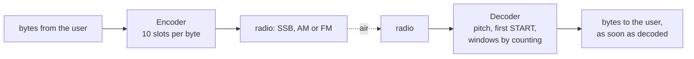

### 0.2 Guiding principles (Gustavo, 2026-09-28)

**Simplicity, computational affordability and clean transmission.** The modem should run on the smallest hardware
that can do the job, down to an AVR such as the Arduino Nano; when a feature needs more architecture, a simpler
protocol that removes the need comes first; nothing is added to the user's data on the air. Gustavo: "I am
simplifying the design for making it accessible for everyone and for speed … it is for the sake of the transmission."

### 0.3 v1.0 decisions (Gustavo, 2026-09-27 and 2026-09-28)

| # | Decision | In plain words: why |
|---|---|---|
| V1 | **One byte per window of 10 slots:** START tone, 8 data slots (most significant bit first; a tone is 1, silence is 0), STOP tone. No other package size. | "start tone, 1, 2, 3, 4, 5, 6, 7, 8, stop — so 10 tones": a serial port's frame, which every computer person knows; every window is one byte, so byte sync is always there. |
| V2 | **START and STOP are plain tones, like a data 1** (no twist, no phase reversal anywhere). | Simplicity: the receiver needs only the energy of each slot. The START and STOP of each window give its reference level (Gustavo's original idea: the markers set the level of a 1). |
| V3 | **The speed is set in bytes per second, the same on both sides**; the receiver does not measure it. Any value from 1 to 25 bytes/s (resolution 0.01): slot T = 1 / (10 × bytes/s). No named speeds. | "We will give you the speed, and it must match the other side speed, so it can read on the synced intervals." Knowing T removes the receiver's speed search. |
| V4 | **No tune tone, no sync train, no END markers.** A transmission is the byte windows back to back, between silences. | "The idea of using 8 bits is for dropping the sync tones … only the byte being transmitted." The first tone after silence is the START of byte 0; the silence after the last STOP is the end. |
| V5 | **The receiver finds the pitch by itself** in the data (the tones of START, STOP and the ones). | Shift resilience on USB and LSB is the reason Unlimited exists (HF SSB focus). |
| V6 | **Decode only from the start of a transmission.** A receiver that starts listening in the middle waits for the next transmission. | Gustavo likes that a receiver "picked up at the middle" decodes only a whole transmission; without markers that differ from data, a late listener cannot find the windows in general (0xFF bytes are all tone). |
| V7 | **Pure byte streaming:** no packet layer on the air, no check, no resend, nothing held; the library never buffers user data (a string or byte array is dispatched at once; its meaning is the user's). | "The api will never buffer data, it must be dispatched right away … it can not be managed by us." Known limit: AX.25 resends frames that never arrive, not frames that arrive damaged (§10). |
| V8 | **VOX:** only when the radio is keyed by VOX, a plain lead tone (default 150 ms) precedes the transmission, followed by at least 2 silent slots, so the START is still the first tone after silence. With RTS, DTR or CAT PTT only silence precedes it. | A VOX needs sound to key the transmitter; the gap keeps the lead from being taken for a START. |
| V9 | **The KISS modem** (`unlimited_modem`): one KISS data frame = one transmission; received bytes go to the computer as they are decoded (`C0 00` when a transmission is locked from its start, each byte, `C0` at the end). KISS is only the computer's door, not the air protocol. | §12. |
| V10 | **Targets for v1.0:** PC (macOS with CoreAudio, Linux with ALSA; Windows later) and ESP32 (a KISS TNC sketch), on one portable core (no heap, no threads). **The Arduino Nano modem follows right after v1.0** on the same format. | Computational affordability; the simple format makes an AVR receiver possible (§3.9). |
| V11 | **Operational programs:** `unlimited_modem`, `unlimited_encode` (plays through the sound card, with PTT) and `unlimited_decode` (listens live, with the `--tui` view and a level meter). | "All the applications for encode, decode with TUI and the modem operational." |
| V12 | **PTT:** VOX; RTS or DTR (normal or inverted) on a serial port; CAT PTT for Icom CI-V, Yaesu, Kenwood and custom hex; a GPIO on the ESP32. | `kiss_modem`'s set without USB GPIO; no library. |
| V13 | **Proof on Linux:** GitHub Actions (Ubuntu with GCC and ALSA, macOS) builds and tests every push; Gustavo tests on his bench (IC-705 and IC-7300 MKII over USB, Xiegu X6200 over USB, a VOX radio with a serial TRS PTT cable). | CI proves builds and tests; only radios prove the audio path. |
| V14 | **Decision threshold: the adaptive line (`auto`) by default** (revised 2026-09-28), in the library (`DecoderConfig::decision_mode = DecisionMode::adaptive`); **the fixed line stays selectable**: 70 % of the window's reference, or any value from 50 to 90 % (`--threshold PCT` in the programs, `DecisionMode::fixed` with `threshold_percent`). | First (2026-09-27) Gustavo: "make the threshold about 70 % configurable, 70 is the default for all applications" — his original 70 % rule, kept as the selectable one. Revised by his decision of 2026-09-28, on the measurements of the long suite: at v0.3's gate SNRs the fixed 70 % line gave a BER of 4.0–6.2e-3 at every speed (A1 FAIL, gate 1e-3), the adaptive line 2e-5–1.3e-4 — about 3 dB less signal for the same BER (§9). |
| V15 | **Sound devices in every program:** `unlimited_modem`, `unlimited_encode` and `unlimited_decode` list every audio input and output (`--list-devices`) and use the ones the user picks (`--input`, `--output`, or `-d` for both; by number, part of the name or unique ID; `default`), at any sample rate (converted to and from 8000 Hz). | Gustavo: "please have a --list-devices so the user can list all the possibilities and have a way to allow them to use what is needed." |
| V16 | **Fade bridge — optional, off by default, kept to be revisited** (`DecoderConfig::fade_bridge`). When on: a transmission ends only after **2 silent windows** (the rule off: 1), and a new transmission's START needs **at least 300 ms of silence before it** (`k_min_onset_silence_ms`; never less than 2 slots; off: 2 slots), or a VOX lead (a steady tone the receiver tests as such) followed by its gap. The silence comes from before the transmission: senders whose receivers use the bridge give each transmission a lead-in of at least 300 ms (the radio's TX delay). Nothing is added inside a transmission or after it; the library's encoder keeps the defaults of 7b15d50 (no lead-in, the 100 ms tail). | Gustavo: "I want that fading optional, default is disabled on encode and decode, also optional on modem"; "make the fading optional and we will come back on that later on, but please do not throw away that just now"; and on the format: "I do not want to add ANY delay in the transmission after it starts." Measured before: in fading (C1–C4) 40 extra and 21 shifted bytes of 406,543, from fades read as an end and the signal coming back taken for a new transmission, numbered from 0 (§11 P4). With the bridge on, measured with V20 and V24 (§9): 37 extra and 13 shifted bytes in the C rows against 88 and 33 without it (with V18's check 5 and 0, 14 and 0; reported since V22); CW beside the signal (C9) at 6 bytes/s 97 → 100 % of transmissions from byte 0; receiver AGC (C7) at 1 byte/s 85 → 92 % of the bytes, with 3 extra bytes, at 3 bytes/s 100 → 98 % with 17; its limits in §11 P13. Kept to be revisited with Gustavo. |
| V17 | **Framing stays strict:** a window whose START or STOP is missing is dropped (its byte never delivered), as §3.6 says. | Gustavo's decision of 2026-09-28: while there is no check on the air (V7), the markers are the only protection against garbage bytes; a softer rule (§11 P5) would deliver more bytes in fading and some of them wrong. |
| V18 | ~~A longer check before lock at high speeds~~ — **superseded by V20 on 2026-09-28**. Was: the first windows of a transmission (at least 2 and at least 320 ms: 4 windows at 12 bytes/s, 8 at 25) had to show START and STOP before any byte was released, and a transmission shorter than that had to end inside them with 2 silent windows. | Gustavo had asked for about 240 ms at 25 bytes/s against speech false locks; built and measured on 2026-09-28 (speech at 12 bytes/s about 150 locks in 2 hours with the 2-window check of 7b15d50, 1 with 320 ms; §9 keeps the measurements). Its costs — `locked` 160 ms later at 12 and 25 bytes/s, a transmission lost when one marker of the check's windows faded, a short frame's lock after the next frame's START in the modem link — and the explanation with pictures led to V20. |
| V19 | **DCD means "a transmission is being decoded"** (revised with V20): `Decoder::dcd()` is on from the lock — the anchor's first window read and released — while the receiver tracks, and off at `end` or `lost`; it is exactly the TRACK state. A tone alone (a carrier, CW, speech, FM noise) does not turn it on; a stray lock on speech or CW does, for as long as it is tracked (§3.10). The KISS modem and the programs' views follow it. | Proposed as an engineering decision (§11 P7) and decided on 2026-09-28: DCD was "not SEARCH", on 97–100 % of the time near CW or speech and 69 % in FM noise below threshold, so a KISS modem waiting for DCD off (§12.1) would never send there. With V20 there is no check whose windows DCD could look at: it follows the lock (measured in §9). |
| V20 | **Pure one byte, one decision** (2026-09-28): the transmission's first tone after silence (the anchor, §3.3) sets the grid; **every window is decided alone, the first included**: a readable window (its START and STOP present: they are its thresholds) releases its byte at once, an unreadable one is suppressed. There is no check before lock: the lock comes with the first window, and a candidate whose first window is unreadable is no transmission. Stray bytes that speech or keyed CW may produce are left to the upper protocol; for real transmissions 0 extra and 0 shifted bytes stayed the integrity gate (made a report by V22). | Gustavo, after the check was explained to him with pictures: **"Pure one byte, one decision."** The format as he confirmed it: ONE pitch; each byte a serial window of 10 slots (START, 8 bits, STOP); START and STOP are the thresholds; the decoder decodes each byte in one go and suppresses it if unreadable. Kept: the anchor, the early steady test, the pitch search, the look-ahead and the kept audio, the fade bridge (off by default) and every other robustness piece. |
| V21 | **Modes: SSB (USB or LSB), FM and AM only.** Morse (CW) is never a mode of Unlimited; it appears only as interference in the tests. | Gustavo, 2026-09-28: "we will only support SSB, FM and AM." |
| V22 | **Integrity is the upper protocol's, for v1.0 (a gate decision).** Extra and shifted bytes — in fading channels (a fade read as an end and the signal back numbered from 0; a START lost in a fade and a data tone taken for one), and in AWGN an extra byte from a lock on a data tone after a START missed at the gate SNR — are **reported, not gated**: the long suite's Integrity rows are REPORT rows, and A1, A3, L5 and L19 no longer count them. `--fade-bridge` stays available, off by default. **Still gated** (§4): BER ≤ 1e-3 and loss ≤ 1 % at each speed's gate SNR (A1); ≥ 99 % of transmissions from byte 0 at gate + 3 dB (A3); no slip — every byte right, one lock — over 10 minutes at ±1000 ppm (L5); BER ≤ 1e-4 across pitches and filters at gate + 6 dB (L19); and in `make test`, every exactness test at a strong signal (loopbacks at 20 dB byte for byte with nothing extra, a framing error never delivered, back-to-back transmissions each once). | Gustavo, 2026-09-28, after the three questions of V20's measurements were explained to him with pictures: accept the fading integrity for v1.0 as the upper protocol's job, by his RTTY rule — "the modem may drop or garble bytes, the protocol above must reject them" (his words as relayed). Measured when decided (§9): 171 extra and 65 shifted bytes among 408,513 released in the A, S, L and C rows (both decision lines counted), 36 and 13 among 41,408 with the fade bridge; after V24, 177 and 65, 37 and 13. |
| V23 | **The KISS modem drops receptions shorter than an AX.25 frame** (`unlimited_modem --min-frame N`, default **15**, 0 = off; `ModemConfig::min_frame_bytes` in the portable core, so the ESP32 TNC has it too). A reception's first N − 1 bytes wait in the modem; when the N-th is decoded, C0 00 and all N go to the computer at once, in order, and the rest streams as before; a reception that ends (`end` or `lost`) with fewer than N bytes sends **nothing**, not even C0 00 or C0. `unlimited_encode` and `unlimited_decode` are untouched. The price: with N = 15 a frame's first byte reaches the computer 14 windows after it was decoded — 14 s at 1 byte/s, 2.3 s at 6, 1.2 s at 12, 0.56 s at 25; with 0 every reception streams from its first byte. | Gustavo, 2026-09-28: a short-frame filter in the modem, default 15 (the AX.25 minimum: two addresses of 7 bytes and a control byte), 0 = off, in the portable core; the stray bytes of V20 are a byte or two. Measured (§9): through the modem's core with the default, **0 frames and 0 bytes per hour** reach the computer in every F scene (noise, carriers, keyed CW, speech; up to 434 stray receptions an hour, the longest 8 bytes). |
| V24 | **The start, tuned for 1 byte/s** (Gustavo asked for it, 2026-09-28; two rules, **confirmed by Gustavo at every speed**, not only 1 byte/s, on 2026-09-28, §11 P11): (1) **the running reference settles over the first 2 windows** — windows 0 and 1 are each judged against the mean of every marker read so far, their own included (a fade of up to about 9.5 dB between them is a fade, not missing markers), then the exponential reference takes over from that mean; (2) **window 0's START is judged against the noise first** — a START that is no tone above the noise (\|S\|² < 4 × the noise) is noise, let go without putting the scan in data, so a START that comes a little later is still taken. Nothing else changed. | V20 had cost 1 byte/s delivery under QSB (C5 46 → 38 %: window 0's two markers alone set the reference and the QSB took window 1's under half of it) and under a receiver AGC (C7 83 → 79 %: a swell of the AGC's hiss before a START became a candidate whose rejection put the scan in data). Measured (§9): C5 38 → 47 %, C7 79 → 85 %, most fading rows up to 5 points better, A, S and L rows unchanged, 6 more extra bytes over the suite and up to 8 more stray bytes per hour. |
| V25 | **A1's loss gate is kept; the misses at 1 and 6 bytes/s stay FAIL rows, open problems for after v1.0** (a gate decision, Gustavo, 2026-09-28): at each speed's gate SNR, A1 asks for loss ≤ 1 %; at 1 and 6 bytes/s the receiver misses 4.0 % and 2.6 % of the bytes (the transmissions whose START it does not find: byte 0 right in 188 and 191 of 196), so the long suite keeps ending with these 2 FAIL rows, and any other FAIL is news. The gates are not lowered and the receiver is not changed for them before v1.0 (§11 P2, §13). | The gate SNRs were copied from v0.3 at the same slot length T, and v0.3 found a transmission on its tune tone and sync train (a steady tone of 250 ms by default, then 8 markers, before the first bit; v0.3's README at tag `v0.3.0`); v1.0 has none (V4: the first tone after silence is the START of byte 0), so the receiver must find each transmission from its first window alone, at an SNR chosen for a signal that announced itself. At gate + 3 dB nothing is missed (A3: 100 % from byte 0 at every speed). Explained to Gustavo with a picture before he decided: "gates kept; misses are open problems". |
| V26 | **The ESP32 KISS TNC sends its audio as a 1-bit stream on I2S1** (GPIO25, 64 bits per 8 kHz sample, 512 kbit/s, clocked by DMA), made analog by two RC poles (1k/47 nF, 10k/4.7 nF) and a divider, **confirmed for v1.0** (Gustavo, 2026-09-28); an external I2S DAC board (for example a PCM5102A on I2S1) only later, if the bench shows the need. | On the classic ESP32 the ADC's DMA and the DAC's DMA both run through I2S0 (both drivers acquire it: `adc_dma.c` and `dac_dma.c` in the Arduino core's libraries), and the receiver needs the ADC's DMA; the second I2S peripheral as a 1-bit stream needs no extra part, is crystal-timed, costs about 3.4 % of core 0 (*estimate*) and measured 80.7 dB of SNR in 300–2700 Hz on the PC, as `tx_uno`'s PWM does on the Uno (§12.7, §11 E1). |

- V11, V14, V15 as built: `unlimited_encode` and `unlimited_decode` in §7 and §12.6, `unlimited_modem` in §12.1–§12.3
  and §12.6. The programs set the decision line to `auto` themselves (`cli::receiver_config()`; the modem's options
  default to `DecisionMode::adaptive`), whatever the library's default; `--threshold PCT` selects the fixed line.

**Parked after v1.0:** a check and a resend (a per-byte "tone CRC" was discussed), several frames per transmission,
KISS over TCP, Windows, a multi-station receiver.

### 0.4 What v1.0 keeps from v0.3, and what it drops

| Kept (proven in v0.3's measurements) | Dropped |
|---|---|
| One pitch, OOK slots with Tukey-shaped beeps (α 0.5), the clean narrow spectrum | Tune tone, sync train, END markers |
| The receiver's pitch search, mixer and kept audio (history) with its re-mix, the noise estimate, the impulse blanker, the adaptive line (the default since 2026-09-28) and the fixed 70 % line (selectable) | The twist (phase reversal), learning T and N, packages of N bits, short final packages |
| The integer encoder for AVR, the WAV codec, the audio driver boundary, the channel simulator, the TUI, the test framework and the AVR cycle model | Cold late joins, the station memory's relock rules, the packet layer (`packet.hpp`) |
| The bandwidth calculator and passband check | The v0.3 presets (`hf_slow` … `fm`) and profiles as the way to set the speed |

### 0.5 Development standards: the definition of done (Gustavo, 2026-09-27)

A change — a fix, a feature, a redesign, a new tool — is finished only when anyone can see what changed, why, and the
proof that it works:

| # | Standard | What it asks for |
|---|---|---|
| D1 | **Spec first** | The change is written here before or together with the code: plain words first, exact rules after; each decision with its reason and the alternatives rejected; a changelog row; every affected section. |
| D2 | **Design explained, with diagrams** | In accessible language first and complete after, with at least one picture (Mermaid, or an SVG generated from the real code by `make docs`). A design choice that changes behaviour, a gate or the protocol is shown to Gustavo and confirmed before it is built. |
| D3 | **Proof that it works** | Tests that fail before and pass after; measured numbers before and after; every target green (`make test`, `make test_long`, `make check_embedded`, `make arduino_check`, `make demo_run`, `make docs` deterministic). Limits stated in §11, never hidden; a gate changes only by Gustavo's decision. |
| D4 | **Every document updated** | This file, `README.md`, `docs/`, `--help`, the examples and the comments describe the code as it is. |
| D5 | **Clarity** | Accessible to radio amateurs, programmers and scholars; every term defined; numbers with units, marked *measured* or *expected*. |
| D6 | **Git** | Commit and push only when Gustavo asks; the author is Gustavo Campos, with no co-author lines. |
| D7 | **Pedagogic, with pictures everywhere** | Layered: lossless plain words for newcomers first, depth for experts after; SVG from the real code or Mermaid used extensively, in the documents and in every report to Gustavo. |

---

## 1. The signal (normative)

### 1.1 Slots, beeps and the pitch

**In plain words.** Time is cut into equal slots. In each slot the sender either plays a short beep on the pitch or
stays silent. Every beep swells and fades inside its own slot, so consecutive beeps still show where each slot begins
and ends, and the spectrum stays narrow.

**Exact rules.**
- One pitch f₀ (the tone), 300..2700 Hz, default 1500 Hz (`k_default_tone_hz`); it must lie inside the receiving
  radio's passband with the signal's occupied band (§1.3).
- A **tone slot** is a beep: the carrier sin(2π f₀ t + φ), phase-continuous from slot to slot, times a Tukey window
  with α = 0.5 over the slot (cosine ramps over the first and last quarter, flat in between), crest A. A **silent slot**
  is zero.
- Encoder arithmetic is integer only (AVR): a quarter-sine table, Q15 envelope and carrier, as in v0.3.

### 1.2 The byte window

**In plain words.** A byte takes 10 slots. Slot 0 is the START, always a tone; slots 1 to 8 carry the bits, most
significant first; slot 9 is the STOP, always a tone.

**Exact rules.** Window of byte b: slot 0 START = tone; slot j (1..8) = tone when bit (8 − j) of b is 1, silent when it
is 0; slot 9 STOP = tone. Consecutive windows follow each other with no gap: the STOP of byte k is followed directly
by the START of byte k + 1.

### 1.3 Speed, slot length and bandwidth

**In plain words.** You choose how many bytes per second to send; both stations use the same number. Slower is more
robust and narrower; faster is wider and needs a stronger signal.

**Exact rules.**
- Speed B in bytes per second, 1.00 ≤ B ≤ 25.00 (`k_min_bytes_per_second`, `k_max_bytes_per_second`), resolution
  0.01. Slot T = 1 / (10·B): T_us = round(100000 / B) (`slot_us_for_speed()`), 4,000..100,000 µs. The net data rate
  is exactly B bytes/s (8·B bit/s).
- Occupied band (99 % of the power) ≈ 4.4/T around f₀; −26 dB width ≈ 7.0/T (v0.3's formulas, same beeps):

| B (bytes/s) | T | Occupied band | Typical use |
|---|---|---|---|
| 1 | 100 ms | 44 Hz | very weak HF paths |
| 3 | 33.3 ms | 132 Hz | weak HF |
| 6 | 16.7 ms | 264 Hz | HF default |
| 12 | 8.3 ms | 528 Hz | good HF, AM |
| 25 | 4 ms | 1100 Hz | FM |

- The bandwidth calculator, the passband fit and the shift tolerance of v0.3 carry over (`occupied_band()`,
  `passband_fit()`, `search_range()`), computed from T; the programs print the bandwidth line at start-up.

---

## 2. Transmission format (normative)

### 2.1 Layout

**In plain words.** Silence (while the radio switches to transmit), then the bytes one window after another, then a
short silence. With a VOX radio a plain lead tone and a short gap come first.

```
PTT (RTS/DTR/CAT):  [lead-in: silence][byte 0][byte 1] ... [byte n-1][tail: silence]
VOX:                [lead tone][gap: >= 2 silent slots][byte 0] ... [byte n-1][tail: silence]
```

**Exact rules.**

| Field | Rule | Default |
|---|---|---|
| lead-in | `lead_in_ms` of silence before the first START (the radio's TX delay; only at the beginning) | 0 in the library; **100 ms in the programs when the PTT keys the radio by RTS, DTR or CAT** (Gustavo, 2026-09-28: radios need about 20–100 ms to switch to transmit, and nothing is ever added once the transmission has started): `unlimited_encode` (`k_keyed_lead_in_ms`, `--lead-in-ms`), `unlimited_modem` (`--txdelay 10`, `k_default_txdelay_ms`); none with VOX (its lead comes first) and none for a file; at least 300 ms (`k_min_onset_silence_ms`) when the receivers use the fade bridge (V16) |
| VOX lead | only when configured (`vox_lead_ms` > 0): a steady tone at f₀ of max(ceil(`vox_lead_ms` / T), `k_min_vox_lead_slots` = 3) slots, ramped at both ends, then `k_vox_gap_slots` = 2 silent slots (as built: 3 slots let the receiver see a steady tone through two slot boundaries). The gap stays 2 slots at every speed (*measured* 2026-09-28: near the gate a gap of 3, 4 or 6 slots decoded no more transmissions than 2 slots; the losses with a VOX lead came from the receiver taking the lead for a START, now fixed in §3.3) | off in the library; 150 ms (`k_default_vox_lead_ms`) in the programs wherever VOX keys the radio: `unlimited_encode` on a sound card keyed by VOX (the default `--ptt`) or with `--ptt vox` named (for a file too), `unlimited_modem --ptt vox` (its default); `--vox-lead-ms` sets it |
| bytes | n windows of 10 slots (§1.2) | – |
| tail | silence of max(`tail_ms`, 2 slots) | 100 ms |

- The first tone after at least 2 slots of silence is the START of byte 0 (the receiver's anchor, §3.3). The VOX lead is
  a steady tone longer than a slot, followed by the gap, so it is never taken for a START.
- **With the fade bridge (V16, optional, off by default)** the first tone after at least 300 ms of silence is the START
  of byte 0, or the first tone after a VOX lead's 2-slot gap. The silence comes before the transmission: a sender whose
  receivers use the bridge sets `lead_in_ms` to at least `k_min_onset_silence_ms` (300 ms: the TX delay PTT radios need
  anyway), so its next transmission follows at least that much silence whatever came before it; the VOX lead and its gap
  stand for it (the lead-in may then be 0). Nothing changes inside a transmission or after it: the tail stays
  max(`tail_ms`, 2 slots), and the library's defaults stay those of 7b15d50 (Gustavo: "I do not want to add ANY delay in
  the transmission after it starts"). The programs enable the bridge on both sides with their own option (§7, §12).

### 2.2 Worked example (bit-exact)

"Hi" = 0x48 0x69 at B = 6 bytes/s (T = 16.667 ms, 133.33 samples per slot at 8000 Hz):

| Window | Slots 0..9 (T = tone, . = silence) | Byte |
|---|---|---|
| 0 | `T . T . . T . . . T` | 0x48 = 0100 1000 |
| 1 | `T . T T . T . . T T` | 0x69 = 0110 1001 |

20 slots = 333 ms of signal, plus the lead-in and the tail. (A key pressed alone is one window: 167 ms at 6 bytes/s.)

### 2.3 Streaming and the end of a transmission

- The encoder sends while bytes keep coming: at each window boundary it takes the next byte from its queue; when the
  queue is empty at a window boundary, it sends the tail and the transmission ends. It never pads.
- The receiver ends a transmission when the START slot of the next window is silent and the silence lasts a whole
  window; with the fade bridge (V16), two whole windows (§3.7).

### 2.4 Duration

A transmission of n bytes lasts lead + n × 10·T + tail (plus the VOX lead and gap when used): at 6 bytes/s, 100 bytes
take 16.7 s of windows.

### 2.5 Encoder queue and threads (from v0.3, unchanged)

One producer calls `write()`, `queue_free()`, `queued()`, `busy()` and, while idle, `start()`; one consumer (an ISR or
the audio thread) calls `next_sample()` or `render()`. The queue (`UNLIMITED_ENCODER_QUEUE`, power of two 16..128,
default 64) hands over with release/acquire fences (`platform.hpp`), so the two may run on different cores; `abort()`
and `status()` belong to the consumer.

---

## 3. The receiver (normative outline; exact constants in §3.8 as built)

### 3.0 Overview

**In plain words.** The receiver is told the speed. It looks for a steady pitch in the audio, keeps a few windows of
the audio it hears (so it can go back), finds the first tone after silence — the START of byte 0 — and from there
reads one window every 10 slots: the START and STOP tones tell it how loud a 1 is, each data slot is compared with the
decision line (the adaptive line by default: about 70 % of that on a weak signal), and each byte goes out as soon as its
window is read, the first one included: **one byte, one decision** (V20). Every window must begin and end with a tone;
a window that does not is dropped (the first one too: then no transmission started there), and a whole window of
silence ends the transmission (two with the fade bridge, V16).

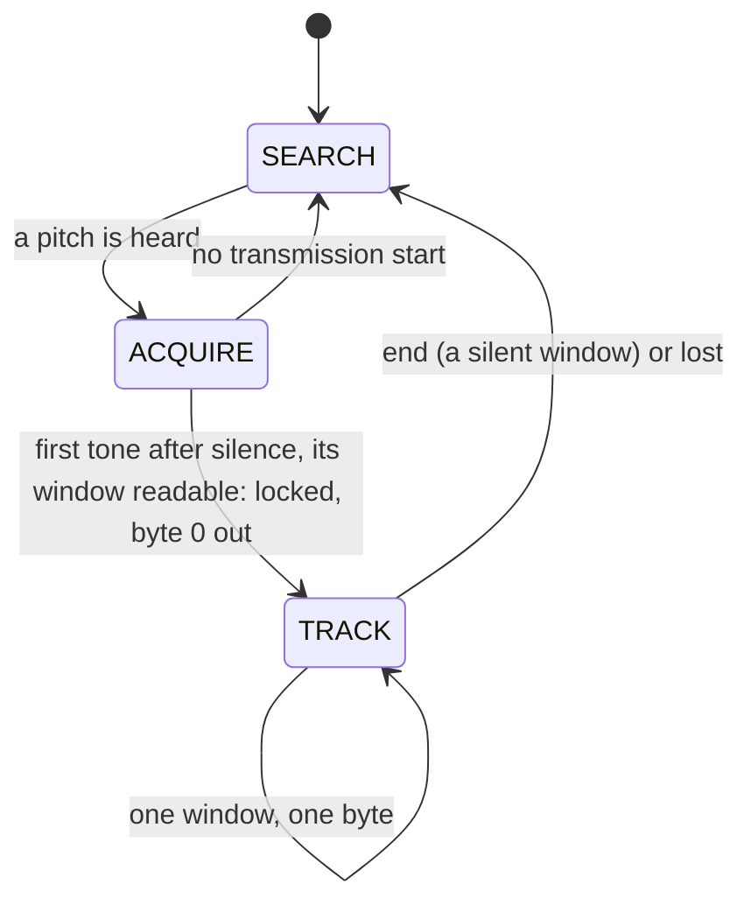

### 3.1 Front end

**In plain words.** The receiver hears every sample twice: the pitch search hears it at once, the part that measures
slots hears it a moment later (the **look-ahead**). So when a transmission starts, the search has time to find its
pitch and point the receiver at it before the first START reaches the part that needs it, with the silence before it.

**As built.**
- Input 8000 Hz int16 (`k_decoder_rate_hz`). The **look-ahead** (`dsp::Lookahead`) delays the mixer's input by
  R = min(2 T + 200 ms, 400 ms) samples (`k_lead_latency_samples` 1600, `k_lookahead_max_samples` 3200): 3200 samples
  at 1 byte/s, 1866 at 6, 1664 at 25. Every event comes R after the audio that caused it (`lookahead_samples()`).
- An NCO at the pitch, a mixer and a CIC-2 decimate into blocks of clamp(round(T/8), 4, 32) samples (32 at 1 and
  3 bytes/s, 17 at 6, 8 at 12, 4 at 25); each block's complex sum enters the **history** (`dsp::PrefixHistory`:
  prefix sums in 1024 cells, fractional windows), 4.1 s at 1 byte/s and 0.51 s at 25.
- The impulse blanker (v0.3's, 2 blocks of latency) zeroes blocks with an impulse. When the NCO moves by at most
  `k_remix_reach_hz` (75 Hz) the kept history is re-mixed (rotated) to the new pitch; a farther move forgets it.
- **Noise** (deviation from v0.3's 25 % quantile): in SEARCH and ACQUIRE the tone search's floor (the mean of the
  lower half of the lock bins' slow averages; the guard bins, half a bin beyond the range, are left out because a
  filter's edge may begin there); in TRACK the mean power of the central half of clear zeros (under 35 % of the line,
  `dsp::NoiseTracker`), which stays unbiased in impulsive noise.

### 3.2 Pitch search and which pitch is followed

**In plain words.** The search watches the whole passband in 50 Hz steps. The receiver keeps its NCO on the pitch the
search points at. A tone that has just come up out of silence (**fresh**) is a transmission starting, and it takes
the receiver over from a tone that has been there for a while (a carrier, CW), because the look-ahead still holds its
first START. A receiver that starts in the middle of a transmission does not decode it (V6): it waits for the next.

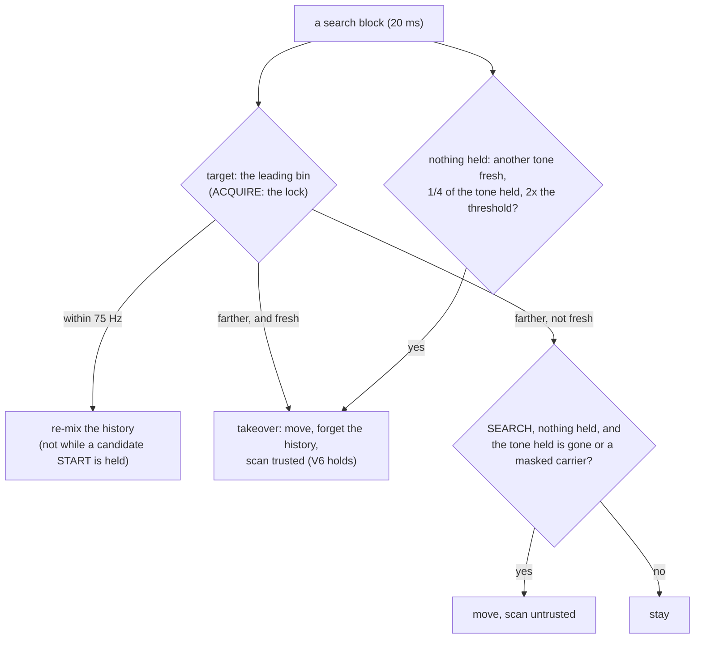

**As built** (`dsp::ToneSearch`, `Decoder::steer()`).
- Bins: the multiples of 50 Hz nearest to the search range's edges and those between (at most 49), plus a guard bin
  on each side (never locked). The search range is the passband less half the occupied band, within 300..2700 Hz
  (`search_range()`). The **leading bin** is the strongest local peak of the slot-long averages above the floor by the
  Gamma tail of noise at 1e-6 (z 4.75); the **lock** (`candidate()`) is v0.3's fast/slow lock with its tone estimate.
- A bin is **quiet** after its slot-long average stayed under the leading threshold for `k_quiet_slots` (10 slots:
  longer than any silence inside a transmission), and with the fade bridge for at least 300 ms too (`configure()`'s
  `min_quiet_ms`: a fresh tone then followed 300 ms of silence, which the scan credits, §3.3); it is **fresh** while it
  stands out again at most `fresh_blocks_`
  search blocks after such a quiet: floor((R − 2 T − settle − 160) / 160) − 1 = 7 blocks (140 ms) at every speed, so a
  move then still finds 2 silent slots before the START in the look-ahead.
- Steering, every search block before an anchor (SEARCH, ACQUIRE):
  1. target within 75 Hz of the NCO: re-mix (not while a candidate START is held);
  2. **takeover** by the target (the leading bin; in ACQUIRE the lock) when it is fresh and farther than 75 Hz — or,
     while a candidate START is held or the tone held came up within `protect_blocks_` (R + 2 T), farther than half
     the occupied band plus a bin (`band_reach_hz_`: a signal's own sidebands come up with it);
  3. otherwise, when nothing is held and the tone held is not a young leader: takeover by the strongest fresh local
     peak farther than 75 Hz whose average is at least `k_takeover_ratio` (1/4) of the tone held's and
     `k_takeover_excess` (2) times the leading threshold (a transmission starting beside a carrier or CW that is
     stronger in the averages; not a noise bin crossing the threshold by chance);
  4. in SEARCH with nothing held: a far move when the tone held is gone or is a masked steady carrier (untrusted).
- A takeover or far move forgets the history; the scan restarts **trusted** when the new tone is fresh (the look-ahead
  holds the silence before its START), **untrusted** otherwise (V6).
- **Steady carriers** are masked (v0.3's slow variance test, after 2.5 s); a masked bin keeps its averages across
  `end` (`ToneSearch::forget()` restarts every other bin), so a carrier beside the signal is not grabbed again before
  each transmission. An ACQUIRE that times out on a tone still present bans it for 10 s × 2^strikes (at most 8×).

### 3.3 Acquire: the first START

**In plain words.** The receiver looks back in the kept audio for the first tone after at least 2 silent slots (300 ms
with the fade bridge, or a VOX lead's gap): the **anchor**, the START of byte 0. A steady tone (a carrier, CW, the VOX
lead) is let go at once. When the first window is in, the pitch is measured exactly from its tone slots, the START is
placed exactly, and the window is decided like every other one (V20): readable — its START and STOP present, its slot
edges quiet as beeps leave them — it is `locked` and its byte comes out at once; unreadable, it is suppressed and no
transmission started there. Nothing waits for later windows. A candidate whose START is no tone above the noise at all
(a swell of hiss, V24) is simply let go: a transmission starting just after it is still found.

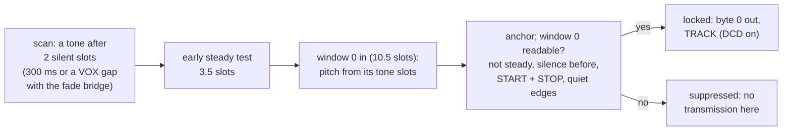

**As built.**
- **Scan** (one position per history block, at most 8 per input block): a slot window is **loud** when its energy
  (coherent sums over sub-windows of at most 10 ms, added) is above what noise gives with probability 1e-6. An onset
  is located on the balance of a beep's two halves, walked back over a weak START; it becomes a candidate when at
  least 1.75 slots (`k_onset_silent_slots` 2 less `k_onset_tolerance`) of silence precede it — **with the fade bridge
  (V16)** max(300 ms, 2 slots) less the tolerance, or 1.75 to 3 slots (`k_vox_gap_slots` + `k_vox_gap_reach`) after a
  loud run whose 2 slots before its last quarter slot are a steady tone (`steady_before()`: none of 19 sub-windows of
  0.2 T, 0.1 T apart, under 0.6 of their mean: beeps fall silent at every slot edge): a VOX lead's gap; a trusted scan
  restarted on a fresh tone counts the tone search's quiet before its origin (at least 300 ms with the bridge, §3.2) for
  its first onset — and the silence is **proven**: the scan is trusted, or a loud run ended before it, or 10 silent
  slots came before it since the scan began. An onset that is not a candidate (and an untrusted scan's first tone
  without a clear onset and no whole silent window before it) marks the scan **in data**: no candidate until 10 silent
  slots. A candidate is **watched** for 3 slots: a tone 16 times its energy right after it, with 2 quiet slots before,
  replaces it (a pre-echo).
- **Early steady test** (as soon as the history holds the first 3 slots): the slots after the START as loud as a
  quarter of its energy and the quietest edge (±0.1 T windows, searched within ±0.2 T) at each of the first two slot
  boundaries above 0.6 of the START's energy density, on 10 ms sub-windows: a steady tone; rejected.
- **The first window, one decision** (V20), in two steps at two blocks once the history holds window 0 and half a slot
  (`window_ready()`, §3.9):
  1. **Pitch** (`refine_pitch()`): the products of blocks 2 apart (and 1 apart, for the alias) over window 0's tone
     slots only (the markers and the slots with a quarter of their energy), so an interferer the CIC-2 lets through
     adds nothing from the silent slots; coherence at least 0.4 (`k_pitch_coherence`); a correction larger than half
     the occupied band (at least 75 Hz: 75, 75, 132, 264, 550 Hz at 1, 3, 6, 12, 25 bytes/s) means another signal:
     suppressed.
  2. **Anchor** (`refine_anchor()`): the early/late balance of window 0's START and STOP, then back a slot while the
     slot before holds half the START. **Noise first** (V24): a START with |S|² under 4 × the noise (`k_marker_snr`)
     is noise — a click, a receiver AGC's hiss pumped up in the silence — and is let go without putting the scan in
     data (`Check::noise`), like a steady tone. **Readable** (`window_check()`): not a steady tone (the slots of window 0 as
     loud as half the START from it on, at least 3 with it, and the **mean** edge density of their boundaries above 0.6
     of the START's: a VOX lead or a carrier, let go without putting the scan in data, so the START after a VOX lead's
     gap is found); the 2 slots before the START hold nothing (|S|² ≥ 8 × noise and a quarter of the START's level
     refuse it: the anchor is the first tone after silence); its START and STOP present (level ≥ 0.5 × their mean and
     |S|² ≥ 4 × the noise: the thresholds of V20, as in TRACK); the energy at its 11 slot edges at most 0.3 of the
     markers' (`edge_ratio()`: beeps, not a tone on a wrong grid). Readable: `locked` with the reference of its markers,
     TRACK reads window 0 in the same block and releases its byte. Unreadable: suppressed (a missing marker puts the
     scan in data, V6: the candidate may be a data tone of a transmission whose START was missed).
- (Until V20 the check covered the first max(2 windows, 320 ms) — 4 windows at 12 bytes/s, 8 at 25 — before any byte
  was released (V18); §9 keeps its measurements.)
- ACQUIRE gives up 1.5 s (at least 3 windows) after the last beep the scan saw or the last time the tone held came up
  fresh.

### 3.4 Windows by counting and timing

- Window k starts at t₀ + 10·k·T; each window is read when the history holds it and half a slot more.
- **Timing:** a PI loop on the early/late balance of the START, the STOP and the decided ones (slope 5.33 per slot,
  gain 0.2, integral 0.02, at most 0.25 slot per window): *measured* worst T error 0.08 % and no slip over 10 minutes
  at ±1000 ppm (L5).
- **Pitch:** the phase advance of the tone slots (gain 0.5, at most 0.1 cycle per slot per window).

### 3.5 Levels and decisions

- The reference line of a window runs from its START to its STOP level; the running reference (exponential, 0.25) is
  the markers' mean. **It settles over the first 2 windows** (V24, `k_settle_windows`): windows 0 and 1 are each
  judged against the mean of every marker present so far, their own two included — window 0 against its own markers'
  mean, window 1 against the mean of the four — and after window 1 the exponential reference starts from that mean. So
  window 1's markers pass down to about a third of window 0's (−9.5 dB) where one window's reference passed them to
  half (−6 dB): at 1 byte/s a window lasts a second and a QSB moves the level that much between two windows. A missing
  marker (near the noise) still fails, and the settling decides markers only: a silent START's window (the end, or a
  faded START, §3.7) is still judged against the reference before it.
- **Adaptive line (the default, V14 as revised):** v0.3's smart line, 50–75 % of the reference above the noise (50 % on
  a clean signal, about 70 % on a weak one); **fixed line** (selectable, `DecisionMode::fixed`): `threshold_percent`
  (70 by default, 50..90); neither ever below 2.6 σ of an empty slot.
- Soft values: 64 = one decision line of margin, ±127; `weak` within 12.5 % of the line.

### 3.6 Framing check and release

- A window whose START or STOP is missing (below the marker rule) is a framing error: its byte is never delivered, a
  `slot` event carries `event_flag_framing`, counting goes on; 2 in a row with signal present end with `lost`. The rule
  stays strict (V17): the markers are the only protection against garbage bytes while nothing is checked on the air.
- A byte is released at its window's read, byte 0 included (V20: it comes right after `locked`, a block or two later
  than the others for the pitch and the anchor): *measured* in §9, at most about 1.3 slots after the end of its STOP,
  plus the look-ahead.

### 3.7 End

- **In plain words.** A silent START is either the end or a faded START. The receiver keeps both ideas: the old
  transmission going on, or a new one starting a little later (another station right after). It weighs them over up to
  4 more windows; a whole quiet window after the last STOP is the end. **With the fade bridge** (V16, optional) one
  quiet window is not yet the end: the receiver keeps counting through it, and only a second quiet window ends the
  transmission; a tone on the old grid after a single quiet window was a fade, and the silent window is dropped like a
  window with a missing marker. A fade of up to about a window then costs framing errors, not the rest of the
  transmission; and since a new START needs 300 ms of silence, a signal coming back after a shorter fade is never taken
  for a new transmission.

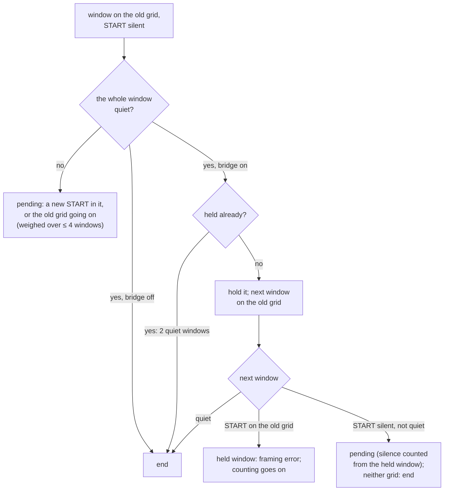

- **As built:** a silent START makes the window **pending**; a new candidate START is looked for in the next window. If
  only the old grid holds (markers present), the pending window is a framing error and counting goes on; if only the
  new one holds, `end` then `locked` on it; while both hold they are compared window by window, at most
  `k_pending_windows` (4) more; a tie is `lost`. With no new candidate and a quiet window, `end`: *measured* 10.7–11.2
  slots after the last STOP, plus the look-ahead.
- **With the fade bridge** (`fade_bridge`): a quiet window is **held** (`held_`) and the grid goes on; a second quiet
  window ends the transmission at the first (`end` 20.7–21.2 slots after the last STOP, plus the look-ahead,
  *measured*); a window after it whose START is present on the old grid releases the held window as a framing error
  (it does not count towards `lost`: nothing was heard in it) and is read as usual; a silent START that is not quiet is
  pending as above, its new START's silence counted from the held window, and when neither the old grid nor a new START
  holds the transmission ended at the held window (`end`, not `lost`: a noise rise such as a receiver AGC opening up
  after the transmission is no signal). While a window is held, the noise is the larger of the tracked one and the tone
  search's floor (the AGC case).

### 3.8 Constants (as built)

| Stage | Constant | Value |
|---|---|---|
| Speed (`protocol.hpp`) | `k_min/max/default_centi_bytes_per_second` | 100, 2500, 600 (1.00, 25.00, 6.00 bytes/s) |
| | `k_min_slot_us`, `k_max_slot_us` | 4000, 100000 |
| Window | `k_window_slots`, `k_bits_per_byte`, `k_start_slot`, `k_first_data_slot`, `k_stop_slot` | 10, 8, 0, 1, 9 |
| Waveform | `k_tukey_ramp`, `k_beep_energy` | 0.25, 0.6875 |
| Pitch | `k_min/max/default_tone_hz` | 300, 2700, 1500 |
| Bandwidth | `k_band_99_milli`, `k_band_26db_milli`, `k_band_40db_milli` | 4400, 7000, 9900 (width = k / T) |
| Passbands | SSB, AM, FM defaults | 300–2700, 100–3000, 300–3000 Hz |
| Transmission | `k_vox_gap_slots`, `k_min_vox_lead_slots`, `k_min_tail_slots`, `k_default_vox_lead_ms`, `k_default_tail_ms` | 2, 3, 2, 150, 100 |
| | `k_onset_silent_slots`, `k_min_onset_silence_ms` (`protocol.hpp`: the fade bridge's silence before a START and the senders' lead-in with it) | 2, 300 ms |
| Encoder (`encoder.hpp`) | `k_min/max_sample_rate_hz`, `UNLIMITED_ENCODER_QUEUE` | 8000, 192000, 64 (16..128) |
| Front end (`dsp.hpp`) | `k_decoder_rate_hz`, `k_blocks_per_slot`, `k_min/max_block_samples` | 8000, 8, 4, 32 |
| | `k_history_cells`, `k_rebase_blocks`, `k_mix_shift` | 1024, 8192, 10 |
| | `k_lead_latency_samples`, `k_lookahead_max_samples` | 1600, 3200 |
| | `k_remix_reach_hz`, `k_steer_min_hz`, `k_settle_blocks` | 75 Hz, 2 Hz, 3 blocks |
| Tone search | bins, `k_max_lock_bins`, `k_block_samples` | 50 Hz, 49 + 2 guards, 160 samples |
| | `k_quiet_slots`, fresh window, `protect_blocks_` | 10 slots (and 300 ms with the fade bridge), 7 search blocks, ceil((R + 2 T) / 160) + 1 |
| | leading z, fast/slow alphas, steady mask | 4.75, 1/8, 1/128, after 128 blocks |
| Steering | `k_takeover_ratio`, `k_takeover_excess`, `band_reach_hz_` | 0.25, 2, half the 99 % band + 50 Hz |
| Scan | `k_scan_coherent_ms`, `k_loud_z`, `k_acquire_blocks_per_block` | 10 ms, 4.75, 8 |
| | `k_onset_silent_slots`, `k_onset_tolerance`, `k_proven_silent_slots` | 2, 0.25 slot, 10 |
| Fade bridge (V16) | `k_min_onset_silence_ms`, `k_vox_gap_reach`, `k_lead_test_slots`, `k_lead_test_windows`, windows to end | 300 ms, 1 slot, 2, 19, 2 |
| | `k_watch_slots`, `k_precursor_rise` | 3, 16 |
| | `k_onset_back`, `k_onset_reach`, `k_onset_rise`, `k_onset_walk_slots`, `k_onset_gap`, `k_onset_half` | 0.25, 1, 0.5, 2, 0.5, 0.25 slot |
| Early test | `k_steady_slots`, `k_start_edge_max`, `k_edge_half`, `k_edge_step`, `k_edge_search_steps` | 2, 0.6, 0.1 T, 0.1 T, 2 |
| Pitch refinement | `k_pitch_gap_blocks`, `k_pitch_coherence`, `k_refine_band_part` | 2, 0.4, 0.5 (half the occupied band, at least 75 Hz) |
| First window (V20) | `k_marker_ratio`, `k_marker_snr`, `k_edge_ratio_max`, `k_before_snr`, `k_silence_ratio` | 0.5, 4, 0.3, 8, 0.25 |
| | a START under `k_marker_snr` × the noise: noise, the scan not in data (V24, `Check::noise`) | |
| | `k_refine_iterations`, `k_refine_settled` | 4, 0.01 slot |
| ACQUIRE | `k_acquire_timeout_ms`, `k_acquire_timeout_windows`, `k_search_ban_ms` | 1500, 3, 10000 (× 2^strikes, ≤ 8×) |
| Geometry | `k_slot_window`, `k_noise_window`, `k_timing_half`, `k_scan_lead`, `k_margin_slots`, `k_margin_blocks`, `k_keep_slots` | 0.75, 0.5, 0.5, 0.125, 0.5 slot, 2 blocks, 4 slots |
| Timing, pitch | `k_timing_slope`, `k_timing_gain`, `k_timing_integral`, `k_timing_clamp`, `k_pitch_gain`, `k_pitch_clamp` | 5.33, 0.2, 0.02, 0.25, 0.5, 0.1 |
| Decisions | default `decision_mode` (V14 revised); `k_default/min/max_threshold_percent` (the fixed line), `k_floor_sigma`, `k_soft_scale`, `k_soft_limit`, `k_weak_margin`, `k_reference_alpha`, `k_noise_zero_pct` | adaptive; 70/50/90, 2.6, 64, 127, 0.125, 0.25, 35 |
| | `k_settle_windows`: the running reference is the mean of the markers so far, the window's own included, for windows 0 and 1 (V24) | 2 |
| Framing, end | `k_max_framing_errors`, `k_pending_windows`, `k_loud_snr` | 2, 4, 16 |

### 3.9 Memory and CPU

- **Sizes** (*measured*, 64-bit host and xtensa-esp32): `sizeof(Decoder)` 17,440 B on the host, 17,428 B on the ESP32
  (17,256 B at 7b15d50; the held window of the fade bridge is 164 B, the settling reference of V24 8 B) — the history
  8.3 KB, the look-ahead 6.4 KB, the tone search about 1.5 KB — under its budget of 18,432 B (`static_assert` in
  `decoder.cpp`, built for the ESP32 by `make check_embedded`); `sizeof(Encoder)` 144 B with the 64-byte queue.
- **Work per block is bounded by construction:** at most 8 scan steps per block, one verification step per block (the
  early test, the first window's pitch, then its anchor and decision), one window read. *Measured* worst case of one
  block on this PC (Apple M4, `decoder_work_per_block_is_bounded`, two runs): 2.2–2.4, 1.9–2.1, 1.5–1.6, 1.0–1.1 and
  0.75–0.92 µs at 1, 3, 6, 12, 25 bytes/s (7b15d50: 3.29, 1.88, 1.25, 1.00, 1.38 µs; with V18's check 3.25, 2.42,
  1.88, 2.08, 1.88), for blocks of 4000, 4000, 2125, 1000 and 500 µs of audio: the first window alone is little work,
  and V24's settling adds a mean of four levels. An ESP32 at 240 MHz is 50–200 times slower on this float work
  (estimate, to be measured with `loopback_esp32`): 3–12 %, 2–10 %, 3–15 %, 5–22 % and 8–37 % of a block's time in the
  worst block; the 25 % target holds up to 12 bytes/s and may not at 25 bytes/s (§11 P8).
- **The ESP32 KISS TNC** (§12.7, *estimate* from the PC's measurements): while decoding frames back to back, the
  receiver and the decimator take 1.3–6.2 % of core 1 and the 1-bit output about 3.4 % of core 0; its worst 10 ms
  pass stays within one ADC frame even at the high end of the estimate, and the ADC's DMA pool holds 80 ms more.
  Unproven until a board runs it (§11 E3).
- **AVR:** the encoder's ISR (`tests/avr/`): at most 908 cycles per sample at 8 kHz on 16 MHz (gate 1600), mean load
  25–28 %, no lost tick, at every speed with and without the VOX lead. `tx_uno`: 8,658 B of flash, 524 B of RAM, no
  float routine linked. The v1.0 receiver is float; the Nano receiver comes after v1.0 (§13).

### 3.10 DCD: a transmission is being decoded (V19, V20)

**In plain words.** DCD ("data carrier detect") tells a modem whether the channel is busy with an Unlimited
transmission, so that it does not start sending over it (§12.1). It comes on when the receiver locks — at the anchor,
once the first window is read and its byte released — and stays on while the transmission is tracked, up to its end.
A tone alone — a carrier, CW, speech, the noise of an open FM squelch — does not turn it on, so a modem can send beside
them; a stray lock on speech or CW (V20) turns it on for as long as the stray is tracked. Before V19, DCD meant "the
receiver is not in SEARCH": any tone kept it on, 97–100 % of the time near CW or speech.

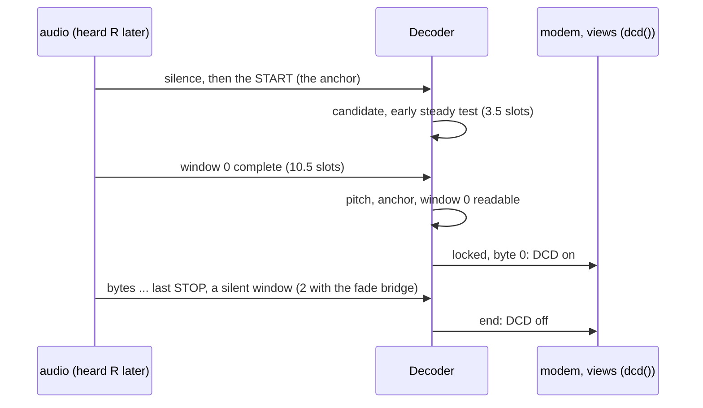

**Exact rules** (`Decoder::dcd()`).
- On exactly while the state is TRACK: from `locked` (the state event to TRACK comes just before it) to `end` or `lost`
  (the state event to SEARCH comes right after them) and `reset()`. The candidate being checked (ACQUIRE) does not turn
  it on: that is the time from its START to its first window's read, which no longer holds a lock back (V20).
- *Measured*: on 10.7–11.3 slots plus R after the START, off 10.7–11.2 slots plus R after the last STOP (20.7–21.2 with
  the fade bridge); in the long suite's scenes (F, §9) for the time stray locks were tracked.
- The KISS modem's channel check (§12.1) and the programs' views (the TUI's status, `--events`, `--debug`) follow
  `Decoder::dcd()` (the modem through its published snapshot, `Modem::dcd()`).

---

## 4. Performance (gates, *provisional* until measured)

SNR is the key-down tone over the noise in 2500 Hz. The gate SNR of a speed is v0.3's at the same T: −6.5, −1.7,
+1.3, +4.3, +8.0 dB at 1, 3, 6, 12, 25 bytes/s. *Measured* on 2026-09-28 by the long suite (§8, §9), with the receiver's
defaults (the adaptive line, no fade bridge), one byte, one decision (V20) and the start tuned (V24) unless said; with
the check before lock of V18 in brackets.

**What is gated (V22).** Integrity is the upper protocol's for v1.0 (Gustavo's RTTY rule: "the modem may drop or
garble bytes, the protocol above must reject them"): extra and shifted bytes are reported in every row and added up by
the Integrity rows, never a gate failure. The gates are BER and loss at each speed's gate SNR (A1), transmissions from
byte 0 at gate + 3 dB (A3), no slip over 10 minutes (L5) and BER across pitches and filters (L19); in `make test`, every
exactness test at a strong signal (§8).

| Gate | Condition | Pass | *Measured* |
|---|---|---|---|
| A1 AWGN | each speed at its gate SNR, 32-byte transmissions, receiver mistuned ±50 Hz, the default line | BER ≤ 1e-3, loss ≤ 1 %; extra and shifted bytes reported (V22) | BER within the gate at every speed: 4.4e-4, 4.0e-5, 2.1e-5, 3.0e-4, 2.0e-5 (1.3e-4, 4.0e-5, 2.0e-5, 1.0e-4, 2.0e-5); loss 4.0 %, 0.5 %, 2.6 %, 1.0 %, 0 % (4.1, 0.5, 2.0, 0.5, 0 %); **FAIL at 1 and 6 bytes/s** on the loss (kept by V25: open problems for after v1.0, §11 P2); PASS at 3, 12 and 25. Reported: 1 extra byte at 1 byte/s and 1 at 12 (a START missed at the gate SNR, then the anchor on a data tone whose window reads as a byte, §11 P4). At gate + 3 and + 4.5 dB: BER 0, loss 0 at every speed (1 byte/s: loss 0.5 % with the check). |
| A2 threshold | the fixed 70 % line against the default adaptive line, at the gate, gate + 3 and gate + 4.5 dB | reported | the fixed line at the gate: BER 6.5e-3, 6.4e-3, 6.1e-3, 6.0e-3, 4.1e-3; at gate + 3 dB: 3.6e-4, 4.2e-4, 2.0e-4, 3.4e-4, 8.0e-5; at + 4.5 dB ≤ 6e-5: about 3 dB behind the adaptive line |
| A3 acquisition | 300 transmissions of 16 bytes at gate + 3 dB, mistuned within ±50 Hz | ≥ 99 % decoded from byte 0 | PASS: 100 % at every speed, BER 0 |
| S1 short | 1, 2, 4, 8 bytes at gate + 3 dB and 20 dB, 150 each | reported | shortest decoded ≥ 99 %: 1 byte at every speed and SNR |
| L5 clock | ±1000 ppm, 10-minute transmissions at 1, 6, 25 bytes/s | no slip: every byte right, one lock | PASS: every byte, one lock; T error mean ≤ 0.0015 %, worst 0.07 % |
| L19 passband | 7 pitches over the search range (edges 5 Hz inside), SSB filters 1.8, 2.4, 2.7, 3.0 kHz, gate + 6 dB | BER ≤ 1e-4; extra and shifted bytes reported (V22) | PASS: 20 rows, all 3,360 transmissions from byte 0, BER 0, loss 0, 0 extra |
| C channels | CCIR good/moderate/poor, flat Rayleigh, flutter, QSB, QRN + blanker, AGC, carrier, keyed CW, AM, FM; the default line, the fixed line and the fade bridge | re-measured; gates decided by Gustavo | see §9: FM, AM, QRN, carrier: 100 %; keyed CW 90–100 %; fading 18–95 % of bytes; byte 0 right in 2,989 of 3,360 transmissions (the check: 2,797), byte 0 wrong in 146 (75); at 1 byte/s QSB 47 % (V20 before V24: 38 %; the check: 46 %) and receiver AGC 85 % (79 %; 83 %) |
| F stray bytes | 30 minutes each of noise, a carrier, keyed CW and speech per speed class (1, 6, 12, 25 bytes/s) | report (V20: stray bytes are the upper protocol's) | stray bytes per hour — noise 0, 0, 0 and 340 at 25 bytes/s (FM noise below threshold); carrier 0 everywhere; keyed CW 0, 28, 76, 104; speech 2, 12, 352, 546 (with the check: at most 4 per hour anywhere). **Through the KISS modem's core with its defaults (V23, `--min-frame 15`): 0 frames and 0 bytes per hour reach the computer in every scene**, the longest stray reception 8 bytes (speech at 25 bytes/s); §9 |
| Integrity | every A, S, L and C row: real transmissions | report (V22; the gate was 0 extra and 0 shifted) | 177 extra and 65 shifted bytes among 409,187 released (each recording counted for both lines: the default line 90 extra, 33 shifted — A1 2, fading and flutter rows the rest); 171 and 65 when V22 was decided (before V24); with the check 28 extra, 0 shifted. A wrong or a renumbered grid needs one readable window, where the check needed 2–8 (§11 P4) |
| Integrity, fade bridge | the C rows decoded with the fade bridge (V16) | report (V22) | 37 extra and 13 shifted bytes among 41,685 (36 and 13 when decided; with the check 5 and 0) |

Framing errors are never delivered (V17): gated in `make test` (`decoder_framing_error_drops_the_window`,
`decoder_first_window_decided_alone`, `decoder_first_windows_settle_the_reference`).

---

## 5. Public API (C++11, namespace `unlimited`) — v1.0

The v1.0 API replaces v0.3's (tag `v0.3.0`); `#include "unlimited.h"` brings `encoder.hpp` and `decoder.hpp` (with
`protocol.hpp` and the internal `dsp.hpp`), `audio_io.hpp` and `wav_codec.hpp`. Listings as built (declarations
grouped and comments shortened; the headers are the reference):

```cpp
// protocol.hpp — the byte window, the speed, the bandwidth calculator (integer, AVR-safe)
static const uint8_t k_window_slots = 10, k_bits_per_byte = 8, k_start_slot = 0, k_first_data_slot = 1, k_stop_slot = 9;
static const float k_min_bytes_per_second = 1.0f, k_max_bytes_per_second = 25.0f, k_default_bytes_per_second = 6.0f;
static const uint32_t k_min_slot_us = 4000, k_max_slot_us = 100000;
static const uint16_t k_min_tone_hz = 300, k_max_tone_hz = 2700, k_default_tone_hz = 1500;
static const uint8_t k_onset_silent_slots = 2;       // silence before a START
static const uint16_t k_min_onset_silence_ms = 300;  // ... with the fade bridge; the senders' lead-in with it
uint16_t centi_bytes_per_second(float bytes_per_second);  // round(100 B)
uint32_t slot_us_for_speed(float bytes_per_second);       // round(10^7 / round(100 B)); 0 when B rounds to 0
uint32_t slot_us_for_centi_speed(uint16_t centi);
float bytes_per_second(uint32_t slot_us);
bool slot_valid(uint32_t slot_us);
struct Band { uint16_t low_hz, high_hz, width_hz; };
struct Passband { uint16_t low_hz, high_hz; };
struct PassbandFit { bool fits; int16_t margin_low_hz, margin_high_hz; uint16_t tolerance_hz; };
Band occupied_band(uint16_t tone_hz, uint32_t slot_us);   // 99 %: 4.4 / T
uint16_t width_26db_hz(uint32_t slot_us);
uint16_t width_40db_hz(uint32_t slot_us);
bool passband_valid(const Passband& passband);
PassbandFit passband_fit(const Band& band, const Passband& passband);
Passband search_range(const Passband& passband, uint32_t slot_us);
PassbandFit passband_fit(uint16_t tone_hz, uint32_t slot_us, const Passband& passband, const Passband& search);
enum class ConfigError : uint8_t { none, sample_rate, tone, slot, passband, outside_passband, amplitude, threshold,
                                   decision_mode };

// encoder.hpp — one producer (write, start), one consumer (next_sample or render: an ISR or the audio thread)
struct EncoderConfig {
    uint32_t sample_rate_hz;  // 8000..192000
    uint32_t slot_us;         // slot_us_for_speed(B)
    uint16_t tone_hz;
    int16_t amplitude;        // crest
    Passband passband;        // the receiving radio's audio passband the occupied band must fit
    uint16_t lead_in_ms, vox_lead_ms, tail_ms;
    EncoderConfig();          // 6 bytes/s, 1500 Hz, -3 dBFS, 300..2700 Hz, 8000 Hz, no lead-in, no VOX lead, 100 ms
    ConfigError check() const;
    bool valid() const;
};
Band occupied_band(const EncoderConfig& config);
Passband search_range(const EncoderConfig& config);
PassbandFit passband_fit(const EncoderConfig& config);
enum class EncoderSegment : uint8_t { idle, lead_in, vox_lead, gap, window, tail };
enum class SlotKind : uint8_t { silent, lead, start, one, zero, stop };
struct EncoderStatus { EncoderSegment segment; SlotKind kind; uint8_t slot, byte, bit_index; uint32_t byte_index,
                       slot_index, samples_rendered; };
class Encoder {
public:
    static const uint16_t k_queue_size = UNLIMITED_ENCODER_QUEUE;  // 64 (16..128, a power of two)
    explicit Encoder(const EncoderConfig& config);
    bool start();
    bool write(uint8_t byte);
    size_t write(const uint8_t* data, size_t size);
    void abort();
    int16_t next_sample();                       // ISR-safe; 0 when idle
    size_t render(int16_t* out, size_t count);
    bool busy() const;
    size_t queue_free() const;
    size_t queued() const;
    uint32_t duration_samples(size_t data_bytes) const;
    EncoderStatus status() const;
    const EncoderConfig& config() const;
};

// decoder.hpp — told the speed, finds the pitch; events through a handler
static const uint8_t k_default_threshold_percent = 70, k_min_threshold_percent = 50, k_max_threshold_percent = 90;
enum class DecisionMode : uint8_t { fixed, adaptive };
enum class DecoderState : uint8_t { search, acquire, track };
enum class EventType : uint8_t { state, locked, slot, byte, end, lost };
enum class LostReason : uint8_t { none, framing, reset };
enum EventFlag : uint8_t { event_flag_weak = 0x01, event_flag_blanked = 0x02, event_flag_framing = 0x04 };
struct Event {
    EventType type; LostReason reason; DecoderState state; uint8_t flags;
    uint8_t value;                  // byte: the byte; slot: the bit
    uint8_t slot;                   // slot: 1..8
    uint8_t level_pct, threshold_pct, start_pct, stop_pct;
    int8_t soft[k_bits_per_byte];   // > 0 is a 1; 64 = one decision line of margin
    uint32_t byte_index;            // 0 = the first byte after the anchor
    float tone_hz, slot_ms, snr_db; // snr: key-down tone over the noise in 2500 Hz
};
typedef void (*EventHandler)(const Event& event, void* context);
struct DecoderConfig {
    uint32_t slot_us; Passband passband; uint8_t threshold_percent; DecisionMode decision_mode; bool impulse_blanker;
    bool fade_bridge;               // V16: end after 2 silent windows, a START after 300 ms of silence or a VOX gap
    DecoderConfig();                // 6 bytes/s, 300..2700 Hz, the adaptive line (70 % when fixed), blanker on,
                                    // no fade bridge
    ConfigError check() const;
    bool valid() const;
    Passband search_range() const;
};
class Decoder {
public:
    Decoder(const DecoderConfig& config, EventHandler handler, void* context);
    void reset();
    void process(const int16_t* samples, size_t count);
    void process_sample(int16_t sample);
    DecoderState state() const;
    bool dcd() const;                     // a transmission is being decoded: TRACK (§3.10)
    float tone_hz() const;                // 0 in SEARCH
    float slot_ms() const;
    float snr_db() const;
    uint32_t framing_errors() const;      // windows dropped since the last lock
    uint16_t lookahead_samples() const;   // events come this much after the audio (§3.1)
    const DecoderConfig& config() const;
};
```

- `audio_io.hpp` (sample sinks and sources), `wav_codec.hpp`, `platform.hpp` (fences, `UNLIMITED_ROM`; since the
  modem also `load_acquire()` and `store_release()`, below) and the quarter-sine table (declared in `protocol.hpp`,
  defined in `tables.cpp`; there is no `tables.hpp`): v0.3's. `packet.hpp` is removed (V7).
- `kiss.hpp`, `transmitter.hpp` and `modem.hpp`: the KISS modem's portable core (§12.2), included on their own
  (`#include "unlimited/modem.hpp"`; `unlimited.h` does not bring them). Listings as built (declarations grouped,
  comments shortened; the headers are the reference):

```cpp
// kiss.hpp — the KISS codec (computer side); no receiver, no encoder
static const uint8_t k_kiss_fend = 0xC0, k_kiss_fesc = 0xDB, k_kiss_tfend = 0xDC, k_kiss_tfesc = 0xDD;
static const uint8_t k_kiss_data = 0x00, k_kiss_command_mask = 0x0F;
static const uint8_t k_kiss_first_parameter = 1, k_kiss_last_parameter = 5;   // accepted and ignored
static const uint8_t k_kiss_escaped_max = 2;
enum class KissStep : uint8_t { none, data, end };   // what one byte gives; `end` only for a frame with bytes
struct KissCounters { uint32_t frames, bytes, parameters, unknown, bad_escapes, outside; };
class KissDecoder {
public:
    KissStep peek(uint8_t byte, uint8_t& value) const;  // what feed() would do, without taking the byte
    KissStep feed(uint8_t byte, uint8_t& value);
    void reset();
    bool in_data() const;
    const KissCounters& counters() const;
};
uint8_t kiss_escape(uint8_t byte, uint8_t out[k_kiss_escaped_max]);   // 1 or 2 bytes

// transmitter.hpp — the send side; builds and links without decoder.cpp and dsp.cpp
#define UNLIMITED_MODEM_QUEUE  // a power of two 16..32768; 2048 on AVR/Arduino/ESP32, 16384 otherwise
static const uint32_t k_modem_rate_hz = 8000;
static const uint16_t k_default_txdelay_ms = 100, k_default_dwait_ms = 1500, k_default_slot_time_ms = 100;
static const uint8_t k_default_persist = 63, k_default_end_windows = 1, k_end_margin_slots = 2;
static const uint32_t k_no_tick = 0xFFFFFFFFu;
enum class ModemWake : uint8_t { control, host };
typedef void (*PttHandler)(bool on, void* context);                             // from tick()
typedef void (*HostHandler)(const uint8_t* data, size_t size, void* context);   // from Modem::audio_input()
typedef void (*WakeHandler)(ModemWake what, void* context);                     // from any context
struct AccessConfig {
    uint16_t dwait_ms; uint8_t persist; uint16_t slot_time_ms; uint16_t output_latency_ms;
    bool full_duplex; uint32_t seed; uint8_t end_windows;
    AccessConfig();  // 1500 ms, 63, 100 ms, 0, half duplex, a fixed seed, 1 window
};
struct ModemCounters {
    KissCounters kiss; uint32_t host_refusals, queued_bytes, queued_frames;
    uint32_t transmissions, bytes_sent, underruns, bytes_skipped, draws, deferrals;
    uint32_t on_air_sent, on_air_size;  // the frame on the air: bytes whose windows are complete, and its size
    uint32_t frames_received, bytes_received, ends, losses;  // receptions passed to the computer (V23)
    uint32_t short_frames, short_bytes;                      // receptions shorter than the minimum frame (V23)
    uint32_t muted_samples;                                  // heard while keyed, replaced by silence
};
enum class ChannelState : uint8_t { idle, waiting, keyed, releasing };
class ModemTransmitter {
public:
    static const uint16_t k_queue_size = UNLIMITED_MODEM_QUEUE;
    static const uint8_t k_frame_slots;          // one per 32 queue bytes, 4..64
    static const uint16_t k_budget_bytes = 512;  // static_assert: sizeof <= queue + frame slots + 512
    ModemTransmitter(const EncoderConfig& signal, const AccessConfig& access, PttHandler ptt, void* context,
                     WakeHandler wake = nullptr);
    size_t host_input(const uint8_t* data, size_t size);   // computer: returns the bytes taken
    void audio_output(int16_t* out, size_t count);         // audio (ISR or device callback): 8 kHz, never blocks
    void tick(uint32_t now_ms);                            // control
    uint32_t next_tick_ms() const;                         // control: k_no_tick when only an event matters
    void set_dcd(bool busy);                               // receive (Modem::audio_input())
    bool valid() const; bool dcd() const; bool transmitting() const;
    ChannelState channel_state() const; ModemCounters counters() const;
    const EncoderConfig& signal() const; const AccessConfig& access() const;
};

// modem.hpp — the send side plus the receiver
static const bool k_default_fade_bridge = false;                          // the modem's default, one constant
static const uint16_t k_fade_bridge_silence_ms = k_min_onset_silence_ms;  // protocol.hpp: 300 ms
static const uint8_t k_fade_bridge_end_windows = 2;
static const uint8_t k_default_min_frame_bytes = 15;                      // V23: the shortest AX.25 frame
static const uint8_t k_max_min_frame_bytes = 64;
struct ModemConfig {
    EncoderConfig signal;     // what this station sends (8000 Hz; lead_in_ms = TX delay, vox_lead_ms, tail_ms)
    DecoderConfig receiver;   // what it listens for: the same slot_us
    AccessConfig access;
    bool fade_bridge;
    uint8_t min_frame_bytes;  // receptions shorter than this never reach the computer (V23); 0: off; at most 64
    ModemConfig();            // 6 bytes/s, 1500 Hz, -3 dBFS, 300..2700 Hz, TX delay 100 ms, tail 100 ms, adaptive
                              // line, no fade bridge, minimum frame 15
    bool valid() const;
    EncoderConfig sent() const;   // the fade bridge lengthens a silent lead-in to 300 ms
    DecoderConfig heard() const;  // the fade bridge set on the receiver
};
class Modem {
public:
    static const uint8_t k_host_chunk = 32;
    Modem(const ModemConfig& config, HostHandler host, PttHandler ptt, void* context, WakeHandler wake = nullptr);
    size_t host_input(const uint8_t* data, size_t size);       // computer
    void audio_input(const int16_t* samples, size_t count);    // receive: 8 kHz from the radio
    void audio_output(int16_t* out, size_t count);             // audio: 8 kHz to the radio
    void tick(uint32_t now_ms); uint32_t next_tick_ms() const; // control
    void set_event_tap(EventHandler tap, void* context);       // every decoder event (monitor, TUI); before start
    bool valid() const; bool dcd() const; bool transmitting() const;
    ChannelState channel_state() const; ModemCounters counters() const;
    uint16_t lookahead_samples() const;
    const ModemConfig& config() const; const EncoderConfig& signal() const; const DecoderConfig& receiver() const;
};

// platform.hpp — added: a value one context writes and others read (the modem's hand-offs, §12.2)
template <typename T> T load_acquire(const volatile T& from);
template <typename T> void store_release(volatile T& to, typename Identity<T>::type value);
```

*Refinements, with reasons:*

- **The `WakeHandler`** is a fifth, optional argument of the constructor. The playing side runs in a real-time
  callback, and the end of a transmission or new room in the send queue must still wake another thread. A pipe write
  can do that from a real-time callback; a condition variable cannot.
- **`ModemTransmitter`** is a class of its own. It is the send side that "compiles without the Decoder", and Arduino
  compiles library files without the sketch's `#define`s, so it had to be a class rather than a macro-selected build.
- **`sent()` and `heard()`** carry the fade bridge into the two halves.
- **`set_event_tap()`** gives the monitor and the `--tui` view the receiver's events.
- **`counters()`** is a snapshot for display, safe from any thread: every field is published with `store_release()`.
  `on_air_sent` and `on_air_size` give the view its "sending 12 of 40 bytes".
- **`load_acquire()` and `store_release()`** replace, in the modem, the pattern "volatile value plus a separate fence":
  each hand-off names its value, so a fence cannot end up on the wrong side of the wrong load; ThreadSanitizer follows
  them (it ignores stand-alone fences); on an AVR they also make 16- and 32-bit values whole (interrupts off around the
  access). The encoder keeps its fences.

---

## 6. PC helpers

WAV files, the resampler, the audio driver boundary (`pc/audio.hpp`: `wav:` and `null` devices, and the live
CoreAudio and ALSA devices of §12.5), the channel simulator (usb, lsb, am, fm, Watterson fading, QRN, AGC, carriers,
CW, QSB, clock error) and the TUI carry over from v0.3. The TUI's decoder view is rebuilt for the window: each
window's START and STOP crests, the reference line between them, the decision line, the 8 data slots' bars and the
decided byte; a dropped window is marked; the encoder view shows the window being sent (START, bits, STOP) and the
segment (lead-in, VOX lead, gap, window, tail). Added for the live programs and the modem (§12):

- **The level meter** (`pc::LevelMeter`, `pc/tui.hpp`): the recent level, the level since the start and the digital
  silence of a stream (§12.6).
- **The status hand-off** (`pc::StatusRing`, `pc/tui.hpp`): encoder statuses from the thread that renders the encoder
  to the thread that draws, lock-free (§12.6).
- **Ctrl-C for live devices** (`pc::StopOnSignals`, `pc/terminal.hpp`): SIGINT, SIGTERM and SIGHUP call a device's
  `stop()` instead of ending the program (§12.6).
- **The TUI:** `set_level()` and `set_warning()` status items; `next_frame(columns, rows)` (the frame `draw()` writes,
  cleared when the size changed); `RefreshPacer::next()` (when the next frame is due, for a caller that waits on its
  own events until then); `set_front_field(key, value)`: an extra status item placed right after the receiver's
  state, before the TUI's own details, so it stays on screen in a small terminal (the view drops items from the
  end); an empty value removes it (the modem's items use it, §12.6).
- **`ResamplerKernel`** (`pc/resampler.hpp`) holds the `Resampler`'s filter rows, positions and dot product, now
  shared. The `Resampler`'s output is bit-identical to before: checked against the previous code at 11 rate pairs,
  both one-shot and streamed in irregular chunks.
- **`ResamplingSource`** (`pc/resampling_source.hpp`) plays an 8 kHz source at a device's rate, inside the device's
  real-time callback: every buffer is sized at construction, `read()` never allocates and never locks; a mirrored
  history (each input stored twice) keeps every row's inputs contiguous; `lead_ms()` is the filter's half-length,
  3 ms from 8000 Hz: the source is read that far ahead of the output. This resolves the radio I/O layer's open
  issue 1 (§11).
- **`KissPort`** (`pc/kiss_port.hpp`) is the modem's side towards the computer: `open_pty(link)` (`openpty`; the
  slave raw 8N1 with VMIN 1 and VTIME 0, kept open; the master non-blocking; the link made as a symbolic link to a
  temporary name, then renamed over the path, so the path always names a link; an old symbolic link there is
  replaced and named (`replaced()`), anything else at the path refused and never removed; the destructor removes the
  link only when it still points to this PTY) and `open_serial(device, baud)` (raw 8N1, no flow control, at
  1200..230400 baud).
- **`ModemLink`** (`pc/modem_link.hpp`) runs two `Modem` cores on one simulated channel, in memory, on a simulated
  clock in steps of 10 ms: each station ticks and plays; its audio is on the air while its PTT is keyed, or always
  with a VOX lead; it is heard through `sim::Channel` (the reverse direction has seed + 1 and the negative offset),
  or as sent when clean; per station it keeps the KISS frames its computer received, its receptions (lock time,
  pitch, T, SNR, bytes with `byte_index`, dropped windows, `lost`) and its PTT keys; `run_until_idle()` stops once
  nothing is waiting or on the air and the receivers' end latency has passed; a frame handler lets a test answer
  frames (a conversation). The integration tests and `--loopback` use it.

---

## 7. Programs and examples

**In plain words.** `unlimited_encode` turns bytes into audio and `unlimited_decode` turns audio back into bytes. Each
works on a WAV file, or on a sound card: the encoder plays through the card into the radio and keys its PTT; the
decoder listens to the card until Ctrl-C. `unlimited_modem` is the KISS modem (§12): AX.25 programs send and receive
frames through it. `--list-devices` shows the cards; `-d` (or `--output`, `--input`) picks one. Both sides must be given
the same speed (`--bps`) and, when used, the same `--fade-bridge`.

**As built.**

| Program | Options |
|---|---|
| `unlimited_encode` | `--text STR` or `--in FILE`; `--out SPEC` (= `--output SPEC`, = `-d SPEC`): a sound card (`coreaudio:<#\|name part\|UID>`, `alsa:<name>`, `default`), `wav:<path>`, `<path>.wav` or `null` (default `tx.wav`); `-r HZ`, `--list-devices`; the PTT (`--ptt`, `--ptt-device`, `--ptt-invert`, `--cat-rate`, `--cat-addr`, `--cat-tx-on`, `--cat-tx-off`, §12.4); `--bps B` (default 6.00, printed first with T and bit/s), `--tone HZ`, `--passband LO:HI` (a signal that does not fit is refused, exit 2), `--rate HZ` (a file's rate), `--level-dbfs DB`, `--lead-in-ms`, `--vox-lead-ms` (at least 3 slots), `--tail-ms`, `--fade-bridge`; the channel simulator (`--channel clean\|usb\|lsb\|am\|fm`, `--snr`, `--offset`, `--pivot`, `--rx-passband`, `--fading`, `--doppler`, `--qsb`, `--impulses`, `--carrier`, `--cw`, `--agc`, `--fm-deviation`, `--no-preemphasis`, `--no-deemphasis`, `--clock-ppm`, `--seed`, `--clean-out`); `--tui`, `--realtime` |
| `unlimited_decode` | `--in SPEC` (= `--input SPEC`, = `-d SPEC`): a sound card, `wav:<path>`, `<path>.wav` or `null` (default `rx.wav`); `-r HZ`, `--list-devices`; `--bps B`, `--passband LO:HI`, `--threshold PCT\|auto` (**default auto**), `--fade-bridge`, `--no-blanker`, `--events` (each state change with DCD as `Decoder::dcd()` has it), `--expect FILE`, `--tui`, `--realtime`. A file is taken to begin between transmissions: the program feeds 15 slots of silence before it (V6 needs a silent window before the first START) |
| `unlimited_modem` | the KISS modem (§12.3: its help there). Of the other programs' options it has `--bps`, `--tone`, `--passband`, `--level-dbfs`, `--threshold`, `--fade-bridge`, the device options and the PTT family; its own are the computer's port (`--link`, `--serial`, `--serial-baud`, `--min-frame`), channel access and timing (`--txdelay`, `--vox-lead-ms`, `--txtail`, `--persist`, `--slottime`, `--dwait`, `--full-duplex`), display (`-c`, `--monitor`, `--debug`, `--tui`) and tests (`--loopback`, `--test-ptt`, `--test-tx`) |

- **Which options a program takes** (`pc::RadioOptions`, §12.5): the encoder `k_radio_output | k_radio_ptt` (no
  `--input`), the decoder `k_radio_input` (no `--output`, no `--ptt`: "unknown option"), the modem all three. `--in`
  and `--out` are the programs' own names for `--input` and `--output`, checked alike (a bare `3` or `CODEC` is refused
  with the forms and `--list-devices`); the later of `-d`, `--input`/`--in`, `--output`/`--out` wins.
- **`--list-devices`** prints the device table of §12.5 and exits 0; it needs no other option (`--text` included).
- **Rules between options** (usage error, exit 2, the rule in words; checked by running them): `-r` needs a sound card
  ("-r opens a sound card at a rate; tx.wav is not one"); `--rate` is a file's rate (a sound card plays at its own);
  `--realtime` paces a file (a sound card runs in real time); a keying PTT (`--ptt` other than `vox`) needs a sound card;
  `--channel` never keys a radio ("--channel plays what a receiver would hear, not a signal for the air"); the PTT
  rules of `RadioOptions::check()`.
- **The VOX lead** (V8, §2.1): `--vox-lead-ms` when given (0: none); otherwise 150 ms (`k_default_vox_lead_ms`)
  wherever VOX keys the radio: a sound card with no other `--ptt` (VOX is the default PTT), or `--ptt vox` named (also
  for a file); none for a file otherwise.
- **The TX delay** (Gustavo, 2026-09-28): `--lead-in-ms` when given; otherwise 100 ms of lead-in
  (`k_keyed_lead_in_ms`) when the PTT keys the radio by RTS, DTR or CAT (`--ptt rts|dtr|icom|yaesu|kenwood|cat`, with
  their `+`/`-` forms: only a sound card has such a PTT), so the transmitter has switched over before the first START;
  none with VOX (its lead tone and gap come first) and none for a file.
- **`--fade-bridge`** (the receiver's rule for HF fades, §3.7, V16): off by default in both programs. The decoder sets
  `DecoderConfig::fade_bridge` (a transmission ends after 2 silent windows instead of 1; a new START needs at least
  300 ms of silence before it, or a VOX lead and its gap); the encoder leaves at least 300 ms
  (`cli::k_fade_bridge_silence_ms`) of silence before its first START: lead-in = max(lead-in, 300), the lead-in being
  `--lead-in-ms` or the TX delay's default (so 300 ms with a keyed PTT), unless a VOX lead precedes it (the lead and its
  gap already qualify). Both sides must use the same setting, like the speed: the speed lines say so ("the receiver
  needs --bps 6.00 --fade-bridge"), and the decoder's receiver line adds ", fade bridge on".
- **Exit codes.** Encoder: 0 sent; 1 stopped by Ctrl-C (or SIGTERM, SIGHUP) before the end; 2 usage error or refused
  configuration; 3 input/output error (a file, the sound card or the PTT: keying or releasing failed, the device
  failed). Decoder: 0 decoded (and matches `--expect`); 1 nothing decoded or no match; 2 usage error; 3 input/output
  error (a device error ends the listening: what came before it is decoded and printed, then exit 3 with the reason).
  Modem: §12.3.
- Both print the speed first, then the bandwidth line (occupied band, fit, shift tolerance); the decoder prints each
  lock (pitch, T, SNR) and each transmission's text. From a sound card the programs add the lines of §12.6. Removed
  from v0.3: `--preset`, `--profile`, `--bits`, `-N`, `--packet`, `--min-slot-ms`, `--rule`, `--ratio`.

`unlimited_encode --help` (as built):

```
usage: unlimited_encode (--text STR | --in FILE) [--out SPEC] [--bps B]
    [--tone HZ] [--passband LO:HI] [--rate 8000] [--level-dbfs -3] [--lead-in-ms N] [--vox-lead-ms N]
    [--tail-ms N] [--fade-bridge]
    [--channel clean|usb|lsb|am|fm [--snr DB] [--offset HZ] [--pivot HZ] [--rx-passband LO:HI]
        [--fading none|flat|good|moderate|poor|flutter] [--doppler HZ] [--qsb DEPTH_DB:RATE_HZ]
        [--impulses RATE[:LEVEL_DB]] [--carrier HZ:DB] [--cw HZ:DB:WPM] [--agc]
        [--fm-deviation HZ] [--no-preemphasis] [--no-deemphasis] [--clock-ppm P] [--seed N]
        [--clean-out SPEC]]
    [--tui] [--realtime]
    [-d SPEC | --output SPEC] [-r HZ] [--list-devices] [--ptt METHOD [--ptt-device DEV] [--ptt-invert]
        [--cat-rate BAUD] [--cat-addr ADDR] [--cat-tx-on HEX --cat-tx-off HEX]]

Sends bytes through a radio's audio as short beeps on one pitch, like a serial port: every byte is a window
of 10 time slots, a START tone, its 8 bits (a beep is a 1, silence is a 0, most significant bit first) and
a STOP tone. The receiver must be given the same speed (--bps); it finds the pitch by itself. The audio goes
to a sound card (the radio's modulation input, with its PTT keyed) or to a WAV file.

What to send
  --text STR, --in FILE   the data: a text, or the bytes of a file
  --out SPEC              where the audio goes: a sound card (as -d below), wav:<path>, <path>.wav or null
                          (default tx.wav); the same as --output

The signal
  --bps B                 the speed in bytes per second, 1.00..25.00 in steps of 0.01 (default 6.00, for HF
                          SSB): the slot is T = 1 / (10 B). Slower is narrower and survives more noise
  --tone HZ               the pitch, 300..2700 Hz (default 1500)
  --passband LO:HI        the receiver's audio filter the signal must fit (default 300:2700, a 2.4 kHz
                          SSB filter; 300:2100 is a 1.8 kHz one). A signal that does not fit is refused
  --rate HZ               a file's sample rate, 8000..192000 (default 8000); a sound card plays at its own
  --level-dbfs DB         loudness of a beep's crest (default -3)
  --lead-in-ms N          silence before the signal, for the PTT and the transmitter to settle (default 100
                          when --ptt keys the radio by RTS, DTR or CAT; otherwise 0)
  --vox-lead-ms N         a steady tone of N ms (at least 3 slots) and 2 silent slots before the first
                          byte, to key a VOX radio (default 150 on a sound card keyed by VOX, the default
                          --ptt, and with --ptt vox; otherwise 0: none)
  --tail-ms N             silence after the last byte, at least 2 slots (default 100)
  --fade-bridge           for a receiver that bridges HF fades (its --fade-bridge): at least 300 ms of silence
                          before the first START (the lead-in, unless a VOX lead precedes it); off by
                          default. Both sides must use the same setting, like the speed

Channel simulator: hear the signal through a radio path (--out then gets what the receiver hears)
  --channel MODE          clean, usb, lsb, am or fm
  --snr DB                signal to noise in 2500 Hz: key-down tone (usb, lsb) or carrier (am, fm)
  --offset HZ             mistuning: the pitch moves by it; --pivot HZ: the lsb mirror point (3000)
  --rx-passband LO:HI     the receiver's filter (default: --passband)
  --fading, --doppler, --qsb, --impulses, --carrier, --cw, --agc, --fm-deviation, --no-preemphasis,
  --no-deemphasis, --clock-ppm, --seed: fading, interference and radio details
  --clean-out SPEC        also write the transmitted audio

Display
  --tui                   live view: the window being sent, its bits and byte, the output level, scope and
                          spectrum
  --realtime              pace a file's output to audio time (a sound card plays in real time)

Sound devices:
  --list-devices     list every audio input and output (number, name, channels, rates, UID); exit
  -d SPEC            the output device: coreaudio:<#|name part|UID> (macOS), alsa:<name> (Linux),
                     default, wav:<path> or null; a name part matching several devices is refused
  --output SPEC      the same as -d
  -r HZ              open a live device at this rate (default: the device's own; CoreAudio: its nominal rate)
PTT:
  --ptt METHOD       vox, rts, +rts, -rts, dtr, +dtr, -dtr, icom, yaesu, kenwood, cat (default vox)
  --ptt-device DEV   the serial port of rts, dtr and the CAT methods
  --ptt-invert       lower the line to key (the same as -rts or -dtr)
  --cat-rate BAUD    CAT serial speed, 8N1: 1200, 2400, 4800, 9600, 19200, 38400, 57600, 115200 (default 19200)
  --cat-addr ADDR    icom: the radio's CI-V address in hex, 0x94 or 94h (default 0x94, the IC-7300's;
                     IC-705: 0xA4; the radio's CI-V menu shows it)
  --cat-tx-on HEX    cat: the bytes that key the radio, e.g. FEFE94E01C0001FD
  --cat-tx-off HEX   cat: the bytes that unkey it, e.g. FEFE94E01C0000FD

Every run prints the speed first, then the occupied bandwidth, whether it fits the passband, and how far the
radio may be mistuned (the shift tolerance). On a sound card it keys the PTT before the audio and releases it
once the audio has left the device; Ctrl-C stops the transmission and releases the PTT.
exit codes: 0 sent, 1 stopped by Ctrl-C before the end, 2 usage error or refused configuration,
            3 input/output error (a file, the sound card or the PTT)
```

`unlimited_decode --help` (as built):

```
usage: unlimited_decode [--in SPEC] [--bps B] [--passband LO:HI] [--threshold PCT|auto] [--fade-bridge]
    [--no-blanker] [--events] [--expect FILE] [--tui] [--realtime] [-d SPEC | --input SPEC] [-r HZ]
    [--list-devices]

Receives Unlimited transmissions from a sound card (the radio's receive audio) or a WAV file, at any sample
rate (resampled to 8000 Hz). Every byte is a window of 10 slots: a START tone, 8 bits (a beep is a 1, silence
is a 0) and a STOP tone. Give it the sender's speed; it finds the pitch by itself, and each byte comes out as
soon as its STOP is heard. A sound card is listened to until Ctrl-C.

Receiver
  --in SPEC               the audio: a sound card (as -d below), wav:<path>, <path>.wav or null (default
                          rx.wav); the same as --input
  --bps B                 the sender's speed in bytes per second, 1.00..25.00 (default 6.00)
  --passband LO:HI        the radio's audio filter; the pitch search stays inside it (default 300:2700)
  --threshold PCT|auto    the decision line between a 0 and a 1, against the reference line the START and
                          STOP tones give: auto (the default) is the adaptive line, 50..75 % of the
                          reference, about 70 % on weak signals; PCT a fixed line at PCT % of it, 50..90
  --fade-bridge           bridge HF fades: a transmission ends after 2 silent windows instead of 1, and a new
                          one needs 300 ms of silence (or a VOX lead) before its START; off by default. The
                          sender must use the same setting, like the speed
  --no-blanker            turn off the impulse (static crash) blanker

Output
  --events                print every receiver event, each decided bit included
  --expect FILE           compare with the data that was sent: bit errors, lost, wrong and extra bytes
  --tui                   live view: each window's bars against its reference and decision lines, the input
                          level, scope, spectrum and status
  --realtime              pace file input to audio time (a sound card runs in real time)

Sound devices:
  --list-devices     list every audio input and output (number, name, channels, rates, UID); exit
  -d SPEC            the input device: coreaudio:<#|name part|UID> (macOS), alsa:<name> (Linux),
                     default, wav:<path> or null; a name part matching several devices is refused
  --input SPEC       the same as -d
  -r HZ              open a live device at this rate (default: the device's own; CoreAudio: its nominal rate)

It prints the speed first; on each lock the pitch, T, the SNR and the received signal's band against the
passband; when a transmission ends, its text. A file is taken to begin between transmissions. From a sound
card it also prints the input level at each lock, warns once when the input clips or stays at digital silence
(macOS: the terminal needs the microphone permission), and ends on Ctrl-C with the input's level and the bytes
received.
exit codes: 0 decoded (and matches --expect), 1 nothing decoded or no match, 2 usage error,
            3 input/output error
```

`make demo_run` (encode through the channel simulator, then decode with `--expect`): USB 6 bytes/s at 10 dB, +80 Hz;
LSB 12 bytes/s at 13 dB, 48 kHz, −150 Hz; USB 1 byte/s at 0 dB on 1200 Hz in a 1.8 kHz filter; USB 3 bytes/s at
6 dB with a 150 ms VOX lead; **USB 6 bytes/s at 8 dB, 22.05 kHz, `--threshold 70`** (`usb_6_fixed`: the fixed line;
every other row decodes with the default `auto`); AM 12 bytes/s at 12 dB; FM 25 bytes/s at 22 dB: every round trip
exact; and 25 bytes/s in a 500 Hz passband refused (exit 2).

**Examples** (`make arduino_check`, *measured* sizes on the merged tree with V20–V24):

| Sketch | Board | Flash | RAM |
|---|---|---|---|
| `tx_uno` — the integer encoder in a timer ISR, PWM out | Arduino Uno / Nano | 8,658 B (26 %) | 524 B (25 %) |
| `rx_esp32` — the decoder on the ADC, bytes to the serial port | ESP32 | 325,488 B (24 %) | 44,636 B (13 %) |
| `loopback_esp32` — encoder into decoder, CPU per block measured | ESP32 | 314,912 B (24 %) | 39,580 B (12 %) |
| `wav_sd_esp32` — a WAV file on SD through the decoder | ESP32 | 346,150 B (26 %) | 23,664 B (7 %) |
| `kiss_tnc_esp32` — a KISS TNC: the modem core on the ADC and a 1-bit I2S output, KISS on the USB serial port, PTT and DCD on GPIOs (§12.7) | ESP32 | 350,448 B (26 %) | 48,628 B (14 %) |

`kiss_tnc_esp32` is described in §12.7. Makefile targets: `all` (= `lib`, `demo` and `modem`), `lib`, `demo`
(`unlimited_encode`, `unlimited_decode`), `modem` (`unlimited_modem`), `test`, `test_long`, `check_embedded`,
`arduino_check`, `demo_run`, `docs`, `tables`, `clean`, `help`.

---

## 8. Tests

As built (2026-09-29): `make test` runs **313 tests in 25 files, all passing**, also under
AddressSanitizer and UndefinedBehaviorSanitizer: the core and the programs (`test_protocol` 9, `test_encoder` 16,
`test_dsp` 23, `test_decoder` 32, `test_tui` 29, `test_demo_io` 15, `test_encode_program` 8, `test_decode_program` 5,
`test_channel` 36, `test_resampler` 7, `test_wav` 15, `test_wav_codec` 8, `test_tables` 4, `test_audio_io` 5), the radio
I/O layer (`test_audio_devices` 22, `test_pc_audio` 8, `test_ptt` 8, `test_radio_options` 6) and the KISS modem
(`test_modem` 28, `test_modem_link` 4, `test_modem_cli` 11, `test_modem_threads` 1, `test_kiss_port` 4,
`test_resampling_source` 4) and the ESP32 TNC's glue (`test_kiss_tnc` 5). V20 (one byte, one decision) changed `test_decoder`, `test_tui`, `test_decode_program` and
`test_modem_link` (below); the tests that fail on the tree before it and pass after are marked **V20**, those of the
start tuning **V24**. The modem's minimum frame (V23) adds two tests to `test_modem` and changes `test_modem_cli`; the
tests that send frames shorter than 15 bytes through modem cores (`test_modem_link`, `test_modem_threads`,
`tests/embedded/modem_trap.cpp`) run them with the minimum off (`min_frame_bytes` 0).

Every random input of the tests (the channel simulator's noise, fading, static crashes and Morse; the interference
scenes; each test's own draws) comes from `pc/portable_random.hpp`, not from the standard library's distributions, whose
algorithms differ between libc++ and libstdc++: a seed gives the same inputs, and the same results, on every system
(§12.8).

| File | Tests |
|---|---|
| `test_protocol.cpp` (9) | `protocol_speed_arithmetic`, `protocol_band_functions_exact`, `protocol_width_table`, `protocol_passband_valid_and_fit`, `protocol_speeds_in_typical_filters`, `protocol_shift_tolerance_follows_the_search`, `protocol_hi_windows_bit_exact`, `protocol_bandwidth_constants_against_encoder_spectrum`, `protocol_transmission_power_inside_band` |
| `test_encoder.cpp` (16) | `encoder_config_defaults`, `encoder_config_check_names_the_rule`, `encoder_occupied_band_of_config`, `encoder_start_rules`, `encoder_queue_capacity`, `encoder_total_length_all_speeds_and_rates`, `encoder_slot_drift_over_ten_thousand_slots`, `encoder_segments_and_status`, `encoder_hi_slot_sequence`, `encoder_waveform_bounds_edges_and_phase`, `encoder_vox_lead_ramps_and_flat_top`, `encoder_energies_and_window_gains`, `encoder_streaming_and_end_at_empty_queue`, `encoder_abort_and_restart`, `encoder_render_chunk_invariance`, `encoder_duration_saturates` |
| `test_dsp.cpp` (23) | `dsp_nco_frequency`, `dsp_cic2_response`, `dsp_prefix_history_windows`, `dsp_prefix_history_wrap_and_soak`, `dsp_prefix_history_rotate`, `dsp_prefix_history_blank_bits`, `dsp_prefix_history_partial_rotate`, `dsp_quantile_tracker`, `dsp_noise_tracker`, `dsp_tone_search_floor`, `dsp_tone_search_between_bins`, `dsp_tone_search_weak_half_bin`, `dsp_tone_search_recent_floor`, `dsp_tone_search_steady_mask`, `dsp_tone_search_ban`, `dsp_tone_search_stays_inside_range`, `dsp_tone_search_edge_bins`, `dsp_tone_search_leading_and_following`, `dsp_tone_search_fresh`, `dsp_tone_search_forget`, `dsp_impulse_blanker`, `dsp_smart_line`, `dsp_lookahead_delays` |
| `test_decoder.cpp` (32) | `decoder_config_defaults_and_check` (the adaptive line and no fade bridge by default), `decoder_invalid_config_stays_idle`, `decoder_size_and_lookahead` (the size under its budget, the look-ahead per speed, DCD off), `decoder_clean_loopback_all_speeds` (1, 3, 6, 12, 25 bytes/s; the adaptive line at 50 % when clean), `decoder_streams_each_byte_at_its_stop` (**V20**: byte 0 comes with `locked`, 0.72, 1.32, 1.25 slots after its STOP at 1, 6, 25 bytes/s, like every other byte; before V20 it waited for the check's windows), `decoder_awgn_per_speed`, `decoder_mistuned_and_shifted` (±50 Hz, shifted pitches; the pitch within 6 Hz for the first 3 bytes, where one window has set it, and 2 Hz after), `decoder_usb_and_lsb`, `decoder_clock_error` (±1000 ppm), `decoder_vox_lead`, `decoder_vox_lead_near_the_gate` (30 VOX transmissions at the gate at 12 and 25 bytes/s: at least 90 % from byte 0, 0 extra bytes; *measured* 30 and 30; 7b15d50: 25 and 20 of 30), `decoder_back_to_back` (**V20**: the default tail with 6-byte transmissions; the 2-slot tail with 8-byte and 1-byte transmissions, the next START 2 slots after the last STOP or more: a key pressed alone needs nothing after it), `decoder_first_window_decided_alone` (**V20**: window 1's STOP erased: `locked`, byte 0 released, window 1 dropped, the rest follows; window 0's STOP erased: nothing, at 1, 6, 25 bytes/s), `decoder_first_windows_settle_the_reference` (**V24**: at 1, 6, 25 bytes/s every window from window 1 on faded 7.5 dB: every byte, one lock — V20 was `lost` after byte 0, window 1's markers under half of window 0's; faded 12 dB: still `lost` after byte 0, V17's strict framing), `decoder_noise_start_is_let_go` (**V24**: 1 byte/s, USB 10 dB with a receiver AGC, 8 transmissions of 16 bytes 1.5 s apart, seed 1: all 8 from byte 0, 0 extra, 0 wrong — V20 7: a swell of the AGC's hiss 0.4 s before a START became a candidate whose START and STOP were 2.8 times the noise; its rejection put the scan in data), `decoder_framing_error_drops_the_window` (a missing START in window 10 and a missing STOP in window 13: both dropped, flagged, nothing wrong; two STARTs missing in a row: `lost` (framing), 0 wrong bytes, at most 1 stray byte released from the silent START's window, §3.7), `decoder_end_detection`, `decoder_threshold_settings` (the adaptive default against the fixed line at 50, 70 and 90 %), `decoder_short_transmissions` (1, 2, 4 bytes), `decoder_no_lock_on_noise_carrier_or_cw`, `decoder_mid_transmission_start_waits_for_the_next` (V6), `decoder_transmissions_beside_a_carrier_or_cw`, `decoder_pitch_at_search_edges`, `decoder_ignores_a_weak_precursor`, `decoder_reset_while_tracking`, `decoder_chunking_and_blanker_do_not_change_clean_decoding`, `decoder_fade_bridge_rides_a_one_window_fade` (V16: with the bridge one lock and the faded byte dropped; without it, a second lock numbered from 0), `decoder_fade_bridge_ignores_a_signal_back_too_soon` (V16: a 3-window fade at 12 and 25 bytes/s ends the transmission, nothing comes back out of place), `decoder_fade_bridge_back_to_back_vox_and_far_pitch` (V16: 300 ms lead-ins back to back, a VOX lead with no lead-in, a pitch 600 Hz away), `decoder_speech_stray_bytes_are_reported` (V20, replaces V18's `decoder_speech_does_not_lock`: 3 minutes of F4's speech at 12 and 25 bytes/s; the stray bytes are reported — *measured* 16 locks and 26 bytes (520 per hour), 5 locks and 11 bytes (220 per hour); with V18's check 0 — and DCD must stay on at most 10 % of the time and only while tracking: 2.0 % and 0.3 %), `decoder_dcd_means_a_transmission_is_decoded` (**V20**, V19 revised: DCD is the TRACK state; on at the lock, 10.75, 11.27, 11.19 slots plus R after the START at 1, 6, 25 bytes/s (with the bridge the same), off at `end` 10.7–11.2 slots plus R after the last STOP (20.7–21.2 with the bridge), never on outside TRACK; never on in 30 s of noise or of a carrier; keyed CW only while a stray lock is tracked), `decoder_work_per_block_is_bounded` |
| `test_tui.cpp` (29) | the terminal, the window picture (`tui_decoder_window_picture`, `tui_decoder_reference_line_follows_the_crests`, `tui_decoder_windows_follow_each_other`, `tui_decoder_marks_a_dropped_window`, `tui_decoder_status_counts_and_text`: **V20**, the status shows DCD as the program sets it from `Decoder::dcd()` — "ACQUIRE, DCD off" for a candidate, "TRACK, DCD on", off again after `end` — where it said "DCD on" in every state but SEARCH), the encoder view (`tui_encoder_shows_the_sent_bytes`, `tui_encoder_shows_the_window_being_sent`, `tui_encoder_names_the_segments`), status, spectrum, scope, text panel, pacers; for live audio `tui_level_meter_peak_rms_and_clips` (half-scale sine -6.02/-9.03 dBFS, full-scale square: every sample a clip, "0.0" never "-0.0", "1 clip", digital silence, no audio), `tui_level_meter_windows_and_silence` (the partial window, the last whole window whatever the chunks, the silence count and its reset, another rate), `tui_status_ring_hands_over_in_order` (power-of-two capacity, a full ring refuses and counts, 100000 statuses across two threads in order), `tui_status_shows_the_level_and_the_warning` (the `in …` item after the state with its clips, the warning after it and gone, `in no audio`; the encoder's `out …` item without clips), `tui_next_frame_follows_a_resize` (the first frame clears, the same size does not, a new size clears with its row count), `tui_stop_on_signals_calls_the_stop_and_restores` (SIGINT, SIGTERM, SIGHUP call the stop each time and never end the program; the handler before comes back; an ignored SIGINT stays ignored; the TUI's restore hook comes back after); `tui_refresh_pacer_limits_the_rate` also checks `next()` |
| `test_decode_program.cpp` (5) | the program itself (`demo/unlimited_decode.cpp` compiled with its `main` renamed): `decode_program_options` (the input options and no other, `--in`/`--input`/`-d` and the later one, `-r` and `--realtime` rules, `auto` by default, PCT, `--fade-bridge`), `decode_program_help_and_list_devices` (the help names the device options and the default `auto`; `--list-devices` prints exactly the device table; a PTT option exits 2), `decode_program_file_path` (a file's lines, with no level or listening lines; `--events`: "state acquire (DCD off)", "state track (DCD on)", "state search (DCD off)", never "state acquire (DCD on)", **V20**), `decode_program_listens_until_ctrl_c` (a stand-in card delivers 3.5 s of zeros and a 20-byte transmission at 48 kHz from its own thread; the program's chain decodes it on the input's worker thread; the silence warning comes once; SIGINT raised by a handler once the text is printed ends the listening with the summary; `--expect` matches), `decode_program_live_device_error` (a device error ends it on its own: the text first, then exit 3 with the device's reason) |
| `test_modem_link.cpp` (4) | two modem cores through the channel simulator (§12): `modem_link_frames_come_out_byte_for_byte` (**V20**: 6, 12 and 25 bytes/s, 20 dB and gate + 3 dB, 40 Hz mistuned, 4 × 8 frames of 1–24 bytes each; each reception is given to the transmission whose frame its bytes match among those whose START was heard at most the look-ahead, 2 windows and 60 ms before its lock — the lock comes with the first window — and a reception that matches none is a **stray**: 0 bit errors, 0 split, 0 merged, 0 strays; before V20 the check locked a short frame at 25 bytes/s after the next frame's START), `modem_link_conversation_both_ways`, `modem_link_back_to_back_vox_frames` (**V20**: frames of 1, 2, 1, 3, 5, 1, 2, 8 bytes back to back with a VOX lead at 6, 12 and 25 bytes/s, every p-persistence draw winning: all 8 arrive byte for byte; before V20, 3 of 8 at 12 bytes/s; the modem's spacing turned off at 6 bytes/s is reported: 1 of 8), `modem_link_vox_lead` |
| `test_modem.cpp` (28) | KISS: `kiss_frames_escapes_and_shared_fends`, `kiss_commands_are_ignored_and_counted`, `kiss_bad_escapes_pass_the_byte`, `kiss_empty_frames_give_nothing`, `kiss_peek_tells_what_feed_does`, `kiss_escape_writes_one_or_two_bytes`. The send side on a simulated clock: `transmitter_one_frame_is_one_transmission`, `transmitter_two_frames_are_two_transmissions` (the first transmission's length is its own frame's), `transmitter_waits_for_the_end_of_a_frame`, `transmitter_frame_slots_back_pressure`, `transmitter_a_frame_longer_than_the_queue_streams` (24,576 bytes in one transmission, the computer woken at each quarter), `transmitter_never_splits_a_frame`, `transmitter_channel_check_dwait_and_persistence` (fixed seed: the key at the predicted millisecond), `transmitter_waits_while_dcd_is_on`, `transmitter_full_duplex_keys_at_once`, `transmitter_ptt_follows_the_audio` (event-driven and every-ms ticks: the first START exactly the TX delay after the key, PTT off exactly the latency after the audio), `transmitter_vox_lead_keys_the_radio`, `transmitter_spaces_its_own_transmissions`, `transmitter_reports_the_frame_on_the_air` (its size once its end is known, its windows sent: 0 during the TX delay, 4 after four windows, nothing once its audio ended), `transmitter_invalid_config_is_inert`. The modem: `modem_streams_what_it_hears_to_the_computer` (the minimum off: C0 00, escaped bytes, C0; a byte reaches the computer 3.3 s before the transmission's audio ends), `modem_min_frame_holds_then_streams` (V23, the default 15: C0 00 and the first 15 bytes reach the computer together when the 15th is decoded — at the very sample a streaming modem gives the 15th — the 16th and later as decoded, the frame byte for byte, the first byte 14.00 windows (2.33 s) later at 6 bytes/s), `modem_min_frame_drops_short_receptions` (V23: receptions of 1 and 14 bytes send nothing, not even C0 00 or C0, the 15-byte one byte for byte, the counters `short_frames` 2 and `short_bytes` 15; with the minimum off all three stream and byte 0 comes with C0 00; a minimum over 64 makes the configuration invalid), `modem_half_duplex_drops_what_is_heard_while_sending` (and full duplex hears it), `modem_waits_for_the_channel` (key = the reception's close + dwait), `modem_fade_bridge_lengthens_a_silent_lead_in`, `modem_config_checks_both_halves`, `modem_sizes` |
| `test_modem_cli.cpp` (11) | `modem_cli_defaults` (`--min-frame` 15, the banner's words: 14 windows, 2.33 s; 0 and 64 accepted), `modem_cli_each_ptt_gets_its_lead`, `modem_cli_refusals` (with `--tui`'s; `--min-frame` 65, −1, 2.5), `modem_cli_loopback_takes_an_optional_snr`, `modem_cli_help_lists_each_option` (`--min-frame` included), `modem_cli_ui_frame_and_monitor_words`, `modem_cli_airtime_is_the_encoders`, `modem_cli_lead_options_reach_the_audio` (`--txdelay`, `--fade-bridge`, `--vox-lead-ms`, `--txtail` measured on the rendered samples). The `--tui` items at string level: `modem_cli_tui_fields_name_each_state` (each channel state, DCD, the frame on the air with and without its size, the frame on the air not counted as waiting, "tx 7, rx 5, 3 short dropped"), `modem_cli_tui_shows_the_modem` (a real `Modem` keyed at 25 bytes/s, 12 of a 40-byte frame's windows sent: the rendered view shows each item, the bandwidth line and the received text), `modem_cli_tui_items_fit_a_small_terminal` (80 × 24: the items on the first 3 rows; an item set to "" is gone) |
| `test_modem_threads.cpp` (1) | `modem_runs_its_four_contexts_on_four_threads`: two modems at 25 bytes/s, each with its computer, control and receiving thread, one audio thread for both, and a thread reading the snapshots as a view would (9 threads). 3 frames A → B (one full of KISS's special bytes) and an answer back, byte for byte, 3 keys and 1. The harness adds no ordering of its own between the modem's contexts (relaxed flags and clock), so under ThreadSanitizer a hand-off missing in the core shows as a race (its frames are sent with the minimum frame off, V23) |
| `test_resampling_source.cpp` (4) | `resampling_source_equals_the_resampler` (9 rates, irregular read sizes: 0 differences), `resampling_source_never_allocates_in_read` (a counting `operator new`, with its own check), `resampling_source_reads_ahead_by_its_lead`, `resampling_source_plays_silence_after_its_source` |
| `test_kiss_port.cpp` (4) | `kiss_port_pty_is_raw_and_linked` (all 256 byte values both ways; a client closing never hangs the master up), `kiss_port_leaves_a_link_it_no_longer_owns`, `kiss_port_replaces_old_links_and_refuses_files`, `kiss_port_serial_is_raw_8n1` |
| `test_kiss_tnc.cpp` (5) | the ESP32 TNC's hardware-free parts (`examples/arduino/kiss_tnc_esp32/kiss_tnc.h`) on the PC, on the same `Modem` core as the board, in the sketch's call sequence — `loop()`: one 10 ms ADC frame of 240 codes through the decimator into `audio_input()`, the computer's bytes through `ComputerPort` into `host_input()`, `tick()`; the output task: `audio_output()`, the modulator, a DMA queue of 4 buffers preloaded with silence — against a PC modem core (`unlimited_modem`'s) through `sim::Channel` (USB, 2.4 kHz filter, 20 dB, mistuned ±40 Hz); the wires modelled as built: 12-bit ADC codes around mid-scale with 3 codes rms of converter noise, and the 1-bit stream through the wiring's two RC poles and a third-order CIC to 8 kHz (the other radio and its sound card). `kiss_tnc_decimator_is_flat_to_3_khz_and_stops_aliases` (300, 1500, 2700, 3000 Hz within ±0.04 dB; 5, 7, 9, 11 kHz, which would land on 3000, 1000, 1000, 3000 Hz: −54.8, −60.1, −62.8, −64.8 dB, gate −50 dB; a step of the bias gone after 0.5 s), `kiss_tnc_one_bit_output_carries_the_audio` (a full-scale 1500 Hz tone: its level at the pin within 0.06 % of the model and 80.7 dB of SNR in 300–2700 Hz, gate 70 dB; at −20 dBFS the noise 80.0 dB under a full-scale crest; silence exactly 32 ones in each sample's 64 bits; the most negative int16 held: 0.2500 ones; a full-scale tone after it as clean: the loop stable at full scale; reported: 32.6 dB if the two slots of a frame left the other way round, §11 E2), `kiss_tnc_computer_port_holds_what_the_modem_cannot_take` (200 one-byte frames at 25 bytes/s, full duplex: after the first pass the 64 frame slots are full, 512 bytes read, 253 waiting, 1 refusal, and a second pass reads nothing; then all 200 frames go on the air, 200 bytes, no bad escape, the port read to its end, and the port never read while bytes it gave still waited), `kiss_tnc_frames_from_the_air_reach_the_computer` (at 6 and 25 bytes/s the PC modem sends frames of 14, 15, 32 and 64 bytes with FEND and FESC inside: the 15-, 32- and 64-byte frames reach the board's computer as KISS byte for byte and in order, the 14-byte one does not (V23: 1 short frame dropped); the PC keys 4 times, the board never; DCD on while decoding and off at the end; the ADC's codes stay inside 1204–2966, never clipped), `kiss_tnc_frames_from_the_computer_go_on_the_air` (frames of 15, 32 and 64 bytes from the board's computer reach the PC modem's computer byte for byte at 6 and 25 bytes/s, and at 25 bytes/s with the shortest tail (2 slots, 8 ms); PTT keyed once per frame; no beep at the pin while PTT is released; the first beep 150–151 ms after the key (the TX delay of 100 ms and the DMA's queue), the last 101–111 ms before the release (the 100 ms tail), 11 ms with the shortest tail: `k_output_latency_ms` covers the queue; the board, muted while keyed, hears nothing of itself) |
| `test_encode_program.cpp` (8) | the program itself: `encode_program_options` (the output and PTT options and no input one, `--out`/`--output`/`-d`, the VOX lead's defaults, the TX delay's 100 ms for rts, -dtr, icom, kenwood and none with VOX, `--lead-in-ms` over it, `--fade-bridge`'s lead-in (300 ms, with a keyed PTT too), every rule between options), `encode_program_help_and_list_devices`, `encode_program_file_path` (a file's lines: no device or PTT line, no VOX lead, no lead-in), `encode_program_plays_through_a_sound_card` (a stand-in card pulls the encoder from its own thread, float frames on 2 channels; a recording PTT is keyed with 0 frames pulled and released at least the card's latency after the source ran out; the played audio decodes back to the text; the lines), `encode_program_keyed_ptt_waits_the_tx_delay` (`--ptt rts`: keyed with 0 frames pulled, "lead-in 100 ms", the card plays exactly 4800 zero samples at 48 kHz before the START's ramp, no VOX lead, the text comes back), `encode_program_view_takes_every_slot` (the view's hand-off from the card's thread: every STOP arrives, the sent text whole, 0 dropped, idle at the end, the `out` item; and the channel simulator's first-pass marks replayed as the audio passes), `encode_program_ctrl_c_stops_and_releases_the_ptt` (SIGINT mid-transmission: exit 1, PTT released, "stopped by Ctrl-C (SIGINT) after N of 200 bytes"), `encode_program_ptt_failure_sends_nothing` (nothing pulled, exit 3) |
| `test_demo_io.cpp` (15) | the programs' sinks and command line: `demo_io_decoder_sink_equals_direct_process`, rate independence at 1, 6, 12, 25 bytes/s (`demo_io_l13_rate_independence_*`), `demo_cli_numbers_and_names`, `demo_cli_speed_and_numbers_in_words` (independent of the library's default line), `demo_cli_receiver_defaults_to_auto` (the programs' `auto`, the rest the library's, `--fade-bridge` off, `--threshold 70` fixed), `demo_cli_device_specs_of_in_and_out` (sound cards, files and null taken; `3`, `CODEC`, empty, `rx.txt` refused naming the option), `demo_cli_fade_bridge` (300 ms, off by default, set on), `demo_cli_signal_names`, `demo_cli_console_holds_warnings_and_caps` (stdout and stderr at once, held in order, the newest 100000 kept and the rest counted), `demo_cli_bandwidth_line`, `demo_cli_every_config_error_is_explained`, `demo_cli_read_file` |
| `test_audio_io.cpp` (5), `test_pc_audio.cpp` (8), `test_channel.cpp` (36), `test_resampler.cpp` (7), `test_wav.cpp` (15), `test_wav_codec.cpp` (8), `test_tables.cpp` (4) | audio I/O, the channel simulator and its portable draws (`channel_draws_repeat_on_every_system`: pinned values that Linux must draw too), the resampler, WAV, the sine table |

- **Long suite** (`make test_long`, 1 min 38 s on 10 cores, *measured* 2026-09-28; it ends with the 2 known FAIL rows
  of A1 at 1 and 6 bytes/s, kept by V25, and any other FAIL is news): `A1_A2_awgn_per_speed` (A1 gated on the default
  adaptive line, A2 the fixed 70 % line against it), `A3_acquisition_from_byte_0`, `S1_short_transmissions`,
  `L5_clock_error_10_min`, `L19_passband_and_shift`, `C_channels` (each recording decoded with the adaptive line, the
  fixed line and the fade bridge), `F1_noise_stray_bytes`, `F2_carrier_stray_bytes`, `F3_cw_stray_bytes`,
  `F4_speech_stray_bytes` (speed classes 1, 6, 12 and 25 bytes/s; REPORT since V20: stray bytes and locks per hour,
  the longest stray reception, and what reaches a computer through the KISS modem's core with its defaults — the
  minimum frame of V23 — DCD's time and the time outside SEARCH; they were the false-lock gates, 0 locks, until V20),
  `Integrity_extra_and_shifted_bytes` (real transmissions: the rows without the fade bridge, and the C rows with it
  apart; REPORT since V22), `Z_summary`: 257 result rows. The gates since V22: A1 on BER and loss, A3 on transmissions
  from byte 0, L5 on no slip, L19 on BER; extra and shifted bytes are reported in every row and added up by Integrity.
  The stray-byte scenes' interferers (a drifting carrier, keyed CW, speech-shaped bursts) are in
  `tests/support/interference.*`, shared with the unit tests. A lock belongs to the transmission whose
  first START lies between 9.5 slots (a window less half a slot: the lock comes with the first window, V20) and 100
  slots before it.
- **Embedded** (`make check_embedded`): the core free of heap, exceptions and RTTI; `heap_trap` (a decoder and an
  encoder run with the heap trapped: 8 loopbacks exact); `modem_trap` (two `Modem` cores joined in memory with the
  heap trapped, frames exact both ways at 6 and 25 bytes/s); `tests/embedded/modem/send_only.cpp` (linked from
  `kiss.cpp`, `transmitter.cpp` and the encoder's sources only: the link is the proof that the send side needs no
  receiver; on the host it runs and checks one transmission's length; for the ATmega328P it is built with
  `UNLIMITED_MODEM_QUEUE=512` and its flash, RAM and the absence of float routines are reported);
  `tests/embedded/modem/sizes.cpp` (the ESP32's `sizeof` of `Modem`, `ModemTransmitter`, `Decoder`, `KissDecoder` and
  `Encoder`, read with the toolchain's `nm`); the ESP32 build with the size `static_assert`; AVR builds with queues
  16, 64, 128; the AVR ISR cycle model (`isr_cycles`, 8 cases). `make arduino_check`: the five sketches warning-free
  (`kiss_tnc_esp32` joined the four; the Makefile builds every `*_esp32` example), `tx_uno` without float routines.
- **The ESP32 TNC's tests have teeth** (D3; the code is new, so "before" was shown on three defective copies of
  `kiss_tnc.h`, built in a scratch mirror when it was built): the output latency 30 ms instead of 50 →
  `kiss_tnc_frames_from_the_computer_go_on_the_air` fails (the last STOP leaves after the release with the shortest
  tail); the port read while bytes wait → `kiss_tnc_computer_port_holds_what_the_modem_cannot_take` fails (136 of 200
  frames lost, 2 early reads); the noise transfer's 2 z⁻¹ tap set to 1 → `kiss_tnc_one_bit_output_carries_the_audio`
  fails (level, SNR, silence) and so does the send test (12,079 beep samples at the pin while PTT was released).
- **Test support:** `tests/output_capture.hpp` points stdout or stderr at a pipe emptied by a reader thread, so a test
  waits for a printed line without polling (`OutputCapture`); `DefaultSignal` gives a signal its default action for a
  test (a shell starts background jobs with SIGINT ignored). `tests/support/interference.*`: the stray-byte scenes'
  interferers, shared by the unit tests and the long suite.
- **Docs** (`make docs`): `beep.svg`, `byte_window.svg`, `hi_transmission.svg`, `receiver_windows.svg`,
  `speeds_spectrum.svg` (each speed against SSB filters), `spectrogram.svg`, `channels.svg`, `ber_awgn.svg` and
  `docs/protocol_examples.md`, from the real encoder and decoder, byte-identical on every run.


**Radio I/O tests** (the sound devices, PTT/CAT and the shared options, 36 tests):

| Test | Proves |
|---|---|
| `audio_device_spec_forms` | the spec grammar: null, wav (prefix, extension), `coreaudio:`/`alsa:` targets, `default` → this system's backend, bare numbers and names refused |
| `audio_device_choice_by_number_uid_and_name` | default per direction, number, UID, part of the name per direction ("MacBook" = microphone for input, speakers for output), case-insensitive, a whole name beats longer names containing it |
| `audio_device_choice_refuses_ambiguous_names` | the two Icoms ("USB Audio CODEC" ×2): refused, both listed with number and UID, how to choose |
| `audio_device_choice_errors` | a number or UID without the direction, out of range, too long, unmatched (`k_device_unmatched`) with devices of the other direction named, no default |
| `audio_device_table_layout` | the `--list-devices` text, byte for byte (columns, alignment, kHz, defaults, footer example) |
| `audio_device_table_marks_and_widths` | `-`, `yes`, `any`, UTF-8 names aligned by code points |
| `audio_list_devices_on_this_system` | this system's list: numbers 0..n−1, names and UIDs, at most one default per direction, sorted rates; zero devices accepted (CI); prints the table |
| `audio_open_refuses_what_this_system_cannot_open` | the other system's backend, an empty target, an unknown number, a bare spec |
| `audio_open_default_output_without_playing` | a real default output opens (rate, latency, description) without starting; `drain()`/`wait()` false before `start()`; CoreAudio refuses a non-nominal `-r`; skipped when there is no output (CI) |
| `audio_sample_conversions` | float ↔ int16: rounding, clamping, every 7th value round-trips exactly |
| `audio_sample_ring_order_wrap_and_room` | power-of-two capacity, full ring, wrap, first channel of interleaved frames |
| `audio_wakeup_is_never_lost_and_never_blocks` | a post before the wait, a post across threads, 200000 posts never block |
| `audio_live_input_hands_audio_to_its_worker` | stand-in device thread → ring → worker → sink: every sample in order, first channel only, written on the worker (not the device thread, not the caller); start once |
| `audio_live_input_stops_from_its_sink` | `stop()` inside `write()` ends it; exactly 3 writes |
| `audio_live_input_stops_from_a_signal_handler` | `stop()` from a SIGUSR1 handler |
| `audio_live_input_counts_what_a_slow_sink_loses` | a stalled sink: the stand-in device delivers its first block, waits until the sink's `write()` holds it, then runs on: exactly that block plus one full ring arrive (samples 0..2303: in order, none missing between), and every block that found no room is one xrun (exactly 70). Made deterministic with the live programs: before, the stand-in ran unpaced and could fill the ring before the worker's first read (`LiveInput::start()` starts the backend first, §12.5), leaving the chunk plus only ring − chunk: 1 in 10 runs failed under 10 parallel instances |
| `audio_live_input_reports_a_device_error` | a device failure ends it on its own: audio before it delivered, `wait()` false, `error()` text |
| `audio_live_input_refuses_a_wrong_rate_or_a_failed_start` | a start at another rate, a backend that fails to start |
| `audio_live_output_pulls_and_drains` | the stand-in callback pulls the source (same sample on both channels, silence after the end); `drain()` true no earlier than `latency_ms()` after the end |
| `audio_live_output_float_frames` | the float path (−16384 → −0.5) and silence after |
| `audio_live_output_drain_ends_on_stop` | a source that never ends: `drain()` waits, `stop()` ends it with false |
| `audio_live_output_reports_errors` | a failing device, a wrong rate, a backend that fails to start |
| `ptt_cat_command_bytes` | Icom CI-V at 94h and A4h, Yaesu, Kenwood, custom; none for vox/rts/dtr |
| `ptt_hex_bytes` | hex forms accepted and refused (odd digits, bad characters, `0x`, separators other than spaces) |
| `ptt_vox_drives_nothing` | VOX keys nothing, keeps the state |
| `ptt_cat_keying_on_a_pty` | each CAT method on a PTY pair: raw 8N1 at its rate, unkey at start, idempotent keying, unkey at destruction, byte for byte |
| `ptt_cat_drops_what_the_radio_sends` | an echo and an FB answer waiting in the port are dropped before the next command, never read |
| `ptt_cat_never_blocks` | a radio that stops reading: `key()` fails at once when the port is full (macOS: after 341 keyings) |
| `ptt_rts_and_dtr_lines` | rts/dtr, normal and inverted, through the modem-control stand-in: unkeyed at start, idempotent, the right request and bit, the other line never touched, unkey at destruction, HUPCL cleared only when inverted |
| `ptt_open_errors` | no device, a missing port, cat without its commands, a port without modem lines (the error names it) |
| `radio_options_each_program_takes_its_own` | decode takes no PTT or output options; encode no input; the modem all |
| `radio_options_devices_and_rate` | `-d` for both, later `--input`/`--output` win, `-d` of the decoder is its input, bad specs and rates refused with the option named |
| `radio_options_ptt_methods` | the 11 method names, inversion by `+`/`-` and by `--ptt-invert` in any order |
| `radio_options_cat_values` | `--cat-addr` forms and range, `--cat-rate` table, custom hex |
| `radio_options_rules_between_options` | every rule of `check()` |
| `radio_options_help_lists_each_option` | `help()` lists each option a program takes and no other |

Also changed: `pc_audio_open_parses_specs` no longer lists `alsa:default` among the unknown specs (it is a live device
now; on a Linux desktop it would open one): `pulse:default` and `coreaudio` take its place.

---

## 9. Validation evidence

*Measured* on 2026-09-28 on an Apple M4 (10 cores), macOS; v0.1–v0.3's evidence remains at tag `v0.3.0`. The receiver
decisions of 2026-09-28 were measured in three steps, the long suite run on each: V14 revised and V16–V19 against
commit `7b15d50`; then **V20 (one byte, one decision)** against the merged tree just before it, whose receiver had
V18's check before lock (**"the check"** below); then **V22–V24** (integrity reported, the modem's minimum frame, the
start tuned) against V20.

**Targets** (the merged tree with V20–V24, and the ESP32 TNC).

| Target | Result |
|---|---|
| `make test` | 313 run, 313 pass (2026-09-29, 31 s from a clean tree: `channel_draws_repeat_on_every_system` added with the portable draws, §12.8; 312 before it); 312 run, 312 pass on 2026-09-28 (the 5 of `test_kiss_tnc.cpp` added with the ESP32 TNC; before it 307: §8; 303 with V20, the two V24 tests failing there, the two V23 tests new). The same under AddressSanitizer and UndefinedBehaviorSanitizer (`-fno-sanitize-recover=all`): 307 of 307, 0 reports. With the check: 302 run, 301 pass (`modem_link_frames_come_out_byte_for_byte` at 25 bytes/s: short frames locked after the next frame's START and were paired with the wrong frame) |
| ThreadSanitizer (`CXXFLAGS="-O1 -g -fsanitize=thread"`, a build of its own; `FILTER="modem kiss transmitter resampling_source audio_live encode_program decode_program"`, 2026-09-28) | 75 tests, 75 pass, 0 reports (95.2 s with the build); AddressSanitizer + UBSan on all 307 the same day: 0 reports (91.9 s), and on all 312 once the ESP32 TNC's tests came: 0 reports (64.2 s, one file rebuilt). On 2026-09-29 with the portable draws: ThreadSanitizer 80 tests (the ESP32 TNC's 5 match the filter), 80 pass, 0 reports (95 s); AddressSanitizer + UBSan 313 of 313, 0 reports (66 s) |
| `make check_embedded` | core free of heap, exceptions and RTTI; `heap_trap` 8 of 8 loopbacks exact; the modem's embedded checks (two cores with the heap trapped, the send side linked without the decoder, §12); the ESP32 (xtensa) build with the size `static_assert` (`sizeof(Decoder)` 17,428 B there, 17,440 B on the host; the modem 20,192 B there); AVR builds with queues 16, 64, 128; `isr_cycles` 8 of 8 (max 908 cycles, gate 1600); ARM toolchain not installed (skipped) |
| `make arduino_check` | 5 of 5 sketches warning-free in 74.5 s (2026-09-28); `tx_uno` links no float routine; `kiss_tnc_esp32` 350,448 B of flash (26 %), 48,628 B of RAM (14 %); the other four unchanged (sizes in §7) |
| `make demo_run` | 7 of 7 round trips exact (the rows without `--threshold` use the library's default, the adaptive line); the misfit configuration refused |
| `make docs` | 8 figures and `protocol_examples.md` regenerated, byte-identical on a second run (4.4 s); V20 changed `receiver_windows.svg`, `ber_awgn.svg` and the text of `protocol_examples.md` §6, V24 `receiver_windows.svg` again (the settling reference changes window 1's percentages). A defect found with the documentation (2026-09-28): the claim "no text past a figure's edge" did not hold for `speeds_spectrum.svg`, whose band bars and labels for 12 and 25 bytes/s lay at y 508–542 on a 520 px canvas since `7b15d50`; fixed in `tools/doc_figures.cpp` (the canvas ends a margin below the last bar: 566 px); every text of the 8 figures now inside its canvas and none overlapping (measured in a headless browser) |
| `make test_long` | 257 result rows in 1 min 38 s (98.4 s, 769 s of CPU on 10 cores, 2026-09-28; 1 min 39 s before), the same in every run: 34 PASS, 2 FAIL (A1 at 1 and 6 bytes/s, on the loss: kept by V25, open problems for after v1.0), 221 REPORT (§4). With V20 before V22–V24: 33 PASS, 5 FAIL, 219 REPORT; with the check: 46 PASS, 8 FAIL, 203 REPORT; on `7b15d50`: 196 rows, 41 PASS, 8 FAIL, 147 REPORT |
| `tools/modem_smoke_teams.sh` (real audio through the "Microsoft Teams Audio" loopback device, not in `make test`) | PASS at 6, 12 and 25 bytes/s with the default `--min-frame 15` (its frames at least 15 bytes: "Reply from B, over", "test-tx from C, 73"), in 19.9, 13.0 and 11.4 s (2026-09-28); at 6 bytes/s B locked 0.62 s after A keyed (the VOX lead 150 ms, its 2-slot gap 33 ms, window 0 read once complete, the look-ahead 233 ms, the output latency 14 ms), and B's answer was keyed 2.0 s after its DCD went off (dwait 1.5 s, then the p-persistence draws) |
| `unlimited_modem --loopback` | PASS clean (6 bytes/s: 20.6 s of air simulated in 0.01 s), and at each speed's gate + 3 dB (−3.5, 1.3, 4.3, 7.3, 11.0 dB at 1, 3, 6, 12, 25 bytes/s, 2026-09-28): the UI frame (50 bytes), the escapes frame (18) and the answer (18) byte for byte, the 1-byte frame "shorter than --min-frame 15, not passed on"; with `--min-frame 0` all four byte for byte |

**The ESP32 KISS TNC on the PC** (`test_kiss_tnc.cpp`, the sketch's own `kiss_tnc.h` in the sketch's call sequence,
§8): both ways, byte for byte, at 6 and 25 bytes/s through the channel simulator at 20 dB; the 1-bit output 80.7 dB
clean in 300–2700 Hz; the computer's back-pressure exact. The 5 tests also under AddressSanitizer and
UndefinedBehaviorSanitizer: 5 of 5, 0 reports; `test_kiss_tnc.cpp` compiles with no warning under `-Wall -Wextra
-Wpedantic -Werror` with Apple clang 21 and with GCC 14.2 (the Xtensa toolchain, as a syntax check standing in for
the Ubuntu runner's GCC). The CPU numbers of §12.7 are an *estimate*; the bench test on a board is still to be done
(§11 E3).

**The long suite before and after V22–V24, row by row** (the same 257 rows; V20 before them):

| Rows | V20 | V22–V24 | Why |
|---|---|---|---|
| A1, 12 bytes/s, the gate | FAIL: BER 3.0e-4, loss 1.0 %, 1 extra byte | PASS, the same numbers; the extra byte reported | V22 |
| Integrity; Integrity with the fade bridge | FAIL: 171 extra, 65 shifted; 36 and 13 | REPORT: 177 and 65; 37 and 13 | V22; V24 accepts a faded window 1 (6 extra bytes more, most in flutter and flat fading) |
| C rows (68 of 168 changed in number, no verdict: all REPORT) | C5 1 byte/s 38 %, C7 1 byte/s 79 % | C5 47 %, C7 85 %; up to 5 points more elsewhere (C3 6 bytes/s 37 → 42 %, C4 3 bytes/s 34 → 37 %) | V24 |
| F rows (REPORT) | speech 344 and 542 stray bytes per hour at 12 and 25 bytes/s, CW 102 at 25 | 352, 546, 104; through the modem: 0 per hour | V24 lets a stray's faded window 1 pass too; V23 |
| A, A2, A3, S1, L5, L19 | – | the same numbers | V24 changes only windows 0 and 1, which these signals read either way |

**The long suite before and after V20, row by row** (every changed verdict, and the failing rows whose numbers moved;
the same 257 rows):

| Rows | With the check | V20 | Why |
|---|---|---|---|
| F1–F4 (16 rows) | gates of 0 locks: PASS × 12; FAIL × 4 — F3 at 6 bytes/s (1 lock, 2 bytes) and 25 (1, 1), F4 at 1 (1, 1) and 12 (1, 2) | REPORT × 16: stray bytes per hour (below) | V20: stray bytes are the upper protocol's |
| A1, 12 bytes/s, the gate | PASS: BER 1.0e-4, loss 0.5 %, 0 extra | **FAIL**: BER 3.0e-4, loss 1.0 %, **1 extra byte** | a START missed at the gate SNR, the anchor on a data tone after it, and that one window readable on the wrong grid (§11 P4) |
| A1, 1 and 6 bytes/s, the gate (FAIL before and after) | loss 4.1 %, 2.0 %; byte 0 right in 188 and 192 of 196 | loss 4.0 %, 2.6 %; byte 0 right in 188 and 191; at 1 byte/s 3 locks on a wrong grid (1 wrong byte each, then `lost`) and 1 extra byte | at 1 byte/s the START of 8 transmissions is missed at the gate SNR either way; V20 then takes a data tone of window 0 for a START when that one window reads as a byte (§11 P2, P4) |
| Integrity (FAIL before and after) | 28 extra, 0 shifted | 171 extra, 65 shifted | a wrong or a renumbered grid needs one readable window instead of 2–8 (§11 P4) |
| Integrity with the fade bridge (FAIL before and after) | 5 extra, 0 shifted | 36 extra, 13 shifted | the same |

**The long suite before and after V14 revised and V16–V18** (the round before V20, against `7b15d50`; every changed
verdict; the 61 rows added are new, not changed):

| Rows | 7b15d50 | The check (V18) | Why |
|---|---|---|---|
| A1 at the gate (5) | FAIL × 5: the fixed 70 % line, BER 4.0–6.2e-3 | the adaptive line (the default): PASS at 3, 12, 25 bytes/s; FAIL at 1 and 6 on the loss (4.1 %, 2.0 %, unchanged) with BER 1.3e-4 and 2.0e-5 | V14 revised: the gate is carried by the default line |
| A2 at the gate (5) | REPORT (the adaptive line) | REPORT (the fixed line) | the two lines swap rows |
| F4 speech, 25 bytes/s | FAIL: 6 locks, 21 bytes | PASS: 0 | V18 |
| F3 CW, 6 bytes/s | PASS | FAIL: 1 lock, 2 bytes | the steady test on a whole lead (VOX near the gate) leaves the scan out of data after a CW element taken for a lead; 2 hours: 6 locks against 5 on 7b15d50 |
| F3 CW, 25 bytes/s | PASS | FAIL: 1 lock, 1 byte | a short transmission's end in the check (V18); 2 hours in the SSB passband: 0 |
| Integrity | FAIL: 40 extra, 21 shifted | FAIL: 28 extra, 0 shifted | V18 removed the rejoins at 12 bytes/s |
| New: F1–F3 at 12 bytes/s; F4 at 12 bytes/s; Integrity with the fade bridge; 56 C rows with the fade bridge | – | PASS × 3; FAIL (1 lock, 2 bytes); FAIL (5 extra); REPORT | 12 bytes/s is speech's worst speed; V16 measured |

**AWGN, per speed** (long suite A1/A2, 196 transmissions of 32 bytes per point, mistuned ±50 Hz; BER of the adaptive
line, the default / the fixed 70 % line; with the check in brackets where it differs):

| Speed | Gate SNR | At the gate | Gate + 3 dB | Gate + 4.5 dB | Byte 0 right at the gate |
|---|---|---|---|---|---|
| 1 byte/s | −6.5 dB | 4.4e-4 / 6.5e-3 (1.3e-4 / 6.1e-3) | 0 / 3.6e-4 | 0 / 0 | 188/196, and 3 locks on a wrong grid (188, none) |
| 3 bytes/s | −1.7 dB | 4.0e-5 / 6.4e-3 (4.0e-5 / 6.2e-3) | 0 / 4.2e-4 | 0 / 0 | 194/196 |
| 6 bytes/s | +1.3 dB | 2.1e-5 / 6.1e-3 (2.0e-5 / 6.1e-3) | 0 / 2.0e-4 | 0 / 6.0e-5 | 191/196 (192) |
| 12 bytes/s | +4.3 dB | 3.0e-4 / 6.0e-3 (1.0e-4 / 5.5e-3) | 0 / 3.4e-4 (0 / 3.2e-4) | 0 / 4.0e-5 | 194/196 |
| 25 bytes/s | +8.0 dB | 2.0e-5 / 4.1e-3 (2.0e-5 / 3.9e-3) | 0 / 8.0e-5 (0 / 1.0e-4) | 0 / 0 | 196/196 |

At gate + 3 dB every speed loses nothing now (1 byte/s lost 0.5 % with the check). "Byte 0 right" comes from a trace of
the same recordings, transmission by transmission (the long suite's "locked from byte 0" counts every lock it gives to a
transmission, one on a wrong grid in its first windows too: 191 at 1 byte/s). At 1 byte/s the same 8 transmissions are
missed at the gate with and without the check; in 3 of them V20 then locks on a data tone of window 0 (one wrong byte,
then `lost`).

**Acquisition, short transmissions and latency:** A3 100 % from byte 0 at every speed (300 × 16 bytes, gate + 3 dB),
BER 0, as with the check. S1: 1 byte is decoded ≥ 99 % at every speed and SNR (12 bytes/s at gate + 3 dB: 1 and
2 bytes 100 %, 99.3 % with the check). Measured at 20 dB, from the START (heard) to `locked` (byte 0 comes with it), and
from the last STOP to `end`, look-ahead included:

| Speed | Look-ahead R | `locked` and byte 0 after the START | with the check | 7b15d50 | `end` after the last STOP | `end` with the fade bridge |
|---|---|---|---|---|---|---|
| 1 byte/s | 400 ms | **1475 ms** | 2479 ms | 2475 ms | 1471 ms | 2471 ms |
| 3 bytes/s | 267 ms | **639 ms** | 979 ms | 975 ms | 637 ms | 969 ms |
| 6 bytes/s | 233 ms | **421 ms** | 589 ms | 587 ms | 419 ms | 585 ms |
| 12 bytes/s | 217 ms | **310 ms** | 561 ms | 394 ms | 309 ms | 392 ms |
| 25 bytes/s | 208 ms | **253 ms** | 533 ms | 373 ms | 253 ms | 293 ms |

`locked` now comes 10.7–11.3 slots of audio plus R after the START (the check: 20.8–81.3 slots); `end` did not change.
Every byte, byte 0 included, comes 0.7–1.3 slots plus R after its STOP (0.72, 1.32, 1.25 slots at 1, 6, 25 bytes/s);
DCD comes on with the lock, 10.75, 11.27, 11.19 slots plus R after the START at 1, 6, 25 bytes/s (§3.10).

**Clock and passband:** L5 at ±1000 ppm for 10 minutes at 1, 6, 25 bytes/s: every byte, one lock, T error worst
0.07 % (0.09 % with the check). L19: 3,360 of 3,360 transmissions from byte 0 at pitches 5 Hz inside the search range's
edges and between.

**Channels** (C, 60 × 16 bytes, V20 with V24; delivered bytes (the long suite) and transmissions whose byte 0 came out
right (a trace of the same recordings), with the default decoder — delivery does not depend on the line — and with the
fade bridge where it differs; with the check in brackets where it differs):

| Condition | 1 byte/s | 3 bytes/s | 6 bytes/s | 12 bytes/s |
|---|---|---|---|---|
| C1 CCIR good, 10 dB | 61 %, 55 (61 %, 54) | 86 %, 55 (85 %, 55); bridge 85 %, 55 | 92 %, 58 (91 %, 58); bridge 93 %, 58 (91 %, 58) | 87 %, 52 |
| C2 CCIR moderate, 15 dB | 29 %, 42 (23 %, 31) | 44 %, 54 (43 %, 50) | 69 %, 58 (64 %, 55) | 79 %, 56 (80 %, 54) |
| C3 CCIR poor, 20 dB | 26 %, 26 (22 %, 20) | 38 %, 52 (28 %, 38) | 42 %, 53 (35 %, 43) | 60 %, 53 (59 %, 49) |
| C4 flat Rayleigh 1 Hz, 15 dB | 29 %, 35 (19 %, 20) | 37 %, 52 (29 %, 36) | 46 %, 57 (40 %, 49) | 60 %, 50 (49 %, 39); bridge 61 %, 50 (50 %, 39) |
| C12 flutter 10 Hz, 15 dB | 18 %, 16 (19 %, 14); bridge 17 %, 16 (19 %, 14) | 28 %, 22 (17 %, 14) | 27 %, 25 (21 %, 15) | 33 %, 39 (14 %, 13) |
| C13 CCIR moderate + AGC, 15 dB | 49 %, 32 (45 %, 29); bridge 48 %, 32 (45 %, 29) | 78 %, 53 (80 %, 54); bridge 75 %, 50 | 90 %, 59 (91 %, 59); bridge 91 %, 59 (92 %, 59) | 95 %, 59 (96 %, 59) |
| C14 LSB, 120 Hz off, CCIR good, 15 dB | 62 %, 60 (60 %, 58) | 93 %, 59 | 91 %, 56 | 95 %, 57 |
| C5 QSB 10 dB at 0.2 Hz, 10 dB | **47 %**, 60 (46 %, 60) | 98 %, 59 | 97 %, 58 | 78 %, 47 |
| C6 QRN 5/s +20 dB, blanker | 100 %, 60 | 100 %, 60 | 100 %, 60 | 100 %, 60 |
| C7 receiver AGC, 10 dB | **85 %**, 51 (83 %, 50); bridge 92 %, 55 (90 %, 54) | 100 %, 60; bridge 98 %, 59 (100 %, 60) | 100 %, 60 | 97 %, 58 (98 %, 59) |
| C8 carrier 300 Hz below, −6 dB | 100 %, 60 | 100 %, 60 | 100 %, 60 | 100 %, 60 |
| C9 keyed CW 250 Hz above, −6 dB | 100 %, 60 | 90 %, 54 (83 %, 50) | 97 %, 58 (80 %, 48); bridge 100 %, 60 | 98 %, 59 (60 %, 36) |

FM (CNR 12 dB, with and without de-emphasis) at 6, 12, 25 bytes/s and AM (CNR 15 dB) at 3, 6, 12 bytes/s: 100 %,
60 of 60, BER 0, with both lines and the bridge, as with the check.
- **More transmissions from byte 0, and more bytes** than with the check, wherever a fade, flutter or keyed CW took a
  marker from one of the check's windows — C2–C4 at every speed (C4 at 1 byte/s 20 → 35 of 60, at 12 bytes/s
  39 → 50), C12 at 12 bytes/s 13 → 39, C9 at 12 bytes/s 36 → 59. Over the 56 C rows with the default line, byte 0 came
  out right in 2,989 of 3,360 transmissions (V20 before V24: 2,984; the check: 2,797).
- **More locks on a wrong grid:** a START lost in a fade, then the anchor on a data tone whose one window reads as a
  byte: byte 0 came out wrong in 146 transmissions (V20: 145; the check: 75), most in flutter and deep fading at 1–6
  bytes/s (C12 at 1 byte/s: 26, 15 with the check). Their bytes are the extra and shifted bytes of Integrity (§4, §11
  P4), reported since V22.
- **V20 had cost delivery at 1 byte/s in two rows; V24 took it back:**
  - **C5, QSB** (the check 46 %, V20 38 %, V24 **47 %**): with V20 the running reference was set by window 0's two
    markers alone, and the QSB's 10 dB swing in 5 s took window 1's markers under half of it, then window 2's: two
    framing errors, `lost` — traced transmission by transmission, 12 of the 60 were `lost` right after byte 0 where
    the check went on for 2–14 bytes. V24 judges window 1 against the mean of the four markers of windows 0 and 1.
  - **C7, receiver AGC** (83 %, 79 %, **85 %**; byte 0 right 50, 47, 51): at full gain in the silence the AGC pumps
    its hiss up; with V20 a swell of it 0.4–0.7 s before a START became a candidate whose START was 1.7–3.1 times
    the noise (4 needed), rejected for a missing marker, which put the scan in data: the START after it was not taken,
    and the next gap's pumped hiss never read as a silent window, so the next transmission was missed too (traced in
    two jobs). V24 lets a START under the noise test go without putting the scan in data. (The check had rejected
    the same swells as steady tones, which does not put the scan in data either.)
- **V24 elsewhere:** the same rules at every speed moved the fading rows by −0.3 to +5.2 points (C3 at 6 bytes/s
  37 → 42 %, C4 at 3 bytes/s 34 → 37 %, C12 at 6 bytes/s 25 → 27 %, C13 +1 to +1.6), with a few more wrong bytes where
  a faded window 1 read a bit wrong (C12 at 1 byte/s 98 → 107, C4 at 3 bytes/s 10 → 14) and 6 more extra bytes over
  the suite; A, S and L rows unchanged.

**Stray bytes and DCD** (F, 30 minutes per scene and speed class, V20 with V24: stray bytes and locks per hour, the
longest stray reception, DCD on — a transmission being decoded — in seconds per 30 minutes, the time outside SEARCH in
brackets):

| Scene | 1 byte/s | 6 bytes/s | 12 bytes/s | 25 bytes/s |
|---|---|---|---|---|
| F1 receiver noise (25: FM below threshold) | 0; DCD 0.0 s (16 s) | 0; 0.0 s (8 s) | 0; 0.0 s (8 s) | **340 bytes, 310 locks**, longest 4; 11.6 s (1187 s) |
| F2 drifting carrier +20 dB | 0; 0.0 s (100 s) | 0; 0.0 s (73 s) | 0; 0.0 s (79 s) | 0; 0.0 s (69 s) |
| F3 keyed CW, up to 2 stations | 0; 0.0 s (1736 s) | 28 bytes, 14 locks, longest 4; 3.6 s (1755 s) | 76, 32, 5; 4.3 s (1468 s) | 104, 68, 5; 2.9 s (1300 s) |
| F4 speech-shaped bursts | 2, 2, 1; 2.0 s (1800 s) | 12, 8, 3; 1.6 s (1797 s) | **352, 198**, 3; 22.5 s (1760 s) | **546, 434**, 8; 15.2 s (1769 s) |
| **To the computer through the KISS modem (V23, `--min-frame 15`)** | 0 frames, 0 bytes | 0, 0 | 0, 0 | 0, 0 |
| V20 before V24, per hour | the same | the same | F4 344 bytes | F3 102, F4 542 |
| With the check, per hour | F4 2 bytes, 2 locks; others 0; DCD 0–9 s | F3 4, 2; DCD 0–45 s | F4 4, 2; DCD 0–126 s | F3 2, 2; DCD 0–114 s |

- **Through the modem** (each scene also fed to a `Modem` core with its defaults, its computer's KISS counted): every
  stray reception is shorter than 15 bytes — the longest 8, most 1–2 — so none reaches the computer: 155, 7, 16, 34,
  1, 4, 99 and 217 receptions were dropped in the 30 minutes of the scenes that had any.
- Where they come from: FM receiver noise below threshold at 25 bytes/s (4 ms slots: noise clicks make a window that
  reads as a byte), keyed CW whose element lengths fit the slots, and speech whose glottal period is near the slot
  (12 bytes/s: T = 8.3 ms, a 120 Hz voice; 25 bytes/s: 4 ms). About 1–2 bytes per stray lock; noise below the FM
  threshold means an open squelch, and a carrier gives none.
- DCD is on less than with the check (speech at 12 bytes/s 22.5 s against 126 s, FM noise at 25 bytes/s 11.7 s against
  29 s): the check's candidates turned it on while their windows looked right; now only a tracked stray does, for a
  window or two.
- The unit scenes (3 minutes each, `decoder_speech_stray_bytes_are_reported`): speech at 12 bytes/s 16 locks, 26 bytes,
  DCD 2.0 %; at 25 bytes/s 5 locks, 11 bytes, DCD 0.3 % (with the check 0 / 0, DCD 5–7 %; 7b15d50 6 / 13 and 1 / 5,
  DCD 98–99 %).

**History: the check against speech (V18, superseded by V20)** — 4 seeds of 30 minutes per speed in 300–2700 Hz, locks /
bytes; in 7b15d50's F scenes speech at 25 bytes/s gave 6 locks, 21 bytes, at 1 byte/s 1 lock, 1 byte:

| Check before lock | 6 bytes/s | 12 bytes/s | 25 bytes/s |
|---|---|---|---|
| 7b15d50: 2 windows at 6 and 12, 4 at 25 (160 ms); a short transmission's end by energy | 2 / 2 | about 150 (38 / 90 and 34 / 82 in two seeds) | 6 / 21 (one seed) |
| 160 ms, the end by level (25 %) | – | 157 / 356 | – |
| 240 ms, the end by level (25 %) | – | 34 / 97 | – |
| 320 ms, the end by energy | – | 19 / 35 | – |
| 320 ms, the end by level (25 %) | – | 0 / 0 | 0 / 0 |
| 320 ms, the end: 2 windows under 35 % (V18 as built) | 1 / 1 | 1 / 2 | 2 / 2 |

and keyed CW, the same seeds with V18: 6 locks, 19 bytes at 6 bytes/s (7b15d50: 5 / 17), 0 at 12 and 25.

**VOX near the gate** (100 transmissions of 16 bytes 1.5 s apart, a 150 ms VOX lead and its 2-slot gap, USB, mistuned
20 Hz, two runs; from byte 0 with the lead / without it, PTT):

| Speed, SNR | 7b15d50 | Gap of 3, 4, 6 slots on 7b15d50's receiver | With the check (gap 2 slots) | V20 |
|---|---|---|---|---|
| 25 bytes/s, 8.0 dB (gate) | 65 % / 97 % | 64–73 % | 97–100 % / 97–100 % | 98–100 % / 97–100 % |
| 25 bytes/s, 11.0 dB | 92 % / 100 % | 88–94 % | 100 % / 100 % | 100 % / 100 % |
| 12 bytes/s, 4.3 dB (gate) | 66 % / 99 % | 63–72 % | 98–99 % / 99–100 % | 100 % / 99 % |
| 12 bytes/s, 7.3 dB | 90 % / 100 % | 84–91 % | 100 % / 100 % | 100 % / 100 % |
| 6 bytes/s, 1.3 dB (gate) | 64–65 % / 99–100 % | – | 94–98 % / 99–100 % | 93–98 % / 99–100 % |
| 3 bytes/s, −1.7 dB (gate) | 69–72 % / 98–99 % | – | 94–98 % / 98–99 % | 95–96 % / 98–99 % |
| 1 byte/s, −6.5 dB (gate) | 61–71 % / 91–95 % | – | 83–84 % / 91–95 % | 79–82 % / 92–96 % |

With V24 every cell is the same as V20's (both runs). A longer gap does not help: 3 or 4 slots with the check gave the
same (25 bytes/s 97–100 %, 12 bytes/s 96–100 %, 1 byte/s 77–84 %). VOX near the gate at 1 and 3 bytes/s releases a
few extra bytes: 7b15d50 14 and 6, 2 and 4 in two runs of 100; the check 2–3, 0–2; V20 and V24 5–7, 0–2 (§11 P15,
reported since V22). With PTT, none.

**The modem link with V20** (`tests/test_modem_link.cpp`, two modem cores through the channel simulator, §12):

| Case | With the check | V20 |
|---|---|---|
| Frames byte for byte (4 × 8 frames of 1–24 bytes; 20 dB and gate + 3 dB; 40 Hz mistuned) | 6 bytes/s: 32 of 32 frames, 352 of 352 bytes at both SNRs. 25 bytes/s, the test as it was: 29 of 32 found, 3 split, 11 and 21 bit errors (a short frame locked 8 windows after its START, after the next frame's START, and was paired with it); given by content, 352 of 352 bytes | **6, 12 and 25 bytes/s × both SNRs: 32 of 32 frames found, 352 of 352 bytes, 0 bit errors, 0 split, 0 merged, 0 strays**; every lock within the look-ahead, 2 windows and 60 ms of its frame's START |
| Back-to-back VOX frames (1, 2, 1, 3, 5, 1, 2, 8 bytes, every p-persistence draw winning, clean) | 8, **3** and 8 of 8 at 6, 12, 25 bytes/s (at 12 bytes/s a frame shorter than the 4-window check with the next lead inside it); the spacing off at 6 bytes/s: 0 of 8 | **8 of 8 at 6, 12 and 25 bytes/s**; the spacing off: 1 of 8 (reported) |
| Conversation both ways, 12 bytes/s | 3 frames each way; the first answer keyed 1920 ms after the question's PTT release | the same; 1750 ms |
| VOX against PTT, 3 frames of 12 bytes × 10 seeds per cell, 6/12/25 bytes/s, clean, 20 and 11 dB | 30/30 everywhere but VOX at 25 bytes/s, 11 dB: 29/30 | the same |

These link tests send frames of 1 byte and up, so they run with the minimum frame off (V23); with V24 their numbers are
the same. The minimum frame itself (`test_modem.cpp`, 6 bytes/s): C0 00 and the first 15 bytes reach the computer
together, at the very sample a streaming modem gives the 15th byte, the first byte 14.00 windows (2.33 s) later than
without the minimum; receptions of 1 and 14 bytes send nothing at all; `unlimited_modem --loopback` and the real-audio
smoke test pass with the default (above).

**Fixes measured before and after** (D3; the long suite and the tests of §8 that fail before and pass after):

| Defect found by the long suite | Before | After | Test |
|---|---|---|---|
| **2026-09-28 (V20):** the check before lock held every byte until the first 2–8 windows were in (4 at 12 bytes/s, 8 at 25), lost the transmission when one marker in them faded, and locked a short frame after the next frame's START | `locked` 2479, 979, 589, 561, 533 ms after the START; byte 0 right at 12 bytes/s in C9 36 of 60, in C12 13; back-to-back VOX frames at 12 bytes/s 3 of 8; the modem link at 25 bytes/s 3 frames split | 1475, 639, 421, 310, 253 ms; 59 and 39; 8 of 8; 0 split | `decoder_streams_each_byte_at_its_stop`, `decoder_first_window_decided_alone`, `decoder_back_to_back`, `modem_link_frames_come_out_byte_for_byte`, `modem_link_back_to_back_vox_frames` |
| **2026-09-28 (V24):** with V20 window 0's two markers alone set the running reference: a QSB (10 dB at 0.2 Hz) took window 1's markers under half of it at 1 byte/s, then window 2's, and the transmission was `lost` | C5 at 1 byte/s 38 % delivered, 12 of 60 transmissions `lost` right after byte 0 | 47 % (the check: 46 %) | `decoder_first_windows_settle_the_reference` |
| **2026-09-28 (V24):** a swell of a receiver AGC's hiss before a START became a candidate under the noise test; rejected for a missing marker, it put the scan in data and the transmission after it (and the next) was missed | C7 at 1 byte/s 79 %, byte 0 right in 47 of 60 | 85 %, 51 (the check: 83 %, 50) | `decoder_noise_start_is_let_go` |
| **2026-09-28 (V20):** DCD on for a candidate being checked (ACQUIRE); the TUI's DCD on in every state but SEARCH | DCD on before the lock; the TUI "ACQUIRE, DCD on" beside the modem's "channel clear (DCD off)" | DCD exactly the TRACK state; the TUI and `--events` follow `Decoder::dcd()` | `decoder_dcd_means_a_transmission_is_decoded`, `tui_decoder_status_counts_and_text`, `decode_program_file_path` |
| **2026-09-28 (V18):** speech-shaped bursts lock where the slot T is a voice's glottal period (12 bytes/s: T = 8.3 ms, 120 Hz); a short transmission's end was judged by energy over a noise estimate that speech raises | 12 bytes/s about 150 locks in 2 hours; 25 bytes/s 6 locks, 21 bytes in 30 minutes | 1 lock, 2 bytes and 2 locks, 2 bytes in 2 hours; **superseded by V20**: the stray bytes are reported (above) | `decoder_speech_does_not_lock`, now `decoder_speech_stray_bytes_are_reported` |
| **2026-09-28:** a VOX lead near the gate taken for a START (a noisy 2-edge steady test), rejected for its markers: the scan went into data and lost the transmission | 61–72 % of VOX transmissions from byte 0 at the gate | 83–100 % (V20: 79–100 %) | `decoder_vox_lead_near_the_gate` |
| **2026-09-28:** DCD on for any tone (not SEARCH): a KISS modem would never send near CW, speech or an open FM squelch | CW 1352–1757 s, speech 1791–1798 s of 1800 | 2–24 s, 9–126 s (V20: 0–4.3 s, 1.6–22.5 s) | `decoder_dcd_means_a_transmission_is_decoded` |
| **2026-09-28:** a fade of one window ended the transmission and the signal coming back was taken for a new one (optional fix, V16) | a second lock numbered from 0 | with the fade bridge: one lock, the faded byte dropped | `decoder_fade_bridge_rides_a_one_window_fade`, `decoder_fade_bridge_ignores_a_signal_back_too_soon` |
| A steady carrier beside the signal (C8) was grabbed again after every `end` (the search forgot the carrier's mask), and a transmission starting while a carrier or CW was held could not take the pitch over | C8 22–27 of 60; C9 0, 0, 0, 2 of 60 | C8 60 of 60; C9 60, 50, 48, 49 (V20: 60, 54, 58, 59) | `decoder_transmissions_beside_a_carrier_or_cw`, `dsp_tone_search_forget` |
| Pitches next to the search range's edges were never led (the guard bin took their power) | L19: up to 25 % lost at one pitch, 95 % delivered in a filter | 0 lost | `dsp_tone_search_edge_bins`, `decoder_pitch_at_search_edges` |
| FM receiver noise below threshold at 25 bytes/s formed 2-window candidates | F1: 36 locks, 60 bytes | 0 (the check covered ≥ 160 ms; the pitch correction is bounded); **V20, with no check: 155 locks, 170 bytes in 30 minutes, reported** | F1 |
| A pitch refinement jumped to another signal (CW held, data 250 Hz away) and joined it mid-transmission | 6–8 wrong bytes per 120 transmissions | 0 | `decoder_transmissions_beside_a_carrier_or_cw` |
| A receiver starting mid-transmission at 1 byte/s took a STOP for a START | 7 locks, 30 bytes in 100 starts | 0 in 100 starts at each speed | `decoder_mid_transmission_start_waits_for_the_next` |
| ACQUIRE was held forever on a quiet bin that counted as fresh | F1 DCD on 1200 of 1800 s at 1 and 6 bytes/s | 17 s, 8 s | `dsp_tone_search_fresh` |

**Pictures** (`make docs`): the beep (`docs/images/beep.svg`), the byte window (`byte_window.svg`), "Hi" on the air
(`hi_transmission.svg`), what the receiver measures in each window (`receiver_windows.svg`), the five speeds against
SSB filters (`speeds_spectrum.svg`), a spectrogram at 10 dB (`spectrogram.svg`), the channels (`channels.svg`) and BER
against SNR per speed (`ber_awgn.svg`).


**Radio I/O layer** (2026-09-28): built in its own worktree on the v0.3 core (259 of 259 tests there), then merged with the v1.0 core: `make test` 222 of 222 (186 core and program tests, 36 radio I/O tests), `make check_embedded`, `make demo_run`, `make arduino_check` pass and `make docs` writes the same bytes twice.

| What | Result |
|---|---|
| `make test` | 259 of 259 pass (the 223 of v0.3 and 36 new) |
| `make check_embedded`, `make arduino_check`, `make demo_run` | pass |
| `make docs` | rerun writes the same bytes (no change in `docs/`) |
| ThreadSanitizer, the new and PC audio tests (44), 30 repeats of the live and CAT tests | no report after the start-order fix (the first run found the worker able to stop a backend still starting) |
| AddressSanitizer + UBSan, the same 44 tests | no report |
| ALSA backend | compiled here only as a syntax check (`-Wall -Wextra -Wpedantic -Werror`, clang) against a stub of the alsa-lib declarations it uses, copied from alsa-lib's `pcm.h`, `control.h`, `error.h`; first real build on the Ubuntu runner |
| Silent loopback through "Microsoft Teams Audio" (virtual, 1 in 1 out; the Teams app not running), `open_output`/`open_input` → AUHAL → feeds → worker | the device loops: a 1 kHz tone at −20 dBFS for 1 s came back **sample for sample (0 of 48000 samples differ)** 512 samples (10.7 ms) later, 0.00 dB, 0 xruns in and out; `drain()` returned after 1013–1015 ms (1000 ms tone + 11 ms latency) |

**The programs on live audio** (2026-09-28, *measured* on the Apple M4 when they were built, file mode against
`7b15d50`; the tree then had V14 revised and V16–V19):

| What | Result |
|---|---|
| `make test` | 246 of 246 then (222 before, 24 new); 307 of 307 on the merged tree with V20–V24, 312 of 312 with the ESP32 TNC's tests |
| AddressSanitizer + UndefinedBehaviorSanitizer (`-fno-sanitize-recover=all`), the whole suite | 245 of 245 (before the TX-delay test), 0 reports |
| ThreadSanitizer | the live and signal tests (36: programs, TUI hand-off, signals, CLI, `audio_live`) 0 reports; the 7 live-path tests repeated 10 times, 0 reports; after the follow-ups `audio_live`, `encode_program`, `decode_program` (23) 0 reports |
| `audio_live_input_counts_what_a_slow_sink_loses`, made deterministic | 50 of 50 with 50 instances at once on 10 cores, and 50 of 50 the same way under ThreadSanitizer (0 reports); every run "2304 of 20000 samples delivered (a stalled block of 256 and a full ring of 2048), 70 xruns" |
| File mode against the base (`7b15d50`), every `demo_run` row plus plain, refused, unknown-option and missing-file cases | identical: WAV bytes, the encoder's lines, the decoder's lines with `--events` at the same decision line, the error messages; the only difference at the defaults is the receiver line's decision line |
| GCC 14.2 (the ESP32 toolchain's, `-fsyntax-only -Wall -Wextra -Wpedantic -Werror`) on `pc/tui.cpp`, both programs and the new or changed test files | clean after `%u`/`uint32_t` casts in test notes (xtensa's `uint32_t` is `long`; `pc/terminal.cpp` needs `sys/ioctl.h`, absent from newlib) |

On real audio (V13's "only radios prove the audio path": this proves the programs' path through a real CoreAudio
device): `unlimited_encode --output` into the "Microsoft Teams Audio" virtual device (UID `MSLoopbackDriverDevice_UID`,
1 in, 1 out, 48000 Hz, latency 11 ms), which loops its output to its input on this Mac, while `unlimited_decode
--input` reads it; the Teams app not running; never a speaker or a microphone. The decoder started 1 s before the
sender (3 s for the 1 byte/s row), stopped by `kill -INT` under job control:

| Run | Sender | Receiver | Result |
|---|---|---|---|
| 6 bytes/s, both defaults | 39 bytes, VOX lead 9 slots + gap 2, airtime 6.783 s; output peak -3.0 dBFS, RMS -10.6 dBFS, 0 xruns; exit 0 | `auto`; locked 1.645 s after it started listening, SNR 29.6 dB; input peak -3.0 dBFS, RMS -10.9 dBFS, 0 clips | **exact**; "stopped by Ctrl-C (SIGINT)", 0 xruns, exit 0 |
| 25 bytes/s | VOX lead 38 slots; airtime 1.820 s | locked 1.536 s, SNR 19.2 dB | **exact** |
| 12 bytes/s, `--vox-lead-ms 0` | no VOX lead and no lead-in: the first START at once | `--threshold 70`; locked 1.354 s, SNR 28.5 dB | **exact** |
| 1 byte/s, "Hi", decoder 1 s ahead | VOX lead 3 slots | nothing decoded (exit 1) | the receiver had not heard 10 quiet slots (1 s) before the lead: by design (§3.2, V6) |
| 1 byte/s, "Hi", decoder 3 s ahead | the same | locked 5.952 s, SNR 34.1 dB | **exact** |
| Ctrl-C to the sender after 3 s | "stopped by Ctrl-C (SIGINT) after 16 of 119 bytes; the PTT released", exit 1 | 16 bytes "CQ CQ DE UNLIMIT" (the cut window dropped as a framing error), then the end | as specified |
| Both views (`--tui` in a pty, 80×24), 12 bytes/s | 72 frames; the sent text whole, idle, `out peak -3.0 dBFS, RMS -9.6 dBFS` | 133 frames; the windows, the text; Ctrl-C: final frame, cursor and colours restored, then the summary | **exact** |

An earlier run stopped with SIGTERM: "listened 75.979 s, stopped by SIGTERM … received 28 bytes, 1 lock", exact. On
this device the silence warning comes between transmissions (nothing plays into it: exact zeros), as specified.

**The KISS modem** (2026-09-28; *measured* when it was built, before V20, unless a row says otherwise; the rows marked
"now" were measured again on the merged tree with V20–V24):

| What | Result |
|---|---|
| `make test` | first round (its worktree): 267 of 267. Merged before V20: 301 of 302, the failure being M13 (resolved by V20). Now: 312 of 312 (the ESP32 TNC's 5 included). The modem's 66 tests (with PTT and the radio options) under AddressSanitizer + UBSan (`-fno-sanitize-recover=all`) before V20: 0 reports |
| **ThreadSanitizer**, before the accessors | 5 reports in `modem_runs_its_four_contexts_on_four_threads` (6 in all the modem's tests), every one on a hand-off: "go", "done", DCD, a frame's end, `fed_`. TSan cannot follow them: it takes a volatile access for a plain one and ignores stand-alone fences |
| **ThreadSanitizer**, after (`load_acquire()`/`store_release()`) | **0 reports** in the modem's 66 tests, and in 15 repeated runs of the four-context test (9 threads, 16 s of audio each); the test passed 60 of 60 in the normal build. The live program under TSan (A with `--tui` receiving a frame from B through the Teams device; PTY, control, audio callback, receiving side and view all running): 0 reports. Under TSan, A ignored SIGINT while its main thread waited in `select()` (M15); the normal build stops cleanly |
| ThreadSanitizer's reach, checked with negative controls | (1) the old volatile flag and fences put back for "go": reported; (2) a plain value written by `host_input()` and read by `audio_output()` with nothing between them: reported; (3) the queue's head published without ordering (relaxed): **not reported**. This TSan (Apple clang 21, TSan v3) misses races on a byte buffer written and then read in order: a probe outside the modem, 16 bytes written by one thread and read by another with no synchronization at all, goes unreported, while the same with one `int` is reported. So TSan checks the flags and counters; the ordering of the queue's bytes rests on the head's `store_release()` after them, and on review |
| Two cores through the channel simulator (`modem_link_frames_come_out_byte_for_byte`) | now: 6, 12 and 25 bytes/s × 20 dB and gate + 3 dB, 40 Hz mistuned: 32 of 32 frames found, 352 of 352 bytes, 0 bit errors, 0 split, 0 merged, 0 strays (§9's V20 table). Before V20 the test failed at 25 bytes/s (M13) |
| Conversation (12 bytes/s, 20 dB) | 3 frames each way byte for byte, never both on the air; each answer keyed ≥ dwait after the question left the air (the first 1,750 ms after its PTT release, V20) |
| Spacing, before and after | back-to-back VOX frames on a clean channel: 1 of 4 arrived without it, **4 of 4** with it; now (V20) 8 of 8 at 6, 12 and 25 bytes/s |
| VOX against PTT, 3 frames of 12 bytes × 10 seeds per cell | 6 and 12 bytes/s, clean, 20 dB and 11 dB: 30/30 both; 25 bytes/s clean and 20 dB: 30/30 both; 25 bytes/s at 11 dB (gate + 3 dB): VOX 29/30, PTT 30/30 (§11 M6; V20 the same) |
| `--loopback` | now: PASS clean and at each speed's gate + 3 dB (the Targets table above) |
| `ResamplingSource` | equal to `pc::resample()` at 8000 → 48000, 44100, 22050, 16000, 11025, 96000, 192000, 8001 (interpolated rows) and 8000 (a copy): 0 differing samples; 0 allocations in 200 reads of 1 to 4096 samples |
| `Resampler` refactor (`ResamplerKernel`) | bit-identical to the previous code at 11 rate pairs, one-shot and streamed |
| **`--tui` on live audio** | A with the view under a pseudo-terminal, B sending through the Teams device: the view showed `channel clear (DCD off)`, `PTT off (vox)`, `TX idle`, `queue 0 frames waiting`, `frames tx 0, rx 1`, the received text and the input level; on SIGINT the cursor came back, the held monitor line was printed after the view, exit 0, the link removed. Now: the same with a 27-byte frame, and A's own transmission shown as `TX sending 13 of 27 bytes`, `PTT on (vox)` (§12.6) |
| **Real-audio smoke test** | now: PASS at 6, 12 and 25 bytes/s (the Targets table above) |
| CAT PTT, `--test-ptt` (a PTY as the radio) | icom (A4h), yaesu (38400 baud), kenwood and custom hex: the unkey at open, then 3 × key and unkey at 1.00 s, the exact bytes (`FE FE A4 E0 1C 00 01 FD` / `… 00 FD`, `TX1;` / `TX0;`, `TX;` / `RX;`). Now, icom A4h: the same bytes, 1.00 s apart |
| CAT PTT in the running modem (Icom, Teams audio, a second modem receiving) | keyed 2.716 s for a 15-byte frame (TX delay 0.1 + 2.5 + tail 0.1 + latency 0.014 = 2.714 s); B got the frame byte for byte; **SIGHUP during a 60-byte transmission released PTT 30 ms later**, exit 0, link removed |
| `--serial` (a PTY pair as the cable, 57600 baud) | a frame from the serial computer reached B byte for byte, and B's answer came back on the serial line; exit 0 on SIGTERM |
| File devices | a 48 kHz WAV from `unlimited_encode` played in real time (`--input wav:`, `--output null`): the computer got the frame byte for byte |
| `make check_embedded` | now: `modem_trap` 2 of 2 exact; the send side links without the decoder; the ESP32 and Nano sizes of §12.2; the transmitter and modem compiled for the ESP32 call no `__atomic` library routine |
| `make arduino_check` | now: 4 of 4 sketches warning-free; `tx_uno` 8,658 B, 524 B, no float |


## 10. Risks

| Risk | Mitigation |
|---|---|
| No twist: fewer ways to reject noise, CW and speech (stray bytes) | the anchor needs silence then a beep-shaped tone, and its window readable with quiet slot edges (V20: one window decides); the stray bytes left are the upper protocol's (V20), and the KISS modem drops receptions shorter than 15 bytes (V23); *measured* per hour: receiver noise and carriers 0 on HF, FM noise below threshold at 25 bytes/s 340; keyed CW 0–104, speech 2–546, the most at 12 and 25 bytes/s; through the modem 0 (§9, §11 P3) |
| No marker that differs from data: a long fade looks like an end and a new start, and a missed START lets a data tone be taken for one | the upper protocol's (V22, Gustavo's RTTY rule); *measured* with the default line over the A, S, L and C rows: 90 extra and 33 shifted bytes among about 204,000 (V18's check: 14 and 0); byte 0 wrong in 146 of the 3,360 C transmissions (75); the optional fade bridge (V16): 37 and 13 in its C rows (5 and 0) (§11 P4) |
| No preamble: a short transmission may end before the pitch is found | the kept audio lets the receiver decode from byte 0 after locking on later bytes; S1 measures the shortest reliable transmission |
| Speed mismatch between stations gives nothing | the programs print the speed; the TUI shows "tone heard, no windows at B bytes/s" |
| AX.25 accepts damaged frames (no check, V7) | documented; integrity is the upper protocol's for v1.0 (V22); the check and resend are parked for after v1.0 |
| A faded START or STOP drops that byte (framing error) | counting continues; the channel rows measure the cost |

## 11. Open problems

Measured on 2026-09-28 (§9); each needs Gustavo's decision or more work. P2 fails a gate of §4 (A1 on the loss at 1
and 6 bytes/s) and stays failing by Gustavo's decision (V25): an open problem for after v1.0; P3 and P4 are reports
since V20 and V22; P1, P7, P12, P14, P16 and P17 are resolved; V24's part of P11 is confirmed.

| # | Problem | What it means | Options |
|---|---|---|---|
| P1 | **Resolved by V14's revision (2026-09-28).** The fixed 70 % line missed A1 at the gate (BER 4.0–6.2e-3). | The adaptive line is the default now and meets the BER gate at every speed (4.4e-4 at most); the fixed line stays selectable, about 3 dB behind it (A2). | – |
| P2 | **Transmissions missed at the gate — kept as FAIL rows, an open problem for after v1.0 (V25, Gustavo, 2026-09-28)** (A1 loss 4.0 % at 1 byte/s, 2.6 % at 6, 0–1.0 % elsewhere; gate ≤ 1 %): the only A1 failures left since V22, and the only FAIL rows of the long suite; any other FAIL is news. The gate SNRs were copied from v0.3, whose tune tone and sync train announced each transmission; v1.0's receiver finds each transmission from its first window alone (V4). | At the gate SNR a START is sometimes not found (the scan's 1e-6 loudness test, the first window's marker test). The receiver may then take a data tone of window 0 for the START when that one window reads as a byte: 3 such locks at 1 byte/s (one wrong byte each, then `lost`), 1 at 12 bytes/s (§9); their extra bytes are reported (V22). At gate + 3 dB, A3 passes (100 % at every speed, BER 0). | Decided (V25): the gates stay and the rows keep failing; after v1.0, a more sensitive scan (a lower z costs stray candidates: F rows), or a gate set for a signal without a preamble, both Gustavo's decisions (§13). |
| P3 | **Stray bytes from speech, keyed CW and FM noise** (F, a report since V20; per hour): speech 2, 12, 352, 546 at 1, 6, 12, 25 bytes/s; keyed CW 0, 28, 76, 104; FM receiver noise below threshold at 25 bytes/s 340; carriers and HF receiver noise 0. With V18's check: at most 4 per hour anywhere. **Through the KISS modem with its default minimum frame (V23): 0.** | A stray is a window of speech, CW or noise clicks that reads as a byte by itself: silence, then a beep-shaped tone, its START and STOP present, quiet slot edges. Most come where the slot is near a voice's glottal period (12 bytes/s: 8.3 ms, a 120 Hz voice; 25 bytes/s: 4 ms) or near CW element lengths; a stray reception is 1–8 bytes (speech at 25 bytes/s: 434 an hour). The modem drops every reception shorter than 15 bytes (V23), so none reaches an AX.25 program; `unlimited_decode` and the library still release them (V20); DCD is on while one is tracked (0–23 s per 30 minutes). | Decided (V20, V23). A program on the library directly, or a modem run with `--min-frame 0`, sees them: its protocol must reject them (V22). |
| P4 | **Integrity — decided (V22): the upper protocol's for v1.0.** 177 extra and 65 shifted bytes among 409,187 released (both lines counted; the default line 90 and 33); with the fade bridge 37 and 13 among 41,685 (171/65 and 36/13 when decided, before V24; with V18's check: 28/0 and 5/0). Reported, not gated. | Both mechanisms come from deciding on one window. (1) A START lost at the gate SNR or in a fade, then the anchor on a data tone whose window reads as a byte: a wrong grid (A1 at 1 and 12 bytes/s; byte 0 wrong in 146 of the 3,360 C transmissions, 75 with the check). (2) A fade longer than the end rule; the signal comes back after 2 silent slots and its next window reads as a byte: a new transmission numbered from 0 (shifted bytes; the check needed 2–8 readable windows there). The fade bridge removes part of (2). Gustavo's RTTY rule: "the modem may drop or garble bytes, the protocol above must reject them" — AX.25 checks nothing in a KISS frame (V7), so an AX.25 program sees these frames. | the fade bridge on (`--fade-bridge`, V16) where fades are common; the per-byte check and resend after v1.0 (§13). |
| P5 | **Fading costs many windows** (C1–C4, C12: 8–82 % of bytes lost; QSB, QRN, AGC, AM, FM rows 0–53 %). | A window whose START or STOP fades is dropped (V17's strict framing), and a deep fade ends the transmission; at 1 byte/s a window lasts a second, so slow fading hits whole windows. V20 with V24 delivers more than the check in most fading rows (C4 at 12 bytes/s 49 → 60 %, C12 14 → 33 %, C5 at 1 byte/s 46 → 47 %). | report only (C gates are Gustavo's); a softer framing rule (drop only when both markers fade) would trade integrity for delivery (V17 keeps it strict). |
| P6 | **Keyed CW beside the signal** (C9, CW 250 Hz above at −6 dB): byte 0 right in 100, 90, 97, 98 % of transmissions at 1, 3, 6, 12 bytes/s (with V18's check 100, 83, 80, 60 %); with the fade bridge 100, 90, 100, 98 %. A steady carrier (C8): 100 %. | The receiver follows one pitch. A transmission starting while the CW is held takes over only when it is the strongest tone, or while nothing is held and it stands out; CW candidates hold the pitch for about 3 slots (the early steady test). The check's windows were where CW hid a marker: V20 removed most of the cost. | a receiver with a second, cheap watcher on the fresh tone (memory: a second history); or accept. |
| P7 | **Resolved by V19, revised by V20 (2026-09-28).** DCD was on for any tone (FM noise 69 %, CW and speech 97–100 % of the time): a KISS modem waiting for DCD off would not send. | DCD is the TRACK state (§3.10): on at the lock, 10.75–11.3 slots + R after a START (1.48 s at 1 byte/s, 0.42 s at 6, 0.25 s at 25), off at `end` or `lost`. Per 30 minutes: 0 s near HF noise and carriers, 0–4.3 s near CW, 1.6–22.5 s near speech, 11.7 s in FM noise below threshold at 25 bytes/s, while stray locks are tracked. A modem may start sending over a transmission in the time before its lock. | – (a DCD before the lock would come back to "a tone is heard") |
| P8 | **ESP32 CPU at 25 bytes/s** (estimate). | The worst block is 2.38, 2.08, 1.58, 1.08, 0.75 µs at 1, 3, 6, 12, 25 bytes/s on the M4 (with V18's check 3.25, 2.42, 1.88, 2.08, 1.88 µs: V20 removed the long re-mix of the kept audio over the check); at 50–200 times slower, 3–12 %, 3–10 %, 4–15 %, 5–22 % and 8–30 % of a block's time: the 25 % target holds up to 12 bytes/s and may not at the slow end at 25 bytes/s. | measure with `loopback_esp32` on hardware; if needed, spread the first window's pitch step over several blocks. |
| P9 | **Latency** — what it is for, and whether it can be shorter. | Every event comes the **look-ahead** R = min(2 T + 200 ms, 400 ms) after the audio: 400 ms at 1 byte/s, 267 at 3, 233 at 6, 217 at 12, 208 at 25. It exists so that the pitch search, which hears each sample R before the part that measures slots, has found the pitch and moved the receiver onto it before the first START reaches that part, with 2 silent slots before the START (§3.1): the 200 ms is the search's time to a leading bin (ten 20 ms blocks), the 2 T the silence. `locked` and byte 0 come with the first window: 1.48 s after the START at 1 byte/s, 0.64 s at 3, 0.42 s at 6, 0.31 s at 12, 0.25 s at 25 (V18's check: 2.48, 0.98, 0.59, 0.56, 0.53 s); every byte 0.7–1.3 slots + R after its STOP; `end` 10.7–11.2 slots + R after the last STOP (20.7–21.2 with the fade bridge). | R could be shortened only by a faster search (shorter search blocks: coarser and less sensitive, and the search must still lock before the START passes) or skipped when the pitch is known beforehand (a fixed pitch, e.g. FM nets: no search, no look-ahead; a mistuned SSB station would not decode): a design change for Gustavo's decision. |
| P10 | **V6 needs heard silence.** | A receiver (or a program reading a file) must hear a whole silent window before a START; `unlimited_decode` feeds 15 slots of silence before a file; the tests do the same. A receiver started during a transmission waits for the next one (by design). | none needed; stated for users of the library. |
| P11 | **Deviations from the outline of §3**, decided while building (D2: shown here for confirmation): the look-ahead; the noise from the search floor and clear zeros (not a 25 % quantile); the takeover rules; the early steady test; the first window decided in two steps at two blocks (its pitch, then its anchor and whether it is readable, §3.3); V24's two rules — the running reference settling over windows 0 and 1 (their own markers in their reference: a fade of up to 9.5 dB passes, a missing marker never does) and a START under the noise test let go without putting the scan in data — applied at every speed, as the rules are about the start, not the speed: **confirmed by Gustavo at every speed on 2026-09-28** (measured, §9: at 1 byte/s QSB C5 38 → 47 % and receiver AGC C7 79 → 85 % of the bytes; at 6 bytes/s CCIR poor C3 37 → 42 %; other fading rows up to 5 points better; the extra bytes of the A, S, L and C rows 171 → 177, reported by V22; stray bytes in the F scenes up to 8 more per hour, none of which reaches a computer through the modem, V23); the pending rule after a silent START (§3.7: a tie between the old and a new transmission is `lost`: 58 of 60 back-to-back pairs with a 2-slot gap at 1 byte/s); a VOX lead of at least 3 slots. | — | V24's rules: confirmed. The others: Gustavo's confirmation. |
| P12 | **Resolved by V20 (2026-09-28).** A short transmission followed closely by the next at 12 and 25 bytes/s (V18's check spanned 4 and 8 windows; a key typed faster than about 4 per second at 12 bytes/s was lost). | Every window is decided alone: a key pressed alone is released with its first window. Back to back: 1-byte transmissions 2 slots apart (`decoder_back_to_back`); back-to-back VOX frames of 1–8 bytes 8 of 8 at 12 bytes/s (3 of 8 with the check). | – |
| P13 | **The fade bridge's limits** (V16, optional, off by default). | With the bridge a receiver keeps a transmission 2 windows (2 s at 1 byte/s, 333 ms at 6): another transmission starting inside that time is weighed as in §3.7; a START exactly on the old grid one window after the end would read as the old transmission going on (only possible at 1 and 2 bytes/s, where a window is longer than the 300 ms lead-in plus the tail). With a receiver AGC (C7, 60 transmissions 1.5 s apart): 3 extra bytes at 1 byte/s, and with V20 17 at 3 bytes/s (none with the check). The senders must give each transmission 300 ms of lead-in (the programs' `--fade-bridge` does). | revisit with Gustavo (kept to be revisited). |
| P14 | **Resolved (2026-09-28)** by the programs' update, merged with V20. | `unlimited_decode --help` gives `auto` (the adaptive line) as the default; `--fade-bridge` (off by default) in `unlimited_encode`, `unlimited_decode` and `unlimited_modem`; `tests/test_demo_io.cpp` passes. | – |
| P15 | **VOX at 1 byte/s near the gate** | 79–82 % of VOX transmissions from byte 0 at the gate against 92–96 % without the lead (with V18's check 83–84 %; 61–71 % before the fix of 2026-09-28; V24 changed nothing here); the lead is 3 slots there, so the steady test sees 2 boundaries only; 5–7 extra bytes in 100 transmissions (2–3 with the check, 6–14 on 7b15d50), reported (V22). | a longer minimum VOX lead at 1 byte/s (4–5 slots: 100–200 ms more before the first START); or accept. |
| P16 | **Resolved by V20.** One rule in time for V18's check, or 240 ms at 25 bytes/s. | There is no check before lock. | – |
| P17 | **Resolved by V24 (2026-09-28).** V20 had cost delivery at 1 byte/s under QSB (C5 46 → 38 %) and a receiver AGC (C7 83 → 79 %). | Now C5 47 % and C7 85 % (§9): the running reference settles over windows 0 and 1, and a START under the noise test no longer puts the scan in data. | – |
| P18 | **The long suite's "locked from byte 0" counts a lock on a wrong grid.** | A lock is given to the latest transmission whose START lies 9.5–100 slots before it, so a lock on a data tone of window 0 counts as from byte 0 (A1 at 1 byte/s: 191 counted, 188 with byte 0 right; C rows: 146 wrong). §9 gives "byte 0 right" from a trace of the same recordings. | add "byte 0 right" to the suite's rows and to A3's gate. |
| P19 | **The minimum frame's price (V23).** | With `--min-frame 15` a frame's first byte reaches the computer 14 windows after it was decoded (14 s at 1 byte/s, 2.3 s at 6, 1.2 s at 12, 0.56 s at 25): the streaming of V7 starts at the 15th byte. A protocol with frames shorter than 15 bytes (not AX.25) needs `--min-frame 0` or its own minimum; an AX.25 frame damaged in its first 15 bytes (a fade that ends the reception) is dropped whole, as AX.25 would retry it anyway. The library, `unlimited_decode` and the ESP32 sketches other than the TNC keep streaming every byte at once. | Gustavo's call per link: a smaller N at 1 byte/s (each byte waits a second per window), or 0 for a non-AX.25 protocol. |
| P20 | **The first window's pitch next to an edge of the search, at 25 bytes/s** (found 2026-09-29, §12.8). | `decoder_mistuned_and_shifted` checks each byte's pitch: within 6 Hz from the first window, within 2 Hz once the pitch loop settled (byte 3 on). The bounds came from one noise draw per case. Over 200 draws at 20 dB (every byte exact in all of them): at 6 and 1 bytes/s the first window is at most 1.81 Hz off; at 25 bytes/s with the tone 10 Hz inside the search (860 Hz in 300–3000 Hz) the first window's error has a median of 3.26 Hz, 8.23 Hz at 95 %, 13.0 Hz at worst, 31 of 200 draws above 6 Hz, and 9 of 200 above 2 Hz once settled (worst 3.13 Hz); at 2440 Hz, 8 and 1 of 200. The test's own draw gives 4.57 Hz, so it passes, and since the draws are portable it passes on every system. | Bounds per speed and place, set from the measured spread (a gate: Gustavo's decision); or a first estimate less pulled by the edge (a receiver change). |

**Radio I/O layer (2026-09-28):**


1. ~~**No real-time resampler for the output side.**~~ **Resolved:** `unlimited_encode` renders the encoder at the
   card's rate (§12.6); `unlimited_modem` plays its 8 kHz core through `ResamplingSource`, whose buffers are sized at
   construction (§6, §12.5).
2. **ALSA never ran**: the code follows the verified declarations and compiled against them, but no Linux machine or
   sound card exercised it; GCC-only warnings (`-Werror`) in the whole project are first seen on the Ubuntu runner.
3. **ALSA card IDs can swap** between boots when two identical radios are connected (`CODEC`, `CODEC_1`); a udev rule
   giving each card a fixed ID makes `plughw:CARD=<id>` stable (documented in `docs/modem.md`, not tested here).
4. **CoreAudio listener removal** is not synchronised with a notification already running on the HAL thread (the
   API gives no such guarantee); the listener only records a failure or an xrun.
5. ~~**macOS microphone permission**~~ **Resolved:** the decoder and the modem warn once when a live input stays at
   digital silence for 3 s, naming the permission (§12.6).

**The programs on live audio (2026-09-28):**

| # | Problem | What it means | Options |
|---|---|---|---|
| L1 | **Decisions built for Gustavo's confirmation (D2)** (the `auto` default, `--fade-bridge`, the 100 ms TX delay and the `demo_run` row are his already). | (a) the VOX lead on by default wherever VOX keys the radio (a card with no other `--ptt`, or `--ptt vox` named; files unchanged), from V8 and §2.1; (b) the encoder's exit code 1 when a signal stops a transmission; (c) SIGHUP stops the device like SIGINT and SIGTERM (a closed terminal must still release a CAT-keyed radio; §12.3 does the same for the modem); (d) an ignored signal stays ignored (nohup, background jobs), as `restore_terminal_on_exit()` already does; (e) the rules between options: `-r` needs a card, `--rate` and `--realtime` are for files, a keying PTT needs a card, `--channel` keys no radio; (f) `--in` and `--out` kept as the programs' names for `--input` and `--output`. | Gustavo's confirmation. |
| L2 | *Resolved (Gustavo):* `make demo_run`'s `usb_6_auto` row is now `usb_6_fixed` (`--threshold 70`), so both decision lines stay in the round trips. | | |
| L3 | *Resolved (Gustavo):* a TX delay of 100 ms of lead-in by default with RTS, DTR and CAT PTT (§7). | | |
| L4 | **ALSA and the PTT lines on live audio are not exercised here** (no Linux machine, no radio on this Mac). | CI builds and runs the tests with stand-in devices; RTS and DTR keying were tested through a stand-in for the modem-control calls (a PTY has no modem lines), CAT on a PTY standing in for the radio. The radios' menus in `docs/modem.md` come from their manuals, and what the manuals do not settle is marked as a bench check. | The bench (V13): the checklists of `docs/modem.md`. |
| L5 | *Resolved:* `audio_live_input_counts_what_a_slow_sink_loses` was flaky (its stand-in could fill the ring before the worker's first read); it is deterministic now (§8), 50 of 50 under parallel load and under ThreadSanitizer (§9). | | |

**The KISS modem (2026-09-28):**

| # | Problem | What it means | Options |
|---|---|---|---|
| M1 | ~~`--tui` for the modem is not built.~~ **Resolved:** built on the merged TUI (§12.6). | | |
| M2 | ~~CAT keying through a Digirig keys it by RTS too.~~ **Decided (Gustavo, 2026-09-28):** CAT keying leaves RTS and DTR as the system sets them; with a Digirig, key with `--ptt rts` (§12.4, `docs/modem.md`). | A second program (a logger, rigctld) holding the same port for frequency control would share it with the modem; not tested. | |
| M3 | ~~The fade bridge on the receiver waits for `DecoderConfig::fade_bridge`.~~ **Resolved by the merge:** `ModemConfig::heard()` sets the field directly. | | |
| M4 | ~~The modem's default for the fade bridge.~~ **Decided:** off (`k_default_fade_bridge`, one constant). | | |
| M5 | ~~ThreadSanitizer was not run on the modem.~~ **Done:** the hand-offs moved to `load_acquire()`/`store_release()`; 0 reports; three ordering and tearing defects fixed on the way (§12.2, §9). | Still open: TSan here misses races on byte buffers written and read in order (§9), so the queue's bytes are covered by review, not by TSan. The encoder keeps volatile values and fences: under TSan, `unlimited_encode`'s live output (its queue between a thread and the output callback) would be reported the same way the modem was. | Move the encoder's hand-offs to the same accessors (its owner's call). |
| M6 | **VOX at 25 bytes/s near the gate**: 29 of 30 frames at 11 dB (the gate + 3 dB), against 30 of 30 with PTT and at 20 dB (with and without V18's check, §9). | At 25 bytes/s the VOX gap is 2 slots = 8 ms, short for the receiver to see silence between the lead and the START in noise. A receiver matter, found by the modem's tests. | A longer gap at high speeds (max(2 slots, about 30 ms): a protocol change, Gustavo's decision), or a receiver that bridges the lead better. |
| M7 | **DCD comes on only at the lock** (V19, V20): 10.7–11.3 slots plus the look-ahead after another station's START (0.42 s at 6 bytes/s, 0.25 s at 25, §9). | A station whose p-persistence draw falls in that time keys over the other (the usual limit of CSMA); dwait covers the turnaround after a frame. | Measure collisions with both stations' frames queued at once (not done); a shorter look-ahead is a receiver trade-off (P9). |
| M8 | ~~The modem's and the live programs' PC code has only been built by Clang on macOS.~~ **Built on Linux by CI (the v1.0.0 tag, 2026-09-28):** g++ 13.3 on Ubuntu 24.04 compiles and links every program with ALSA. The first g++ build of the unit tests stopped at `tests/test_resampling_source.cpp` (a false `-Wmismatched-new-delete`); the second run passed 311 of 312, the failing test hearing another noise (the standard library's distributions differ between systems). Both fixed after the tag (§12.8). | The PTY, serial, threads and signals follow POSIX (`openpty` from `<pty.h>` with `-lutil` on Linux). Linux at run time (ALSA devices, a real serial port, udev) is proven only on a bench. | Gustavo's bench. |
| M9 | **What the modem holds at a stop is dropped.** | Frames still waiting, and a frame cut short on the air, are reported on the stop line, not saved. | Accept (AX.25 resends); or save them. |
| M10 | **A computer that never reads the PTY** gets stale bytes later. | The kernel's PTY buffer fills, then the modem's 64 KiB ring, then bytes are dropped and counted. A program that opens the PTY later reads the old bytes first. | Flush the slave's input when the ring overflows; or accept, as kiss_modem does. |
| M11 | **The dwait default of 1500 ms is kiss_modem's.** | At 1 byte/s the receiver's end latency alone is about 1.5 s (1471 ms after the last STOP, §9). | Gustavo's choice per speed, or keep. |
| M12 | **ESP32 sketches that do not use the modem carry +824 B of flash** (`.eh_frame`). | The ESP32 core builds with C++ exceptions, and its linker script keeps the unwind tables of every linked library object: `transmitter.cpp` 304 B and `modem.cpp` 520 B (*measured* 2026-09-28 with V23: `rx_esp32` 325,488 B, and 324,664 B built against the library without the modem's sources; `kiss.cpp` adds none; 728 B before V23). No modem symbol is linked, and `tx_uno` is unchanged. | Accept (ESP32 flash is 1.3 MB); or an ESP-IDF option without exceptions. |
| M13 | ~~`modem_link_frames_come_out_byte_for_byte` fails at 25 bytes/s.~~ **Resolved by V20:** V18's check locked a short frame after the next frame's START, and the test paired it with the wrong frame; with one byte, one decision the lock comes with the first window and every condition passes (§8, §9). | | |
| M14 | ~~Two different "DCD"s on the `--tui` screen.~~ **Resolved by V20:** the TUI's state item and the modem's channel item both follow `Decoder::dcd()` (the TRACK state, §3.10). | | |
| M15 | **Signals under ThreadSanitizer.** | A TSan build of `unlimited_modem` does not stop on SIGINT while its main thread waits in `select()`: TSan holds the signal until the thread leaves a call it does not treat as blocking. Only a TSan build is affected. | Stop a TSan build with SIGKILL, or give `select()` a timeout in TSan builds only (not done). |
| M16 | **linbpq's FRACK cannot exceed 32.7 s** (found writing `docs/modem.md`, 2026-09-28). | linbpq keeps FRACK in a 16-bit number (`short FRACK` in `configstructs.h`, filled by `int_value()` in `config.c`; a larger value wraps around) and turns it into thirds of a second (`cMain.c`). The AX.25 round trip through Unlimited (a frame, the other station's end, dwait and RR, computed from the measured airtimes and end latencies, `docs/modem.md` §6.3) is 69 s or more at 1 byte/s with any PACLEN from 32, 25 s at 3 bytes/s with PACLEN 32, 19 s at 6 bytes/s with PACLEN 64: linbpq can run Unlimited from 3 bytes/s with short frames up, not at 1 byte/s. AX25Toolkit's T1 is an `int` of milliseconds (no such limit). | Accept, documented in `docs/modem.md` §10.2; or a change upstream in linbpq (not ours). |

**The ESP32 KISS TNC (2026-09-28):**

| # | Problem | What it means | Options |
|---|---|---|---|
| E1 | ~~The transmit audio does not use the DAC (for Gustavo's confirmation, D2).~~ **Decided (V26, Gustavo, 2026-09-28):** the 1-bit stream on I2S1 is confirmed for v1.0; an external I2S DAC board only later, if the bench shows the need. | On the classic ESP32 the ADC's DMA and the DAC's DMA both run through I2S0 (both drivers acquire it: `adc_dma.c`, `dac_dma.c` in the core's libraries), so `dac_continuous` cannot play while `adc_continuous` listens. As built: a 1-bit sigma-delta stream on I2S1 (DMA, crystal-timed, no extra part, 80.7 dB in 300–2700 Hz on the PC, about 3.4 % of core 0), made analog by two RC poles. Alternatives weighed: the DAC written from an 8 kHz timer interrupt (no DMA; `dac_oneshot_output_voltage()` takes 7–11 µs per sample by the IDF's own note, 6–9 % of a core; 8 bits, about 48 dB); an I2S DAC chip such as a PCM5102A on I2S1 (cleanest, one more part); the DAC's DMA on I2S0 with the ADC read by the CPU instead (oneshot conversions are too slow for 24 kHz, and at 8 kHz nothing would keep the hiss above 4 kHz from folding into the band). | – |
| E2 | **The order of the two I2S slots on silicon is not verified.** | The stream is continuous only if the left slot of each frame leaves first, the buffer's order. The standard driver leaves the peripheral's `tx_right_first` bit clear for this configuration (read from the disassembly of the core's `i2s_hal_std_set_tx_slot`: `ws_pol` false → `tx_right_first` 0; 32-bit dual-channel FIFO mode, `tx_msb_right` 0), so left first is *expected*. Sent the other way round the noise shaping would drop to 32.6 dB in 300–2700 Hz (measured on the PC): still far above anything the receiver needs, but not the clean signal of §0.2. | On the bench: §12.7 step 5 (a spectrum plot of the board's beeps); if a flat floor about 30 dB under the tone fills the band, swap the two words of each frame in `OneBitModulator::render()`. |
| E3 | **No board has run the TNC.** | The builds, the libraries read, the PC tests and the mutation checks prove the code paths. **Unproven until a board runs it:** the levels of the ADC and of the RC network, the PTT circuit, the ESP32's real CPU numbers (§3.9, §12.7: an estimate), the I2S1 slot order (E2, bench step 5) and the USB serial behaviour (a DevKit's auto-reset when a program opens the port). | Gustavo's bench procedure (§12.7); `loopback_esp32` prints the receiver's real CPU per speed. |
| E4 | **No flow control toward the computer.** | A USB-serial bridge has no handshake lines to the ESP32: when the send queue (2048 bytes, 64 frames; 341 s of air at 6 bytes/s) and the serial driver's buffer (1024 bytes) are full, further bytes are lost at the UART and that frame arrives damaged (AX.25 drops it). | Keep an AX.25 program's window times its frame size (MAXFRAME × PACLEN) under about 2 KB; at slow speeds a small window. |
| E5 | **The settings are compiled in.** | KISS parameter frames (TXDELAY, P, SLOTTIME, TXTAIL, FULLDUPLEX) are ignored, as in `unlimited_modem` (§12.1); changing the speed or PTT means editing the sketch's settings and flashing again. | A settings command over the serial port (after v1.0), if wanted. |

---

## 12. The KISS modem and the programs (v1.0)

### 12.1 The rules

**In plain words.** Your AX.25 program talks KISS to the modem through a pseudo-terminal, as it would to a hardware
TNC.

- **Sending.** Every frame it sends becomes one Unlimited transmission. The modem waits until nobody is transmitting,
  keys the radio, lets it switch to transmit (the TX delay), sends the frame's bytes one window each, adds a short
  silence (the TX tail), and releases the radio.
- **Receiving.** Whatever the radio hears goes back to the program byte by byte, as it is decoded, once the reception
  is as long as the shortest AX.25 frame (15 bytes, `--min-frame`, V23): the first 14 bytes wait for the 15th, then
  everything streams; a shorter reception (a stray byte or two from speech, CW or noise, V20) never reaches the
  program.
- **Timing.** The modem never adds anything to your data on the air (V7).

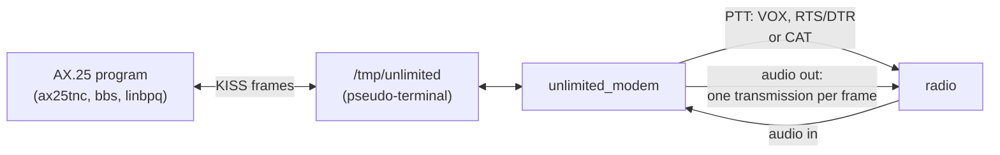

What one frame looks like on the air, with PTT by a line or CAT (the default TX delay and tail), and with VOX:

```
PTT     _/‾‾‾‾‾‾‾‾‾‾‾‾‾‾‾‾‾‾‾‾‾‾‾‾‾‾‾‾‾‾‾‾‾‾‾‾‾‾‾‾‾‾‾‾‾‾‾‾‾‾‾‾‾‾‾‾\_
audio      [TX delay 100 ms][byte 0][byte 1] ... [byte n-1][TX tail 100 ms]
           silence           10 slots each                  silence       + output latency, then PTT off
VOX:       [lead tone 150 ms][2 silent slots][byte 0] ... [byte n-1][TX tail]
```

**Exact rules.**

- **Send.**
  - A KISS data frame (command 0, any port) is one transmission. Its bytes enter the send queue as they arrive
    (`UNLIMITED_MODEM_QUEUE`: 16,384 bytes on a PC, 2,048 on an MCU). A frame goes on the air once it is complete (its
    closing FEND has arrived), or once it fills the send queue; then it streams.
  - The encoder's queue is topped up with that frame's bytes only, so a byte of the next frame never enters the current
    transmission.
  - A transmission whose frame had not ended when its audio ended (a computer slower than the air, possible only for a
    frame longer than the queue) is not split: the rest of that frame is dropped as it arrives and counted (`underruns`,
    `bytes_skipped`).
  - Empty data frames are ignored.
- **Back-pressure.**
  - `host_input()` takes a byte only when what it gives fits: a data byte needs room in the queue, a frame's end needs a
    frame slot (one per 32 queue bytes, 4..64).
  - What does not fit waits in the caller. The core wakes the caller (`ModemWake::host`) once a quarter of the queue and
    a frame slot are free again.
- **Receive** (V23). A reception — from `locked` (a transmission found from its start) to `end` or `lost` — goes to
  the computer as `C0 00`, its bytes escaped (FEND as `DB DC`, FESC as `DB DD`) as they are decoded, and `C0`, **once it
  is `--min-frame` N bytes long** (`ModemConfig::min_frame_bytes`, default `k_default_min_frame_bytes` = 15, the
  shortest AX.25 frame: two addresses of 7 bytes and a control byte; 0..`k_max_min_frame_bytes` = 64): its first N − 1
  bytes wait in the modem, the N-th sends `C0 00` and all N at once, in order, and the rest streams; a reception that
  ends shorter sends nothing at all, not even `C0 00` or `C0` (the stray bytes of V20 are a byte or two). The first byte
  then reaches the computer N − 1 windows after it was decoded (with 15: 14 s at 1 byte/s, 2.3 s at 6, 1.2 s at 12,
  0.56 s at 25). With 0: `C0 00` at `locked` and each byte at once, nothing held. The monitor names a reception it
  dropped ("shorter than --min-frame 15: not passed to the computer"), the `--tui` frames item counts them ("3 short
  dropped"), the banner shows the minimum and its wait (`Min frame`).
- **Half duplex.** While PTT is keyed the receiver hears digital silence instead of the input, like a radio's muted
  receiver. So nothing of the modem's own transmission reaches the computer, and its own echo never raises DCD.
  `--full-duplex` keeps the input.
- **Channel check**, before each frame:
  1. Wait until DCD is off (`Decoder::dcd()`: a transmission is being decoded, §3.10) and `--dwait` (1500 ms) has
     passed since it went off. The start of the modem counts as "went off". The modem's own transmissions do not
     restart dwait.
  2. Then p-persistence, the KISS rule: a draw at once, then one per `--slottime` (100 ms). The draw is the top 8 bits
     of an xorshift32 generator, seeded per run in the program, and the modem transmits when it is ≤ `--persist` (63:
     a chance of 64 in 256 per draw). DCD in between restarts dwait and the draws.
  3. Key PTT. The TX delay of silence follows (`--txdelay`, 100 ms), or the VOX lead with `--ptt vox` (150 ms and
     2 silent slots). Then the frame, then the tail (`--txtail`, 100 ms, at least 2 slots).
  4. Release PTT `output_latency_ms` after the audio side finished the tail: the device's latency plus the output
     resampler's 3 ms, so the audio has left the device.
  - `--full-duplex` skips steps 1 and 2.
- **Spacing between the modem's own transmissions.** After a transmission's last STOP, the next one waits until the
  silence covers a receiver's end detection: `end_windows` windows and 2 slots (`spacing_ms()`).
  - `end_windows` is 1 (`k_default_end_windows`), or 2 with the fade bridge. The tail and a silent lead-in count; a VOX
    lead does not.
  - With the defaults it adds nothing with PTT, and 100 ms with VOX at 6 bytes/s.
  - *Found while building:* a VOX lead 100 ms after the last STOP read as the previous transmission going on (`lost`),
    and the frame was missed (1 of 4 back-to-back VOX frames arrived without the spacing, 4 of 4 with it, §9).
  - With V20 (one byte, one decision) back-to-back VOX frames of 1–8 bytes arrive 8 of 8 at 6, 12 and 25 bytes/s
    (`modem_link_back_to_back_vox_frames`, §9); under V18's check 3 of 8 arrived at 12 bytes/s.
- **The fade bridge** (`--fade-bridge`; default off, the one constant `k_default_fade_bridge`; both stations must
  agree). It makes three changes:
  - the modem's receiver runs with `DecoderConfig::fade_bridge` (`ModemConfig::heard()`);
  - the silence before each START is at least 300 ms: with PTT the TX delay becomes max(`--txdelay`, 300 ms)
    (`ModemConfig::sent()`), while with VOX the lead tone and its gap already qualify;
  - the spacing between the modem's own transmissions becomes 2 windows (and 2 slots).
- **KISS.**
  - FEND C0, FESC DB, TFEND DC, TFESC DD. Shared FENDs work (`C0 00 A C0 00 B C0` gives A and B), and so do runs of
    FENDs.
  - Commands 1..5 (TXDELAY, P, SLOTTIME, TXTAIL, FULLDUPLEX) are accepted and ignored, because the command line is the
    timing authority, as in `kiss_modem`. Other commands are ignored and counted.
  - A FESC followed by anything else counts as a bad escape and that byte passes as it is. A FEND after a FESC still
    ends the frame. Bytes before the first FEND are ignored and counted.

**Decisions (made while building, with the reason and the alternative rejected).**

| # | Decision | Why | Rejected |
|---|---|---|---|
| M1 | **TX delay 100 ms by default** with RTS, DTR or CAT (Gustavo, 2026-09-28); with VOX the lead tone and gap instead. | Radios need about 20–100 ms to switch to transmit; nothing is ever added once the transmission has started. | kiss_modem's 400 ms (flags for an AFSK PLL; Unlimited has none). |
| M2 | **A frame starts when complete**, or when it fills the send queue. | The encoder ends a transmission at the first window boundary with an empty queue (V7: nothing is padded), so an early start would split a frame whenever the computer paused. The channel check and the TX delay last far longer than any computer takes to deliver a frame. | Start on the first byte. |
| M3 | **A frame is never split.** The rest of a frame cut short is dropped and counted. | One frame = one transmission (V9): a receiver gets one short frame, not two broken ones. | Send the rest as a second transmission. |
| M4 | **Half duplex mutes the receiver** (it hears zeros while keyed). | It is exactly a radio's muted receiver. The alternative would let the modem's own echo (a loopback device, a monitor path) hold DCD for the end latency after every transmission. | Decode and drop the events heard while keyed. |
| M5 | **dwait counts from DCD off, not from the modem's own transmissions.** | Two stations with the same dwait would otherwise wait on each other. | kiss_modem's "since the last frame received". |
| M6 | **Spacing between the modem's own transmissions** (1 window + 2 slots, 2 windows + 2 slots with the fade bridge). | Measured: back-to-back VOX frames, 1 of 4 arrived without it, 4 of 4 with it. | Rely on p-persistence (random, sometimes 0). |
| M7 | **The wake-up handler, and the control side waiting in `poll()` on a wake pipe** with the core's next timer. | The playing side is a real-time callback: it may write one byte to a non-blocking pipe (as the live output does at the end of a source), but cannot notify a condition variable without its mutex, which a lost-wake-up-free notify needs. | A condition variable (as §12.3 first said). |
| M8 | **p-persistence seeded per run** (clock and process number); a fixed seed in tests. | Two modems with the same seed make the same draws and collide every time. | The core's fixed seed. |
| M9 | **`--txdelay` refused with `--ptt vox`; `--vox-lead-ms` refused with the other methods.** | Each lead belongs to one kind of keying; a silent TX delay cannot key a VOX. | Accept and ignore. |
| M10 | **The PTY slave raw with VMIN 1.** | A KISS program's blocking read then waits for a byte instead of taking "no byte yet" for the end (found by the smoke test's reader). | VMIN 0 (the CAT port's setting). |

### 12.2 The portable core (`kiss.hpp`, `transmitter.hpp`, `modem.hpp`)

**In plain words.** The modem's work, all of it, sits in one portable object that runs on a PC, an ESP32 and, for the
send side, an Arduino Nano. It uses no heap, no threads and no exceptions. It is driven from four places, each with its
own method:

- the computer's bytes (`host_input()`);
- the radio's audio in (`audio_input()`);
- the audio out (`audio_output()`);
- a clock (`tick()`).

When one place has news for another, the core calls a wake-up handler.

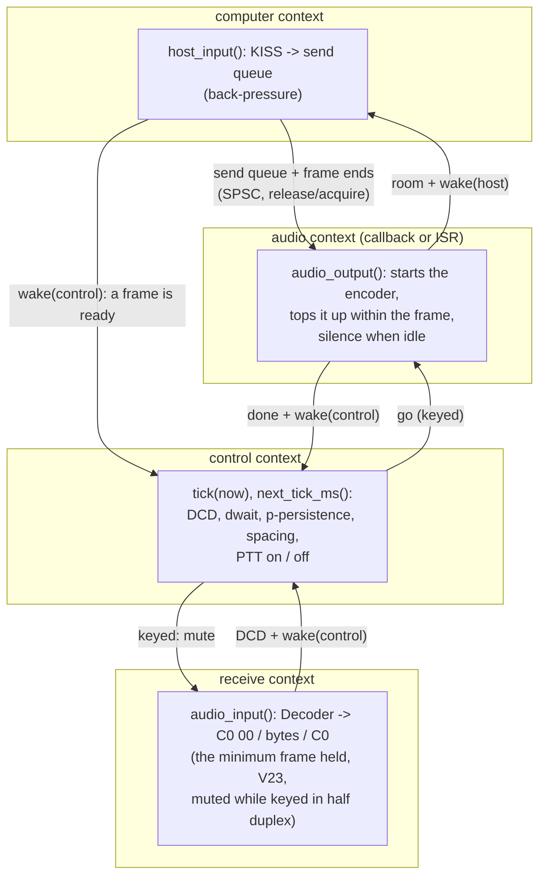

**Exact rules.**

- **Contexts.** One calling context per method:
  - `host_input()`: computer;
  - `audio_input()`: receive (it runs the `Decoder` and calls the host handler and the event tap from inside);
  - `audio_output()`: audio (a device callback or an ISR; it never blocks or locks);
  - `tick()` and `next_tick_ms()`: control.
  `dcd()`, `transmitting()`, `channel_state()` and `counters()` read snapshots from any context.
- **Hand-offs between contexts.** *In plain words:* each shared value has one writer. The writer first does its work
  (writes the bytes, moves its counters), then publishes the value; a reader that sees the new value also sees all that
  work. On a PC or an ESP32 the writer and the reader may run on two cores at once, so this order must be enforced by
  the processor, not only by the compiler.

  ```
  computer:  write bytes 0..n-1 into the queue ──> store_release(queue_head_)      ("everything before is done")
  audio:     load_acquire(queue_head_) ──> read bytes 0..n-1                       ("everything after sees it")
  ```

  - Every value one context writes and another reads is written with `store_release()` and read with `load_acquire()`
    (`platform.hpp`). With GCC or Clang these are the compiler's atomic accesses: `stlr` and `ldapr` on the Apple M4
    (*measured* on the merged tree: 59 `stlr`, 58 `ldapr` and no `dmb` in `transmitter.o`), plain moves on x86, `memw`
    on the ESP32 (no `__atomic` library call in `transmitter.o` and `modem.o`, checked with `nm`). On an AVR (one core,
    an ISR as the other context) a value wider than a byte is read or written with interrupts off, since an interrupt
    between its two instructions would see half of it.
  - The hand-offs: the send queue (bytes and frame ends) from the computer to the audio side; "go" from control to
    audio; "done", "skipping" and the queue's tail from audio to control; DCD and its change count from receive to
    control; "keyed" from control to receive (the half-duplex mute); every counter in `counters()`.
  - A frame's end is published after its bytes and before any byte of the next frame. The audio side reads the head
    before the ends, so it never takes a next frame's bytes for this one's.
  - "done" is published last when a transmission ends: the control side, seeing it, sees the queue as the audio side
    left it. "skipping" clears only after a skipped frame has left the queue, and the control side reads it first.
  - The DCD change count is read before DCD itself: a change counted is a change seen.
  - *Found and fixed while building* (a review for the ThreadSanitizer run; none had been seen failing):
    1. The control side read DCD and its change count with no order between them. On ARM64 it could see the new count
       with the old DCD and, with a dwait of 0, key into a transmission that had just begun.
    2. `skip()` cleared "skipping" with no order after moving the queue's tail. The control side could see a frame
       ready that had already been dropped, and key an empty transmission, losing the next frame.
    3. On the Nano send side (AVR), the 16-bit queue head and tail could be read half-updated by the ISR or by the
       main loop; the main loop could then overwrite bytes not yet sent.
- **Timers.** `tick(now_ms)` takes any wrapping millisecond clock. `next_tick_ms()` names the next deadline (dwait's
  end, the next draw, the spacing's end, the PTT release), or `k_no_tick` when only an event can change anything:
  - a frame ready: `wake(control)` from `host_input()`;
  - DCD changed: from `audio_input()`;
  - a transmission's audio ended: from `audio_output()`.
  A superloop MCU may simply call `tick()` every loop.
- **Wake-ups.** The optional handler, `WakeHandler(ModemWake::control | host)`, may be called from the audio
  callback. It must post and return (a pipe byte, a task notification).
- **The minimum frame** (V23) lives in `Modem`: up to `k_max_min_frame_bytes` (64) held bytes, 64 B of RAM;
  `ModemCounters::short_frames` and `short_bytes` count what it dropped. A `ModemTransmitter` alone has no receiver
  and no minimum frame.
- **Validity.** An invalid configuration leaves the core inert:
  - `signal` not at 8000 Hz, or refused by `EncoderConfig::check()`;
  - `receiver` refused, or at another speed;
  - a slot time of 0;
  - `min_frame_bytes` above 64.
  Then `host_input()` takes nothing and `audio_output()` is silence.
- **Sizes** (*measured* on the merged tree with V20–V24, `make check_embedded`):

| Build | Size |
|---|---|
| PC | `Modem` 34,576 B (send queue 16,384 B, 64 frame slots; `Decoder` 17,440 B); `ModemTransmitter` 16,896 B; `KissDecoder` 32 B; `Encoder` 144 B |
| ESP32 (xtensa, MCU send queue 2,048 B) | `Modem` 20,192 B, `ModemTransmitter` 2,544 B, `Decoder` 17,428 B, `KissDecoder` 32 B, `Encoder` 144 B |
| Arduino Nano (ATmega328P), the send side with `UNLIMITED_MODEM_QUEUE=512` | 9,774 B of flash (29.8 %), 902 B of RAM (44.0 %), no float routine |

On the Nano the interrupts-off accesses cost 290 B of flash (9,774 B, against 9,484 B for the same code with plain
accesses, *measured* when the accessors were built). `static_assert`: the transmitter fits its queue, its frame slots
and 512 bytes, on every target.

### 12.3 The PC side of `unlimited_modem`

**In plain words.** The program opens the sound devices, the PTT and a pseudo-terminal, prints what it will do, and
then only waits:

- for your program's bytes;
- for the radio's audio;
- for the sound card asking for audio;
- for the core's next deadline.

Ctrl-C, SIGTERM or SIGHUP stop it cleanly: PTT released at once (30 ms after SIGHUP in the middle of a transmission,
*measured*), the link removed, and the frames still waiting reported.

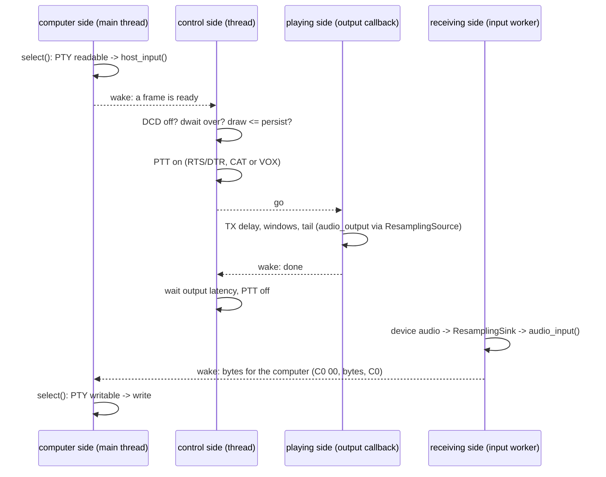

**As built.**

- **Opening order.**
  1. the input and output devices (`pc/audio.hpp`; `-d`, `--input`, `--output`, `-r`), then PTT (`open_ptt`);
  2. then the computer's port: the PTY (`KissPort::open_pty`, default link `/tmp/unlimited`), or `--serial DEV` at
     `--serial-baud` (default 115200, 8N1; 1200..230400).
  The link is created after every device has opened, so a failed device leaves no link. The link is removed on every
  exit after it (RAII), but only when it still points to this PTY.
- **Threads, and nothing polls.**
  - **Computer side (main thread):** `select()` with no timeout on the port and two wake pipes (the main one, which
    signals post, and the host one).
    - Bytes read go to `host_input()`. What it leaves waits in a 4 KiB buffer, and the port is not read again until
      `ModemWake::host`.
    - Bytes for the computer come from a 64 KiB SPSC ring filled by the receiving side and are written when the port
      is writable. A computer that never reads loses what does not fit, counted and reported at the stop.
  - **Control side (a thread):** `tick()`, then `poll()` on its wake pipe until `next_tick_ms()` (or no timeout).
  - **Receiving side:** the input device's worker thread (never the audio callback), through `ResamplingSink` at the
    device's rate to 8 kHz, into `audio_input()`.
  - **Playing side:** the output device's callback, through `ResamplingSource` (8 kHz to the device's rate) into
    `audio_output()`.
  - **`--tui`:** the receiving side also feeds and draws the view (§12.6); nothing is drawn from an audio callback.
  - **File and null devices** (`wav:`, `null`) run in real time: a thread paces them 20 ms at a time. A WAV input is
    followed by silence until the stop.
  - **Signals** are blocked in every thread the program starts, so they reach the main thread.
- **PTT** is keyed and released by the control side, through the core's PTT handler, around each transmission. A PTT
  failure stops the program with exit 1. On any stop, PTT is released after the control side has ended.
- **Output latency** given to the core: the device's `latency_ms()` plus the output resampler's lead (3 ms): 11 + 3 =
  14 ms on the Teams loopback device (*measured*, the banner below).
- **Warnings.** A live input that has been digital silence (every sample 0) for 3 s gets a warning: nothing plays into
  it, or the system gives the program silence (the macOS microphone permission); a radio's receiver always gives some
  noise. A clipping input is warned about too.
- **Exit codes.**
  - 0: a clean stop (SIGINT, SIGTERM, SIGHUP);
  - 1: a device, the PTY, the serial port or PTT failed, a configuration was refused (it does not fit its passband, or
    the threshold is out of range), or `--loopback` failed;
  - 2: a usage error.
- **kiss_modem's defects, not copied:**

| kiss_modem's defect | Here |
|---|---|
| a non-raw PTY | the slave is raw, VMIN 1 (test `kiss_port_pty_is_raw_and_linked`) |
| one KISS decoder for all sources | one computer port per modem; TCP is parked |
| a lost second frame after a shared FEND | tests `kiss_frames_escapes_and_shared_fends`; the smoke test sends two frames with a shared FEND |
| unbounded buffers | a bounded send queue with back-pressure, a bounded ring to the computer |
| a symlink left on error exits | the link is made last and removed by RAII; exit paths tested |
| PTT left keyed on SIGHUP | SIGHUP is handled: PTT released in 30 ms |
| ALSA not re-prepared after a drain | the modem never drains |
| `--loopback` exiting 0 on failure | exit 1 on FAIL |

**Command line** (`unlimited_modem --help`, as built):

```
usage: unlimited_modem [options]

A KISS modem for radio audio. AX.25 programs (any KISS program) open its pseudo-terminal; every KISS frame
they send goes on the air as one Unlimited transmission, and every transmission heard comes back to them
byte by byte as it is decoded. Both stations must use the same speed (--bps); the receiver finds the pitch
by itself, so SSB mistuning does not matter.

The signal (both stations must use the same --bps)
  --bps B            the speed in bytes per second, 1.00..25.00 in steps of 0.01 (default 6.00, for HF SSB)
  --tone HZ          the pitch this station sends, 300..2700 Hz (default 1500)
  --passband LO:HI   the radios' audio passband: the signal must fit it, the pitch search stays inside it
                     (default 300:2700, a 2.4 kHz SSB filter)
  --level-dbfs DB    loudness of a beep's crest (default -3); or --volume N, a percentage of full scale
  --threshold PCT|auto  the receiver's decision line: auto, the adaptive line (default), or PCT % of the
                     reference the START and STOP tones give, 50..90
  --fade-bridge      HF fades: a transmission ends only after 2 silent windows, and this station leaves
                     300 ms of silence before each START (a TX delay of at least 300 ms, or the VOX lead);
                     both stations must agree (default off; --no-fade-bridge turns it off)

The computer (KISS)
  --link PATH        the pseudo-terminal's symbolic link KISS programs open (default /tmp/unlimited)
  --serial DEV       KISS on a serial port instead; --serial-baud N its speed, 8N1 (default 115200)
  --min-frame N      hand a reception to the computer only once it is N bytes long, 0..64 (default 15,
                     the shortest AX.25 frame): speech, CW or noise makes a byte or two readable now and
                     then, and those never reach the computer; the first byte of a frame then waits N-1
                     windows (2.3 s at 6 bytes/s with 15); 0 passes every reception from its first byte

Sound devices:
  --list-devices     list every audio input and output (number, name, channels, rates, UID); exit
  -d SPEC            the input and output device: coreaudio:<#|name part|UID> (macOS), alsa:<name> (Linux),
                     default, wav:<path> or null; a name part matching several devices is refused
  --input SPEC       the input device alone (the radio's receive audio)
  --output SPEC      the output device alone (audio to the radio's modulation input)
  -r HZ              open a live device at this rate (default: the device's own; CoreAudio: its nominal rate)
PTT:
  --ptt METHOD       vox, rts, +rts, -rts, dtr, +dtr, -dtr, icom, yaesu, kenwood, cat (default vox)
  --ptt-device DEV   the serial port of rts, dtr and the CAT methods
  --ptt-invert       lower the line to key (the same as -rts or -dtr)
  --cat-rate BAUD    CAT serial speed, 8N1: 1200, 2400, 4800, 9600, 19200, 38400, 57600, 115200 (default 19200)
  --cat-addr ADDR    icom: the radio's CI-V address in hex, 0x94 or 94h (default 0x94, the IC-7300's;
                     IC-705: 0xA4; the radio's CI-V menu shows it)
  --cat-tx-on HEX    cat: the bytes that key the radio, e.g. FEFE94E01C0001FD
  --cat-tx-off HEX   cat: the bytes that unkey it, e.g. FEFE94E01C0000FD

Channel access and timing (10 ms units, as kiss_modem; KISS parameter frames are ignored)
  --txdelay N        rts, dtr, CAT: silence after keying and before the first byte, for the radio to
                     switch to transmit (default 10 = 100 ms; 300 ms at least with --fade-bridge)
  --vox-lead-ms MS   vox: the lead tone that keys the radio, then 2 silent slots (default 150 ms)
  --txtail N         silence after the last byte before PTT is released (default 10 = 100 ms)
  --persist N        p-persistence: transmit when a random 0..255 is <= N (default 63)
  --slottime N       time between p-persistence draws (default 10 = 100 ms)
  --dwait MS         after the channel goes quiet (DCD off), wait this long before contending (default 1500)
  --full-duplex      transmit at once, with no channel check, and hear while sending

Display
  -c CALL            this station's callsign: --test-tx sends an AX.25 UI frame CALL>CQ
  --monitor          each frame sent and received: time, direction, length, text or hex; received frames
                     with the speed measured, the pitch and the SNR; sent ones with the PTT
  --debug N          on stderr: 1 PTT, transmissions, receptions, DCD; 2 + the computer's bytes, the send
                     queue, the p-persistence draws; 3 + every receiver event
  --tui              the live view: what the radio hears (each window's bars, scope, spectrum, the input
                     level) and the modem (DCD, PTT, sending n of m bytes, the send queue, frames each way);
                     the monitor and debug lines wait until it closes

Tests
  --loopback [SNR]   two modems in memory, through the channel simulator at SNR dB (key-down, in 2500 Hz;
                     clean without it): PASS when every frame comes back byte for byte, exit 1 otherwise
  --test-ptt         key and release PTT three times (1 s on, 1 s off) and exit
  --test-tx TEXT     send TEXT as one transmission, with no channel check, and exit (with -c CALL: an
                     AX.25 UI frame CALL>CQ)
  -h, --help         this text

Exit codes: 0 stopped cleanly (Ctrl-C, SIGTERM, SIGHUP); 1 a device, the pseudo-terminal, the serial port or
PTT failed, the configuration was refused, or --loopback failed; 2 a usage error.
```

**Rules between options** (usage errors, exit 2):

- `RadioOptions::check()`: rts, dtr and the CAT methods need `--ptt-device`, and so on (§12.5);
- `--txdelay` with `--ptt vox`, and `--vox-lead-ms` with any other method;
- `--level-dbfs` together with `--volume`, and `--level-dbfs` above 0;
- `--serial` together with `--link`, and `--serial-baud` without `--serial`;
- more than one of `--list-devices`, `--loopback`, `--test-ptt` and `--test-tx`; `--test-tx` with no text;
- values out of range: `--txdelay`, `--txtail` and `--slottime` are 0..255 in 10 ms units (slottime ≥ 1), `--persist`
  is 0..255, `--dwait` 0..65535 ms, `--volume` 1..100, `--debug` 0..3, `--min-frame` 0..64, `-c` is 1–6 letters and
  digits with an optional `-SSID` of 0..15, and `--serial-baud` must be one of 1200, 2400, 4800, 9600, 19200, 38400,
  57600, 115200, 230400;
- `--tui` with a null input, or with a test mode (§12.6).

**The start-up banner** (*measured* on 2026-09-28: Icom CI-V PTT on a PTY standing in for the radio, which received
the unkey command `FE FE A4 E0 1C 00 00 FD` at the start; audio on the "Microsoft Teams Audio" loopback device):

```
======================================================================
  unlimited_modem - KISS modem for radio audio (Unlimited v1.0)
======================================================================
  Speed      : 6.00 bytes/s = 48 bit/s, slot T 16.667 ms
               BOTH STATIONS MUST USE --bps 6.00
  Signal     : pitch 1500 Hz, crest -3.0 dBFS
  Bandwidth  : occupied bandwidth 264 Hz (1368-1632 Hz); passband 300-2700 Hz: fits; shift tolerance -1068/+1068 Hz
  Airtime    : 1 byte 0.37 s, 64 bytes 10.87 s, 144 bytes 24.2 s (key to release)
  Receiver   : adaptive decision line (auto: 50-75 % of the reference), impulse blanker on, fade bridge off
  Min frame  : 15 bytes (--min-frame 15): shorter receptions never reach the computer; the first byte waits 14 windows (2.33 s)
  Audio in   : coreaudio:MSLoopbackDriverDevice_UID (coreaudio:7 Microsoft Teams Audio (48000 Hz, 1 channel)), 48000 Hz (resampled to 8000 Hz)
  Audio out  : coreaudio:MSLoopbackDriverDevice_UID (coreaudio:7 Microsoft Teams Audio (48000 Hz, 1 channel), latency 11 ms), 48000 Hz, PTT released 14 ms after the audio
  PTT        : Icom CI-V, address A4h on /dev/ttys000 at 19200 baud
  Lead, tail : TX delay 100 ms (--txdelay 10); TX tail 100 ms (--txtail 10)
  Channel    : half duplex, dwait 1500 ms, persist 63, slottime 100 ms
----------------------------------------------------------------------
  PTY device : /dev/ttys002
  Symlink    : /tmp/unlimited -> /dev/ttys002
  Example    : ax25tnc -c N0CALL -r N0CALL-1 /tmp/unlimited
----------------------------------------------------------------------
  Monitor on. Ctrl-C stops.
```

With VOX the lead line reads `lead tone 150 ms (--vox-lead-ms 150), then 2 silent slots (33.3 ms)`, and the airtime
`1 byte 0.45 s, 64 bytes 10.95 s, 144 bytes 24.28 s` (*measured*). At 1 byte/s it reads `lead tone 300 ms
(--vox-lead-ms 150)`, because the effective value has the 3-slot minimum. With `--fade-bridge` it reads `TX delay
300 ms (--txdelay 10, raised to 300 ms by --fade-bridge)`. The airtime counts from the key to the release, without the
output latency, for frames of 1, 64 and 144 bytes (the encoder's `duration_samples()`, `modem_cli_airtime_is_the_encoders`):

| Speed | PTT (TX delay 100 ms) | VOX (lead 150 ms) |
|---|---|---|
| 1 byte/s | 1.3 s, 64.3 s, 144.3 s | 1.7 s, 64.7 s, 144.7 s |
| 3 bytes/s | 0.53 s, 21.53 s, 48.2 s | 0.67 s, 21.67 s, 48.33 s |
| 6 bytes/s | 0.37 s, 10.87 s, 24.2 s | 0.45 s, 10.95 s, 24.28 s |
| 12 bytes/s | 0.28 s, 5.53 s, 12.2 s | 0.36 s, 5.61 s, 12.27 s |
| 25 bytes/s | 0.24 s, 2.76 s, 5.96 s | 0.3 s, 2.82 s, 6.02 s |

**The monitor** (`--monitor`, on stdout).

- **Frames sent** are printed when their PTT is keyed: time, `TX`, the length, the PTT, and the frame.
- **Frames received** are printed when their transmission ends (`end` or `lost`): time, `RX`, the length, the speed
  measured (1000 / (10 · T ms)), the pitch, the SNR (the last byte's), the windows dropped as framing errors, `lost`,
  "shorter than --min-frame N: not passed to the computer" when V23 dropped it, and the frame.
- **The frame** is shown as quoted text (C escapes for what is not printable ASCII). When it reads as AX.25 it is shown
  as `AX.25 SRC>DEST,DIGI [UI pid F0] "info"`. A hex dump follows unless the frame is plain text.
- **With `--debug 1`** each frame sent also shows its layout (the effective TX delay or VOX lead, the windows, the
  tail, the time keyed). Examples (*measured* on 2026-09-28 by `tools/modem_smoke_teams.sh 6`, VOX, and by
  `unlimited_modem --loopback 6 --monitor`):

```
[21:54:28.590] TX 21 bytes, PTT VOX (the lead tone keys the radio): "Hello from A, frame 1"
                   lead tone 150 ms (--vox-lead-ms 150), then 2 silent slots (33.3 ms); 21 windows 3.5 s; TX tail 100 ms (--txtail 10); keyed 3.797 s with the 14 ms output latency
[21:54:37.017] RX 23 bytes, 6.00 bytes/s, pitch 1500.0 Hz, SNR 38.9 dB: "frame 2: \xC0 and \xDB inside"
                   hex 66 72 61 6D 65 20 32 3A 20 C0 20 61 6E 64 20 DB 20 69 6E 73 69 64 65
      AX.25 N0CALL>CQ [UI pid F0] "Unlimited loopback test 1234567890"
      hex 86 A2 40 40 40 40 E0 9C 60 86 82 98 98 61 03 F0 55 6E 6C 69 6D 69 74 65
```

**`--debug N`** writes to stderr, time-stamped:

1. PTT on and off (with the time keyed), the channel state (`waiting for the channel`, `keyed`, `releasing`, `idle`),
   DCD on and off, and the receiver's `locked` (pitch, T, SNR), `end` and `lost`;
2. adds the computer's bytes both ways (hex of the first 32), the send queue after each read, and the p-persistence
   draws;
3. adds every receiver byte and slot event.

**The test modes:**

- **`--loopback [SNR]`** runs `ModemLink` with the options' configuration for both stations: clean without an SNR, or
  `usb` at SNR dB with a 40 Hz mistuning.
  - A sends three frames: an AX.25 UI frame `CALL>CQ` (`-c`, default N0CALL; 50 bytes), a frame of KISS's special
    bytes (`C0 DB DC DD 00 FF` and "KISS escapes", 18 bytes), and one byte (`X`: shorter than the default
    `--min-frame 15`, so it must *not* reach B's computer). Then B answers with one frame ("reply from B, over",
    18 bytes).
  - It prints one line per frame and `Result: PASS` only when every frame at least `--min-frame` long came back byte
    for byte, the shorter one did not, and each frame was one transmission; otherwise `FAIL` and exit 1.
- **`--test-ptt`** opens the PTT (every method) and keys it 3 times, 1 s on and 1 s off. A signal ends it with PTT
  released.
- **`--test-tx TEXT`** opens only the output and the PTT and sends TEXT at once, with no channel check (as
  kiss_modem). With `-c` it sends an AX.25 UI frame `CALL>CQ`, as kiss_modem; without `-c`, the raw text. It exits
  once PTT is released.

### 12.4 PTT and CAT (as built)

**In plain words.** The transmitter is keyed in one of three ways: by the sound itself (VOX), by a wire of a serial
port (RTS or DTR), or by a command sent to the radio over its serial or USB port (CAT). Unlimited drives the wire or
sends the command and never waits for the radio's answer. Keying twice sends nothing the second time; a program that
ends, or fails, leaves the radio unkeyed.

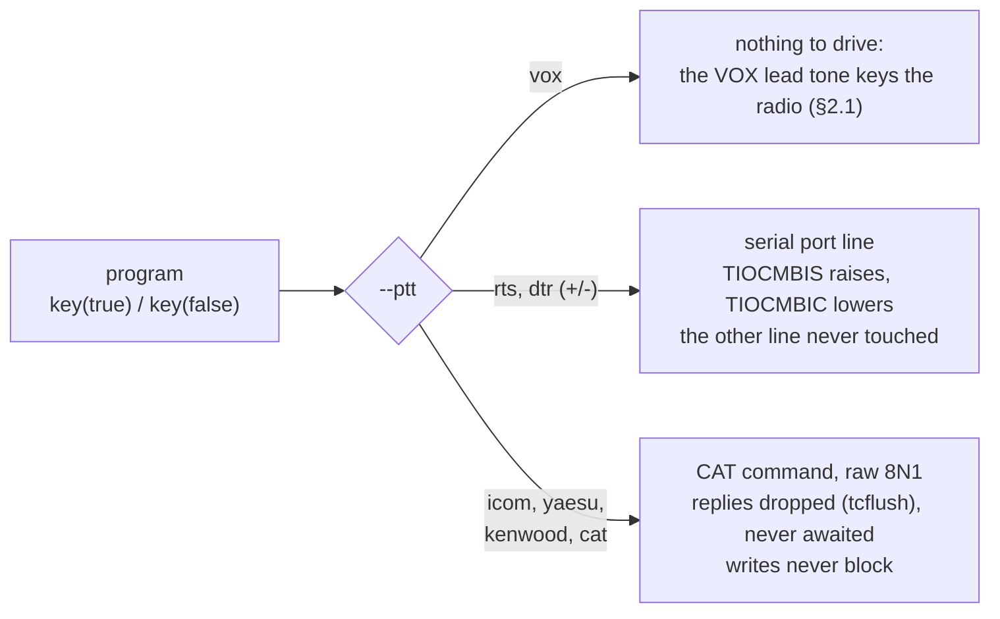

**Exact rules.**

| Method (`--ptt`) | Keys by | Unkeys by | Needs |
|---|---|---|---|
| `vox` (default) | nothing | nothing | – |
| `rts`, `+rts` | raising RTS (`TIOCMBIS`) | lowering RTS (`TIOCMBIC`) | `--ptt-device` |
| `-rts` (or `rts` with `--ptt-invert`) | lowering RTS | raising RTS | `--ptt-device` |
| `dtr`, `+dtr`, `-dtr` | as RTS, on DTR | | `--ptt-device` |
| `icom` | `FE FE <addr> E0 1C 00 01 FD` | `FE FE <addr> E0 1C 00 00 FD` | `--ptt-device`; `--cat-addr` (default `0x94`) |
| `yaesu` | `TX1;` | `TX0;` | `--ptt-device` |
| `kenwood` | `TX;` | `RX;` | `--ptt-device` |
| `cat` | `--cat-tx-on` bytes | `--cat-tx-off` bytes | `--ptt-device`, both hex strings |

- **Opening.** The port is opened `O_RDWR | O_NOCTTY | O_NONBLOCK` (a macOS `/dev/tty.*` would otherwise wait for
  carrier; use `/dev/cu.*`). RTS/DTR: the line is set to the unkeyed level at once. CAT: raw 8N1 at `--cat-rate`
  (`cfmakeraw`, `CS8`, no parity, 1 stop bit, `CLOCAL | CREAD`, no `CRTSCTS`, no `IXON/IXOFF`, `VMIN = VTIME = 0`),
  input and output flushed, then the unkey command is sent (*refinement*: a radio left keyed by a crashed run is
  released, and a port that cannot take a command fails at start, not at the first transmission).
- **Keying** is idempotent: `key(on)` when already `on` returns true and sends nothing. `key()` returns false when the
  line or the port refused; the state is then unchanged. One thread keys.
- **The other line is never written**: RTS keying uses only `TIOCMBIS`/`TIOCMBIC` with the RTS bit (DTR likewise); no
  `TIOCMSET`.
- **Inverted lines keep their level after the program** (*refinement*): an inverted line keys when low, and closing a
  port with `HUPCL` set lowers RTS and DTR, which would key the radio after the program ends; `HUPCL` is cleared on the
  port for `-rts`/`-dtr`. Normal lines keep `HUPCL` (lowering them unkeys).
- **CAT replies are dropped, never read or waited for**: before each command, `tcflush(fd, TCIFLUSH)` discards what the
  radio sent (Icom "CI-V USB Echo Back", the `FB`/`FA` answer, CI-V transceive data). Writes are non-blocking: a
  command the port does not take whole (`EAGAIN`, or a partial write) fails the key at once, with no retry and no wait.
- **The destructor unkeys** (when keyed) and closes the port.
- **Opening the port raises RTS and DTR** on most systems (the kernel does it before Unlimited can act): a PTT on RTS
  is keyed for the moment between `open()` and the first unkey. Interfaces with a relay or an RC delay ignore it; this
  is documented, not avoidable in user space. For CAT ports, RTS and DTR stay as the system opens them: an Icom with
  "USB SEND" or "USB Keying" set to RTS/DTR must have them OFF.
- **CI-V address.** The radio's CI-V menu shows it: 94h is the IC-7300's default, A4h the IC-705's, B6h the IC-7300
  MKII's (its Basic Manual, 2025) and A4h the Xiegu X6200's (Radioddity's CI-V document for firmware 1.0.6, and
  Hamlib); no model table in the code, and `docs/modem.md` cites the sources. `--cat-addr` takes hex only, `0x94` or `94h`, 00h..DFh (*refinement*: `kiss_modem`'s `strtol(…, 0)` read
  `94` as decimal 94 = 5Eh; E0h is the computer's own address, FDh/FEh frame CI-V messages). Xiegu radios speak CI-V:
  `icom` with the radio's address.
- **CAT rates** (`k_cat_rates`): 1200, 2400, 4800, 9600, 19200 (default), 38400, 57600, 115200 baud: the termios speeds
  both macOS and Linux have (*refinement*: no `IOSSIOSPEED`/`termios2` code for other rates).
- **Hex** (`--cat-tx-on/off`): pairs of hex digits, either case, spaces allowed between pairs (`FEFE94E01C0001FD`,
  `FE FE 94 E0 1C 00 01 FD`); anything else is refused with the reason (*refinement*: `kiss_modem` skipped bad digits
  silently).
- The ESP32 keys a GPIO (§12.7); not part of `pc/`.

**API (`pc/ptt.hpp`).**

```cpp
enum class PttMethod { vox, rts, dtr, icom, yaesu, kenwood, cat };

const std::uint32_t k_default_cat_rate = 19200;
const std::uint32_t k_cat_rates[] = {1200, 2400, 4800, 9600, 19200, 38400, 57600, 115200};
const std::uint8_t k_default_icom_address = 0x94;
const std::uint8_t k_icom_controller_address = 0xE0;

struct PttOptions {
    PttOptions();
    PttMethod method;                   // --ptt (vox)
    std::string device;                 // --ptt-device
    bool invert;                        // --ptt-invert, -rts, -dtr
    std::uint32_t cat_rate;             // --cat-rate
    std::uint8_t cat_address;           // --cat-addr
    std::vector<std::uint8_t> cat_on;   // --cat-tx-on
    std::vector<std::uint8_t> cat_off;  // --cat-tx-off
};

class Ptt {  // the base class is VOX
public:
    Ptt();
    virtual ~Ptt();
    virtual bool key(bool on);
    virtual std::string description() const;  // "Icom CI-V, address 94h on /dev/cu.usbserial-110 at 19200 baud"
    bool keyed() const;
protected:
    bool keyed_;
};

typedef int (*ModemLineControl)(int fd, unsigned long request, int bits);  // TIOCMBIS / TIOCMBIC
int ioctl_modem_lines(int fd, unsigned long request, int bits);
std::unique_ptr<Ptt> open_ptt(const PttOptions& options, std::string& error,
                              ModemLineControl control = ioctl_modem_lines);

std::vector<std::uint8_t> cat_command(const PttOptions& options, bool on);
bool parse_hex_bytes(const std::string& text, std::vector<std::uint8_t>& bytes, std::string& error);
std::string hex_text(const std::vector<std::uint8_t>& bytes);
const char* ptt_method_name(PttMethod method);
```

*Refinements:* `keyed()`; `cat_command()` public (the tests and `--test-ptt` show the bytes); the `ModemLineControl`
argument of `open_ptt()` (default: `ioctl`), because a PTY has no RTS or DTR (`TIOCMGET`/`TIOCMBIS` fail with
`ENOTTY` on macOS and Linux, measured), so the tests check the line calls through a stand-in.

**The Digirig** (Digirig Mobile, as its maker documents it on digirig.net: a USB sound card with a CM108 codec and a
USB serial port with a CP2102 chip in one box; the serial port's RTS line keys the radio's PTT through an open-collector
transistor, RTS asserted = transmit; its serial TRS jack can carry CAT to the radio):

- choose its sound card from `--list-devices` (Digirig names it "USB audio device" or "USB PnP Sound Device"; by
  number or UID when names repeat);
- key with `--ptt rts --ptt-device <its serial port>` (macOS: a `/dev/cu.*` name, which `ls /dev/cu.*` before and
  after plugging it in shows; Linux: `/dev/ttyUSB*` from the kernel's cp210x driver, with a udev rule on the chip's
  serial number for a stable name: `docs/modem.md`).

**CAT keying leaves RTS and DTR as the system sets them** (Gustavo, 2026-09-28; in the code, a CAT port gets only its
termios settings, no `TIOCM` call). Opening a serial port raises RTS and DTR (on Linux the kernel does it in
`tty_port_block_til_ready()` unless the speed is B0; above: "most systems"), and a Digirig keys its PTT output while
RTS is asserted, so keying by CAT through a Digirig's serial port would keep the radio keyed while the modem runs.
**With a Digirig, key with `--ptt rts`.** The CAT methods stay as they are: some older CAT interfaces take their power
from RTS or DTR, and the modem never needs CAT and RTS keying at once on one port. The same reasoning holds for an
Icom whose "USB SEND" is set to RTS or DTR: keep it OFF (its default) when keying by CI-V.

### 12.5 Audio devices (V15, as built)

**In plain words.** Every program lists the computer's sound devices (`--list-devices`) and uses the ones the user
names: by the number in that list, by a part of the name, or by the unique ID. A name that fits two devices — Gustavo's
two Icoms both appear as "USB Audio CODEC" — is refused with both shown, so the wrong radio is never keyed by mistake.
A live device runs in real time: the sound card's own thread only copies samples; the decoding, the screen and the
waiting happen on normal threads.


How a sending program uses it (spec 12.6), with the PTT of §12.4:

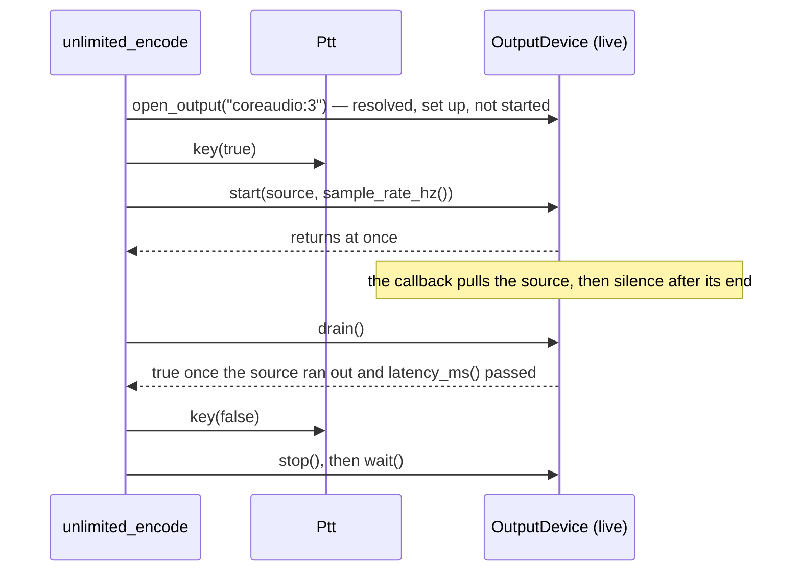

#### Device specs

| Spec | Opens |
|---|---|
| `coreaudio:<number>`, `coreaudio:<name part>`, `coreaudio:<UID>` | a CoreAudio device (macOS) |
| `alsa:<number>`, `alsa:<name part>`, `alsa:<UID>`, `alsa:<PCM name>` | an ALSA device (Linux); a target no listed device matches is opened as an ALSA PCM name (`alsa:hw:1,0`, `alsa:pulse`, a name from `~/.asoundrc`) |
| `default` (also `coreaudio:default`, `alsa:default`) | the system's default input or output |
| `wav:<path>`, `<path>.wav` | a WAV file (unchanged) |
| `null` | output: discard; input: no audio (unchanged) |

- A bare number or name (`3`, `CODEC`) is refused (*refinement*: one grammar; a mistyped file name never selects a
  sound card). The error lists the forms and points to `--list-devices`. Another system's backend is refused with
  where it runs (`alsa: devices exist on Linux only; this system uses coreaudio:`).
- **Choosing a device** (`select_device()`), among the devices that have the needed direction:
  1. `default`: the device marked default for that direction;
  2. all digits: the device of that number (refused when out of range or without that direction);
  3. a UID, exactly (refused when that device lacks the direction);
  4. a whole name, case-insensitive: one → it; several → refused;
  5. a part of a name, case-insensitive: one → it; several → refused with every match (number, name, UID) and how to
     choose; none → "no input device matches 'x'", naming devices that match only in the other direction.
  So `-d MacBook` is the microphone for the input and the speakers for the output; `-d CODEC` with two Icoms is refused:

  ```
  coreaudio:CODEC: 'CODEC' matches 2 input devices; choose one by its number (coreaudio:2) or its UID (coreaudio:<UID>):
    2  USB Audio CODEC  AppleUSBAudioEngine:Burr-Brown from TI:USB Audio CODEC:14100000:2,1
    3  USB Audio CODEC  AppleUSBAudioEngine:Burr-Brown from TI:USB Audio CODEC:14200000:2,1
  ```
- Numbers are positions in the list, from 0 (as `kiss_modem`); they can change when devices are plugged in, UIDs do
  not (a CoreAudio UID holds the USB location, e.g. `…:14100000:2,1`).

#### `--list-devices`

`print_devices(stdout)` prints `device_table(list_devices())`: one row per device, two spaces before each column,
numbers right-aligned, widths from the content (UTF-8 names counted in code points), the UID last. `-` = none,
`yes` = present but the count is unknown (ALSA), `any` = any rate (converted). Measured on Gustavo's Mac mini
(2026-09-28):

```
Audio devices (coreaudio):
  #  Name                       In  Out  Default  Rate Hz  Rates kHz                     UID
  0  SAMSUNG                     -    2  out        48000  32 44.1 48 128 176.4 192 768  4C2D3F72-0000-0000-2A1F-010380462778
  1  V-Z632                      2    -             48000  48                            AppleUSBAudioEngine:MACROSILICON:V-Z632:78559787:3
  2  OBSBOT Tiny 4K Microphone   2    -  in         48000  48                            AppleUSBAudioEngine:Remo Tech Co., Ltd.:OBSBOT Tiny 4K:3132000:3
  3  Mac mini Speakers           -    2             48000  44.1 48 88.2 96               BuiltInSpeakerDevice
  4  Microsoft Teams Audio       1    1             48000  48                            MSLoopbackDriverDevice_UID

Choose with --input and --output, or -d for both: coreaudio:<#>, coreaudio:<part of the name>, coreaudio:<UID>, or default.
A part of the name that matches several devices is refused: use the # or the UID.
For example: --input coreaudio:1 --output coreaudio:0
```

On Linux the header says `alsa`, the table lists the configuration's PCMs first (`default`, `pulse`, `pipewire`, …, from
the name hints, without the per-card entries and `null`), then each card's PCM devices by their `plughw:CARD=<id>,DEV=<n>`
UID (the plug layer converts rate, format and channels), and a last line adds: "Any other ALSA PCM name works too:
alsa:hw:1,0, alsa:plughw:CARD=CODEC,DEV=0." An empty list prints "No audio devices found (coreaudio)."; a system with
no backend "This system has no live audio devices: only wav:<path> and null."

#### Real-time rules

- `start()` returns at once; `wait()` blocks until `stop()` or a device error and is true when the device stopped
  without an error; `stop()` only raises a flag and posts a wake-up, so any thread, a sink's `write()` or a signal
  handler may call it (async-signal-safe: an atomic store and `write()`); the worker stops the backend.
- **Input:** the device context copies the first channel of each block into a lock-free SPSC ring (release/acquire on
  its two counters, 2 s at the device rate) and posts; the device's own worker thread empties the ring into
  `sink.write()`, in chunks of up to `k_live_chunk_samples` (1024). What the ring cannot hold (a sink behind by 2 s) is
  dropped and counted in `xruns()`; nothing else is ever dropped. A device error ends it: what came before is
  delivered, then `wait()` is false and `error()` says why.
- **Output:** the device context pulls the source in place (no lock, no allocation: a fixed 1024-sample scratch
  buffer), writes each sample to every channel, and plays silence wherever `read()` returned less than asked, then
  keeps pulling (a source that produces again is played again). The first short read after audio marks the end of the
  source and posts; the service thread takes its time. `drain()` blocks until the source has run out and
  `latency_ms()` has passed since, i.e. the audio has left the device (*refinement*: the end of the source is seen
  only in the real-time callback; `drain()` gives `unlimited_encode` its PTT release point without a wake-up
  mechanism of its own). `drain()` is false when `stop()` or an error came first; the modem, whose source never
  ends, uses `latency_ms()` with its own timing instead.
- **Wake-ups** are a byte on a non-blocking pipe (`Wakeup`): `post()` never blocks or locks (a full pipe already
  holds a pending wake-up), no post is lost, and nothing polls. One post per device callback.
- **Order of start** (found by ThreadSanitizer while building): the backend is started first and the worker second,
  since the worker is what stops the backend; audio delivered in between waits in the ring and its wake-up in the pipe.
- **Rates:** a live device runs at one rate fixed when it is opened: `sample_rate_hz()` (inputs, and outputs as a
  *refinement*); `start()` with another rate is refused ("the device plays at 48000 Hz, not 8000 Hz"). The programs
  resample to and from 8000 Hz (input: `ResamplingSink`; output: `unlimited_encode` renders the encoder at the
  card's rate, `unlimited_modem` plays its 8 kHz core through `ResamplingSource`, §6: open issue 1 resolved). `-r`
  (`rate_hz` of `open_input()/open_output()`): ALSA asks for it (default 48000 Hz) and uses the rate the device accepted; CoreAudio
  refuses any rate but the device's nominal one (*refinement*: changing the nominal rate would change it for every
  program until reset in Audio MIDI Setup), so on macOS `-r` is a check.
- **Channels:** an input takes its first channel (the radio's receive audio on a USB CODEC); an output writes the same
  sample to every channel, so a radio reading the left, the right or both hears it.

#### CoreAudio (macOS)

- One AUHAL unit (`kAudioUnitSubType_HALOutput`) per direction: IO enabled on element 1 (input) or 0 (output), the
  other disabled, then `kAudioOutputUnitProperty_CurrentDevice`. The client format is 32-bit float, interleaved, the
  device's channel count, at the device's current (nominal) rate: no conversion inside the unit.
- Input: `kAudioOutputUnitProperty_SetInputCallback`; the callback renders into a buffer allocated at open
  (`kAudioUnitProperty_MaximumFramesPerSlice` raised to the device's largest IO buffer, `…BufferFrameSizeRange`, so
  a large buffer never fails the render) and delivers the first channel. Output: `kAudioUnitProperty_SetRenderCallback`.
- `latency_ms()` = ⌈(IO buffer + device latency + safety offset + first stream's latency) × 1000 / rate⌉, in frames of
  the output scope (measured: 11 ms on the Teams virtual device, 20 ms on the HDMI TV).
- Property listeners on the device: `DeviceIsAlive` = 0 → error "the device was disconnected";
  `NominalSampleRate` changed → error ("the device's sample rate changed from 48000 to 44100 Hz; start again": the
  programs' resamplers are set for the old rate); `ProcessorOverload` → an xrun. Notifications run on the HAL's own
  thread (`kAudioHardwarePropertyRunLoop` set to NULL once per process), since a command-line program runs no main
  run loop.
- Reading input needs the terminal (or app) to hold the macOS microphone permission; without it CoreAudio delivers
  silence.

#### ALSA (Linux)

- One PCM per direction, opened blocking; hw_params: `RW_INTERLEAVED`, `S16` (native endian), 1 channel asked (the
  plug layer converts; a `hw:` device may give more), the rate asked (`-r`, or 48000 Hz), period 20 ms and buffer
  100 ms asked; after `snd_pcm_hw_params()` the installed rate (`snd_pcm_hw_params_get_rate`), channels, period and
  buffer are read back and used (`kiss_modem` never read the rate).
- Each direction runs on its own thread blocked in `snd_pcm_readi`/`snd_pcm_writei` of one period: the device clock
  paces it, no timer, and `stop()` takes effect within one period. `-EPIPE` (xrun) and `-ESTRPIPE` (suspend) are
  counted and followed by `snd_pcm_prepare`; `-EINTR` is retried; any other error ends the device with its text.
- Nothing is ever drained: the output plays silence between transmissions, so the `-EBADFD` a write meets after
  `snd_pcm_drain` (a `kiss_modem` defect) cannot happen; `stop()` drops what is queued (`snd_pcm_drop`).
- `latency_ms()` = ⌈buffer frames × 1000 / rate⌉ (the writer keeps the buffer full).
- The list probes each card's `hw:` PCM without blocking (`SND_PCM_NONBLOCK`) for its channels and rates; a busy
  device (held by PulseAudio or PipeWire) shows `yes`/`any`. Opening a device by name does not probe.

#### API (`pc/audio.hpp`, additions)

```cpp
class OutputDevice : public AudioOutput {
public:
    virtual ~OutputDevice() {}
    virtual std::uint32_t sample_rate_hz() const { return 0; }  // live: fixed at open; files: 0 until start()
    virtual std::uint32_t latency_ms() const { return 0; }      // from read() to the device's output; 0 for files
    virtual bool drain() { return wait(); }                     // the source ran out and latency_ms() passed
    virtual std::uint32_t xruns() const { return 0; }
    virtual std::string error() const { return std::string(); }
    virtual std::string description() const { return std::string(); }
};

class InputDevice : public AudioInput {
public:
    virtual ~InputDevice() {}
    virtual std::uint32_t sample_rate_hz() const = 0;
    virtual std::uint32_t xruns() const { return 0; }
    virtual std::string error() const { return std::string(); }
    virtual std::string description() const { return std::string(); }
};

std::unique_ptr<OutputDevice> open_output(const std::string& spec, std::string& error, std::uint32_t rate_hz = 0);
std::unique_ptr<InputDevice> open_input(const std::string& spec, std::string& error, std::uint32_t rate_hz = 0);

enum class DeviceKind { null, wav, live, unknown };
struct DeviceSpec { DeviceKind kind; std::string backend; std::string target; };
DeviceSpec parse_device_spec(const std::string& spec);

const unsigned k_channels_unknown = ~0u;
struct DeviceInfo {
    DeviceInfo();
    std::string backend;              // "coreaudio" or "alsa"
    unsigned number;                  // position in the list
    std::string name;
    std::string uid;
    unsigned input_channels;          // 0: none
    unsigned output_channels;
    bool default_input;
    bool default_output;
    std::uint32_t rate_hz;            // current nominal rate; 0: takes the rate asked (ALSA)
    std::vector<std::uint32_t> rates; // offered rates; empty: any or unknown
};
enum class Direction { input, output };
std::vector<DeviceInfo> list_devices();
std::string device_table(const std::vector<DeviceInfo>& devices);
void print_devices(std::FILE* out);
const int k_device_unmatched = -1;
const int k_device_refused = -2;
int select_device(const std::vector<DeviceInfo>& devices, const std::string& target, Direction direction,
                  std::string& error);
```

*Refinements, with reasons:* `DeviceInfo::rate_hz` (the current nominal rate, the one AUHAL runs at, besides the
offered `rates`); `OutputDevice::sample_rate_hz()` (a caller must know a live output's rate before `start()`);
`drain()` (above); `xruns()`, `error()`, `description()` (the programs' status lines, `--debug` and the TUI);
`parse_device_spec()` (a program knows whether a spec is live, e.g. to key PTT or pace a file); `select_device()` and
`device_table()` public (tested on synthetic lists, including the two-Icom case, without the hardware).

The real-time machinery (`pc/audio_live.hpp`, shared by both backends and the tests' stand-ins): `Wakeup`,
`SampleRing`, `DeviceStatus` (xruns, failure), `InputFeed::deliver()`, `OutputFeed::fill()`, the backend interfaces
`CaptureBackend { start(InputFeed&), stop(), sample_rate_hz(), description() }` and `PlaybackBackend` (plus
`latency_ms()`), and `LiveInput`/`LiveOutput`, which implement the rules above for any backend. Files:
`pc/audio_coreaudio.cpp` (`__APPLE__`), `pc/audio_alsa.cpp` (`__linux__`), `pc/audio_live.cpp` (the machinery and
the "no live backend" fallback of other systems).

#### The shared options (`pc/radio_options.hpp`)

Every program hands the options it does not know to `RadioOptions`, built with the bits it takes
(`k_radio_input` for `unlimited_decode`, `k_radio_output | k_radio_ptt` for `unlimited_encode`, all three for
`unlimited_modem`); `--list-devices` and `-r` come with any device. `-d` names the input, the output or both, as the
program takes them; a later `--input`/`--output` overrides it. Values are checked when read (device specs by
`parse_device_spec()`, `-r` 8000..384000 Hz, `--ptt` names, `--cat-rate`, `--cat-addr`, hex), and `check()` applies the
rules between options: rts, dtr and the CAT methods need `--ptt-device`; `--ptt-device` with vox, `--ptt-invert` (or
`-rts`/`-dtr`) with a method that is not rts/dtr, `--cat-rate` without a CAT method, `--cat-addr` without icom and
`--cat-tx-on/off` without cat are refused; cat needs both commands; `--ptt-device` refuses a value starting with `-` (a
forgotten argument). `-rts`/`+rts` set the inversion, plain `rts` keeps `--ptt-invert` in any order.

```cpp
const unsigned k_radio_input = 1u;
const unsigned k_radio_output = 2u;
const unsigned k_radio_ptt = 4u;
const std::uint32_t k_min_device_rate_hz = 8000;
const std::uint32_t k_max_device_rate_hz = 384000;

struct RadioOptions {
    explicit RadioOptions(unsigned uses);
    bool takes(const std::string& option, bool& has_value) const;
    bool apply(const std::string& option, const std::string& value, std::string& error);
    bool check(std::string& error) const;
    std::string help() const;

    unsigned uses;
    bool list_devices;
    std::string input;
    std::string output;
    std::uint32_t rate_hz;
    PttOptions ptt;
};

bool parse_ptt_method(const std::string& text, PttOptions& options, std::string& error);
bool parse_cat_address(const std::string& text, std::uint8_t& address, std::string& error);
bool parse_cat_rate(const std::string& text, std::uint32_t& rate, std::string& error);
```

`help()` for `unlimited_modem` (the programs' `--help` includes it):

```
Sound devices:
  --list-devices     list every audio input and output (number, name, channels, rates, UID); exit
  -d SPEC            the input and output device: coreaudio:<#|name part|UID> (macOS), alsa:<name> (Linux),
                     default, wav:<path> or null; a name part matching several devices is refused
  --input SPEC       the input device alone (the radio's receive audio)
  --output SPEC      the output device alone (audio to the radio's modulation input)
  -r HZ              open a live device at this rate (default: the device's own; CoreAudio: its nominal rate)
PTT:
  --ptt METHOD       vox, rts, +rts, -rts, dtr, +dtr, -dtr, icom, yaesu, kenwood, cat (default vox)
  --ptt-device DEV   the serial port of rts, dtr and the CAT methods
  --ptt-invert       lower the line to key (the same as -rts or -dtr)
  --cat-rate BAUD    CAT serial speed, 8N1: 1200, 2400, 4800, 9600, 19200, 38400, 57600, 115200 (default 19200)
  --cat-addr ADDR    icom: the radio's CI-V address in hex, 0x94 or 94h (default 0x94, the IC-7300's;
                     IC-705: 0xA4; the radio's CI-V menu shows it)
  --cat-tx-on HEX    cat: the bytes that key the radio, e.g. FEFE94E01C0001FD
  --cat-tx-off HEX   cat: the bytes that unkey it, e.g. FEFE94E01C0000FD
```

#### Build (`Makefile`)

`PC_LIBS` by `uname -s`: macOS `-framework CoreAudio -framework AudioToolbox -framework CoreFoundation` (no
`-framework AudioUnit` needed: the AUHAL calls are in AudioToolbox); Linux `-lasound -lpthread -lutil`; others
`-lpthread`. Appended to the link line of every binary built from `pc/` (`unlimited_encode`, `unlimited_decode`, the
test and long-suite binaries, `doc_figures`, and `unlimited_modem`: `make modem`, part of `make all`); **a new
program linking `$(PC_OBJ)` must add `$(PC_LIBS)` too.** `check_embedded` compiles the core alone and never sees
them.

### 12.6 The programs on live audio

**In plain words.** On a sound card the programs run in real time, and the sound card's own thread is never kept
waiting: it only copies samples. Receiving, the card's samples go to a worker thread, which measures the level, runs
the decoder and draws the view; the program waits until you press Ctrl-C, then prints what it heard. Sending, the
card's thread asks the encoder for each block of audio as it plays; the main thread keys the radio before the first
sample, draws the view from notes the card's thread leaves in a mailbox that never blocks, and releases the radio
once the last sample has left the card. Ctrl-C never kills a program that holds a keyed radio: it stops the card,
and the program then releases the PTT, draws its last frame, gives the terminal its cursor back and prints the
summary. A level meter shows how loud the audio is (peak and RMS in dBFS) and counts the samples that hit full scale.

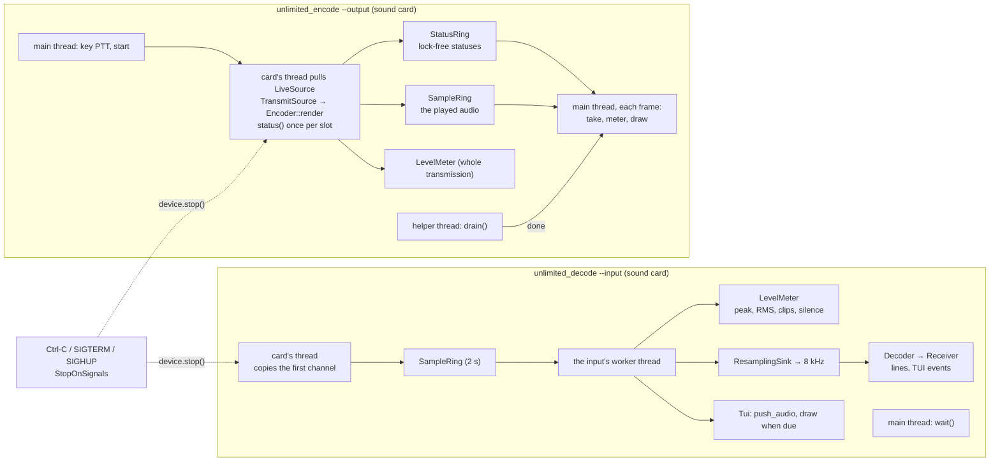

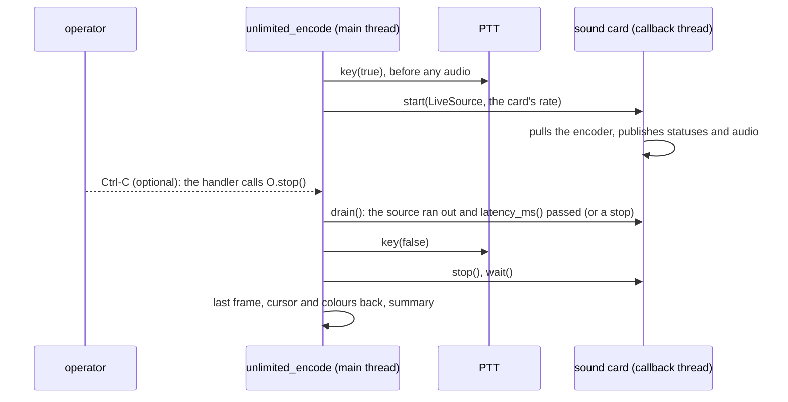

**Exact rules.**

*Receiving (`unlimited_decode --input <sound card>`).*
- The input device calls its sink from its worker thread, never from the card's real-time callback (§12.5). The sink
  chain is `MonitorSink` (the level meter, the view's audio, the warnings, the frame when due) → `ResamplingSink`
  (card rate → 8000 Hz) → `ClockedSink` → `DecoderSink`; the decoder's events (the `Receiver`: the printed lines, the
  TUI's events) run inside it, on the same thread. The main thread waits in `wait()` until a signal or a device error.
- No silence is fed before a sound card (a file gets 15 slots, V6): a card may start in the middle of a transmission,
  which the receiver lets pass. **The receiver must hear 10 quiet slots (1 s at 1 byte/s) before a transmission's
  first tone** (the fresh-tone rule, §3.2): start the receiver before the sender.
- After the device stops, the resampler is flushed and the look-ahead plus 2 windows of silence are fed
  (`k_drain_windows`), so a transmission that ended just before Ctrl-C is printed whole; one still running is closed
  ("the input ended").
- Lines on a sound card, besides the file lines: `input` at the start ("coreaudio:5 Microsoft Teams Audio (48000 Hz,
  1 channel), resampled to 8000 Hz; listening until Ctrl-C"); a `level` line after each lock's bandwidth line ("input
  peak -3.0 dBFS, RMS -10.9 dBFS, 0 clips": the last whole meter window); at the end `input` ("listened 9.696 s,
  stopped by Ctrl-C (SIGINT): peak -3.0 dBFS, RMS -12.2 dBFS, 0 clips; 0 xruns": the whole listening) and
  `received` ("39 bytes, 1 lock") (*measured* examples, §9).
- **Warnings** (stderr, each once; held while the TUI is open): the input stays at digital silence (every sample 0)
  for `k_silence_warning_s` (3 s): "the input has been digital silence (every sample 0) for 3.0 s: nothing plays into
  it, or the system gives this program silence (macOS: allow the terminal in System Settings > Privacy & Security >
  Microphone)"; the input clips (a sample at full scale): "the input clips (samples at full scale) from t 12.3 s: turn
  the radio's audio output or the sound card's input level down; the summary counts the clipped samples". A radio's
  audio is never exact zeros; a virtual device with nothing playing into it is (§9 shows it).
- Memory stays bounded while listening for hours: a sound card's received bytes are let go once their transmission
  is printed (kept with `--expect`, which needs them); the lines held while the TUI is open are at most
  `Console::k_max_held_lines` (100000, the newest kept; "(N earlier lines not kept while the view was open)").

*Sending (`unlimited_encode --output <sound card>`).*
- The encoder renders at the card's rate (`OutputDevice::sample_rate_hz()`; `EncoderConfig` takes 8000..192000 Hz):
  no resampler. The configuration is checked first at 8000 Hz, before any device is opened (a rule that holds there
  holds at any higher rate), then at the card's rate (a card above 192 kHz: exit 3, the reason printed).
- **The card's thread pulls `LiveSource`**, which reads `TransmitSource` (or, with `--channel`, the audio the
  simulator made of it: the simulator is not streaming, so its audio is rendered first and played from memory),
  measures the level of the whole transmission and, with a view, publishes the audio. `TransmitSource` is the
  encoder's producer and consumer at once (§2.5): it refills the queue from the data (fixed before `start()`) and
  renders in steps of 16 samples (`k_render_step`), reading `status()` after each step and reporting each new slot's
  status once. In the callback nothing locks or allocates: the rings and the meter are allocated before the device
  starts.
- **PTT order:** the port is opened with the device (unkeyed); `key(true)` before `start()`; `drain()` until the
  source has run out and `latency_ms()` has passed (the audio has left the card); `key(false)`; `stop()`; `wait()`.
  With RTS, DTR or CAT the first START comes after the TX delay (100 ms of lead-in by default, §7): *measured* with a
  stand-in card at 48 kHz, 4800 samples of silence follow the key, then the START's ramp. A PTT that cannot be keyed
  plays nothing (exit 3); one that cannot be released says "PTT: releasing failed; the radio may still be keyed"
  (exit 3).
- Lines on a sound card, besides the file lines: `output` (the device: "coreaudio:5 Microsoft Teams Audio (48000 Hz,
  1 channel), latency 11 ms") and `ptt` (its description) before the transmission; after it `audio` ("325607 samples
  at 48000 Hz -> coreaudio:5 …"), `output` ("peak -3.0 dBFS, RMS -10.6 dBFS; 0 xruns": the whole transmission) and,
  when a signal stopped it, `stopped` ("by Ctrl-C (SIGINT) after 16 of 119 bytes; the PTT released").

*The views on live audio.*
- The decoder's view runs on the input's worker thread (it observes the decoder there) and draws when a frame is due
  (`RefreshPacer`, 20 Hz), as for a file; the main thread touches it again only after `wait()` returned (the final
  frame).
- The encoder's view runs on the main thread. The card's thread publishes each new slot's `EncoderStatus` into a
  `StatusRing` (`k_view_statuses` 1024: 4 s at 25 bytes/s) and the played audio into a `SampleRing` (1 s); the main
  thread waits on a condition variable until the next frame is due or the helper thread that waits in `drain()` is
  done, then takes everything published (`on_encoder_status()` for each status, in order; the audio into the scope,
  spectrum and meter) and draws. A full ring drops what does not fit and counts it (`StatusRing::dropped()`); it never
  blocks the card.
- **Ctrl-C** (`pc::StopOnSignals`, created around the listening or the transmission): SIGINT, SIGTERM and SIGHUP call
  the device's `stop()` (async-signal-safe: an atomic store and a byte on a pipe, §12.5) and are counted; every one
  calls it again; the program is never ended by them, so the PTT is always released. The program then draws the final
  frame (`Tui::close()`), restores the cursor and colours, prints the held lines and the summary. The handlers in
  place before come back afterwards (the TUI's own restore hook included). An ignored signal stays ignored (a program
  started with `nohup`, or in the background by a shell without job control, where SIGINT is ignored: `kill -INT`
  then does nothing, `kill -TERM` stops it).
- **A resize** is followed at the next frame: each frame reads the terminal's size, and a frame of another size
  clears the screen first (`next_frame()`); no SIGWINCH handler is needed at 20 frames per second.
- **The status items** (after the state item, so they stay on the first rows): decoder `in peak -12.3 dBFS, RMS -28.4
  dBFS, 0 clips` (`in digital silence` for zeros, `in no audio` before any sample), then the warning item while the
  input stays at digital silence (`digital silence 5 s: microphone permission?`); encoder `out peak -3.0 dBFS, RMS -9.6
  dBFS`; fields `ptt vox` (encoder on a card), `fade bridge on` (decoder, when on). The same meter feeds the views of
  files. The decoder's state item shows DCD as `Decoder::dcd()` has it (V19, V20): "TRACK, DCD on", otherwise "DCD
  off".

*The level meter* (`pc::LevelMeter`; `level_text()`).
- Full scale is 32768: peak dBFS = 20 log10(max |x| / 32768), RMS dBFS = 20 log10(sqrt(mean x²) / 32768); a
  full-scale sine reads peak 0.0 and RMS -3.0 dBFS, a half-scale one -6.0 and -9.0; digital silence reads -infinity
  ("digital silence"). One decimal, never "-0.0".
- A **clip** is a sample at -32768 or +32767 (the converter ran out of range; a float input is clamped there).
- `recent()`: the last whole window of `k_level_window_ms` (300 ms, a VU meter's integration time; the window being
  filled until the first one is whole); `total()`: everything since the start; `silent_seconds()`: how long every
  sample has been 0. Another sample rate starts the recent level and the silence over. `push()` is arithmetic only,
  so the output callback may call it.

*`unlimited_modem --tui`.*

*In plain words:* the terminal shows what the radio hears (the decoder's view: each window's bars, the scope, the
spectrum, the input level) and, on the first status lines, what the modem is doing: is the channel busy, is PTT keyed,
how far the frame on the air has got, how many frames wait, and how many went each way. The monitor and debug lines
wait until the view closes.

At 80 × 24 (*measured* on 2026-09-28, colours removed: modem A with the view on the "Microsoft Teams Audio" loopback
device, keyed by VOX, 13 of a 27-byte frame's windows sent; its receiver hears silence while keyed, M4, so its window
view waits for a lock):

```
 RX coreaudio:Teams │ SEARCH, DCD off │ channel clear (DCD off) │ PTT on (vox)
 TX sending 13 of 27 bytes │ queue 0 frames waiting │ frames tx 0, rx 0
 in peak -3.0 dBFS, RMS -10.2 dBFS, 0 clips │ 6.00 bytes/s, 48.0 bit/s
── scope 33 ms  peak -3.0 dBFS ────────────────────────────────────────────────
```

- **The modem's items**, from the snapshots (`counters()`, `dcd()`, `transmitting()`, `channel_state()`):

| Item | Values |
|---|---|
| channel | `clear (DCD off)` or `busy (DCD on)`: V19's DCD, a transmission is being decoded |
| PTT | `on (METHOD)` or `off (METHOD)`: vox, rts, dtr, icom, yaesu, kenwood, cat |
| TX | `idle`; `waiting for the channel`; `sending n of m bytes` (n: the bytes whose windows are complete; m: the frame's size); `sending n bytes` (a frame longer than the queue, its end not yet arrived); `sent, PTT releasing` |
| queue | `N frames waiting` (`1 frame`), not counting the one on the air |
| frames | `tx N, rx M`: transmissions sent, receptions passed to the computer; `, K short dropped` when V23 dropped receptions shorter than `--min-frame` |

- **Placement.** The modem's items come right after the receiver's state (`Tui::set_front_field()`, §6), so they stay
  on screen in an 80 × 24 terminal. Then the input level, the speed, the pitch, the slot, the SNR, the bandwidth line,
  the passband and the receiver's counters; last the threshold, the fade bridge, the lead and the output latency. The
  receiver's state item and the channel item show the same DCD (`Modem::dcd()`, V20; M14 resolved).
- **Threads.** The receiving side (the input worker, never an audio callback) feeds the level meter and the view and
  draws it at most 20 times a second (`RefreshPacer`); the output callback never draws. While the view is open the
  monitor and `--debug` lines are held (the latest 1,000; how many were dropped is printed) and printed after it
  closes. The terminal is restored on every exit path.
- **Refusals** (exit 2): `--tui` with a null input (nothing to show), and with `--list-devices`, `--loopback`,
  `--test-ptt` or `--test-tx`.

### 12.7 The ESP32 KISS TNC

**In plain words.** An ESP32 board between a computer and a radio makes a packet-radio TNC: the computer's AX.25 (or any
KISS) program sends it KISS frames over the USB serial cable, and the board sends each frame on the air as one Unlimited
transmission; everything the board hears comes back to the computer as KISS frames. It is the same modem as the PC's
`unlimited_modem` — the same portable core, the same rules of §12.1 (DCD, dwait, p-persistence, the TX delay, the minimum
frame of 15 bytes) — without a PC sound card: the ESP32 listens through its ADC and speaks through a pin. The whole
TNC costs a few dollars: an ESP32 DevKit, twelve resistors and capacitors, and a transistor for PTT.

**Status (2026-09-28): built and proven on the PC; no board has run it yet.** Unproven until a board runs it: the
levels of the ADC and of the RC network, the PTT circuit, the real CPU numbers (the table below is an estimate), the
order of the two I2S1 slots (bench step 5, §11 E2) and the USB serial behaviour (§11 E3). There is no flow control
on the USB serial cable: keep an AX.25 program's MAXFRAME × PACLEN under about 2 KB (§11 E4).

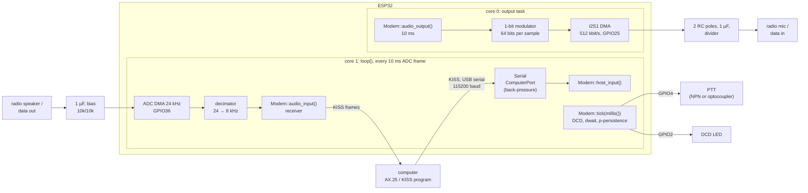

**Files.** `examples/arduino/kiss_tnc_esp32/kiss_tnc_esp32.ino` (the settings, the wiring in its header comment, the
hardware: ADC, I2S, Serial, GPIOs, the output task) and `kiss_tnc.h` next to it (the parts that touch no hardware:
`Decimator`, `OneBitModulator`, `ComputerPort` and the output path's constants), which `tests/test_kiss_tnc.cpp` also
builds on the PC. For the classic ESP32 only (`#error` on another target: the ADC's DMA mode and I2S1 are the classic
chip's). `make arduino_check` builds it for `esp32:esp32:esp32`.

**Contexts (§12.2).** `loop()` runs on core 1 (the Arduino loop task) and is the receive, computer and control context:
it blocks in `adc_continuous_read()` until the next 10 ms frame (timeout 100 ms), decimates it, calls `audio_input()`
(the host handler writes the modem's KISS bytes to `Serial` from there), serves the computer (`ComputerPort::service()`
→ `host_input()`), calls `tick(millis())` and sets the DCD LED from `dcd()`. The output task (core 0, priority 5,
4 KB of stack) is the audio context: `audio_output()` for 10 ms (80 samples), the modulator, then
`i2s_channel_write()`, which blocks until a DMA buffer is free. Nothing polls: the ADC's frames pace `loop()` (so
`tick()` runs every 10 ms, which is its resolution for dwait, the slot time and the release; `next_tick_ms()` is not
needed), the DMA paces the output task. The modem is built in `setup()` into static storage (`alignas(Modem)`, placement
new: no heap in the core) after its settings are checked.

**Audio in (as `rx_esp32`).** GPIO36 (ADC1 channel 0, usable with Wi-Fi on), 12 dB attenuation (0.15–2.45 V), 12 bits,
`adc_continuous` at 24 kHz (the DMA cannot sample below 20 kHz) in frames of 240 conversions (10 ms), a pool of 8 frames
(80 ms of slack for the receiver's slowest pass). `Decimator` (`rx_esp32`'s, unchanged): a DC blocker (pole 0.999,
about 4 Hz), then a 47-tap Hamming-windowed sinc (cutoff 4 kHz) evaluated at every third input, ×16 to the int16 scale.
*Measured* (§8): flat within ±0.04 dB from 300 to 3000 Hz; what would fold onto the band from above 4 kHz 54.8 dB down
or more.

**Audio out.** Why not the DAC: V26 (§11 E1, confirmed by Gustavo for v1.0). As built:

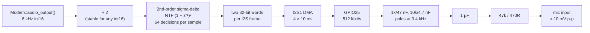

- **I2S1**, standard mode, master, TX only: 8000 frames per second of two 32-bit slots (stereo), MSB format
  (`bit_shift` off), `ws_pol` false and `msb_right` false (the left slot first: §11 E2), MCLK 256 × 8 kHz = 2.048 MHz
  from the 160 MHz PLL (divider 78.125, exact), BCLK 512 kHz. Only the data line leaves the chip (GPIO25; MCLK, BCLK and
  WS are unused pins). DMA: 4 descriptors of 80 frames (640 B, 10 ms each), all preloaded with silence before the start
  so the pin never rests low; `auto_clear` off (the output task never lets the DMA run dry).
- **The modulator** (`OneBitModulator`): error feedback with the noise transfer (1 − z⁻¹)² = 1 − 2z⁻¹ + z⁻²
  (`k_error_tap` 2), quantizer levels ±32768 (`k_one`), the input halved (`k_input_divisor` 2: a second-order loop fed
  at full scale runs away, halved it is stable for any int16), each sample held for its 64 decisions, written MSB first
  (a 1 drives the pin high). Silence gives the pattern 1001…: exactly half ones in every sample, 1.65 V after the
  filter. *Measured* on the PC through the wiring's RC poles (§8): 80.7 dB of SNR in 300–2700 Hz for a full-scale
  1500 Hz tone; at −20 dBFS the noise 80.0 dB under a full-scale crest; with the two slots swapped 32.6 dB (§11 E2).
- **Level**: `k_output_crest` is full scale (`INT16_MAX`; the PC modem's −3 dBFS is headroom for its resampler, which
  this path does not have). A full-scale crest moves the pin's average by ±0.25 of the 3.3 V supply (1.65 V p-p); at
  1500 Hz the sample hold, the loaded RC network (1.07 V p-p after the poles) and the divider give **10.6 mV p-p** at an
  open mic input (7.2 mV into 1 kΩ), 98 mV p-p with 4.7 kΩ for the 470 Ω, up to 193 mV p-p with a 10 kΩ trimmer
  (*computed* from the component values). The radio's level is set with the network, not in the sketch.
- **Latency and PTT release**: `k_output_latency_ms` = (4 buffers + 1) × 10 ms = 50 ms, the time from `audio_output()`
  to the last sample of that chunk leaving the pin (`AccessConfig::output_latency_ms`). *Measured* in the PC model with
  the DMA's queue: the first beep reaches the pin 150–151 ms after the key (the 100 ms TX delay and the queue), the last
  one leaves 101–111 ms before the release (the 100 ms tail), and 11 ms before it with the shortest tail (2 slots).
- **CPU**: the inner loop is 14 Xtensa instructions per bit in the `-Os` build (read from the disassembly of the sketch's
  ELF), about 16 cycles with the taken branch (*estimate*): 512,000 bits/s × 16 = 8.2 M cycles/s, **about 3.4 % of
  core 0** at 240 MHz; `audio_output()` itself well under 0.1 %.

**PTT.** `on_ptt()` drives `k_ptt_pin` (GPIO4) to `k_ptt_active_level` (HIGH) while transmitting, from `tick()` (the
control context), through an NPN transistor or an optocoupler (wiring below); a 10 kΩ pull-down keeps it off while the
ESP32 boots. The TX delay (`k_txdelay_ms`, 100 ms, Gustavo's default of 2026-09-28, §2.1) is silence after keying;
with the fade bridge at least 300 ms (`ModemConfig::sent()`). **VOX** (`k_vox` true): no pin is driven; each
transmission starts with the lead tone (`k_vox_lead_ms`, 150 ms) and 2 silent slots (§2.1), and the TX delay is not
used.

**DCD.** GPIO2, the on-board LED of most DevKits: on while a transmission is being decoded (`Modem::dcd()`, §3.10).

**The computer's port.** `Serial` at 115200 baud (`k_serial_baud`), receive buffer 1024 bytes (89 ms at that speed).
`ComputerPort::service()` reads up to 256 bytes when everything read before has been taken, hands them to
`host_input()`, and when the modem takes fewer (the send queue, 2048 bytes on an MCU, or its 64 frame slots are full)
keeps the rest and stops reading the port: the serial driver's buffer holds what follows (back-pressure; no flow control
reaches the computer, §11 E4). The host handler writes the modem's KISS bytes to `Serial` as they come (§12.1, V23).
After a reset the board writes its settings in a few text lines and then one FEND, so a KISS program that read the text
starts in step (the ESP32's ROM prints its boot text on the same port anyway); after that, only KISS. A setting the modem
refuses (the signal does not fit the passband) is written instead, and the TNC stops; the ranges are checked when
compiling (`static_assert`). The p-persistence seed mixes `esp_random()` with the chip's MAC address: two TNCs never draw
the same numbers.

**Settings** (named constants at the top of the sketch; each with a comment in plain words there):

| Constant | Default | Meaning |
|---|---|---|
| `k_centi_bytes_per_second` | 600 (6.00 bytes/s) | the speed, 100..2500; the same at both stations |
| `k_tone_hz` | 1500 | this station's pitch, 300..2700 Hz |
| `k_passband_low_hz`, `k_passband_high_hz` | 300, 2700 | the radio's audio passband (AM 100..3000, FM 300..3000) |
| `k_threshold_percent` | `k_threshold_auto` (0) | the adaptive decision line, or a fixed line at 50..90 % |
| `k_min_frame_bytes` | 15 | receptions shorter never reach the computer (V23); 0 = off |
| `k_dwait_ms`, `k_persist`, `k_slot_time_ms` | 1500, 63, 100 | the channel check (§12.1) |
| `k_fade_bridge` | false | V16, both stations must agree |
| `k_ptt_pin`, `k_ptt_active_level` | 4, HIGH | PTT |
| `k_txdelay_ms`, `k_txtail_ms` | 100, 100 | silence after keying, before the release |
| `k_vox`, `k_vox_lead_ms` | false, 150 | VOX instead of the PTT pin |
| `k_output_crest` | `INT16_MAX` | the beeps' crests in the modulator |

Pins and hardware constants: audio in GPIO36, audio out GPIO25, DCD LED GPIO2; `k_pool_frames` 8, `k_read_timeout_ms`
100, the output task's stack 4096 B, priority 5, core 0; in `kiss_tnc.h`: `k_chunk_ms` 10, `k_dma_buffers` 4,
`k_output_latency_ms` 50, `k_host_read_bytes` 256.

**Wiring** (classic ESP32 DevKit; all grounds joined, the radio's audio ground included):

```
Receive audio (radio speaker or data out -> GPIO36), as rx_esp32:

  radio audio out --||--+------------ GPIO36 (VP, ADC1 channel 0)
                   1uF  |
          3V3 --[10k]---+---[10k]-- GND          bias at mid-scale, 1.65 V
  under about 1.5 V p-p; the band's hiss plainly there with no signal (tens of mV)

Transmit audio (GPIO25 -> radio mic or data in):

  GPIO25 --[1k]--+--[10k]--+--||--[47k]--+-- radio mic / data input
                 |         |  1uF        |
               47nF      4.7nF        [470R]      (4.7k: a data input, about 100 mV p-p;
                 |         |             |          a 10k trimmer, wiper out: 0..190 mV p-p)
                GND       GND           GND
  the 1k and the 47 nF right at the pin: the stream switches at up to 512 kHz

PTT (active HIGH):

  GPIO4 --[1k]--+-- base  NPN (2N2222, BC547): emitter GND, collector the radio's PTT line
                |
              [10k]       off while the ESP32 boots
                |
               GND
  or an optocoupler (PC817): GPIO4 --[330R]-- LED anode, cathode GND; the phototransistor across PTT and its ground

DCD: GPIO2, the on-board LED (or an LED and 330R to GND)
```

**Sizes** (`make arduino_check`, *measured*): 350,448 B of flash (26 %), 48,628 B of static RAM (14 %; the modem core
20,192 B of it). From the heap at start (*expected*, the configured sizes): the ADC pool 3,840 B, the I2S DMA buffers
2,560 B, the output task's stack 4,096 B, the serial receive buffer 1,024 B — about 11.5 KB of the 279 KB the build
leaves.

**CPU** (*estimate*; `loopback_esp32` measures the receiver on a board). *Measured* on the M4, per second of audio,
while the board's core decodes 64-byte frames back to back at 10 dB (two runs): the decimator 65–73 µs, the receiver
(`audio_input()` and `tick()`) 185–235 µs, `audio_output()` 1–2 µs, the modulator 714–783 µs (integer work, estimated
on the ESP32 from its instructions instead). With §3.9's factor of 50–200 for float work on the ESP32 at 240 MHz:

| Speed | Core 1: decimator and receiver (mean) | Core 0: output | Worst 10 ms pass of `loop()` |
|---|---|---|---|
| 6 bytes/s | 1.4–6.2 % | about 3.4 % | M4 30–41 µs: at most about 8 ms on the ESP32 |
| 12 bytes/s | 1.4–5.5 % | about 3.4 % | M4 11–27 µs: at most about 5.5 ms |
| 25 bytes/s | 1.3–5.0 % | about 3.4 % | M4 28–35 µs: at most about 7 ms |

The receiver's mean cost hardly depends on the speed (its per-sample work dominates); the decoder's own worst block
(§3.9: 3–15 %, 5–22 %, 8–37 % of a block's time) sits inside these passes. A pass longer than 10 ms is absorbed by the
ADC's pool (80 ms); the M4's worst passes include the operating system's own interruptions.

**Proof without a board** (§8, §9): `make arduino_check` builds it warning-free; `tests/test_kiss_tnc.cpp` runs
`kiss_tnc.h` on the PC in the sketch's call sequence against a PC modem core, both ways, byte for byte, with the wires
modelled; three defective copies of `kiss_tnc.h` fail it. Not modelled: the ESP32 ADC's nonlinearity, the I2S slot order
on silicon (§11 E2), FreeRTOS scheduling, the USB-serial bridge and the radios' audio stages.

**Bench procedure** (Gustavo; *expected* results):

1. **Build and flash.** From the library's folder: `arduino-cli compile --fqbn esp32:esp32:esp32 --library .
   examples/arduino/kiss_tnc_esp32`, then `arduino-cli upload --fqbn esp32:esp32:esp32 -p /dev/cu.usbserial-XXXX
   examples/arduino/kiss_tnc_esp32` (Linux `/dev/ttyUSB0`). Open the port at 115200 (`arduino-cli monitor -p
   /dev/cu.usbserial-XXXX -c baudrate=115200`) and press EN: the settings lines appear ("Unlimited KISS TNC: … speed
   6.00 bytes/s (T 16667 us), pitch 1500 Hz", the occupied band 1368–1632 Hz, "PTT on GPIO4 (high to transmit), TX delay
   100 ms, tail 100 ms", …). Close the monitor.
2. **Wiring check with a meter.** GPIO36 at 1.65 V with no audio; after the 47 nF/4.7 nF at GPIO25 a steady 1.65 V
   (silence is half ones); GPIO4 low.
3. **Direct cable to a PC sound card** (no radio): GPIO25's network to the card's input (a line input: take the audio
   after the 1 µF, about 1.1 V p-p on the crests), the card's output to GPIO36's network with the volume under
   1.5 V p-p. On the PC: `unlimited_modem --list-devices`, then `unlimited_modem -d coreaudio:N --bps 6 --monitor`
   (Linux `-d alsa:N`).
4. **Both ways with a KISS program** (AX25Toolkit's `ax25tnc` keeps the port open; opening it may reset a DevKit, which
   is ready again about a second later): on the board's port `ax25tnc -m unproto -M -b 115200 -c N0CALL-1
   /dev/cu.usbserial-XXXX`; on the PC `ax25tnc -m unproto -M -c N0CALL-2 /tmp/unlimited`. Type a line on the board's
   side: GPIO4 goes high for the frame (about 6.3 s for 20 characters at 6 bytes/s, header, TX delay and tail
   included), the PC's monitor prints the frame N0CALL-1>CQ with its pitch (1500 Hz ± the card's clock) and SNR, and
   the PC's ax25tnc shows it. Type a line on the PC's side: the board's DCD LED lights while it decodes, and the board's
   ax25tnc shows N0CALL-2>CQ once the 15th byte is in (2.3 s after the first at 6 bytes/s).
5. **The 1-bit output's cleanliness** (§11 E2): record the board's beeps through the direct cable with any audio
   program (e.g. Audacity) and plot the spectrum of a stretch of beeps. In the right slot order the tone and its keying
   sidebands fall to the sound card's own noise floor within about 500 Hz of the tone; with the slots swapped a flat
   floor stays across the whole 300–2700 Hz band, about 30 dB under the tone (the TUI's spectrum, 60 dB tall in two text
   rows, is too coarse for this).
6. **Through radios**: the board on one radio (mic or data input through the divider or the trimmer, PTT through the
   NPN), the PC's `unlimited_modem` on another with its `--ptt` method, both at the same `--bps`. Set each transmitter's
   audio for full power on the beeps with the ALC not moving; each receiver's audio so that its hiss is plainly there
   (tens of mV at the ESP32's input) and the beeps stay under 1.5 V p-p. Repeat step 4 at 6 and at 25 bytes/s (FM), and
   with `k_vox` true on a VOX radio.
7. **CPU on the board**: flash `loopback_esp32` once; it prints the decoder's µs per second of audio and its longest
   call per speed: these replace the estimate above.

### 12.8 Proof and CI

- **Unit tests** (`make test`, §8): the KISS codec, the send queue, the channel check on a simulated clock, the
  streaming rules and the minimum frame (`test_modem.cpp`, 28); the command line, the banner's words, the lead options
  measured on the rendered samples and the `--tui` items (`test_modem_cli.cpp`, 11); two modem cores through the
  channel simulator (`test_modem_link.cpp`, 4: frames byte for byte at 20 dB and at gate + 3 dB, none merged or split,
  a conversation, back-to-back VOX frames); the four contexts on nine threads (`test_modem_threads.cpp`, 1); the PTY's
  raw mode and link, the serial port (`test_kiss_port.cpp`, 4); the output resampler (`test_resampling_source.cpp`,
  4); PTT and CAT byte sequences on a PTY pair (`test_ptt.cpp`, 8); the ESP32 TNC's glue against a PC modem core
  (`test_kiss_tnc.cpp`, 5, §12.7). `make check_embedded`: two cores with the heap trapped (`modem_trap`), the send side
  linked without the decoder (`send_only`), the ESP32 and Nano sizes (§12.2). `make arduino_check` builds the ESP32 TNC.
- **Real-audio smoke test** (not in `make test`): `sh tools/modem_smoke_teams.sh [BPS]`.
  - Two modems, A and B, share the "Microsoft Teams Audio" virtual device, which loops its output to its input sample
    for sample; they are named by its UID only, so no speaker or microphone is used. The Teams app must not be running
    (the script refuses to run when it is).
  - A sends two frames in one write (a shared FEND, with FEND and FESC in the data) and B must hand its computer the
    same KISS bytes. B answers and A must hand it over. Then `--test-tx` from a third process must reach B. Every frame
    is at least 15 bytes (the default `--min-frame`).
  - Both modems must stop with exit 0 on SIGINT and remove their links. *Measured* on 2026-09-28 (§9): PASS at 6, 12
    and 25 bytes/s, in 19.9, 13.0 and 11.4 s.
- **CAT PTT checks** (scripts run once, a PTY standing in for the radio): each CAT method's bytes under `--test-ptt`
  and in the running modem, including SIGHUP during a transmission (§9).
- **The `--tui` view on live audio** (a script, run once): modem A runs the view under a pseudo-terminal on the Teams
  device while modem B sends it a frame; the view shows the modem's items and the received text, and on SIGINT the
  terminal is restored, the held monitor line printed after the view, exit 0 and the link removed (§9).
- **ThreadSanitizer** (a build with `-fsanitize=thread`, not in `make test`): the modem's tests, among them
  `modem_runs_its_four_contexts_on_four_threads`, give no report (§9).
- **CI:** `.github/workflows/ci.yml`, on every push and pull request, a matrix with `fail-fast: false`: `ubuntu-latest`
  with `CXX=g++` (after `apt-get install -y libasound2-dev`) and `macos-latest` with `CXX=clang++`; steps `make -j4`,
  `make -j4 test`, `make demo_run`, `make check_embedded`. The runners have no sound cards and the tests never play or
  record: CI proves the builds and the tests; only radios prove the audio path (V13).
  - *The first run with the modem and the live programs* (the v1.0.0 tag, 2026-09-28): `make -j4` built every program
    on Linux (g++ 13.3, Ubuntu 24.04, ALSA); `make -j4 test` stopped at compiling `tests/test_resampling_source.cpp`.
    g++ inlined the test's replacement `operator delete` (a `free`) into `std::vector`'s destructor and saw memory
    from `operator new` handed to `free`: a false `-Wmismatched-new-delete` (that `operator new` is a `malloc`), an
    error under `-Werror`; Clang has no such check (§11 M8).
  - *The fix, after the tag:* the replacement `operator new` and `operator delete` stay out of line
    (`[[gnu::noinline]]`), so g++ never sees the pair split; the counter's own check calls `::operator new` directly,
    because a compiler may drop a container's unused allocation (Clang with libc++ does once the counter is out of
    line). *Proof:* GCC 14.2 (the ESP32 core's xtensa g++, a stand-in for Linux's g++; `docs/testing.md` §10) gives
    11 of those warnings before the fix at the Makefile's `-O2` (none at `-O3` or `-Os`, which inline differently)
    and none after at any of the three; on macOS `make test` 312/312, and under ASan and UBSan 312/312 with no
    report.
  - *The second run* (after that fix): the tests ran on Linux and 311 of 312 passed. `decoder_mistuned_and_shifted`
    failed: at 25 bytes/s with the tone at 860 Hz, the first window's pitch was 853.28 Hz, 6.72 Hz off where the test
    allows 6 (macOS: 4.57 Hz). Linux had heard another noise. `std::mt19937` and `std::seed_seq` are exact in the
    standard, so the raw numbers were the same; the distributions are not. libstdc++ returns the two values of
    `std::normal_distribution`'s polar method in the other order (every complex noise sample of the channel had its
    real and imaginary parts swapped) and draws `std::uniform_int_distribution` by another method (Lemire's, where
    libc++ masks and rejects: other Morse). *Proof of the cause:* the tree built on macOS with libstdc++'s two
    algorithms and without fused multiply-add (as x86-64 builds by default) printed the same 853.277344 Hz, and every
    other number of the 312 tests as in CI's Linux log (only the devices, the PTY names and the timings differ).
  - *The fix:* `pc/portable_random.hpp` writes out libc++'s algorithms for `std::mt19937` (`canonical`,
    `UniformReal`, `UniformInteger`, `Exponential`, `Gamma`, `Normal`), and every draw of the channel simulator, of the
    interference scenes and of the tests uses them, so a seed gives the same noise on every system and no number
    measured on macOS moves. *Proof:* 1,000,000 draws of each of 15 distributions and parameters equal libc++'s bit
    for bit, at `-O0`, `-O1` and `-O2`, the engines in step; `make test`, `make test_long` (257 rows: 34 PASS, 2 FAIL,
    221 REPORT) and `make demo_run` print the same numbers as before (timings apart), and `make docs` the same
    figures; the tree built as on Linux passes all 313, differing from macOS only in the last digits of three
    precision notes (a resampler's phase error of 1e-8 rad), where ARM fuses a multiply and an add. The new test
    `channel_draws_repeat_on_every_system` pins the draws to values taken on macOS; with libstdc++'s pair order, or
    its integer method, it fails.
  - *What the other noise showed:* the test's pitch bounds hold for its own draw, not for every draw, at 25 bytes/s
    next to an edge of the search: open problem P20 (§11).
- **Documents:** `docs/modem.md` (the modem for operators: connecting a radio, with pictures; levels and ALC; VOX;
  choosing the speed from measured airtimes; the AX.25 timers; `--min-frame` and `--fade-bridge`; the monitor and the
  view; AX25Toolkit, linbpq and other KISS programs; Linux; troubleshooting; and a bench checklist for each of
  Gustavo's radios: IC-705, IC-7300 MKII, Xiegu X6200 over USB, a radio on VOX or a serial TRS PTT cable, and the
  Digirig; and the ESP32 KISS TNC: flashing, wiring, its bench steps) and `docs/testing.md` (every target, the unit
  tests, the long suite, the modem's tests and the smoke test).
  Menu names and defaults there come from the radios' manuals, cited; what could not be confirmed is marked as a bench
  check (§11 L4).

---

## 13. Roadmap (after v1.0)

| Item | Notes |
|---|---|
| **Arduino Nano modem** | right after v1.0 (Gustavo): an integer receiver on the same format, KISS over the Nano's serial port, proven on the AVR cycle model, then on a Nano. |
| A1's misses at the gate SNR (V25, §11 P2) | 4.0 % and 2.6 % of the bytes at 1 and 6 bytes/s: a more sensitive scan, or gates set for a signal without a preamble; Gustavo's decision. |
| Check and resend | a per-byte "tone CRC" or a frame check, with a resend; parked until after v1.0. |
| Several frames per transmission; KISS over TCP; Windows | parked. |
| Multi-station receiver | several pitches side by side, one light decoder per pitch. |

---

## 14. Glossary

| Term | Meaning |
|---|---|
| Slot | the time unit T; each slot is a beep (tone) or silence |
| Beep | a Tukey-shaped tone burst filling one slot |
| Window | the 10 slots of one byte: START, 8 data slots, STOP |
| START, STOP | the first and last slot of a window, always tones; their levels set the reference for the byte's bits |
| Speed, B | bytes per second, set on both sides; T = 1/(10·B) |
| Pitch, f₀ | the one audio frequency of every beep |
| Anchor | the START of byte 0: the first tone after at least 2 silent slots |
| Look-ahead | the delay (2 T + 200 ms, at most 400 ms) between the pitch search hearing a sample and the slot measurement hearing it |
| Fresh tone | a search bin that stands out again at most 140 ms after being quiet for 10 slots: a transmission starting |
| Takeover | the receiver moving its NCO to a fresh tone while another tone is held |
| Pending window | a window whose START was silent: the end, or a faded START; decided over the next windows |
| Framing error | a window whose START or STOP is missing; its byte is dropped |
| Reference line | the line from a window's START level to its STOP level |
| Threshold, decision line | the level between 0 and 1: the adaptive line by default (50–75 % of the reference), or a fixed share of it (70 % or 50..90 %) |
| DCD | data carrier detect: a transmission is being decoded — the receiver tracks, from its lock to `end` or `lost` (§3.10, V19) |
| Fade bridge | the optional receiver rule of V16: an end needs 2 silent windows and a START 300 ms of silence (or a VOX lead's gap) |
| One byte, one decision | every window decided alone and released at once when readable, the first included (V20, §3.3) |
| Stray byte | a byte released from something that was no transmission (speech, CW): the upper protocol's to drop (V20); the KISS modem drops receptions shorter than its minimum frame (V23) |
| Minimum frame | the KISS modem's `--min-frame` N (default 15, the shortest AX.25 frame; 0 = off): a reception reaches the computer only once it is N bytes long (V23) |
| Settling reference | the running reference over windows 0 and 1: the mean of every marker read so far, the window's own included (V24) |
| KISS | the framing between a computer and a TNC: FEND, FESC, TFEND, TFESC |
| PTT, VOX, CAT | keying the transmitter by a line, by sound, or by a command to the radio |
| OOK | on-off keying: a tone for 1, silence for 0 |
| Lead-in, TX delay | silence after PTT is keyed and before the first START, for the radio to switch to transmit; only at the beginning of a transmission (`lead_in_ms`; 100 ms by default in the programs with RTS, DTR or CAT keying: `--lead-in-ms`, the modem's `--txdelay`) |
| VOX lead | a steady tone before the first START that keys a VOX radio, then 2 silent slots (V8; 150 ms by default where VOX keys the radio) |
| TX tail | silence after the last STOP before PTT is released (`--tail-ms`, the modem's `--txtail`; 100 ms, at least 2 slots) |
| dwait | how long the modem waits after the channel went quiet (DCD off) before contending (`--dwait`, 1500 ms) |
| p-persistence | the KISS rule of channel access: transmit when a random number 0..255 is ≤ `--persist` (63), else wait a slot time (`--slottime`, 100 ms) and draw again |
| Send queue | the bytes of the frames the computer sent and the modem has not put on the air yet (16,384 on a PC, 2,048 on an MCU) |
| Hand-off | a value one context of the modem writes and another reads: written with `store_release()` after the work it announces, read with `load_acquire()` before the work that depends on it (§12.2) |
| PTY | pseudo-terminal: the file a KISS program opens (through the `--link` path, `/tmp/unlimited` by default) as if it were a TNC's serial port |
| TNC | terminal node controller: the box (or program) between an AX.25 program and a radio; `unlimited_modem` is a KISS TNC in software |
| Level meter, dBFS, clip | the programs' input and output levels: peak and RMS in dB relative to full scale (0 dBFS is the loudest a sample can be); a clip is a sample at full scale (§12.6) |
| Loopback device | a virtual sound device that returns what is played into it ("Microsoft Teams Audio" on Gustavo's Mac): two programs on one computer hear each other with no speaker or microphone |
| CI-V | Icom's CAT protocol (also spoken by Xiegu radios): `FE FE <radio> <controller> <command> … FD`; `--ptt icom` keys with command 1C 00 |
| 1-bit output | the ESP32 TNC's transmit audio: a stream of bits on one pin whose share of ones follows the audio (a sigma-delta modulator), made analog by two RC poles (V26) |
| Back-pressure | the computer's bytes wait (in the modem's buffer, or the serial port's) while the modem's send queue is full, instead of being dropped |
